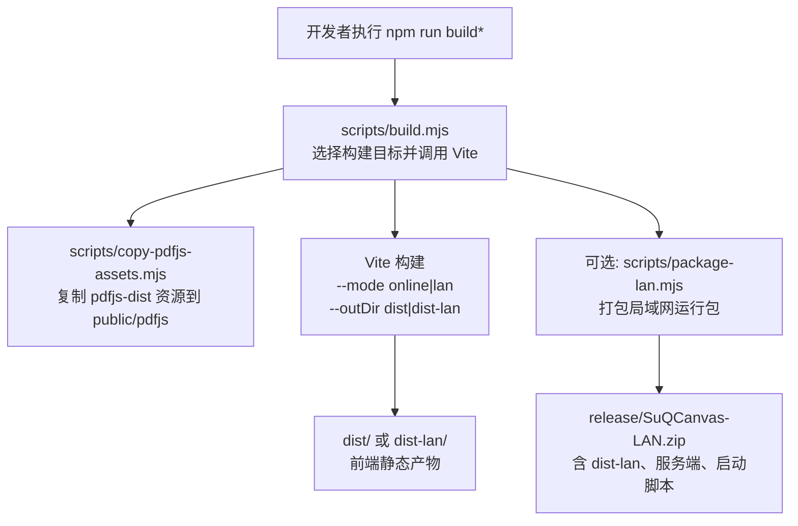
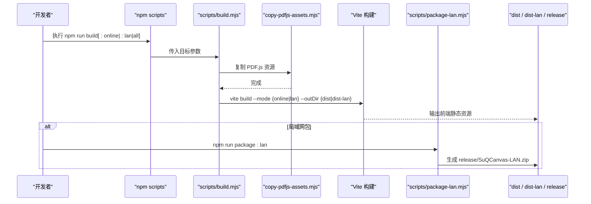
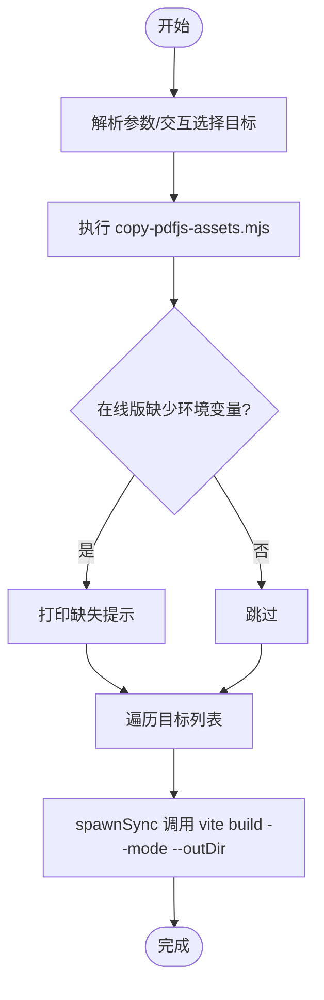
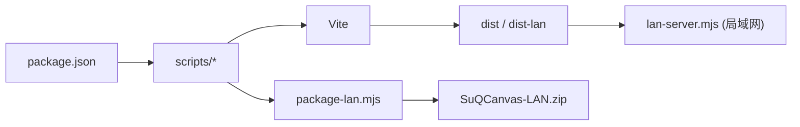

# 生产构建流程

<cite>
**本文引用的文件**
- [package.json](file://package.json)
- [vite.config.ts](file://vite.config.ts)
- [scripts/build.mjs](file://scripts/build.mjs)
- [scripts/copy-pdfjs-assets.mjs](file://scripts/copy-pdfjs-assets.mjs)
- [scripts/package-lan.mjs](file://scripts/package-lan.mjs)
- [src/buildMode.ts](file://src/buildMode.ts)
- [src/sync/supabaseClient.ts](file://src/sync/supabaseClient.ts)
- [src/sync/ossConfig.ts](file://src/sync/ossConfig.ts)
- [server/lan-server.mjs](file://server/lan-server.mjs)
- [scripts/start-lan.ps1](file://scripts/start-lan.ps1)
- [start-lan.bat](file://start-lan.bat)
</cite>

## 目录
1. [简介](#简介)
2. [项目结构](#项目结构)
3. [核心组件](#核心组件)
4. [架构总览](#架构总览)
5. [详细组件分析](#详细组件分析)
6. [依赖关系分析](#依赖关系分析)
7. [性能优化建议](#性能优化建议)
8. [故障诊断与常见问题](#故障诊断与常见问题)
9. [结论](#结论)
10. [附录](#附录)

## 简介
本指南面向生产环境，系统性说明 SuQCanvas 的构建流程与产物分发策略。内容涵盖：
- 构建脚本如何驱动 Vite 打包、复制 PDF.js 资源、生成在线版与局域网版产物
- Tree Shaking、代码压缩、资源优化等机制在本项目的体现
- 不同构建目标（在线版 vs 局域网版）的差异与配置要点
- 构建性能优化建议（并行、缓存、增量）
- 常见构建错误诊断与排障方案

## 项目结构
本项目采用 Vite + TypeScript 的前端工程化方案，并通过 Node 脚本在构建前后完成资源准备与产物封装。关键路径如下：
- 构建入口与任务编排：scripts/build.mjs
- 静态资源预处理：scripts/copy-pdfjs-assets.mjs
- 局域网包封装：scripts/package-lan.mjs
- 运行时服务：server/lan-server.mjs
- 构建模式开关：src/buildMode.ts
- 云端能力裁剪：src/sync/supabaseClient.ts、src/sync/ossConfig.ts
- Vite 基础配置：vite.config.ts
- 脚本命令与依赖声明：package.json

图表来源
- [scripts/build.mjs:17-90](file://scripts/build.mjs#L17-L90)
- [scripts/copy-pdfjs-assets.mjs:5-18](file://scripts/copy-pdfjs-assets.mjs#L5-L18)
- [scripts/package-lan.mjs:6-65](file://scripts/package-lan.mjs#L6-L65)

章节来源
- [package.json:6-20](file://package.json#L6-L20)
- [vite.config.ts:5-16](file://vite.config.ts#L5-L16)

## 核心组件
- 构建编排器：scripts/build.mjs
  - 支持三种模式：仅在线版、仅局域网版、全部
  - 自动调用 PDF.js 资源复制脚本
  - 通过 Vite 的 --mode 注入构建目标，实现条件编译
  - 对在线版缺失环境变量进行警告
- PDF.js 资源拷贝：scripts/copy-pdfjs-assets.mjs
  - 将 pdfjs-dist 的 cmaps、standard_fonts、wasm 复制到 public/pdfjs，确保浏览器可加载
- 局域网包封装：scripts/package-lan.mjs
  - 组装 dist-lan、服务端、Node 运行时、启动脚本，生成 zip 发布包
- 构建模式常量：src/buildMode.ts
  - 基于 VITE_BUILD_TARGET 导出 IS_LAN_BUILD / IS_ONLINE_BUILD，供业务模块做条件分支
- 云端能力裁剪：src/sync/supabaseClient.ts、src/sync/ossConfig.ts
  - 局域网构建时移除 Supabase/OSS 相关依赖，减小产物体积
- Vite 基础配置：vite.config.ts
  - base 路径、插件、开发代理、测试环境等

章节来源
- [scripts/build.mjs:17-90](file://scripts/build.mjs#L17-L90)
- [scripts/copy-pdfjs-assets.mjs:5-18](file://scripts/copy-pdfjs-assets.mjs#L5-L18)
- [scripts/package-lan.mjs:6-65](file://scripts/package-lan.mjs#L6-L65)
- [src/buildMode.ts:1-8](file://src/buildMode.ts#L1-L8)
- [src/sync/supabaseClient.ts:1-18](file://src/sync/supabaseClient.ts#L1-L18)
- [src/sync/ossConfig.ts:1-20](file://src/sync/ossConfig.ts#L1-L20)
- [vite.config.ts:5-16](file://vite.config.ts#L5-L16)

## 架构总览
下图展示了从“执行构建命令”到“产出可部署产物”的完整链路，包括在线版与局域网版的差异化处理。

图表来源
- [package.json:6-20](file://package.json#L6-L20)
- [scripts/build.mjs:22-64](file://scripts/build.mjs#L22-L64)
- [scripts/copy-pdfjs-assets.mjs:5-18](file://scripts/copy-pdfjs-assets.mjs#L5-L18)
- [scripts/package-lan.mjs:18-65](file://scripts/package-lan.mjs#L18-L65)

## 详细组件分析

### 构建编排器（scripts/build.mjs）
- 功能要点
  - 解析命令行参数，支持 online、lan、all 三种目标
  - 非交互模式下默认构建全部；TTY 下提供交互式选择
  - 统一调用 Vite 构建，使用 --mode 注入构建目标，--outDir 区分输出目录
  - 构建前自动执行 PDF.js 资源复制
  - 在线版构建前检查 Supabase 环境变量，缺失则给出警告
- 关键流程
  - 定义 TARGETS 映射：online -> mode=online, outDir=dist；lan -> mode=lan, outDir=dist-lan
  - 通过 spawnSync 调用 Vite 二进制，继承 stdio 以便控制台输出
  - 读取 .env/.env.local/.env.online/.env.online.local 中的 VITE_SUPABASE_* 变量用于提示

图表来源
- [scripts/build.mjs:17-90](file://scripts/build.mjs#L17-L90)

章节来源
- [scripts/build.mjs:17-90](file://scripts/build.mjs#L17-L90)

### PDF.js 资源复制（scripts/copy-pdfjs-assets.mjs）
- 作用：将 pdfjs-dist 的 cmaps、standard_fonts、wasm 复制到 public/pdfjs，保证浏览器侧能正确加载字体、字符映射和 WASM 模块
- 行为：若源目录不存在则告警并跳过；递归复制至目标目录

章节来源
- [scripts/copy-pdfjs-assets.mjs:5-18](file://scripts/copy-pdfjs-assets.mjs#L5-L18)

### 局域网包封装（scripts/package-lan.mjs）
- 作用：将局域网版前端产物与服务端、启动脚本、Node 运行时一起打包为可分发的 zip
- 步骤：
  - 清理并创建 release/SuQCanvas-LAN 目录结构
  - 复制 dist-lan、lan-server.mjs、ws 依赖、node.exe、启动脚本
  - 写入最小 package.json 与 README.txt
  - 优先使用 tar.exe 打包，回退到 PowerShell Compress-Archive
- 产物：release/SuQCanvas-LAN.zip，可直接分发给局域网用户

章节来源
- [scripts/package-lan.mjs:6-65](file://scripts/package-lan.mjs#L6-L65)

### 构建模式与条件编译（src/buildMode.ts）
- 通过 import.meta.env.VITE_BUILD_TARGET 决定 IS_LAN_BUILD / IS_ONLINE_BUILD
- 配合 Vite 的 define 替换，使死分支在构建时被移除，达到 Tree Shaking 的效果

章节来源
- [src/buildMode.ts:1-8](file://src/buildMode.ts#L1-L8)

### 云端能力裁剪（src/sync/supabaseClient.ts、src/sync/ossConfig.ts）
- supabaseClient.ts：当 IS_ONLINE_BUILD 为 false（局域网构建）时，直接返回 null，从而让 @supabase/supabase-js 不被引入产物
- ossConfig.ts：局域网构建时 isOssConfigured 始终返回 false，避免 OSS 相关逻辑进入产物
- 效果：显著减小局域网版产物体积，提升加载性能

章节来源
- [src/sync/supabaseClient.ts:1-18](file://src/sync/supabaseClient.ts#L1-L18)
- [src/sync/ossConfig.ts:1-20](file://src/sync/ossConfig.ts#L1-L20)

### 在线版与局域网版的差异
- 构建目标
  - 在线版：mode=online，输出 dist，启用 Supabase/OSS 能力（需配置环境变量）
  - 局域网版：mode=lan，输出 dist-lan，禁用云端能力，附带本地中继服务器
- 运行时
  - 在线版：由 Web 服务器托管 dist 即可
  - 局域网版：使用 server/lan-server.mjs 提供静态资源与 WebSocket 协作，支持 Range 流式拉取大文件

章节来源
- [scripts/build.mjs:17-64](file://scripts/build.mjs#L17-L64)
- [server/lan-server.mjs:13-24](file://server/lan-server.mjs#L13-L24)

## 依赖关系分析
- 构建期依赖
  - Vite：负责 TS 编译、资源打包、Tree Shaking、代码压缩
  - TypeScript：类型检查与编译（tsc -b 参与构建前阶段）
  - Node 脚本：编排构建流程、复制资源、打包发布
- 运行期依赖
  - 在线版：Supabase、OSS（按需引入，受构建目标影响）
  - 局域网版：ws（WebSocket）、fs、http 等 Node 内置模块

图表来源
- [package.json:6-20](file://package.json#L6-L20)
- [scripts/build.mjs:17-90](file://scripts/build.mjs#L17-L90)
- [scripts/package-lan.mjs:6-65](file://scripts/package-lan.mjs#L6-L65)
- [server/lan-server.mjs:13-24](file://server/lan-server.mjs#L13-L24)

章节来源
- [package.json:22-49](file://package.json#L22-L49)
- [vite.config.ts:5-16](file://vite.config.ts#L5-L16)

## 性能优化建议
- 并行构建
  - 当前构建脚本串行调用 Vite 与资源复制，适合大多数场景
  - 如需并行，可在多目标构建时并发执行多个 Vite 实例（注意磁盘 I/O 与内存占用）
- 缓存策略
  - 利用 Vite 内置缓存与增量编译，减少重复构建时间
  - 将 node_modules 与 .vite 缓存目录纳入 CI 缓存键，加速流水线
- 增量构建
  - 使用 tsc -b 的增量编译特性，结合 Vite 的依赖图缓存，缩短冷启动与热更新
- 产物体积优化
  - 通过构建目标裁剪：局域网版移除 Supabase/OSS，显著减小体积
  - 合理使用动态导入与懒加载，避免首屏冗余
  - 图片、字体等资源使用合适格式与尺寸，开启 gzip/brotli 压缩
- 资源加载优化
  - PDF.js 资源已复制到 public/pdfjs，确保浏览器直连加载
  - 局域网版服务端支持 Range 请求，视频等大文件边下边播，降低内存峰值

[本节为通用指导，不直接分析具体文件]

## 故障诊断与常见问题
- 构建失败：未找到 pdfjs-dist 资源
  - 现象：copy-pdfjs-assets.mjs 输出 missing 告警
  - 排查：确认依赖安装成功，pdfjs-dist 存在；必要时重新安装依赖
  - 参考：[scripts/copy-pdfjs-assets.mjs:9-17](file://scripts/copy-pdfjs-assets.mjs#L9-L17)
- 在线版无法登录/云同步
  - 现象：构建时提示缺少 VITE_SUPABASE_URL / VITE_SUPABASE_ANON_KEY
  - 解决：在 .env.online.local 中配置对应变量后重新构建
  - 参考：[scripts/build.mjs:31-52](file://scripts/build.mjs#L31-L52)
- 局域网版无法访问
  - 现象：浏览器打不开或无法连接
  - 排查：确认已执行 npm run build:lan；Windows 防火墙是否放行 8790 端口；启动脚本是否正确
  - 参考：[scripts/start-lan.ps1:16-46](file://scripts/start-lan.ps1#L16-L46)、[start-lan.bat:1-5](file://start-lan.bat#L1-L5)
- 局域网包无法运行
  - 现象：双击 start-lan.bat 无响应或报错
  - 排查：确认包含 runtime/node.exe 或系统已安装 Node；检查 release 目录完整性
  - 参考：[scripts/package-lan.mjs:18-31](file://scripts/package-lan.mjs#L18-L31)
- 大文件播放卡顿或内存溢出
  - 现象：视频播放卡顿、内存飙升
  - 原因：局域网服务端以 Range 流式传输，但客户端可能仍尝试整份下载
  - 解决：确保客户端按 HTTP Range 拉取；适当调整 NODE_OPTIONS 堆大小
  - 参考：[server/lan-server.mjs:291-372](file://server/lan-server.mjs#L291-L372)、[scripts/start-lan.ps1:38-43](file://scripts/start-lan.ps1#L38-L43)

章节来源
- [scripts/copy-pdfjs-assets.mjs:9-17](file://scripts/copy-pdfjs-assets.mjs#L9-L17)
- [scripts/build.mjs:31-52](file://scripts/build.mjs#L31-L52)
- [scripts/start-lan.ps1:16-46](file://scripts/start-lan.ps1#L16-L46)
- [start-lan.bat:1-5](file://start-lan.bat#L1-L5)
- [scripts/package-lan.mjs:18-31](file://scripts/package-lan.mjs#L18-L31)
- [server/lan-server.mjs:291-372](file://server/lan-server.mjs#L291-L372)

## 结论
本项目通过清晰的构建编排与条件编译，实现了在线版与局域网版的差异化构建与分发。借助 Vite 的 Tree Shaking、代码压缩与资源优化，以及局域网服务的 Range 流式传输，整体构建产物体积与运行时性能均得到保障。遵循本文的构建流程与优化建议，可稳定地输出高质量的生产产物，并在不同部署环境下获得一致体验。

## 附录
- 常用命令
  - 构建全部：npm run build:all
  - 仅在线版：npm run build:online
  - 仅局域网版：npm run build:lan
  - 局域网包：npm run package:lan
  - 预览构建产物：npm run preview
- 环境变量
  - 在线版：VITE_SUPABASE_URL、VITE_SUPABASE_ANON_KEY（可选：OSS 相关）
  - 构建目标：VITE_BUILD_TARGET（lan 或 online）
- 启动局域网服务
  - Windows：双击 start-lan.bat 或运行 scripts/start-lan.ps1
  - 其他平台：node server/lan-server.mjs

[本节为补充信息，不直接分析具体文件]