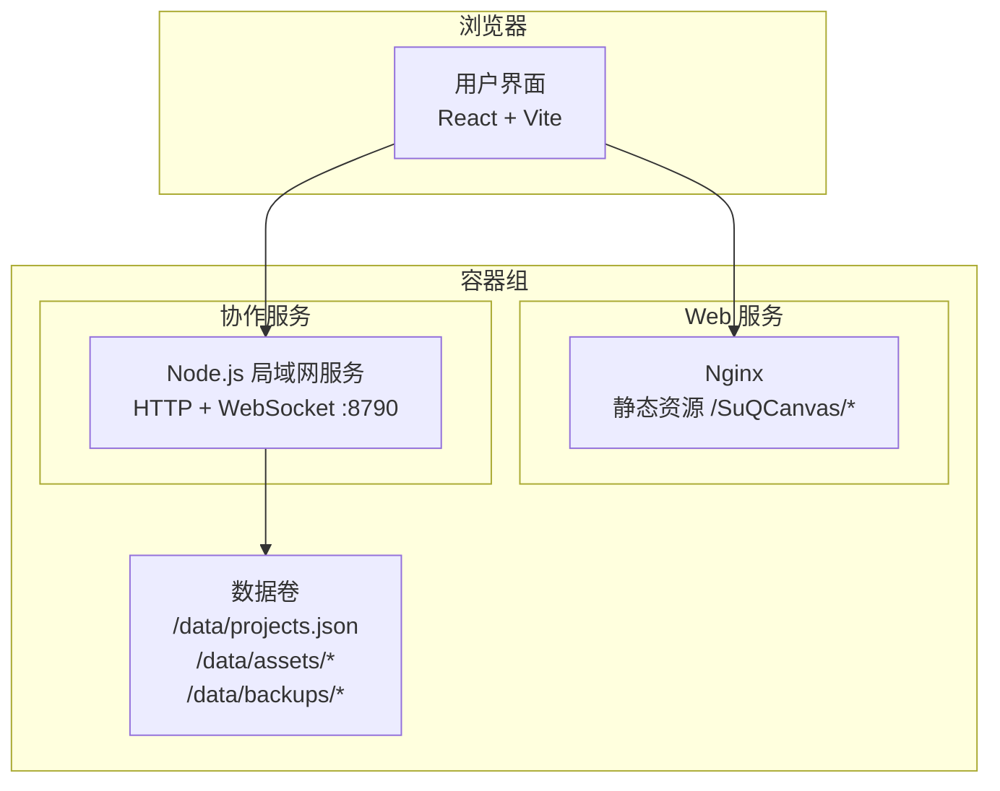
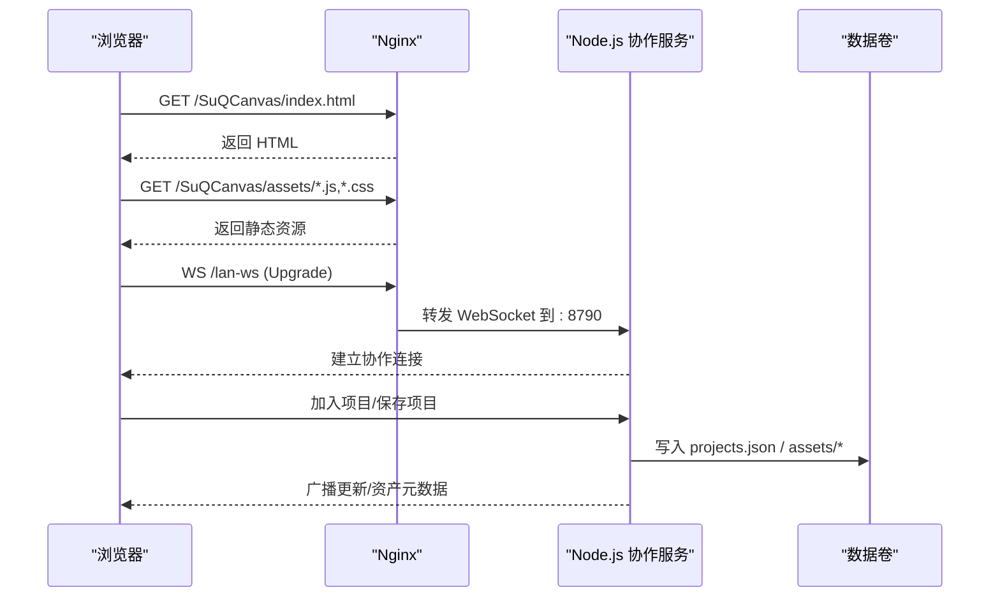
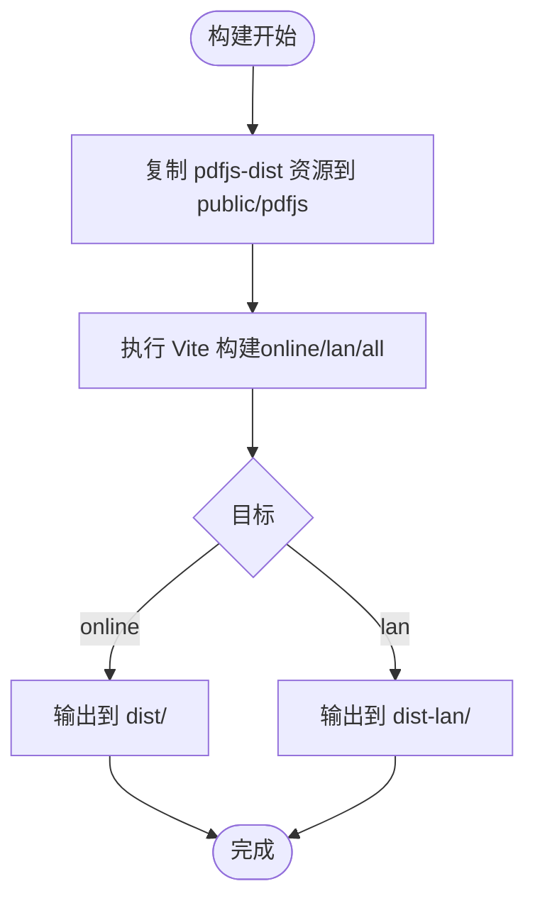
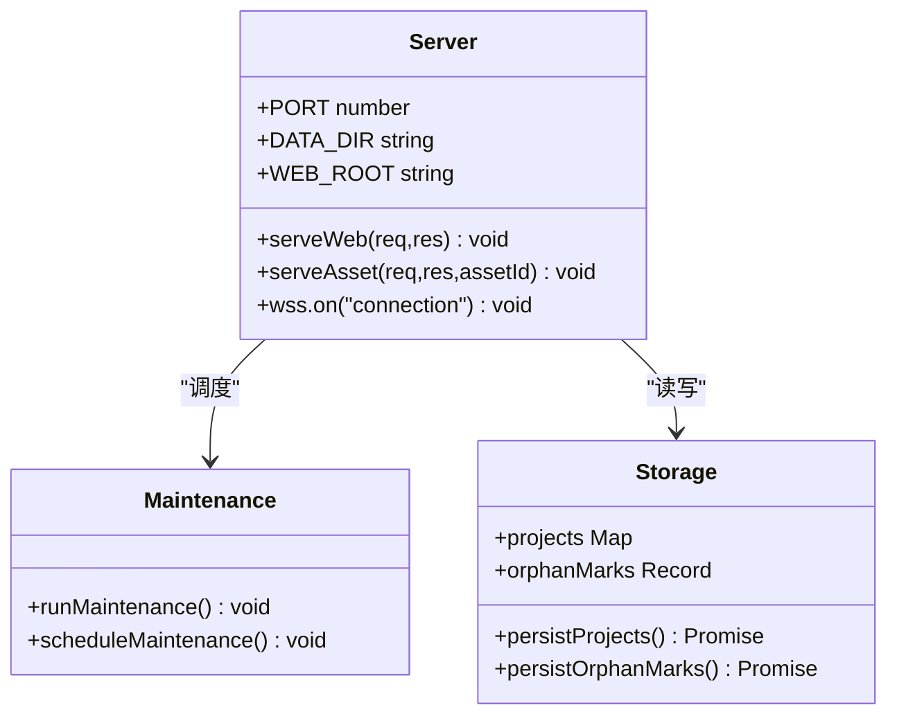
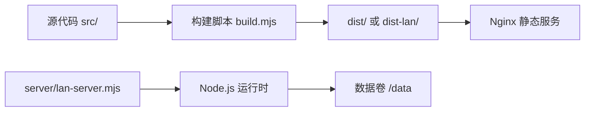

# Docker 容器化部署

<cite>
**本文引用的文件**
- [package.json](file://package.json)
- [vite.config.ts](file://vite.config.ts)
- [server/lan-server.mjs](file://server/lan-server.mjs)
- [scripts/build.mjs](file://scripts/build.mjs)
- [scripts/copy-pdfjs-assets.mjs](file://scripts/copy-pdfjs-assets.mjs)
- [scripts/package-lan.mjs](file://scripts/package-lan.mjs)
- [index.html](file://index.html)
- [src/main.tsx](file://src/main.tsx)
- [README.md](file://README.md)
</cite>

## 目录
1. [简介](#简介)
2. [项目结构](#项目结构)
3. [核心组件](#核心组件)
4. [架构总览](#架构总览)
5. [详细组件分析](#详细组件分析)
6. [依赖关系分析](#依赖关系分析)
7. [性能与镜像优化](#性能与镜像优化)
8. [故障排查指南](#故障排查指南)
9. [结论](#结论)
10. [附录：Docker 与 Compose 配置清单](#附录docker-与-compose-配置清单)

## 简介
本方案为 SuQCanvas 提供生产级 Docker 容器化部署，包含：
- 多阶段 Dockerfile：构建前端静态资源与 Node.js 局域网协作服务，最小化镜像体积并提升构建速度。
- 前端静态资源的容器化：基于 Vite 构建产物，通过 Nginx 或 Node 服务器提供静态资源。
- Node.js 服务器运行环境：使用内置 HTTP + WebSocket 的局域网协作服务，支持项目持久化、素材流式传输、Range 请求、备份清理等。
- docker-compose 编排：前后端协同部署，数据卷挂载、网络隔离、环境变量管理。
- 生产最佳实践：健康检查、自动重启、日志收集、反向代理与 HTTPS、CORS 与跨域、超时与限流建议。

## 项目结构
SuQCanvas 由两部分组成：
- 前端：React + TypeScript + Vite，构建输出到 dist（在线版）或 dist-lan（局域网版）。
- 后端：Node.js 局域网协作服务 server/lan-server.mjs，提供 HTTP 静态资源与 WebSocket 协作通道，并将项目与素材持久化到本地磁盘。

**图表来源**
- [vite.config.ts:6-15](file://vite.config.ts#L6-L15)
- [server/lan-server.mjs:13-23](file://server/lan-server.mjs#L13-L23)
- [server/lan-server.mjs:374-447](file://server/lan-server.mjs#L374-L447)
- [server/lan-server.mjs:449-451](file://server/lan-server.mjs#L449-L451)

**章节来源**
- [package.json:6-20](file://package.json#L6-L20)
- [vite.config.ts:6-15](file://vite.config.ts#L6-L15)
- [server/lan-server.mjs:13-23](file://server/lan-server.mjs#L13-L23)
- [README.md:40-123](file://README.md#L40-L123)

## 核心组件
- 前端构建与运行
  - 构建脚本 scripts/build.mjs 支持 online/lan/all 三种模式，分别输出到 dist/ 与 dist-lan/。
  - Vite base 路径设置为 /SuQCanvas/，便于在子路径下部署。
  - 开发时通过 vite.config.ts 将 /lan-ws 代理到 ws://127.0.0.1:8790。
- 局域网协作服务
  - server/lan-server.mjs 启动 HTTP 服务监听端口（默认 8790），提供静态资源与资产流式拉取。
  - 使用 WebSocket 实现多人协作房间，项目与素材持久化到 data 目录。
  - 维护任务定时清理过期备份与孤儿素材。
- 打包与发布
  - scripts/package-lan.mjs 用于生成可分发的本地包（含 Node 运行时与脚本），便于 Windows 一键启动。

**章节来源**
- [scripts/build.mjs:17-64](file://scripts/build.mjs#L17-L64)
- [vite.config.ts:6-15](file://vite.config.ts#L6-L15)
- [server/lan-server.mjs:13-23](file://server/lan-server.mjs#L13-L23)
- [server/lan-server.mjs:107-205](file://server/lan-server.mjs#L107-L205)
- [scripts/package-lan.mjs:1-65](file://scripts/package-lan.mjs#L1-L65)

## 架构总览
下图展示生产环境的典型部署拓扑：Nginx 作为入口提供静态资源与反向代理 WebSocket；Node.js 协作服务暴露内部端口并通过数据卷持久化项目与素材。

**图表来源**
- [vite.config.ts:9-15](file://vite.config.ts#L9-L15)
- [server/lan-server.mjs:449-451](file://server/lan-server.mjs#L449-L451)
- [server/lan-server.mjs:374-447](file://server/lan-server.mjs#L374-L447)
- [server/lan-server.mjs:661-728](file://server/lan-server.mjs#L661-L728)

## 详细组件分析

### 前端静态资源容器化
- 构建产物
  - 在线版：dist/
  - 局域网版：dist-lan/
- 部署方式
  - 推荐 Nginx 提供静态资源，base 路径为 /SuQCanvas/。
  - 若仅用 Node 提供静态资源，可使用 Express/Nest 或直接复用 lan-server 的 serveWeb 逻辑。
- 关键配置
  - Vite base: /SuQCanvas/
  - 开发代理：/lan-ws -> ws://127.0.0.1:8790

**图表来源**
- [scripts/copy-pdfjs-assets.mjs:1-20](file://scripts/copy-pdfjs-assets.mjs#L1-L20)
- [scripts/build.mjs:27-64](file://scripts/build.mjs#L27-L64)

**章节来源**
- [vite.config.ts:6-15](file://vite.config.ts#L6-L15)
- [scripts/build.mjs:17-64](file://scripts/build.mjs#L17-L64)
- [scripts/copy-pdfjs-assets.mjs:1-20](file://scripts/copy-pdfjs-assets.mjs#L1-L20)

### Node.js 局域网协作服务
- 功能要点
  - HTTP 服务：提供静态资源与资产流式拉取，支持 Range 请求，适合视频边下边播。
  - WebSocket 协作：房间级消息广播，项目列表同步，资产增量同步。
  - 数据持久化：projects.json、assets/*、backups/*。
  - 维护任务：定期清理过期备份与孤儿素材。
- 环境变量
  - PORT：服务端口（默认 8790）
  - LAN_DATA_DIR：数据目录（默认 server/data）
  - LAN_WEB_ROOT：静态资源根目录（默认 dist-lan）
- 安全与健壮性
  - 资产 ID 校验、路径穿越防护、临时文件原子替换、错误处理与降级。

**图表来源**
- [server/lan-server.mjs:13-23](file://server/lan-server.mjs#L13-L23)
- [server/lan-server.mjs:374-447](file://server/lan-server.mjs#L374-L447)
- [server/lan-server.mjs:107-205](file://server/lan-server.mjs#L107-L205)
- [server/lan-server.mjs:66-83](file://server/lan-server.mjs#L66-L83)

**章节来源**
- [server/lan-server.mjs:13-23](file://server/lan-server.mjs#L13-L23)
- [server/lan-server.mjs:374-447](file://server/lan-server.mjs#L374-L447)
- [server/lan-server.mjs:107-205](file://server/lan-server.mjs#L107-L205)
- [server/lan-server.mjs:66-83](file://server/lan-server.mjs#L66-L83)

### 反向代理与 WebSocket 配置
- Nginx 示例（参考 README）
  - 将 /lan-ws 反向代理到 http://127.0.0.1:8790，启用 Upgrade 与 Connection 头。
  - 将 /SuQCanvas/assets/ 反向代理到协作服务以支持跨域封面抓帧。
- 超时设置
  - proxy_read_timeout / proxy_send_timeout 设为较大值，避免长连接超时。

**章节来源**
- [README.md:98-123](file://README.md#L98-L123)

## 依赖关系分析
- 构建期依赖
  - Vite、React、Tailwind、TypeScript、pdfjs-dist 资源拷贝脚本。
- 运行期依赖
  - Node.js 运行时（协作服务）
  - Nginx（可选，用于静态资源与反向代理）
  - 数据卷（持久化项目与素材）

**图表来源**
- [scripts/build.mjs:17-64](file://scripts/build.mjs#L17-L64)
- [server/lan-server.mjs:449-451](file://server/lan-server.mjs#L449-L451)

**章节来源**
- [package.json:22-49](file://package.json#L22-L49)
- [scripts/build.mjs:17-64](file://scripts/build.mjs#L17-L64)
- [server/lan-server.mjs:449-451](file://server/lan-server.mjs#L449-L451)

## 性能与镜像优化
- 多阶段构建
  - 阶段一：安装依赖并构建前端静态资源（缓存 node_modules 层）。
  - 阶段二：仅复制构建产物与最小运行时，减小镜像体积。
- 构建缓存
  - 利用 Docker 层缓存 node_modules，仅在依赖变更时重建。
- 资源裁剪
  - 仅复制 dist 或 dist-lan，不复制源码与开发依赖。
- 静态资源策略
  - Nginx 开启 gzip/brotli 压缩与长期缓存（HTML 除外）。
  - 对 /SuQCanvas/assets/* 启用 Accept-Ranges 与 CORS（协作服务已处理）。
- 并发与流式
  - 协作服务对大文件采用流式读取与分片发送，降低内存占用。
  - 视频类资产优先走 HTTP Range 流式拉取，减少 WebSocket 带宽压力。

[本节为通用指导，无需特定文件引用]

## 故障排查指南
- 无法访问 /lan-ws
  - 检查 Nginx 是否正确代理 /lan-ws 到 :8790，并启用 Upgrade 与 Connection 头。
  - 确认防火墙放行 8790（本地直连场景）。
- 静态资源 404
  - 确认 Vite base 为 /SuQCanvas/，Nginx location 匹配该前缀。
  - 确认构建产物位于正确的 WEB_ROOT（默认 dist-lan）。
- 素材无法加载或封面缺失
  - 确认 /SuQCanvas/assets/* 被反向代理到协作服务。
  - 检查 CORS 头与跨域策略。
- 项目未持久化
  - 检查数据卷挂载路径与权限。
  - 查看协作服务日志中是否有写入失败警告。
- 备份恢复失败
  - 确认备份文件存在且未过期（默认 24 小时）。
  - 检查创建者权限与设备 ID。

**章节来源**
- [README.md:98-123](file://README.md#L98-L123)
- [server/lan-server.mjs:107-205](file://server/lan-server.mjs#L107-L205)
- [server/lan-server.mjs:374-447](file://server/lan-server.mjs#L374-L447)

## 结论
本方案通过多阶段 Dockerfile 与 docker-compose 编排，实现了 SuQCanvas 的前端静态资源与 Node.js 协作服务的容器化部署。借助数据卷、网络隔离、环境变量与健康检查，满足生产环境的稳定性与可维护性要求。配合 Nginx 反向代理与 HTTPS，可在公网安全提供服务。

[本节为总结性内容，无需特定文件引用]

## 附录：Docker 与 Compose 配置清单

### 多阶段 Dockerfile（示例）
- 阶段一：构建前端
  - 安装依赖并执行构建脚本，输出 dist 或 dist-lan。
- 阶段二：运行环境
  - 仅复制构建产物与协作服务代码，使用轻量 Node 镜像。
  - 暴露端口 80（Nginx）与 8790（协作服务，内部使用）。
  - 设置健康检查与 CMD。

[本节为概念性配置说明，不直接映射具体文件]

### docker-compose.yml（示例）
- 服务定义
  - web：Nginx 容器，挂载 dist 或 dist-lan 静态资源，反向代理 /lan-ws 到协作服务。
  - lan：Node.js 协作服务，挂载数据卷 /data，暴露内部端口 8790。
- 数据卷
  - /data/projects.json、/data/assets/*、/data/backups/* 持久化。
- 网络
  - 自定义网络隔离，web 与 lan 在同一网络内通信。
- 环境变量
  - PORT=8790、LAN_DATA_DIR=/data、LAN_WEB_ROOT=/app/dist-lan（按需调整）。
- 健康检查与重启策略
  - 对 web 与 lan 添加健康检查命令。
  - 设置 restart: unless-stopped。

[本节为概念性配置说明，不直接映射具体文件]

### 环境变量与配置要点
- 协作服务
  - PORT：默认 8790
  - LAN_DATA_DIR：默认 server/data（容器中映射为 /data）
  - LAN_WEB_ROOT：默认 dist-lan（容器中映射为 /app/dist-lan）
- 反向代理
  - Nginx 需代理 /lan-ws 与 /SuQCanvas/assets/* 到协作服务。
- 构建模式
  - 通过 .env.* 控制 VITE_BUILD_TARGET（参考 README）。

**章节来源**
- [server/lan-server.mjs:13-23](file://server/lan-server.mjs#L13-L23)
- [README.md:40-123](file://README.md#L40-L123)