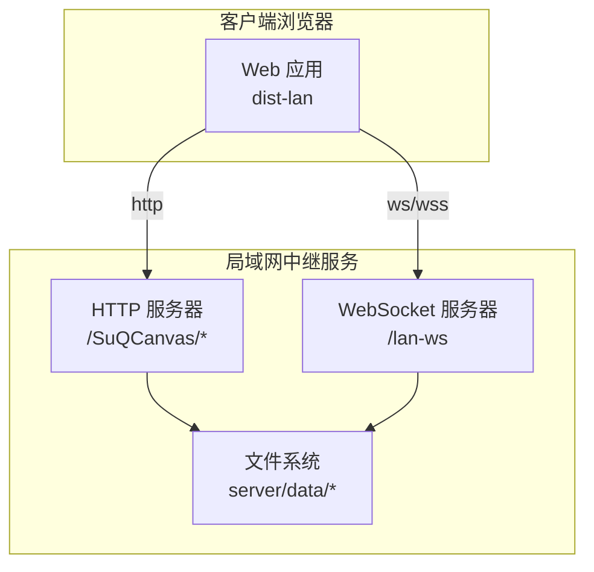
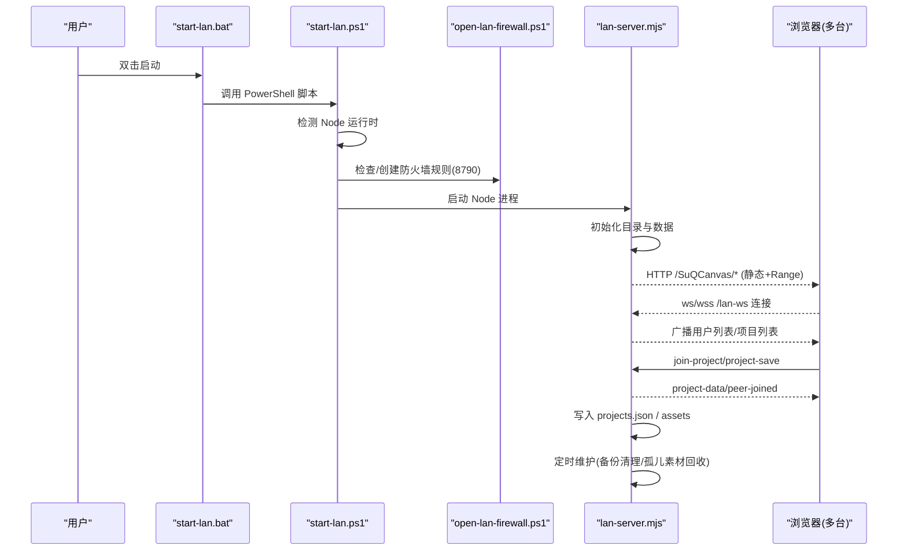
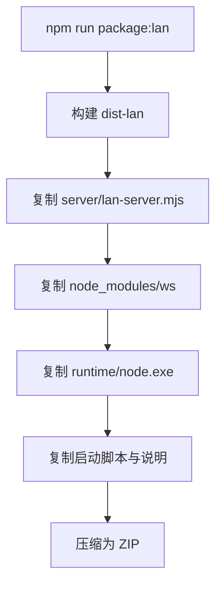
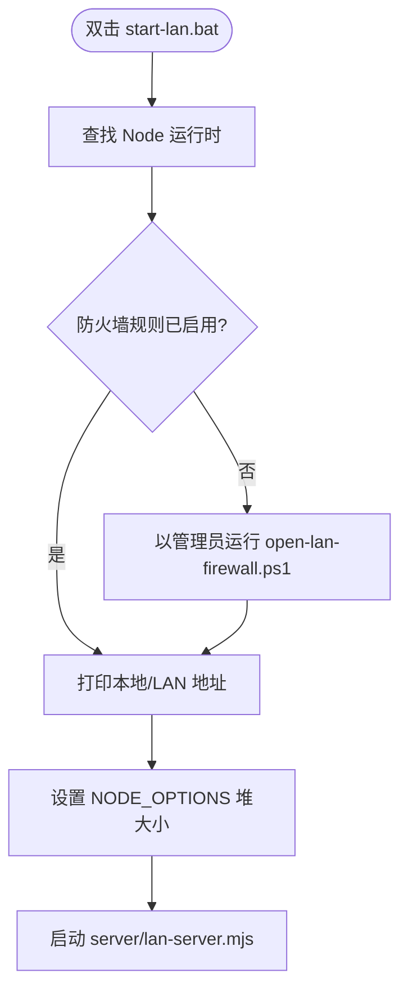
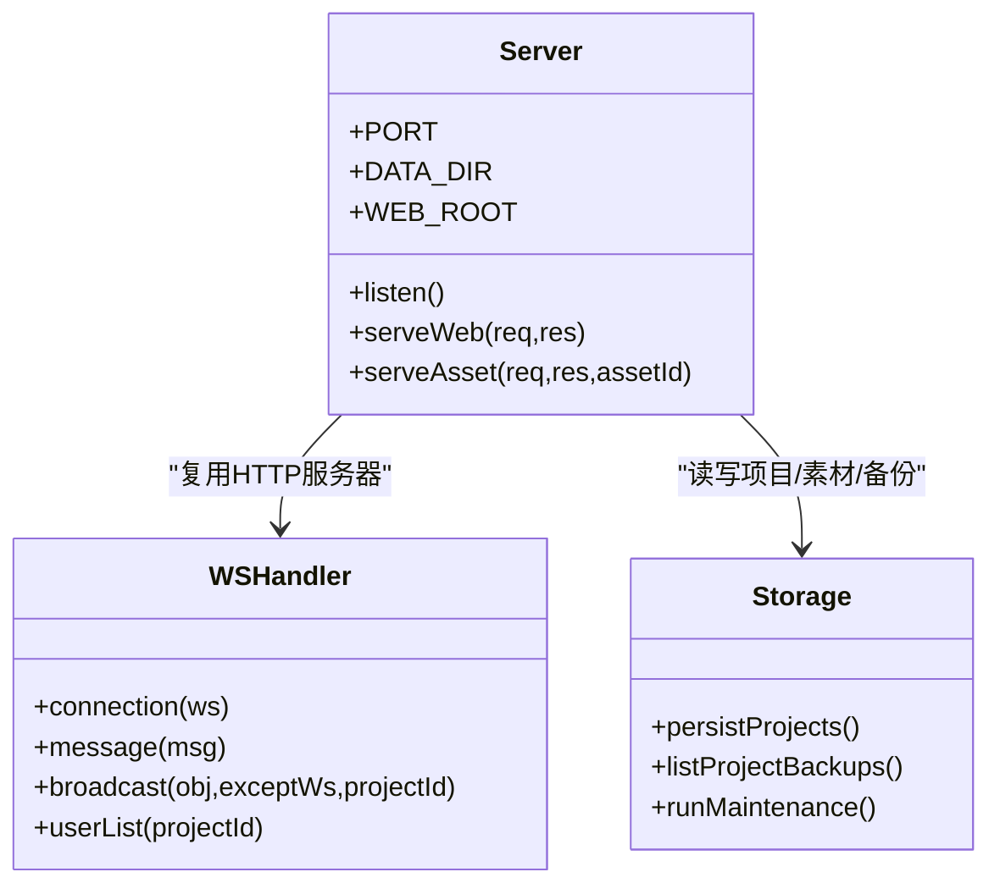
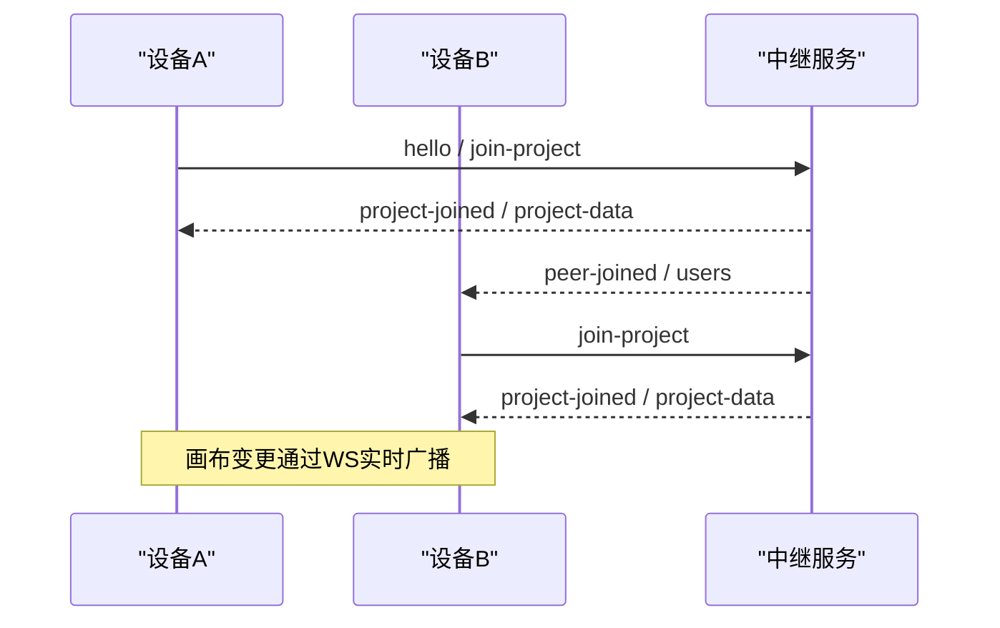
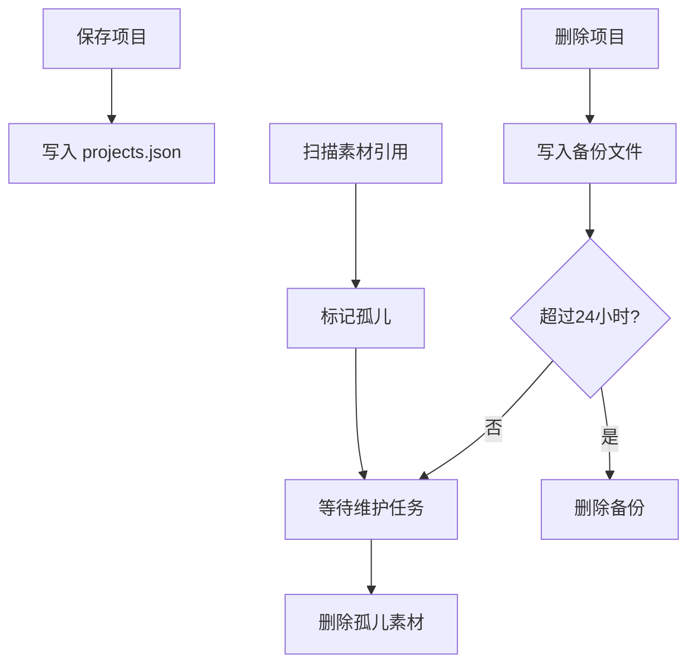

# 局域网服务器部署

<cite>
**本文引用的文件**
- [README.md](file://README.md)
- [package.json](file://package.json)
- [vite.config.ts](file://vite.config.ts)
- [scripts/package-lan.mjs](file://scripts/package-lan.mjs)
- [scripts/start-lan.ps1](file://scripts/start-lan.ps1)
- [scripts/open-lan-firewall.ps1](file://scripts/open-lan-firewall.ps1)
- [start-lan.bat](file://start-lan.bat)
- [server/lan-server.mjs](file://server/lan-server.mjs)
</cite>

## 目录
1. [简介](#简介)
2. [项目结构](#项目结构)
3. [核心组件](#核心组件)
4. [架构总览](#架构总览)
5. [详细组件分析](#详细组件分析)
6. [依赖与配置](#依赖与配置)
7. [性能与资源管理](#性能与资源管理)
8. [故障排查](#故障排查)
9. [结论](#结论)
10. [附录：运维清单](#附录：运维清单)

## 简介
本指南面向需要在局域网内快速部署并运行 SuQCanvas 协作服务的工程师与运维人员，覆盖以下内容：
- 如何打包和分发局域网版本（含 Windows 批处理与 PowerShell 脚本）
- 服务器启动流程、防火墙配置、端口管理等服务管理操作
- 不同操作系统下的部署步骤（依赖安装、进程守护、日志管理）
- 多设备连接、数据持久化、资源管理等核心功能的部署注意事项

该方案支持“一键包”模式与“独立服务”模式两种部署方式，既适合本地演示，也适合在局域网服务器中长期运行。

## 项目结构
SuQCanvas 的局域网协作由两部分组成：
- 静态站点：构建产物位于 dist-lan，提供 Web 界面与前端逻辑
- 中继服务：Node.js 实现的 HTTP + WebSocket 服务，负责项目同步、素材缓存、备份清理等

图表来源
- [server/lan-server.mjs:13-23](file://server/lan-server.mjs#L13-L23)
- [server/lan-server.mjs:449-451](file://server/lan-server.mjs#L449-L451)
- [server/lan-server.mjs:374-447](file://server/lan-server.mjs#L374-L447)

章节来源
- [README.md:40-60](file://README.md#L40-L60)
- [README.md:62-122](file://README.md#L62-L122)
- [vite.config.ts:6-16](file://vite.config.ts#L6-L16)

## 核心组件
- 局域网打包脚本：将构建产物、服务端脚本、运行时 Node 可执行文件、启动脚本打包为可分发的 ZIP
- Windows 启动脚本：自动检测 Node 环境、放行防火墙、打印 LAN 地址并启动服务
- 防火墙脚本：以管理员权限创建入站规则，允许本地子网访问指定端口
- 中继服务：实现 HTTP 静态资源服务、资产 Range 流式拉取、WebSocket 协作消息路由、项目与素材持久化、定时维护任务

章节来源
- [scripts/package-lan.mjs:1-65](file://scripts/package-lan.mjs#L1-L65)
- [scripts/start-lan.ps1:1-51](file://scripts/start-lan.ps1#L1-L51)
- [scripts/open-lan-firewall.ps1:1-29](file://scripts/open-lan-firewall.ps1#L1-L29)
- [server/lan-server.mjs:1-206](file://server/lan-server.mjs#L1-L206)

## 架构总览
下图展示了从双击启动到多设备连接的完整流程，包括防火墙放行、Node 运行时选择、服务监听、静态资源与资产流式拉取、WebSocket 协作通道。

图表来源
- [start-lan.bat:1-5](file://start-lan.bat#L1-L5)
- [scripts/start-lan.ps1:1-51](file://scripts/start-lan.ps1#L1-L51)
- [scripts/open-lan-firewall.ps1:1-29](file://scripts/open-lan-firewall.ps1#L1-L29)
- [server/lan-server.mjs:13-23](file://server/lan-server.mjs#L13-L23)
- [server/lan-server.mjs:449-451](file://server/lan-server.mjs#L449-L451)
- [server/lan-server.mjs:46-83](file://server/lan-server.mjs#L46-L83)
- [server/lan-server.mjs:107-205](file://server/lan-server.mjs#L107-L205)

## 详细组件分析

### 打包与分发（局域网版）
- 构建产物：通过构建命令生成 dist-lan
- 打包内容：包含 dist-lan、server/lan-server.mjs、node_modules/ws、runtime/node.exe、启动脚本与说明文档
- 输出位置：release/SuQCanvas-LAN.zip 与 release/SuQCanvas-LAN 目录
- 使用方式：解压后双击 start-lan.bat 即可启动；首次会请求防火墙放行

图表来源
- [scripts/package-lan.mjs:11-26](file://scripts/package-lan.mjs#L11-L26)
- [scripts/package-lan.mjs:45-61](file://scripts/package-lan.mjs#L45-L61)
- [package.json:11-14](file://package.json#L11-L14)

章节来源
- [scripts/package-lan.mjs:1-65](file://scripts/package-lan.mjs#L1-L65)
- [package.json:11-14](file://package.json#L11-L14)

### Windows 启动流程与脚本
- start-lan.bat：切换到脚本所在目录，调用 PowerShell 脚本启动
- start-lan.ps1：
  - 优先使用内置 runtime/node.exe，否则回退系统 node
  - 若未启用防火墙规则，则调用 open-lan-firewall.ps1 以管理员权限放行
  - 收集本机 IPv4 地址并打印 LAN 访问地址
  - 设置 Node 堆内存上限，启动 lan-server.mjs
- open-lan-firewall.ps1：
  - 检测管理员权限，必要时提权
  - 创建或启用名为“SuQCanvas LAN 8790”的入站规则，仅允许本地子网访问 TCP 8790

图表来源
- [start-lan.bat:1-5](file://start-lan.bat#L1-L5)
- [scripts/start-lan.ps1:1-51](file://scripts/start-lan.ps1#L1-L51)
- [scripts/open-lan-firewall.ps1:1-29](file://scripts/open-lan-firewall.ps1#L1-L29)

章节来源
- [start-lan.bat:1-5](file://start-lan.bat#L1-L5)
- [scripts/start-lan.ps1:1-51](file://scripts/start-lan.ps1#L1-L51)
- [scripts/open-lan-firewall.ps1:1-29](file://scripts/open-lan-firewall.ps1#L1-L29)

### 中继服务（HTTP + WebSocket）
- 监听端口：默认 8790，可通过环境变量 PORT 覆盖
- 静态资源：/SuQCanvas/*，根路径重定向至 /SuQCanvas/
- 资产流式拉取：/SuQCanvas/assets/<assetId>，支持 Range 头，便于视频边下边播
- WebSocket 通道：/lan-ws，用于项目列表、加入房间、画布同步、用户广播、资产请求与传输
- 数据持久化：
  - 项目列表与元数据：projects.json
  - 素材：assets/<sha256>.json/.bin/.thumb
  - 删除备份：backups/projects/<projectId>_<timestamp>.json，保留 24 小时
- 维护任务：
  - 定期扫描备份过期文件并删除
  - 标记未被任何项目引用的素材为“孤儿”，超过 24 小时后删除
  - 清理无效孤儿标记

图表来源
- [server/lan-server.mjs:13-23](file://server/lan-server.mjs#L13-L23)
- [server/lan-server.mjs:374-447](file://server/lan-server.mjs#L374-L447)
- [server/lan-server.mjs:46-83](file://server/lan-server.mjs#L46-L83)
- [server/lan-server.mjs:107-205](file://server/lan-server.mjs#L107-L205)
- [server/lan-server.mjs:449-451](file://server/lan-server.mjs#L449-L451)

章节来源
- [server/lan-server.mjs:1-206](file://server/lan-server.mjs#L1-L206)
- [server/lan-server.mjs:374-447](file://server/lan-server.mjs#L374-L447)
- [server/lan-server.mjs:449-451](file://server/lan-server.mjs#L449-L451)

### 多设备连接与会话模型
- 设备接入：浏览器通过 ws/wss 连接到 /lan-ws，获得唯一 id 与颜色标识
- 项目房间：设备发送 join-project 加入指定项目房间，离开时发送 leave-project
- 广播机制：同一房间内广播 peer-joined、leave、project-list、users 等事件
- 资产同步：当项目引用了缺失素材时，服务器向持有端发起 asset-request，接收端按分片上传，服务器落盘并通知其他设备

图表来源
- [server/lan-server.mjs:661-705](file://server/lan-server.mjs#L661-L705)
- [server/lan-server.mjs:593-611](file://server/lan-server.mjs#L593-L611)

章节来源
- [server/lan-server.mjs:661-705](file://server/lan-server.mjs#L661-L705)
- [server/lan-server.mjs:593-611](file://server/lan-server.mjs#L593-L611)

### 数据持久化与备份恢复
- 项目保存：normalizeProject 校验后写入内存 Map，异步持久化到 projects.json
- 删除保护：删除前写入 backups/projects/<id>_<时间戳>.json，保留 24 小时
- 恢复机制：支持列出并恢复 24 小时内备份，仅项目创建者可操作
- 素材生命周期：
  - 上传分片写入临时文件，完成后原子替换
  - 未被引用的素材标记为孤儿，24 小时后删除
  - 封面缩略图单独缓存，避免重复抓帧

图表来源
- [server/lan-server.mjs:46-83](file://server/lan-server.mjs#L46-L83)
- [server/lan-server.mjs:107-205](file://server/lan-server.mjs#L107-L205)
- [server/lan-server.mjs:716-757](file://server/lan-server.mjs#L716-L757)
- [server/lan-server.mjs:766-800](file://server/lan-server.mjs#L766-L800)

章节来源
- [server/lan-server.mjs:46-83](file://server/lan-server.mjs#L46-L83)
- [server/lan-server.mjs:107-205](file://server/lan-server.mjs#L107-L205)
- [server/lan-server.mjs:716-757](file://server/lan-server.mjs#L716-L757)
- [server/lan-server.mjs:766-800](file://server/lan-server.mjs#L766-L800)

## 依赖与配置

### 环境与变量
- 端口：PORT（默认 8790）
- 数据目录：LAN_DATA_DIR（默认 server/data）
- 静态根：LAN_WEB_ROOT（默认 dist-lan）
- 开发代理：vite.config.ts 中 /lan-ws 指向 ws://127.0.0.1:8790

章节来源
- [server/lan-server.mjs:13-23](file://server/lan-server.mjs#L13-L23)
- [vite.config.ts:6-16](file://vite.config.ts#L6-L16)

### 生产反向代理（Nginx）
- 将 wss 与 /SuQCanvas/assets 反向代理到 127.0.0.1:8790
- 设置 Upgrade、Connection、Host、X-Forwarded-For 等头部
- 调整超时以支持大文件传输

章节来源
- [README.md:98-122](file://README.md#L98-L122)

### 脚本与命令
- 构建与打包：
  - npm run build:lan
  - npm run package:lan
- 启动服务：
  - npm run lan
  - Windows 一键包：双击 start-lan.bat
- 防火墙：
  - npm run lan:open

章节来源
- [package.json:6-20](file://package.json#L6-L20)
- [README.md:40-60](file://README.md#L40-L60)
- [README.md:62-74](file://README.md#L62-L74)

## 性能与资源管理
- 内存限制：PowerShell 启动脚本设置 NODE_OPTIONS 的堆大小，避免大文件或多人协作导致 OOM
- 流式传输：
  - 资产下载支持 HTTP Range，视频边下边播，减少内存占用
  - 上传分片按索引顺序写入临时文件，完成后原子替换，避免并发写冲突
- 维护任务：
  - 每小时执行一次，清理过期备份与孤儿素材，释放磁盘空间
- 并发控制：
  - 上传分片串行写入，避免多个客户端同时写入同一临时文件造成损坏

章节来源
- [scripts/start-lan.ps1:38-43](file://scripts/start-lan.ps1#L38-L43)
- [server/lan-server.mjs:291-372](file://server/lan-server.mjs#L291-L372)
- [server/lan-server.mjs:503-553](file://server/lan-server.mjs#L503-L553)
- [server/lan-server.mjs:107-205](file://server/lan-server.mjs#L107-L205)

## 故障排查
- 无法访问局域网地址
  - 确认防火墙规则已启用（TCP 8790，仅本地子网）
  - 检查是否以管理员权限运行过防火墙脚本
- 页面空白或资源加载失败
  - 确认 dist-lan 存在且被正确复制到发布目录
  - 检查 WEB_ROOT 与静态资源路径是否正确
- 视频封面不显示
  - 确认 /SuQCanvas/assets 已正确反代到中继服务
  - 检查跨域头与 CORS 配置
- 项目无法删除或恢复
  - 确认操作者是否为项目创建者
  - 检查 backups 目录是否存在对应时间戳的备份文件
- 内存不足或卡顿
  - 调整 NODE_OPTIONS 的堆大小
  - 减少同时在线设备数量或媒体文件大小

章节来源
- [scripts/open-lan-firewall.ps1:15-26](file://scripts/open-lan-firewall.ps1#L15-L26)
- [server/lan-server.mjs:374-447](file://server/lan-server.mjs#L374-L447)
- [server/lan-server.mjs:731-757](file://server/lan-server.mjs#L731-L757)
- [server/lan-server.mjs:766-800](file://server/lan-server.mjs#L766-L800)

## 结论
SuQCanvas 的局域网协作方案提供了开箱即用的打包与启动体验，并通过健壮的中继服务实现了项目与素材的持久化、备份与回收。借助防火墙脚本与反向代理配置，可在 Windows 与 Linux 环境下稳定运行。建议在生产环境中：
- 使用进程守护（如 PM2/Systemd）保障服务高可用
- 将数据目录迁移到独立磁盘并定期备份
- 通过 Nginx 暴露 wss 与资产接口，隐藏内部端口
- 监控磁盘与内存使用，合理设置堆大小与维护周期

## 附录：运维清单
- 部署步骤
  - 构建：npm run build:lan
  - 打包：npm run package:lan
  - 启动：Windows 双击 start-lan.bat；Linux 使用 pm2/systemd 守护
- 端口与防火墙
  - 默认端口：8790
  - Windows：使用 scripts/open-lan-firewall.ps1 放行本地子网
  - Linux：开放防火墙端口并限制源地址为内网段
- 数据与备份
  - 数据目录：server/data（可配置 LAN_DATA_DIR）
  - 备份策略：保留 24 小时，定期归档
- 日志与监控
  - 标准输出日志：查看控制台或守护进程的日志文件
  - 指标建议：监控 CPU、内存、磁盘 I/O 与连接数
- 安全建议
  - 仅对局域网开放端口
  - 使用 HTTPS + WSS，并通过反向代理统一入口
  - 限制上传文件大小与并发连接数

章节来源
- [README.md:62-122](file://README.md#L62-L122)
- [scripts/open-lan-firewall.ps1:15-26](file://scripts/open-lan-firewall.ps1#L15-L26)
- [server/lan-server.mjs:13-23](file://server/lan-server.mjs#L13-L23)