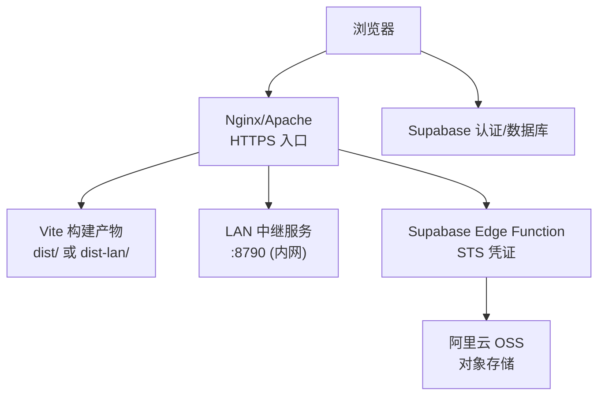
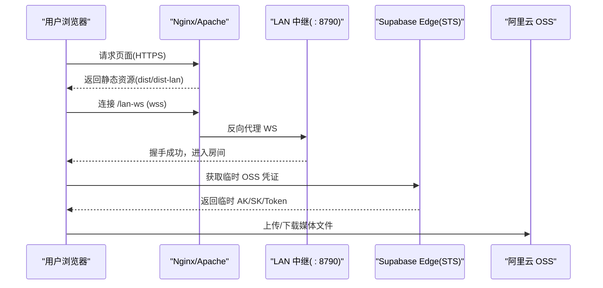
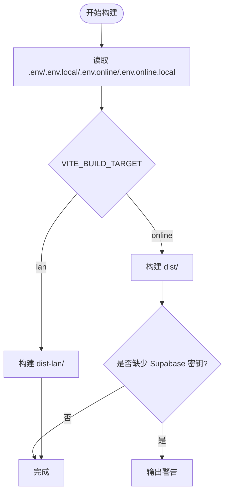
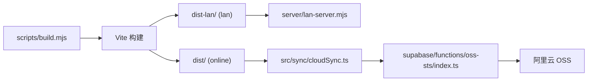

# 生产环境配置

<cite>
**本文引用的文件**
- [package.json](file://package.json)
- [vite.config.ts](file://vite.config.ts)
- [README.md](file://README.md)
- [scripts/build.mjs](file://scripts/build.mjs)
- [src/buildMode.ts](file://src/buildMode.ts)
- [server/lan-server.mjs](file://server/lan-server.mjs)
- [src/sync/ossConfig.ts](file://src/sync/ossConfig.ts)
- [supabase/functions/oss-sts/index.ts](file://supabase/functions/oss-sts/index.ts)
- [src/sync/cloudSync.ts](file://src/sync/cloudSync.ts)
</cite>

## 目录
1. [简介](#简介)
2. [项目结构](#项目结构)
3. [核心组件](#核心组件)
4. [架构总览](#架构总览)
5. [详细组件分析](#详细组件分析)
6. [依赖关系分析](#依赖关系分析)
7. [性能优化配置](#性能优化配置)
8. [故障排查指南](#故障排查指南)
9. [结论](#结论)
10. [附录：环境变量清单与部署步骤](#附录环境变量清单与部署步骤)

## 简介
本指南面向将 SuQCanvas 部署到生产环境的工程师，覆盖以下主题：
- 环境变量与构建目标管理（开发、测试、生产）
- 域名绑定与反向代理（Nginx、Apache）
- SSL 证书部署与安全加固
- 性能优化（Gzip、浏览器缓存、CDN 集成）
- 监控告警与运维工具（错误追踪、性能监控、访问日志分析）

SuQCanvas 提供两种构建产物：在线版（云端同步 + OSS 存储）与局域网版（本地协作服务）。生产部署需根据业务场景选择对应版本，并配合反向代理与必要的后端服务。

## 项目结构
- Vite 前端工程，支持多模式构建（online / lan），通过脚本统一编排构建流程与环境变量读取。
- 局域网版包含 Node.js 中继服务，提供 WebSocket 协作与静态资源托管。
- 在线版可选接入 Supabase 与阿里云 OSS，通过 Edge Function 签发临时凭证。

图表来源
- [vite.config.ts:6-16](file://vite.config.ts#L6-L16)
- [server/lan-server.mjs:13-23](file://server/lan-server.mjs#L13-L23)
- [supabase/functions/oss-sts/index.ts:13-23](file://supabase/functions/oss-sts/index.ts#L13-L23)

章节来源
- [package.json:6-20](file://package.json#L6-L20)
- [vite.config.ts:6-16](file://vite.config.ts#L6-L16)
- [README.md:40-123](file://README.md#L40-L123)

## 核心组件
- 构建与运行脚本：统一处理 .env 加载、构建模式切换、输出目录管理。
- 前端构建配置：设置 base、开发代理、Tailwind 插件等。
- 局域网中继服务：HTTP 静态服务 + WebSocket 协作 + 资产流式传输 + 定时维护清理。
- 云端集成：Supabase 认证/数据同步；OSS 直传（通过 STS 临时凭证）。

章节来源
- [scripts/build.mjs:31-64](file://scripts/build.mjs#L31-L64)
- [vite.config.ts:6-16](file://vite.config.ts#L6-L16)
- [server/lan-server.mjs:13-23](file://server/lan-server.mjs#L13-L23)
- [src/sync/ossConfig.ts:1-20](file://src/sync/ossConfig.ts#L1-L20)
- [src/sync/cloudSync.ts:1-165](file://src/sync/cloudSync.ts#L1-L165)

## 架构总览
生产环境典型拓扑：
- 用户通过 HTTPS 访问站点域名，由 Nginx/Apache 提供静态资源与反向代理。
- 局域网协作使用 wss:// 域名路径反代至内网 :8790 的 LAN 中继。
- 在线版通过 Supabase 进行认证与项目/素材元数据同步，OSS 用于大文件存储。
- 可选 CDN 加速静态资源与 OSS 对象。

图表来源
- [README.md:98-122](file://README.md#L98-L122)
- [server/lan-server.mjs:449-451](file://server/lan-server.mjs#L449-L451)
- [supabase/functions/oss-sts/index.ts:84-103](file://supabase/functions/oss-sts/index.ts#L84-L103)

## 详细组件分析

### 环境变量与构建目标管理
- 构建目标由 VITE_BUILD_TARGET 控制，区分 online 与 lan。
- 构建脚本按顺序从 .env、.env.local、.env.online、.env.online.local 中读取变量，便于隔离敏感信息。
- 在线版需要 Supabase URL 与匿名密钥，缺失时给出警告。
- 局域网版可通过 VITE_LAN_WS_URL 自定义 WebSocket 地址。

图表来源
- [scripts/build.mjs:31-52](file://scripts/build.mjs#L31-L52)
- [scripts/build.mjs:54-64](file://scripts/build.mjs#L54-L64)
- [src/buildMode.ts:1-8](file://src/buildMode.ts#L1-L8)

章节来源
- [scripts/build.mjs:31-64](file://scripts/build.mjs#L31-L64)
- [src/buildMode.ts:1-8](file://src/buildMode.ts#L1-L8)
- [README.md:56-58](file://README.md#L56-L58)

### 域名绑定与反向代理（Nginx、Apache）
- 站点基础路径为 /SuQCanvas/，需在反向代理中正确映射。
- 局域网协作需将 /lan-ws 反向代理至内网 :8790，启用 WebSocket 升级与长超时。
- 视频封面等资源路径 /SuQCanvas/assets/ 也需反代至中继，避免跨域问题。

Nginx 关键要点（示例片段位置见引用）：
- location /lan-ws：开启 ws 代理、设置 Upgrade/Connection、Host、X-Forwarded-For、读写超时。
- location /SuQCanvas/assets/：转发到 127.0.0.1:8790，携带 Host 与 X-Forwarded-For。

Apache 建议：
- 使用 ProxyPass/ProxyPassReverse 将 /lan-ws 指向 ws://127.0.0.1:8790，并启用 mod_proxy_wstunnel。
- 对 /SuQCanvas/assets/ 同样做反向代理。

章节来源
- [vite.config.ts:6-16](file://vite.config.ts#L6-L16)
- [README.md:98-122](file://README.md#L98-L122)

### SSL 证书部署
- 在 Nginx/Apache 上启用 HTTPS，配置证书与私钥，强制 HTTP 跳转 HTTPS。
- 确保 /lan-ws 使用 wss://，浏览器在 HTTPS 页面下会拒绝 ws:// 直连。
- 若使用 CDN，注意回源协议与缓存头配置，避免破坏鉴权与实时性。

章节来源
- [README.md:98-122](file://README.md#L98-L122)

### 性能优化配置
- Gzip/Brotli：在 Nginx/Apache 启用压缩，减少静态资源体积。
- 浏览器缓存：
  - 静态资源（JS/CSS/图片）可设置长期缓存与版本号策略。
  - HTML 建议 no-cache 或短缓存，保证更新及时。
  - 中继对静态资源已设置 Cache-Control: public, max-age=86400，HTML 为 no-cache。
- CDN 集成：
  - 将 dist/ 或 dist-lan/ 静态资源托管至 CDN，配置缓存规则与回源。
  - OSS 对象（在线版）可直接通过 CDN 加速，结合 STS 临时凭证访问。

章节来源
- [server/lan-server.mjs:440-444](file://server/lan-server.mjs#L440-L444)
- [README.md:98-122](file://README.md#L98-L122)

### 监控告警系统搭建
- 错误追踪：
  - 前端接入错误上报（如 Sentry），在生产环境开启，收集未捕获异常与 Promise 拒绝。
  - 服务端日志集中化（stdout/stderr），配合日志采集器（如 Filebeat/Fluent Bit）推送到 ELK/Loki。
- 性能监控：
  - 前端性能指标（FCP/LCP/CLS/TTFB）上报至监控平台。
  - 后端接口与 WebSocket 连接数、延迟、错误率监控（Prometheus + Grafana）。
- 访问日志分析：
  - Nginx/Apache 访问日志结构化输出，结合日志分析工具进行流量与错误分析。
  - 针对 /lan-ws 建立独立日志，便于定位协作问题。

[本节为通用实践说明，不直接分析具体代码文件]

## 依赖关系分析
- 构建阶段：
  - scripts/build.mjs 负责读取环境变量、调用 Vite 构建、输出不同目录。
  - src/buildMode.ts 暴露构建目标常量，供运行时分支裁剪。
- 运行阶段：
  - 局域网版：server/lan-server.mjs 提供 HTTP 与 WebSocket 服务，管理项目与资产。
  - 在线版：src/sync/cloudSync.ts 对接 Supabase；src/sync/ossConfig.ts 判断 OSS 配置；supabase/functions/oss-sts/index.ts 签发 STS 临时凭证。

图表来源
- [scripts/build.mjs:54-64](file://scripts/build.mjs#L54-L64)
- [server/lan-server.mjs:449-451](file://server/lan-server.mjs#L449-L451)
- [src/sync/cloudSync.ts:1-165](file://src/sync/cloudSync.ts#L1-L165)
- [supabase/functions/oss-sts/index.ts:84-103](file://supabase/functions/oss-sts/index.ts#L84-L103)

章节来源
- [scripts/build.mjs:54-64](file://scripts/build.mjs#L54-L64)
- [server/lan-server.mjs:449-451](file://server/lan-server.mjs#L449-L451)
- [src/sync/ossConfig.ts:1-20](file://src/sync/ossConfig.ts#L1-L20)
- [src/sync/cloudSync.ts:1-165](file://src/sync/cloudSync.ts#L1-L165)
- [supabase/functions/oss-sts/index.ts:84-103](file://supabase/functions/oss-sts/index.ts#L84-L103)

## 性能优化配置
- 静态资源缓存：
  - 对 JS/CSS/图片设置长期缓存，配合文件名哈希或版本号。
  - HTML 使用 no-cache 或短缓存，确保更新即时生效。
- 压缩：
  - Nginx/Apache 启用 gzip/brotli，优先 Brotli。
- CDN：
  - 将静态资源与 OSS 对象纳入 CDN，合理设置缓存命中与回源策略。
- 网络优化：
  - 启用 HTTP/2 或 HTTP/3，减少握手开销。
  - 合理设置 Keep-Alive 与并发限制。
- 资源分片与流式传输：
  - 局域网中继支持 Range 请求与分块传输，适合大视频边下边播。

章节来源
- [server/lan-server.mjs:326-372](file://server/lan-server.mjs#L326-L372)
- [server/lan-server.mjs:440-444](file://server/lan-server.mjs#L440-L444)
- [README.md:98-122](file://README.md#L98-L122)

## 故障排查指南
- 无法连接 /lan-ws：
  - 检查 Nginx 是否正确代理 ws 升级与超时设置。
  - 确认防火墙放行内网 :8790 端口（仅内网访问）。
- 视频封面无法生成：
  - 确认 /SuQCanvas/assets/ 已反代至中继，且 CORS 头允许跨域。
- 在线版无法登录/同步：
  - 检查 .env.online.local 中的 Supabase URL 与匿名密钥是否配置。
  - 检查 Edge Function 是否部署并配置了 ALIYUN_* 环境变量。
- 构建产物异常：
  - 确认 VITE_BUILD_TARGET 与 .env.* 文件内容正确。
  - 查看构建脚本输出的警告与错误。

章节来源
- [README.md:98-122](file://README.md#L98-L122)
- [scripts/build.mjs:43-52](file://scripts/build.mjs#L43-L52)
- [supabase/functions/oss-sts/index.ts:84-103](file://supabase/functions/oss-sts/index.ts#L84-L103)

## 结论
生产环境部署 SuQCanvas 的关键在于：
- 明确构建目标与环境变量隔离，避免敏感信息泄露。
- 正确配置反向代理，确保 WebSocket 与资源路径可达。
- 启用 HTTPS 与合适的缓存策略，提升安全与性能。
- 按需集成 CDN 与 OSS，利用 STS 临时凭证保障安全。
- 建立完善的监控与日志体系，快速定位与解决问题。

[本节为总结性内容，不直接分析具体代码文件]

## 附录：环境变量清单与部署步骤

### 环境变量清单
- 构建与运行
  - VITE_BUILD_TARGET：构建目标，'online' 或 'lan'
  - PORT：局域网中继监听端口（默认 8790）
  - LAN_DATA_DIR：局域网数据目录（默认 server/data）
  - LAN_WEB_ROOT：局域网 Web 根目录（默认 dist-lan）
  - VITE_LAN_WS_URL：局域网 WebSocket 地址（可选）
- 在线版
  - VITE_SUPABASE_URL：Supabase 项目 URL
  - VITE_SUPABASE_ANON_KEY：Supabase 匿名密钥
  - VITE_OSS_REGION：OSS 区域
  - VITE_OSS_BUCKET：OSS Bucket
  - VITE_OSS_ACCESS_KEY_ID：AccessKey ID（或使用 STS）
  - VITE_OSS_STS_URL：STS 函数地址
- Edge Function（Supabase）
  - ALIYUN_AK_ID：RAM 用户 AccessKey ID
  - ALIYUN_AK_SECRET：RAM 用户 AccessKey Secret
  - ALIYUN_ROLE_ARN：RAM 角色 ARN

章节来源
- [scripts/build.mjs:31-52](file://scripts/build.mjs#L31-L52)
- [server/lan-server.mjs:13-23](file://server/lan-server.mjs#L13-L23)
- [src/sync/ossConfig.ts:1-20](file://src/sync/ossConfig.ts#L1-L20)
- [supabase/functions/oss-sts/index.ts:13-23](file://supabase/functions/oss-sts/index.ts#L13-L23)

### 部署步骤（在线版）
- 准备 .env.online.local，填入 Supabase 与 OSS 相关变量。
- 执行 npm run build:online，产出 dist/。
- 将 dist/ 部署至 Nginx/Apache，配置 base 路径与 HTTPS。
- 如需 CDN，将静态资源与 OSS 对象纳入 CDN，配置缓存与回源。
- 部署 Supabase Edge Function（oss-sts），配置 Secrets。
- 验证登录、项目同步与 OSS 上传/下载功能。

章节来源
- [scripts/build.mjs:54-64](file://scripts/build.mjs#L54-L64)
- [README.md:40-58](file://README.md#L40-L58)
- [supabase/functions/oss-sts/index.ts:84-103](file://supabase/functions/oss-sts/index.ts#L84-L103)

### 部署步骤（局域网版）
- 执行 npm run build:lan，产出 dist-lan/。
- 将 dist-lan/ 与 server/ 目录部署至服务器，安装依赖并启动中继服务。
- 配置 Nginx 将 /lan-ws 与 /SuQCanvas/assets/ 反代至 :8790。
- 首次启动放行防火墙（Windows 可使用提供的脚本）。
- 通过浏览器访问站点域名，填写中继地址与设备名称加入协作。

章节来源
- [README.md:62-123](file://README.md#L62-L123)
- [server/lan-server.mjs:449-451](file://server/lan-server.mjs#L449-L451)