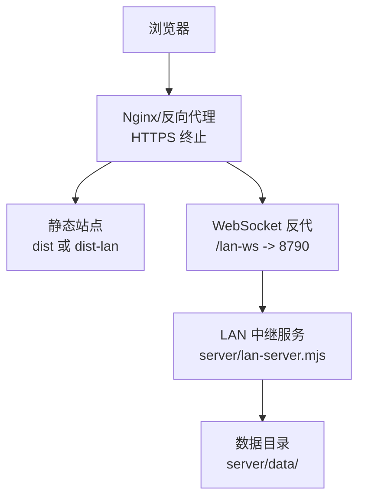
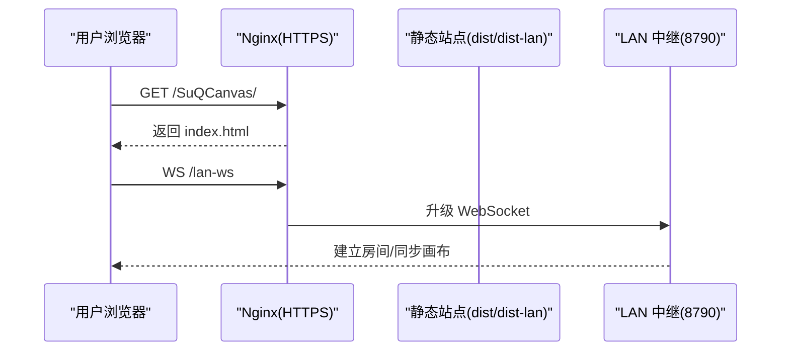
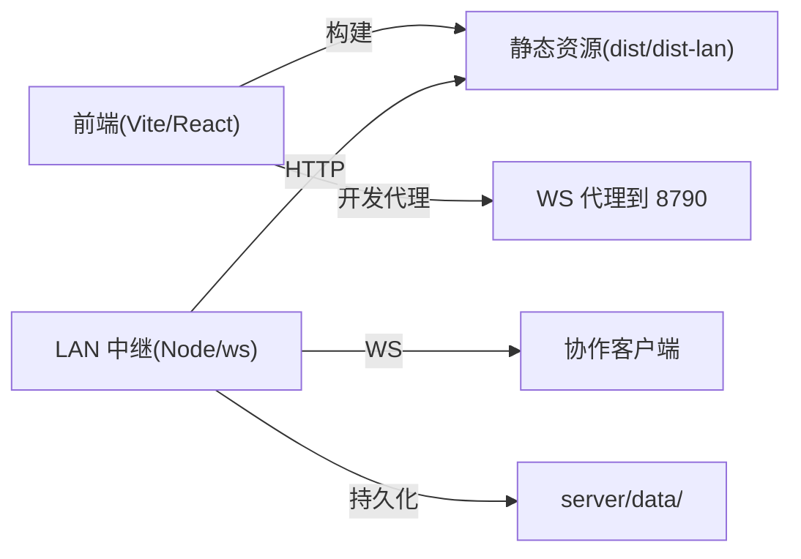

# 部署方案

<cite>
**本文引用的文件**
- [package.json](file://package.json)
- [vite.config.ts](file://vite.config.ts)
- [README.md](file://README.md)
- [server/lan-server.mjs](file://server/lan-server.mjs)
- [scripts/build.mjs](file://scripts/build.mjs)
- [scripts/package-lan.mjs](file://scripts/package-lan.mjs)
- [scripts/start-lan.ps1](file://scripts/start-lan.ps1)
- [start-lan.bat](file://start-lan.bat)
- [src/buildMode.ts](file://src/buildMode.ts)
</cite>

## 目录
1. [简介](#简介)
2. [项目结构](#项目结构)
3. [核心组件](#核心组件)
4. [架构总览](#架构总览)
5. [详细组件分析](#详细组件分析)
6. [依赖关系分析](#依赖关系分析)
7. [性能与容量规划](#性能与容量规划)
8. [故障排查指南](#故障排查指南)
9. [结论](#结论)
10. [附录：各平台部署步骤与环境变量](#附录各平台部署步骤与环境变量)

## 简介
本指南面向生产环境，提供 SuQCanvas 的完整部署方案，覆盖：
- 静态站点部署（GitHub Pages、Vercel、Netlify）
- Node.js 服务器部署（局域网协作服务启动、进程管理、日志配置）
- Docker 容器化部署（镜像构建、编排与服务发现建议）
- 环境变量、域名绑定、SSL 证书配置
- 监控告警、备份恢复、版本管理等运维最佳实践

本项目包含两种构建产物：
- 在线版：基于 Supabase 登录与云同步，适合托管在静态站点平台
- 局域网版：内置 WebSocket 中继服务，支持多设备实时协作与本地持久化

## 项目结构
- 前端应用由 Vite + React + TypeScript 构建，默认 base 路径为 /SuQCanvas/
- 局域网版通过 server/lan-server.mjs 提供 HTTP 静态资源与 WebSocket 中继
- 构建脚本 scripts/build.mjs 支持选择 online/lan/all 三种模式
- 局域网一键包 scripts/package-lan.mjs 会打包 dist-lan、服务端脚本、Node 运行时与防火墙脚本

图表来源
- [vite.config.ts:6-16](file://vite.config.ts#L6-L16)
- [server/lan-server.mjs:13-23](file://server/lan-server.mjs#L13-L23)
- [README.md:62-122](file://README.md#L62-L122)

章节来源
- [package.json:6-20](file://package.json#L6-L20)
- [vite.config.ts:6-16](file://vite.config.ts#L6-L16)
- [scripts/build.mjs:17-64](file://scripts/build.mjs#L17-L64)
- [scripts/package-lan.mjs:11-26](file://scripts/package-lan.mjs#L11-L26)

## 核心组件
- 构建系统：Vite + TypeScript，base 路径 /SuQCanvas/，开发时提供 WebSocket 代理到 8790
- 局域网中继：HTTP 静态资源 + WebSocket 房间协作 + 资产流式拉取 + 维护任务（备份清理、孤儿资产回收）
- 构建脚本：支持 online/lan/all 构建，读取 .env.* 注入构建目标
- 局域网包：自动打包 dist-lan、服务端脚本、node 运行时、Windows 防火墙脚本，生成 ZIP 分发

章节来源
- [vite.config.ts:6-16](file://vite.config.ts#L6-L16)
- [server/lan-server.mjs:13-23](file://server/lan-server.mjs#L13-L23)
- [scripts/build.mjs:17-64](file://scripts/build.mjs#L17-L64)
- [scripts/package-lan.mjs:11-26](file://scripts/package-lan.mjs#L11-L26)
- [src/buildMode.ts:1-8](file://src/buildMode.ts#L1-L8)

## 架构总览
- 在线版：纯静态站点，部署到 GitHub Pages/Vercel/Netlify，使用 Supabase 进行认证与云同步
- 局域网版：静态站点 + LAN 中继服务。生产环境建议将静态站点与中继服务放在同一主机，通过 Nginx 统一 HTTPS 入口，并将 /lan-ws 反向代理到 8790

图表来源
- [vite.config.ts:9-16](file://vite.config.ts#L9-L16)
- [server/lan-server.mjs:449-451](file://server/lan-server.mjs#L449-L451)
- [README.md:98-122](file://README.md#L98-L122)

## 详细组件分析

### 静态站点部署（GitHub Pages / Vercel / Netlify）
- 构建产物：在线版输出到 dist/；局域网版输出到 dist-lan/
- 基础路径：/SuQCanvas/，需在平台设置中配置 base path 或使用子目录部署
- 在线版需配置 Supabase 相关环境变量（VITE_SUPABASE_URL、VITE_SUPABASE_ANON_KEY），否则无法登录和云同步
- 若使用自定义域名，确保 CDN/平台正确缓存静态资源并启用 HTTPS

关键要点
- 构建命令参考：npm run build:online 或 npm run build:lan
- 预览命令：npm run preview
- 构建目标由 VITE_BUILD_TARGET 控制，见 src/buildMode.ts

章节来源
- [package.json:11-18](file://package.json#L11-L18)
- [vite.config.ts:6-8](file://vite.config.ts#L6-L8)
- [scripts/build.mjs:31-64](file://scripts/build.mjs#L31-L64)
- [src/buildMode.ts:1-8](file://src/buildMode.ts#L1-L8)
- [README.md:40-57](file://README.md#L40-L57)

### Node.js 服务器部署（局域网协作）
- 服务职责：提供静态页面、资产流式拉取（Range）、WebSocket 房间协作、项目与素材持久化、定时维护
- 监听端口：默认 8790，可通过 PORT 环境变量覆盖
- 数据目录：默认 server/data/，可通过 LAN_DATA_DIR 指定独立数据盘
- Web 根目录：默认 dist-lan，可通过 LAN_WEB_ROOT 覆盖
- 反向代理：生产环境应通过 Nginx 将 /lan-ws 代理到 ws://127.0.0.1:8790，并开启 Upgrade/Connection 头；同时代理 /SuQCanvas/assets/ 以解决跨域封面问题

进程管理
- 推荐使用 PM2 守护：pm2 start server/lan-server.mjs --name suqcanvas-lan
- Windows 可使用提供的 start-lan.bat 与 scripts/start-lan.ps1，自动检测 node.exe、打开防火墙规则、打印局域网访问地址

日志配置
- 服务通过 console.log/warn/error 输出日志，建议结合 PM2 日志轮转或 systemd/journald 收集
- 资产上传/删除、备份清理等维护操作均有日志记录

章节来源
- [server/lan-server.mjs:13-23](file://server/lan-server.mjs#L13-L23)
- [server/lan-server.mjs:449-451](file://server/lan-server.mjs#L449-L451)
- [server/lan-server.mjs:107-205](file://server/lan-server.mjs#L107-L205)
- [README.md:62-99](file://README.md#L62-L99)
- [scripts/start-lan.ps1:16-47](file://scripts/start-lan.ps1#L16-L47)
- [start-lan.bat:1-5](file://start-lan.bat#L1-L5)

### Docker 容器化部署
仓库未提供 Dockerfile 与编排文件，可按以下思路自行封装：
- 镜像构建
  - 使用多阶段构建：第一阶段安装依赖并执行 npm ci --omit=dev 与构建脚本；第二阶段仅拷贝产物
  - 在线版：复制 dist/ 到 nginx 静态目录
  - 局域网版：复制 dist-lan/ 与 server/lan-server.mjs，暴露 8790 端口
- 容器编排
  - 使用 docker-compose 组合：nginx（HTTPS 终止、静态站点、/lan-ws 反向代理到 lan-server:8790）+ lan-server（Node 服务）
  - 挂载数据卷到 server/data/ 以实现持久化
- 服务发现
  - 单机部署无需服务发现；集群部署可结合 ingress 与 service 暴露 /lan-ws 与静态站点

注意
- 确保 Nginx 对 /lan-ws 设置正确的 WebSocket 升级头与超时时间
- 如需外部存储 OSS，按在线版要求配置环境变量

[本节为概念性说明，不直接映射具体源码文件]

### 环境变量配置
- 构建期
  - VITE_BUILD_TARGET：决定构建 online 或 lan（scripts/build.mjs 读取 .env.* 注入）
  - VITE_SUPABASE_URL / VITE_SUPABASE_ANON_KEY：在线版登录与云同步必需
  - VITE_LAN_WS_URL：局域网版构建时覆盖默认 WebSocket 地址
- 运行期
  - PORT：LAN 中继监听端口（默认 8790）
  - LAN_DATA_DIR：数据目录（默认 server/data/）
  - LAN_WEB_ROOT：Web 根目录（默认 dist-lan）

章节来源
- [scripts/build.mjs:31-64](file://scripts/build.mjs#L31-L64)
- [server/lan-server.mjs:13-23](file://server/lan-server.mjs#L13-L23)
- [README.md:56-57](file://README.md#L56-L57)
- [README.md:93-122](file://README.md#L93-L122)

### 域名绑定与 SSL 证书
- 使用 Nginx 作为统一入口，配置 HTTPS 证书（Let’s Encrypt 或商业证书）
- 静态站点与 /lan-ws 均走 HTTPS，避免浏览器禁止 ws:// 的问题
- Nginx 示例片段（路径与端口按实际调整）：
  - location /lan-ws { proxy_pass http://127.0.0.1:8790; 设置 Upgrade/Connection/Host/X-Forwarded-For/超时 }
  - location /SuQCanvas/assets/ { proxy_pass http://127.0.0.1:8790; 设置 Host/X-Forwarded-For }

章节来源
- [README.md:98-122](file://README.md#L98-L122)

### 监控告警、备份恢复、版本管理
- 监控告警
  - 进程存活：PM2 或 systemd 监控，异常退出自动重启
  - 资源监控：CPU/内存/磁盘 I/O，关注大视频传输时的内存峰值
  - 日志采集：集中收集 console 日志，设置阈值告警（如错误率、连接数突增）
- 备份恢复
  - 定期备份 server/data/（含 projects.json、assets/、backups/）
  - 删除的项目会在 backups/ 保留 24 小时，支持按创建者权限恢复
  - 资产垃圾回收：每小时扫描，标记无引用资产并在超过保留期后删除
- 版本管理
  - 使用 Git 管理代码与构建脚本，发布标签对应 dist 产物
  - 在线版与局域网版分开构建与发布，避免混用
  - 回滚策略：保留上一版本 dist 与 data 快照，快速切换

章节来源
- [server/lan-server.mjs:107-205](file://server/lan-server.mjs#L107-L205)
- [server/lan-server.mjs:731-800](file://server/lan-server.mjs#L731-L800)
- [README.md:84-94](file://README.md#L84-L94)

## 依赖关系分析
- 前端依赖：React、Zustand、pdfjs-dist、react-markdown、Tailwind CSS 等
- 后端依赖：ws（WebSocket）、原生 fs/http/os/crypto/path
- 构建依赖：vite、typescript、@vitejs/plugin-react、@tailwindcss/vite

图表来源
- [vite.config.ts:9-16](file://vite.config.ts#L9-L16)
- [server/lan-server.mjs:449-451](file://server/lan-server.mjs#L449-L451)
- [package.json:22-35](file://package.json#L22-L35)

章节来源
- [package.json:22-35](file://package.json#L22-L35)
- [vite.config.ts:9-16](file://vite.config.ts#L9-L16)
- [server/lan-server.mjs:449-451](file://server/lan-server.mjs#L449-L451)

## 性能与容量规划
- 内存与堆大小：Windows 启动脚本已设置 NODE_OPTIONS 最大堆空间，生产环境可根据并发与媒体体积调优
- 大文件传输：资产采用分片与 Range 流式拉取，减少内存占用并支持边下边播
- 并发与连接：WebSocket 房间隔离不同项目，避免串流；合理设置 Nginx 超时与连接限制
- 存储与清理：孤儿资产 24 小时宽限期，避免误删；定期备份与归档

章节来源
- [scripts/start-lan.ps1:38-43](file://scripts/start-lan.ps1#L38-L43)
- [server/lan-server.mjs:291-372](file://server/lan-server.mjs#L291-L372)
- [server/lan-server.mjs:107-205](file://server/lan-server.mjs#L107-L205)

## 故障排查指南
- 无法连接 WebSocket
  - 检查 Nginx 是否对 /lan-ws 启用 Upgrade/Connection 头
  - 确认 HTTPS 页面未尝试直连 ws://，应通过 wss:// 域名访问
- 封面无法加载
  - 确认 /SuQCanvas/assets/ 被正确代理到 8790，且返回 CORS 头
- 项目无法删除或恢复
  - 确认请求携带 deviceId 与 creatorId 校验逻辑一致
- 数据丢失风险
  - 确认 server/data/ 已挂载到持久化卷，并定期备份
- 构建失败
  - 检查 .env.* 中的 VITE_BUILD_TARGET 与在线版密钥是否配置

章节来源
- [README.md:98-122](file://README.md#L98-L122)
- [server/lan-server.mjs:731-800](file://server/lan-server.mjs#L731-L800)
- [scripts/build.mjs:43-52](file://scripts/build.mjs#L43-L52)

## 结论
SuQCanvas 支持两种部署形态：在线版适合静态站点托管，局域网版适合团队协作与本地持久化。生产环境推荐通过 Nginx 统一 HTTPS 入口，并对 /lan-ws 做反向代理。配合 PM2/systemd 进程管理、日志采集与定期备份，可实现稳定可靠的部署。Docker 化可按本文建议自行封装镜像与编排。

## 附录：各平台部署步骤与环境变量

### GitHub Pages
- 构建在线版：npm run build:online
- 在仓库设置中启用 Pages，并设置基础路径为 /SuQCanvas/
- 在线版需配置 Supabase 环境变量（VITE_SUPABASE_URL、VITE_SUPABASE_ANON_KEY）

章节来源
- [package.json:11-18](file://package.json#L11-L18)
- [vite.config.ts:6-8](file://vite.config.ts#L6-L8)
- [scripts/build.mjs:31-64](file://scripts/build.mjs#L31-L64)

### Vercel
- 导入仓库，框架选择 Vite
- 构建命令：npm run build:online
- 输出目录：dist
- 环境变量：VITE_SUPABASE_URL、VITE_SUPABASE_ANON_KEY
- 路由：确保 /SuQCanvas/ 路径可访问

章节来源
- [package.json:11-18](file://package.json#L11-L18)
- [scripts/build.mjs:31-64](file://scripts/build.mjs#L31-L64)

### Netlify
- 构建命令：npm run build:online
- 发布目录：dist
- 重定向：如需 SPA 路由，添加 _redirects 指向 /SuQCanvas/index.html
- 环境变量：VITE_SUPABASE_URL、VITE_SUPABASE_ANON_KEY

章节来源
- [package.json:11-18](file://package.json#L11-L18)
- [scripts/build.mjs:31-64](file://scripts/build.mjs#L31-L64)

### Node.js 服务器（局域网协作）
- 安装依赖：npm ci --omit=dev
- 启动服务：npm run lan 或 pm2 start server/lan-server.mjs --name suqcanvas-lan
- 数据目录：LAN_DATA_DIR 指向独立磁盘
- 反向代理：Nginx 将 /lan-ws 与 /SuQCanvas/assets/ 代理到 8790

章节来源
- [README.md:62-99](file://README.md#L62-L99)
- [server/lan-server.mjs:13-23](file://server/lan-server.mjs#L13-L23)
- [scripts/start-lan.ps1:16-47](file://scripts/start-lan.ps1#L16-L47)

### Docker 容器化（建议）
- 构建镜像：多阶段构建，第一阶段安装依赖并构建，第二阶段仅拷贝产物
- 编排：docker-compose 组合 nginx 与 lan-server，挂载数据卷
- 服务发现：单机无需；集群使用 ingress/service 暴露 /lan-ws

[本节为概念性说明，不直接映射具体源码文件]

### 环境变量清单
- 构建期
  - VITE_BUILD_TARGET：online | lan
  - VITE_SUPABASE_URL / VITE_SUPABASE_ANON_KEY：在线版必需
  - VITE_LAN_WS_URL：局域网版构建时覆盖 WebSocket 地址
- 运行期
  - PORT：8790（默认）
  - LAN_DATA_DIR：默认 server/data/
  - LAN_WEB_ROOT：默认 dist-lan

章节来源
- [scripts/build.mjs:31-64](file://scripts/build.mjs#L31-L64)
- [server/lan-server.mjs:13-23](file://server/lan-server.mjs#L13-L23)
- [README.md:56-57](file://README.md#L56-L57)
- [README.md:93-122](file://README.md#L93-L122)