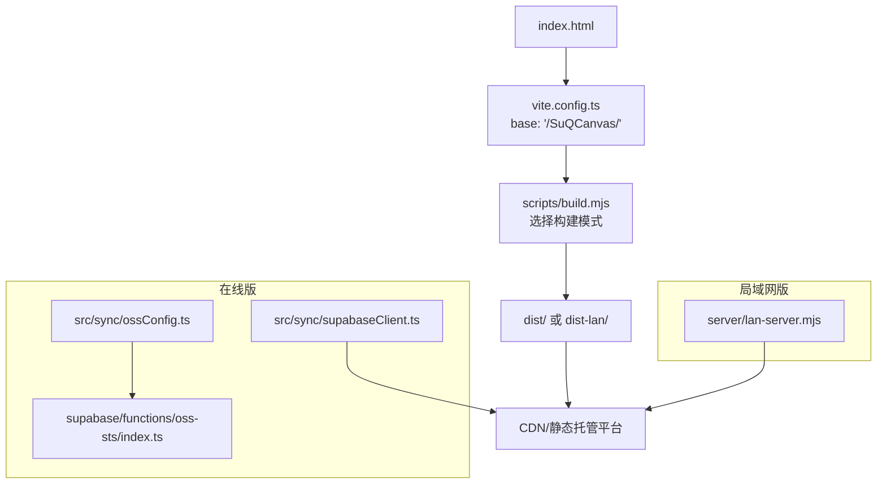
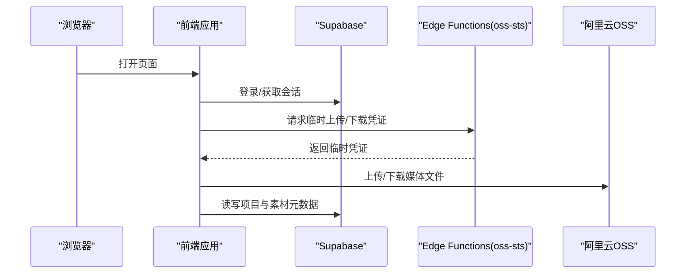
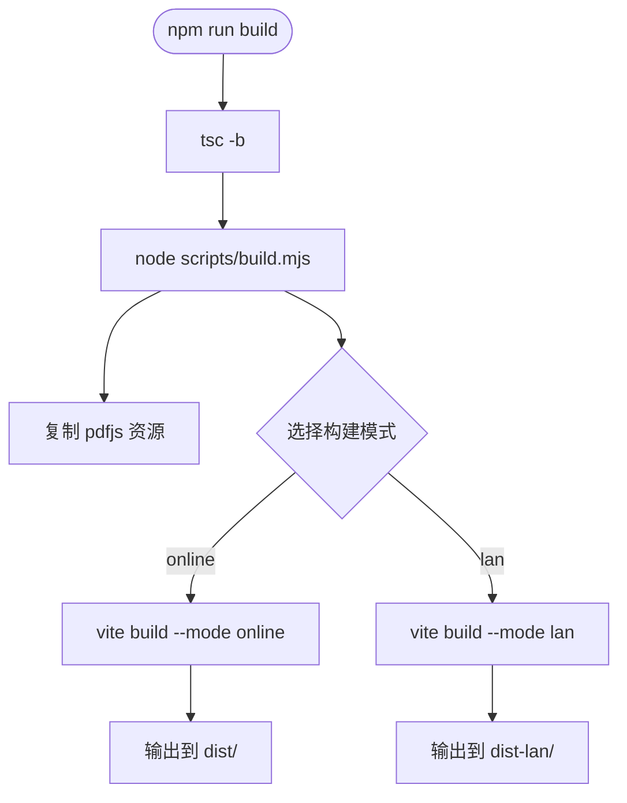
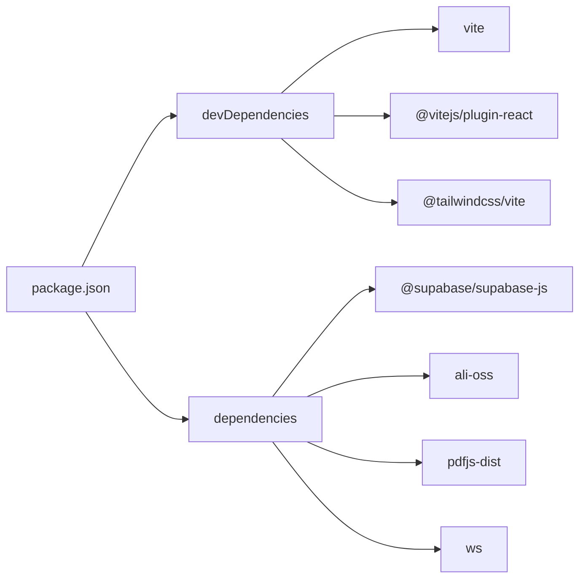

# 静态站点部署

<cite>
**本文引用的文件**
- [package.json](file://package.json)
- [vite.config.ts](file://vite.config.ts)
- [index.html](file://index.html)
- [README.md](file://README.md)
- [scripts/build.mjs](file://scripts/build.mjs)
- [src/buildMode.ts](file://src/buildMode.ts)
- [src/sync/supabaseClient.ts](file://src/sync/supabaseClient.ts)
- [src/sync/ossConfig.ts](file://src/sync/ossConfig.ts)
- [supabase/functions/oss-sts/index.ts](file://supabase/functions/oss-sts/index.ts)
- [server/lan-server.mjs](file://server/lan-server.mjs)
</cite>

## 目录
1. [简介](#简介)
2. [项目结构](#项目结构)
3. [核心组件](#核心组件)
4. [架构总览](#架构总览)
5. [详细组件分析](#详细组件分析)
6. [依赖关系分析](#依赖关系分析)
7. [性能与缓存优化](#性能与缓存优化)
8. [故障排查指南](#故障排查指南)
9. [结论](#结论)
10. [附录：各平台部署清单](#附录：各平台部署清单)

## 简介
本指南面向将本项目以“静态站点”形式发布到 GitHub Pages、Vercel、Netlify 等平台的工程实践。内容涵盖：
- 使用 Vite 构建生产版本（在线版/局域网版）
- 基础路径 base 配置与子目录部署注意事项
- 环境变量注入与敏感信息隔离
- CDN 与缓存策略、域名绑定与 SSL 证书配置
- 各平台的具体配置文件示例与部署脚本要点
- 常见问题定位与排错建议

## 项目结构
- 入口与构建配置
  - index.html：应用入口，引用 /src/main.tsx
  - vite.config.ts：设置 base、插件、开发代理、测试环境
  - package.json：脚本命令、依赖、构建目标
- 构建产物与资源
  - scripts/build.mjs：统一打包入口，支持 online/lan/all 三种模式
  - scripts/copy-pdfjs-assets.mjs：复制 pdfjs-dist 的 cmaps/standard_fonts/wasm 到 public/pdfjs
- 运行时能力
  - src/buildMode.ts：根据 VITE_BUILD_TARGET 决定在线/局域网构建分支
  - src/sync/supabaseClient.ts：在线版 Supabase 客户端初始化
  - src/sync/ossConfig.ts：OSS 配置检测与 key 生成
  - supabase/functions/oss-sts/index.ts：边缘函数签发 OSS 临时凭证
  - server/lan-server.mjs：局域网中继服务（仅局域网版需要）

**图表来源**
- [vite.config.ts:6-8](file://vite.config.ts#L6-L8)
- [scripts/build.mjs:17-64](file://scripts/build.mjs#L17-L64)
- [src/sync/supabaseClient.ts:4-13](file://src/sync/supabaseClient.ts#L4-L13)
- [src/sync/ossConfig.ts:1-11](file://src/sync/ossConfig.ts#L1-L11)
- [supabase/functions/oss-sts/index.ts:1-12](file://supabase/functions/oss-sts/index.ts#L1-L12)
- [server/lan-server.mjs:351-400](file://server/lan-server.mjs#L351-L400)

**章节来源**
- [package.json:6-20](file://package.json#L6-L20)
- [vite.config.ts:6-16](file://vite.config.ts#L6-L16)
- [index.html:1-21](file://index.html#L1-L21)
- [scripts/build.mjs:1-94](file://scripts/build.mjs#L1-L94)

## 核心组件
- 构建系统
  - Vite + React + Tailwind CSS
  - 多目标构建：online（在线版）、lan（局域网版）、all（两者）
- 环境变量与构建开关
  - VITE_BUILD_TARGET：控制在线/局域网构建分支
  - VITE_SUPABASE_URL / VITE_SUPABASE_ANON_KEY：在线版登录与云同步
  - VITE_OSS_*：OSS 区域、桶名、AK 或 STS URL
- 资源与依赖
  - pdfjs-dist 资源复制到 public/pdfjs，确保 PDF 渲染可用
  - 局域网版需额外启动 lan-server 提供协作与素材流式访问

**章节来源**
- [src/buildMode.ts:1-8](file://src/buildMode.ts#L1-L8)
- [scripts/build.mjs:27-41](file://scripts/build.mjs#L27-L41)
- [scripts/copy-pdfjs-assets.mjs:1-20](file://scripts/copy-pdfjs-assets.mjs#L1-L20)

## 架构总览
下图展示在线版的典型数据流：前端通过 Supabase 进行认证与数据同步，媒体文件通过阿里云 OSS 存储，STS 临时凭证由 Supabase Edge Functions 签发。

**图表来源**
- [src/sync/supabaseClient.ts:4-13](file://src/sync/supabaseClient.ts#L4-L13)
- [supabase/functions/oss-sts/index.ts:1-12](file://supabase/functions/oss-sts/index.ts#L1-L12)
- [src/sync/ossConfig.ts:1-11](file://src/sync/ossConfig.ts#L1-L11)

## 详细组件分析

### 构建与输出
- 构建命令
  - npm run build：交互选择构建目标
  - npm run build:online：仅在线版 -> dist/
  - npm run build:lan：仅局域网版 -> dist-lan/
  - npm run build:all：同时构建两个版本
- 构建流程
  - 先执行 tsc -b 类型检查
  - 再运行 scripts/build.mjs，内部调用 Vite 构建并清理输出目录
  - 构建前自动复制 pdfjs-dist 资源到 public/pdfjs
- 环境变量读取顺序
  - .env -> .env.local -> .env.online -> .env.online.local -> process.env
  - 在线版缺失 Supabase 密钥会给出警告

**图表来源**
- [package.json:6-20](file://package.json#L6-L20)
- [scripts/build.mjs:22-64](file://scripts/build.mjs#L22-L64)
- [scripts/copy-pdfjs-assets.mjs:1-20](file://scripts/copy-pdfjs-assets.mjs#L1-L20)

**章节来源**
- [scripts/build.mjs:1-94](file://scripts/build.mjs#L1-L94)
- [package.json:6-20](file://package.json#L6-L20)

### 基础路径与子目录部署
- 当前 base 设置为 /SuQCanvas/，适合部署在仓库根路径下的子目录（如 GitHub Pages 的仓库级 Pages）。
- 若部署到根域（如 https://example.com），请将 base 改为 / 或按平台要求调整。
- 注意：所有静态资源与路由都会基于 base 拼接，务必保证服务器正确解析该路径。

**章节来源**
- [vite.config.ts:6-8](file://vite.config.ts#L6-L8)

### 环境变量与敏感信息
- 在线版必需
  - VITE_SUPABASE_URL、VITE_SUPABASE_ANON_KEY：用于登录与云同步
  - VITE_OSS_REGION、VITE_OSS_BUCKET、VITE_OSS_ACCESS_KEY_ID 或 VITE_OSS_STS_URL：用于媒体存储
- 局域网版可选
  - VITE_LAN_WS_URL：覆盖默认 WebSocket 地址
- 安全建议
  - 不要提交包含密钥的环境文件到仓库
  - 使用平台提供的“环境变量/Secrets”功能注入
  - 优先使用 STS 临时凭证而非长期 AK

**章节来源**
- [src/sync/supabaseClient.ts:4-13](file://src/sync/supabaseClient.ts#L4-L13)
- [src/sync/ossConfig.ts:1-11](file://src/sync/ossConfig.ts#L1-L11)
- [scripts/build.mjs:31-52](file://scripts/build.mjs#L31-L52)
- [supabase/functions/oss-sts/index.ts:1-12](file://supabase/functions/oss-sts/index.ts#L1-L12)

### 局域网版与反向代理
- 局域网版需单独启动中继服务，并在 Nginx 中反代 WebSocket 与素材路径
- 关键路径
  - /lan-ws：WebSocket 反代
  - /SuQCanvas/assets/：素材 HTTP 流式拉取（封面生成等）
- 生产环境应使用 HTTPS，并通过 wss 连接中继

**章节来源**
- [README.md:62-123](file://README.md#L62-L123)
- [server/lan-server.mjs:351-400](file://server/lan-server.mjs#L351-L400)

## 依赖关系分析
- 构建期依赖
  - vite、@vitejs/plugin-react、@tailwindcss/vite
  - typescript、vitest
- 运行期依赖（在线版）
  - @supabase/supabase-js：认证与数据库
  - ali-oss：直传/下载（配合 STS）
  - pdfjs-dist：PDF 渲染（资源已复制到 public）
- 运行期依赖（局域网版）
  - ws：WebSocket 通信
  - 本地文件系统：项目与素材持久化

**图表来源**
- [package.json:22-50](file://package.json#L22-L50)

**章节来源**
- [package.json:22-50](file://package.json#L22-L50)

## 性能与缓存优化
- 构建产物
  - 使用 Vite 默认代码分割与压缩；按需引入 pdfjs 资源
  - 避免将大文件打入 bundle，媒体走 OSS/CDN
- 缓存策略
  - HTML：短缓存或无缓存（便于更新）
  - JS/CSS：带 content hash 的文件可长缓存
  - 图片/PDF：开启强缓存与 CDN 缓存
- 网络优化
  - 启用 gzip/brotli 压缩
  - 使用 CDN 就近分发静态资源
  - 合理设置 Cache-Control、ETag、Last-Modified
- 离线与降级
  - 在线版未配置 Supabase/OSS 时自动降级为纯本地模式
  - 局域网版在无网络时仍可本地编辑，但无法协作

[本节为通用指导，不直接分析具体文件]

## 故障排查指南
- 构建失败
  - 确认 Node 版本满足要求（见包引擎约束）
  - 检查是否缺少 pdfjs-dist 资源（构建前会自动复制）
- 在线版无法登录/同步
  - 检查环境变量是否注入成功
  - 确认 Supabase 项目存在且 RLS 策略正确
- 媒体上传失败
  - 校验 OSS 区域、桶名、AK/STS 配置
  - 确认 Edge Functions 已部署并可被前端访问
- 局域网版无法协作
  - 确认 lan-server 已启动并监听端口
  - 检查防火墙与反向代理配置（/lan-ws、/SuQCanvas/assets/）
  - 确认 HTTPS 下使用 wss 连接

**章节来源**
- [scripts/build.mjs:27-52](file://scripts/build.mjs#L27-L52)
- [supabase/functions/oss-sts/index.ts:1-12](file://supabase/functions/oss-sts/index.ts#L1-L12)
- [README.md:62-123](file://README.md#L62-L123)

## 结论
- 本项目通过 Vite 的多模式构建，可同时产出在线版与局域网版静态资源
- 在线版依赖 Supabase 与 OSS，建议通过 STS 临时凭证提升安全性
- 局域网版需配套中继服务与反向代理，适合内网协作场景
- 部署前务必核对 base、环境变量、CDN 与缓存策略，确保线上稳定高效

[本节为总结性内容，不直接分析具体文件]

## 附录：各平台部署清单

### GitHub Pages
- 适用场景
  - 仓库级 Pages：https://<user>.github.io/<repo>/
  - 用户级 Pages：https://<user>.github.io/
- 基础路径
  - 仓库级 Pages：保持 base 为 /<repo>/（例如 /SuQCanvas/）
  - 用户级 Pages：将 base 改为 /
- 部署方式
  - 手动：运行构建命令后上传 dist 或 dist-lan 到 gh-pages 分支
  - CI：使用 Actions 在 push 时执行构建并发布
- 环境变量
  - 在 Actions Secrets 中配置 VITE_SUPABASE_URL、VITE_SUPABASE_ANON_KEY、VITE_OSS_*
- 注意事项
  - 若使用子目录部署，确保 base 与 Pages 路径一致
  - 关闭不必要的缓存或设置合适的 Cache-Control

[本节为通用操作指引，不直接分析具体文件]

### Vercel
- 构建命令
  - npm run build:online 或 npm run build:lan（根据需求）
- 输出目录
  - dist 或 dist-lan
- 环境变量
  - 在 Vercel 项目设置中添加 VITE_* 变量
- 路由与重定向
  - SPA 单页应用需配置 fallback 到 index.html
- 域名与 SSL
  - 绑定自定义域名后自动颁发 SSL 证书
- 缓存
  - 静态资源默认开启 CDN 缓存，可按需配置

[本节为通用操作指引，不直接分析具体文件]

### Netlify
- 构建命令
  - npm run build:online 或 npm run build:lan
- 输出目录
  - dist 或 dist-lan
- 环境变量
  - 在 Netlify 项目设置中添加 VITE_* 变量
- 重定向
  - 配置 SPA 路由重定向至 index.html
- 域名与 SSL
  - 绑定域名后自动启用 HTTPS
- 缓存
  - 可通过 netlify.toml 配置 Cache-Control

[本节为通用操作指引，不直接分析具体文件]

### 自建 Nginx（含局域网版）
- 静态站点
  - 将构建产物放置于站点目录，设置 base 与实际路径一致
- 反向代理
  - /lan-ws：WebSocket 反代到局域网中继
  - /SuQCanvas/assets/：素材 HTTP 流式拉取反代
- 缓存与压缩
  - 启用 gzip/brotli
  - 为静态资源设置长缓存，HTML 短缓存或无缓存
- 域名与 SSL
  - 配置 HTTPS，强制跳转 wss 用于 WebSocket

**章节来源**
- [README.md:62-123](file://README.md#L62-L123)
- [server/lan-server.mjs:351-400](file://server/lan-server.mjs#L351-L400)