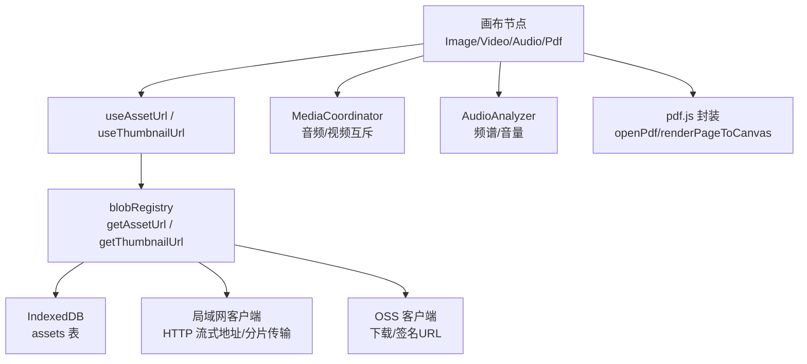
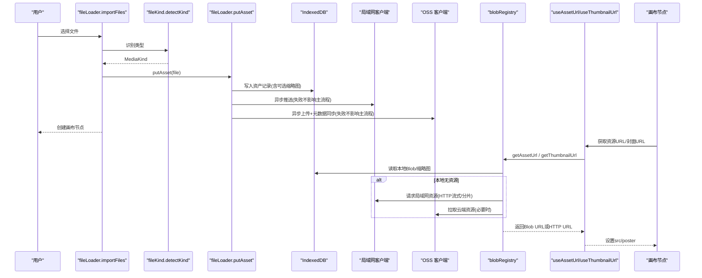
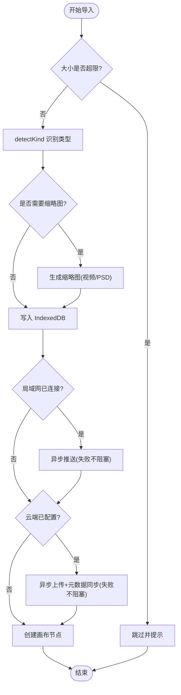
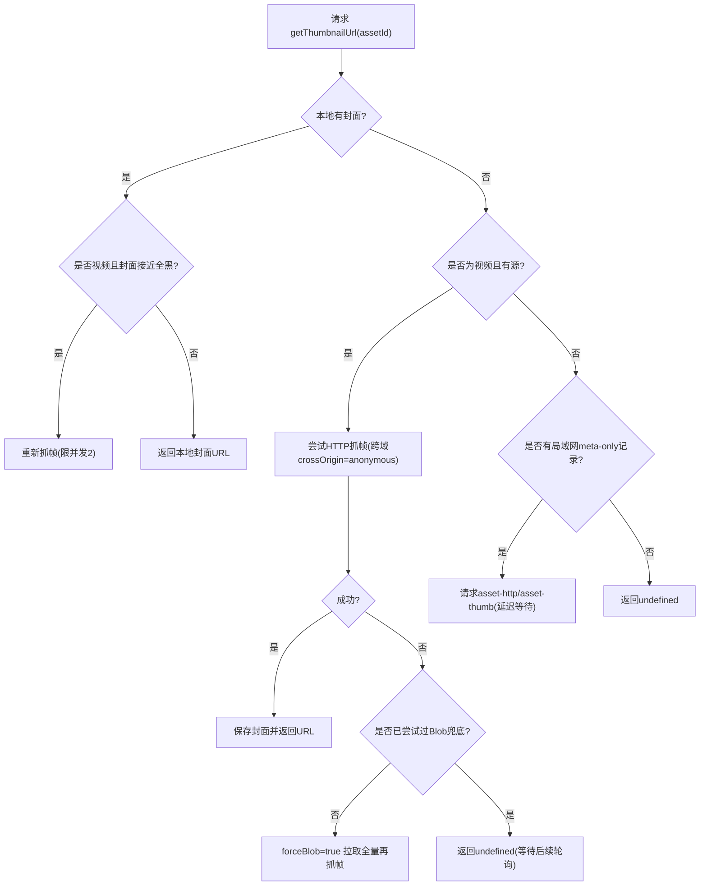
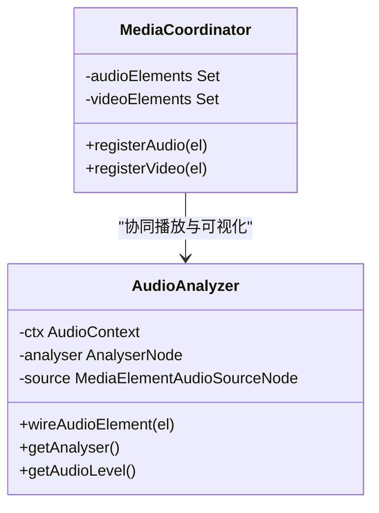
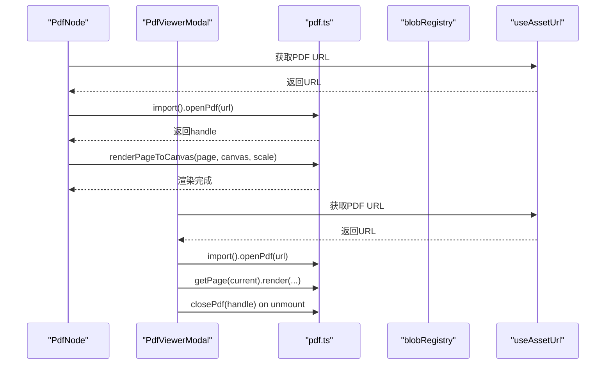
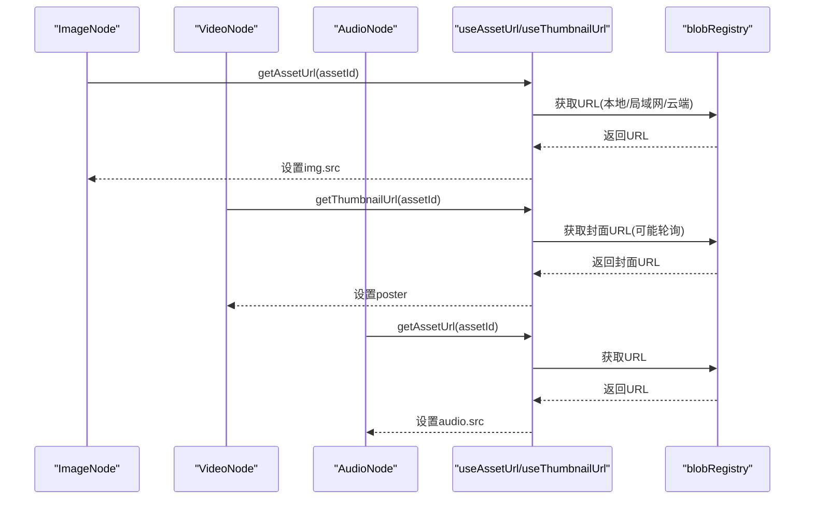
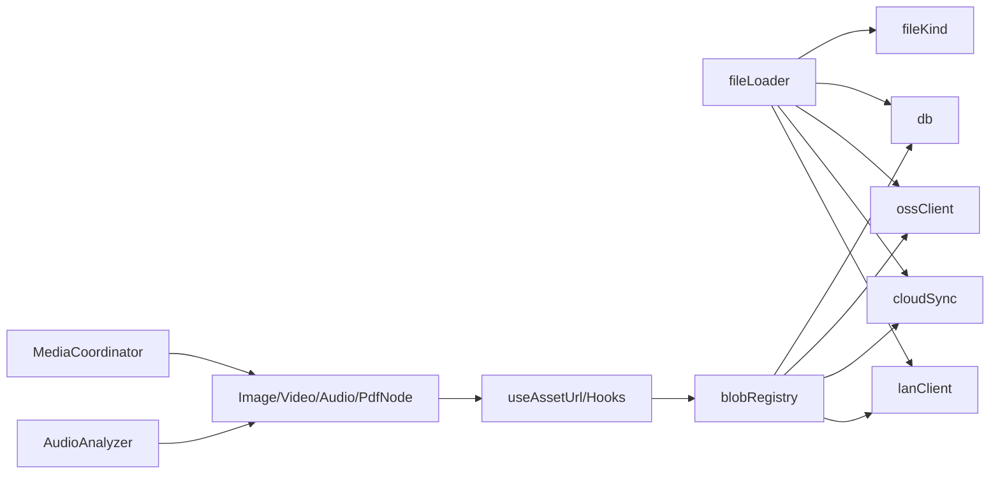

# 异步数据处理流

<cite>
**本文引用的文件**
- [src/media/mediaCoordinator.ts](file://src/media/mediaCoordinator.ts)
- [src/media/managedFile.ts](file://src/media/managedFile.ts)
- [src/io/fileLoader.ts](file://src/io/fileLoader.ts)
- [src/media/pdf.ts](file://src/media/pdf.ts)
- [src/media/audioAnalyzer.ts](file://src/media/audioAnalyzer.ts)
- [src/media/fileKind.ts](file://src/media/fileKind.ts)
- [src/media/blobRegistry.ts](file://src/media/blobRegistry.ts)
- [src/media/useAssetUrl.ts](file://src/media/useAssetUrl.ts)
- [src/sync/ossClient.ts](file://src/sync/ossClient.ts)
- [src/sync/cloudSync.ts](file://src/sync/cloudSync.ts)
- [src/canvas/nodes/ImageNode.tsx](file://src/canvas/nodes/ImageNode.tsx)
- [src/canvas/nodes/VideoNode.tsx](file://src/canvas/nodes/VideoNode.tsx)
- [src/canvas/nodes/AudioNode.tsx](file://src/canvas/nodes/AudioNode.tsx)
- [src/canvas/nodes/PdfNode.tsx](file://src/canvas/nodes/PdfNode.tsx)
- [src/components/PdfViewerModal.tsx](file://src/components/PdfViewerModal.tsx)
</cite>

## 目录
1. [简介](#简介)
2. [项目结构](#项目结构)
3. [核心组件](#核心组件)
4. [架构总览](#架构总览)
5. [详细组件分析](#详细组件分析)
6. [依赖关系分析](#依赖关系分析)
7. [性能考量](#性能考量)
8. [故障排查指南](#故障排查指南)
9. [结论](#结论)
10. [附录](#附录)

## 简介
本文件面向 SuQCanvas 的异步数据处理流，聚焦于文件导入、媒体加载与网络请求的 Promise 链式处理模式。文档重点说明：
- 文件类型识别与资源预加载策略
- MediaCoordinator 对音频/视频的并发互斥控制
- 图片、视频、音频、PDF、PSD、文本等资源的异步加载流程
- 错误重试机制、并发控制与内存管理
- 在 React 节点中使用 await/async 的典型调用模式

## 项目结构
SuQCanvas 将“素材导入—资源定位—渲染展示”拆分为多个职责清晰的模块：
- 导入与元数据：fileLoader.ts 负责文件入库、缩略图生成、云端/局域网同步
- 资源定位与缓存：blobRegistry.ts 提供 getAssetUrl/getThumbnailUrl，统一本地 IndexedDB、OSS、局域网 HTTP 流式地址
- 媒体协调：mediaCoordinator.ts 实现同类型媒体播放互斥；audioAnalyzer.ts 提供 Web Audio 频谱分析
- PDF 渲染：pdf.ts 封装 pdfjs 打开、关闭与页面渲染
- 类型识别：fileKind.ts 根据 MIME/扩展名识别 MediaKind
- React 节点层：Image/Video/Audio/PdfNode 通过 useAssetUrl/useThumbnailUrl 消费资源 URL
- 云端/局域网：ossClient.ts/cloudSync.ts 提供云存储与元数据同步能力

图表来源
- [src/media/blobRegistry.ts:84-126](file://src/media/blobRegistry.ts#L84-L126)
- [src/media/useAssetUrl.ts:10-44](file://src/media/useAssetUrl.ts#L10-L44)
- [src/media/mediaCoordinator.ts:1-25](file://src/media/mediaCoordinator.ts#L1-L25)
- [src/media/audioAnalyzer.ts:1-59](file://src/media/audioAnalyzer.ts#L1-L59)
- [src/media/pdf.ts:1-50](file://src/media/pdf.ts#L1-L50)

章节来源
- [src/io/fileLoader.ts:77-117](file://src/io/fileLoader.ts#L77-L117)
- [src/media/blobRegistry.ts:84-126](file://src/media/blobRegistry.ts#L84-L126)
- [src/media/useAssetUrl.ts:10-44](file://src/media/useAssetUrl.ts#L10-L44)

## 核心组件
- 文件导入与元数据持久化：putAsset/importFiles 完成类型识别、缩略图生成、IndexedDB 落库，并触发云端/局域网异步同步
- 资源定位器：getAssetUrl/getThumbnailUrl 提供统一的 Blob URL 或 HTTP 流式地址，内置缓存、重试与并发控制
- 媒体协调器：同一时刻仅允许一个音频和一个视频播放，自动暂停其他同类型媒体
- PDF 渲染器：openPdf/closePdf/renderPageToCanvas 封装 pdfjs 生命周期
- 音频分析器：wireAudioElement/getAnalyser/getAudioLevel 为可视化提供实时频率/波形数据

章节来源
- [src/io/fileLoader.ts:77-117](file://src/io/fileLoader.ts#L77-L117)
- [src/media/blobRegistry.ts:84-126](file://src/media/blobRegistry.ts#L84-L126)
- [src/media/mediaCoordinator.ts:1-25](file://src/media/mediaCoordinator.ts#L1-L25)
- [src/media/pdf.ts:18-50](file://src/media/pdf.ts#L18-L50)
- [src/media/audioAnalyzer.ts:1-59](file://src/media/audioAnalyzer.ts#L1-L59)

## 架构总览
下图展示了从用户导入文件到最终在画布节点中渲染的完整异步链路，包括本地缓存、云端/局域网回源、缩略图生成与并发控制。

图表来源
- [src/io/fileLoader.ts:77-117](file://src/io/fileLoader.ts#L77-L117)
- [src/media/blobRegistry.ts:84-126](file://src/media/blobRegistry.ts#L84-L126)
- [src/media/blobRegistry.ts:310-379](file://src/media/blobRegistry.ts#L310-L379)
- [src/media/useAssetUrl.ts:10-44](file://src/media/useAssetUrl.ts#L10-L44)
- [src/sync/ossClient.ts:22-63](file://src/sync/ossClient.ts#L22-L63)
- [src/sync/cloudSync.ts:29-68](file://src/sync/cloudSync.ts#L29-L68)

## 详细组件分析

### 文件导入与类型识别（fileLoader + fileKind）
- 类型识别：根据 MIME 与扩展名判断 image/video/audio/pdf/markdown/text/psd/file
- 导入流程：限制文件大小、生成视频/PSD 缩略图、写入 IndexedDB、创建画布节点、异步推送到局域网与云端
- 错误处理：单个文件失败不影响其他文件；失败时提示用户

图表来源
- [src/media/fileKind.ts:3-16](file://src/media/fileKind.ts#L3-L16)
- [src/io/fileLoader.ts:77-117](file://src/io/fileLoader.ts#L77-L117)
- [src/io/fileLoader.ts:186-205](file://src/io/fileLoader.ts#L186-L205)

章节来源
- [src/media/fileKind.ts:3-16](file://src/media/fileKind.ts#L3-L16)
- [src/io/fileLoader.ts:77-117](file://src/io/fileLoader.ts#L77-L117)
- [src/io/fileLoader.ts:186-205](file://src/io/fileLoader.ts#L186-L205)

### 资源定位与缓存（blobRegistry）
- 资源 URL：优先本地 Blob URL，其次局域网 HTTP 流式地址，最后回源云端/局域网拉取
- 缩略图 URL：优先局域网已同步封面；否则对视频进行抓帧生成，支持跨源抓取与黑帧重试；HTTP 抓帧失败时一次性回退到全量 Blob 再抓
- 并发控制：封面抓帧最大并发 2，避免多 video seek 占满浏览器连接池
- 重试与兜底：局域网资源可能仍在传输，使用轮询等待；HTTP 抓帧失败后一次性强制拉取 Blob 重试
- 内存管理：及时 revokeObjectURL，清理 urlCache/thumbCache

图表来源
- [src/media/blobRegistry.ts:128-239](file://src/media/blobRegistry.ts#L128-L239)
- [src/media/blobRegistry.ts:241-268](file://src/media/blobRegistry.ts#L241-L268)
- [src/media/blobRegistry.ts:310-379](file://src/media/blobRegistry.ts#L310-L379)

章节来源
- [src/media/blobRegistry.ts:84-126](file://src/media/blobRegistry.ts#L84-L126)
- [src/media/blobRegistry.ts:128-239](file://src/media/blobRegistry.ts#L128-L239)
- [src/media/blobRegistry.ts:241-268](file://src/media/blobRegistry.ts#L241-L268)
- [src/media/blobRegistry.ts:310-379](file://src/media/blobRegistry.ts#L310-L379)

### 媒体协调与音频分析（mediaCoordinator + audioAnalyzer）
- 媒体互斥：注册音频/视频元素，任意元素触发 play 时自动暂停其他同类型正在播放的元素
- 音频分析：单例 AnalyserNode，接入当前 <audio> 元素输出，提供频谱与音量级用于可视化

图表来源
- [src/media/mediaCoordinator.ts:1-25](file://src/media/mediaCoordinator.ts#L1-L25)
- [src/media/audioAnalyzer.ts:1-59](file://src/media/audioAnalyzer.ts#L1-L59)

章节来源
- [src/media/mediaCoordinator.ts:1-25](file://src/media/mediaCoordinator.ts#L1-L25)
- [src/media/audioAnalyzer.ts:1-59](file://src/media/audioAnalyzer.ts#L1-L59)

### PDF 异步加载与渲染（pdf.ts + PdfNode + PdfViewerModal）
- 打开与关闭：openPdf 返回 handle，closePdf 销毁任务释放内存
- 页面渲染：renderPageToCanvas 按设备像素比缩放绘制到 canvas
- 节点内预览：PdfNode 懒加载 pdf 模块，首帧渲染后更新状态，取消时清理资源
- 全屏查看：PdfViewerModal 按需加载 pdf 模块，切换页码时复用 doc，渲染当前页

图表来源
- [src/media/pdf.ts:18-50](file://src/media/pdf.ts#L18-L50)
- [src/canvas/nodes/PdfNode.tsx:11-62](file://src/canvas/nodes/PdfNode.tsx#L11-L62)
- [src/components/PdfViewerModal.tsx:24-56](file://src/components/PdfViewerModal.tsx#L24-L56)

章节来源
- [src/media/pdf.ts:18-50](file://src/media/pdf.ts#L18-L50)
- [src/canvas/nodes/PdfNode.tsx:11-62](file://src/canvas/nodes/PdfNode.tsx#L11-L62)
- [src/components/PdfViewerModal.tsx:24-56](file://src/components/PdfViewerModal.tsx#L24-L56)

### 图片/视频/音频节点的异步消费模式
- 图片节点：useAssetUrl 获取 Blob URL，onLoad 自适应尺寸，双击打开大图查看器
- 视频节点：useThumbnailUrl 获取封面，点击/双击进入播放器页，完整视频仅在播放器中按需拉取
- 音频节点：useAssetUrl 获取音频 URL，结合 playerStore 控制播放/暂停，显示进度与时长

图表来源
- [src/canvas/nodes/ImageNode.tsx:15-56](file://src/canvas/nodes/ImageNode.tsx#L15-L56)
- [src/canvas/nodes/VideoNode.tsx:18-49](file://src/canvas/nodes/VideoNode.tsx#L18-L49)
- [src/canvas/nodes/AudioNode.tsx:18-47](file://src/canvas/nodes/AudioNode.tsx#L18-L47)
- [src/media/useAssetUrl.ts:10-44](file://src/media/useAssetUrl.ts#L10-L44)
- [src/media/blobRegistry.ts:84-126](file://src/media/blobRegistry.ts#L84-L126)

章节来源
- [src/canvas/nodes/ImageNode.tsx:15-56](file://src/canvas/nodes/ImageNode.tsx#L15-L56)
- [src/canvas/nodes/VideoNode.tsx:18-49](file://src/canvas/nodes/VideoNode.tsx#L18-L49)
- [src/canvas/nodes/AudioNode.tsx:18-47](file://src/canvas/nodes/AudioNode.tsx#L18-L47)
- [src/media/useAssetUrl.ts:10-44](file://src/media/useAssetUrl.ts#L10-L44)

## 依赖关系分析
- fileLoader 依赖 fileKind 进行类型识别，依赖 db 持久化，依赖 ossClient/cloudSync/lanClient 进行异步同步
- blobRegistry 依赖 db、ossClient、cloudSync、lanClient，统一管理资源 URL 与缩略图
- useAssetUrl/useThumbnailUrl 作为 React 钩子，封装重试与轮询逻辑，降低节点复杂度
- 媒体协调与音频分析独立于资源定位，但共同服务于媒体节点

图表来源
- [src/io/fileLoader.ts:77-117](file://src/io/fileLoader.ts#L77-L117)
- [src/media/blobRegistry.ts:84-126](file://src/media/blobRegistry.ts#L84-L126)
- [src/media/useAssetUrl.ts:10-44](file://src/media/useAssetUrl.ts#L10-L44)
- [src/media/mediaCoordinator.ts:1-25](file://src/media/mediaCoordinator.ts#L1-L25)
- [src/media/audioAnalyzer.ts:1-59](file://src/media/audioAnalyzer.ts#L1-L59)

章节来源
- [src/io/fileLoader.ts:77-117](file://src/io/fileLoader.ts#L77-L117)
- [src/media/blobRegistry.ts:84-126](file://src/media/blobRegistry.ts#L84-L126)
- [src/media/useAssetUrl.ts:10-44](file://src/media/useAssetUrl.ts#L10-L44)

## 性能考量
- 并发控制：封面抓帧最大并发 2，避免多 video seek 阻塞浏览器连接池
- 流式播放：视频优先使用局域网 HTTP 流式地址，边下边播，减少本地内存/磁盘压力
- 缓存策略：urlCache/thumbCache 缓存 Blob URL，缩短二次访问延迟
- 内存管理：及时 revokeObjectURL，清理 PDF 任务与页面，WeakSet 跟踪已接线的音频元素
- 降级与兜底：HTTP 抓帧失败时一次性回退到全量 Blob；局域网传输未完成时轮询等待

[本节为通用性能建议，无需具体文件引用]

## 故障排查指南
- 资源加载失败：useAssetUrl 内置最多 5 次重试，间隔 1200ms；失败时提示用户
- 封面加载缓慢：useThumbnailUrl 快速轮询 16 次，之后在局域网连接状态下慢速轮询最长 5 分钟
- 视频封面黑帧：检测平均亮度极低时自动 seek 并重试，最多 4 次；仍失败则回退到 Blob 抓帧
- 局域网资源未就绪：requestAssetFromLan 采用空闲超时续期；若仍未收到，getAssetBlob 会重试一次
- 云端/局域网同步失败：上传/同步失败不阻塞主流程，仅记录警告并提示用户

章节来源
- [src/media/useAssetUrl.ts:10-44](file://src/media/useAssetUrl.ts#L10-L44)
- [src/media/useAssetUrl.ts:52-99](file://src/media/useAssetUrl.ts#L52-L99)
- [src/media/blobRegistry.ts:128-239](file://src/media/blobRegistry.ts#L128-L239)
- [src/media/blobRegistry.ts:107-126](file://src/media/blobRegistry.ts#L107-L126)
- [src/io/fileLoader.ts:77-117](file://src/io/fileLoader.ts#L77-L117)

## 结论
SuQCanvas 的异步数据处理流以“本地优先、云端/局域网回源、智能缩略图生成与并发控制”为核心，通过 blobRegistry 统一资源定位，useAssetUrl/useThumbnailUrl 封装重试与轮询，配合 mediaCoordinator 与 audioAnalyzer 保障媒体播放体验。该设计在保证离线可用性的同时，兼顾了大文件场景下的内存与带宽占用，并通过完善的错误处理与降级策略提升鲁棒性。

## 附录
- 典型 await/async 使用示例（路径引用）
  - 导入文件并创建节点：[importFiles:186-205](file://src/io/fileLoader.ts#L186-L205)
  - 获取资源 URL：[getAssetUrl:84-105](file://src/media/blobRegistry.ts#L84-L105)
  - 获取封面 URL：[getThumbnailUrl:310-379](file://src/media/blobRegistry.ts#L310-L379)
  - 打开 PDF：[openPdf:23-27](file://src/media/pdf.ts#L23-L27)
  - 渲染 PDF 页面：[renderPageToCanvas:35-50](file://src/media/pdf.ts#L35-L50)
  - 音频元素接入分析器：[wireAudioElement:26-39](file://src/media/audioAnalyzer.ts#L26-L39)
  - 节点内异步加载 PDF：[PdfNode useEffect:19-62](file://src/canvas/nodes/PdfNode.tsx#L19-L62)
  - 模态框加载 PDF：[loadDoc:24-39](file://src/components/PdfViewerModal.tsx#L24-L39)