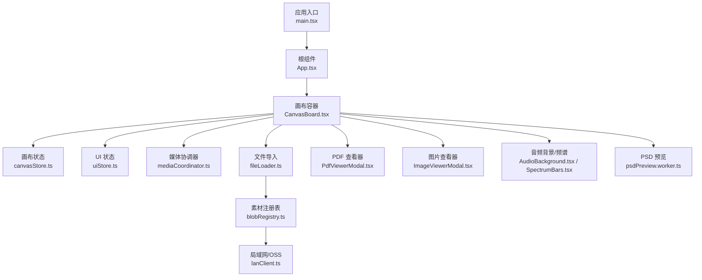
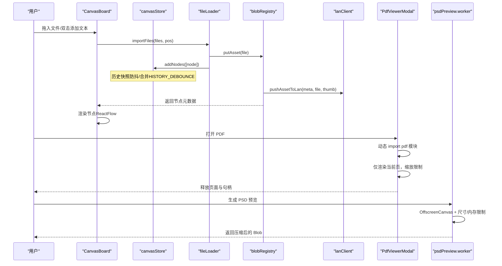
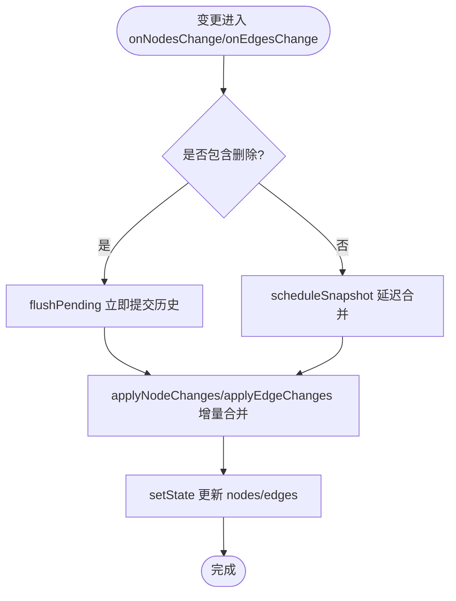
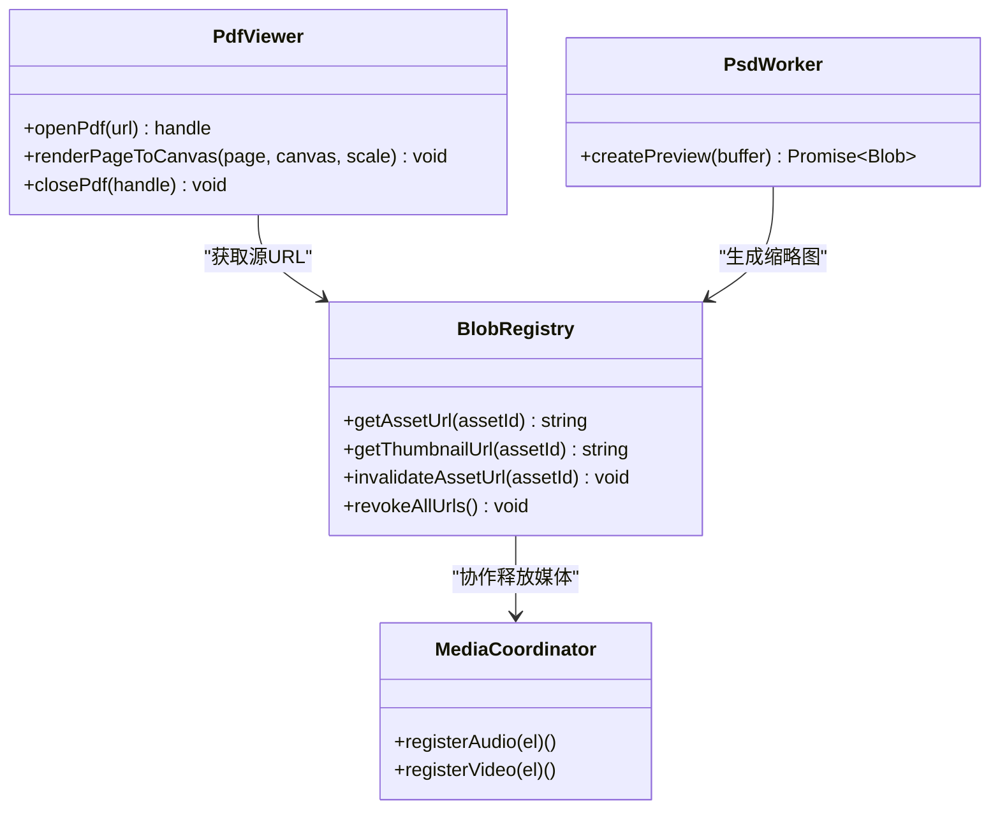
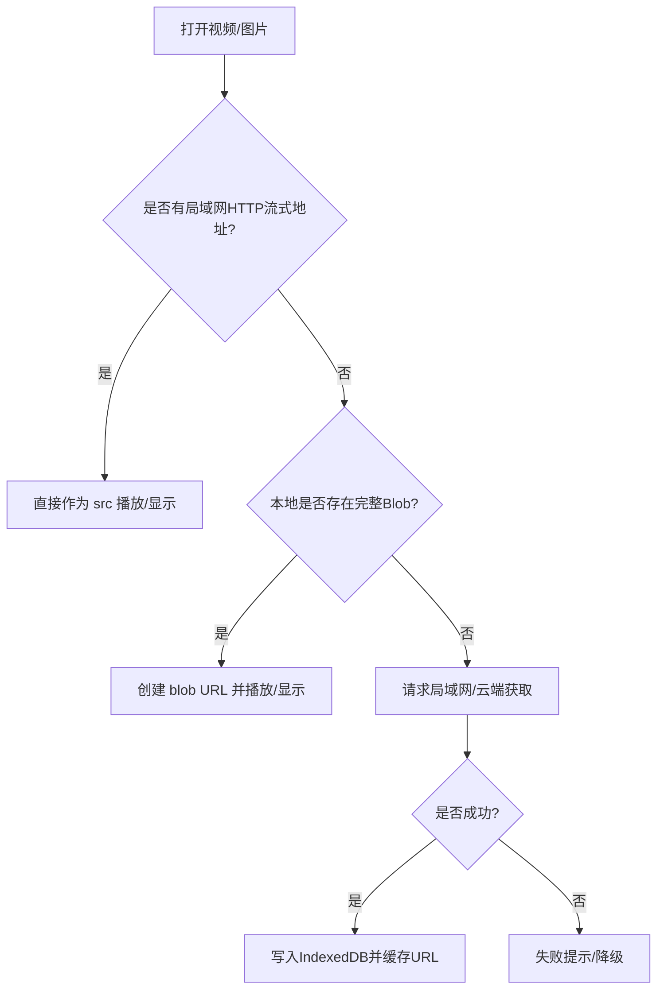
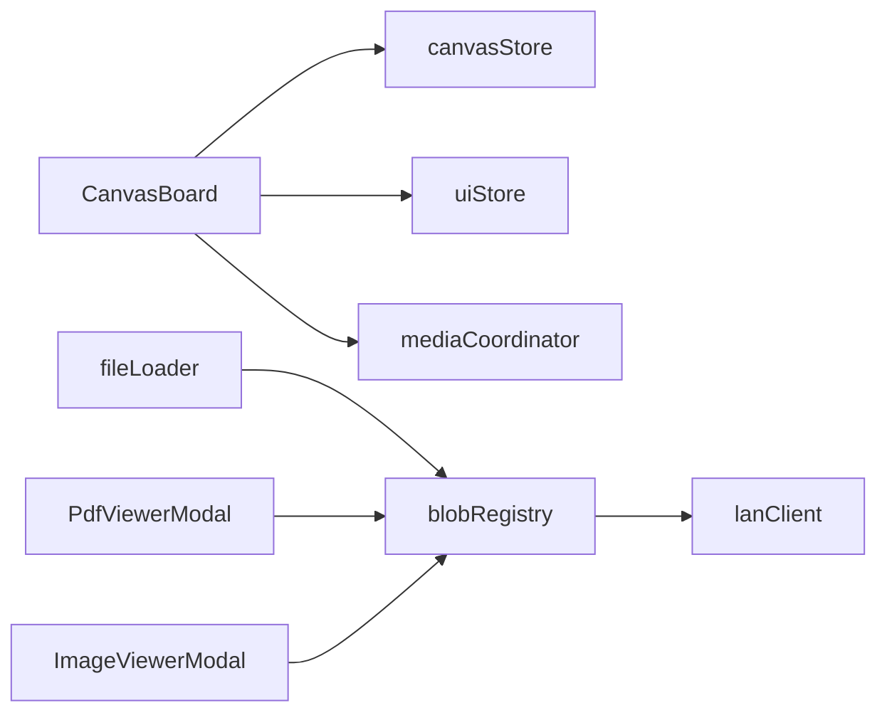

# 性能优化策略

<cite>
**本文引用的文件**
- [src/main.tsx](file://src/main.tsx)
- [src/App.tsx](file://src/App.tsx)
- [src/canvas/CanvasBoard.tsx](file://src/canvas/CanvasBoard.tsx)
- [src/store/canvasStore.ts](file://src/store/canvasStore.ts)
- [src/io/fileLoader.ts](file://src/io/fileLoader.ts)
- [src/media/blobRegistry.ts](file://src/media/blobRegistry.ts)
- [src/media/mediaCoordinator.ts](file://src/media/mediaCoordinator.ts)
- [src/media/psdPreview.worker.ts](file://src/media/psdPreview.worker.ts)
- [src/components/PdfViewerModal.tsx](file://src/components/PdfViewerModal.tsx)
- [src/components/ImageViewerModal.tsx](file://src/components/ImageViewerModal.tsx)
- [src/components/AudioBackground.tsx](file://src/components/AudioBackground.tsx)
- [src/components/SpectrumBars.tsx](file://src/components/SpectrumBars.tsx)
- [src/sync/lanClient.ts](file://src/sync/lanClient.ts)
</cite>

## 目录
1. [简介](#简介)
2. [项目结构](#项目结构)
3. [核心组件](#核心组件)
4. [架构总览](#架构总览)
5. [详细组件分析](#详细组件分析)
6. [依赖关系分析](#依赖关系分析)
7. [性能考量与指标](#性能考量与指标)
8. [故障排查指南](#故障排查指南)
9. [结论](#结论)
10. [附录](#附录)

## 简介
本文件面向 SuQCanvas 的性能优化，围绕以下目标展开：
- 状态更新的批量处理机制：防抖、节流、合并更新。
- UI 渲染优化：虚拟滚动、懒加载、内存回收等策略。
- 大文件处理优化：分块加载、Web Worker、内存管理。
- 性能监控指标与优化效果对比方法。
- 浏览器兼容性考虑与资源加载优化策略。

## 项目结构
SuQCanvas 采用 React + Zustand 的状态驱动架构，画布基于 @xyflow/react，媒体资源通过 IndexedDB 与局域网/OSS 协同获取，PDF/PSD 等大文件解析在 Web Worker 或按需模块中执行，避免阻塞主线程。

图表来源
- [src/main.tsx:1-6](file://src/main.tsx#L1-L6)
- [src/App.tsx:1-74](file://src/App.tsx#L1-L74)
- [src/canvas/CanvasBoard.tsx:1-459](file://src/canvas/CanvasBoard.tsx#L1-L459)
- [src/store/canvasStore.ts:1-399](file://src/store/canvasStore.ts#L1-L399)
- [src/io/fileLoader.ts:1-297](file://src/io/fileLoader.ts#L1-L297)
- [src/media/blobRegistry.ts:1-389](file://src/media/blobRegistry.ts#L1-L389)
- [src/media/mediaCoordinator.ts:1-25](file://src/media/mediaCoordinator.ts#L1-L25)
- [src/components/PdfViewerModal.tsx:1-146](file://src/components/PdfViewerModal.tsx#L1-L146)
- [src/components/ImageViewerModal.tsx:1-165](file://src/components/ImageViewerModal.tsx#L1-L165)
- [src/components/AudioBackground.tsx:45-94](file://src/components/AudioBackground.tsx#L45-L94)
- [src/components/SpectrumBars.tsx:38-73](file://src/components/SpectrumBars.tsx#L38-L73)
- [src/media/psdPreview.worker.ts:1-82](file://src/media/psdPreview.worker.ts#L1-L82)
- [src/sync/lanClient.ts:834-921](file://src/sync/lanClient.ts#L834-L921)

章节来源
- [src/main.tsx:1-6](file://src/main.tsx#L1-L6)
- [src/App.tsx:1-74](file://src/App.tsx#L1-L74)

## 核心组件
- 画布与交互：CanvasBoard 负责节点/边变更、视口同步、工具模式、拖拽导入、快捷键、局域网光标与编辑锁定。
- 状态管理：canvasStore 提供节点/边变更、撤销重做、对齐、层级、视口等；uiStore 管理 UI 视图与导入队列。
- 媒体与资源：fileLoader 负责文件导入、缩略图生成、云端/局域网同步；blobRegistry 管理 URL/缩略图缓存、并发控制、HTTP 流式拉取与兜底。
- 大型资源：PDF 按需加载与页面级渲染；PSD 在 Web Worker 中解码并限制尺寸与内存。
- 媒体互斥：mediaCoordinator 保证同一时刻仅一个音频/视频播放，避免抢占资源。

章节来源
- [src/canvas/CanvasBoard.tsx:1-459](file://src/canvas/CanvasBoard.tsx#L1-L459)
- [src/store/canvasStore.ts:1-399](file://src/store/canvasStore.ts#L1-L399)
- [src/io/fileLoader.ts:1-297](file://src/io/fileLoader.ts#L1-L297)
- [src/media/blobRegistry.ts:1-389](file://src/media/blobRegistry.ts#L1-L389)
- [src/media/mediaCoordinator.ts:1-25](file://src/media/mediaCoordinator.ts#L1-L25)
- [src/components/PdfViewerModal.tsx:1-146](file://src/components/PdfViewerModal.tsx#L1-L146)
- [src/media/psdPreview.worker.ts:1-82](file://src/media/psdPreview.worker.ts#L1-L82)

## 架构总览
下图展示从用户操作到状态更新、资源加载与渲染的关键路径，突出批量更新、并发控制与懒加载点。

图表来源
- [src/canvas/CanvasBoard.tsx:210-334](file://src/canvas/CanvasBoard.tsx#L210-L334)
- [src/io/fileLoader.ts:77-205](file://src/io/fileLoader.ts#L77-L205)
- [src/media/blobRegistry.ts:77-126](file://src/media/blobRegistry.ts#L77-L126)
- [src/sync/lanClient.ts:891-921](file://src/sync/lanClient.ts#L891-L921)
- [src/components/PdfViewerModal.tsx:24-56](file://src/components/PdfViewerModal.tsx#L24-L56)
- [src/media/psdPreview.worker.ts:41-81](file://src/media/psdPreview.worker.ts#L41-L81)

## 详细组件分析

### 状态更新的批量处理机制
- 撤销/重做历史快照防抖：对非删除类变更使用定时器合并快照，减少频繁写入 past/future；删除类变更立即落盘以保证一致性。
- 变更合并：onNodesChange/onEdgesChange 使用库函数 applyNodeChanges/applyEdgeChanges 进行增量合并，避免全量重建。
- 选择/对齐/层级调整：批量计算后一次性 set，减少重排次数。
- 视口同步：局域网远端视口变化时以动画过渡平滑切换，避免抖动。

图表来源
- [src/store/canvasStore.ts:66-145](file://src/store/canvasStore.ts#L66-L145)
- [src/store/canvasStore.ts:290-361](file://src/store/canvasStore.ts#L290-L361)
- [src/canvas/CanvasBoard.tsx:94-102](file://src/canvas/CanvasBoard.tsx#L94-L102)

章节来源
- [src/store/canvasStore.ts:30-107](file://src/store/canvasStore.ts#L30-L107)
- [src/store/canvasStore.ts:126-145](file://src/store/canvasStore.ts#L126-L145)
- [src/store/canvasStore.ts:290-361](file://src/store/canvasStore.ts#L290-L361)
- [src/canvas/CanvasBoard.tsx:94-102](file://src/canvas/CanvasBoard.tsx#L94-L102)

### UI 渲染优化
- 虚拟滚动：画布由 @xyflow/react 内部实现虚拟化，结合最小/最大缩放限制与局部选中，降低 DOM 数量。
- 懒加载：
  - PDF 页面按需加载与渲染，关闭时清理页面与句柄，避免常驻内存。
  - PSD 预览在 Web Worker 中生成，限制尺寸与内存，避免主线程卡顿。
  - 图片查看器仅在打开时加载大图，支持缩放与自适应窗口。
- 内存回收：
  - blobRegistry 维护 URL 与缩略图缓存，并提供失效与全部释放接口。
  - 媒体互斥确保同类型媒体同时仅一个播放，减少解码与缓冲压力。
  - 音频背景与频谱使用 ResizeObserver 与 requestAnimationFrame，按 DPR 裁剪画布尺寸，避免过度绘制。

图表来源
- [src/media/blobRegistry.ts:12-56](file://src/media/blobRegistry.ts#L12-L56)
- [src/media/blobRegistry.ts:84-126](file://src/media/blobRegistry.ts#L84-L126)
- [src/media/blobRegistry.ts:310-379](file://src/media/blobRegistry.ts#L310-L379)
- [src/media/mediaCoordinator.ts:1-25](file://src/media/mediaCoordinator.ts#L1-L25)
- [src/components/PdfViewerModal.tsx:24-56](file://src/components/PdfViewerModal.tsx#L24-L56)
- [src/media/psdPreview.worker.ts:41-81](file://src/media/psdPreview.worker.ts#L41-L81)

章节来源
- [src/components/PdfViewerModal.tsx:24-56](file://src/components/PdfViewerModal.tsx#L24-L56)
- [src/components/ImageViewerModal.tsx:14-70](file://src/components/ImageViewerModal.tsx#L14-L70)
- [src/components/AudioBackground.tsx:45-94](file://src/components/AudioBackground.tsx#L45-L94)
- [src/components/SpectrumBars.tsx:38-73](file://src/components/SpectrumBars.tsx#L38-L73)
- [src/media/mediaCoordinator.ts:1-25](file://src/media/mediaCoordinator.ts#L1-L25)
- [src/media/blobRegistry.ts:381-389](file://src/media/blobRegistry.ts#L381-L389)

### 大文件处理优化
- 分块/流式加载：
  - 视频优先使用局域网 HTTP 流式地址，边下边播，避免整份下载到 IndexedDB。
  - 局域网传输具备空闲超时与重试机制，保障断线恢复。
- Web Worker：
  - PSD 解码在 worker 中进行，限制文档尺寸与像素数，使用 OffscreenCanvas 与内存上限，输出压缩后的预览图。
- 内存管理：
  - blobRegistry 对 URL/缩略图进行缓存与失效管理，必要时强制回退为本地 blob 以确保封面可生成。
  - 媒体互斥避免多实例解码导致内存峰值。

图表来源
- [src/media/blobRegistry.ts:84-126](file://src/media/blobRegistry.ts#L84-L126)
- [src/sync/lanClient.ts:891-921](file://src/sync/lanClient.ts#L891-L921)
- [src/media/psdPreview.worker.ts:41-81](file://src/media/psdPreview.worker.ts#L41-L81)

章节来源
- [src/media/blobRegistry.ts:84-126](file://src/media/blobRegistry.ts#L84-L126)
- [src/media/blobRegistry.ts:310-379](file://src/media/blobRegistry.ts#L310-L379)
- [src/media/psdPreview.worker.ts:1-82](file://src/media/psdPreview.worker.ts#L1-L82)
- [src/sync/lanClient.ts:891-921](file://src/sync/lanClient.ts#L891-L921)

### 具体优化实践清单
- 状态更新
  - 使用 HISTORY_DEBOUNCE 合并快照，删除类变更立即提交。
  - 使用 applyNodeChanges/applyEdgeChanges 增量合并变更。
  - 对齐/层级调整批量计算后一次 set。
- UI 渲染
  - 利用 @xyflow 的虚拟化与缩放限制。
  - PDF 页面级渲染与关闭清理。
  - PSD 预览在 Worker 中限制尺寸与内存。
  - 图片查看器按需加载大图，支持缩放与自适应。
  - 媒体互斥，避免多实例播放。
  - 音频背景/频谱使用 ResizeObserver + rAF，按 DPR 裁剪画布。
- 大文件
  - 视频优先走 HTTP 流式，避免整份下载。
  - 局域网传输空闲超时与重试。
  - URL/缩略图缓存与失效管理。
- 兼容性与资源加载
  - 跨域抓帧设置 crossOrigin=anonymous，配合服务器 CORS。
  - 使用 requestVideoFrameCallback 提升抓帧稳定性，不支持则回退 setTimeout。
  - 按需动态 import 重型模块（如 PDF），减少首屏体积。

章节来源
- [src/store/canvasStore.ts:30-107](file://src/store/canvasStore.ts#L30-L107)
- [src/store/canvasStore.ts:126-145](file://src/store/canvasStore.ts#L126-L145)
- [src/store/canvasStore.ts:290-361](file://src/store/canvasStore.ts#L290-L361)
- [src/components/PdfViewerModal.tsx:24-56](file://src/components/PdfViewerModal.tsx#L24-L56)
- [src/media/blobRegistry.ts:128-239](file://src/media/blobRegistry.ts#L128-L239)
- [src/media/blobRegistry.ts:310-379](file://src/media/blobRegistry.ts#L310-L379)
- [src/media/psdPreview.worker.ts:41-81](file://src/media/psdPreview.worker.ts#L41-L81)
- [src/components/AudioBackground.tsx:45-94](file://src/components/AudioBackground.tsx#L45-L94)
- [src/components/SpectrumBars.tsx:38-73](file://src/components/SpectrumBars.tsx#L38-L73)

## 依赖关系分析
- CanvasBoard 依赖 canvasStore 与 uiStore 进行状态读写与视图控制。
- fileLoader 依赖 blobRegistry 与 lanClient 完成素材入库与分发。
- blobRegistry 依赖 lanClient 与 OSS 能力，提供 URL/缩略图缓存与并发控制。
- PdfViewerModal 与 ImageViewerModal 依赖 blobRegistry 获取资源 URL。
- mediaCoordinator 与播放器组件协作，避免多实例冲突。

图表来源
- [src/canvas/CanvasBoard.tsx:1-459](file://src/canvas/CanvasBoard.tsx#L1-L459)
- [src/store/canvasStore.ts:1-399](file://src/store/canvasStore.ts#L1-L399)
- [src/io/fileLoader.ts:1-297](file://src/io/fileLoader.ts#L1-L297)
- [src/media/blobRegistry.ts:1-389](file://src/media/blobRegistry.ts#L1-L389)
- [src/sync/lanClient.ts:834-921](file://src/sync/lanClient.ts#L834-L921)
- [src/components/PdfViewerModal.tsx:1-146](file://src/components/PdfViewerModal.tsx#L1-L146)
- [src/components/ImageViewerModal.tsx:1-165](file://src/components/ImageViewerModal.tsx#L1-L165)
- [src/media/mediaCoordinator.ts:1-25](file://src/media/mediaCoordinator.ts#L1-L25)

章节来源
- [src/canvas/CanvasBoard.tsx:1-459](file://src/canvas/CanvasBoard.tsx#L1-L459)
- [src/store/canvasStore.ts:1-399](file://src/store/canvasStore.ts#L1-L399)
- [src/io/fileLoader.ts:1-297](file://src/io/fileLoader.ts#L1-L297)
- [src/media/blobRegistry.ts:1-389](file://src/media/blobRegistry.ts#L1-L389)
- [src/sync/lanClient.ts:834-921](file://src/sync/lanClient.ts#L834-L921)
- [src/components/PdfViewerModal.tsx:1-146](file://src/components/PdfViewerModal.tsx#L1-L146)
- [src/components/ImageViewerModal.tsx:1-165](file://src/components/ImageViewerModal.tsx#L1-L165)
- [src/media/mediaCoordinator.ts:1-25](file://src/media/mediaCoordinator.ts#L1-L25)

## 性能考量与指标
- 关键指标建议
  - 首屏时间：TTFB、FCP、LCP。
  - 交互响应：输入到渲染延迟（键盘/拖拽）。
  - 长任务占比：主线程阻塞时长。
  - 内存占用：JS Heap、DOM 节点数、图片/视频解码内存。
  - 网络吞吐：带宽占用、重传率、流式进度。
- 优化效果对比方法
  - 基线：关闭懒加载/Worker 与并发限制，记录指标。
  - 开启懒加载与 Worker：对比首屏与交互延迟。
  - 开启流式与缓存：对比大文件打开时间与内存峰值。
  - 开启媒体互斥：对比多实例场景下的 CPU/内存占用。
- 现有优化点
  - 历史快照防抖减少频繁写入。
  - 增量变更合并降低重绘成本。
  - 视频流式播放避免整份下载。
  - PDF/PSD 按需加载与 Worker 隔离。
  - URL/缩略图缓存与失效管理。
  - 媒体互斥避免资源竞争。

[本节为通用指导，不直接分析具体文件]

## 故障排查指南
- 视频封面生成失败
  - 检查跨域配置（crossOrigin）与服务器 CORS。
  - 确认已启用 requestVideoFrameCallback 或回退逻辑。
  - 若仍失败，触发一次性 blob 回退流程。
- 局域网传输卡住
  - 检查空闲超时与重试机制是否生效。
  - 确认等待者队列与失败回调是否正确唤醒。
- PDF 打开失败
  - 检查动态 import 是否成功，关闭时是否清理页面与句柄。
- PSD 预览失败
  - 检查尺寸/内存限制是否触发异常。
  - 确认 OffscreenCanvas 可用性与解码参数。

章节来源
- [src/media/blobRegistry.ts:128-239](file://src/media/blobRegistry.ts#L128-L239)
- [src/media/blobRegistry.ts:310-379](file://src/media/blobRegistry.ts#L310-L379)
- [src/sync/lanClient.ts:891-921](file://src/sync/lanClient.ts#L891-L921)
- [src/components/PdfViewerModal.tsx:24-56](file://src/components/PdfViewerModal.tsx#L24-L56)
- [src/media/psdPreview.worker.ts:41-81](file://src/media/psdPreview.worker.ts#L41-L81)

## 结论
SuQCanvas 通过状态批量更新、渲染懒加载、大文件流式与 Worker 化、以及严格的内存与并发控制，实现了在高负载场景下的稳定体验。建议持续以指标驱动优化，针对热点路径（导入、打开大文件、翻页、频谱绘制）进行专项调优，并结合局域网/OSS 能力进一步降低首屏与交互延迟。

[本节为总结性内容，不直接分析具体文件]

## 附录
- 浏览器兼容性要点
  - 使用 OffscreenCanvas 与 requestVideoFrameCallback 时需检测可用性并回退。
  - 跨域资源需正确配置 CORS，确保抓帧与流式播放正常。
- 资源加载优化
  - 动态 import 重型模块（PDF）。
  - 优先使用流式地址，避免整份下载。
  - 合理设置 preload 与 poster，减少初始开销。

[本节为补充信息，不直接分析具体文件]