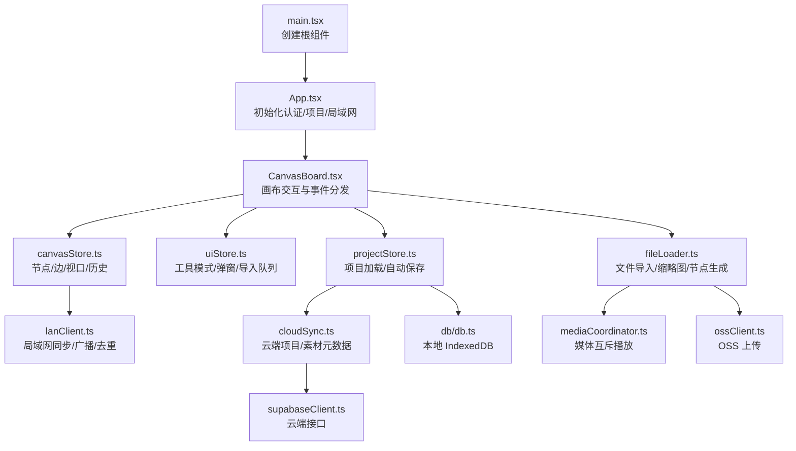
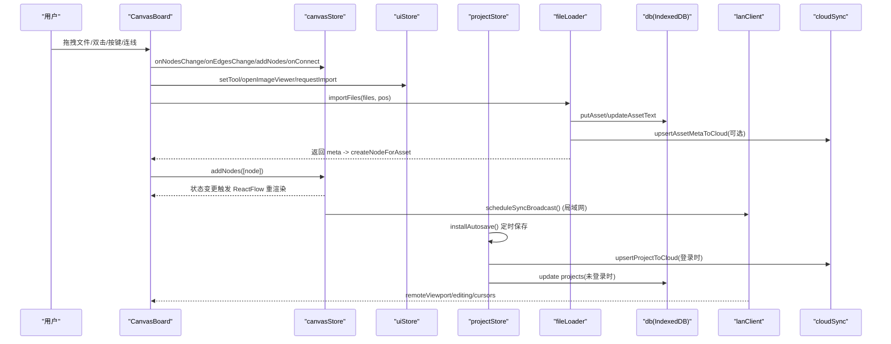
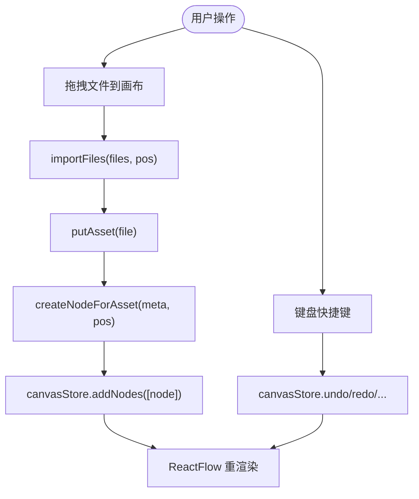
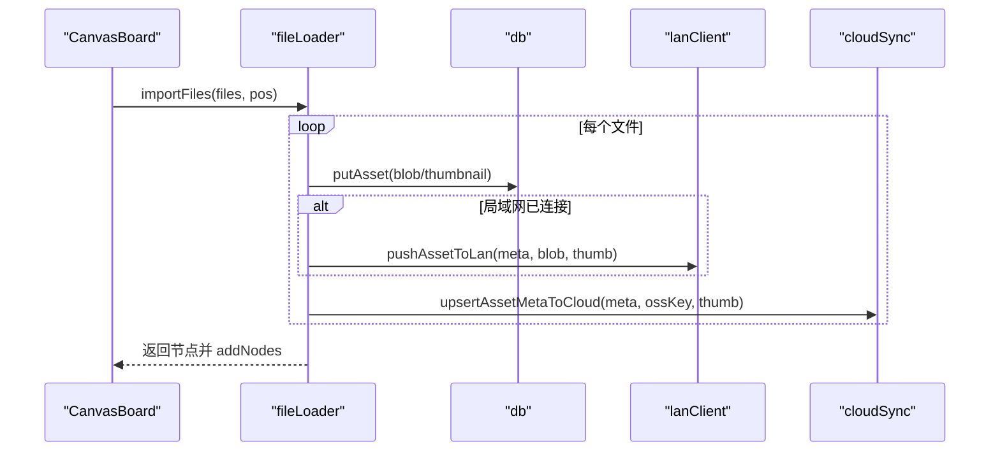
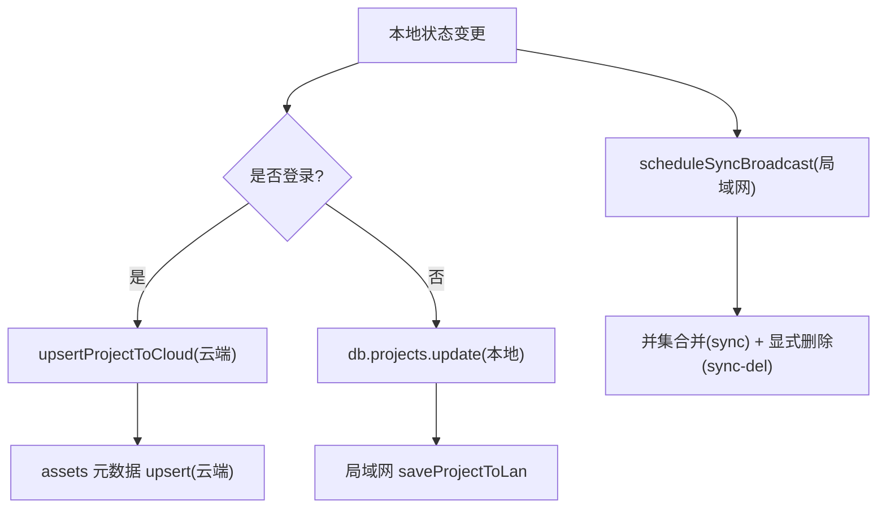
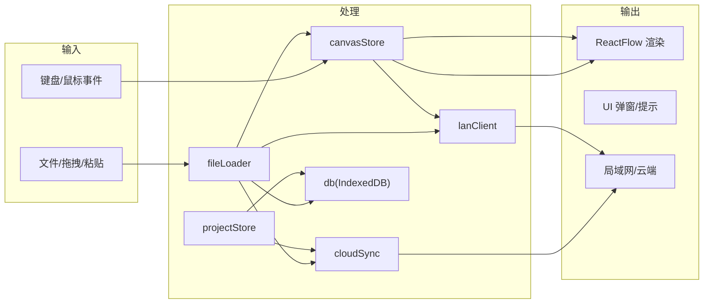
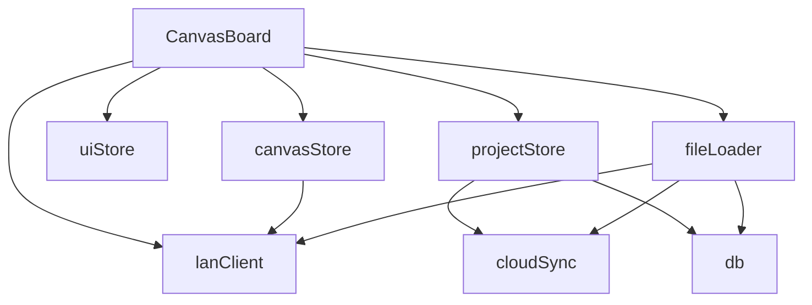

# 数据流设计

<cite>
**本文引用的文件**
- [src/main.tsx](file://src/main.tsx)
- [src/App.tsx](file://src/App.tsx)
- [src/canvas/CanvasBoard.tsx](file://src/canvas/CanvasBoard.tsx)
- [src/store/canvasStore.ts](file://src/store/canvasStore.ts)
- [src/store/uiStore.ts](file://src/store/uiStore.ts)
- [src/store/projectStore.ts](file://src/store/projectStore.ts)
- [src/io/fileLoader.ts](file://src/io/fileLoader.ts)
- [src/db/db.ts](file://src/db/db.ts)
- [src/sync/cloudSync.ts](file://src/sync/cloudSync.ts)
- [src/sync/lanClient.ts](file://src/sync/lanClient.ts)
- [src/media/mediaCoordinator.ts](file://src/media/mediaCoordinator.ts)
- [src/types.ts](file://src/types.ts)
</cite>

## 目录
1. [简介](#简介)
2. [项目结构](#项目结构)
3. [核心组件](#核心组件)
4. [架构总览](#架构总览)
5. [详细组件分析](#详细组件分析)
6. [依赖关系分析](#依赖关系分析)
7. [性能考虑](#性能考虑)
8. [故障排查指南](#故障排查指南)
9. [结论](#结论)
10. [附录](#附录)

## 简介
本文件面向 SuQCanvas 的数据流设计，聚焦以下目标：
- 描述用户操作如何触发状态更新，以及状态变化如何驱动 UI 重新渲染的完整流程。
- 解释事件驱动架构：用户交互 → CanvasBoard → CanvasStore → 状态更新 → UI 重渲染的数据流转路径。
- 阐述异步数据处理：文件导入、媒体加载、网络请求等 Promise 链式处理模式。
- 说明状态同步机制：本地与云端（OSS + Supabase）及局域网协作的状态同步策略，包括乐观更新与冲突解决。
- 提供数据流图，展示不同类型数据的流向和处理节点。
- 总结性能优化策略：批量更新、防抖节流、懒加载与资源复用等。

## 项目结构
SuQCanvas 采用“视图层 + 状态层 + I/O 层 + 同步层”的分层组织：
- 视图层：React 组件（App、CanvasBoard 等），负责渲染和用户交互。
- 状态层：Zustand Store（canvasStore、uiStore、projectStore、lanStore 等），集中管理应用状态与历史。
- I/O 层：文件导入导出、媒体处理、数据库（IndexedDB via Dexie）。
- 同步层：云端（Supabase + OSS）与局域网（WebSocket 中继）协同，实现多端一致性与离线可用。

图表来源
- [src/main.tsx:1-6](file://src/main.tsx#L1-L6)
- [src/App.tsx:19-74](file://src/App.tsx#L19-L74)
- [src/canvas/CanvasBoard.tsx:41-459](file://src/canvas/CanvasBoard.tsx#L41-L459)
- [src/store/canvasStore.ts:118-399](file://src/store/canvasStore.ts#L118-L399)
- [src/store/uiStore.ts:49-116](file://src/store/uiStore.ts#L49-L116)
- [src/store/projectStore.ts:69-229](file://src/store/projectStore.ts#L69-L229)
- [src/io/fileLoader.ts:77-205](file://src/io/fileLoader.ts#L77-L205)
- [src/media/mediaCoordinator.ts:1-25](file://src/media/mediaCoordinator.ts#L1-L25)
- [src/sync/lanClient.ts:644-756](file://src/sync/lanClient.ts#L644-L756)
- [src/sync/cloudSync.ts:121-165](file://src/sync/cloudSync.ts#L121-L165)
- [src/db/db.ts:25-33](file://src/db/db.ts#L25-L33)

章节来源
- [src/main.tsx:1-6](file://src/main.tsx#L1-L6)
- [src/App.tsx:19-74](file://src/App.tsx#L19-L74)

## 核心组件
- CanvasBoard：承载 ReactFlow 画布，监听拖拽、双击、键盘快捷键、鼠标移动等事件，统一转发到 store 或调用 I/O 模块。
- canvasStore：维护 nodes、edges、viewport、历史栈（撤销/重做）、复制粘贴、对齐、层级调整等；通过 applyNodeChanges/applyEdgeChanges 高效更新。
- uiStore：管理工具模式、弹窗（PDF/图片/Markdown/播放器）、导入队列、Toast 提示等。
- projectStore：项目生命周期管理（新建/打开/重命名/保存），自动保存策略，云端/本地选择写入。
- fileLoader：文件识别、缩略图生成、本地持久化、云端/局域网异步推送、节点构造。
- cloudSync：Supabase 项目与素材元数据读写，登录态判断与数据源路由。
- lanClient：局域网 WebSocket 通信，画布增量同步、删除传播、视口广播、活动日志、大文件分片传输、断线重连。
- mediaCoordinator：全局媒体互斥，避免同时播放多个音频/视频。
- db：Dexie 封装，资产与项目表结构、垃圾回收。

章节来源
- [src/canvas/CanvasBoard.tsx:41-459](file://src/canvas/CanvasBoard.tsx#L41-L459)
- [src/store/canvasStore.ts:118-399](file://src/store/canvasStore.ts#L118-L399)
- [src/store/uiStore.ts:49-116](file://src/store/uiStore.ts#L49-L116)
- [src/store/projectStore.ts:69-229](file://src/store/projectStore.ts#L69-L229)
- [src/io/fileLoader.ts:77-205](file://src/io/fileLoader.ts#L77-L205)
- [src/sync/cloudSync.ts:121-165](file://src/sync/cloudSync.ts#L121-L165)
- [src/sync/lanClient.ts:644-756](file://src/sync/lanClient.ts#L644-L756)
- [src/media/mediaCoordinator.ts:1-25](file://src/media/mediaCoordinator.ts#L1-L25)
- [src/db/db.ts:25-33](file://src/db/db.ts#L25-L33)

## 架构总览
下图展示了从用户交互到 UI 重渲染的核心数据流，以及异步 I/O 与多端同步的并行链路。

图表来源
- [src/canvas/CanvasBoard.tsx:222-232](file://src/canvas/CanvasBoard.tsx#L222-L232)
- [src/canvas/CanvasBoard.tsx:336-379](file://src/canvas/CanvasBoard.tsx#L336-L379)
- [src/store/canvasStore.ts:126-158](file://src/store/canvasStore.ts#L126-L158)
- [src/io/fileLoader.ts:186-205](file://src/io/fileLoader.ts#L186-L205)
- [src/sync/lanClient.ts:718-756](file://src/sync/lanClient.ts#L718-L756)
- [src/store/projectStore.ts:46-67](file://src/store/projectStore.ts#L46-L67)
- [src/sync/cloudSync.ts:121-131](file://src/sync/cloudSync.ts#L121-L131)

## 详细组件分析

### 用户交互 → 状态更新 → UI 重渲染（事件驱动）
- 拖拽文件进入画布：
  - CanvasBoard.onDrop 获取文件与位置，调用 importFiles。
  - fileLoader.importFiles 逐个文件 putAsset，生成 AssetMeta，再 createNodeForAsset，最后 addNodes 到 canvasStore。
  - canvasStore.addNodes 记录历史快照并更新 nodes，ReactFlow 收到新节点后重渲染。
- 双击空白添加文本：
  - CanvasBoard.onPaneDoubleClick 计算中心位置，createTextNode 并通过 addNodes 插入。
- 键盘快捷键（撤销/重做/复制/粘贴/全选/缩放/平移）：
  - 直接调用 useCanvasStore.getState().undo/redo/duplicateNode/copySelected/pasteClipboard/onNodesChange 等方法。
- 工具切换与临时平移：
  - 通过 uiStore.setTool 切换 select/connect/drag，影响 ReactFlow 的 selectionOnDrag/nodesDraggable/elementsSelectable 等行为。

图表来源
- [src/canvas/CanvasBoard.tsx:222-232](file://src/canvas/CanvasBoard.tsx#L222-L232)
- [src/canvas/CanvasBoard.tsx:234-242](file://src/canvas/CanvasBoard.tsx#L234-L242)
- [src/canvas/CanvasBoard.tsx:104-150](file://src/canvas/CanvasBoard.tsx#L104-L150)
- [src/io/fileLoader.ts:186-205](file://src/io/fileLoader.ts#L186-L205)
- [src/store/canvasStore.ts:159-171](file://src/store/canvasStore.ts#L159-L171)

章节来源
- [src/canvas/CanvasBoard.tsx:66-150](file://src/canvas/CanvasBoard.tsx#L66-L150)
- [src/canvas/CanvasBoard.tsx:222-242](file://src/canvas/CanvasBoard.tsx#L222-L242)
- [src/store/canvasStore.ts:126-171](file://src/store/canvasStore.ts#L126-L171)

### 异步数据处理（Promise 链式）
- 文件导入与缩略图：
  - importFiles 循环调用 putAsset，内部根据类型生成视频缩略图或 PSD 预览，失败不影响主流程。
  - putAsset 将 Blob 存入 IndexedDB，随后并行发起局域网分发与云端元数据同步（不阻塞 UI）。
- 媒体播放互斥：
  - mediaCoordinator 注册音频/视频元素，任一播放时暂停同类型其他元素，避免并发冲突。
- 云端/局域网异步：
  - 素材上传与元数据写入使用 .catch 容错，确保主流程稳定。
  - 项目保存采用自动保存定时器，合并多次修改为一次持久化。

图表来源
- [src/io/fileLoader.ts:77-117](file://src/io/fileLoader.ts#L77-L117)
- [src/io/fileLoader.ts:186-205](file://src/io/fileLoader.ts#L186-L205)
- [src/media/mediaCoordinator.ts:1-25](file://src/media/mediaCoordinator.ts#L1-L25)

章节来源
- [src/io/fileLoader.ts:77-117](file://src/io/fileLoader.ts#L77-L117)
- [src/io/fileLoader.ts:186-205](file://src/io/fileLoader.ts#L186-L205)
- [src/media/mediaCoordinator.ts:1-25](file://src/media/mediaCoordinator.ts#L1-L25)

### 状态同步机制（本地/云端/局域网）
- 数据源路由：
  - 登录用户：项目列表与项目数据来自云端；未登录/游客：仅本地。
  - 素材元数据：无论是否登录，均尝试上传至 OSS 并写元数据到云端（若配置）。
- 乐观更新：
  - 本地立即更新 nodes/edges/viewport，并广播给局域网；云端/局域网失败不阻断 UI。
- 冲突解决：
  - 局域网：按 id 并集合并远端节点，显式删除通过 sync-del 传播，墓碑机制防止晚到旧快照复活。
  - 云端：以 updatedAt 比较决定覆盖；重连时对账拉取主机快照，保证一致性。
- 自动保存：
  - projectStore 订阅 canvasStore 变化，延迟 500ms 合并保存；登录时写入云端，否则写入本地。

图表来源
- [src/store/projectStore.ts:46-67](file://src/store/projectStore.ts#L46-L67)
- [src/store/projectStore.ts:196-229](file://src/store/projectStore.ts#L196-L229)
- [src/sync/cloudSync.ts:121-165](file://src/sync/cloudSync.ts#L121-L165)
- [src/sync/lanClient.ts:527-598](file://src/sync/lanClient.ts#L527-L598)
- [src/sync/lanClient.ts:644-756](file://src/sync/lanClient.ts#L644-L756)

章节来源
- [src/store/projectStore.ts:46-67](file://src/store/projectStore.ts#L46-L67)
- [src/store/projectStore.ts:196-229](file://src/store/projectStore.ts#L196-L229)
- [src/sync/cloudSync.ts:121-165](file://src/sync/cloudSync.ts#L121-L165)
- [src/sync/lanClient.ts:527-598](file://src/sync/lanClient.ts#L527-L598)
- [src/sync/lanClient.ts:644-756](file://src/sync/lanClient.ts#L644-L756)

### 数据流图（不同类型数据）

图表来源
- [src/canvas/CanvasBoard.tsx:222-232](file://src/canvas/CanvasBoard.tsx#L222-L232)
- [src/io/fileLoader.ts:77-117](file://src/io/fileLoader.ts#L77-L117)
- [src/store/canvasStore.ts:126-158](file://src/store/canvasStore.ts#L126-L158)
- [src/store/projectStore.ts:196-229](file://src/store/projectStore.ts#L196-L229)
- [src/sync/lanClient.ts:644-756](file://src/sync/lanClient.ts#L644-L756)
- [src/sync/cloudSync.ts:121-165](file://src/sync/cloudSync.ts#L121-L165)
- [src/db/db.ts:25-33](file://src/db/db.ts#L25-L33)

## 依赖关系分析
- CanvasBoard 依赖：
  - zustand stores（canvasStore、uiStore、projectStore、lanStore）
  - ReactFlow API（useReactFlow、useStoreApi）
  - I/O（fileLoader）
  - 同步（lanClient）
- canvasStore 依赖：
  - @xyflow/react（applyNodeChanges/applyEdgeChanges）
  - lanStore（用于插入元数据 createdById/createdByName）
- projectStore 依赖：
  - cloudSync（云端项目读写）
  - db（本地项目存储）
  - lanClient（局域网保存与广播）
- fileLoader 依赖：
  - db（资产持久化）
  - cloudSync（元数据上云）
  - lanClient（局域网分发）
  - media（psdPreview、fileKind）

图表来源
- [src/canvas/CanvasBoard.tsx:17-36](file://src/canvas/CanvasBoard.tsx#L17-L36)
- [src/store/canvasStore.ts:1-6](file://src/store/canvasStore.ts#L1-L6)
- [src/store/projectStore.ts:1-17](file://src/store/projectStore.ts#L1-L17)
- [src/io/fileLoader.ts:1-19](file://src/io/fileLoader.ts#L1-L19)

章节来源
- [src/canvas/CanvasBoard.tsx:17-36](file://src/canvas/CanvasBoard.tsx#L17-L36)
- [src/store/canvasStore.ts:1-6](file://src/store/canvasStore.ts#L1-L6)
- [src/store/projectStore.ts:1-17](file://src/store/projectStore.ts#L1-L17)
- [src/io/fileLoader.ts:1-19](file://src/io/fileLoader.ts#L1-L19)

## 性能考虑
- 批量与防抖：
  - 历史记录快照使用防抖（HISTORY_DEBOUNCE=400ms）合并多次编辑，减少历史栈膨胀与重复持久化。
  - 局域网同步使用 scheduleSyncBroadcast（150ms 窗口）合并节点/边变更，降低网络负载。
  - 视口广播使用 100ms 防抖，避免频繁推送。
  - 删除消息使用 scheduleSyncDel（80ms）合并批量删除。
  - 活动日志使用 350ms 合并，避免刷屏。
- 高效更新：
  - 使用 applyNodeChanges/applyEdgeChanges 进行增量更新，避免全量重建。
  - 选择状态在同步时保留 selected 标记，提升用户体验。
- 资源与内存：
  - 大文件分片传输（256KB 分片），避免整包 base64 拼接造成双倍内存。
  - 封面随资产传输，观看端直接显示，无需解码抓帧。
  - 媒体互斥播放，避免并发解码与卡顿。
- 存储与清理：
  - 资产垃圾回收（GC）基于引用计数与超时清理孤儿资产，释放 IndexedDB 空间。
  - 持久化存储请求（requestPersistentStorage）保障大文件长期可用。

章节来源
- [src/store/canvasStore.ts:30-92](file://src/store/canvasStore.ts#L30-L92)
- [src/sync/lanClient.ts:96-117](file://src/sync/lanClient.ts#L96-L117)
- [src/sync/lanClient.ts:644-756](file://src/sync/lanClient.ts#L644-L756)
- [src/io/fileLoader.ts:184-205](file://src/io/fileLoader.ts#L184-L205)
- [src/db/db.ts:46-69](file://src/db/db.ts#L46-L69)
- [src/media/mediaCoordinator.ts:1-25](file://src/media/mediaCoordinator.ts#L1-L25)

## 故障排查指南
- 文件导入失败：
  - 检查文件大小限制（最大 1.5GB），超大会跳过并提示。
  - 缩略图生成失败不影响主流程，但会提示错误 Toast。
  - 云端/局域网上传失败不会中断 UI，需检查网络与权限。
- 局域网同步异常：
  - 断线自动重连（指数退避），首次失败提示地址无效或代理问题。
  - 删除恢复问题：确认墓碑机制生效（TOMBSTONE_MS=60s），避免晚到旧快照复活。
  - 大文件传输超时：空闲超时 60s，避免误杀长耗时传输。
- 云端同步失败：
  - 未登录或无 OSS 配置时跳过上传，仅本地保存。
  - 项目保存失败会设置 saveStatus='error' 并提示自动保存失败。
- 媒体播放冲突：
  - 使用 mediaCoordinator 注册音频/视频，确保同一时刻仅一个音频/视频播放。

章节来源
- [src/io/fileLoader.ts:184-205](file://src/io/fileLoader.ts#L184-L205)
- [src/sync/lanClient.ts:119-152](file://src/sync/lanClient.ts#L119-L152)
- [src/sync/lanClient.ts:70-94](file://src/sync/lanClient.ts#L70-L94)
- [src/sync/cloudSync.ts:121-131](file://src/sync/cloudSync.ts#L121-L131)
- [src/store/projectStore.ts:196-229](file://src/store/projectStore.ts#L196-L229)
- [src/media/mediaCoordinator.ts:1-25](file://src/media/mediaCoordinator.ts#L1-L25)

## 结论
SuQCanvas 的数据流设计以事件驱动为核心，通过 Zustand Store 统一管理状态，结合 ReactFlow 的高效更新机制，实现了流畅的用户体验。异步 I/O 与多端同步采用乐观更新与防抖合并策略，在保证一致性的同时最大化性能。局域网与云端互补，既支持离线工作，又能在联网时保持多端一致。未来可进一步扩展：
- 更细粒度的变更追踪（如字段级 diff）以减少同步带宽。
- 更智能的冲突解决策略（如基于时间戳与操作语义的合并）。
- 更多媒体格式支持与缓存策略优化。

## 附录
- 关键类型定义参考：
  - MediaKind、SuqNode、SuqEdge、EdgeStyle 等类型定义位于 types.ts。
- 入口与初始化：
  - main.tsx 创建根组件，App.tsx 初始化认证、项目与局域网。

章节来源
- [src/types.ts:1-112](file://src/types.ts#L1-L112)
- [src/main.tsx:1-6](file://src/main.tsx#L1-L6)
- [src/App.tsx:19-74](file://src/App.tsx#L19-L74)