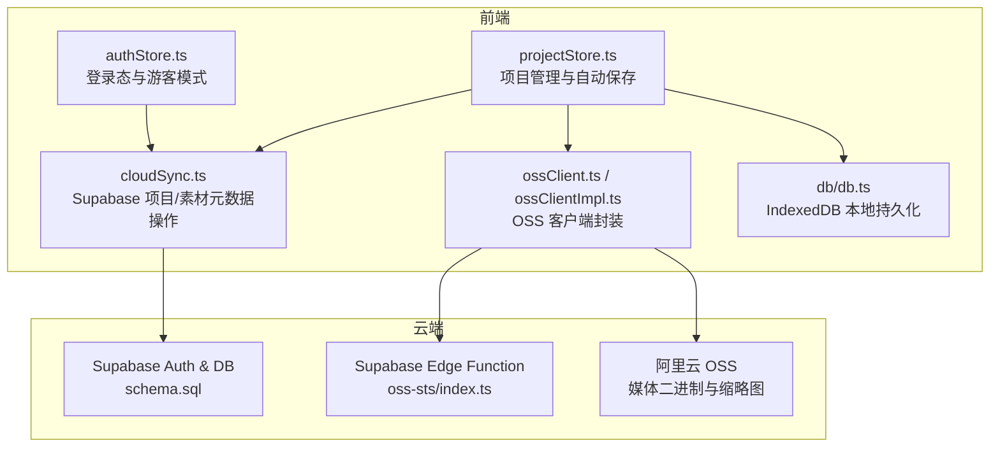
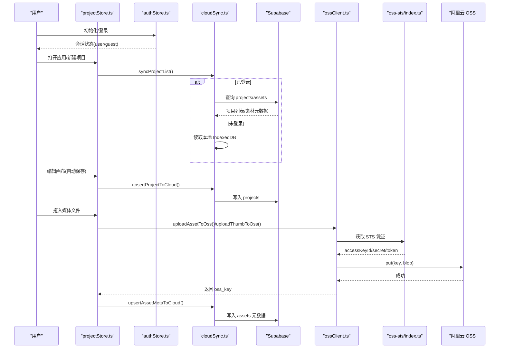
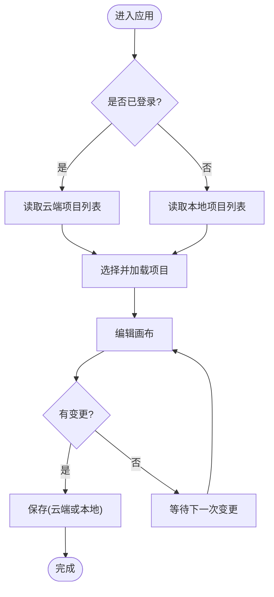
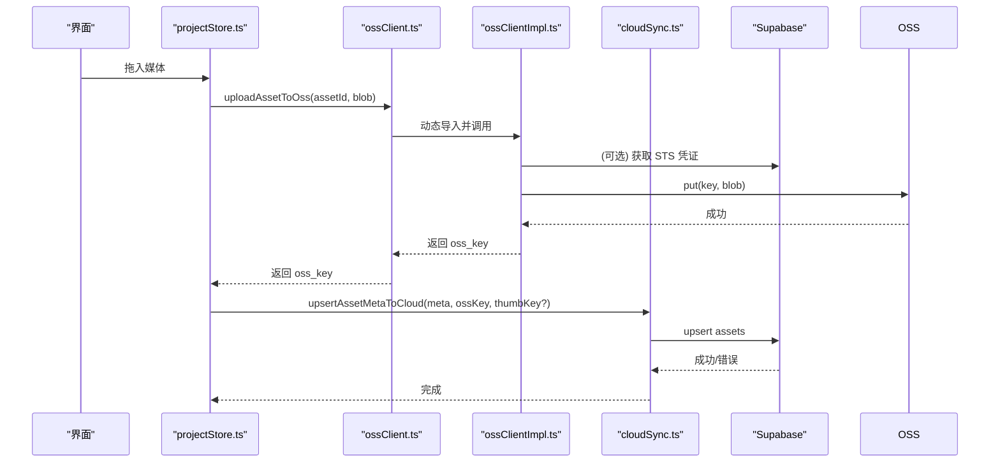
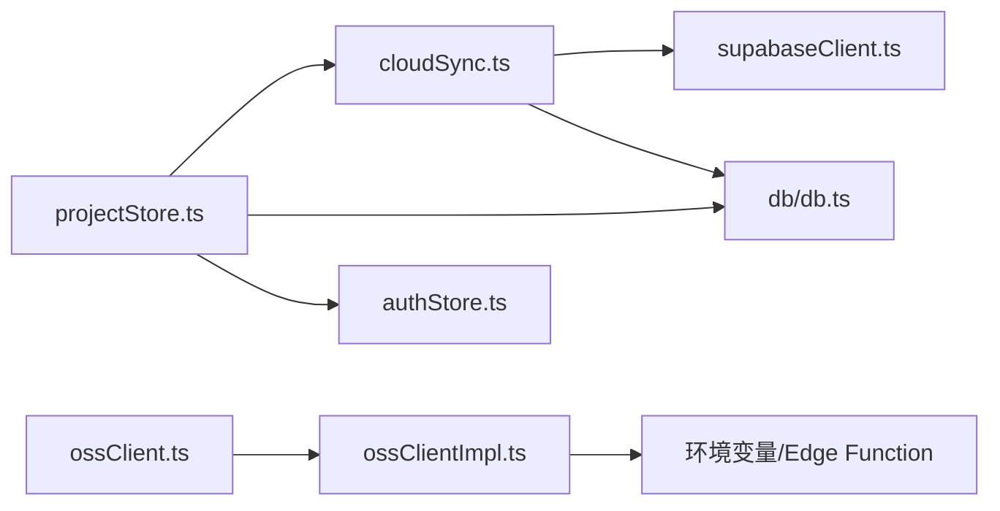

# 云端同步

<cite>
**本文引用的文件**
- [src/sync/cloudSync.ts](file://src/sync/cloudSync.ts)
- [src/sync/supabaseClient.ts](file://src/sync/supabaseClient.ts)
- [src/sync/ossClient.ts](file://src/sync/ossClient.ts)
- [src/sync/ossClientImpl.ts](file://src/sync/ossClientImpl.ts)
- [src/sync/ossConfig.ts](file://src/sync/ossConfig.ts)
- [supabase/schema.sql](file://supabase/schema.sql)
- [supabase/functions/oss-sts/index.ts](file://supabase/functions/oss-sts/index.ts)
- [src/db/db.ts](file://src/db/db.ts)
- [src/store/projectStore.ts](file://src/store/projectStore.ts)
- [src/store/authStore.ts](file://src/store/authStore.ts)
- [src/media/managedFile.ts](file://src/media/managedFile.ts)
- [README.md](file://README.md)
</cite>

## 目录
1. [简介](#简介)
2. [项目结构](#项目结构)
3. [核心组件](#核心组件)
4. [架构总览](#架构总览)
5. [详细组件分析](#详细组件分析)
6. [依赖关系分析](#依赖关系分析)
7. [性能与一致性](#性能与一致性)
8. [安全、隐私与备份恢复](#安全隐私与备份恢复)
9. [故障排查指南](#故障排查指南)
10. [结论](#结论)
11. [附录：API 与数据格式](#附录api-与数据格式)

## 简介
本章节面向 SuQCanvas 的云端同步能力，说明其与 Supabase（数据库与认证）和对象存储服务（OSS）的集成方式，涵盖认证流程、项目与素材的上传下载、版本管理、离线支持、缓存策略、数据安全与备份恢复等。文档同时给出关键 API 调用路径与数据格式定义，帮助开发者快速理解并扩展云同步功能。

## 项目结构
云端同步相关代码集中在 src/sync 目录，配合 supabase 下的数据库 schema 与 Edge Function，以及前端状态与本地存储模块共同完成端到端的数据流。

图表来源
- [src/store/projectStore.ts:1-230](file://src/store/projectStore.ts#L1-L230)
- [src/sync/cloudSync.ts:1-165](file://src/sync/cloudSync.ts#L1-L165)
- [src/sync/ossClient.ts:1-63](file://src/sync/ossClient.ts#L1-L63)
- [src/sync/ossClientImpl.ts:1-135](file://src/sync/ossClientImpl.ts#L1-L135)
- [supabase/schema.sql:1-90](file://supabase/schema.sql#L1-L90)
- [supabase/functions/oss-sts/index.ts:1-111](file://supabase/functions/oss-sts/index.ts#L1-L111)

章节来源
- [README.md:40-57](file://README.md#L40-L57)
- [src/sync/ossConfig.ts:1-20](file://src/sync/ossConfig.ts#L1-L20)

## 核心组件
- 认证与会话：通过 Supabase Auth 获取用户会话，未登录时走游客/本地模式。
- 项目同步：已登录时仅读写云端 projects 表；未登录时仅读写本地 IndexedDB。
- 素材元数据：assets 表记录媒体元信息（名称、MIME、大小、类型、OSS key），实际二进制存储在 OSS。
- 媒体存取：通过动态导入的 OSS 客户端进行上传、下载、签名 URL 生成；局域网构建下直接返回空实现以摇树移除依赖。
- 本地持久化：Dexie 维护 assets 与 projects 两张表，并提供垃圾回收与离线可用能力。

章节来源
- [src/sync/supabaseClient.ts:1-18](file://src/sync/supabaseClient.ts#L1-L18)
- [src/sync/cloudSync.ts:1-165](file://src/sync/cloudSync.ts#L1-L165)
- [src/sync/ossClient.ts:1-63](file://src/sync/ossClient.ts#L1-L63)
- [src/sync/ossClientImpl.ts:1-135](file://src/sync/ossClientImpl.ts#L1-L135)
- [src/db/db.ts:1-69](file://src/db/db.ts#L1-L69)

## 架构总览
SuQCanvas 的云同步采用“项目数据在 Supabase、媒体二进制在 OSS”的分层设计，结合浏览器本地 IndexedDB 提供离线体验。认证由 Supabase Auth 统一处理，OSS 凭证通过 Supabase Edge Function 动态签发 STS 临时令牌，避免前端暴露长期密钥。

图表来源
- [src/store/projectStore.ts:1-230](file://src/store/projectStore.ts#L1-L230)
- [src/sync/cloudSync.ts:1-165](file://src/sync/cloudSync.ts#L1-L165)
- [src/sync/ossClient.ts:1-63](file://src/sync/ossClient.ts#L1-L63)
- [src/sync/ossClientImpl.ts:1-135](file://src/sync/ossClientImpl.ts#L1-L135)
- [supabase/functions/oss-sts/index.ts:1-111](file://supabase/functions/oss-sts/index.ts#L1-L111)

## 详细组件分析

### 认证与会话控制
- 使用 Supabase Client，仅在在线构建且配置齐全时启用。
- 监听 auth 状态变化，切换用户/游客模式，并在切换时重置项目与画布状态，防止云端与本地数据串写。
- 未登录或局域网构建时，所有云同步接口短路返回空结果，确保产物不包含云端依赖。

章节来源
- [src/sync/supabaseClient.ts:1-18](file://src/sync/supabaseClient.ts#L1-L18)
- [src/store/authStore.ts:1-104](file://src/store/authStore.ts#L1-L104)
- [src/sync/ossConfig.ts:1-20](file://src/sync/ossConfig.ts#L1-L20)

### 项目同步与版本管理
- 项目列表：已登录时从云端 projects 表拉取并按更新时间排序；未登录时从本地 IndexedDB 读取。
- 加载项目：已登录时从云端读取指定项目；未登录时从本地读取。
- 保存项目：自动保存基于画布变更节流，已登录时 upsert 到云端 projects；未登录时更新本地 Dexie。
- 重命名/删除：已登录时操作云端；未登录时操作本地。

图表来源
- [src/sync/cloudSync.ts:101-165](file://src/sync/cloudSync.ts#L101-L165)
- [src/store/projectStore.ts:46-67](file://src/store/projectStore.ts#L46-L67)
- [src/store/projectStore.ts:196-229](file://src/store/projectStore.ts#L196-L229)

章节来源
- [src/sync/cloudSync.ts:70-165](file://src/sync/cloudSync.ts#L70-L165)
- [src/store/projectStore.ts:81-117](file://src/store/projectStore.ts#L81-L117)
- [src/store/projectStore.ts:149-194](file://src/store/projectStore.ts#L149-L194)
- [src/store/projectStore.ts:196-229](file://src/store/projectStore.ts#L196-L229)

### 素材上传、下载与元数据管理
- 上传媒体：通过 OSS 客户端将二进制上传至对象存储，返回对象 key；随后将元数据 upsert 到 Supabase assets 表。
- 上传缩略图：视频缩略图单独上传，key 与主文件区分。
- 下载媒体：根据 assetId 计算 key，从 OSS 下载并转换为 Blob；失败时返回空并记录日志。
- 获取访问 URL：私有桶场景使用签名 URL（默认 1 小时有效）。
- 元数据字段：包含 id、name、mime、size、kind、oss_key、oss_thumb_key、has_thumbnail、created_at。

图表来源
- [src/sync/ossClient.ts:22-63](file://src/sync/ossClient.ts#L22-L63)
- [src/sync/ossClientImpl.ts:74-135](file://src/sync/ossClientImpl.ts#L74-L135)
- [src/sync/cloudSync.ts:29-68](file://src/sync/cloudSync.ts#L29-L68)

章节来源
- [src/sync/cloudSync.ts:6-68](file://src/sync/cloudSync.ts#L6-L68)
- [src/sync/ossClient.ts:1-63](file://src/sync/ossClient.ts#L1-L63)
- [src/sync/ossClientImpl.ts:1-135](file://src/sync/ossClientImpl.ts#L1-L135)

### 增量同步与差异检测
当前实现采用“全量覆盖 + 时间戳”的策略：
- 项目保存：每次保存都会将完整 graph 与 viewport 写入云端 projects，并通过 updated_at 标记最新版本。
- 项目列表：按 updated_at 降序排列，最新项目优先加载。
- 素材元数据：按 id 做 upsert，重复键覆盖旧记录。
- 差异检测：未在代码中实现基于节点/边级别的细粒度差异对比；如需增量同步，可在上层对 nodes/edges 做结构化 diff，仅提交变更部分。

章节来源
- [src/sync/cloudSync.ts:79-131](file://src/sync/cloudSync.ts#L79-L131)
- [src/sync/cloudSync.ts:148-165](file://src/sync/cloudSync.ts#L148-L165)

### 数据压缩、缓存与离线支持
- 数据压缩：当前未对 project JSON 或媒体二进制进行额外压缩；媒体以原始 Blob 上传。
- 缓存策略：
  - 浏览器侧：Dexie 持久化 IndexedDB，支持离线读取与自动 GC（孤立素材保留 24 小时后清理）。
  - OSS 侧：通过签名 URL 短期授权访问，避免长链接缓存问题。
- 离线支持：未登录/无网络时，应用完全基于本地 IndexedDB 工作；登录后仅读写云端，两者互不串写。

章节来源
- [src/db/db.ts:35-69](file://src/db/db.ts#L35-L69)
- [src/sync/ossClientImpl.ts:124-135](file://src/sync/ossClientImpl.ts#L124-L135)
- [src/sync/cloudSync.ts:148-165](file://src/sync/cloudSync.ts#L148-L165)

### 服务选择与集成点
- Supabase：用于认证、projects 与 assets 元数据存储，启用行级安全策略按 user_id 隔离数据。
- 阿里云 OSS：用于媒体二进制与缩略图存储，通过 Edge Function 动态签发 STS 临时凭证，避免前端持有长期密钥。
- 构建期裁剪：局域网构建目标会移除云端依赖，保证产物最小化。

章节来源
- [supabase/schema.sql:12-42](file://supabase/schema.sql#L12-L42)
- [supabase/schema.sql:57-77](file://supabase/schema.sql#L57-L77)
- [supabase/functions/oss-sts/index.ts:1-111](file://supabase/functions/oss-sts/index.ts#L1-L111)
- [src/sync/ossConfig.ts:1-20](file://src/sync/ossConfig.ts#L1-L20)

## 依赖关系分析
- projectStore 依赖 cloudSync 进行云端项目读写，依赖本地 db 进行 IndexedDB 操作，依赖 authStore 判断登录态。
- cloudSync 依赖 supabaseClient 与本地 db。
- ossClient 在运行时动态导入 ossClientImpl，后者依赖环境变量与 Edge Function 获取 STS 凭证。
- schema.sql 定义了 projects 与 assets 表结构及 RLS 策略，确保多租户数据隔离。

图表来源
- [src/store/projectStore.ts:1-230](file://src/store/projectStore.ts#L1-L230)
- [src/sync/cloudSync.ts:1-165](file://src/sync/cloudSync.ts#L1-L165)
- [src/sync/ossClient.ts:1-63](file://src/sync/ossClient.ts#L1-L63)
- [src/sync/ossClientImpl.ts:1-135](file://src/sync/ossClientImpl.ts#L1-L135)

章节来源
- [src/store/projectStore.ts:1-230](file://src/store/projectStore.ts#L1-L230)
- [src/sync/cloudSync.ts:1-165](file://src/sync/cloudSync.ts#L1-L165)
- [src/sync/ossClient.ts:1-63](file://src/sync/ossClient.ts#L1-L63)
- [src/sync/ossClientImpl.ts:1-135](file://src/sync/ossClientImpl.ts#L1-L135)

## 性能与一致性
- 自动保存节流：画布变更触发后延迟 500ms 保存，减少频繁写入。
- 云端写入：使用 upsert 幂等操作，避免并发冲突导致的覆盖丢失；updated_at 作为版本标识。
- 媒体 IO：OSS 客户端复用连接并缓存凭证，缩短后续请求延迟；下载失败时降级为本地可用。
- 资源隔离：RLS 策略确保每个用户只能访问自己的数据，降低跨用户干扰风险。
- 可扩展性：如需提升大项目传输效率，可引入增量同步（节点/边级 diff）、分片上传与断点续传。

章节来源
- [src/store/projectStore.ts:46-67](file://src/store/projectStore.ts#L46-L67)
- [src/sync/cloudSync.ts:121-131](file://src/sync/cloudSync.ts#L121-L131)
- [supabase/schema.sql:57-77](file://supabase/schema.sql#L57-L77)

## 安全、隐私与备份恢复
- 认证与鉴权：
  - 使用 Supabase Auth 管理用户会话，未登录时禁用云端能力。
  - 行级安全策略限制每个用户仅能读写 own 数据。
- 密钥管理：
  - 前端不持有长期 AK/SK，通过 Edge Function 获取 STS 临时凭证，设置过期时间与刷新机制。
- 隐私保护：
  - 媒体二进制存储在独立 OSS，仅元数据在 Supabase；访问通过签名 URL 短期授权。
- 备份与恢复：
  - 本地 IndexedDB 提供离线可用与自动 GC；孤立素材保留 24 小时后清理。
  - 局域网版提供服务器端备份目录与恢复入口；云端版建议定期导出 .sqcanvas 归档项目与媒体。

章节来源
- [src/sync/ossClientImpl.ts:20-72](file://src/sync/ossClientImpl.ts#L20-L72)
- [supabase/schema.sql:57-77](file://supabase/schema.sql#L57-L77)
- [src/db/db.ts:46-69](file://src/db/db.ts#L46-L69)
- [README.md:84-94](file://README.md#L84-L94)

## 故障排查指南
- 无法登录或会话异常：检查 Supabase 配置与网络连通性；查看 authStore 的错误翻译提示。
- 项目列表为空：确认已登录且云端 projects 表存在数据；未登录时检查本地 IndexedDB。
- 媒体无法加载：确认 OSS 配置与 STS 凭证有效；检查签名 URL 是否过期；查看下载失败日志。
- 保存失败：检查云端写入错误；若失败则回退到本地保存状态，并提示自动保存失败。
- 权限错误：确认 RLS 策略生效，user_id 正确绑定；检查 Edge Function 环境变量配置。

章节来源
- [src/store/authStore.ts:18-25](file://src/store/authStore.ts#L18-L25)
- [src/sync/cloudSync.ts:121-143](file://src/sync/cloudSync.ts#L121-L143)
- [src/sync/ossClientImpl.ts:101-135](file://src/sync/ossClientImpl.ts#L101-L135)
- [supabase/functions/oss-sts/index.ts:84-111](file://supabase/functions/oss-sts/index.ts#L84-L111)

## 结论
SuQCanvas 的云端同步以 Supabase 为核心，结合阿里云 OSS 实现项目与媒体分离存储，通过 STS 临时凭证保障安全，利用 IndexedDB 提供离线体验。当前版本采用全量覆盖与时间戳版本管理，具备良好的一致性与可扩展性。未来可在差异检测、分片上传、断点续传等方面进一步优化性能与可靠性。

## 附录：API 与数据格式

### Supabase 表结构
- projects
  - id: uuid
  - user_id: uuid（引用 auth.users）
  - name: text
  - graph: jsonb（nodes/edges）
  - viewport: jsonb（x/y/zoom）
  - created_at: timestamptz
  - updated_at: timestamptz
- assets
  - id: text
  - user_id: uuid（引用 auth.users）
  - name: text
  - mime: text
  - size: bigint
  - kind: text
  - oss_key: text
  - oss_thumb_key: text（可选）
  - has_thumbnail: boolean
  - created_at: timestamptz

章节来源
- [supabase/schema.sql:12-42](file://supabase/schema.sql#L12-L42)

### 前端 API 调用路径
- 项目
  - 列表：syncProjectList()
  - 加载：loadProjectBest(id)
  - 保存：upsertProjectToCloud(record)
  - 重命名：updateProjectNameInCloud(id, name)
  - 删除：deleteProjectFromCloud(id)
- 素材元数据
  - 新增/更新：upsertAssetMetaToCloud(meta, ossKey, thumbKey?)
  - 删除：deleteAssetFromCloud(id)
  - 批量查询：fetchCloudAssets(ids[])
- 媒体文件
  - 上传：uploadAssetToOss(assetId, blob)
  - 缩略图：uploadThumbToOss(assetId, blob)
  - 下载：downloadAssetFromOss(assetId)
  - 缩略图下载：getOssThumb(assetId)
  - 访问 URL：getOssUrl(assetId)

章节来源
- [src/sync/cloudSync.ts:29-165](file://src/sync/cloudSync.ts#L29-L165)
- [src/sync/ossClient.ts:22-63](file://src/sync/ossClient.ts#L22-L63)

### 数据模型
- CloudProject
  - id, name, graph(nodes/edges), viewport, created_at, updated_at
- CloudAsset
  - id, name, mime, size, kind, oss_key, oss_thumb_key, has_thumbnail, created_at
- ProjectRecord（本地）
  - id, name, createdAt, updatedAt, graph, viewport
- AssetRecord（本地）
  - id, name, mime, size, kind, blob, thumbnail?, orphanedAt?

章节来源
- [src/sync/cloudSync.ts:6-22](file://src/sync/cloudSync.ts#L6-L22)
- [src/sync/cloudSync.ts:70-99](file://src/sync/cloudSync.ts#L70-L99)
- [src/db/db.ts:5-23](file://src/db/db.ts#L5-L23)