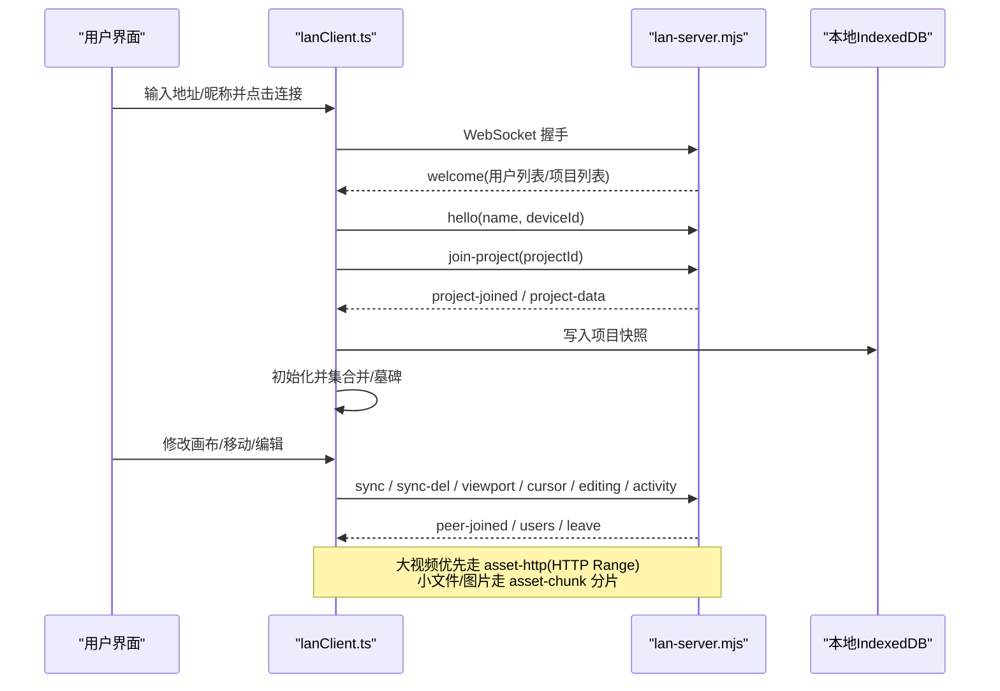
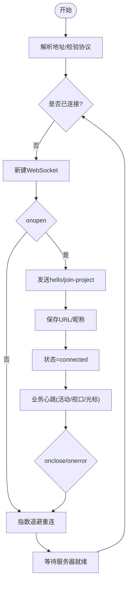
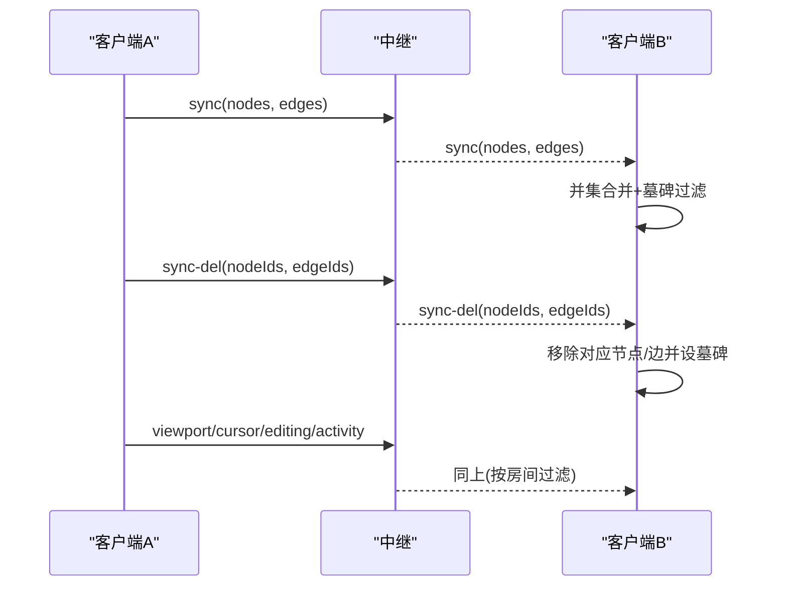
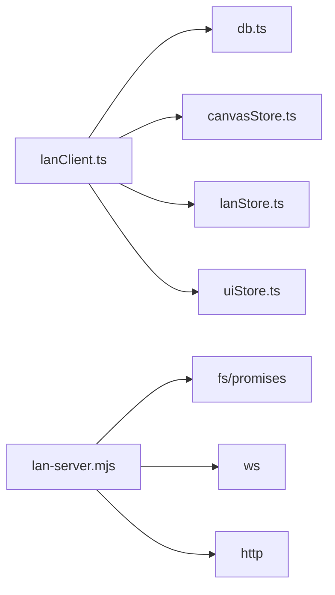

# 局域网同步

<cite>
**本文引用的文件**
- [src/sync/lanClient.ts](file://src/sync/lanClient.ts)
- [server/lan-server.mjs](file://server/lan-server.mjs)
- [src/store/lanStore.ts](file://src/store/lanStore.ts)
- [src/components/LanPanel.tsx](file://src/components/LanPanel.tsx)
- [src/sync/lanClient.test.ts](file://src/sync/lanClient.test.ts)
</cite>

## 目录
1. [简介](#简介)
2. [项目结构](#项目结构)
3. [核心组件](#核心组件)
4. [架构总览](#架构总览)
5. [详细组件分析](#详细组件分析)
6. [依赖关系分析](#依赖关系分析)
7. [性能与扩展性](#性能与扩展性)
8. [故障排查指南](#故障排查指南)
9. [结论](#结论)
10. [附录：消息协议与示例](#附录消息协议与示例)

## 简介
本文件为 SuQCanvas 的局域网（LAN）协作同步模块提供完整技术文档。内容覆盖 WebSocket 连接建立与维护、连接池管理、心跳与断线重连、实时协作消息协议（节点变更、光标位置、视图同步等）、冲突解决策略（基于时间戳的版本控制与最后写入获胜）、多客户端协调与权限管理，以及 LAN 客户端实现细节（连接状态管理、消息路由、数据合并算法）。同时给出错误处理方案与可操作建议。

## 项目结构
- 客户端侧
  - 连接与协议：src/sync/lanClient.ts
  - 协作状态存储：src/store/lanStore.ts
  - UI 面板：src/components/LanPanel.tsx
- 服务端侧
  - WebSocket 中继与 HTTP 静态/资源服务：server/lan-server.mjs
- 测试与验证
  - 端到端集成测试：src/sync/lanClient.test.ts

```mermaid
graph TB
subgraph "浏览器"
A["LanPanel<br/>UI"] --> B["lanClient.ts<br/>连接/消息/合并"]
B --> C["lanStore.ts<br/>协作状态"]
end
subgraph "局域网中继"
D["lan-server.mjs<br/>WS房间/HTTP流/持久化"]
end
A --> B
B < --> |WebSocket| D
B --> C
```

图表来源
- [src/sync/lanClient.ts:254-362](file://src/sync/lanClient.ts#L254-L362)
- [server/lan-server.mjs:661-906](file://server/lan-server.mjs#L661-L906)
- [src/store/lanStore.ts:91-159](file://src/store/lanStore.ts#L91-L159)
- [src/components/LanPanel.tsx:17-199](file://src/components/LanPanel.tsx#L17-L199)

章节来源
- [src/sync/lanClient.ts:254-362](file://src/sync/lanClient.ts#L254-L362)
- [server/lan-server.mjs:661-906](file://server/lan-server.mjs#L661-L906)
- [src/store/lanStore.ts:91-159](file://src/store/lanStore.ts#L91-L159)
- [src/components/LanPanel.tsx:17-199](file://src/components/LanPanel.tsx#L17-L199)

## 核心组件
- LAN 客户端（lanClient.ts）
  - WebSocket 生命周期管理：连接、断开、自动重连、保存上次配置
  - 消息路由：按 t 字段分发到不同处理器
  - 画布同步：增量广播、并集合并、显式删除与墓碑机制
  - 素材传输：分片 base64、空闲超时、断点续传、HTTP Range 流式拉取
  - 协作状态：光标、编辑中、活动日志、跟随视口
- LAN 服务端（lan-server.mjs）
  - WebSocket 房间隔离：按 projectId 广播/转发
  - 资产缓存与 HTTP 流式拉取：支持 Range、CORS、封面缓存
  - 项目持久化：projects.json、备份恢复、孤儿资产清理
  - 权限控制：创建者标记、删除限制
- 协作状态存储（lanStore.ts）
  - 用户列表、颜色分配、当前项目、远端视口、光标、编辑中、活动记录
- UI 面板（LanPanel.tsx）
  - 连接表单、状态指示、协作者列表、跟随按钮、活动日志展示

章节来源
- [src/sync/lanClient.ts:254-362](file://src/sync/lanClient.ts#L254-L362)
- [src/sync/lanClient.ts:409-642](file://src/sync/lanClient.ts#L409-L642)
- [src/sync/lanClient.ts:644-756](file://src/sync/lanClient.ts#L644-L756)
- [src/sync/lanClient.ts:809-887](file://src/sync/lanClient.ts#L809-L887)
- [src/sync/lanClient.ts:1023-1089](file://src/sync/lanClient.ts#L1023-L1089)
- [server/lan-server.mjs:661-906](file://server/lan-server.mjs#L661-L906)
- [src/store/lanStore.ts:91-159](file://src/store/lanStore.ts#L91-L159)
- [src/components/LanPanel.tsx:17-199](file://src/components/LanPanel.tsx#L17-L199)

## 架构总览
下图展示了从客户端发起连接到服务端房间广播、再到画布与素材同步的整体流程。



图表来源
- [src/sync/lanClient.ts:254-362](file://src/sync/lanClient.ts#L254-L362)
- [src/sync/lanClient.ts:409-642](file://src/sync/lanClient.ts#L409-L642)
- [server/lan-server.mjs:661-906](file://server/lan-server.mjs#L661-L906)

## 详细组件分析

### WebSocket 连接与连接池管理
- 连接建立
  - 解析地址：支持相对路径、http(s) 转 ws/wss，HTTPS 页面强制 wss
  - 默认地址：生产环境同域名反代；开发直连端口
  - 连接成功后发送 hello，携带设备标识；加入项目时请求项目数据
- 连接状态
  - idle/connecting/connected/error 四态
  - 成功时持久化最近连接信息，便于自动重连
- 连接池
  - 单例 WebSocket，避免重复连接；切换或断开时清理旧连接
  - 关闭时清理所有进行中的素材传输与定时器
- 自动重连
  - 指数退避：基础间隔 1s，最大 15s
  - 重连目标保留，首次失败后提示，后续自动重试
  - 重连成功后重新加入项目并对账



图表来源
- [src/sync/lanClient.ts:19-57](file://src/sync/lanClient.ts#L19-L57)
- [src/sync/lanClient.ts:254-362](file://src/sync/lanClient.ts#L254-L362)
- [src/sync/lanClient.ts:119-152](file://src/sync/lanClient.ts#L119-L152)

章节来源
- [src/sync/lanClient.ts:19-57](file://src/sync/lanClient.ts#L19-L57)
- [src/sync/lanClient.ts:254-362](file://src/sync/lanClient.ts#L254-L362)
- [src/sync/lanClient.ts:119-152](file://src/sync/lanClient.ts#L119-L152)

### 心跳检测与断线重连
- 心跳
  - 通过 activity、viewport、cursor 等消息体现“在线”状态
  - 服务端根据房间过滤广播，避免跨房间泄漏
- 断线重连
  - onclose/onerror 触发重连调度
  - 指数退避，最多 15s；重连成功后恢复项目对账与素材拉取
  - 会话内自动重连：刷新/加载后读取本地保存的配置自动重连

章节来源
- [src/sync/lanClient.ts:119-152](file://src/sync/lanClient.ts#L119-L152)
- [src/sync/lanClient.ts:321-362](file://src/sync/lanClient.ts#L321-L362)
- [src/sync/lanClient.ts:398-407](file://src/sync/lanClient.ts#L398-L407)

### 实时协作消息协议
- 房间与会话
  - 加入项目：join-project；离开：leave-project
  - 房间内广播：sync、sync-del、viewport、cursor、editing、activity
  - 点对点：to 字段指定接收方 id；to: server 表示仅发给中继缓存
- 画布同步
  - 增量广播：节点/边变化合并后发送
  - 显式删除：sync-del 携带 nodeIds/edgeIds；接收端设置墓碑防止晚到快照复活
  - 并集合并：按 id 合并，远端覆盖同名节点；本地选中状态保留
- 光标与编辑
  - cursor：坐标与更新时间
  - editing：节点编辑中状态，用于锁定与协作提示
- 活动日志
  - activity：新增/删除/移动/编辑/连线/变更等，带去抖合并
- 素材传输
  - asset-meta：元数据与分片总数
  - asset-chunk：base64 分片，按 index 顺序到达
  - asset-thumb：封面字节（先于分片下发）
  - asset-request：请求缺失素材；服务器可能返回 asset-http 直接走 HTTP Range 拉取
  - asset-http：告知可用 HTTP Range 地址（视频），客户端停止 WebSocket 下载



图表来源
- [src/sync/lanClient.ts:409-642](file://src/sync/lanClient.ts#L409-L642)
- [src/sync/lanClient.ts:644-756](file://src/sync/lanClient.ts#L644-L756)
- [server/lan-server.mjs:868-888](file://server/lan-server.mjs#L868-L888)

章节来源
- [src/sync/lanClient.ts:409-642](file://src/sync/lanClient.ts#L409-L642)
- [src/sync/lanClient.ts:644-756](file://src/sync/lanClient.ts#L644-L756)
- [server/lan-server.mjs:868-888](file://server/lan-server.mjs#L868-L888)

### 冲突解决策略
- 版本控制
  - 项目级：服务端以 updatedAt 比较决定整幅替换；本地有更新且远端未更新则不覆盖
  - 节点/边级：按 id 并集合并，远端覆盖同名节点；删除由 sync-del 显式传播
- 墓碑机制
  - 删除后在 TOMBSTONE_MS（60s）内标记 id 为墓碑，晚到旧快照不会复活
- 最后写入获胜
  - 同一 id 的节点，远端更新会覆盖本地；但本地独有节点保留
- 素材冲突
  - 视频优先走 HTTP Range 流式拉取，避免重复全量传输
  - 非视频走分片合并；重复分片只保留首个；空闲超时判定失败

章节来源
- [src/sync/lanClient.ts:454-493](file://src/sync/lanClient.ts#L454-L493)
- [src/sync/lanClient.ts:527-598](file://src/sync/lanClient.ts#L527-L598)
- [src/sync/lanClient.ts:1091-1181](file://src/sync/lanClient.ts#L1091-L1181)

### 多客户端协调与权限管理
- 房间隔离
  - 所有消息携带 projectId，服务端按房间广播，避免跨房间泄漏
- 用户与颜色
  - 服务端为每个客户端分配唯一颜色，避免冲突
- 项目权限
  - 创建者标记 creatorId；只有创建者可删除项目
  - 删除前备份项目，保留 24h 后可恢复
- 跟随与视口
  - 可跟随某协作者的视口；跟随时不广播自身视口

章节来源
- [server/lan-server.mjs:731-757](file://server/lan-server.mjs#L731-L757)
- [server/lan-server.mjs:801-823](file://server/lan-server.mjs#L801-L823)
- [src/sync/lanClient.ts:599-618](file://src/sync/lanClient.ts#L599-L618)
- [src/store/lanStore.ts:4-51](file://src/store/lanStore.ts#L4-L51)

### LAN 客户端实现细节
- 连接状态管理
  - 使用 lanStore 维护 status/url/name/selfId/users/followId/remoteViewport/activeProjectId 等
  - 连接成功/失败/断开均更新状态并清理资源
- 消息路由
  - handleMessage 按 t 分发：welcome、peer-joined、users、leave、project-list、project-data、sync、sync-del、viewport、cursor、editing、activity、asset-* 等
- 数据合并算法
  - 并集合并：远端节点覆盖同名，本地独有保留；选中状态保留
  - 显式删除：sync-del 立即移除，墓碑窗口内忽略晚到快照
  - 活动日志：批量操作合并，避免刷屏
- 素材传输
  - 分片大小 262143 字节（对齐 base64）
  - 空闲超时：持续收到分片即续期，长时间无数据判定失败
  - 断点续传：meta 重发保留已收分片，继续补齐
  - HTTP Range：视频优先走 HTTP 流式拉取，减少带宽占用

章节来源
- [src/sync/lanClient.ts:254-362](file://src/sync/lanClient.ts#L254-L362)
- [src/sync/lanClient.ts:409-642](file://src/sync/lanClient.ts#L409-L642)
- [src/sync/lanClient.ts:644-756](file://src/sync/lanClient.ts#L644-L756)
- [src/sync/lanClient.ts:889-1089](file://src/sync/lanClient.ts#L889-L1089)

## 依赖关系分析
- 客户端依赖
  - db：本地 IndexedDB 读写项目与素材
  - canvasStore：订阅画布变更，触发同步
  - lanStore：协作状态集中管理
  - uiStore：toast 提示
- 服务端依赖
  - fs/promises：项目与资产持久化
  - crypto：哈希与随机 ID
  - http/ws：HTTP 静态/资源服务与 WebSocket 中继



图表来源
- [src/sync/lanClient.ts:1-9](file://src/sync/lanClient.ts#L1-L9)
- [server/lan-server.mjs:1-24](file://server/lan-server.mjs#L1-L24)

章节来源
- [src/sync/lanClient.ts:1-9](file://src/sync/lanClient.ts#L1-L9)
- [server/lan-server.mjs:1-24](file://server/lan-server.mjs#L1-L24)

## 性能与扩展性
- 网络优化
  - 视频优先 HTTP Range 流式拉取，避免整份 WebSocket 传输打满局域网
  - 分片大小 262143 字节，base64 对齐，减少填充开销
  - 每 8 块让出主线程，避免长任务阻塞浏览器
- 内存优化
  - 分片解码为独立 Uint8Array，拼接成 Blob 惰性引用，避免整份 base64 内存翻倍
  - 服务器端流式读取分片发送，不整文件入内存
- 并发控制
  - 同一素材同一接收方只响应一次，避免多路并发覆盖
  - 服务器侧 60s 内对同一素材只广播一次请求，防止重复上传
- 可扩展性
  - 房间隔离天然支持多项目并行协作
  - 资产 HTTP 接口可被其他服务复用

[本节为通用指导，不直接分析具体文件]

## 故障排查指南
- 连接问题
  - HTTPS 页面必须使用 wss；检查反向代理配置
  - 默认地址解析失败时，手动输入 ws://IP:8790 或 wss://域名/lan-ws
- 项目同步异常
  - 检查 activeProjectId 是否正确；确认服务端 projects.json 存在
  - 项目删除需创建者权限；非创建者将被拒绝
- 素材传输失败
  - 检查空闲超时：长时间无分片将判定失败；确保源端在线
  - 视频优先走 HTTP Range；若无法访问，检查 CORS 与路径
  - 分片乱序/重复：服务端与客户端均已做去重与续传
- 协作状态不一致
  - 查看活动日志与编辑中状态；确认房间隔离正确
  - 跟随他人视口时，自身视口不会广播

章节来源
- [src/sync/lanClient.ts:19-57](file://src/sync/lanClient.ts#L19-L57)
- [src/sync/lanClient.ts:119-152](file://src/sync/lanClient.ts#L119-L152)
- [src/sync/lanClient.ts:889-1089](file://src/sync/lanClient.ts#L889-L1089)
- [server/lan-server.mjs:731-757](file://server/lan-server.mjs#L731-L757)
- [server/lan-server.mjs:854-865](file://server/lan-server.mjs#L854-L865)

## 结论
SuQCanvas 的 LAN 同步模块通过房间隔离、并集合并与显式删除、墓碑机制、HTTP Range 流式拉取与空闲超时等设计，实现了高效、稳定、可扩展的局域网协作。客户端与服务端职责清晰，错误处理完善，适合多人实时协作场景。

[本节为总结，不直接分析具体文件]

## 附录：消息协议与示例
以下为关键消息类型与字段说明（节选）：
- hello
  - name: string
  - deviceId: string
- join-project
  - projectId: string
- project-data
  - project: ProjectRecord
- sync
  - projectId: string
  - nodes: SuqNode[]
  - edges: SuqEdge[]
- sync-del
  - projectId: string
  - nodeIds: string[]
  - edgeIds: string[]
- viewport
  - projectId: string
  - viewport: Viewport
- cursor
  - projectId: string
  - x: number
  - y: number
  - name: string
  - updatedAt: number
- editing
  - projectId: string
  - nodeId: string
  - label: string
  - active: boolean
  - name: string
  - updatedAt: number
- activity
  - kind: create|delete|move|edit|connect|change
  - message: string
  - nodeId?: string
  - createdAt: number
- asset-meta
  - asset: AssetMeta
  - totalChunks: number
  - to?: string
- asset-chunk
  - assetId: string
  - index: number
  - total: number
  - data: string(base64)
  - to?: string
- asset-thumb
  - assetId: string
  - mime: string
  - data: string(base64)
  - to?: string
- asset-request
  - assetId: string
  - forceBlob?: boolean
- asset-http
  - assetId: string
  - url: string

章节来源
- [src/sync/lanClient.ts:409-642](file://src/sync/lanClient.ts#L409-L642)
- [src/sync/lanClient.ts:1023-1089](file://src/sync/lanClient.ts#L1023-L1089)
- [server/lan-server.mjs:828-888](file://server/lan-server.mjs#L828-L888)