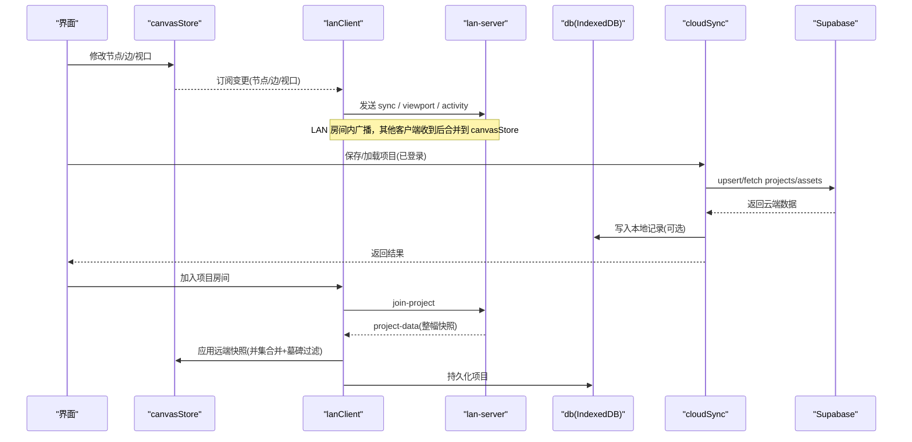
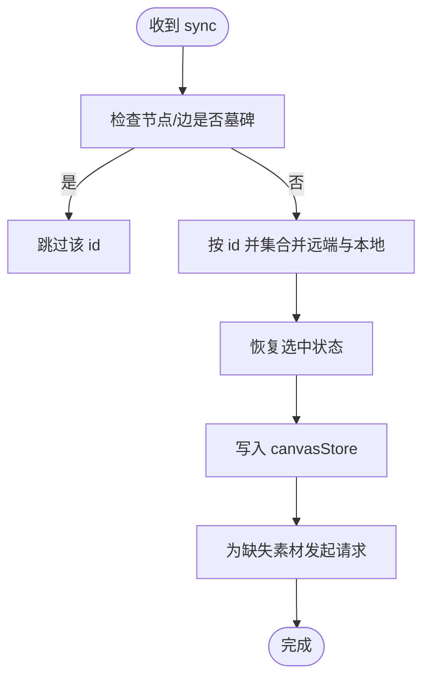
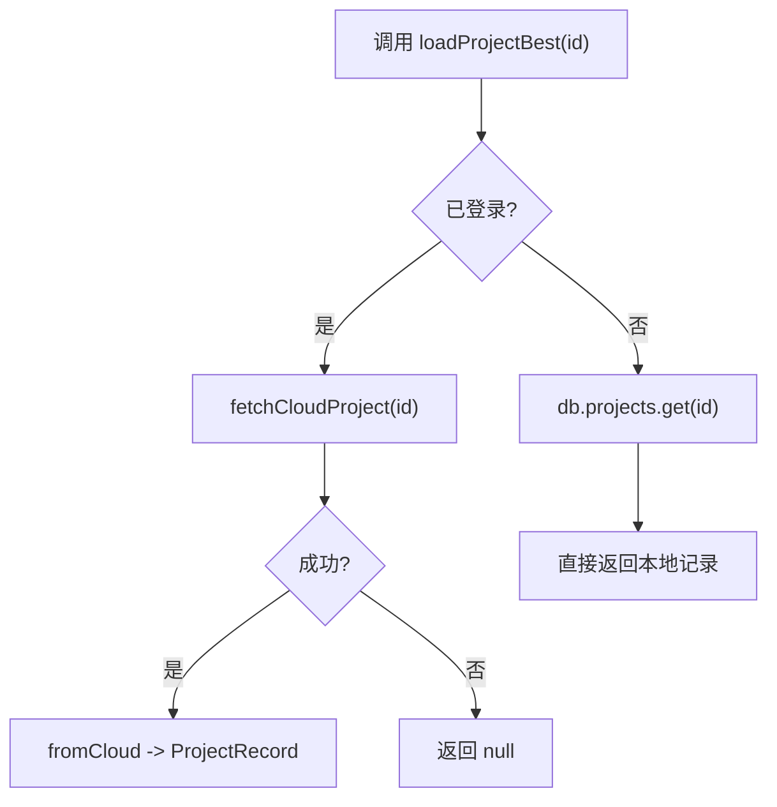
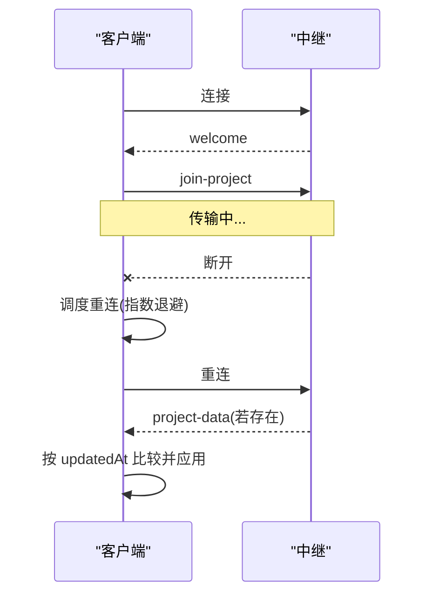
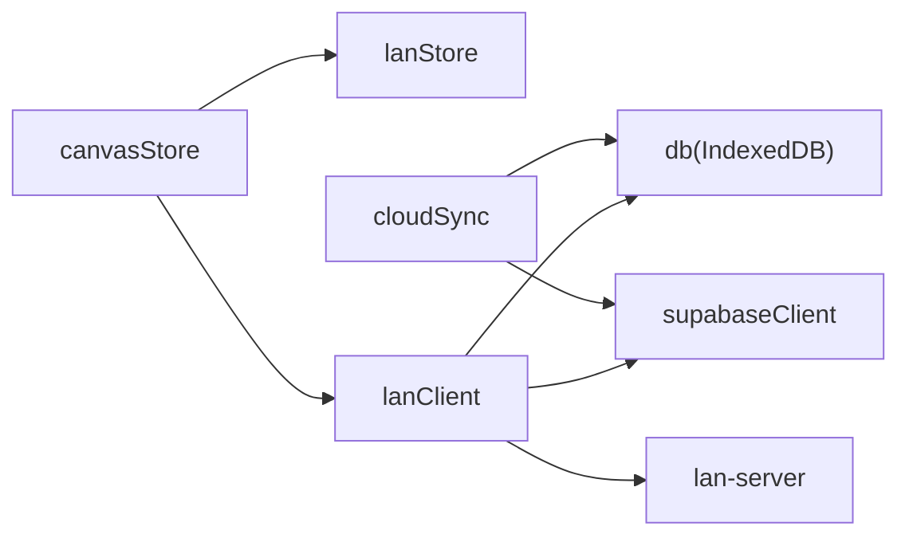

# 状态同步机制

<cite>
**本文引用的文件**
- [src/sync/cloudSync.ts](file://src/sync/cloudSync.ts)
- [src/sync/lanClient.ts](file://src/sync/lanClient.ts)
- [server/lan-server.mjs](file://server/lan-server.mjs)
- [src/store/canvasStore.ts](file://src/store/canvasStore.ts)
- [src/store/lanStore.ts](file://src/store/lanStore.ts)
- [src/db/db.ts](file://src/db/db.ts)
</cite>

## 目录
1. [简介](#简介)
2. [项目结构](#项目结构)
3. [核心组件](#核心组件)
4. [架构总览](#架构总览)
5. [详细组件分析](#详细组件分析)
6. [依赖关系分析](#依赖关系分析)
7. [性能考虑](#性能考虑)
8. [故障排查指南](#故障排查指南)
9. [结论](#结论)
10. [附录：协议与数据模型](#附录协议与数据模型)

## 简介
本文件面向 SuQCanvas 的状态同步机制，覆盖本地与云端、局域网协作两端的同步策略、冲突解决、断线重连、数据一致性保证与性能优化。重点说明：
- 乐观更新与冲突解决（LAN 端并集合并 + 显式删除传播；云端按更新时间戳覆盖）
- LAN 实时协作的 WebSocket 消息收发流程（画布、视口、光标、编辑态、活动日志、素材传输）
- 云同步原理（增量 vs 全量选择策略、登录态隔离）
- 断线重连、数据一致性与性能优化策略
- 具体同步协议示例（消息类型、数据结构）

## 项目结构
SuQCanvas 的状态同步由前端客户端、局域网中继服务器和云端服务三部分构成：
- 前端客户端
  - 画布状态管理：canvasStore（节点、边、视口、历史）
  - 局域网协作：lanClient（WebSocket 连接、消息路由、素材分片传输、断线重连）
  - 云端同步：cloudSync（Supabase 项目与素材元数据读写）
  - 本地持久化：db（IndexedDB，Dexie）
  - 协作状态：lanStore（用户、房间、活动、跟随等）
- 局域网中继服务器：lan-server（WebSocket 转发、项目持久化、资产缓存与 HTTP Range 流式拉取、维护任务）
- 云端：Supabase（项目表、素材元数据表）

```mermaid
graph TB
subgraph "浏览器"
A["canvasStore<br/>画布状态"]
B["lanClient<br/>LAN 协作"]
C["cloudSync<br/>云端同步"]
D["db<br/>IndexedDB"]
E["lanStore<br/>协作状态"]
end
subgraph "局域网中继"
S["lan-server<br/>WS 转发/项目/资产"]
end
subgraph "云端"
U["Supabase<br/>projects/assets"]
end
A --> B
A --> C
B --> S
C --> U
B --> D
C --> D
E < --> B
```

图表来源
- [src/sync/lanClient.ts:254-362](file://src/sync/lanClient.ts#L254-L362)
- [server/lan-server.mjs:661-888](file://server/lan-server.mjs#L661-L888)
- [src/sync/cloudSync.ts:101-165](file://src/sync/cloudSync.ts#L101-L165)
- [src/store/canvasStore.ts:118-399](file://src/store/canvasStore.ts#L118-L399)
- [src/store/lanStore.ts:91-160](file://src/store/lanStore.ts#L91-L160)
- [src/db/db.ts:25-33](file://src/db/db.ts#L25-L33)

章节来源
- [src/sync/lanClient.ts:254-362](file://src/sync/lanClient.ts#L254-L362)
- [server/lan-server.mjs:661-888](file://server/lan-server.mjs#L661-L888)
- [src/sync/cloudSync.ts:101-165](file://src/sync/cloudSync.ts#L101-L165)
- [src/store/canvasStore.ts:118-399](file://src/store/canvasStore.ts#L118-L399)
- [src/store/lanStore.ts:91-160](file://src/store/lanStore.ts#L91-L160)
- [src/db/db.ts:25-33](file://src/db/db.ts#L25-L33)

## 核心组件
- 画布状态 store：负责节点/边的增删改、视口变化、撤销重做、复制粘贴、对齐等，并通过订阅触发 LAN 同步广播与活动日志聚合。
- LAN 客户端：维护 WebSocket 连接、消息分发、画布增量同步、视口广播、光标/编辑态同步、素材分片上传/下载、断线自动重连、墓碑删除防抖。
- 局域网中继服务器：接收 WS 消息并按房间广播/单播；持久化项目；缓存资产并提供 HTTP Range 流式拉取；定期维护清理孤儿资产与过期备份。
- 云端同步：根据登录态决定仅从云端或仅从本地读取项目列表与项目内容；提供素材元数据的 upsert/fetch/delete。
- 本地数据库：使用 Dexie 持久化项目与素材；提供 GC 回收未被引用且标记超过保留期的素材。

章节来源
- [src/store/canvasStore.ts:118-399](file://src/store/canvasStore.ts#L118-L399)
- [src/sync/lanClient.ts:254-362](file://src/sync/lanClient.ts#L254-L362)
- [server/lan-server.mjs:661-888](file://server/lan-server.mjs#L661-L888)
- [src/sync/cloudSync.ts:101-165](file://src/sync/cloudSync.ts#L101-L165)
- [src/db/db.ts:25-69](file://src/db/db.ts#L25-L69)

## 架构总览
下图展示一次“加入项目并同步画布”的端到端流程，包括 LAN 与云端两条路径的选择。



图表来源
- [src/sync/lanClient.ts:409-642](file://src/sync/lanClient.ts#L409-L642)
- [server/lan-server.mjs:696-705](file://server/lan-server.mjs#L696-L705)
- [src/sync/cloudSync.ts:101-165](file://src/sync/cloudSync.ts#L101-L165)
- [src/store/canvasStore.ts:118-399](file://src/store/canvasStore.ts#L118-L399)

## 详细组件分析

### LAN 实时协作：消息收发与同步策略
- 连接与会话
  - 建立 WebSocket，发送 hello，获取欢迎消息（包含当前用户列表与共享项目列表）。
  - 支持自动重连（指数退避），断线时保留未完成的素材分片，重连后可续传。
- 房间与项目
  - join-project/leave-project 控制房间范围；project-list/project-joined/project-data 用于项目发现与数据下发。
- 画布同步
  - 本地变更通过 scheduleSyncBroadcast 批量发送 sync（节点/边），并附带视口 viewport。
  - 接收端对 sync 采用“按 id 并集合并”，删除通过独立的 sync-del 显式传播，避免早到快照误复活。
  - 引入墓碑（tombstone）机制：删除后一段时间内该 id 不参与复活，防止晚到旧快照恢复已删除对象。
- 协同体验
  - 光标 cursor、编辑态 editing、活动 activity（创建/删除/移动/编辑/连线/变更）聚合广播，减少刷屏。
- 素材传输
  - 大文件分片 base64 传输；视频优先走 HTTP Range 流式拉取（asset-http），其余走 WS 分片。
  - 封面 thumbnail 先于主体到达，提升首帧体验；服务端缓存封面，观看端无需解码抓帧。
  - 空闲超时检测：持续有分片到达则续期，长时间无数据判定失败并唤醒等待者。



图表来源
- [src/sync/lanClient.ts:527-577](file://src/sync/lanClient.ts#L527-L577)
- [src/sync/lanClient.ts:578-598](file://src/sync/lanClient.ts#L578-L598)
- [src/sync/lanClient.ts:655-716](file://src/sync/lanClient.ts#L655-L716)

章节来源
- [src/sync/lanClient.ts:254-362](file://src/sync/lanClient.ts#L254-L362)
- [src/sync/lanClient.ts:409-642](file://src/sync/lanClient.ts#L409-L642)
- [src/sync/lanClient.ts:655-716](file://src/sync/lanClient.ts#L655-L716)
- [src/sync/lanClient.ts:809-887](file://src/sync/lanClient.ts#L809-L887)
- [src/sync/lanClient.ts:1023-1089](file://src/sync/lanClient.ts#L1023-L1089)
- [src/sync/lanClient.ts:1091-1181](file://src/sync/lanClient.ts#L1091-L1181)
- [server/lan-server.mjs:661-888](file://server/lan-server.mjs#L661-L888)

### 云端同步：增量与全量策略
- 登录态隔离
  - 已登录：项目列表与项目内容仅来自云端；未登录/游客：仅来自本地。两者互不串通。
- 项目列表
  - syncProjectList：登录后 fetchCloudProjects，否则读取本地 db.projects。
- 项目加载
  - loadProjectBest：登录后 fetchCloudProject(id)，否则读取本地 db.projects.get(id)。
- 素材元数据
  - upsertAssetMetaToCloud：将素材元数据 upsert 到 assets 表。
  - deleteAssetFromCloud：删除云端素材元数据。
  - fetchCloudAssets：按 id 列表查询云端素材元数据。
- 选择策略
  - 云端以 updatedAt 作为版本依据进行覆盖；LAN 以并集合并 + 显式删除 + 墓碑窗口避免冲突。
  - 云端不涉及增量 diff，而是整条记录 upsert；LAN 侧通过 sync-del 表达删除，sync 表达新增/更新。



图表来源
- [src/sync/cloudSync.ts:148-165](file://src/sync/cloudSync.ts#L148-L165)
- [src/sync/cloudSync.ts:101-119](file://src/sync/cloudSync.ts#L101-L119)

章节来源
- [src/sync/cloudSync.ts:18-165](file://src/sync/cloudSync.ts#L18-L165)

### 断线重连与数据一致性
- 自动重连
  - 指数退避（基础 1s，最大 15s），首次断开提示“正在自动重连…”，重连成功后恢复房间与项目数据。
- 素材传输中断
  - 断线时唤醒所有等待者并清空进行中状态；重连后重新发起请求，接收端基于已收分片续传。
- 删除一致性
  - 本地删除立即广播 sync-del，并设置墓碑；远端收到后同样设置墓碑，避免晚到快照复活。
- 项目数据一致性
  - 重连后主动拉取中继保存的项目快照，按 updatedAt 比较决定是否替换本地视图。



图表来源
- [src/sync/lanClient.ts:119-152](file://src/sync/lanClient.ts#L119-L152)
- [src/sync/lanClient.ts:321-362](file://src/sync/lanClient.ts#L321-L362)
- [src/sync/lanClient.ts:454-493](file://src/sync/lanClient.ts#L454-L493)

章节来源
- [src/sync/lanClient.ts:119-152](file://src/sync/lanClient.ts#L119-L152)
- [src/sync/lanClient.ts:321-362](file://src/sync/lanClient.ts#L321-L362)
- [src/sync/lanClient.ts:454-493](file://src/sync/lanClient.ts#L454-L493)

### 性能优化策略
- LAN 侧
  - 画布同步防抖：150ms 批量发送 sync，减少频繁网络抖动。
  - 视口广播节流：100ms 节流，避免跟随他人时重复广播。
  - 活动日志聚合：350ms 内合并同类操作，避免刷屏。
  - 删除合并：80ms 内合并多次删除，减少 sync-del 数量。
  - 素材分片：每 8 块让出主线程，避免阻塞 UI。
  - 视频优先 HTTP Range 流式拉取，避免整份文件经 WS 传输打满局域网。
- 服务端
  - 资产文件流式读取与分片发送，避免内存峰值。
  - 并发写保护：临时文件 + rename 原子落盘，避免并发覆盖。
  - 维护任务：每小时扫描孤儿资产与过期备份，释放空间。
- 云端
  - 仅 upsert 元数据，避免重复存储大文件；项目以整记录覆盖，简单可靠。

章节来源
- [src/sync/lanClient.ts:655-716](file://src/sync/lanClient.ts#L655-L716)
- [src/sync/lanClient.ts:1023-1089](file://src/sync/lanClient.ts#L1023-L1089)
- [server/lan-server.mjs:107-205](file://server/lan-server.mjs#L107-L205)
- [server/lan-server.mjs:503-659](file://server/lan-server.mjs#L503-L659)

## 依赖关系分析
- canvasStore 依赖 lanStore 获取协作信息（selfId、activeProjectId），并在变更时触发 LAN 同步与活动广播。
- lanClient 依赖 db 持久化项目与素材，依赖 lanStore 管理协作状态，依赖 supabaseClient 进行云端交互（通过 cloudSync）。
- server/lan-server.mjs 依赖文件系统与 ws 库，实现项目与资产的持久化与转发。
- cloudSync 依赖 supabaseClient 与 db，封装云端项目与素材元数据操作。



图表来源
- [src/store/canvasStore.ts:118-399](file://src/store/canvasStore.ts#L118-L399)
- [src/sync/lanClient.ts:1-12](file://src/sync/lanClient.ts#L1-L12)
- [src/sync/cloudSync.ts:1-5](file://src/sync/cloudSync.ts#L1-L5)
- [server/lan-server.mjs:1-20](file://server/lan-server.mjs#L1-L20)

章节来源
- [src/store/canvasStore.ts:118-399](file://src/store/canvasStore.ts#L118-L399)
- [src/sync/lanClient.ts:1-12](file://src/sync/lanClient.ts#L1-L12)
- [src/sync/cloudSync.ts:1-5](file://src/sync/cloudSync.ts#L1-L5)
- [server/lan-server.mjs:1-20](file://server/lan-server.mjs#L1-L20)

## 性能考虑
- LAN 协作
  - 使用并集合并与显式删除，降低整幅快照覆盖带来的冲突成本。
  - 视频走 HTTP Range 流式拉取，显著降低带宽占用与内存压力。
  - 多定时器防抖/节流，平衡实时性与网络负载。
- 服务端
  - 流式 IO 与分片写入，避免大文件一次性读入内存。
  - 维护任务定期清理孤儿资产与过期备份，保持磁盘健康。
- 云端
  - 仅同步元数据，避免重复上传大文件；项目以整记录覆盖，简化一致性模型。

[本节为通用指导，不直接分析具体文件]

## 故障排查指南
- 无法连接局域网中继
  - 检查地址解析（HTTPS 页面需 wss://），确认反向代理配置正确。
  - 查看错误提示与 lanStore 状态是否为 error。
- 断线后不同步
  - 确认自动重连是否触发（reconnectTimer），重连后是否收到 project-data。
  - 检查 activeProjectId 是否正确，确保在房间内。
- 素材传输失败
  - 观察空闲超时是否触发（60s 无数据即失败），确认源端是否在线。
  - 视频优先走 asset-http，若未命中则回退 WS 分片；检查 forceBlob 场景。
- 删除未生效
  - 确认 sync-del 已发送，远端是否设置墓碑；检查 TOMBSTONE_MS 窗口。
- 云端项目不同步
  - 确认登录态（isCloudAuthed），项目列表与加载逻辑是否按预期分支。

章节来源
- [src/sync/lanClient.ts:19-57](file://src/sync/lanClient.ts#L19-L57)
- [src/sync/lanClient.ts:119-152](file://src/sync/lanClient.ts#L119-L152)
- [src/sync/lanClient.ts:891-945](file://src/sync/lanClient.ts#L891-L945)
- [src/sync/lanClient.ts:1091-1181](file://src/sync/lanClient.ts#L1091-L1181)
- [src/sync/cloudSync.ts:148-165](file://src/sync/cloudSync.ts#L148-L165)

## 结论
SuQCanvas 的状态同步机制通过 LAN 与云端两条路径协同工作：
- LAN 侧采用乐观更新、并集合并与显式删除，配合墓碑窗口与断线重连，保障多人协作的一致性与鲁棒性。
- 云端侧以登录态隔离与整记录覆盖，简化一致性模型，适合离线/在线切换。
- 素材传输针对大文件优化，视频优先 HTTP Range 流式拉取，显著提升性能与用户体验。
- 服务端维护任务与客户端防抖/节流共同保障系统稳定与资源健康。

[本节为总结，不直接分析具体文件]

## 附录：协议与数据模型

### WebSocket 消息类型（LAN）
- hello：客户端握手，携带 name、deviceId
- welcome：服务端返回 id、users、projects
- join-project / leave-project：加入/离开房间
- project-list / project-joined / project-data：项目列表、加入确认、项目快照
- project-save / project-delete / project-deleted / project-delete-denied：保存/删除项目及权限
- backup-list-request / backup-list / backup-restore / backup-restore-result：备份列表与恢复
- sync / sync-del：画布同步与显式删除
- viewport：视口广播
- cursor / editing / activity：光标、编辑态、活动日志
- asset-meta / asset-chunk / asset-thumb / asset-request / asset-http：素材元数据、分片、封面、请求与 HTTP 流式地址

章节来源
- [src/sync/lanClient.ts:409-642](file://src/sync/lanClient.ts#L409-L642)
- [server/lan-server.mjs:661-888](file://server/lan-server.mjs#L661-L888)

### 数据模型
- 项目记录（ProjectRecord）
  - id、name、createdAt、updatedAt、graph（nodes、edges）、viewport
- 素材记录（AssetRecord）
  - id、name、mime、size、kind、blob、thumbnail、orphanedAt
- 云端项目（CloudProject）
  - id、name、graph、viewport、created_at、updated_at
- 云端素材（CloudAsset）
  - id、name、mime、size、kind、oss_key、oss_thumb_key、has_thumbnail、created_at

章节来源
- [src/db/db.ts:5-23](file://src/db/db.ts#L5-L23)
- [src/sync/cloudSync.ts:6-16](file://src/sync/cloudSync.ts#L6-L16)
- [src/sync/cloudSync.ts:70-99](file://src/sync/cloudSync.ts#L70-L99)