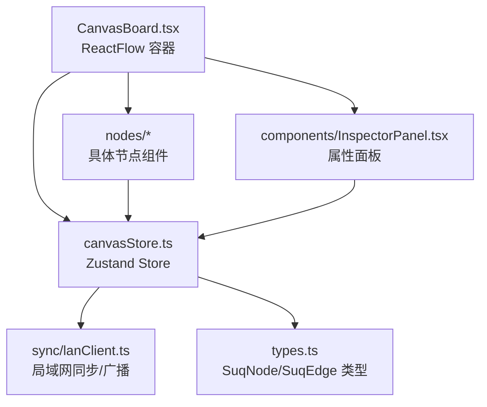
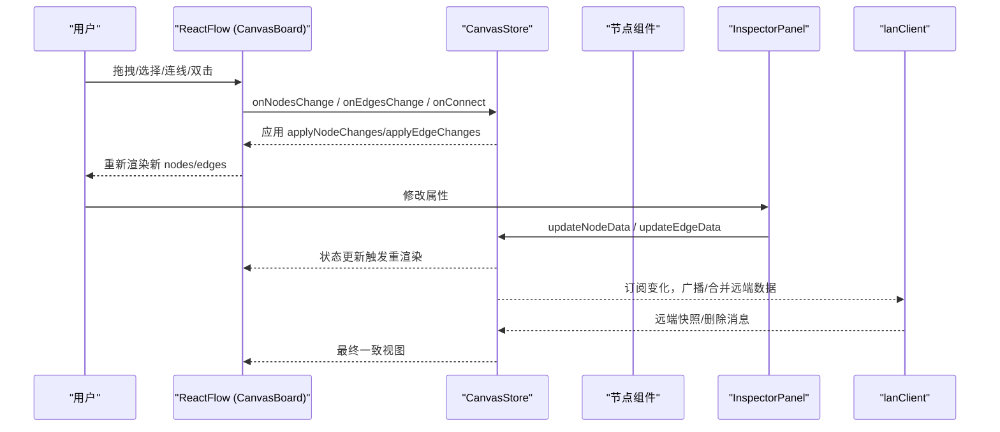
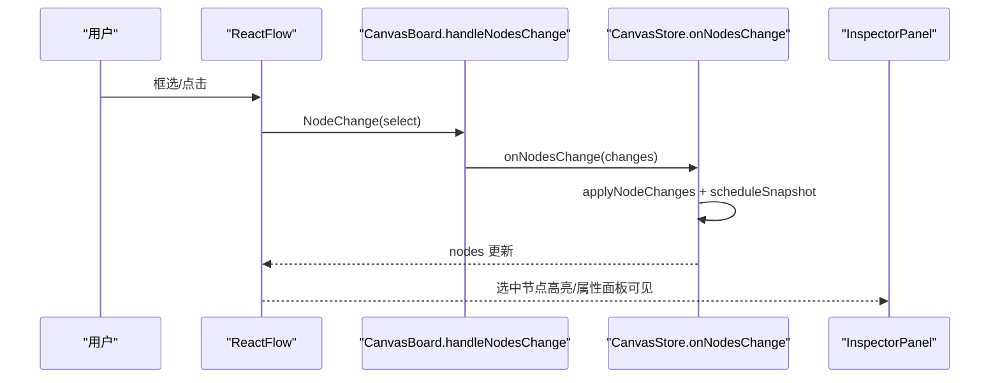
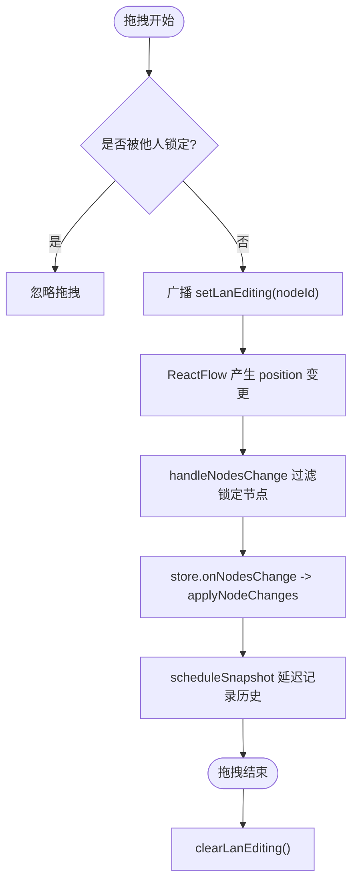
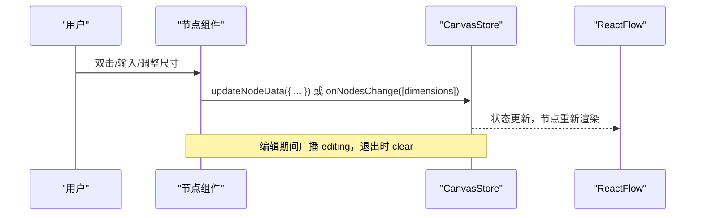
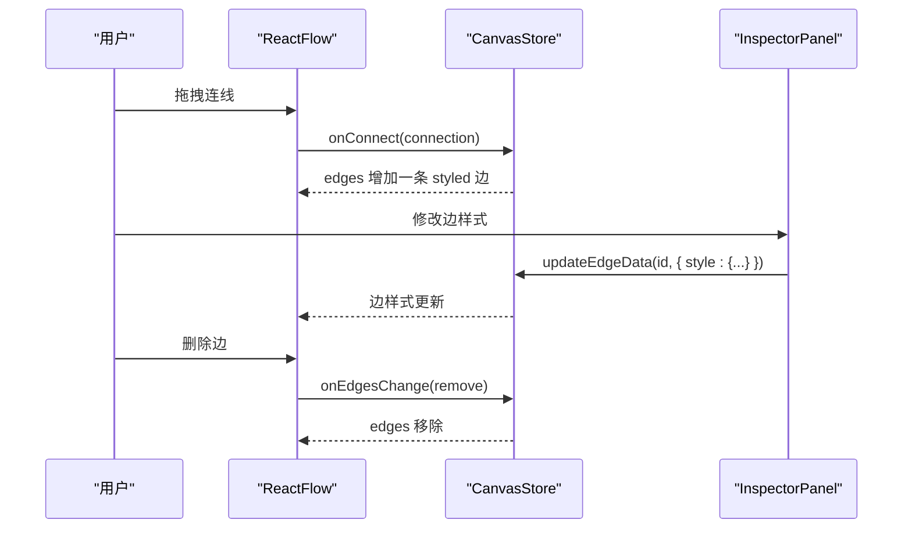
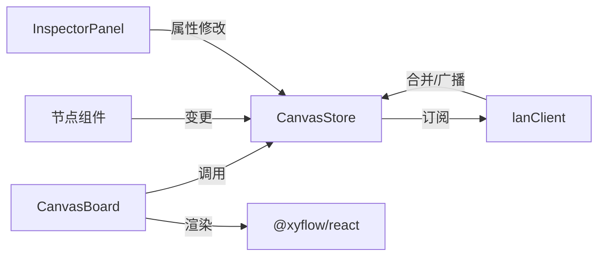

# 用户操作数据流

<cite>
**本文引用的文件**
- [CanvasBoard.tsx](file://src/canvas/CanvasBoard.tsx)
- [canvasStore.ts](file://src/store/canvasStore.ts)
- [types.ts](file://src/types.ts)
- [InspectorPanel.tsx](file://src/components/InspectorPanel.tsx)
- [TextNode.tsx](file://src/canvas/nodes/TextNode.tsx)
- [ImageNode.tsx](file://src/canvas/nodes/ImageNode.tsx)
- [ResizeHandles.tsx](file://src/canvas/nodes/ResizeHandles.tsx)
- [uiStore.ts](file://src/store/uiStore.ts)
- [lanClient.ts](file://src/sync/lanClient.ts)
</cite>

## 目录
1. [简介](#简介)
2. [项目结构](#项目结构)
3. [核心组件](#核心组件)
4. [架构总览](#架构总览)
5. [详细组件分析](#详细组件分析)
6. [依赖关系分析](#依赖关系分析)
7. [性能考虑](#性能考虑)
8. [故障排查指南](#故障排查指南)
9. [结论](#结论)

## 简介
本文面向 SuQCanvas 的用户操作数据流，聚焦“从 CanvasBoard 接收用户事件 → 调用 CanvasStore 方法更新状态 → UI 重新渲染”的单向数据流。重点说明节点选择、拖拽、编辑等操作的数据流转路径，解释 ReactFlow 的 NodeChange 与 EdgeChange 事件处理机制，给出 onNodesChange、onEdgesChange 等回调的实现位置与职责，并总结状态变更的批量处理与性能优化策略。

## 项目结构
SuQCanvas 将画布交互集中在 CanvasBoard 中，使用 @xyflow/react 提供的 ReactFlow 组件；状态管理由 Zustand 驱动的 canvasStore 负责；UI 面板（如 InspectorPanel）通过 store 读写选中项的属性；具体节点类型（文本、图片等）在 nodes 目录下实现；协作与同步逻辑在 sync/lanClient.ts 中完成。

图表来源
- [CanvasBoard.tsx:336-379](file://src/canvas/CanvasBoard.tsx#L336-L379)
- [canvasStore.ts:118-158](file://src/store/canvasStore.ts#L118-L158)
- [lanClient.ts:644-756](file://src/sync/lanClient.ts#L644-L756)

章节来源
- [CanvasBoard.tsx:336-379](file://src/canvas/CanvasBoard.tsx#L336-L379)
- [canvasStore.ts:118-158](file://src/store/canvasStore.ts#L118-L158)

## 核心组件
- CanvasBoard：承载 ReactFlow，绑定 onNodesChange、onEdgesChange、onConnect、拖拽与键盘快捷键、视口同步等。
- CanvasStore：集中维护 nodes、edges、viewport、历史撤销/重做、复制粘贴、对齐、层级等；提供 applyNodeChanges/applyEdgeChanges 的批量更新入口。
- 节点组件（TextNode、ImageNode 等）：在节点内部触发 onNodesChange 或 updateNodeData 以更新自身数据或尺寸。
- InspectorPanel：对选中节点/边进行属性编辑，调用 updateNodeData/updateEdgeData。
- lanClient：监听 store 变化，合并远端数据、广播活动与视口、处理删除与素材传输。

章节来源
- [CanvasBoard.tsx:41-102](file://src/canvas/CanvasBoard.tsx#L41-L102)
- [canvasStore.ts:118-399](file://src/store/canvasStore.ts#L118-L399)
- [TextNode.tsx:13-107](file://src/canvas/nodes/TextNode.tsx#L13-L107)
- [ImageNode.tsx:15-126](file://src/canvas/nodes/ImageNode.tsx#L15-L126)
- [InspectorPanel.tsx:288-800](file://src/components/InspectorPanel.tsx#L288-L800)
- [lanClient.ts:718-756](file://src/sync/lanClient.ts#L718-L756)

## 架构总览
下图展示用户操作到 UI 更新的单向数据流，以及协作场景下的双向同步。

图表来源
- [CanvasBoard.tsx:66-86](file://src/canvas/CanvasBoard.tsx#L66-L86)
- [canvasStore.ts:126-158](file://src/store/canvasStore.ts#L126-L158)
- [lanClient.ts:527-598](file://src/sync/lanClient.ts#L527-L598)

## 详细组件分析

### 节点选择与多选
- 选择触发：用户在 ReactFlow 上框选或点击节点，ReactFlow 产生 select 类型的 NodeChange。
- 数据流：CanvasBoard 的 handleNodesChange 过滤掉被其他协作者锁定的节点后，调用 store.onNodesChange；store 使用 applyNodeChanges 批量更新 selected 标记。
- 结果：selected 为 true 的节点会在 InspectorPanel 中显示可编辑属性，并在节点外壳中显示调整手柄。

图表来源
- [CanvasBoard.tsx:66-75](file://src/canvas/CanvasBoard.tsx#L66-L75)
- [canvasStore.ts:126-135](file://src/store/canvasStore.ts#L126-L135)
- [InspectorPanel.tsx:288-310](file://src/components/InspectorPanel.tsx#L288-L310)

章节来源
- [CanvasBoard.tsx:66-75](file://src/canvas/CanvasBoard.tsx#L66-L75)
- [canvasStore.ts:126-135](file://src/store/canvasStore.ts#L126-L135)
- [InspectorPanel.tsx:288-310](file://src/components/InspectorPanel.tsx#L288-L310)

### 节点拖拽
- 触发点：ReactFlow 的 onNodeDragStart/onNodeDragStop 在 CanvasBoard 中设置“正在编辑”的协作者信息，避免冲突。
- 数据流：拖拽过程中 ReactFlow 持续产生 position 类型的 NodeChange；handleNodesChange 过滤锁定节点后交给 store；store 用 applyNodeChanges 更新位置，并通过 scheduleSnapshot 延迟入栈历史。
- 协作：拖拽开始/结束会广播 editing 状态，其他客户端据此锁定/解锁节点。

图表来源
- [CanvasBoard.tsx:76-86](file://src/canvas/CanvasBoard.tsx#L76-L86)
- [canvasStore.ts:126-145](file://src/store/canvasStore.ts#L126-L145)
- [lanClient.ts:793-800](file://src/sync/lanClient.ts#L793-L800)

章节来源
- [CanvasBoard.tsx:76-86](file://src/canvas/CanvasBoard.tsx#L76-L86)
- [canvasStore.ts:126-145](file://src/store/canvasStore.ts#L126-L145)
- [lanClient.ts:793-800](file://src/sync/lanClient.ts#L793-L800)

### 节点编辑（文本/图片等）
- 文本节点：双击进入编辑模式，失焦或按键提交时调用 updateNodeData 写入 text 等样式字段；编辑期间广播 editing，退出时清除。
- 图片节点：加载完成后根据自然尺寸计算缩放，调用 onNodesChange 设置 dimensions；支持 NodeResizer 调整大小，同样会广播编辑状态。
- 通用：所有属性修改均通过 store.updateNodeData/updateEdgeData 触发不可变更新，保证撤销/重做可用。

图表来源
- [TextNode.tsx:41-50](file://src/canvas/nodes/TextNode.tsx#L41-L50)
- [ImageNode.tsx:39-56](file://src/canvas/nodes/ImageNode.tsx#L39-L56)
- [canvasStore.ts:176-191](file://src/store/canvasStore.ts#L176-L191)

章节来源
- [TextNode.tsx:41-50](file://src/canvas/nodes/TextNode.tsx#L41-L50)
- [ImageNode.tsx:39-56](file://src/canvas/nodes/ImageNode.tsx#L39-L56)
- [canvasStore.ts:176-191](file://src/store/canvasStore.ts#L176-L191)

### 连线创建与编辑
- 创建：在连接模式下，ReactFlow 触发 onConnect；store.onConnect 生成 SuqEdge 并追加到 edges。
- 编辑：InspectorPanel 中对选中边进行线型、路径、箭头、颜色、粗细等修改，调用 updateEdgeData 批量更新 data.style。
- 删除：通过 ReactFlow 的 deleteKeyCode 或 InspectorPanel 的删除按钮，产生 remove 类型的 EdgeChange，store 将其应用到 edges。

图表来源
- [CanvasBoard.tsx:342-351](file://src/canvas/CanvasBoard.tsx#L342-L351)
- [canvasStore.ts:146-158](file://src/store/canvasStore.ts#L146-L158)
- [InspectorPanel.tsx:311-322](file://src/components/InspectorPanel.tsx#L311-L322)

章节来源
- [CanvasBoard.tsx:342-351](file://src/canvas/CanvasBoard.tsx#L342-L351)
- [canvasStore.ts:146-158](file://src/store/canvasStore.ts#L146-L158)
- [InspectorPanel.tsx:311-322](file://src/components/InspectorPanel.tsx#L311-L322)

### 视口与工具模式
- 视口：onMoveEnd 将当前视口写入 store.viewport；初始化和局域网跟随时会同步 rfSetViewport。
- 工具模式：V/C/H 切换选择/连线/拖动模式，影响 panOnDrag、selectionOnDrag、nodesDraggable、connectOnClick 等行为。

章节来源
- [CanvasBoard.tsx:88-102](file://src/canvas/CanvasBoard.tsx#L88-L102)
- [CanvasBoard.tsx:152-193](file://src/canvas/CanvasBoard.tsx#L152-L193)
- [CanvasBoard.tsx:336-379](file://src/canvas/CanvasBoard.tsx#L336-L379)

### 批量处理与性能优化
- 批量应用：onNodesChange/onEdgesChange 统一通过 applyNodeChanges/applyEdgeChanges 一次性应用多个变更，减少多次 setState。
- 历史快照防抖：scheduleSnapshot 将多次变更合并为一个快照，flushPending 在删除等关键时机立即落盘，提升撤销/重做体验。
- 协作去抖：lanClient 对同步、活动通知、视口广播使用定时器合并，降低网络压力。
- 本地缓存：playlists 解析结果按引用缓存，避免重复计算。

章节来源
- [canvasStore.ts:61-107](file://src/store/canvasStore.ts#L61-L107)
- [canvasStore.ts:126-145](file://src/store/canvasStore.ts#L126-L145)
- [lanClient.ts:655-716](file://src/sync/lanClient.ts#L655-L716)
- [media/playlists.ts:166-178](file://src/media/playlists.ts#L166-L178)

## 依赖关系分析
- CanvasBoard 依赖 @xyflow/react 的 ReactFlow 能力，并通过 useCanvasStore/useUiStore/useSettingsStore/useLanStore 获取状态与行为。
- CanvasStore 依赖 @xyflow/react 的 applyNodeChanges/applyEdgeChanges 与 Zustand 的 create；同时订阅 lanStore 以注入协作元信息。
- 节点组件通过 useCanvasStore 直接调用 onNodesChange/updateNodeData，或通过 NodeResizer/Handle 等 ReactFlow API 触发变更。
- InspectorPanel 通过 updateNodeData/updateEdgeData 修改选中项属性，间接驱动 UI 更新。
- lanClient 订阅 store 变化，负责远端合并、删除传播、活动与视口广播。

图表来源
- [CanvasBoard.tsx:41-102](file://src/canvas/CanvasBoard.tsx#L41-L102)
- [canvasStore.ts:118-158](file://src/store/canvasStore.ts#L118-L158)
- [lanClient.ts:718-756](file://src/sync/lanClient.ts#L718-L756)

章节来源
- [CanvasBoard.tsx:41-102](file://src/canvas/CanvasBoard.tsx#L41-L102)
- [canvasStore.ts:118-158](file://src/store/canvasStore.ts#L118-L158)
- [lanClient.ts:718-756](file://src/sync/lanClient.ts#L718-L756)

## 性能考虑
- 使用 applyNodeChanges/applyEdgeChanges 进行批量变更，避免逐条 setState 导致的频繁重渲染。
- 历史快照采用防抖合并，减少不必要的历史记录膨胀；删除类操作立即 flushPending，确保撤销链正确。
- 协作层面对同步、活动、视口广播进行节流/合并，降低 WebSocket 流量。
- 节点尺寸计算仅在首次加载时执行，避免重复测量。
- 使用 memo 包裹节点组件，减少无关更新带来的重渲染。

[本节为通用指导，不直接分析具体文件]

## 故障排查指南
- 节点无法拖拽/选择：检查是否被其他协作者锁定（editing），或被 CanvasBoard 过滤（lockedNodeIds）。
- 连线无效：确认工具模式为 connect，且 isValidConnection 允许该连接（source !== target）。
- 属性未生效：确认 InspectorPanel 调用了正确的 updateNodeData/updateEdgeData，且目标节点/边处于选中状态。
- 撤销/重做异常：检查是否存在频繁的 onNodesChange/onEdgesChange 导致历史快照合并异常；必要时调用 clearHistory。
- 协作不同步：查看 lanClient 的同步与删除消息是否正确广播；确认 activeProjectId 与房间一致。

章节来源
- [CanvasBoard.tsx:66-86](file://src/canvas/CanvasBoard.tsx#L66-L86)
- [canvasStore.ts:384-391](file://src/store/canvasStore.ts#L384-L391)
- [lanClient.ts:527-598](file://src/sync/lanClient.ts#L527-L598)

## 结论
SuQCanvas 的用户操作数据流遵循清晰的单向流：用户事件在 CanvasBoard 中捕获，转化为 NodeChange/EdgeChange 或显式 store 方法调用，经由 CanvasStore 统一应用与持久化，再驱动 UI 重渲染。协作场景下，lanClient 负责将本地变更广播并合并远端数据，保证多端一致性。通过批量应用、历史快照防抖、协作消息合并等手段，系统在交互流畅性与性能之间取得平衡。