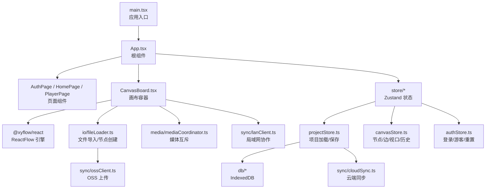
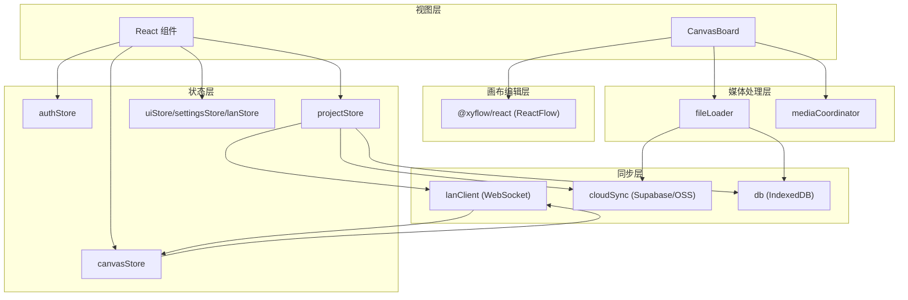
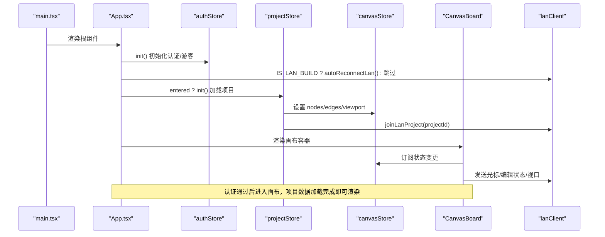
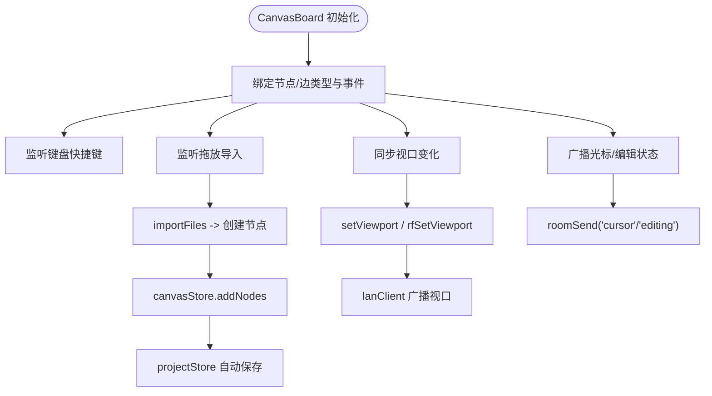
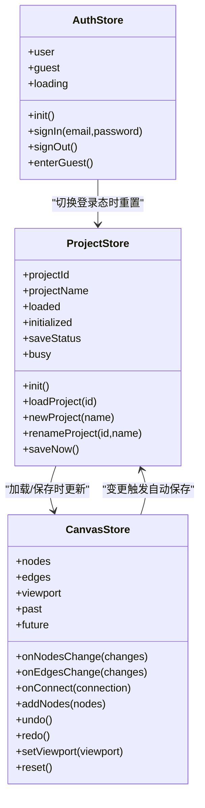
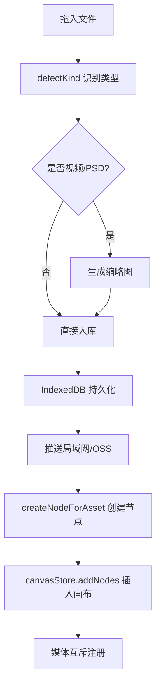
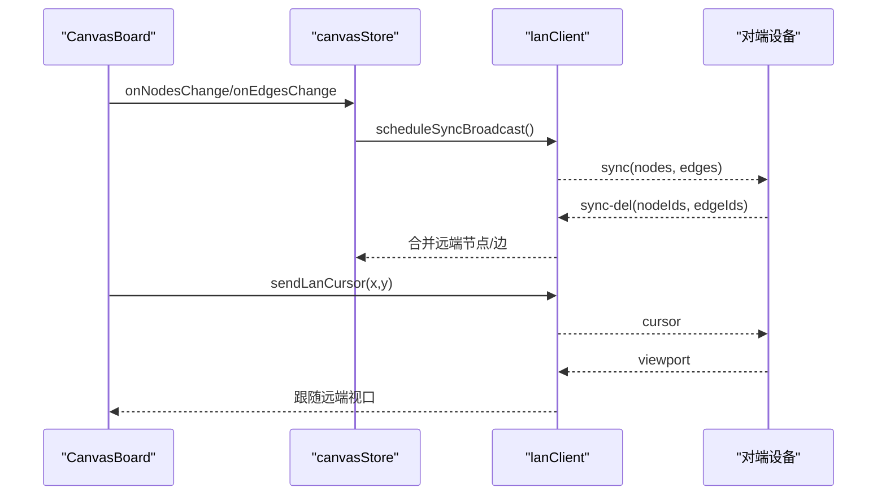

# 整体架构概览

<cite>
**本文引用的文件**
- [src/main.tsx](file://src/main.tsx)
- [src/App.tsx](file://src/App.tsx)
- [package.json](file://package.json)
- [README.md](file://README.md)
- [vite.config.ts](file://vite.config.ts)
- [src/store/authStore.ts](file://src/store/authStore.ts)
- [src/store/projectStore.ts](file://src/store/projectStore.ts)
- [src/store/canvasStore.ts](file://src/store/canvasStore.ts)
- [src/canvas/CanvasBoard.tsx](file://src/canvas/CanvasBoard.tsx)
- [src/io/fileLoader.ts](file://src/io/fileLoader.ts)
- [src/media/mediaCoordinator.ts](file://src/media/mediaCoordinator.ts)
- [src/sync/lanClient.ts](file://src/sync/lanClient.ts)
</cite>

## 目录
1. [简介](#简介)
2. [项目结构](#项目结构)
3. [核心组件](#核心组件)
4. [架构总览](#架构总览)
5. [详细组件分析](#详细组件分析)
6. [依赖关系分析](#依赖关系分析)
7. [性能考量](#性能考量)
8. [故障排查指南](#故障排查指南)
9. [结论](#结论)

## 简介
SuQCanvas 是一款基于浏览器的无限画布应用，支持图片、视频、音频、PDF、Markdown、文本等多媒体元素在同一张画布上拖拽组织与连线。应用采用分层架构：前端 React + TypeScript 视图层、Zustand 状态管理层、@xyflow/react 画布编辑层、媒体处理层、本地与云端同步层、局域网协作层等。启动流程从入口渲染开始，依次完成认证初始化、项目加载、画布渲染与协作连接。

## 项目结构
- 前端应用入口与根组件
  - 入口渲染：[src/main.tsx](file://src/main.tsx)
  - 根组件与页面装配：[src/App.tsx](file://src/App.tsx)
- 状态管理（Zustand）
  - 认证状态：[src/store/authStore.ts](file://src/store/authStore.ts)
  - 项目管理：[src/store/projectStore.ts](file://src/store/projectStore.ts)
  - 画布数据与历史：[src/store/canvasStore.ts](file://src/store/canvasStore.ts)
- 画布编辑层（@xyflow/react）
  - 画布容器与交互：[src/canvas/CanvasBoard.tsx](file://src/canvas/CanvasBoard.tsx)
- 媒体处理层
  - 媒体互斥播放协调：[src/media/mediaCoordinator.ts](file://src/media/mediaCoordinator.ts)
  - 文件导入与节点创建：[src/io/fileLoader.ts](file://src/io/fileLoader.ts)
- 同步与协作
  - 局域网客户端与消息路由：[src/sync/lanClient.ts](file://src/sync/lanClient.ts)
- 构建与工具链
  - 技术栈与脚本：[package.json](file://package.json)
  - Vite 配置与代理：[vite.config.ts](file://vite.config.ts)
  - 功能说明与快速开始：[README.md](file://README.md)

图表来源
- [src/main.tsx:1-6](file://src/main.tsx#L1-L6)
- [src/App.tsx:1-74](file://src/App.tsx#L1-L74)
- [src/canvas/CanvasBoard.tsx:1-459](file://src/canvas/CanvasBoard.tsx#L1-L459)
- [src/store/authStore.ts:1-104](file://src/store/authStore.ts#L1-L104)
- [src/store/projectStore.ts:1-230](file://src/store/projectStore.ts#L1-L230)
- [src/store/canvasStore.ts:1-399](file://src/store/canvasStore.ts#L1-L399)
- [src/io/fileLoader.ts:1-297](file://src/io/fileLoader.ts#L1-L297)
- [src/media/mediaCoordinator.ts:1-25](file://src/media/mediaCoordinator.ts#L1-L25)
- [src/sync/lanClient.ts:1-800](file://src/sync/lanClient.ts#L1-L800)

章节来源
- [src/main.tsx:1-6](file://src/main.tsx#L1-L6)
- [src/App.tsx:1-74](file://src/App.tsx#L1-L74)
- [package.json:1-52](file://package.json#L1-L52)
- [README.md:124-150](file://README.md#L124-L150)

## 核心组件
- 应用入口与根组件
  - main.tsx 使用 createRoot 挂载 App 组件，作为整个应用的唯一入口。
  - App.tsx 负责认证初始化、项目初始化、页面装配与全局 UI（工具栏、画布、模态框、播放器、提示）。
- 状态管理
  - authStore：维护用户/游客状态、登录/登出、进入游客模式；在切换登录态时重置项目与画布状态，避免数据串写。
  - projectStore：管理项目列表、当前项目、自动保存；根据是否云端用户选择本地或云端存储；集成局域网加入与广播。
  - canvasStore：维护节点、边、视口、撤销/重做历史、复制粘贴、对齐、层级、资源清理；提供 onNodesChange/onEdgesChange/onConnect 等画布事件处理。
- 画布编辑层
  - CanvasBoard：封装 ReactFlow 实例，绑定节点/边类型、快捷键、拖放导入、双击新建文本、视口跟随、局域网光标与编辑锁定、空画布引导。
- 媒体处理层
  - mediaCoordinator：确保同一时刻最多一个音频和一个视频播放，新播放自动暂停同类型其他媒体。
  - fileLoader：识别文件类型、生成缩略图、持久化到 IndexedDB、推送至局域网/OSS、创建对应节点并插入画布。
- 同步与协作
  - lanClient：WebSocket 连接管理、断线重连、房间加入、画布增量同步、删除传播、视口同步、光标共享、活动通知、素材分片传输、HTTP Range 流式拉取。

章节来源
- [src/store/authStore.ts:1-104](file://src/store/authStore.ts#L1-L104)
- [src/store/projectStore.ts:1-230](file://src/store/projectStore.ts#L1-L230)
- [src/store/canvasStore.ts:1-399](file://src/store/canvasStore.ts#L1-L399)
- [src/canvas/CanvasBoard.tsx:1-459](file://src/canvas/CanvasBoard.tsx#L1-L459)
- [src/media/mediaCoordinator.ts:1-25](file://src/media/mediaCoordinator.ts#L1-L25)
- [src/io/fileLoader.ts:1-297](file://src/io/fileLoader.ts#L1-L297)
- [src/sync/lanClient.ts:1-800](file://src/sync/lanClient.ts#L1-L800)

## 架构总览
应用采用清晰的分层设计：
- 视图层（React + TypeScript）：负责 UI 渲染与用户交互，通过 Zustand 订阅状态变化。
- 状态层（Zustand）：集中管理认证、项目、画布、UI、设置、局域网等状态，提供原子更新与副作用钩子。
- 画布编辑层（@xyflow/react）：提供无限画布、节点/边、视口、缩放平移、选中、连线等能力。
- 媒体处理层：统一处理文件导入、缩略图生成、媒体互斥播放、Blob URL 注册与生命周期管理。
- 同步层：本地 IndexedDB 持久化、云端 OSS/SUPABASE 同步、局域网实时协作（WebSocket）。
- 构建与工具链：Vite 开发/构建、Tailwind CSS 样式、TypeScript 类型检查、测试与打包脚本。

图表来源
- [src/canvas/CanvasBoard.tsx:1-459](file://src/canvas/CanvasBoard.tsx#L1-L459)
- [src/store/authStore.ts:1-104](file://src/store/authStore.ts#L1-L104)
- [src/store/projectStore.ts:1-230](file://src/store/projectStore.ts#L1-L230)
- [src/store/canvasStore.ts:1-399](file://src/store/canvasStore.ts#L1-L399)
- [src/io/fileLoader.ts:1-297](file://src/io/fileLoader.ts#L1-L297)
- [src/media/mediaCoordinator.ts:1-25](file://src/media/mediaCoordinator.ts#L1-L25)
- [src/sync/lanClient.ts:1-800](file://src/sync/lanClient.ts#L1-L800)

## 详细组件分析

### 启动流程：从 App.tsx 到画布渲染

图表来源
- [src/main.tsx:1-6](file://src/main.tsx#L1-L6)
- [src/App.tsx:19-38](file://src/App.tsx#L19-L38)
- [src/store/authStore.ts:49-82](file://src/store/authStore.ts#L49-L82)
- [src/store/projectStore.ts:81-117](file://src/store/projectStore.ts#L81-L117)
- [src/canvas/CanvasBoard.tsx:42-102](file://src/canvas/CanvasBoard.tsx#L42-L102)
- [src/sync/lanClient.ts:767-776](file://src/sync/lanClient.ts#L767-L776)

章节来源
- [src/App.tsx:19-38](file://src/App.tsx#L19-L38)
- [src/store/authStore.ts:49-82](file://src/store/authStore.ts#L49-L82)
- [src/store/projectStore.ts:81-117](file://src/store/projectStore.ts#L81-L117)
- [src/canvas/CanvasBoard.tsx:42-102](file://src/canvas/CanvasBoard.tsx#L42-L102)
- [src/sync/lanClient.ts:767-776](file://src/sync/lanClient.ts#L767-L776)

### 画布编辑层：CanvasBoard 与 @xyflow/react
- 节点与边类型注册：媒体节点类型集合与自定义边类型集合注入 ReactFlow。
- 交互与快捷键：选择/连线/拖动工具切换、空格临时平移、Ctrl+Z/Y 撤销重做、Ctrl+A/D/C/V/F 等。
- 拖放导入：onDragOver/onDrop 调用 importFiles，将文件转为节点插入画布。
- 视口同步：本地视口变化写入 canvasStore，局域网模式下跟随远端视口。
- 协作锁定：检测他人编辑中的节点，禁止本地操作；广播光标位置与编辑状态。

图表来源
- [src/canvas/CanvasBoard.tsx:66-193](file://src/canvas/CanvasBoard.tsx#L66-L193)
- [src/canvas/CanvasBoard.tsx:210-334](file://src/canvas/CanvasBoard.tsx#L210-L334)
- [src/canvas/CanvasBoard.tsx:336-422](file://src/canvas/CanvasBoard.tsx#L336-L422)
- [src/io/fileLoader.ts:186-205](file://src/io/fileLoader.ts#L186-L205)
- [src/sync/lanClient.ts:718-756](file://src/sync/lanClient.ts#L718-L756)

章节来源
- [src/canvas/CanvasBoard.tsx:66-193](file://src/canvas/CanvasBoard.tsx#L66-L193)
- [src/canvas/CanvasBoard.tsx:210-334](file://src/canvas/CanvasBoard.tsx#L210-L334)
- [src/canvas/CanvasBoard.tsx:336-422](file://src/canvas/CanvasBoard.tsx#L336-L422)
- [src/io/fileLoader.ts:186-205](file://src/io/fileLoader.ts#L186-L205)
- [src/sync/lanClient.ts:718-756](file://src/sync/lanClient.ts#L718-L756)

### 状态管理层：Zustand 三件套
- authStore：认证初始化、登录/登出、游客模式；切换登录态时重置项目与画布，防止数据串写。
- projectStore：项目列表同步、打开/新建/重命名/保存；自动保存防抖；根据是否云端用户决定存储后端；加入局域网房间。
- canvasStore：节点/边变更处理、连接创建、复制粘贴、对齐、层级、历史快照、视口更新、资源清理。

图表来源
- [src/store/authStore.ts:8-103](file://src/store/authStore.ts#L8-L103)
- [src/store/projectStore.ts:21-229](file://src/store/projectStore.ts#L21-L229)
- [src/store/canvasStore.ts:33-399](file://src/store/canvasStore.ts#L33-L399)

章节来源
- [src/store/authStore.ts:8-103](file://src/store/authStore.ts#L8-L103)
- [src/store/projectStore.ts:21-229](file://src/store/projectStore.ts#L21-L229)
- [src/store/canvasStore.ts:33-399](file://src/store/canvasStore.ts#L33-L399)

### 媒体处理层：导入与互斥播放
- 文件导入：detectKind 识别类型，生成缩略图（视频/PSD），持久化到 IndexedDB，推送至局域网/OSS，创建节点并插入画布。
- 媒体互斥：registerAudio/registerVideo 注册媒体元素，play 事件触发时暂停同类型其他元素，避免多音轨/多视频同时播放。

图表来源
- [src/io/fileLoader.ts:20-117](file://src/io/fileLoader.ts#L20-L117)
- [src/io/fileLoader.ts:165-205](file://src/io/fileLoader.ts#L165-L205)
- [src/media/mediaCoordinator.ts:1-25](file://src/media/mediaCoordinator.ts#L1-L25)

章节来源
- [src/io/fileLoader.ts:20-117](file://src/io/fileLoader.ts#L20-L117)
- [src/io/fileLoader.ts:165-205](file://src/io/fileLoader.ts#L165-L205)
- [src/media/mediaCoordinator.ts:1-25](file://src/media/mediaCoordinator.ts#L1-L25)

### 同步与协作：局域网 WebSocket
- 连接与重连：resolveLanUrl/getDefaultLanUrl 解析地址，autoReconnectLan 自动重连，指数退避策略。
- 房间与同步：joinLanProject/leaveLanProject 加入/离开房间；initLanSync 订阅画布变更并广播 sync/activity/viewport；接收端按 id 并集合并，显式删除通过 sync-del 传播。
- 素材传输：asset-meta/chunk/thumb 分片传输，失败重试；HTTP Range 流式拉取优化大视频。

图表来源
- [src/sync/lanClient.ts:644-756](file://src/sync/lanClient.ts#L644-L756)
- [src/sync/lanClient.ts:788-800](file://src/sync/lanClient.ts#L788-L800)
- [src/canvas/CanvasBoard.tsx:83-102](file://src/canvas/CanvasBoard.tsx#L83-L102)

章节来源
- [src/sync/lanClient.ts:644-756](file://src/sync/lanClient.ts#L644-L756)
- [src/sync/lanClient.ts:788-800](file://src/sync/lanClient.ts#L788-L800)
- [src/canvas/CanvasBoard.tsx:83-102](file://src/canvas/CanvasBoard.tsx#L83-L102)

## 依赖关系分析
- 框架与工具链
  - React 19 + TypeScript + Vite 8：现代前端工程化，类型安全与快速构建。
  - Tailwind CSS v4：原子化样式，主题令牌与深色/浅色模式。
- 画布引擎
  - @xyflow/react (React Flow v12)：提供无限画布、节点/边、视口、缩放平移、选中、连线等能力，适合复杂可视化编辑场景。
- 状态管理
  - Zustand：轻量、函数式 API，易于组合与测试；通过 subscribe 实现副作用（如自动保存、协作广播）。
- 本地存储
  - Dexie (IndexedDB)：结构化存储项目与素材，支持事务与查询。
  - fflate：zip 打包导出 .sqcanvas 项目文件。
- PDF 与 Markdown
  - pdfjs-dist：懒加载分包，PDF 首页缩略图与翻页查看器。
  - react-markdown：Markdown 即时渲染与暗色排版。
- 同步与协作
  - Supabase/Ali-OSS：云端认证与对象存储。
  - WebSocket：局域网实时协作，支持断线重连、房间隔离、增量同步、素材分片传输。

章节来源
- [package.json:22-49](file://package.json#L22-L49)
- [README.md:124-150](file://README.md#L124-L150)
- [vite.config.ts:1-21](file://vite.config.ts#L1-L21)

## 性能考量
- 自动保存防抖：projectStore 中 500ms 防抖，减少频繁写入 IndexedDB/OSS。
- 历史快照节流：canvasStore 使用 400ms 节流与最大 50 条历史限制，平衡撤销/重做与内存占用。
- 媒体互斥：mediaCoordinator 确保仅一个音频/视频播放，避免 CPU 与带宽竞争。
- 局域网同步：增量 sync 与显式删除 sync-del，避免整幅覆盖；批量删除合并为一条消息；视口广播 100ms 防抖。
- 素材传输：分片大小 256KB-1，空闲超时 60s，失败重试；HTTP Range 流式拉取优化大视频。

[本节为通用性能讨论，不直接分析具体文件]

## 故障排查指南
- 认证失败
  - 邮箱未验证、账号无权、频率限制等错误已映射为用户友好提示。
  - 参考：[src/store/authStore.ts:18-25](file://src/store/authStore.ts#L18-L25)
- 项目加载失败
  - 打开项目不存在或网络异常时显示 toast 提示；繁忙状态遮罩提升用户体验。
  - 参考：[src/store/projectStore.ts:119-147](file://src/store/projectStore.ts#L119-L147)
- 自动保存失败
  - 保存异常时记录错误状态并提示；可手动触发 saveNow。
  - 参考：[src/store/projectStore.ts:196-228](file://src/store/projectStore.ts#L196-L228)
- 局域网连接问题
  - 地址无效、HTTPS 下使用 ws:// 被拦截、反向代理未配置等会提示错误；支持自动重连。
  - 参考：[src/sync/lanClient.ts:19-57](file://src/sync/lanClient.ts#L19-L57), [src/sync/lanClient.ts:254-350](file://src/sync/lanClient.ts#L254-L350)
- 素材导入失败
  - 超过 1.5GB 的文件会被跳过；缩略图生成失败不影响主文件；局域网/OSS 上传失败有错误提示。
  - 参考：[src/io/fileLoader.ts:184-205](file://src/io/fileLoader.ts#L184-L205), [src/io/fileLoader.ts:61-75](file://src/io/fileLoader.ts#L61-L75)

章节来源
- [src/store/authStore.ts:18-25](file://src/store/authStore.ts#L18-L25)
- [src/store/projectStore.ts:119-147](file://src/store/projectStore.ts#L119-L147)
- [src/store/projectStore.ts:196-228](file://src/store/projectStore.ts#L196-L228)
- [src/sync/lanClient.ts:19-57](file://src/sync/lanClient.ts#L19-L57)
- [src/sync/lanClient.ts:254-350](file://src/sync/lanClient.ts#L254-L350)
- [src/io/fileLoader.ts:184-205](file://src/io/fileLoader.ts#L184-L205)
- [src/io/fileLoader.ts:61-75](file://src/io/fileLoader.ts#L61-L75)

## 结论
SuQCanvas 通过清晰的层次划分与职责分离，实现了从认证、项目加载到画布渲染的完整流程。React + TypeScript 提供类型安全与现代化开发体验，@xyflow/react 作为画布引擎满足复杂可视化需求，Zustand 以轻量方式管理全局状态，Vite 提供高效构建与开发体验。媒体处理层保障多媒体的稳定播放与导入，同步层实现本地、云端与局域网的多端协同。整体架构具备良好的可扩展性与可维护性，适合持续迭代与功能扩展。

[本节为总结性内容，不直接分析具体文件]