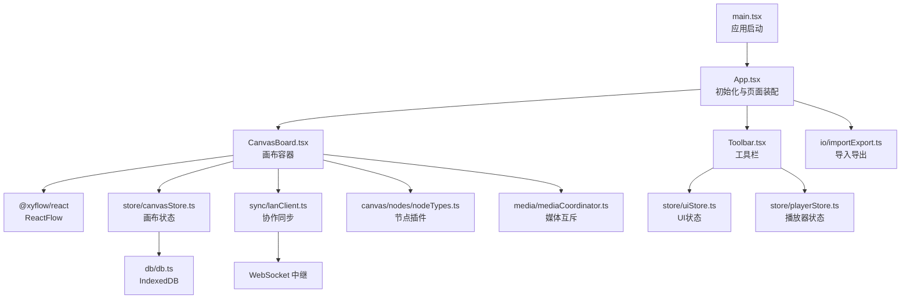
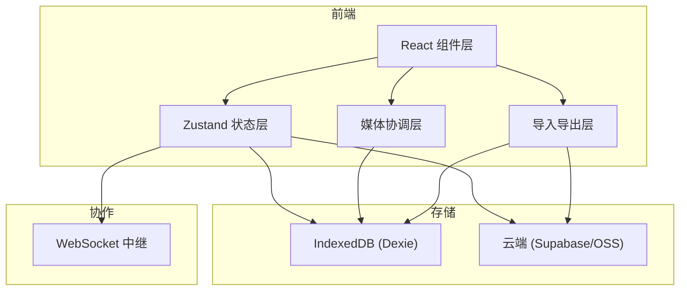
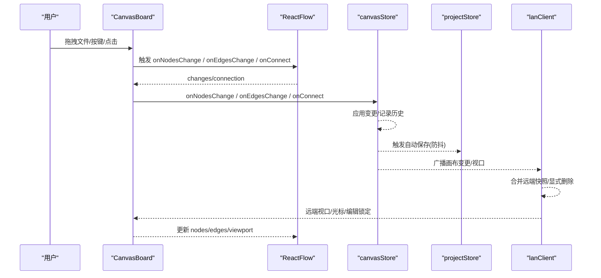
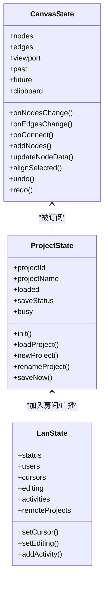
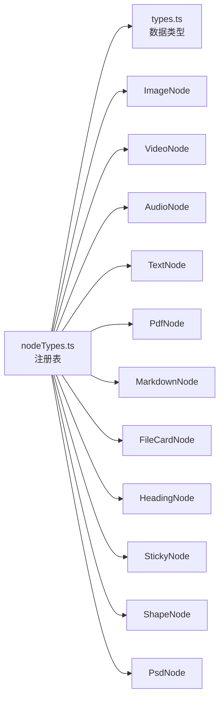
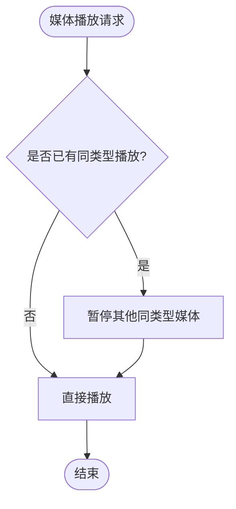
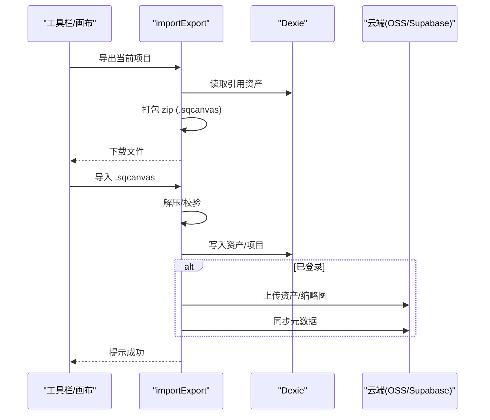
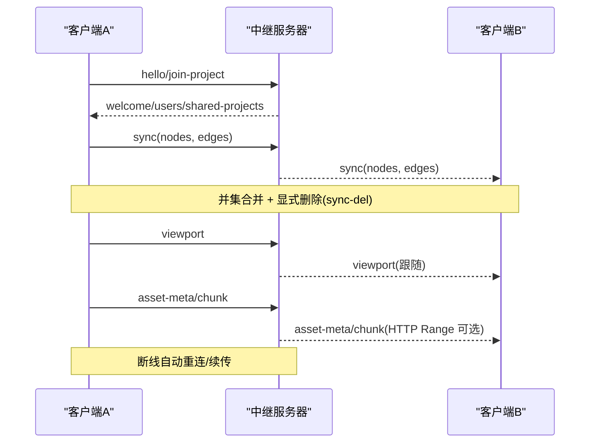
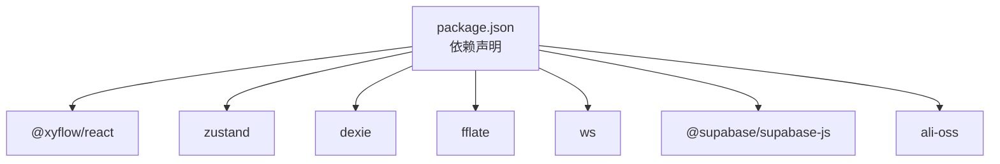

# 架构设计

<cite>
**本文引用的文件**
- [src/App.tsx](file://src/App.tsx)
- [src/main.tsx](file://src/main.tsx)
- [package.json](file://package.json)
- [README.md](file://README.md)
- [src/canvas/CanvasBoard.tsx](file://src/canvas/CanvasBoard.tsx)
- [src/components/Toolbar.tsx](file://src/components/Toolbar.tsx)
- [src/store/canvasStore.ts](file://src/store/canvasStore.ts)
- [src/store/projectStore.ts](file://src/store/projectStore.ts)
- [src/store/lanStore.ts](file://src/store/lanStore.ts)
- [src/sync/lanClient.ts](file://src/sync/lanClient.ts)
- [src/db/db.ts](file://src/db/db.ts)
- [src/io/importExport.ts](file://src/io/importExport.ts)
- [src/media/mediaCoordinator.ts](file://src/media/mediaCoordinator.ts)
- [src/types.ts](file://src/types.ts)
- [src/canvas/nodes/nodeTypes.ts](file://src/canvas/nodes/nodeTypes.ts)
</cite>

## 目录
1. [简介](#简介)
2. [项目结构](#项目结构)
3. [核心组件](#核心组件)
4. [架构总览](#架构总览)
5. [详细组件分析](#详细组件分析)
6. [依赖关系分析](#依赖关系分析)
7. [性能考量](#性能考量)
8. [故障排查指南](#故障排查指南)
9. [结论](#结论)
10. [附录](#附录)

## 简介
SuQCanvas 是一款基于浏览器的无限画布应用，支持图片、视频、音频、PDF、Markdown、文本等多媒体元素在同一张画布上拖拽组织与连线。系统采用前端 React + TypeScript + Vite 构建，使用 @xyflow/react 作为画布引擎，Zustand 进行状态管理，Dexie（IndexedDB）实现本地持久化，并可选通过局域网中继或云端服务进行协作与同步。

本架构文档面向开发者，系统性阐述分层设计、核心模式（组件化、状态管理、插件化节点）、数据流（用户操作→状态更新→UI 渲染）、子系统交互（画布编辑器、媒体处理、存储管理、协作同步），以及技术选型权衡。

## 项目结构
- 前端入口：React 应用由 main.tsx 挂载 App，App 负责初始化认证、项目、工具栏、画布及全局弹窗等。
- 画布层：CanvasBoard 封装 @xyflow/react，提供拖放、快捷键、主题、视口控制、协作光标与编辑锁定。
- 状态层：Zustand 多 store（canvasStore、projectStore、uiStore、settingsStore、playerStore、lanStore）按职责拆分。
- 存储层：db.ts 定义 Dexie schema（assets、projects），并提供 GC 清理逻辑。
- 媒体层：mediaCoordinator 统一互斥播放；各节点类型在 nodeTypes 中注册为插件式扩展。
- 协作层：lanClient 维护 WebSocket 连接、房间消息路由、画布/视口/素材同步、断线重连与墓碑机制。
- IO 层：importExport 负责 .sqcanvas 导出导入、云端资源上传与元数据同步。

图表来源
- [src/main.tsx:1-6](file://src/main.tsx#L1-L6)
- [src/App.tsx:1-74](file://src/App.tsx#L1-L74)
- [src/canvas/CanvasBoard.tsx:1-459](file://src/canvas/CanvasBoard.tsx#L1-L459)
- [src/components/Toolbar.tsx:1-403](file://src/components/Toolbar.tsx#L1-L403)
- [src/store/canvasStore.ts:1-399](file://src/store/canvasStore.ts#L1-L399)
- [src/sync/lanClient.ts:1-800](file://src/sync/lanClient.ts#L1-L800)
- [src/db/db.ts:1-69](file://src/db/db.ts#L1-L69)
- [src/io/importExport.ts:1-203](file://src/io/importExport.ts#L1-L203)
- [src/canvas/nodes/nodeTypes.ts:1-27](file://src/canvas/nodes/nodeTypes.ts#L1-L27)
- [src/media/mediaCoordinator.ts:1-25](file://src/media/mediaCoordinator.ts#L1-L25)

章节来源
- [src/main.tsx:1-6](file://src/main.tsx#L1-L6)
- [src/App.tsx:1-74](file://src/App.tsx#L1-L74)
- [README.md:124-150](file://README.md#L124-L150)

## 核心组件
- 画布编辑器（CanvasBoard）
  - 集成 @xyflow/react，提供节点/边变更、连接、拖放、粘贴、快捷键、视口控制、主题切换、协作光标与编辑锁定。
  - 订阅 lanStore 的远端视口，实现跟随他人视图。
- 状态管理（Zustand）
  - canvasStore：节点/边/视口、撤销重做历史、对齐/层级、剪贴板、资产移除。
  - projectStore：项目生命周期、自动保存、云端/本地双写、加入局域网房间。
  - lanStore：协作连接状态、用户列表、光标、编辑锁定、活动日志、远端项目。
- 存储管理（Dexie）
  - assets/projects 表结构，GC 策略（孤立素材 24 小时回收）。
- 媒体协调（mediaCoordinator）
  - 同类型媒体互斥播放（同一时刻仅一个音频/视频播放）。
- 协作同步（lanClient）
  - WebSocket 连接、房间消息路由、画布快照并集合并、显式删除传播、视口广播、素材分片传输、HTTP Range 拉流优化、断线指数退避重连。

章节来源
- [src/canvas/CanvasBoard.tsx:1-459](file://src/canvas/CanvasBoard.tsx#L1-L459)
- [src/store/canvasStore.ts:1-399](file://src/store/canvasStore.ts#L1-L399)
- [src/store/projectStore.ts:1-230](file://src/store/projectStore.ts#L1-L230)
- [src/store/lanStore.ts:1-160](file://src/store/lanStore.ts#L1-L160)
- [src/db/db.ts:1-69](file://src/db/db.ts#L1-L69)
- [src/media/mediaCoordinator.ts:1-25](file://src/media/mediaCoordinator.ts#L1-L25)
- [src/sync/lanClient.ts:1-800](file://src/sync/lanClient.ts#L1-L800)

## 架构总览
系统采用“前端 React 应用 + 可选后端中继/云端”的分层架构：
- 表现层：React 组件（App、CanvasBoard、Toolbar、Modal 等）
- 业务层：Zustand stores（画布、项目、UI、设置、播放器、协作）
- 数据层：IndexedDB（本地持久化）、云端（Supabase/OSS，在线版）
- 协作层：WebSocket 中继（局域网版）或云端 API（在线版）
- 媒体层：浏览器原生媒体 + 协处理器（封面抽取、PSD 预览、歌词解析等）

图表来源
- [src/App.tsx:1-74](file://src/App.tsx#L1-L74)
- [src/store/canvasStore.ts:1-399](file://src/store/canvasStore.ts#L1-L399)
- [src/store/projectStore.ts:1-230](file://src/store/projectStore.ts#L1-L230)
- [src/sync/lanClient.ts:1-800](file://src/sync/lanClient.ts#L1-L800)
- [src/db/db.ts:1-69](file://src/db/db.ts#L1-L69)
- [src/io/importExport.ts:1-203](file://src/io/importExport.ts#L1-L203)

## 详细组件分析

### 画布编辑器（CanvasBoard）
- 职责
  - 绑定 @xyflow/react 的节点/边变更回调到 canvasStore。
  - 处理拖放文件、粘贴图片、双击空白创建文本、快捷键（选择/连线/拖动/全选/复制/粘贴/适应视图）。
  - 监听 lanStore 的远端视口，驱动 ReactFlow 平滑跟随。
  - 协作编辑锁定：当其他用户编辑某节点时，禁止本地选中/移动，显示锁定态。
  - 注入自定义节点类型与边样式。
- 关键流程
  - onNodesChange/onEdgesChange → 去重锁定节点 → 调用 store 方法 → 触发自动保存与协作广播。
  - onConnect → 生成默认边样式 → 记录历史 → 广播变更。
  - 键盘事件 → undo/redo/duplicate/copy/paste/selectAll/fitView。
  - 拖放/粘贴 → importFiles → 转换为节点 → addNodes。

图表来源
- [src/canvas/CanvasBoard.tsx:1-459](file://src/canvas/CanvasBoard.tsx#L1-L459)
- [src/store/canvasStore.ts:1-399](file://src/store/canvasStore.ts#L1-L399)
- [src/store/projectStore.ts:1-230](file://src/store/projectStore.ts#L1-L230)
- [src/sync/lanClient.ts:1-800](file://src/sync/lanClient.ts#L1-L800)

章节来源
- [src/canvas/CanvasBoard.tsx:1-459](file://src/canvas/CanvasBoard.tsx#L1-L459)

### 状态管理（Zustand）
- canvasStore
  - 数据结构：nodes、edges、viewport、past/future（历史栈）、clipboard。
  - 算法要点：
    - 撤销/重做：基于快照防抖合并，限制历史长度。
    - 对齐/分布：计算边界与间距，批量更新位置。
    - 层级调整：排序后重新分配 zIndex。
    - 剪贴板：结构化克隆节点与关联边，重映射 id。
  - 复杂度：多数操作 O(n)，n 为节点/边数量；对齐/分布涉及排序 O(n log n)。
- projectStore
  - 自动保存：订阅 canvasStore 变化，500ms 防抖写入本地或云端。
  - 项目生命周期：新建/加载/重命名/删除，云端优先（登录态）否则本地。
  - 协作：加入房间、保存项目到局域网主机、广播本地项目列表。
- lanStore
  - 协作状态：连接状态、用户列表、光标、编辑锁定、活动日志、远端项目。
  - 视图跟随：remoteViewport 驱动 CanvasBoard 平滑跟随。

图表来源
- [src/store/canvasStore.ts:1-399](file://src/store/canvasStore.ts#L1-L399)
- [src/store/projectStore.ts:1-230](file://src/store/projectStore.ts#L1-L230)
- [src/store/lanStore.ts:1-160](file://src/store/lanStore.ts#L1-L160)

章节来源
- [src/store/canvasStore.ts:1-399](file://src/store/canvasStore.ts#L1-L399)
- [src/store/projectStore.ts:1-230](file://src/store/projectStore.ts#L1-L230)
- [src/store/lanStore.ts:1-160](file://src/store/lanStore.ts#L1-L160)

### 插件化节点系统
- 节点类型注册：nodeTypes 将 image/video/audio/fileCard/text/markdown/pdf/psd/heading/sticky/shape 等节点以键值对形式暴露给 ReactFlow。
- 节点数据模型：types.ts 定义 SuqNode/SuqEdge 及其 data 字段，包含媒体标识、尺寸、样式、创作信息等。
- 扩展性：新增节点只需实现组件并在 nodeTypes 中注册，无需修改画布核心逻辑。

图表来源
- [src/canvas/nodes/nodeTypes.ts:1-27](file://src/canvas/nodes/nodeTypes.ts#L1-L27)
- [src/types.ts:1-112](file://src/types.ts#L1-L112)

章节来源
- [src/canvas/nodes/nodeTypes.ts:1-27](file://src/canvas/nodes/nodeTypes.ts#L1-L27)
- [src/types.ts:1-112](file://src/types.ts#L1-L112)

### 媒体处理与互斥
- mediaCoordinator 维护音频/视频集合，任一媒体触发 play 时暂停同类型其他媒体，避免并发冲突。
- 结合节点组件的生命周期，注册/注销媒体实例，确保内存安全。

图表来源
- [src/media/mediaCoordinator.ts:1-25](file://src/media/mediaCoordinator.ts#L1-L25)

章节来源
- [src/media/mediaCoordinator.ts:1-25](file://src/media/mediaCoordinator.ts#L1-L25)

### 存储管理与导入导出
- db.ts：定义 assets/projects 表，提供 GC 清理（孤立素材 24 小时回收）。
- importExport.ts：
  - 导出：收集节点引用的资产，打包为 .sqcanvas（zip），包含 project.json 与二进制资产。
  - 导入：解压校验，写入 IndexedDB，登录态下上传 OSS 并同步元数据至云端。
- 自动保存：projectStore 订阅 canvasStore 变化，防抖写入本地或云端。

图表来源
- [src/io/importExport.ts:1-203](file://src/io/importExport.ts#L1-L203)
- [src/db/db.ts:1-69](file://src/db/db.ts#L1-L69)
- [src/store/projectStore.ts:1-230](file://src/store/projectStore.ts#L1-L230)

章节来源
- [src/io/importExport.ts:1-203](file://src/io/importExport.ts#L1-L203)
- [src/db/db.ts:1-69](file://src/db/db.ts#L1-L69)
- [src/store/projectStore.ts:1-230](file://src/store/projectStore.ts#L1-L230)

### 协作同步（局域网）
- 连接与房间：lanClient 管理 WebSocket 连接、加入房间、广播项目列表。
- 画布同步：
  - 快照并集合并：远端节点覆盖本地同 id，保留本地独有节点。
  - 显式删除：sync-del 消息传播删除，配合墓碑机制防止晚到旧快照复活。
  - 视口广播：跟随他人视口，平滑动画。
- 素材传输：
  - 分片传输：base64 对齐分片，空闲超时判定失败，支持断点续传。
  - HTTP Range：服务器告知可走 Range 拉流时，播放器直接拉取，减少带宽占用。
- 断线重连：指数退避，自动恢复会话与未完成的素材传输。

图表来源
- [src/sync/lanClient.ts:1-800](file://src/sync/lanClient.ts#L1-L800)
- [src/store/lanStore.ts:1-160](file://src/store/lanStore.ts#L1-L160)

章节来源
- [src/sync/lanClient.ts:1-800](file://src/sync/lanClient.ts#L1-L800)
- [src/store/lanStore.ts:1-160](file://src/store/lanStore.ts#L1-L160)

## 依赖关系分析
- 框架与引擎
  - React 19 + TypeScript + Vite 8：现代前端工程化，快速开发体验。
  - @xyflow/react：成熟的画布引擎，提供节点/边/视口/小地图等能力，降低自研成本。
- 状态管理
  - Zustand：轻量、易上手、订阅粒度细，适合多 store 拆分与跨模块共享。
- 存储
  - Dexie：IndexedDB 的友好封装，简化 schema 与查询。
  - fflate：压缩/解压 .sqcanvas 文件，便于迁移与备份。
- 协作
  - WebSocket：实时双向通信，适合局域网多人协作。
  - Supabase/OSS：在线版账号与云存储。
- 媒体
  - pdfjs-dist、react-markdown、ag-psd：按需加载与渲染特定格式。

图表来源
- [package.json:1-52](file://package.json#L1-L52)

章节来源
- [package.json:1-52](file://package.json#L1-L52)

## 性能考量
- 画布性能
  - 节点/边变更批量处理，避免频繁重绘。
  - 视口变化节流/防抖，减少广播频率。
  - 小地图与背景按需渲染。
- 媒体性能
  - 媒体互斥播放，避免 CPU/内存峰值。
  - 视频离开视口卸载，减少解码压力。
  - 大文件分片传输，HTTP Range 拉流替代整包下载。
- 存储性能
  - 自动保存 500ms 防抖，降低写入频率。
  - GC 定时回收孤立素材，释放空间。
- 协作性能
  - 快照并集合并 + 显式删除，避免全量覆盖导致的抖动。
  - 活动通知合并，减少刷屏。
  - 断线重连指数退避，避免雪崩。

[本节为通用指导，不直接分析具体文件]

## 故障排查指南
- 无法连接局域网中继
  - 检查地址解析（HTTPS 必须 wss），确认反向代理配置。
  - 查看 lanClient 的错误提示与状态。
- 画布不同步
  - 确认 activeProjectId 一致，检查 sync-del 与墓碑机制是否生效。
  - 观察远端节点是否被误删（晚到旧快照）。
- 素材无法加载
  - 检查 asset-meta/chunk 是否完整，HTTP Range 是否可用。
  - 查看 pendingAssets 与 assetIdleTimers 是否超时。
- 自动保存失败
  - 检查 projectStore.saveNow 错误分支与 toast 提示。
  - 确认云端/本地写入权限与网络状态。

章节来源
- [src/sync/lanClient.ts:1-800](file://src/sync/lanClient.ts#L1-L800)
- [src/store/projectStore.ts:1-230](file://src/store/projectStore.ts#L1-L230)

## 结论
SuQCanvas 通过清晰的层次划分与职责分离，实现了可扩展的画布编辑器、稳定的状态管理、可靠的本地与云端存储、以及高效的局域网协作。技术选型兼顾了开发效率与运行性能：@xyflow/react 提供成熟画布能力，Zustand 保证状态流转简洁高效，Dexie 简化本地持久化，WebSocket 支撑实时协作。未来可在分组/容器、对齐参考线等方面继续演进。

[本节为总结，不直接分析具体文件]

## 附录
- 快捷键速查：选择(V)、连线(C)、拖动(H)、空格临时平移、F 适应视图、Ctrl+A/D/C/V/Z/Y 等。
- 构建模式：在线版/局域网版分开构建，环境变量控制目标与中继地址。
- 部署建议：生产环境使用 HTTPS + 反向代理 wss，开放必要端口并配置 CORS。

章节来源
- [README.md:124-150](file://README.md#L124-L150)
- [README.md:40-123](file://README.md#L40-L123)