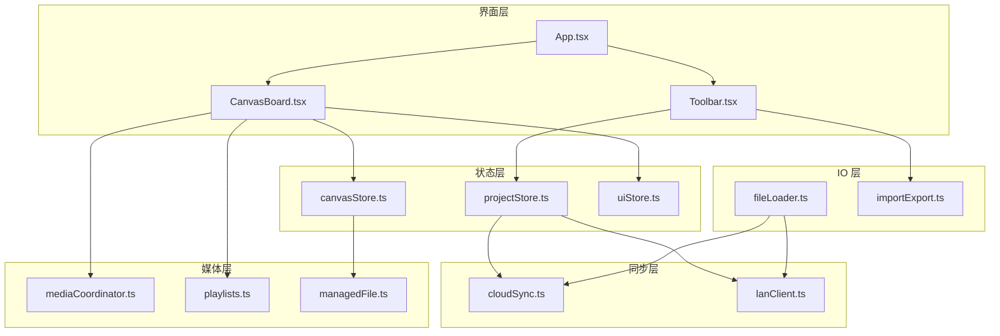
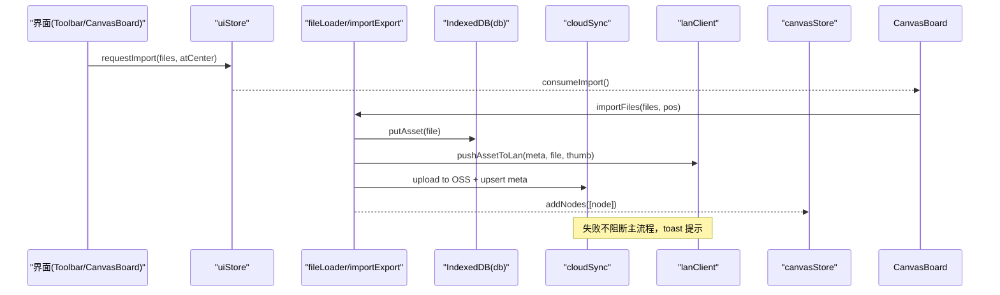
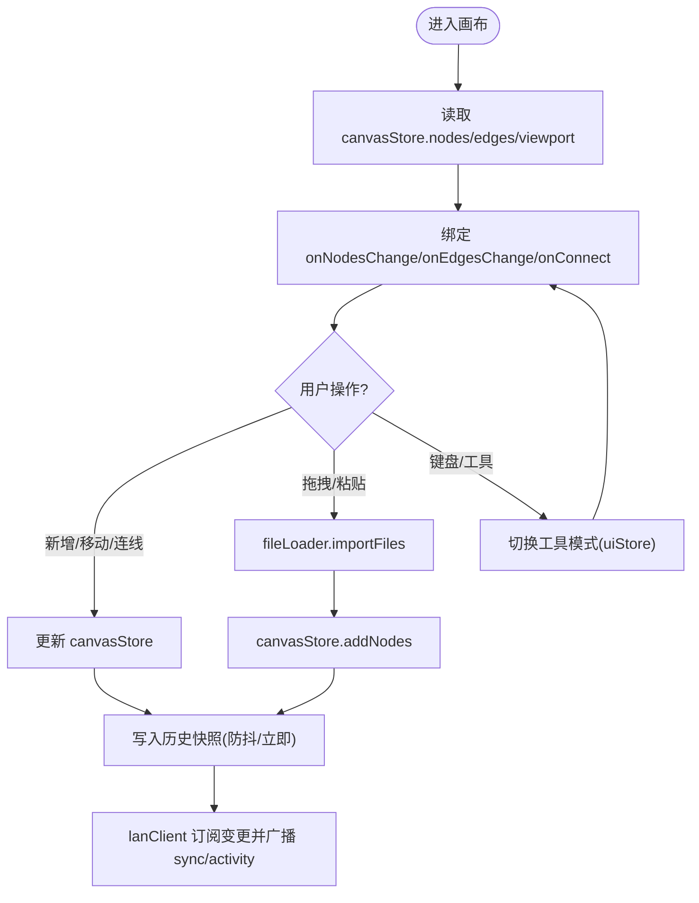
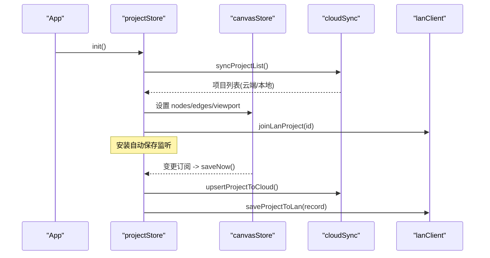
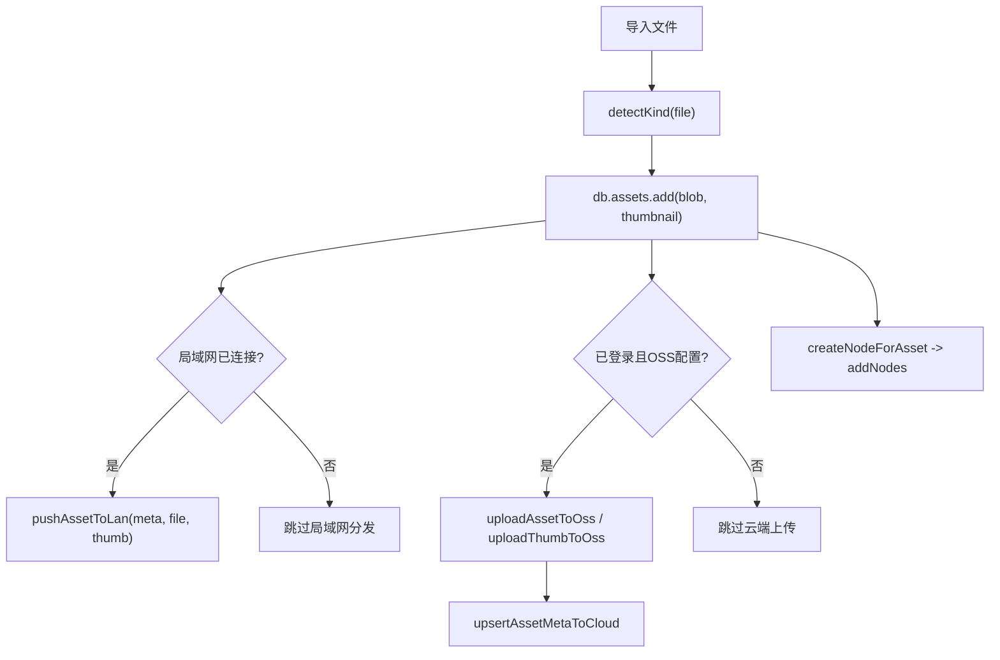
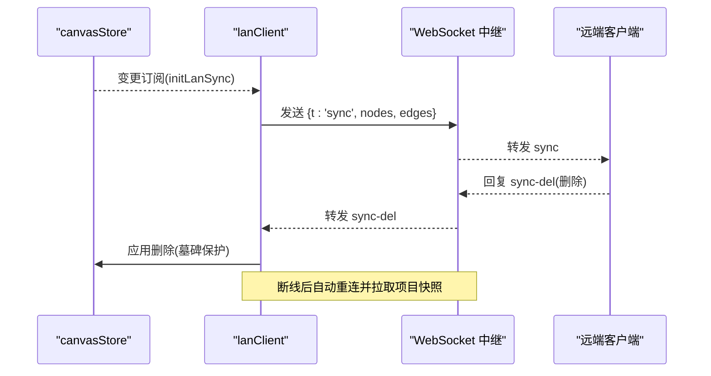
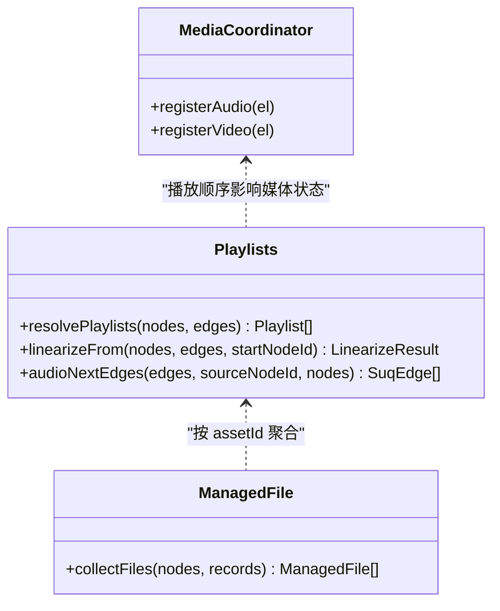
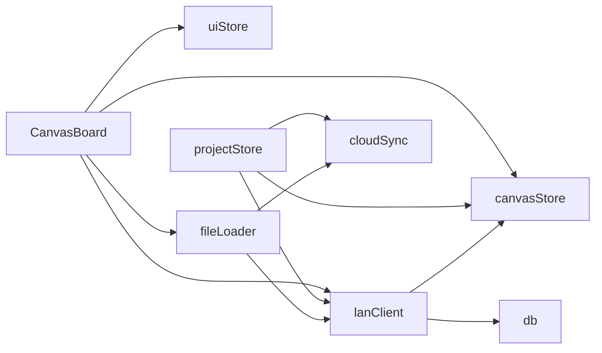

# 模块交互设计

<cite>
**本文引用的文件**
- [App.tsx](file://src/App.tsx)
- [main.tsx](file://src/main.tsx)
- [CanvasBoard.tsx](file://src/canvas/CanvasBoard.tsx)
- [canvasStore.ts](file://src/store/canvasStore.ts)
- [projectStore.ts](file://src/store/projectStore.ts)
- [uiStore.ts](file://src/store/uiStore.ts)
- [fileLoader.ts](file://src/io/fileLoader.ts)
- [importExport.ts](file://src/io/importExport.ts)
- [cloudSync.ts](file://src/sync/cloudSync.ts)
- [lanClient.ts](file://src/sync/lanClient.ts)
- [mediaCoordinator.ts](file://src/media/mediaCoordinator.ts)
- [playlists.ts](file://src/media/playlists.ts)
- [managedFile.ts](file://src/media/managedFile.ts)
- [types.ts](file://src/types.ts)
- [Toolbar.tsx](file://src/components/Toolbar.tsx)
</cite>

## 目录
1. [简介](#简介)
2. [项目结构](#项目结构)
3. [核心组件](#核心组件)
4. [架构总览](#架构总览)
5. [详细组件分析](#详细组件分析)
6. [依赖关系分析](#依赖关系分析)
7. [性能考量](#性能考量)
8. [故障排查指南](#故障排查指南)
9. [结论](#结论)
10. [附录：扩展指南](#附录扩展指南)

## 简介
本文件面向 SuQCanvas 的模块交互设计，聚焦画布编辑器、媒体处理、文件 IO、同步服务（云端与局域网）之间的协作方式。文档统一说明以下主题：
- 模块间通信协议：事件总线（CustomEvent）、回调函数、Promise 链等
- 依赖注入模式：通过 Store 与接口抽象实现松耦合
- 错误处理与异常传播：跨模块捕获、重试、降级策略
- 关键业务流程的调用序列图
- 如何扩展新模块并保持架构一致性

## 项目结构
SuQCanvas 采用“功能域 + 状态层”的分层组织：
- 视图与交互：App、CanvasBoard、Toolbar 等 React 组件
- 状态管理：Zustand Store（canvasStore、projectStore、uiStore 等）
- 数据与 IO：本地 IndexedDB（db）、导入导出（importExport）、文件加载（fileLoader）
- 同步服务：云端（cloudSync、ossClient、supabaseClient）、局域网（lanClient）
- 媒体能力：媒体协调（mediaCoordinator）、歌单解析（playlists）、受管文件聚合（managedFile）
- 类型定义：types.ts 提供统一的节点/边/媒体类型

图表来源
- [App.tsx:1-74](file://src/App.tsx#L1-L74)
- [CanvasBoard.tsx:1-459](file://src/canvas/CanvasBoard.tsx#L1-L459)
- [Toolbar.tsx:1-403](file://src/components/Toolbar.tsx#L1-L403)
- [canvasStore.ts:1-399](file://src/store/canvasStore.ts#L1-L399)
- [projectStore.ts:1-230](file://src/store/projectStore.ts#L1-L230)
- [uiStore.ts:1-121](file://src/store/uiStore.ts#L1-L121)
- [fileLoader.ts:1-297](file://src/io/fileLoader.ts#L1-L297)
- [importExport.ts:1-203](file://src/io/importExport.ts#L1-L203)
- [cloudSync.ts:1-165](file://src/sync/cloudSync.ts#L1-L165)
- [lanClient.ts:1-800](file://src/sync/lanClient.ts#L1-L800)
- [mediaCoordinator.ts:1-25](file://src/media/mediaCoordinator.ts#L1-L25)
- [playlists.ts:1-179](file://src/media/playlists.ts#L1-L179)
- [managedFile.ts:1-39](file://src/media/managedFile.ts#L1-L39)

章节来源
- [App.tsx:1-74](file://src/App.tsx#L1-L74)
- [main.tsx:1-6](file://src/main.tsx#L1-L6)

## 核心组件
- 画布编辑器（CanvasBoard）：基于 ReactFlow，负责节点/边的增删改、工具模式、快捷键、拖拽导入、视口同步、局域网光标与编辑态广播。
- 项目存储（projectStore）：负责项目生命周期（新建/打开/保存/重命名），自动保存监听 canvasStore 变更，选择云端或本地持久化，并触发局域网同步。
- 画布状态（canvasStore）：维护节点/边/视口/历史栈/剪贴板，提供对齐、层级、复制粘贴等操作，所有写操作均记录历史快照。
- 文件 IO（fileLoader/importExport）：文件导入、缩略图生成、素材入库、云端/局域网分发；项目导出为 .sqcanvas 压缩包，导入时校验版本并回填数据库与云端。
- 同步服务（cloudSync/lanClient）：云端通过 Supabase/OSS 同步项目与素材元数据；局域网通过 WebSocket 进行画布增量同步、删除合并、视口广播、活动日志、素材分片传输。
- 媒体协调（mediaCoordinator/playlists/managedFile）：音频/视频互斥播放；从图结构派生歌单顺序；按 assetId 聚合受管文件列表。

章节来源
- [CanvasBoard.tsx:1-459](file://src/canvas/CanvasBoard.tsx#L1-L459)
- [projectStore.ts:1-230](file://src/store/projectStore.ts#L1-L230)
- [canvasStore.ts:1-399](file://src/store/canvasStore.ts#L1-L399)
- [fileLoader.ts:1-297](file://src/io/fileLoader.ts#L1-L297)
- [importExport.ts:1-203](file://src/io/importExport.ts#L1-L203)
- [cloudSync.ts:1-165](file://src/sync/cloudSync.ts#L1-L165)
- [lanClient.ts:1-800](file://src/sync/lanClient.ts#L1-L800)
- [mediaCoordinator.ts:1-25](file://src/media/mediaCoordinator.ts#L1-L25)
- [playlists.ts:1-179](file://src/media/playlists.ts#L1-L179)
- [managedFile.ts:1-39](file://src/media/managedFile.ts#L1-L39)

## 架构总览
整体采用“事件驱动 + Store 订阅 + Promise 异步流”的混合模式：
- 事件总线：window CustomEvent（如 sq:add-node、sq:view、sq:focus-node）用于跨组件解耦通信。
- Store 订阅：Zustand store.subscribe 在 projectStore 中监听 canvasStore 变更，触发自动保存；lanClient 订阅 canvasStore 变更，广播同步消息。
- Promise 链：导入/导出、云端/局域网上传下载、项目加载等均为异步流程，使用 try/catch 与 toast 反馈。

图表来源
- [Toolbar.tsx:1-403](file://src/components/Toolbar.tsx#L1-L403)
- [uiStore.ts:1-121](file://src/store/uiStore.ts#L1-L121)
- [CanvasBoard.tsx:1-459](file://src/canvas/CanvasBoard.tsx#L1-L459)
- [fileLoader.ts:1-297](file://src/io/fileLoader.ts#L1-L297)
- [importExport.ts:1-203](file://src/io/importExport.ts#L1-L203)
- [cloudSync.ts:1-165](file://src/sync/cloudSync.ts#L1-L165)
- [lanClient.ts:1-800](file://src/sync/lanClient.ts#L1-L800)
- [canvasStore.ts:1-399](file://src/store/canvasStore.ts#L1-L399)

## 详细组件分析

### 画布编辑器（CanvasBoard）
- 职责：渲染 ReactFlow，处理节点/边变化、连接、工具模式、快捷键、拖拽/粘贴导入、视口同步、局域网光标/编辑态广播。
- 与 Store 交互：读取/更新 canvasStore 的 nodes/edges/viewport；通过 uiStore 控制工具模式与导入队列；通过 lanClient 广播光标与编辑态。
- 事件总线：监听 window 自定义事件（sq:add-node、sq:view、sq:focus-node）以响应 Toolbar 或其他模块指令。
- 并发与锁定：根据 lanStore.editing 计算 lockedNodeIds，阻止他人正在编辑的节点被修改。

图表来源
- [CanvasBoard.tsx:1-459](file://src/canvas/CanvasBoard.tsx#L1-L459)
- [canvasStore.ts:1-399](file://src/store/canvasStore.ts#L1-L399)
- [lanClient.ts:1-800](file://src/sync/lanClient.ts#L1-L800)
- [uiStore.ts:1-121](file://src/store/uiStore.ts#L1-L121)

章节来源
- [CanvasBoard.tsx:1-459](file://src/canvas/CanvasBoard.tsx#L1-L459)

### 项目存储（projectStore）
- 职责：项目初始化、打开、新建、重命名、保存；自动保存监听 canvasStore 变更；根据登录状态选择云端或本地持久化；加入局域网房间并广播项目列表。
- 自动保存：安装一次性的 subscribe，当 nodes/edges/viewport 变化时延迟触发 saveNow。
- 云端/本地策略：isCloudUser 决定走 cloudSync.upsertProjectToCloud 或 db.projects.update。

图表来源
- [projectStore.ts:1-230](file://src/store/projectStore.ts#L1-L230)
- [cloudSync.ts:1-165](file://src/sync/cloudSync.ts#L1-L165)
- [lanClient.ts:1-800](file://src/sync/lanClient.ts#L1-L800)
- [canvasStore.ts:1-399](file://src/store/canvasStore.ts#L1-L399)

章节来源
- [projectStore.ts:1-230](file://src/store/projectStore.ts#L1-L230)

### 文件 IO（fileLoader/importExport）
- 导入流程：检测媒体类型、生成缩略图（视频/PSD）、写入 IndexedDB、并行推送局域网与云端（失败降级不影响主流程）。
- 导出流程：收集项目 JSON 与引用资产，打包为 .sqcanvas 并触发浏览器下载；已登录时同时上传到 OSS 并更新云端元数据。
- 错误处理：对无效文件、版本不兼容、网络错误等进行 try/catch，并通过 toast 提示。

图表来源
- [fileLoader.ts:1-297](file://src/io/fileLoader.ts#L1-L297)
- [importExport.ts:1-203](file://src/io/importExport.ts#L1-L203)
- [cloudSync.ts:1-165](file://src/sync/cloudSync.ts#L1-L165)
- [lanClient.ts:1-800](file://src/sync/lanClient.ts#L1-L800)

章节来源
- [fileLoader.ts:1-297](file://src/io/fileLoader.ts#L1-L297)
- [importExport.ts:1-203](file://src/io/importExport.ts#L1-L203)

### 同步服务（cloudSync/lanClient）
- 云端：根据是否登录选择本地或云端项目列表；项目与素材元数据的 upsert/fetch/delete；失败仅 warn 并返回空结果。
- 局域网：WebSocket 消息路由（sync、sync-del、viewport、cursor、editing、activity、asset-*）；断线指数退避重连；删除采用墓碑机制避免晚到快照复活；大文件分片传输与 HTTP Range 优化。

图表来源
- [lanClient.ts:1-800](file://src/sync/lanClient.ts#L1-L800)
- [canvasStore.ts:1-399](file://src/store/canvasStore.ts#L1-L399)

章节来源
- [cloudSync.ts:1-165](file://src/sync/cloudSync.ts#L1-L165)
- [lanClient.ts:1-800](file://src/sync/lanClient.ts#L1-L800)

### 媒体协调与歌单（mediaCoordinator/playlists/managedFile）
- 媒体互斥：同一时刻最多一个音频和一个视频播放，任意媒体 play 时暂停同类型其他元素。
- 歌单解析：从画布图结构推导播放顺序，支持分叉排序、环检测、去重与告警。
- 受管文件：按 assetId 聚合节点与素材记录，便于批量管理与展示。

图表来源
- [mediaCoordinator.ts:1-25](file://src/media/mediaCoordinator.ts#L1-L25)
- [playlists.ts:1-179](file://src/media/playlists.ts#L1-L179)
- [managedFile.ts:1-39](file://src/media/managedFile.ts#L1-L39)

章节来源
- [mediaCoordinator.ts:1-25](file://src/media/mediaCoordinator.ts#L1-L25)
- [playlists.ts:1-179](file://src/media/playlists.ts#L1-L179)
- [managedFile.ts:1-39](file://src/media/managedFile.ts#L1-L39)

## 依赖关系分析
- 松耦合设计：
  - 组件通过 Store 访问状态，而非直接引用业务逻辑模块，降低耦合。
  - 事件总线（CustomEvent）使 Toolbar 与 CanvasBoard 解耦。
  - 同步服务通过接口式函数（如 isCloudAuthed、upsertProjectToCloud、pushAssetToLan）被 IO 与 Store 调用，便于替换实现。
- 直接依赖：
  - CanvasBoard 依赖 canvasStore、uiStore、lanClient、fileLoader。
  - projectStore 依赖 cloudSync、lanClient、db、canvasStore。
  - fileLoader 依赖 db、lanClient、cloudSync、媒体预览模块。
  - lanClient 依赖 canvasStore、lanStore、db、uiStore。
- 潜在循环：
  - 通过懒加载（如 handleMessage 中动态 import projectStore）避免运行时循环依赖。

图表来源
- [CanvasBoard.tsx:1-459](file://src/canvas/CanvasBoard.tsx#L1-L459)
- [projectStore.ts:1-230](file://src/store/projectStore.ts#L1-L230)
- [fileLoader.ts:1-297](file://src/io/fileLoader.ts#L1-L297)
- [lanClient.ts:1-800](file://src/sync/lanClient.ts#L1-L800)
- [canvasStore.ts:1-399](file://src/store/canvasStore.ts#L1-L399)

章节来源
- [CanvasBoard.tsx:1-459](file://src/canvas/CanvasBoard.tsx#L1-L459)
- [projectStore.ts:1-230](file://src/store/projectStore.ts#L1-L230)
- [fileLoader.ts:1-297](file://src/io/fileLoader.ts#L1-L297)
- [lanClient.ts:1-800](file://src/sync/lanClient.ts#L1-L800)

## 性能考量
- 历史快照防抖：canvasStore 使用 scheduleSnapshot/flushPending 合并高频变更，减少历史栈膨胀。
- 局域网同步节流：sync 与 viewport 广播使用定时器合并，避免频繁消息风暴。
- 删除收敛：sync-del 与墓碑机制防止晚到快照导致节点复活。
- 媒体互斥：mediaCoordinator 保证单一音频/视频播放，避免资源竞争。
- 歌单缓存：playlists.resolvePlaylistsCached 基于引用不可变更新，避免重复解析。
- 大文件传输：lanClient 分片传输与 HTTP Range 优化，减少内存占用与阻塞。

[本节为通用性能讨论，不直接分析具体文件]

## 故障排查指南
- 导入失败：检查文件大小限制与 MIME 类型；查看 toast 提示与 console 错误；确认 IndexedDB 可用。
- 云端同步失败：检查登录状态与 OSS 配置；cloudSync 失败会 warn 并返回空结果，不影响本地数据。
- 局域网连接失败：检查 ws/wss 地址与反向代理；lanClient 会自动重连并提示；确认页面协议与中继协议一致。
- 项目版本不兼容：导入时若版本高于当前支持将抛出错误；需升级应用后再导入。
- 媒体播放冲突：确保 mediaCoordinator 正确注册 audio/video 元素；检查是否有未释放的事件监听。

章节来源
- [fileLoader.ts:1-297](file://src/io/fileLoader.ts#L1-L297)
- [importExport.ts:1-203](file://src/io/importExport.ts#L1-L203)
- [cloudSync.ts:1-165](file://src/sync/cloudSync.ts#L1-L165)
- [lanClient.ts:1-800](file://src/sync/lanClient.ts#L1-L800)
- [mediaCoordinator.ts:1-25](file://src/media/mediaCoordinator.ts#L1-L25)

## 结论
SuQCanvas 通过 Store 订阅与事件总线实现了模块间的松耦合协作；IO 与同步服务以 Promise 链串联异步流程，并在失败时进行降级与提示；局域网与云端双通道保障数据可迁移与协作；媒体系统通过互斥与图结构推导保证一致的播放体验。该架构具备良好的可扩展性与可维护性。

[本节为总结性内容，不直接分析具体文件]

## 附录：扩展指南
- 添加新功能模块的步骤：
  1. 定义类型与接口：在 types.ts 中补充新的节点/边/媒体类型或数据结构。
  2. 创建 Store 片段：如需全局状态，新增 Zustand Store 或通过现有 Store 扩展字段与方法。
  3. 实现业务逻辑：将核心算法放入独立模块（如 media、io、sync），保持纯函数与副作用分离。
  4. 集成到界面：在 CanvasBoard 或相关组件中通过事件总线或 Store 订阅接入。
  5. 接入同步：如需云端/局域网同步，调用 cloudSync/lanClient 提供的接口，遵循失败降级策略。
  6. 测试与文档：编写单元测试与用例，更新本文档的模块交互图与流程图。
- 保持一致性的要点：
  - 使用 Store 作为唯一状态源，避免组件直接持有状态。
  - 使用事件总线进行跨组件通信，避免深层 props 传递。
  - 所有外部副作用（网络、文件、媒体）封装在独立模块，集中错误处理与重试。
  - 遵循现有的命名约定与错误提示风格（toast + console.warn/error）。

[本节为通用指导，不直接分析具体文件]