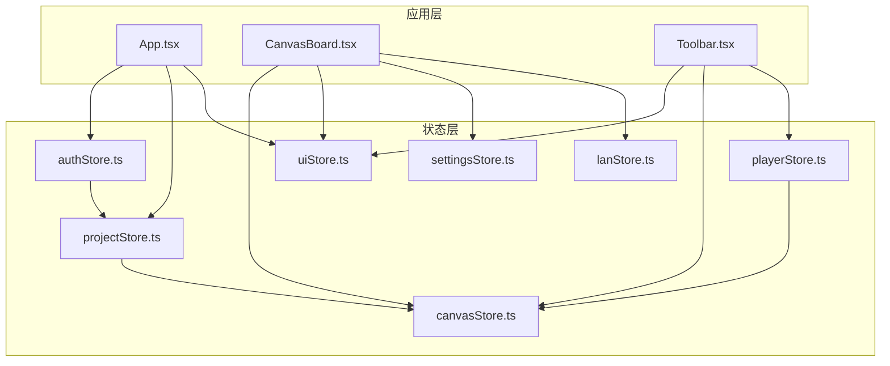
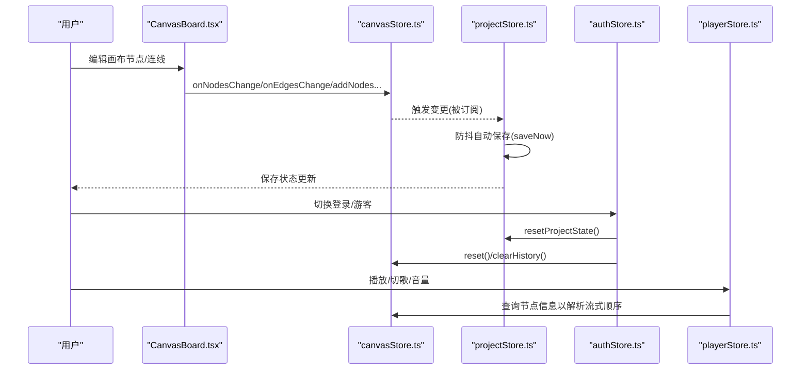
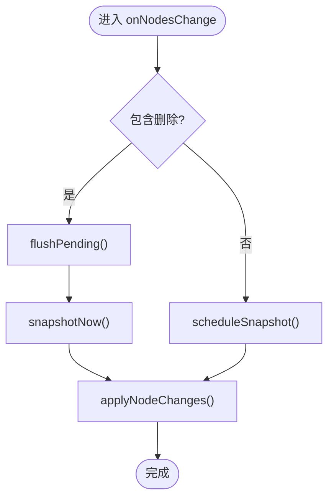
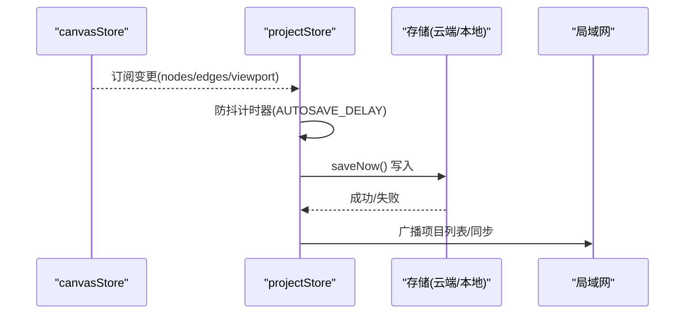
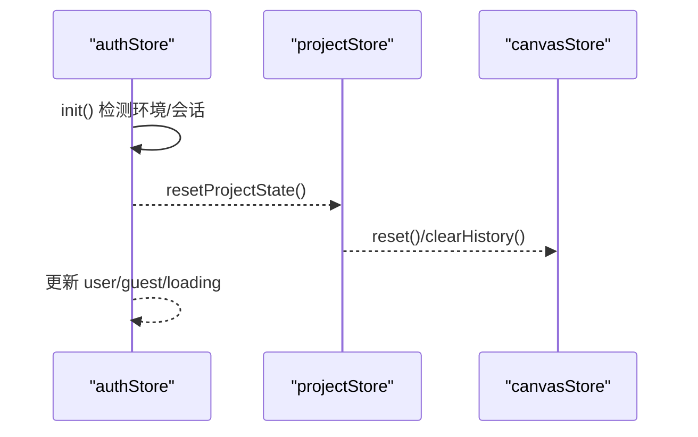
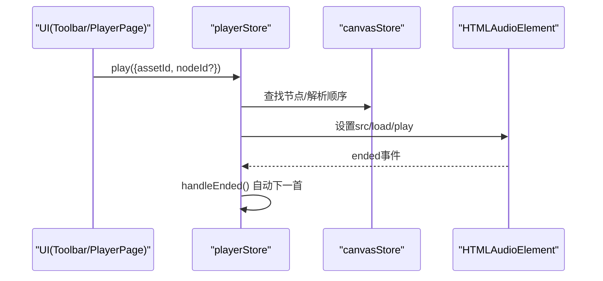
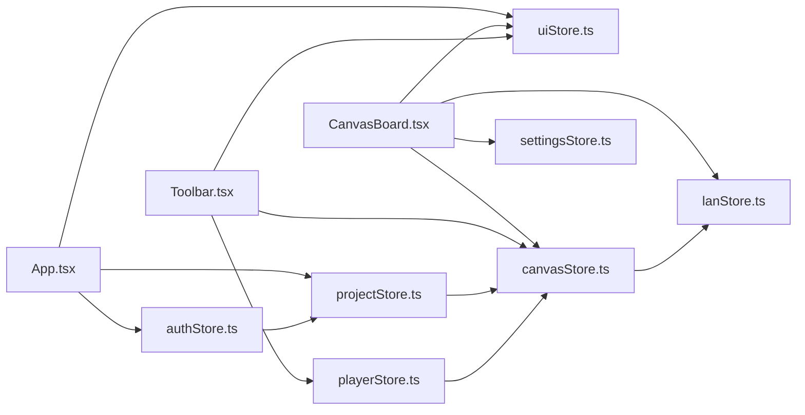

# Zustand Store 架构

<cite>
**本文引用的文件**
- [canvasStore.ts](file://src/store/canvasStore.ts)
- [authStore.ts](file://src/store/authStore.ts)
- [playerStore.ts](file://src/store/playerStore.ts)
- [projectStore.ts](file://src/store/projectStore.ts)
- [settingsStore.ts](file://src/store/settingsStore.ts)
- [uiStore.ts](file://src/store/uiStore.ts)
- [lanStore.ts](file://src/store/lanStore.ts)
- [App.tsx](file://src/App.tsx)
- [CanvasBoard.tsx](file://src/canvas/CanvasBoard.tsx)
- [Toolbar.tsx](file://src/components/Toolbar.tsx)
</cite>

## 目录
1. [简介](#简介)
2. [项目结构](#项目结构)
3. [核心组件](#核心组件)
4. [架构总览](#架构总览)
5. [详细组件分析](#详细组件分析)
6. [依赖关系分析](#依赖关系分析)
7. [性能考虑](#性能考虑)
8. [故障排查指南](#故障排查指南)
9. [结论](#结论)
10. [附录：代码示例路径](#附录代码示例路径)

## 简介
本文件系统化梳理 SuQCanvas 基于 Zustand 的状态管理架构。重点包括：
- Store 的组织与切片设计原则
- 选择器使用模式与订阅机制
- 模块化 Store 的职责划分、依赖与通信
- create 函数、get/set 模式、中间件的使用现状与建议
- Store 初始化流程、状态更新最佳实践与性能优化策略
- 结合具体源码的流程图与时序图，帮助读者快速理解数据流与控制流

## 项目结构
SuQCanvas 将状态按功能域拆分为多个独立 Store，位于 src/store 目录下：
- canvasStore：画布节点、连线、视口、撤销/重做历史、对齐、层级等
- projectStore：项目生命周期、自动保存、云端/本地存储协调
- authStore：认证、游客模式、登录态变化对项目的重置
- playerStore：全局音频播放引擎（单一实例）
- uiStore：UI 状态（工具栏、弹窗、导入队列、播放器入口等）
- settingsStore：主题设置与持久化
- lanStore：局域网协作状态（用户、光标、活动、远程项目等）

图表来源
- [App.tsx:19-38](file://src/App.tsx#L19-L38)
- [CanvasBoard.tsx:42-57](file://src/canvas/CanvasBoard.tsx#L42-L57)
- [Toolbar.tsx:105-126](file://src/components/Toolbar.tsx#L105-L126)

章节来源
- [App.tsx:19-38](file://src/App.tsx#L19-L38)
- [CanvasBoard.tsx:42-57](file://src/canvas/CanvasBoard.tsx#L42-L57)
- [Toolbar.tsx:105-126](file://src/components/Toolbar.tsx#L105-L126)

## 核心组件
- create 函数：所有 Store 均通过 create 创建，定义 state 与 actions，统一暴露 useXxxStore 钩子
- get/set 模式：在 actions 内部通过 get() 读取当前状态，通过 set() 提交新状态；复杂更新采用不可变更新或批量 set
- 选择器：组件侧通过 useXxxStore((s) => s.xxx) 精确订阅，减少不必要的重渲染
- 订阅：projectStore 使用 subscribe 监听 canvasStore 的变化实现自动保存
- 跨 Store 通信：通过直接调用其他 store 的 getState()/setState() 或方法（如 authStore 调用 projectStore.reset、canvasStore.reset）

章节来源
- [canvasStore.ts:118-399](file://src/store/canvasStore.ts#L118-L399)
- [projectStore.ts:46-67](file://src/store/projectStore.ts#L46-L67)
- [authStore.ts:31-42](file://src/store/authStore.ts#L31-L42)
- [playerStore.ts:97-116](file://src/store/playerStore.ts#L97-L116)

## 架构总览
下图展示 Store 之间的职责边界与交互关系，以及关键数据流：

图表来源
- [CanvasBoard.tsx:42-57](file://src/canvas/CanvasBoard.tsx#L42-L57)
- [canvasStore.ts:126-175](file://src/store/canvasStore.ts#L126-L175)
- [projectStore.ts:46-67](file://src/store/projectStore.ts#L46-L67)
- [authStore.ts:31-42](file://src/store/authStore.ts#L31-L42)
- [playerStore.ts:97-116](file://src/store/playerStore.ts#L97-L116)

## 详细组件分析

### 画布 Store（canvasStore）
- 状态切片
  - nodes/edges：画布元素集合
  - viewport：视口位置与缩放
  - past/future：撤销/重做历史栈
  - clipboard：剪贴板缓存
- 操作与逻辑
  - 变更处理：onNodesChange/onEdgesChange 根据是否删除决定立即快照或延迟快照
  - 历史记录：pushHistory/snapshotNow/scheduleSnapshot/flushPending 组合实现去抖与限制长度
  - 插入元数据：insertionMeta 从 lanStore 获取当前用户信息并写入节点/边
  - 复制粘贴：copySelected/pasteClipboard 支持选中集复制、重连边、保持选中态
  - 层级与对齐：changeNodeLayer/setNodeZIndex/alignSelected 提供常用排版能力
  - 资源清理：removeAssets 联动删除关联节点与边
- 性能要点
  - 大量连续编辑通过 scheduleSnapshot 合并历史快照，避免频繁写盘
  - 对齐/层级计算采用 Map/排序优化，减少重复遍历

图表来源
- [canvasStore.ts:126-145](file://src/store/canvasStore.ts#L126-L145)
- [canvasStore.ts:66-107](file://src/store/canvasStore.ts#L66-L107)

章节来源
- [canvasStore.ts:25-116](file://src/store/canvasStore.ts#L25-L116)
- [canvasStore.ts:118-399](file://src/store/canvasStore.ts#L118-L399)

### 项目 Store（projectStore）
- 职责：项目加载、新建、重命名、保存；协调云端/本地存储；自动保存
- 自动保存：installAutosave 订阅 canvasStore 的 nodes/edges/viewport 变化，防抖后调用 saveNow
- 保存策略：isCloudUser 判断登录态，分别走云端 upsert 或本地 IndexedDB 更新；同时广播到局域网
- 错误处理：保存失败时设置 error 状态并通过 uiStore.toast 提示

图表来源
- [projectStore.ts:46-67](file://src/store/projectStore.ts#L46-L67)
- [projectStore.ts:196-228](file://src/store/projectStore.ts#L196-L228)

章节来源
- [projectStore.ts:19-67](file://src/store/projectStore.ts#L19-L67)
- [projectStore.ts:81-117](file://src/store/projectStore.ts#L81-L117)
- [projectStore.ts:196-228](file://src/store/projectStore.ts#L196-L228)

### 认证 Store（authStore）
- 职责：初始化登录态、登录/登出、游客模式；监听 Supabase 会话变化
- 状态隔离：resetProjectState 在登录态切换时重置项目与画布，防止云端/本地数据串写
- 错误翻译：translateAuthError 将底层错误映射为用户可读中文提示

图表来源
- [authStore.ts:31-42](file://src/store/authStore.ts#L31-L42)
- [authStore.ts:49-82](file://src/store/authStore.ts#L49-L82)

章节来源
- [authStore.ts:1-104](file://src/store/authStore.ts#L1-L104)

### 播放器 Store（playerStore）
- 职责：单一全局音频引擎，维护 track、播放状态、时间、音量、模式、队列
- 与画布协作：通过 canvasStore 查找节点信息，沿连线解析流式播放顺序
- 播放控制：play/toggle/seekTo/seekBy/next/prev/setVolume/setMuted/setMode/setQueue/stop
- 竞态保护：playSeq 令牌确保快速连续 play 只应用最后一次

图表来源
- [playerStore.ts:97-116](file://src/store/playerStore.ts#L97-L116)
- [playerStore.ts:174-209](file://src/store/playerStore.ts#L174-L209)
- [playerStore.ts:132-161](file://src/store/playerStore.ts#L132-L161)

章节来源
- [playerStore.ts:1-298](file://src/store/playerStore.ts#L1-L298)

### UI Store（uiStore）
- 职责：Toast 消息、导入队列、PDF/图片/Markdown 查看器开关、播放器页入口、文件管理器、工具模式
- 模式：纯状态容器 + 动作方法，无副作用；通过 toast 辅助函数对外暴露便捷 API

章节来源
- [uiStore.ts:1-121](file://src/store/uiStore.ts#L1-L121)

### 设置 Store（settingsStore）
- 职责：主题切换与持久化；启动时根据 URL 参数或 localStorage 恢复主题
- 副作用：applyTheme 修改 DOM class 以切换样式

章节来源
- [settingsStore.ts:1-40](file://src/store/settingsStore.ts#L1-L40)

### 局域网 Store（lanStore）
- 职责：协作状态（用户、光标、编辑中、活动日志）、远程项目列表、跟随目标、视口共享
- 设计：集中管理协作相关状态，供画布、项目等模块读取与更新

章节来源
- [lanStore.ts:1-160](file://src/store/lanStore.ts#L1-L160)

## 依赖关系分析
- 组件到 Store：
  - App.tsx 订阅 authStore、projectStore、uiStore，负责应用级初始化与路由显示
  - CanvasBoard.tsx 订阅 canvasStore、uiStore、settingsStore、lanStore，驱动画布交互
  - Toolbar.tsx 订阅 uiStore、canvasStore、playerStore，提供工具与播放控制
- Store 间依赖：
  - projectStore 订阅 canvasStore 变更，实现自动保存
  - authStore 在登录态变化时调用 projectStore 与 canvasStore 进行状态重置
  - playerStore 读取 canvasStore 以解析流式播放顺序
  - canvasStore 读取 lanStore 以注入插入元数据（创建者信息等）

图表来源
- [App.tsx:19-38](file://src/App.tsx#L19-L38)
- [CanvasBoard.tsx:42-57](file://src/canvas/CanvasBoard.tsx#L42-L57)
- [Toolbar.tsx:105-126](file://src/components/Toolbar.tsx#L105-L126)
- [projectStore.ts:46-67](file://src/store/projectStore.ts#L46-L67)
- [authStore.ts:31-42](file://src/store/authStore.ts#L31-L42)
- [playerStore.ts:97-116](file://src/store/playerStore.ts#L97-L116)
- [canvasStore.ts:109-116](file://src/store/canvasStore.ts#L109-L116)

章节来源
- [App.tsx:19-38](file://src/App.tsx#L19-L38)
- [CanvasBoard.tsx:42-57](file://src/canvas/CanvasBoard.tsx#L42-L57)
- [Toolbar.tsx:105-126](file://src/components/Toolbar.tsx#L105-L126)
- [projectStore.ts:46-67](file://src/store/projectStore.ts#L46-L67)
- [authStore.ts:31-42](file://src/store/authStore.ts#L31-L42)
- [playerStore.ts:97-116](file://src/store/playerStore.ts#L97-L116)
- [canvasStore.ts:109-116](file://src/store/canvasStore.ts#L109-L116)

## 性能考虑
- 选择器最小化重渲染：组件侧使用 useXxxStore((s) => s.xxx) 精确订阅，避免整树重绘
- 批量更新：复杂操作（如 pasteClipboard、alignSelected）先计算再一次性 set，减少多次渲染
- 历史快照去抖：canvasStore 使用 scheduleSnapshot/flushPending 合并高频编辑的历史记录，降低内存与 IO 压力
- 自动保存防抖：projectStore 使用 AUTOSAVE_DELAY 节流保存频率，避免频繁 I/O
- 竞态保护：playerStore 使用 playSeq 令牌保证快速切换歌曲时的最终一致性
- 资源清理：removeAssets 联动删除节点与边，避免悬挂引用导致内存泄漏

[本节为通用性能建议，不直接分析具体文件]

## 故障排查指南
- 自动保存失败：检查 projectStore.saveStatus 是否为 'error'，并查看 toast 提示；确认网络/数据库连接
- 登录态切换导致数据错乱：确认 authStore.resetProjectState 是否正确调用 projectStore 与 canvasStore 的重置
- 播放异常：检查 playerStore.play 的异步 URL 解析是否成功，以及 HTMLAudioElement 是否已绑定
- 画布历史不一致：确认 scheduleSnapshot/flushPending 是否被正确调用，避免重复或遗漏快照
- 协作状态异常：检查 lanStore 的用户列表、光标、活动日志是否及时更新

章节来源
- [projectStore.ts:196-228](file://src/store/projectStore.ts#L196-L228)
- [authStore.ts:31-42](file://src/store/authStore.ts#L31-L42)
- [playerStore.ts:174-209](file://src/store/playerStore.ts#L174-L209)
- [canvasStore.ts:66-107](file://src/store/canvasStore.ts#L66-L107)

## 结论
SuQCanvas 的 Zustand Store 架构以“按功能域拆分”为核心，配合选择器与订阅机制，实现了高内聚、低耦合的状态管理。canvasStore 作为核心业务状态中心，projectStore 负责持久化与协调，authStore 保障登录态安全隔离，playerStore 统一管理媒体播放，uiStore/settingsStore/lanStore 分别承载界面、设置与协作状态。整体设计清晰、可扩展性强，适合大型前端应用的持续演进。

[本节为总结性内容，不直接分析具体文件]

## 附录：代码示例路径
- 创建 Store（create 与 get/set 模式）
  - [canvasStore.ts:118-399](file://src/store/canvasStore.ts#L118-L399)
  - [projectStore.ts:69-229](file://src/store/projectStore.ts#L69-L229)
  - [authStore.ts:44-103](file://src/store/authStore.ts#L44-L103)
  - [playerStore.ts:163-291](file://src/store/playerStore.ts#L163-L291)
  - [uiStore.ts:49-116](file://src/store/uiStore.ts#L49-L116)
  - [settingsStore.ts:29-39](file://src/store/settingsStore.ts#L29-L39)
  - [lanStore.ts:91-159](file://src/store/lanStore.ts#L91-L159)
- 选择器使用（组件侧订阅）
  - [App.tsx:20-23](file://src/App.tsx#L20-L23)
  - [CanvasBoard.tsx:42-57](file://src/canvas/CanvasBoard.tsx#L42-L57)
  - [Toolbar.tsx:105-126](file://src/components/Toolbar.tsx#L105-L126)
- 订阅与自动保存
  - [projectStore.ts:46-67](file://src/store/projectStore.ts#L46-L67)
- 跨 Store 通信
  - [authStore.ts:31-42](file://src/store/authStore.ts#L31-L42)
  - [playerStore.ts:97-116](file://src/store/playerStore.ts#L97-L116)
  - [canvasStore.ts:109-116](file://src/store/canvasStore.ts#L109-L116)