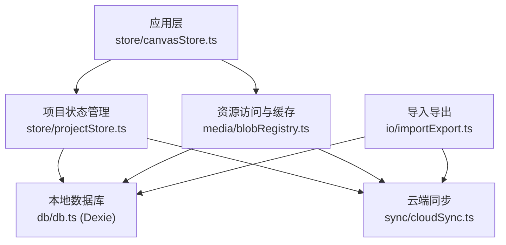
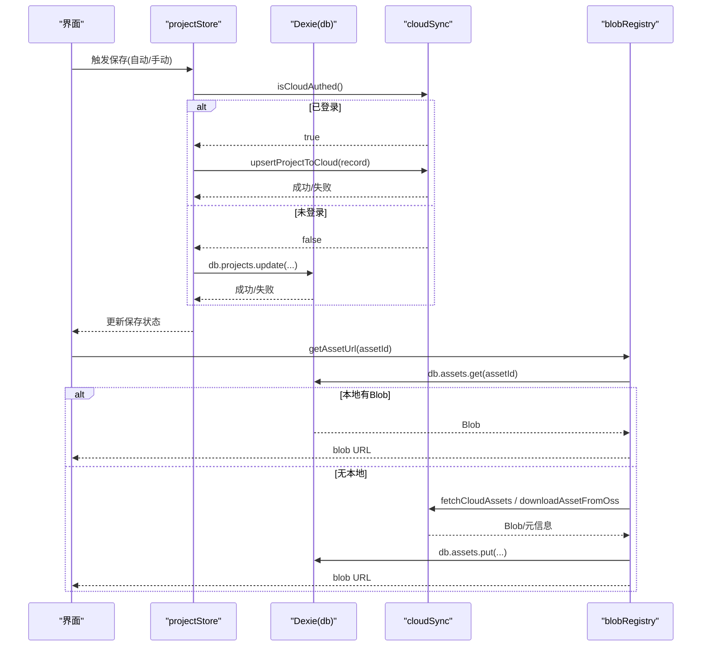
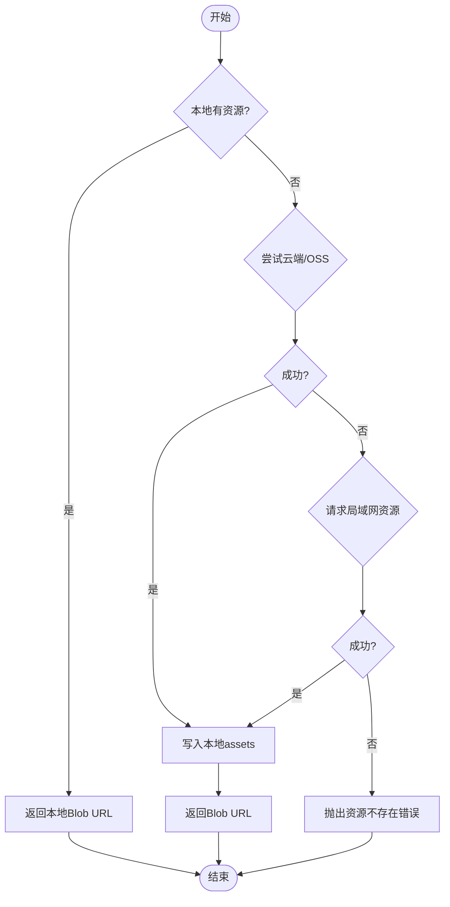
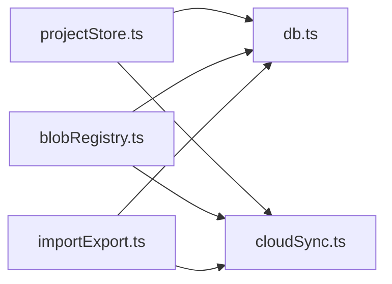

# IndexedDB 存储

<cite>
**本文引用的文件**
- [src/db/db.ts](file://src/db/db.ts)
- [src/io/importExport.ts](file://src/io/importExport.ts)
- [src/store/projectStore.ts](file://src/store/projectStore.ts)
- [src/media/blobRegistry.ts](file://src/media/blobRegistry.ts)
- [src/sync/cloudSync.ts](file://src/sync/cloudSync.ts)
- [src/types.ts](file://src/types.ts)
</cite>

## 目录
1. [简介](#简介)
2. [项目结构](#项目结构)
3. [核心组件](#核心组件)
4. [架构总览](#架构总览)
5. [详细组件分析](#详细组件分析)
6. [依赖关系分析](#依赖关系分析)
7. [性能与优化](#性能与优化)
8. [故障排查指南](#故障排查指南)
9. [结论](#结论)
10. [附录：维护与监控最佳实践](#附录维护与监控最佳实践)

## 简介
本仓库使用 Dexie（IndexedDB 封装）实现本地持久化，主要承载两类数据：
- 项目元数据与画布图结构（节点、边、视口），用于“项目”的创建、加载、保存与列表同步。
- 媒体资源（图片、视频、音频、PDF、PSD、文本等）及其缩略图，作为“素材”被节点引用。

文档围绕以下目标展开：数据库结构设计（表结构、索引、类型映射）、CRUD 抽象与事务处理、错误重试机制、存储优化（压缩、分片、清理）、备份与恢复（导出/导入、完整性检查、灾难恢复）、以及数据库维护与监控的最佳实践。

## 项目结构
与 IndexedDB 直接相关的代码集中在以下模块：
- 数据库定义与基础能力：src/db/db.ts
- 项目状态与自动保存：src/store/projectStore.ts
- 导入导出与归档：src/io/importExport.ts
- 资源获取、缓存与缩略图生成：src/media/blobRegistry.ts
- 云端同步桥接（登录态下读写云端，未登录时仅本地）：src/sync/cloudSync.ts
- 类型定义（媒体种类、节点/边结构）：src/types.ts

图表来源
- [src/store/projectStore.ts:196-228](file://src/store/projectStore.ts#L196-L228)
- [src/db/db.ts:25-33](file://src/db/db.ts#L25-L33)
- [src/media/blobRegistry.ts:84-126](file://src/media/blobRegistry.ts#L84-L126)
- [src/sync/cloudSync.ts:148-164](file://src/sync/cloudSync.ts#L148-L164)
- [src/io/importExport.ts:35-78](file://src/io/importExport.ts#L35-L78)

章节来源
- [src/db/db.ts:25-33](file://src/db/db.ts#L25-L33)
- [src/store/projectStore.ts:196-228](file://src/store/projectStore.ts#L196-L228)
- [src/media/blobRegistry.ts:84-126](file://src/media/blobRegistry.ts#L84-L126)
- [src/sync/cloudSync.ts:148-164](file://src/sync/cloudSync.ts#L148-L164)
- [src/io/importExport.ts:35-78](file://src/io/importExport.ts#L35-L78)

## 核心组件
- 数据库实例与表结构
  - assets：存储媒体资源（id、name、mime、size、kind、blob、thumbnail、orphanedAt）。
  - projects：存储项目（id、name、createdAt、updatedAt、graph、viewport）。
  - 索引策略：assets 以 id 为主键，并建立 kind、name 索引；projects 以 id 为主键，并建立 updatedAt 索引。
- 项目 CRUD
  - 新建/重命名/保存：根据是否已登录云端，选择写入本地或云端；未登录时写本地 IndexedDB。
  - 列表与加载：未登录时从本地读取并按更新时间排序；登录后从云端读取。
- 资源访问
  - 优先本地 Blob URL，其次局域网 HTTP 流式地址，最后回退到 OSS 下载并落库。
  - 缩略图：视频通过抓帧生成并缓存；支持并发控制与失败重试。
- 导入导出
  - 导出为 zip（包含 project.json 与 assets/*.bin/.thumb），版本兼容校验。
  - 导入时解析 zip，去重写入 assets，新建项目记录并加载。

章节来源
- [src/db/db.ts:5-33](file://src/db/db.ts#L5-L33)
- [src/store/projectStore.ts:149-228](file://src/store/projectStore.ts#L149-L228)
- [src/media/blobRegistry.ts:84-126](file://src/media/blobRegistry.ts#L84-L126)
- [src/io/importExport.ts:35-78](file://src/io/importExport.ts#L35-L78)

## 架构总览
下图展示了“项目保存”和“资源获取”的关键调用链，体现本地与云端的分流、事务边界与重试点。

图表来源
- [src/store/projectStore.ts:196-228](file://src/store/projectStore.ts#L196-L228)
- [src/sync/cloudSync.ts:121-131](file://src/sync/cloudSync.ts#L121-L131)
- [src/media/blobRegistry.ts:84-126](file://src/media/blobRegistry.ts#L84-L126)

## 详细组件分析

### 数据库结构与索引策略
- 表 assets
  - 字段：id、name、mime、size、kind、blob、thumbnail、orphanedAt
  - 主键：id
  - 索引：kind、name（便于按类型检索与名称搜索）
- 表 projects
  - 字段：id、name、createdAt、updatedAt、graph（nodes/edges）、viewport
  - 主键：id
  - 索引：updatedAt（用于列表排序）
- 类型映射
  - MediaKind 枚举映射到 kind 字段，统一描述资源类型。
  - graph 内聚 nodes/edges，保持画布结构的原子性。

章节来源
- [src/db/db.ts:5-33](file://src/db/db.ts#L5-L33)
- [src/types.ts:3-14](file://src/types.ts#L3-L14)

### 数据操作封装与事务处理
- 项目保存
  - 自动保存：监听画布变更，防抖后触发保存。
  - 事务语义：Dexie 内部保证单表操作的原子性；跨表（如同时更新项目与广播 LAN）在业务层顺序执行。
- 资源写入
  - 网络拉取成功后以 put 方式写入 assets，确保幂等覆盖。
  - 缩略图生成采用并发队列，避免过多视频 seek 导致浏览器连接池耗尽。
- 导入导出
  - 导出：收集节点引用的资产，打包为 zip 并下载。
  - 导入：解压校验格式与版本，去重写入 assets，新建项目记录并加载。

图表来源
- [src/media/blobRegistry.ts:84-126](file://src/media/blobRegistry.ts#L84-L126)

章节来源
- [src/store/projectStore.ts:46-67](file://src/store/projectStore.ts#L46-L67)
- [src/store/projectStore.ts:196-228](file://src/store/projectStore.ts#L196-L228)
- [src/io/importExport.ts:35-78](file://src/io/importExport.ts#L35-L78)
- [src/io/importExport.ts:111-201](file://src/io/importExport.ts#L111-L201)
- [src/media/blobRegistry.ts:84-126](file://src/media/blobRegistry.ts#L84-L126)

### 错误处理与重试机制
- 资源获取重试
  - 当本地无资源且云端不可用时，向局域网发起请求；若失败，最多重试一次，最终仍无记录则抛错。
- 缩略图抓取容错
  - 对黑帧进行多次 seek 重试；HTTP 抓帧失败时，一次性拉取全量资源作为兜底，再重新抓帧。
- 云端写入容错
  - 云端 upsert 失败仅记录警告，不阻断本地流程（未登录场景走本地）。

章节来源
- [src/media/blobRegistry.ts:107-126](file://src/media/blobRegistry.ts#L107-L126)
- [src/media/blobRegistry.ts:128-239](file://src/media/blobRegistry.ts#L128-L239)
- [src/sync/cloudSync.ts:121-131](file://src/sync/cloudSync.ts#L121-L131)

### 存储优化策略
- 数据压缩
  - 导出时使用 fflate 的 zipSync(level=6) 压缩项目与资源，减小体积。
- 分片传输与惰性拼接
  - 局域网传输将大文件拆分为分片，收到全部分片后再用 Blob(parts) 惰性拼接，降低内存峰值。
- 定期清理（垃圾回收）
  - gcAssets：遍历所有项目，标记被引用的资产；超过保留期的孤立资产将被删除。
- 流式播放与本地缓存取舍
  - 视频优先使用局域网 HTTP Range 流式地址，避免整份下载到 IndexedDB 造成压力；必要时才落库。

章节来源
- [src/io/importExport.ts:76-77](file://src/io/importExport.ts#L76-L77)
- [src/db/db.ts:46-68](file://src/db/db.ts#L46-L68)
- [src/media/blobRegistry.ts:84-104](file://src/media/blobRegistry.ts#L84-L104)

### 数据备份与恢复
- 导出
  - 导出当前项目的 project.json 与关联资源（含缩略图），生成 .sqcanvas 压缩包供下载。
- 导入
  - 校验格式与版本，解析 assets 与 project.json，去重写入本地 assets，新建项目并加载；若已登录，同步元数据至云端。
- 数据完整性检查
  - 导入时对 zip 解压、JSON 解析、格式与版本进行严格校验，失败即中止。
- 灾难恢复
  - 借助 .sqcanvas 文件可恢复项目与资源；gcAssets 可清理长期孤立资源释放空间。

章节来源
- [src/io/importExport.ts:35-78](file://src/io/importExport.ts#L35-L78)
- [src/io/importExport.ts:111-201](file://src/io/importExport.ts#L111-L201)
- [src/db/db.ts:46-68](file://src/db/db.ts#L46-L68)

## 依赖关系分析
- 模块耦合
  - projectStore 依赖 db 与 cloudSync，决定数据落盘位置。
  - blobRegistry 依赖 db、cloudSync 与 lanClient（局域网），负责资源获取与缓存。
  - importExport 依赖 db 与 cloudSync，完成离线归档与在线同步。
- 外部依赖
  - Dexie：IndexedDB 封装，提供表、索引、事务与查询 API。
  - fflate：zip 压缩/解压。
  - Supabase/OSS：云端元数据与对象存储（登录态启用）。

图表来源
- [src/store/projectStore.ts:196-228](file://src/store/projectStore.ts#L196-L228)
- [src/media/blobRegistry.ts:84-126](file://src/media/blobRegistry.ts#L84-L126)
- [src/io/importExport.ts:35-78](file://src/io/importExport.ts#L35-L78)
- [src/sync/cloudSync.ts:148-164](file://src/sync/cloudSync.ts#L148-L164)

## 性能与优化
- 索引设计
  - assets.kind/name 提升按类型与名称检索效率；projects.updatedAt 加速列表排序。
- 内存与 I/O
  - 大文件优先流式播放，减少 IndexedDB 写入与内存占用。
  - 缩略图抓取限制并发，避免阻塞播放器。
- 压缩与传输
  - 导出压缩级别 6，平衡体积与速度。
  - 局域网分片传输惰性拼接，降低峰值内存。
- 清理策略
  - gcAssets 基于引用关系与超时阈值清理孤立资源，防止数据库膨胀。

[本节为通用性能讨论，不直接分析具体文件]

## 故障排查指南
- 导入失败
  - 现象：提示“文件损坏或不是有效的 SuQCanvas 项目”、“缺少 project.json”、“project.json 解析失败”、“版本不支持”。
  - 排查：确认导出文件完整、版本兼容；检查网络与权限。
- 资源无法加载
  - 现象：getAssetBlob 抛出“资源不存在”。
  - 排查：检查本地是否有记录；确认云端/OSS/局域网可用；查看缩略图抓取是否因跨源失败。
- 自动保存失败
  - 现象：保存状态变为 error。
  - 排查：检查网络（云端）或磁盘（本地）异常；确认 Dexie 事务未阻塞。

章节来源
- [src/io/importExport.ts:111-131](file://src/io/importExport.ts#L111-L131)
- [src/media/blobRegistry.ts:107-126](file://src/media/blobRegistry.ts#L107-L126)
- [src/store/projectStore.ts:223-227](file://src/store/projectStore.ts#L223-L227)

## 结论
本项目以 Dexie 为核心，构建了清晰的项目与资源双表模型，结合云端/局域网的多源获取与缓存策略，实现了高性能、可扩展的本地存储方案。通过压缩导出、分片传输、垃圾回收与严格的导入校验，兼顾了可靠性与性能。未来可在索引细化、批量写入与监控指标方面继续优化。

[本节为总结性内容，不直接分析具体文件]

## 附录：维护与监控最佳实践
- 数据库维护
  - 定期运行 gcAssets，清理孤立资源，释放空间。
  - 关注 IndexedDB 配额与持久化存储请求结果，必要时引导用户授权。
- 监控建议
  - 统计导出/导入成功率、资源获取失败率、缩略图抓取耗时与失败次数。
  - 记录自动保存失败事件及原因，辅助定位问题。
- 备份策略
  - 鼓励用户定期导出 .sqcanvas 文件；在登录态下利用云端同步作为冗余备份。
- 兼容性
  - 导入时进行格式与版本校验，避免旧版本数据破坏新逻辑。

[本节为通用指导，不直接分析具体文件]