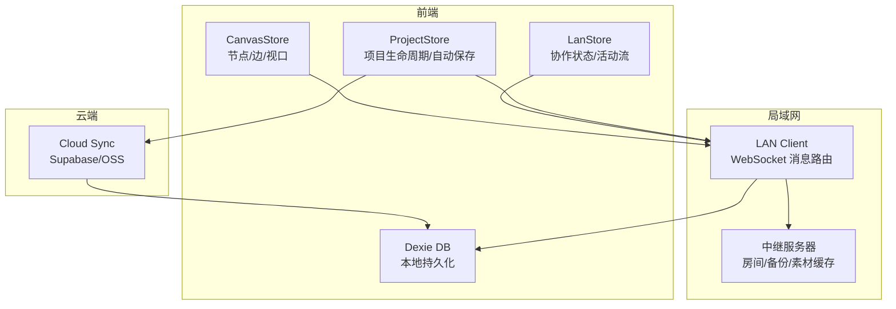
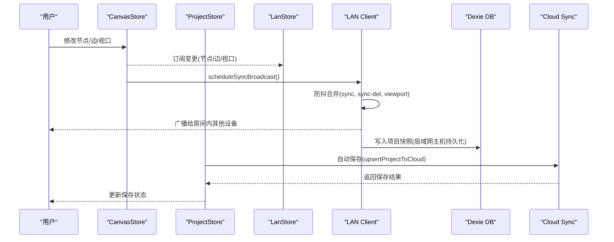
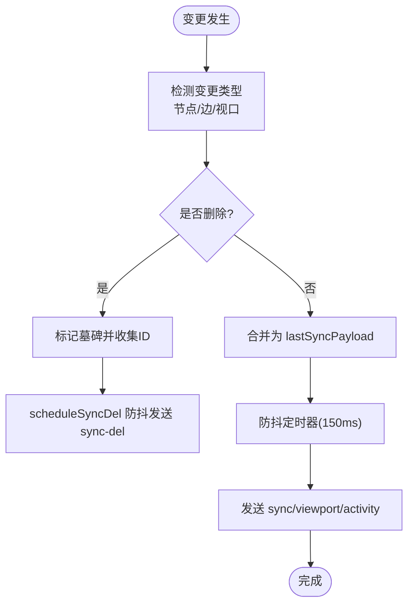
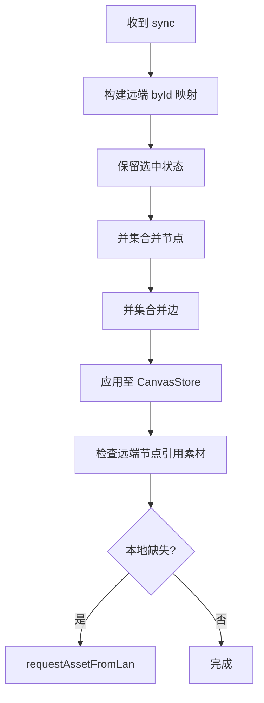
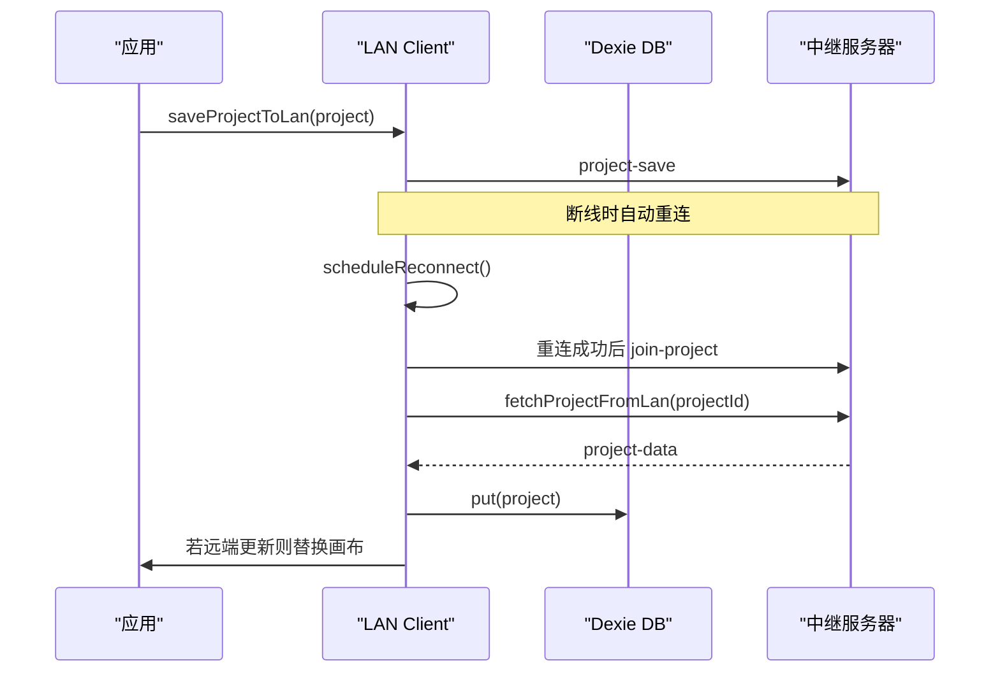
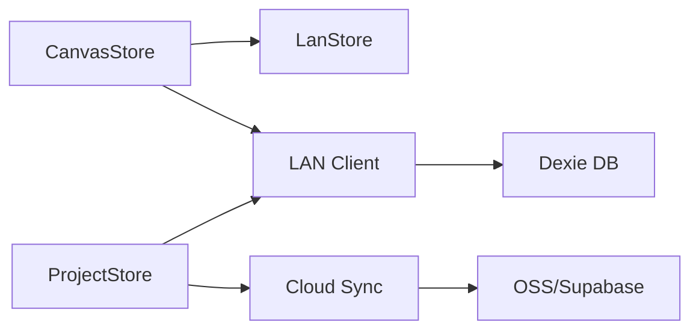

# 同步策略

<cite>
**本文引用的文件**
- [cloudSync.ts](file://src/sync/cloudSync.ts)
- [lanClient.ts](file://src/sync/lanClient.ts)
- [ossClient.ts](file://src/sync/ossClient.ts)
- [canvasStore.ts](file://src/store/canvasStore.ts)
- [projectStore.ts](file://src/store/projectStore.ts)
- [lanStore.ts](file://src/store/lanStore.ts)
- [db.ts](file://src/db/db.ts)
</cite>

## 目录
1. [简介](#简介)
2. [项目结构](#项目结构)
3. [核心组件](#核心组件)
4. [架构总览](#架构总览)
5. [详细组件分析](#详细组件分析)
6. [依赖关系分析](#依赖关系分析)
7. [性能考量](#性能考量)
8. [故障排查指南](#故障排查指南)
9. [结论](#结论)
10. [附录](#附录)

## 简介
本文件聚焦于画布协作中的“状态同步”策略与实现，覆盖以下目标：
- 同步触发机制：操作监听、变更检测、批量同步。
- 冲突解决算法：基于并集合并的乐观式合并、墓碑删除、时间戳比较的版本控制思路。
- 离线支持：本地持久化、断线重连、素材分片续传、延迟执行与一致性保证。
- 网络异常处理：连接超时、重试机制、降级策略（云端/局域网/本地）。
- 同步性能优化与调试工具使用建议。

## 项目结构
与同步相关的关键模块分布如下：
- 存储层：IndexedDB 封装（项目、素材）用于离线缓存与持久化。
- 状态层：Zustand store 管理画布节点/边/视口、局域网协作状态。
- 同步层：局域网 WebSocket 客户端（实时同步、素材传输）、云端接口（Supabase/OSS）。
- 项目管理：自动保存、加载、重命名、云端/局域网双通道落盘。

图表来源
- [canvasStore.ts:118-399](file://src/store/canvasStore.ts#L118-L399)
- [lanStore.ts:91-160](file://src/store/lanStore.ts#L91-L160)
- [projectStore.ts:69-229](file://src/store/projectStore.ts#L69-L229)
- [lanClient.ts:254-362](file://src/sync/lanClient.ts#L254-L362)
- [cloudSync.ts:121-165](file://src/sync/cloudSync.ts#L121-L165)
- [db.ts:25-33](file://src/db/db.ts#L25-L33)

章节来源
- [canvasStore.ts:118-399](file://src/store/canvasStore.ts#L118-L399)
- [lanStore.ts:91-160](file://src/store/lanStore.ts#L91-L160)
- [projectStore.ts:69-229](file://src/store/projectStore.ts#L69-L229)
- [lanClient.ts:254-362](file://src/sync/lanClient.ts#L254-L362)
- [cloudSync.ts:121-165](file://src/sync/cloudSync.ts#L121-L165)
- [db.ts:25-33](file://src/db/db.ts#L25-L33)

## 核心组件
- 画布状态与历史：提供节点/边的增删改、撤销/重做、对齐、层级等能力，并通过订阅机制感知变更。
- 局域网协作：WebSocket 消息路由、房间级同步、光标/编辑态广播、活动流聚合、素材分片传输、断线重连。
- 云端同步：登录态判断、项目列表/详情读写、素材元数据 upsert、OSS 上传下载。
- 项目存储：自动保存、加载、重命名；根据登录态选择云端或本地存储；与局域网主机保持共享项目列表一致。
- 本地数据库：项目与素材的持久化、孤儿素材回收。

章节来源
- [canvasStore.ts:118-399](file://src/store/canvasStore.ts#L118-L399)
- [lanClient.ts:409-642](file://src/sync/lanClient.ts#L409-L642)
- [cloudSync.ts:18-165](file://src/sync/cloudSync.ts#L18-L165)
- [projectStore.ts:69-229](file://src/store/projectStore.ts#L69-L229)
- [db.ts:25-69](file://src/db/db.ts#L25-L69)

## 架构总览
下图展示从用户操作到多端同步的端到端流程，包括局域网与云端两条路径。

图表来源
- [canvasStore.ts:718-756](file://src/store/canvasStore.ts#L718-L756)
- [lanClient.ts:655-716](file://src/sync/lanClient.ts#L655-L716)
- [projectStore.ts:46-67](file://src/store/projectStore.ts#L46-L67)
- [projectStore.ts:196-229](file://src/store/projectStore.ts#L196-L229)
- [cloudSync.ts:121-165](file://src/sync/cloudSync.ts#L121-L165)

## 详细组件分析

### 同步触发机制：操作监听、变更检测、批量同步
- 操作监听
  - CanvasStore 通过 onNodesChange/onEdgesChange/onConnect 等入口统一处理变更，并在删除时立即落历史快照，避免撤销丢失。
  - initLanSync 订阅 CanvasStore 变更，计算新增/删除节点与边，触发删除传播与同步广播。
- 变更检测
  - 对比前后 nodes/edges 数组长度与内容，识别 create/delete/move/edit/change 等操作类型，生成活动流。
  - 视口变化单独节流广播，避免频繁刷新。
- 批量同步
  - 使用定时器对 sync、viewport、activity、sync-del 进行防抖合并，降低网络压力。
  - 删除采用显式 sync-del 消息，配合墓碑机制防止晚到旧快照复活已删除项。

图表来源
- [lanClient.ts:655-716](file://src/sync/lanClient.ts#L655-L716)
- [lanClient.ts:718-756](file://src/sync/lanClient.ts#L718-L756)
- [lanClient.ts:96-117](file://src/sync/lanClient.ts#L96-L117)

章节来源
- [canvasStore.ts:126-158](file://src/store/canvasStore.ts#L126-L158)
- [lanClient.ts:655-716](file://src/sync/lanClient.ts#L655-L716)
- [lanClient.ts:718-756](file://src/sync/lanClient.ts#L718-L756)
- [lanClient.ts:96-117](file://src/sync/lanClient.ts#L96-L117)

### 冲突解决算法：乐观锁、版本号控制、合并策略
- 乐观合并（并集合并）
  - 收到远端 sync 后，按 id 并集合并节点与边：远端同 id 覆盖本地字段，本地独有保留；保留选中状态。
  - 删除不通过快照隐式表达，而是通过 sync-del 显式传播，避免并发导入导致的误删。
- 版本控制
  - 项目记录包含 updatedAt 时间戳；接收 project-data 时仅当远端更新时间不小于本地时才整幅替换，从而保护本地离线编辑不被覆盖。
- 墓碑机制
  - 删除后立即在本地与远端都打墓碑，窗口期内忽略晚到的旧快照，防止“复活”。

图表来源
- [lanClient.ts:527-577](file://src/sync/lanClient.ts#L527-L577)
- [lanClient.ts:454-493](file://src/sync/lanClient.ts#L454-L493)
- [lanClient.ts:70-94](file://src/sync/lanClient.ts#L70-L94)

章节来源
- [lanClient.ts:527-577](file://src/sync/lanClient.ts#L527-L577)
- [lanClient.ts:454-493](file://src/sync/lanClient.ts#L454-L493)
- [lanClient.ts:70-94](file://src/sync/lanClient.ts#L70-L94)

### 离线支持：操作队列、延迟执行、状态一致性保证
- 本地持久化
  - 所有项目与素材均落 Dexie，确保页面刷新后可恢复。
  - 自动保存：CanvasStore 变更触发延时保存，减少 IO 频率。
- 断线重连与续传
  - 断线后指数退避自动重连；素材传输支持空闲超时与断点续传，重连后跳过已收分片继续。
- 一致性保证
  - 项目数据拉取时比较 updatedAt，仅当远端更新才覆盖本地，避免覆盖离线编辑。
  - 删除通过 sync-del + 墓碑保证最终一致性。

图表来源
- [lanClient.ts:119-152](file://src/sync/lanClient.ts#L119-L152)
- [lanClient.ts:823-845](file://src/sync/lanClient.ts#L823-L845)
- [projectStore.ts:46-67](file://src/store/projectStore.ts#L46-L67)
- [projectStore.ts:196-229](file://src/store/projectStore.ts#L196-L229)

章节来源
- [lanClient.ts:119-152](file://src/sync/lanClient.ts#L119-L152)
- [lanClient.ts:823-845](file://src/sync/lanClient.ts#L823-L845)
- [projectStore.ts:46-67](file://src/store/projectStore.ts#L46-L67)
- [projectStore.ts:196-229](file://src/store/projectStore.ts#L196-L229)

### 网络异常处理：连接超时、重试机制、降级策略
- 连接超时与重试
  - 项目数据/备份列表请求设置 8s 超时；失败返回空结果，避免阻塞 UI。
  - 素材传输使用空闲超时（长时间无分片判定失败），并周期性重发请求以等待服务器缓存就绪。
- 降级策略
  - 未登录云端账号时，项目列表与加载仅走本地；登录后仅走云端。
  - 视频等大素材优先走 HTTP Range 流式拉取，避免 WebSocket 全量传输带来的带宽压力。
- 错误提示
  - 连接失败、地址无效、HTTPS/WSS 混合内容拦截等场景均有明确提示。

章节来源
- [lanClient.ts:823-845](file://src/sync/lanClient.ts#L823-L845)
- [lanClient.ts:1054-1089](file://src/sync/lanClient.ts#L1054-L1089)
- [cloudSync.ts:148-165](file://src/sync/cloudSync.ts#L148-L165)
- [lanClient.ts:254-362](file://src/sync/lanClient.ts#L254-L362)

### 素材传输与缓存
- 分片传输
  - 大文件按固定大小分片 base64 传输，每若干块让出主线程避免卡顿。
  - 封面先于整份文件发送，提升首帧体验。
- 流式拉取
  - 视频素材可由服务器提供 HTTP Range 地址，播放器直接边下边播，不再整份下载。
- 本地缓存
  - 素材与缩略图写入 Dexie，供后续快速访问。

章节来源
- [lanClient.ts:1023-1052](file://src/sync/lanClient.ts#L1023-L1052)
- [lanClient.ts:1091-1181](file://src/sync/lanClient.ts#L1091-L1181)
- [lanClient.ts:947-972](file://src/sync/lanClient.ts#L947-L972)
- [ossClient.ts:22-63](file://src/sync/ossClient.ts#L22-L63)

### 云端同步与项目列表
- 登录态驱动的数据源切换
  - 未登录：项目列表与加载仅来自本地；登录后仅来自云端。
- 项目 upsert/删除/重命名
  - 云端表 projects/assets 的 upsert/delete/update 操作，失败时记录警告。
- 最佳加载策略
  - loadProjectBest 根据登录态选择云端或本地读取。

章节来源
- [cloudSync.ts:18-165](file://src/sync/cloudSync.ts#L18-L165)

## 依赖关系分析
- CanvasStore 依赖 LanStore 获取协作上下文（selfId/name），并触发 LAN Client 的同步广播。
- ProjectStore 依赖 CloudSync 与 LAN Client，根据登录态决定存储后端，并维护自动保存。
- LAN Client 依赖 Dexie 进行项目/素材持久化，同时向中继服务器发送/接收消息。
- CloudSync 依赖 Supabase/OSS 客户端进行云端读写。

图表来源
- [canvasStore.ts:118-399](file://src/store/canvasStore.ts#L118-L399)
- [projectStore.ts:69-229](file://src/store/projectStore.ts#L69-L229)
- [lanClient.ts:254-362](file://src/sync/lanClient.ts#L254-L362)
- [cloudSync.ts:121-165](file://src/sync/cloudSync.ts#L121-L165)
- [db.ts:25-33](file://src/db/db.ts#L25-L33)

章节来源
- [canvasStore.ts:118-399](file://src/store/canvasStore.ts#L118-L399)
- [projectStore.ts:69-229](file://src/store/projectStore.ts#L69-L229)
- [lanClient.ts:254-362](file://src/sync/lanClient.ts#L254-L362)
- [cloudSync.ts:121-165](file://src/sync/cloudSync.ts#L121-L165)
- [db.ts:25-33](file://src/db/db.ts#L25-L33)

## 性能考量
- 防抖与批处理
  - 画布同步 150ms 防抖；活动流 350ms 合并；删除 80ms 合并；视口 100ms 防抖。
- 内存与吞吐
  - 素材分片解码为独立字节块，避免拼接整个 base64；每 8 块让出主线程，避免长任务阻塞。
- 网络优化
  - 视频优先 HTTP Range 流式拉取；封面先行；同一素材只响应一次，避免重复流。
- 存储优化
  - 自动保存间隔 500ms；历史快照限制 50 条；孤儿素材定期回收。

[本节为通用性能讨论，无需特定文件来源]

## 故障排查指南
- 无法连接中继
  - 检查地址解析与 HTTPS/WSS 要求；确认反向代理配置正确。
  - 查看状态栏提示与 toast 信息。
- 项目不同步
  - 确认已加入项目房间；检查 project-data 请求是否超时；核对 updatedAt 比较逻辑。
- 素材传输失败
  - 关注空闲超时与重试；确认服务器是否提供 asset-http；检查本地是否有重复请求导致多路覆盖。
- 删除未生效
  - 检查 sync-del 是否发出；确认墓碑窗口期是否过期；验证远端是否收到删除。

章节来源
- [lanClient.ts:254-362](file://src/sync/lanClient.ts#L254-L362)
- [lanClient.ts:823-845](file://src/sync/lanClient.ts#L823-L845)
- [lanClient.ts:1054-1089](file://src/sync/lanClient.ts#L1054-L1089)
- [lanClient.ts:578-598](file://src/sync/lanClient.ts#L578-L598)

## 结论
该方案通过“并集合并 + 显式删除 + 时间戳比较”的组合实现了高可用的协作同步：
- 乐观合并避免并发冲突导致的覆盖问题；
- 显式删除与墓碑机制保障最终一致性；
- 断线重连与素材续传提升鲁棒性；
- 云端/局域网/本地三层存储按需切换，兼顾在线与离线体验。
建议在大规模协作场景中进一步引入服务端权威版本（如 CRDT/OT）以增强强一致性，但当前实现已在浏览器环境下提供了良好的可用性与性能平衡。

[本节为总结性内容，无需特定文件来源]

## 附录
- 关键 API 与调用路径参考
  - 初始化与自动保存：[projectStore.ts:46-67](file://src/store/projectStore.ts#L46-L67)
  - 保存与加载：[projectStore.ts:119-229](file://src/store/projectStore.ts#L119-L229)
  - 画布同步广播：[lanClient.ts:655-716](file://src/sync/lanClient.ts#L655-L716)
  - 远端合并与删除：[lanClient.ts:527-598](file://src/sync/lanClient.ts#L527-L598)
  - 素材传输与续传：[lanClient.ts:1023-1181](file://src/sync/lanClient.ts#L1023-L1181)
  - 云端项目读写：[cloudSync.ts:121-165](file://src/sync/cloudSync.ts#L121-L165)
  - 本地数据库模型：[db.ts:25-69](file://src/db/db.ts#L25-L69)