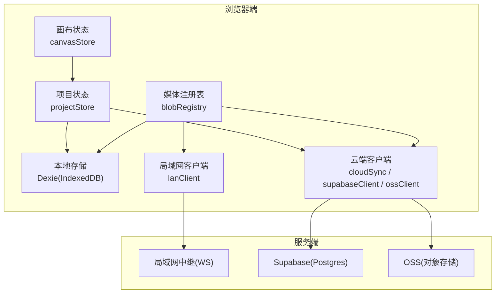
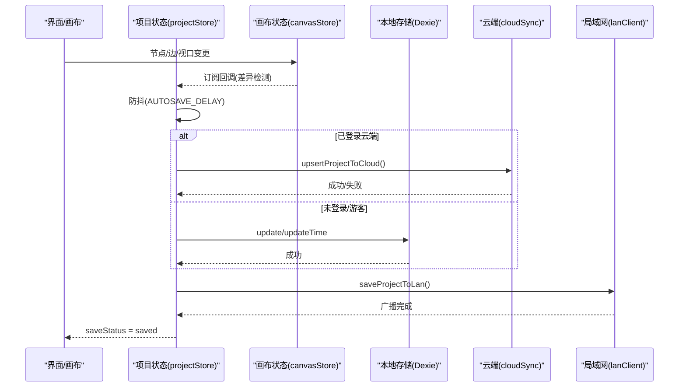
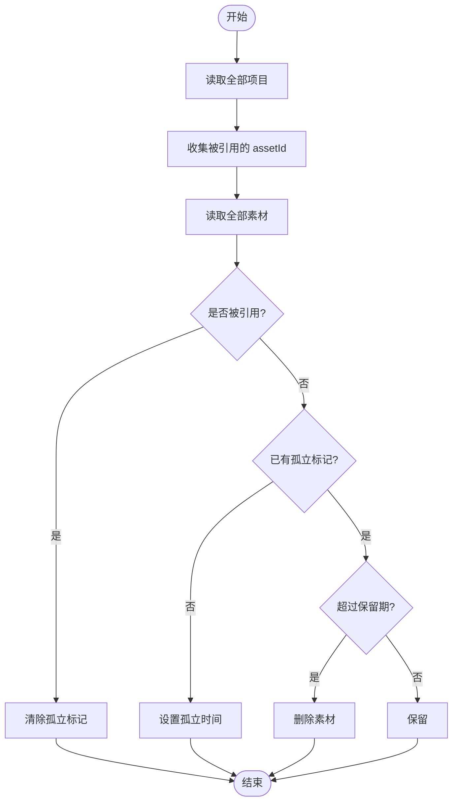
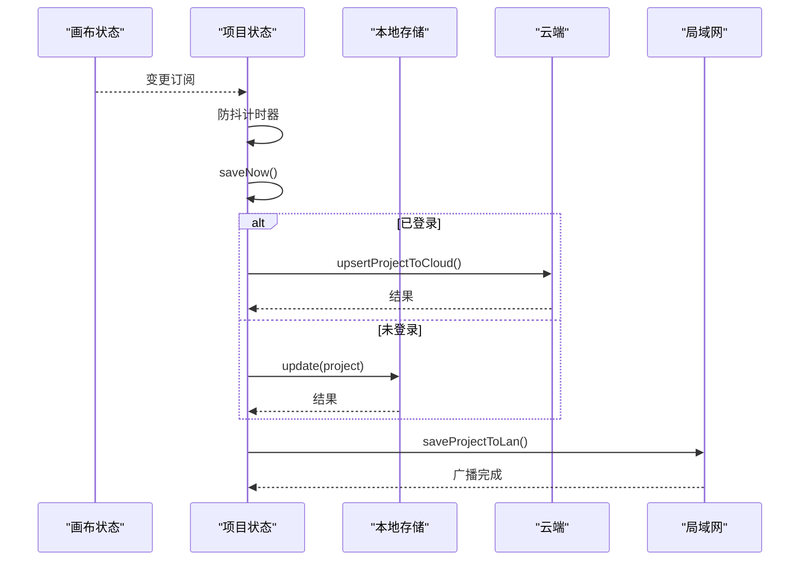
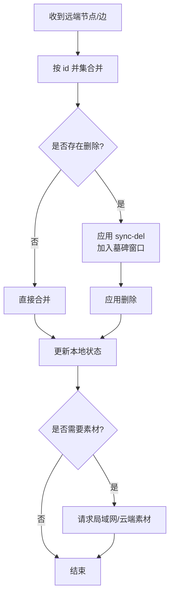
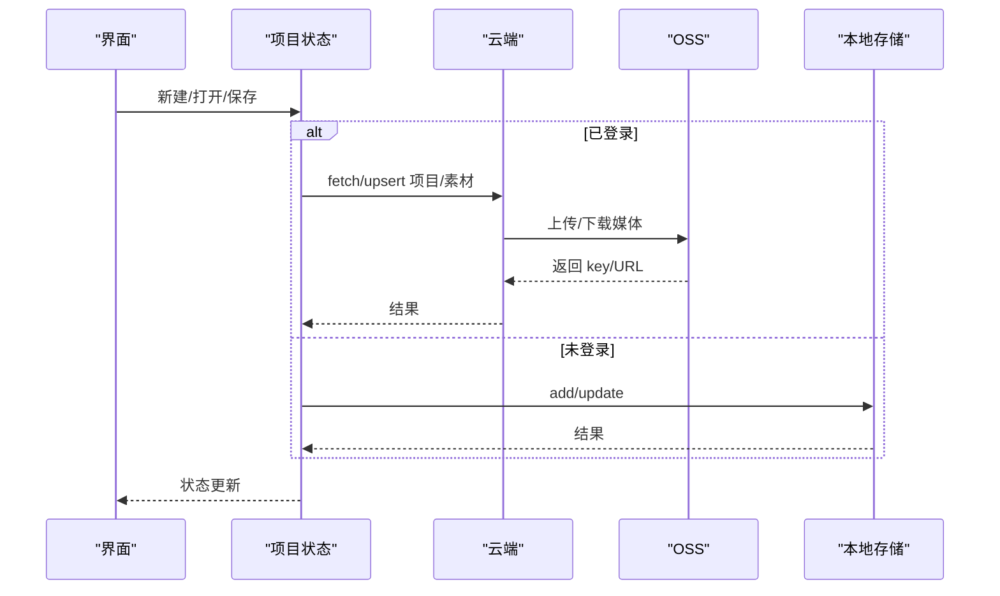
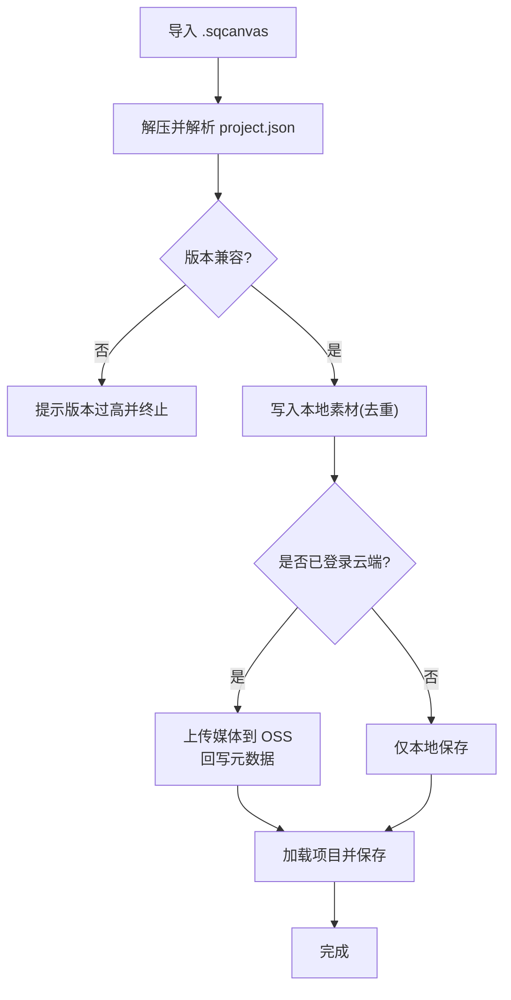
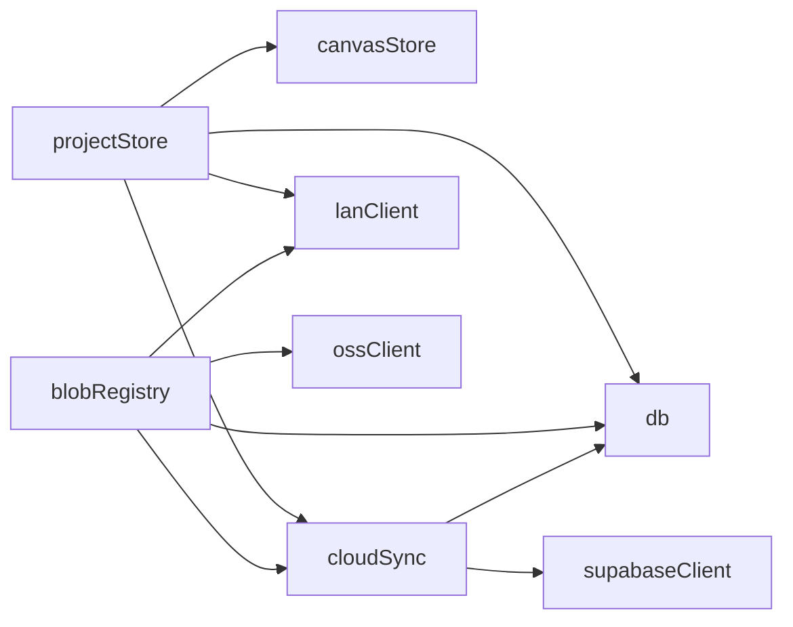

# 状态持久化与同步

<cite>
**本文引用的文件**
- [src/db/db.ts](file://src/db/db.ts)
- [src/store/projectStore.ts](file://src/store/projectStore.ts)
- [src/sync/cloudSync.ts](file://src/sync/cloudSync.ts)
- [src/sync/ossClient.ts](file://src/sync/ossClient.ts)
- [src/sync/ossConfig.ts](file://src/sync/ossConfig.ts)
- [src/sync/supabaseClient.ts](file://src/sync/supabaseClient.ts)
- [src/sync/lanClient.ts](file://src/sync/lanClient.ts)
- [src/media/blobRegistry.ts](file://src/media/blobRegistry.ts)
- [src/io/importExport.ts](file://src/io/importExport.ts)
- [supabase/schema.sql](file://supabase/schema.sql)
- [README.md](file://README.md)
</cite>

## 目录
1. [简介](#简介)
2. [项目结构](#项目结构)
3. [核心组件](#核心组件)
4. [架构总览](#架构总览)
5. [详细组件分析](#详细组件分析)
6. [依赖关系分析](#依赖关系分析)
7. [性能考量](#性能考量)
8. [故障排除指南](#故障排除指南)
9. [结论](#结论)
10. [附录：配置选项](#附录：配置选项)

## 简介
本文件面向 SuQCanvas 的状态持久化与同步机制，覆盖 IndexedDB 存储策略、自动/手动保存与增量更新、离线支持（本地缓存、操作队列、冲突解决）、云端同步（实时/批量/断线重连）以及数据迁移方案。文档同时提供可视化架构图与流程图，帮助读者快速理解并排障。

## 项目结构
SuQCanvas 的持久化与同步由以下模块协作完成：
- 本地存储：Dexie + IndexedDB（项目与素材）
- 画布状态：Zustand 管理节点、边、视口与历史
- 局域网协作：WebSocket 中继，房间级同步、分片传输、断线重连
- 云端同步：Supabase 元数据 + OSS 媒体对象
- 导入导出：ZIP 打包/解压，版本兼容检查

图表来源
- [src/store/projectStore.ts:46-67](file://src/store/projectStore.ts#L46-L67)
- [src/sync/lanClient.ts:254-362](file://src/sync/lanClient.ts#L254-L362)
- [src/sync/cloudSync.ts:121-155](file://src/sync/cloudSync.ts#L121-L155)
- [src/media/blobRegistry.ts:84-126](file://src/media/blobRegistry.ts#L84-L126)

章节来源
- [README.md:21-25](file://README.md#L21-L25)
- [src/db/db.ts:25-33](file://src/db/db.ts#L25-L33)

## 核心组件
- 本地数据库模型与索引
  - 项目记录：id、name、createdAt、updatedAt、graph(nodes/edges)、viewport
  - 素材记录：id、name、mime、size、kind、blob、thumbnail、orphanedAt
  - 索引：assets(id, kind, name)，projects(id, updatedAt)
- 自动保存与手动保存
  - 自动保存：监听画布变化，防抖后写入本地或云端
  - 手动保存：显式触发，优先云端（已登录）否则本地
- 局域网协作
  - 房间级同步：节点/边按 id 并集合并，删除通过显式消息传播
  - 大文件分片传输：base64 对齐分片、空闲超时、断点续传
  - 断线重连：指数退避、自动恢复
- 云端同步
  - 项目元数据：Supabase projects/assets 表 upsert
  - 媒体文件：阿里云 OSS 上传/下载/签名 URL
  - 列表/加载：登录后仅云端，游客仅本地
- 导入导出与迁移
  - .sqcanvas ZIP 包含 project.json 与 assets/*.bin/.thumb
  - 版本检查与兼容处理；导入时落库并可选上传云端

章节来源
- [src/db/db.ts:5-33](file://src/db/db.ts#L5-L33)
- [src/store/projectStore.ts:46-67](file://src/store/projectStore.ts#L46-L67)
- [src/sync/lanClient.ts:10-13](file://src/sync/lanClient.ts#L10-L13)
- [src/sync/cloudSync.ts:121-155](file://src/sync/cloudSync.ts#L121-L155)
- [src/io/importExport.ts:13-14](file://src/io/importExport.ts#L13-L14)

## 架构总览
下图展示“保存”主流程：用户编辑 → 自动保存调度 → 选择目标存储（云端/本地）→ 局域网广播 → 持久化完成。

图表来源
- [src/store/projectStore.ts:46-67](file://src/store/projectStore.ts#L46-L67)
- [src/store/projectStore.ts:196-228](file://src/store/projectStore.ts#L196-L228)
- [src/sync/cloudSync.ts:121-131](file://src/sync/cloudSync.ts#L121-L131)
- [src/sync/lanClient.ts:718-756](file://src/sync/lanClient.ts#L718-L756)

## 详细组件分析

### 本地存储：数据结构与索引优化
- 数据结构
  - ProjectRecord：id、name、时间戳、graph(nodes/edges)、viewport
  - AssetRecord：id、name、mime、size、kind、blob、thumbnail、orphanedAt
- 索引设计
  - assets: id(主键), kind, name
  - projects: id(主键), updatedAt
- 垃圾回收
  - 扫描所有项目的节点引用，标记孤立素材，超过保留期删除

图表来源
- [src/db/db.ts:46-68](file://src/db/db.ts#L46-L68)

章节来源
- [src/db/db.ts:5-33](file://src/db/db.ts#L5-L33)
- [src/db/db.ts:46-68](file://src/db/db.ts#L46-L68)

### 自动保存、手动保存与增量更新
- 自动保存
  - 订阅 canvasStore 变化，比较 nodes/edges/viewport，防抖后调用 saveNow
- 手动保存
  - 根据登录态选择云端 or 本地，成功后广播到局域网
- 增量更新
  - 局域网侧对节点/边采用 id 并集合并，删除通过 sync-del 显式传播，避免整幅快照覆盖导致误删

图表来源
- [src/store/projectStore.ts:46-67](file://src/store/projectStore.ts#L46-L67)
- [src/store/projectStore.ts:196-228](file://src/store/projectStore.ts#L196-L228)
- [src/sync/lanClient.ts:718-756](file://src/sync/lanClient.ts#L718-L756)

章节来源
- [src/store/projectStore.ts:46-67](file://src/store/projectStore.ts#L46-L67)
- [src/store/projectStore.ts:196-228](file://src/store/projectStore.ts#L196-L228)

### 离线支持：本地缓存、操作队列、冲突解决
- 本地缓存
  - 媒体资源优先使用本地 IndexedDB Blob；缺失时尝试云端/OSS 拉取并回填
  - 视频封面可走局域网 HTTP 流式地址抓取，避免整份下载
- 操作队列
  - 局域网分片接收：按 assetId 维护 pendingAssets，空闲超时判定失败，支持断点续传
  - 删除合并：批量删除延迟发送，减少网络抖动影响
- 冲突解决
  - 节点/边按 id 并集合并；删除通过墓碑(Tombstone)窗口防止晚到旧快照复活
  - 项目数据以 updatedAt 为准进行整幅替换，本地有更新的离线编辑不被覆盖

图表来源
- [src/sync/lanClient.ts:527-577](file://src/sync/lanClient.ts#L527-L577)
- [src/sync/lanClient.ts:70-117](file://src/sync/lanClient.ts#L70-L117)
- [src/media/blobRegistry.ts:84-126](file://src/media/blobRegistry.ts#L84-L126)

章节来源
- [src/sync/lanClient.ts:70-117](file://src/sync/lanClient.ts#L70-L117)
- [src/sync/lanClient.ts:527-577](file://src/sync/lanClient.ts#L527-L577)
- [src/media/blobRegistry.ts:84-126](file://src/media/blobRegistry.ts#L84-L126)

### 云端同步：实时、批量与断线重连
- 实时同步
  - 项目列表/单项目：登录后仅从云端读取；未登录仅本地
  - 素材元数据：upsert 到 Supabase assets 表
- 批量同步
  - 导入项目时批量上传媒体到 OSS，并回写元数据
- 断线重连
  - 云端连接基于 Supabase 客户端；构建时注入环境变量，未配置则禁用
  - 错误时降级为本地模式，不影响基本使用

图表来源
- [src/sync/cloudSync.ts:101-165](file://src/sync/cloudSync.ts#L101-L165)
- [src/sync/ossClient.ts:22-63](file://src/sync/ossClient.ts#L22-L63)
- [src/sync/supabaseClient.ts:1-18](file://src/sync/supabaseClient.ts#L1-L18)

章节来源
- [src/sync/cloudSync.ts:101-165](file://src/sync/cloudSync.ts#L101-L165)
- [src/sync/ossClient.ts:22-63](file://src/sync/ossClient.ts#L22-L63)
- [src/sync/supabaseClient.ts:1-18](file://src/sync/supabaseClient.ts#L1-L18)

### 数据迁移：版本升级、格式兼容、回滚
- 版本控制
  - 导出格式固定 format/version；导入时校验版本，拒绝高于当前支持的版本
- 格式兼容
  - 导入时若本地不存在对应素材则写入 IndexedDB；若已存在则跳过
  - 云端导入时上传媒体至 OSS，并回写元数据
- 回滚机制
  - 局域网主机提供已删除项目的 24 小时备份；可在首页恢复
  - 本地素材遵循相同保留策略，孤立超期清理

图表来源
- [src/io/importExport.ts:13-14](file://src/io/importExport.ts#L13-L14)
- [src/io/importExport.ts:111-203](file://src/io/importExport.ts#L111-L203)
- [README.md:84-90](file://README.md#L84-L90)

章节来源
- [src/io/importExport.ts:111-203](file://src/io/importExport.ts#L111-L203)
- [README.md:84-90](file://README.md#L84-L90)

## 依赖关系分析
- 模块耦合
  - projectStore 依赖 canvasStore、cloudSync、lanClient、db
  - blobRegistry 依赖 db、cloudSync、ossClient、lanClient
  - cloudSync 依赖 supabaseClient、db
  - lanClient 依赖 db、canvasStore、lanStore
- 外部依赖
  - Supabase 客户端仅在在线版构建中引入
  - OSS 客户端在在线版动态导入，局域网版折叠为空实现

图表来源
- [src/store/projectStore.ts:1-17](file://src/store/projectStore.ts#L1-L17)
- [src/media/blobRegistry.ts:1-10](file://src/media/blobRegistry.ts#L1-L10)
- [src/sync/cloudSync.ts:1-5](file://src/sync/cloudSync.ts#L1-L5)
- [src/sync/ossClient.ts:1-6](file://src/sync/ossClient.ts#L1-L6)
- [src/sync/supabaseClient.ts:1-18](file://src/sync/supabaseClient.ts#L1-L18)

章节来源
- [src/store/projectStore.ts:1-17](file://src/store/projectStore.ts#L1-L17)
- [src/media/blobRegistry.ts:1-10](file://src/media/blobRegistry.ts#L1-L10)
- [src/sync/cloudSync.ts:1-5](file://src/sync/cloudSync.ts#L1-L5)
- [src/sync/ossClient.ts:1-6](file://src/sync/ossClient.ts#L1-L6)
- [src/sync/supabaseClient.ts:1-18](file://src/sync/supabaseClient.ts#L1-L18)

## 性能考量
- 自动保存防抖：500ms 节流，避免频繁 IO
- 局域网同步：150ms 合并广播，减少消息风暴
- 分片传输：256KB-1 对齐 base64，降低内存峰值
- 并发限制：视频封面抓帧最大并发 2，避免阻塞播放
- 索引优化：按 id、updatedAt、kind 建立索引，提升查询效率
- 垃圾回收：孤立素材 24 小时宽限期，避免误删

[本节为通用指导，不直接分析具体文件]

## 故障排除指南
- 无法连接局域网中继
  - 检查地址协议（HTTPS 页面必须 wss），确认反向代理配置
  - 查看 toast 提示与日志，必要时重置连接并重试
- 云端同步失败
  - 检查 Supabase 配置是否生效（IS_ONLINE_BUILD）
  - 检查 OSS 配置是否完整（region/bucket/accessKeyId/stsUrl）
  - 关注控制台警告信息，定位具体错误
- 素材无法加载
  - 优先本地 IndexedDB；若无则尝试云端/OSS 拉取
  - 视频封面抓取失败时，会尝试一次全量 blob 兜底
- 项目数据不同步
  - 确认处于同一项目房间
  - 检查是否有删除消息未及时到达（墓碑窗口）
  - 重新加入项目以触发对账

章节来源
- [src/sync/lanClient.ts:19-57](file://src/sync/lanClient.ts#L19-L57)
- [src/sync/supabaseClient.ts:1-18](file://src/sync/supabaseClient.ts#L1-L18)
- [src/sync/ossConfig.ts:1-20](file://src/sync/ossConfig.ts#L1-L20)
- [src/media/blobRegistry.ts:128-239](file://src/media/blobRegistry.ts#L128-L239)

## 结论
SuQCanvas 通过 Dexie + IndexedDB 提供可靠的本地持久化，结合局域网 WebSocket 与云端 Supabase/OSS 形成多端协同能力。自动保存与增量合并确保高效与一致性；分片传输与断线重连保障大文件与弱网场景体验；导入导出与备份恢复提供数据迁移与容灾能力。建议在生产环境合理配置云端与 OSS，并在局域网部署中做好反向代理与防火墙策略。

[本节为总结性内容，不直接分析具体文件]

## 附录：配置选项
- 构建与环境
  - VITE_BUILD_TARGET：online | lan（决定功能裁剪）
  - VITE_SUPABASE_URL / VITE_SUPABASE_ANON_KEY：云端服务接入
  - VITE_OSS_REGION / VITE_OSS_BUCKET / VITE_OSS_ACCESS_KEY_ID / VITE_OSS_STS_URL：OSS 接入
  - VITE_LAN_WS_URL：局域网中继地址（可选覆盖）
- 运行时行为
  - 自动保存间隔：500ms
  - 局域网同步广播：150ms 合并
  - 分片大小：262143 字节（256KB-1）
  - 封面抓帧并发：2
  - 孤立素材保留：24 小时
- 数据库与表结构
  - 本地：assets/projects 表及索引
  - 云端：projects/assets 表、行级安全策略、更新时间触发器

章节来源
- [src/sync/supabaseClient.ts:1-18](file://src/sync/supabaseClient.ts#L1-L18)
- [src/sync/ossConfig.ts:1-20](file://src/sync/ossConfig.ts#L1-L20)
- [src/sync/lanClient.ts:10-13](file://src/sync/lanClient.ts#L10-L13)
- [src/media/blobRegistry.ts:20-23](file://src/media/blobRegistry.ts#L20-L23)
- [src/db/db.ts:30-33](file://src/db/db.ts#L30-L33)
- [supabase/schema.sql:12-42](file://supabase/schema.sql#L12-L42)
- [supabase/schema.sql:44-77](file://supabase/schema.sql#L44-L77)