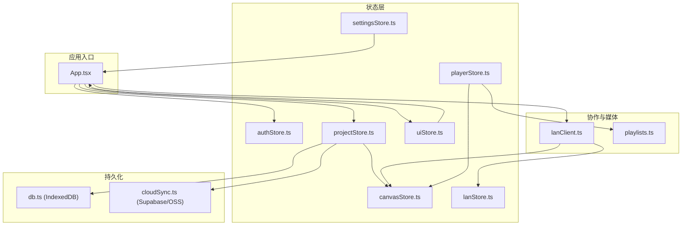
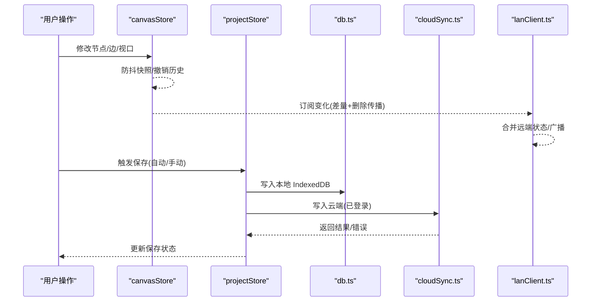
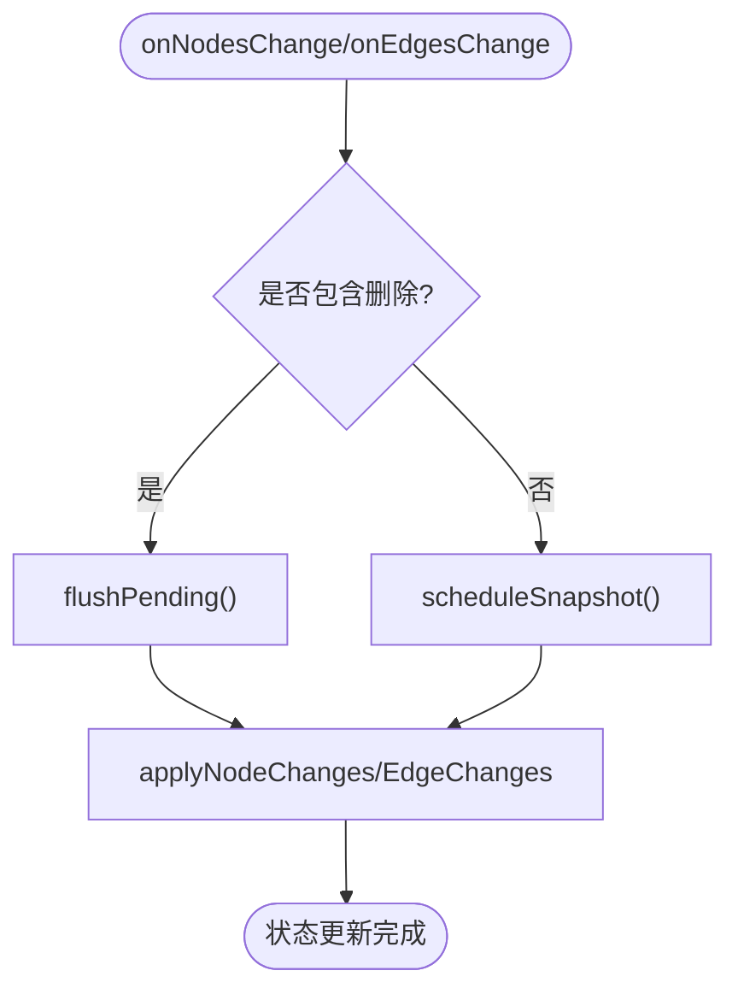
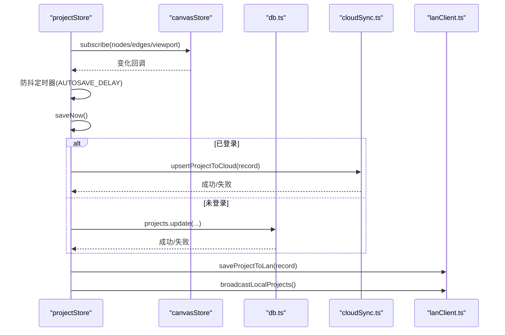
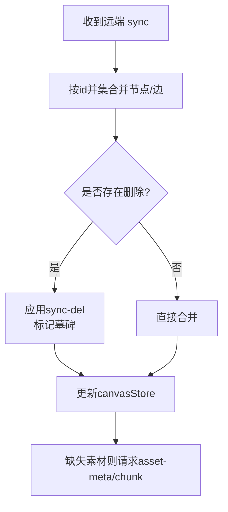
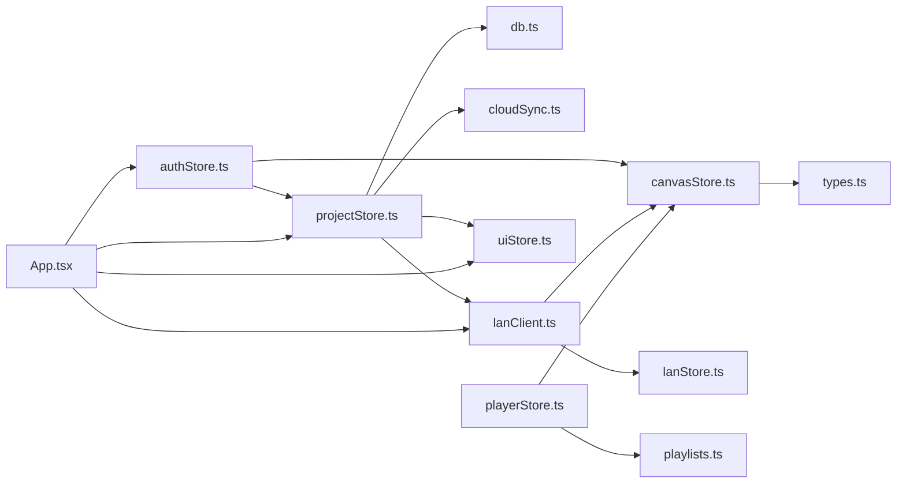
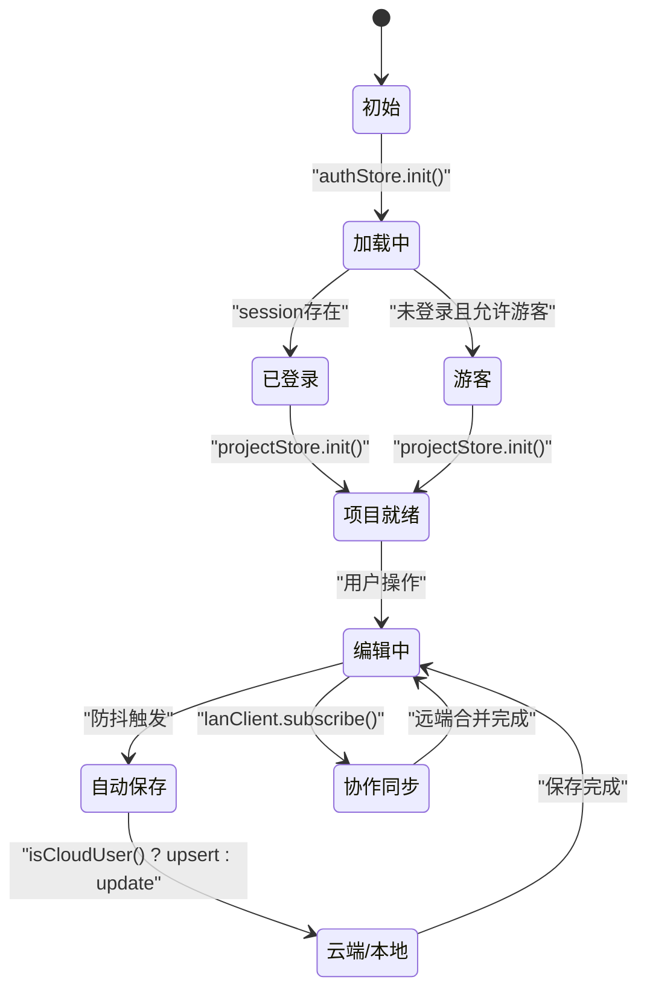

# 状态管理模式

<cite>
**本文引用的文件**
- [src/store/canvasStore.ts](file://src/store/canvasStore.ts)
- [src/store/projectStore.ts](file://src/store/projectStore.ts)
- [src/store/authStore.ts](file://src/store/authStore.ts)
- [src/store/uiStore.ts](file://src/store/uiStore.ts)
- [src/store/lanStore.ts](file://src/store/lanStore.ts)
- [src/store/playerStore.ts](file://src/store/playerStore.ts)
- [src/store/settingsStore.ts](file://src/store/settingsStore.ts)
- [src/db/db.ts](file://src/db/db.ts)
- [src/sync/cloudSync.ts](file://src/sync/cloudSync.ts)
- [src/sync/lanClient.ts](file://src/sync/lanClient.ts)
- [src/media/playlists.ts](file://src/media/playlists.ts)
- [src/types.ts](file://src/types.ts)
- [src/App.tsx](file://src/App.tsx)
</cite>

## 目录
1. [简介](#简介)
2. [项目结构](#项目结构)
3. [核心组件](#核心组件)
4. [架构总览](#架构总览)
5. [详细组件分析](#详细组件分析)
6. [依赖关系分析](#依赖关系分析)
7. [性能考量](#性能考量)
8. [故障排查指南](#故障排查指南)
9. [结论](#结论)
10. [附录](#附录)

## 简介
本文件系统性梳理 SuQCanvas 基于 Zustand 的状态管理模式，覆盖 Store 组织、状态切片职责、选择器使用模式、持久化与恢复机制、本地与远程同步策略（含离线支持与冲突解决），并给出状态变更生命周期图与最佳实践建议。目标是帮助开发者快速理解并高效扩展状态层。

## 项目结构
SuQCanvas 将状态按“领域切片”拆分到多个 Store：
- 画布状态：canvasStore（节点、边、视口、撤销历史、对齐/层级等）
- 项目状态：projectStore（项目加载/新建/重命名/保存、自动保存、云端或本地存储路由）
- 认证状态：authStore（登录态、游客模式、Supabase 监听）
- UI 状态：uiStore（Toast、导入队列、各类查看器开关、工具模式）
- 局域网协作：lanStore（用户列表、活动流、远端光标/编辑中、远端视口、项目元信息）
- 播放器状态：playerStore（全局音频引擎、播放顺序、队列）
- 设置状态：settingsStore（主题）

图表来源
- [src/App.tsx:19-38](file://src/App.tsx#L19-L38)
- [src/store/projectStore.ts:1-18](file://src/store/projectStore.ts#L1-L18)
- [src/store/canvasStore.ts:1-12](file://src/store/canvasStore.ts#L1-L12)
- [src/sync/lanClient.ts:1-8](file://src/sync/lanClient.ts#L1-L8)
- [src/db/db.ts:25-33](file://src/db/db.ts#L25-L33)
- [src/sync/cloudSync.ts:1-5](file://src/sync/cloudSync.ts#L1-L5)

章节来源
- [src/App.tsx:19-38](file://src/App.tsx#L19-L38)
- [src/store/projectStore.ts:1-18](file://src/store/projectStore.ts#L1-L18)
- [src/store/canvasStore.ts:1-12](file://src/store/canvasStore.ts#L1-L12)
- [src/sync/lanClient.ts:1-8](file://src/sync/lanClient.ts#L1-L8)
- [src/db/db.ts:25-33](file://src/db/db.ts#L25-L33)
- [src/sync/cloudSync.ts:1-5](file://src/sync/cloudSync.ts#L1-L5)

## 核心组件
- canvasStore：维护画布节点/边/视口、撤销/重做历史、复制粘贴、对齐、层级、资源清理；通过防抖快照合并减少历史膨胀。
- projectStore：负责项目生命周期（初始化、加载、新建、重命名、保存），根据登录态决定走云端或本地 IndexedDB，并触发局域网广播。
- authStore：管理 Supabase 会话、游客模式、登录/登出副作用（重置项目/画布状态）。
- uiStore：全局 UI 状态（消息提示、导入队列、PDF/图片/Markdown 查看器、播放器页面、工具模式）。
- lanStore：局域网协作状态（连接、用户、活动、远端光标/编辑中、远端视口、共享项目列表）。
- playerStore：全局音频引擎状态（当前曲目、播放进度、音量、模式、队列），与画布连线解析播放顺序。
- settingsStore：主题切换与持久化。

章节来源
- [src/store/canvasStore.ts:33-59](file://src/store/canvasStore.ts#L33-L59)
- [src/store/projectStore.ts:21-34](file://src/store/projectStore.ts#L21-L34)
- [src/store/authStore.ts:8-16](file://src/store/authStore.ts#L8-L16)
- [src/store/uiStore.ts:18-45](file://src/store/uiStore.ts#L18-L45)
- [src/store/lanStore.ts:53-89](file://src/store/lanStore.ts#L53-L89)
- [src/store/playerStore.ts:25-50](file://src/store/playerStore.ts#L25-L50)
- [src/store/settingsStore.ts:7-11](file://src/store/settingsStore.ts#L7-L11)

## 架构总览
状态管理采用“多 Store + 订阅联动”的架构：
- 各 Store 独立定义状态与动作，通过 create 创建 store 实例。
- 跨 Store 调用通过 useXxxStore.getState() 读取或 setState() 更新，避免循环依赖。
- 副作用集中在 Store 内部或专用模块（如 cloudSync、lanClient），保持 Store 纯度高。
- 数据持久化由 projectStore 统一协调：已登录用户仅写云端，游客/未登录仅写本地 IndexedDB。
- 局域网协作通过 lanClient 订阅 canvasStore 变化，进行差量同步与删除传播，并合并远端状态。

图表来源
- [src/store/canvasStore.ts:66-107](file://src/store/canvasStore.ts#L66-L107)
- [src/store/projectStore.ts:46-67](file://src/store/projectStore.ts#L46-L67)
- [src/store/projectStore.ts:196-228](file://src/store/projectStore.ts#L196-L228)
- [src/sync/cloudSync.ts:121-165](file://src/sync/cloudSync.ts#L121-L165)
- [src/sync/lanClient.ts:718-756](file://src/sync/lanClient.ts#L718-L756)

## 详细组件分析

### 画布状态（canvasStore）
- 数据结构：nodes、edges、viewport、past/future（撤销历史）、clipboard。
- 关键算法：
  - 撤销历史：通过 snapshotNow/scheduleSnapshot 防抖合并，限制历史长度，避免内存膨胀。
  - 对齐/分布：计算选中节点边界或间距，批量更新位置。
  - 层级调整：排序后重新分配 zIndex。
  - 复制粘贴：克隆节点与关联边，重建 id 映射。
- 副作用：插入元信息（创建者、时间），移除资产时清理相关节点和边。

图表来源
- [src/store/canvasStore.ts:126-145](file://src/store/canvasStore.ts#L126-L145)
- [src/store/canvasStore.ts:66-107](file://src/store/canvasStore.ts#L66-L107)

章节来源
- [src/store/canvasStore.ts:25-59](file://src/store/canvasStore.ts#L25-L59)
- [src/store/canvasStore.ts:66-107](file://src/store/canvasStore.ts#L66-L107)
- [src/store/canvasStore.ts:126-145](file://src/store/canvasStore.ts#L126-L145)
- [src/store/canvasStore.ts:192-246](file://src/store/canvasStore.ts#L192-L246)
- [src/store/canvasStore.ts:247-361](file://src/store/canvasStore.ts#L247-L361)
- [src/store/canvasStore.ts:362-398](file://src/store/canvasStore.ts#L362-L398)

### 项目状态（projectStore）
- 职责：项目初始化、加载、新建、重命名、保存；自动保存监听；根据登录态选择云端或本地存储；加入局域网房间并广播项目列表。
- 自动保存：订阅 canvasStore 变化，延迟触发 saveNow，避免频繁 IO。
- 存储策略：
  - 已登录：仅云端 upsert/update。
  - 游客/未登录：仅本地 IndexedDB。
- 副作用：joinLanProject、saveProjectToLan、broadcastLocalProjects。

图表来源
- [src/store/projectStore.ts:46-67](file://src/store/projectStore.ts#L46-L67)
- [src/store/projectStore.ts:196-228](file://src/store/projectStore.ts#L196-L228)
- [src/sync/cloudSync.ts:121-165](file://src/sync/cloudSync.ts#L121-L165)
- [src/sync/lanClient.ts:766-776](file://src/sync/lanClient.ts#L766-L776)

章节来源
- [src/store/projectStore.ts:21-34](file://src/store/projectStore.ts#L21-L34)
- [src/store/projectStore.ts:46-67](file://src/store/projectStore.ts#L46-L67)
- [src/store/projectStore.ts:81-117](file://src/store/projectStore.ts#L81-L117)
- [src/store/projectStore.ts:119-194](file://src/store/projectStore.ts#L119-L194)
- [src/store/projectStore.ts:196-228](file://src/store/projectStore.ts#L196-L228)

### 认证状态（authStore）
- 职责：初始化 Supabase 会话、监听 onAuthStateChange、登录/登出、游客模式。
- 副作用：登录/退出时重置项目与画布状态，防止云端/本地数据串写。
- 构建模式：局域网构建下优先读取本地配置决定是否进入游客模式。

章节来源
- [src/store/authStore.ts:8-16](file://src/store/authStore.ts#L8-L16)
- [src/store/authStore.ts:31-42](file://src/store/authStore.ts#L31-L42)
- [src/store/authStore.ts:49-82](file://src/store/authStore.ts#L49-L82)
- [src/store/authStore.ts:84-103](file://src/store/authStore.ts#L84-L103)

### UI 状态（uiStore）
- 职责：Toast 消息、导入队列、PDF/图片/Markdown 查看器开关、播放器页面、文件管理器、工具模式。
- 设计原则：UI 状态与业务状态解耦，提供 push/remove 等原子方法，便于组合。

章节来源
- [src/store/uiStore.ts:18-45](file://src/store/uiStore.ts#L18-L45)
- [src/store/uiStore.ts:49-121](file://src/store/uiStore.ts#L49-L121)

### 局域网协作（lanStore + lanClient）
- lanStore：维护连接状态、用户列表、活动流、远端光标/编辑中、远端视口、共享项目列表。
- lanClient：WebSocket 通信、断线重连、素材分片传输、项目数据同步、画布同步（并集合并 + 显式删除传播）、视口广播、活动聚合。
- 冲突解决：
  - 节点/边按 id 并集合并，远端覆盖同名字段，本地独有保留。
  - 删除通过 sync-del 显式传播，配合墓碑（TOMBSTONE_MS）避免晚到旧快照复活。
  - 项目数据以 updatedAt 比较，仅当远端更新时整幅替换。

图表来源
- [src/sync/lanClient.ts:527-577](file://src/sync/lanClient.ts#L527-L577)
- [src/sync/lanClient.ts:578-598](file://src/sync/lanClient.ts#L578-L598)
- [src/sync/lanClient.ts:619-641](file://src/sync/lanClient.ts#L619-L641)

章节来源
- [src/store/lanStore.ts:53-89](file://src/store/lanStore.ts#L53-L89)
- [src/sync/lanClient.ts:70-94](file://src/sync/lanClient.ts#L70-L94)
- [src/sync/lanClient.ts:119-152](file://src/sync/lanClient.ts#L119-L152)
- [src/sync/lanClient.ts:254-362](file://src/sync/lanClient.ts#L254-L362)
- [src/sync/lanClient.ts:409-642](file://src/sync/lanClient.ts#L409-L642)
- [src/sync/lanClient.ts:644-756](file://src/sync/lanClient.ts#L644-L756)

### 播放器状态（playerStore）
- 职责：全局音频引擎状态（track、playing、time、duration、volume、muted、mode、queue），控制播放、跳转、切歌、停止。
- 播放顺序：支持顺序/随机/循环/单曲/流式；流式模式下从画布连线解析线性顺序（playlists.linearizeFrom）。
- 副作用：绑定 HTMLAudioElement，处理 canplay/loadeddata 重试播放，ended 自动续播。

章节来源
- [src/store/playerStore.ts:25-50](file://src/store/playerStore.ts#L25-L50)
- [src/store/playerStore.ts:72-103](file://src/store/playerStore.ts#L72-L103)
- [src/store/playerStore.ts:132-161](file://src/store/playerStore.ts#L132-L161)
- [src/store/playerStore.ts:163-298](file://src/store/playerStore.ts#L163-L298)
- [src/media/playlists.ts:71-112](file://src/media/playlists.ts#L71-L112)

### 设置状态（settingsStore）
- 职责：主题切换与持久化（localStorage），应用类名切换。

章节来源
- [src/store/settingsStore.ts:7-11](file://src/store/settingsStore.ts#L7-L11)
- [src/store/settingsStore.ts:13-27](file://src/store/settingsStore.ts#L13-L27)
- [src/store/settingsStore.ts:29-39](file://src/store/settingsStore.ts#L29-L39)

## 依赖关系分析
- canvasStore 依赖 @xyflow/react 的变更处理函数，依赖 types 中的 SuqNode/SuqEdge 类型。
- projectStore 依赖 db.ts（IndexedDB）、cloudSync.ts（云端）、lanClient.ts（局域网）、uiStore（toast）。
- authStore 依赖 supabaseClient、buildMode、projectStore、canvasStore。
- lanClient 依赖 canvasStore、lanStore、uiStore、types、deviceId。
- playerStore 依赖 media/blobRegistry、media/playlists、canvasStore。
- App.tsx 作为入口，串联 authStore、projectStore、uiStore、lanClient 初始化流程。

图表来源
- [src/store/canvasStore.ts:1-5](file://src/store/canvasStore.ts#L1-L5)
- [src/store/projectStore.ts:1-18](file://src/store/projectStore.ts#L1-L18)
- [src/store/authStore.ts:1-7](file://src/store/authStore.ts#L1-L7)
- [src/sync/lanClient.ts:1-8](file://src/sync/lanClient.ts#L1-L8)
- [src/store/playerStore.ts:4-8](file://src/store/playerStore.ts#L4-L8)
- [src/App.tsx:13-17](file://src/App.tsx#L13-L17)

章节来源
- [src/store/canvasStore.ts:1-5](file://src/store/canvasStore.ts#L1-L5)
- [src/store/projectStore.ts:1-18](file://src/store/projectStore.ts#L1-L18)
- [src/store/authStore.ts:1-7](file://src/store/authStore.ts#L1-L7)
- [src/sync/lanClient.ts:1-8](file://src/sync/lanClient.ts#L1-L8)
- [src/store/playerStore.ts:4-8](file://src/store/playerStore.ts#L4-L8)
- [src/App.tsx:13-17](file://src/App.tsx#L13-L17)

## 性能考量
- 撤销历史防抖：canvasStore 使用 scheduleSnapshot 与 HISTORY_DEBOUNCE 合并多次变更，减少 past/future 数组增长。
- 局域网同步节流：lanClient 对画布同步、视口广播、活动通知均使用定时器合并，降低网络压力。
- 素材传输优化：分片传输、空闲超时、HTTP Range 流式拉取（视频），避免大文件阻塞。
- 歌单解析缓存：playlists.resolvePlaylistsCached 基于引用相等性缓存结果，避免重复遍历。
- IndexedDB GC：gcAssets 定期清理孤立素材，释放存储空间。

章节来源
- [src/store/canvasStore.ts:30-32](file://src/store/canvasStore.ts#L30-L32)
- [src/store/canvasStore.ts:66-107](file://src/store/canvasStore.ts#L66-L107)
- [src/sync/lanClient.ts:655-716](file://src/sync/lanClient.ts#L655-L716)
- [src/sync/lanClient.ts:154-182](file://src/sync/lanClient.ts#L154-L182)
- [src/media/playlists.ts:166-179](file://src/media/playlists.ts#L166-L179)
- [src/db/db.ts:46-69](file://src/db/db.ts#L46-L69)

## 故障排查指南
- 登录失败：authStore 将 Supabase 错误翻译为用户友好提示（邮箱未验证、频率限制等）。
- 保存失败：projectStore 捕获异常并设置 saveStatus 为 error，同时 toast 提示。
- 局域网连接失败：lanClient 校验地址协议、HTTPS/WSS 要求，失败时 toast 提示并尝试重连。
- 素材传输中断：pendingAssets 与 assetIdleTimers 管理分片接收，空闲超时判定失败并清理。
- 项目数据不一致：project-data 以 updatedAt 比较，仅远端更新时覆盖；删除通过 sync-del 与墓碑机制收敛。

章节来源
- [src/store/authStore.ts:18-25](file://src/store/authStore.ts#L18-L25)
- [src/store/projectStore.ts:223-227](file://src/store/projectStore.ts#L223-L227)
- [src/sync/lanClient.ts:19-45](file://src/sync/lanClient.ts#L19-L45)
- [src/sync/lanClient.ts:154-182](file://src/sync/lanClient.ts#L154-L182)
- [src/sync/lanClient.ts:454-492](file://src/sync/lanClient.ts#L454-L492)

## 结论
SuQCanvas 的状态管理以“领域切片 + 订阅联动”为核心，清晰划分了画布、项目、认证、UI、协作、播放器等职责。通过 IndexedDB 与云端双通道持久化、局域网实时同步与冲突收敛、以及多项性能优化（防抖、节流、缓存、GC），实现了高可用、可扩展的状态体系。建议在新增功能时遵循以下最佳实践：
- 单一职责：每个 Store 只管理一个领域状态。
- 副作用隔离：将 I/O、网络、DOM 操作移出 Store 或封装在专用模块。
- 幂等合并：远端状态合并需考虑删除与墓碑，避免误复活。
- 可观测性：通过 activity 流与 toast 提升调试体验。
- 性能优先：合理使用防抖/节流、缓存与增量同步。

## 附录

### 状态流程图（变更生命周期与副作用）

图表来源
- [src/App.tsx:25-38](file://src/App.tsx#L25-L38)
- [src/store/projectStore.ts:81-117](file://src/store/projectStore.ts#L81-L117)
- [src/store/projectStore.ts:196-228](file://src/store/projectStore.ts#L196-L228)
- [src/sync/lanClient.ts:718-756](file://src/sync/lanClient.ts#L718-L756)