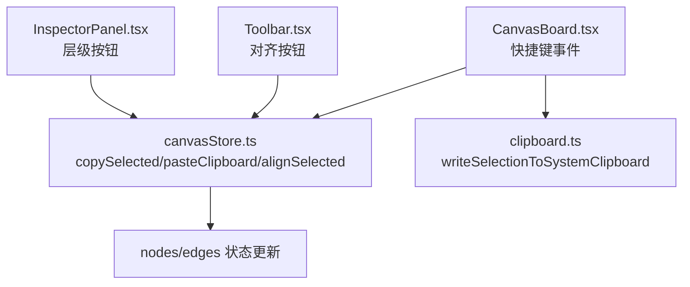
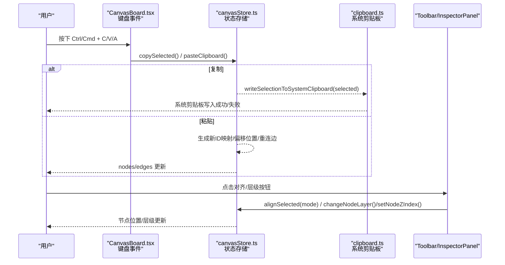
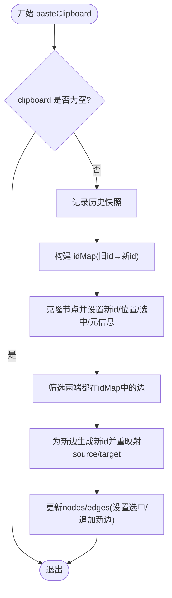
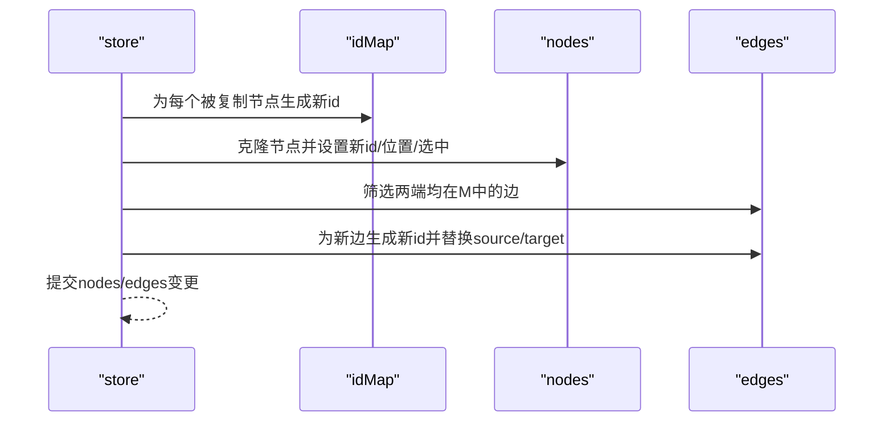
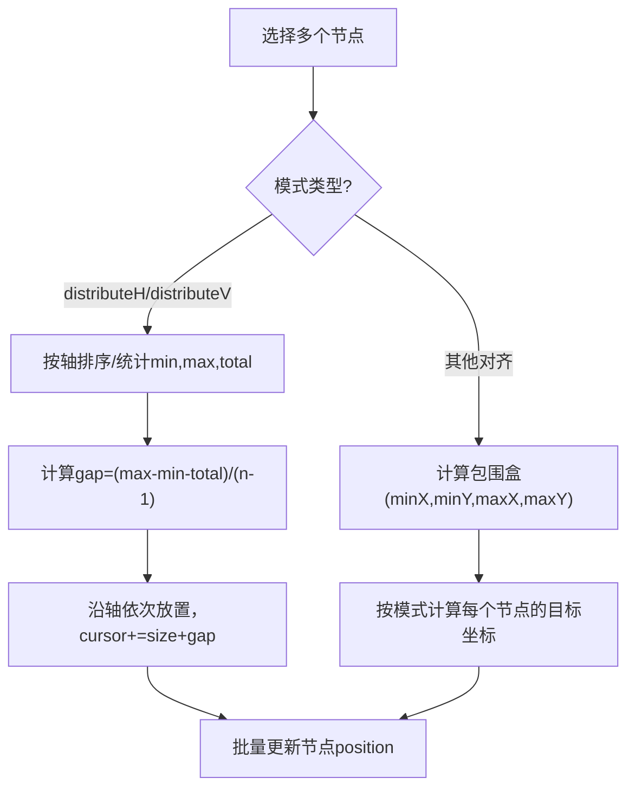
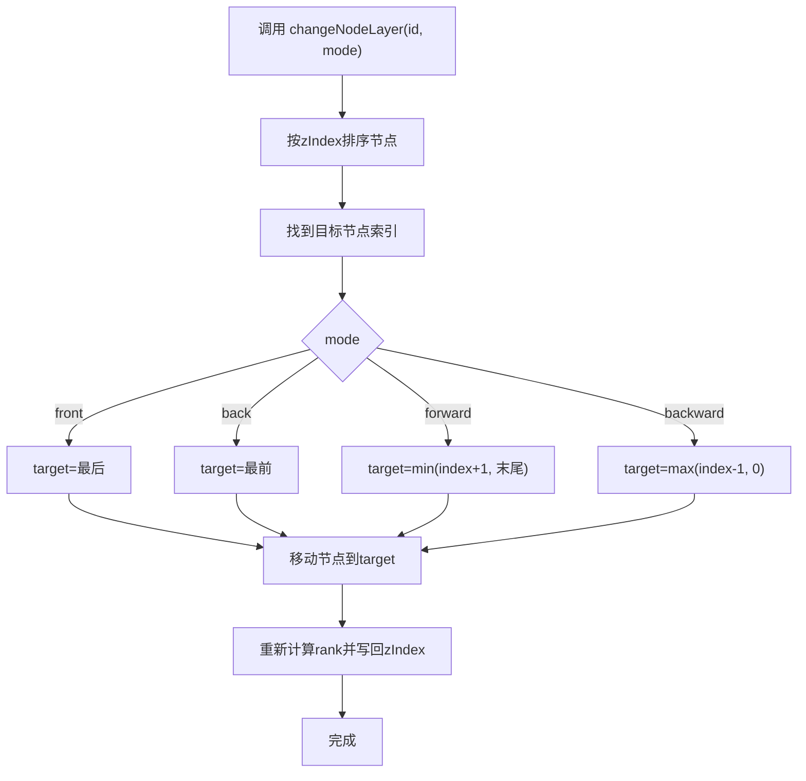
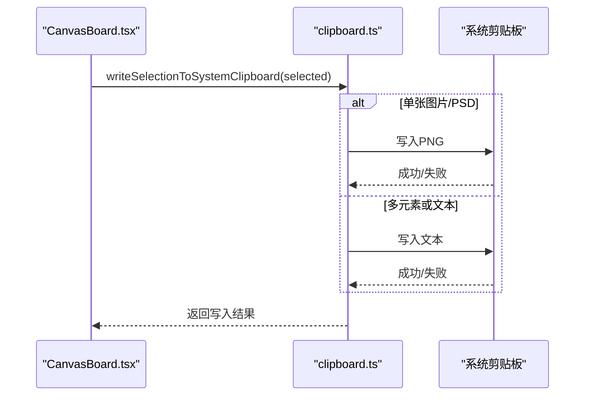
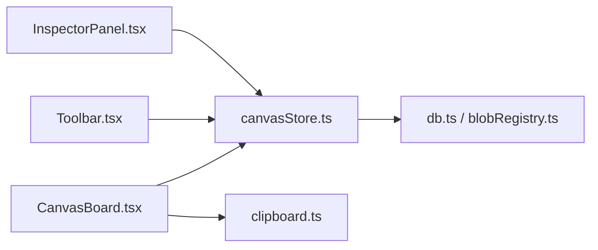

# 剪贴板与对齐功能

<cite>
**本文引用的文件**
- [src/store/canvasStore.ts](file://src/store/canvasStore.ts)
- [src/canvas/clipboard.ts](file://src/canvas/clipboard.ts)
- [src/canvas/CanvasBoard.tsx](file://src/canvas/CanvasBoard.tsx)
- [src/components/Toolbar.tsx](file://src/components/Toolbar.tsx)
- [src/components/InspectorPanel.tsx](file://src/components/InspectorPanel.tsx)
- [src/store/canvasStore.test.ts](file://src/store/canvasStore.test.ts)
</cite>

## 目录
1. [简介](#简介)
2. [项目结构](#项目结构)
3. [核心组件](#核心组件)
4. [架构总览](#架构总览)
5. [详细组件分析](#详细组件分析)
6. [依赖关系分析](#依赖关系分析)
7. [性能考量](#性能考量)
8. [故障排查指南](#故障排查指南)
9. [结论](#结论)
10. [附录：使用示例与扩展方法](#附录：使用示例与扩展方法)

## 简介
本文件聚焦于画布中的“剪贴板”和“节点对齐”两大能力，系统说明其实现原理、数据流与状态管理方式，并给出使用示例与可扩展点。内容覆盖：
- 剪贴板状态管理：copySelected 与 pasteClipboard 的数据处理逻辑
- 节点克隆的 ID 映射机制：新节点生成、连线重连
- 对齐算法：左/中/右、顶/中/底、水平/垂直分布等模式
- 图层管理：changeNodeLayer 与 setNodeZIndex 的状态更新
- 与系统剪贴板的交互：复制图片/文本到系统剪贴板

## 项目结构
围绕剪贴板与对齐的相关代码主要分布在以下位置：
- 状态与业务逻辑：store/canvasStore.ts（包含 copySelected、pasteClipboard、alignSelected、changeNodeLayer、setNodeZIndex）
- 系统剪贴板工具：canvas/clipboard.ts（将选中项写入系统剪贴板，支持图片与文本）
- 快捷键入口：canvas/CanvasBoard.tsx（监听 Ctrl/Cmd+C/V/A 触发内部复制粘贴与全选）
- UI 入口：components/Toolbar.tsx（对齐按钮）、components/InspectorPanel.tsx（层级操作面板）
- 行为验证：store/canvasStore.test.ts（覆盖复制粘贴、层级调整等行为）

图表来源
- [src/canvas/CanvasBoard.tsx:127-146](file://src/canvas/CanvasBoard.tsx#L127-L146)
- [src/store/canvasStore.ts:205-246](file://src/store/canvasStore.ts#L205-L246)
- [src/canvas/clipboard.ts:114-131](file://src/canvas/clipboard.ts#L114-L131)
- [src/components/Toolbar.tsx:69-78](file://src/components/Toolbar.tsx#L69-L78)
- [src/components/InspectorPanel.tsx:741-764](file://src/components/InspectorPanel.tsx#L741-L764)

章节来源
- [src/canvas/CanvasBoard.tsx:127-146](file://src/canvas/CanvasBoard.tsx#L127-L146)
- [src/store/canvasStore.ts:205-246](file://src/store/canvasStore.ts#L205-L246)
- [src/canvas/clipboard.ts:114-131](file://src/canvas/clipboard.ts#L114-L131)
- [src/components/Toolbar.tsx:69-78](file://src/components/Toolbar.tsx#L69-L78)
- [src/components/InspectorPanel.tsx:741-764](file://src/components/InspectorPanel.tsx#L741-L764)

## 核心组件
- 剪贴板状态与复制粘贴
  - copySelected：收集当前选中的节点，深拷贝后存入 store.clipboard，并清除 selected/dragging 标记
  - pasteClipboard：基于 clipboard 生成新节点，建立旧 ID→新 ID 的映射；偏移位置；追加插入元信息；筛选并重连仅涉及被复制节点的边；将新节点加入画布并重新设置选中态
- 对齐算法
  - alignSelected：根据 mode 计算目标位置或间距，批量更新选中节点的位置
- 图层管理
  - changeNodeLayer：按 front/forward/backward/back 四种模式移动节点顺序，并同步 zIndex
  - setNodeZIndex：直接设置指定节点的 zIndex，带数值范围限制
- 系统剪贴板
  - writeSelectionToSystemClipboard：单个图片/PSD 节点尝试复制为 PNG 到系统剪贴板；否则提取文本行复制到系统剪贴板

章节来源
- [src/store/canvasStore.ts:205-246](file://src/store/canvasStore.ts#L205-L246)
- [src/store/canvasStore.ts:247-274](file://src/store/canvasStore.ts#L247-L274)
- [src/store/canvasStore.ts:290-360](file://src/store/canvasStore.ts#L290-L360)
- [src/canvas/clipboard.ts:114-131](file://src/canvas/clipboard.ts#L114-L131)

## 架构总览
下图展示了从用户操作到状态更新的完整链路：

图表来源
- [src/canvas/CanvasBoard.tsx:127-146](file://src/canvas/CanvasBoard.tsx#L127-L146)
- [src/store/canvasStore.ts:205-246](file://src/store/canvasStore.ts#L205-L246)
- [src/canvas/clipboard.ts:114-131](file://src/canvas/clipboard.ts#L114-L131)
- [src/components/Toolbar.tsx:69-78](file://src/components/Toolbar.tsx#L69-L78)
- [src/components/InspectorPanel.tsx:741-764](file://src/components/InspectorPanel.tsx#L741-L764)

## 详细组件分析

### 剪贴板：copySelected 与 pasteClipboard
- copySelected
  - 过滤出 selected=true 的节点
  - 结构化深拷贝，重置 selected/dragging，存入 store.clipboard
- pasteClipboard
  - 若 clipboard 为空则返回
  - 记录快照以支持撤销
  - 构建 idMap：旧节点 id → 新节点 id
  - 生成 pasted 节点数组：
    - 深拷贝原节点
    - 应用新 id
    - 位置相对原位置偏移 (28, 28)
    - 设为选中，取消拖拽
    - 合并插入元信息（创建者、时间等）
  - 重连边：
    - 筛选 edges 中 source/target 均在 idMap 中的边
    - 为新边生成新 id，并将 source/target 替换为新 id
  - 更新 nodes/edges：
    - 将已粘贴节点设为选中
    - 追加新边

图表来源
- [src/store/canvasStore.ts:214-246](file://src/store/canvasStore.ts#L214-L246)

章节来源
- [src/store/canvasStore.ts:205-246](file://src/store/canvasStore.ts#L205-L246)
- [src/store/canvasStore.test.ts:42-91](file://src/store/canvasStore.test.ts#L42-L91)

### 节点克隆的 ID 映射与连线重连
- ID 映射机制
  - 通过 Map 保存每个被复制节点的旧 id 与新 id 的对应关系
  - 所有后续对节点与边的引用均通过该映射进行替换
- 连线重连
  - 仅当某条边的 source 与 target 都属于被复制集合时，才复制该边
  - 新边使用新的 id，并将 source/target 指向新节点 id
- 位置偏移
  - 粘贴后的节点相对原位置整体偏移，避免重叠

图表来源
- [src/store/canvasStore.ts:214-246](file://src/store/canvasStore.ts#L214-L246)

章节来源
- [src/store/canvasStore.ts:214-246](file://src/store/canvasStore.ts#L214-L246)
- [src/store/canvasStore.test.ts:56-85](file://src/store/canvasStore.test.ts#L56-L85)

### 对齐算法：多种模式的计算逻辑
- 支持的模式
  - 水平方向：left、centerH、right
  - 垂直方向：top、centerV、bottom
  - 分布：distributeH（水平分布）、distributeV（垂直分布）
- 尺寸获取
  - 优先取节点 width/height，其次 style.width/height，再次 measured.width/height，最后回退默认值
- 边界计算
  - 非分布模式：计算选中节点的整体包围盒（minX/minY/maxX/maxY）
  - 分布模式：按轴排序，统计最小值、最大值与总尺寸，计算均匀间隔 gap
- 位置更新
  - 对齐模式：依据包围盒与节点自身尺寸计算目标坐标
  - 分布模式：沿轴依次放置，保持相等间距

图表来源
- [src/store/canvasStore.ts:290-360](file://src/store/canvasStore.ts#L290-L360)

章节来源
- [src/store/canvasStore.ts:290-360](file://src/store/canvasStore.ts#L290-L360)
- [src/components/Toolbar.tsx:69-78](file://src/components/Toolbar.tsx#L69-L78)

### 图层管理：changeNodeLayer 与 setNodeZIndex
- changeNodeLayer
  - 将节点按 zIndex（未设置则按数组索引）排序
  - 根据 mode 计算目标位置：front（最前）、back（最后）、forward（上移一层）、backward（下移一层）
  - 移动节点并重新计算 rank，再写回各节点的 zIndex
- setNodeZIndex
  - 校验输入为有限数，截断为整数并限制在 [0, 9999]
  - 若值未变化则跳过，否则直接更新目标节点的 zIndex

图表来源
- [src/store/canvasStore.ts:247-274](file://src/store/canvasStore.ts#L247-L274)

章节来源
- [src/store/canvasStore.ts:247-274](file://src/store/canvasStore.ts#L247-L274)
- [src/components/InspectorPanel.tsx:741-764](file://src/components/InspectorPanel.tsx#L741-L764)
- [src/store/canvasStore.test.ts:94-124](file://src/store/canvasStore.test.ts#L94-L124)

### 系统剪贴板：复制图片与文本
- 策略
  - 若仅选中一个 image/psd 节点：尝试将其转换为 PNG 并写入系统剪贴板
  - 否则：提取文本行（文本类节点取 text，素材类节点取 label），拼接后写入系统剪贴板
- 兼容
  - 优先使用现代 Clipboard API，失败时回退到 execCommand('copy')
- 结果
  - 返回 { image?: boolean; text?: boolean } 表示成功写入的类型

图表来源
- [src/canvas/CanvasBoard.tsx:127-146](file://src/canvas/CanvasBoard.tsx#L127-L146)
- [src/canvas/clipboard.ts:114-131](file://src/canvas/clipboard.ts#L114-L131)

章节来源
- [src/canvas/clipboard.ts:114-131](file://src/canvas/clipboard.ts#L114-L131)
- [src/canvas/CanvasBoard.tsx:127-146](file://src/canvas/CanvasBoard.tsx#L127-L146)

## 依赖关系分析
- CanvasBoard.tsx 负责监听键盘事件，调用 canvasStore 的复制/粘贴/全选等方法，并调用 clipboard 工具写入系统剪贴板
- Toolbar.tsx 暴露对齐按钮，调用 canvasStore.alignSelected
- InspectorPanel.tsx 提供层级操作按钮，调用 canvasStore.changeNodeLayer/setNodeZIndex
- canvasStore.ts 集中管理 nodes/edges/viewport/history，并提供所有核心操作方法
- clipboard.ts 依赖 IndexedDB 与媒体资源注册表，用于获取图片预览与 Blob

图表来源
- [src/canvas/CanvasBoard.tsx:127-146](file://src/canvas/CanvasBoard.tsx#L127-L146)
- [src/store/canvasStore.ts:205-246](file://src/store/canvasStore.ts#L205-L246)
- [src/canvas/clipboard.ts:114-131](file://src/canvas/clipboard.ts#L114-L131)
- [src/components/Toolbar.tsx:69-78](file://src/components/Toolbar.tsx#L69-L78)
- [src/components/InspectorPanel.tsx:741-764](file://src/components/InspectorPanel.tsx#L741-L764)

章节来源
- [src/canvas/CanvasBoard.tsx:127-146](file://src/canvas/CanvasBoard.tsx#L127-L146)
- [src/store/canvasStore.ts:205-246](file://src/store/canvasStore.ts#L205-L246)
- [src/canvas/clipboard.ts:114-131](file://src/canvas/clipboard.ts#L114-L131)
- [src/components/Toolbar.tsx:69-78](file://src/components/Toolbar.tsx#L69-L78)
- [src/components/InspectorPanel.tsx:741-764](file://src/components/InspectorPanel.tsx#L741-L764)

## 性能考量
- 复制粘贴
  - 使用 structuredClone 进行深拷贝，避免共享引用导致的副作用
  - 仅复制两端均在被复制集合内的边，减少不必要的边复制
- 对齐
  - 先计算包围盒或统计 min/max/total，再批量更新 position，避免多次渲染抖动
- 图层
  - 排序后再统一写回 zIndex，减少状态更新次数
- 系统剪贴板
  - 图片转换采用 Canvas 缩放至最大边 4096，避免过大图片导致内存压力
  - 失败时回退到文本复制，提升兼容性

[本节为通用性能建议，不直接分析具体文件]

## 故障排查指南
- 粘贴后无边重连
  - 检查被复制节点是否包含边的两端；只有两端都被复制才会重连
  - 参考测试用例验证行为
- 对齐无效
  - 至少需要两个选中节点；少于两个时对齐不会生效
- 层级操作无变化
  - 检查传入的 mode 是否正确；确认节点是否存在
  - setNodeZIndex 会限制在 [0, 9999]，超出会被裁剪
- 系统剪贴板写入失败
  - 浏览器不支持 ClipboardItem 或权限不足时会失败
  - 可降级为文本复制；确保页面处于安全上下文（HTTPS）

章节来源
- [src/store/canvasStore.test.ts:56-85](file://src/store/canvasStore.test.ts#L56-L85)
- [src/store/canvasStore.ts:290-360](file://src/store/canvasStore.ts#L290-L360)
- [src/store/canvasStore.ts:247-274](file://src/store/canvasStore.ts#L247-L274)
- [src/canvas/clipboard.ts:90-107](file://src/canvas/clipboard.ts#L90-L107)

## 结论
本项目通过清晰的状态管理与工具函数，实现了健壮的剪贴板与对齐能力：
- 复制粘贴具备完善的 ID 映射与边重连机制，保证数据结构一致性
- 对齐算法支持常见布局需求，兼顾效率与易用性
- 图层管理提供直观的层级控制，满足复杂场景下的绘制顺序需求
- 系统剪贴板集成提升了跨应用协作体验

[本节为总结性内容，不直接分析具体文件]

## 附录：使用示例与扩展方法

### 常用操作流程
- 复制与粘贴
  - 选中若干节点，按 Ctrl/Cmd + C 复制到内部剪贴板，同时尝试写入系统剪贴板（图片或文本）
  - 按 Ctrl/Cmd + V 粘贴，自动偏移位置并选中新节点，连带重连相关边
- 对齐
  - 选中多个节点，点击工具栏的对齐按钮（左/中/右/顶/中/底/水平分布/垂直分布）
- 图层
  - 在右侧面板输入层级数值或使用置于顶层/底层/上移/下移按钮调整层级

章节来源
- [src/canvas/CanvasBoard.tsx:127-146](file://src/canvas/CanvasBoard.tsx#L127-L146)
- [src/components/Toolbar.tsx:69-78](file://src/components/Toolbar.tsx#L69-L78)
- [src/components/InspectorPanel.tsx:741-764](file://src/components/InspectorPanel.tsx#L741-L764)

### 自定义扩展方法
- 新增对齐模式
  - 在 AlignMode 类型中添加新模式
  - 在 alignSelected 中补充对应分支的计算逻辑
  - 在 Toolbar 中添加按钮并绑定回调
- 增强粘贴行为
  - 在 pasteClipboard 中增加额外字段注入或样式继承规则
  - 在 idMap 基础上扩展更多关联数据的映射（如自定义属性）
- 扩展系统剪贴板
  - 在 writeSelectionToSystemClipboard 中增加新的媒体类型（如 SVG、PDF 缩略图）
  - 增加更丰富的回退策略与错误提示

[本节为扩展指导，不直接分析具体文件]