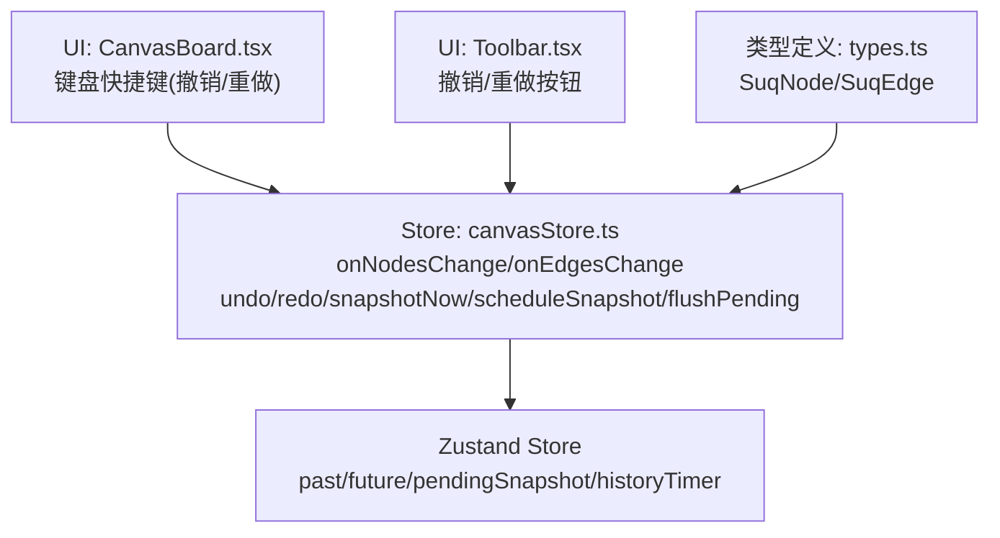
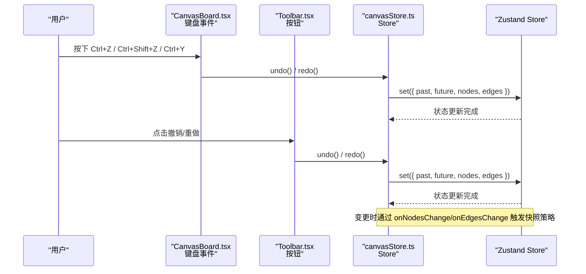
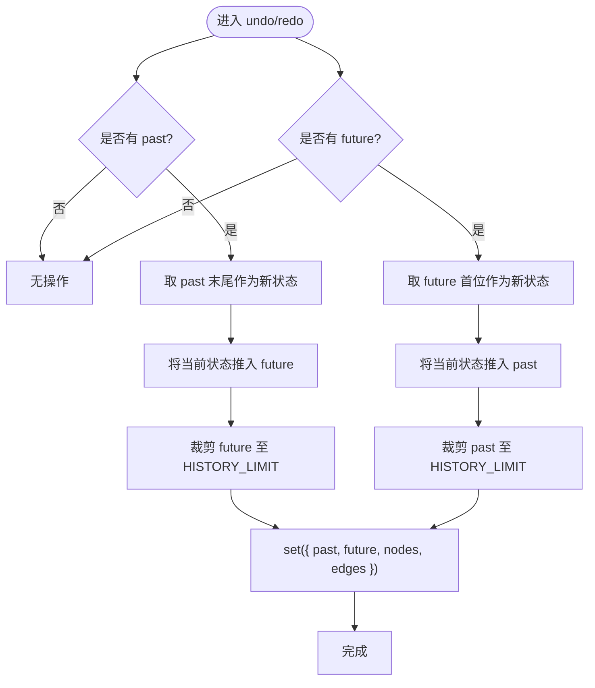
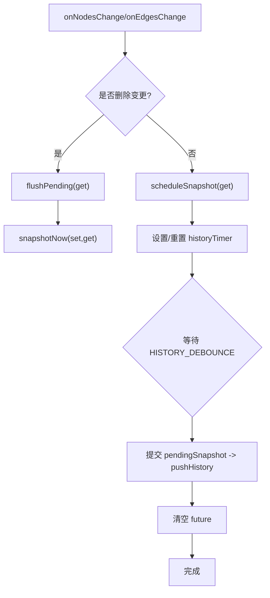
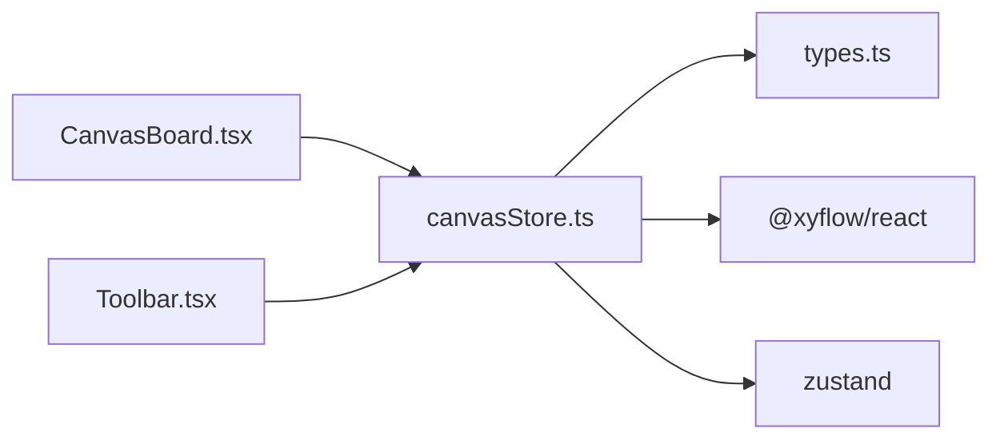

# 历史记录系统

<cite>
**本文引用的文件**
- [src/store/canvasStore.ts](file://src/store/canvasStore.ts)
- [src/components/Toolbar.tsx](file://src/components/Toolbar.tsx)
- [src/canvas/CanvasBoard.tsx](file://src/canvas/CanvasBoard.tsx)
- [src/types.ts](file://src/types.ts)
</cite>

## 目录
1. [简介](#简介)
2. [项目结构](#项目结构)
3. [核心组件](#核心组件)
4. [架构总览](#架构总览)
5. [详细组件分析](#详细组件分析)
6. [依赖关系分析](#依赖关系分析)
7. [性能考量](#性能考量)
8. [故障排除指南](#故障排除指南)
9. [结论](#结论)
10. [附录：API 使用与最佳实践](#附录api-使用与最佳实践)

## 简介
本文件深入解析画布历史记录系统的实现，重点覆盖以下方面：
- 撤销/重做机制的核心算法：past/future 数组管理、快照生成策略。
- 防抖机制在历史记录中的应用：scheduleSnapshot 与 flushPending 的工作原理。
- 历史记录的存储限制：HISTORY_LIMIT 的作用与内存优化策略。
- 时间旅行调试的实现原理与用户体验优化。
- 历史记录相关 API 的使用指南与常见问题排查。

## 项目结构
历史记录系统主要位于状态管理层（store），并在 UI 层暴露快捷键与工具栏按钮进行交互。

图表来源
- [src/canvas/CanvasBoard.tsx:113-121](file://src/canvas/CanvasBoard.tsx#L113-L121)
- [src/components/Toolbar.tsx:115-118](file://src/components/Toolbar.tsx#L115-L118)
- [src/store/canvasStore.ts:66-107](file://src/store/canvasStore.ts#L66-L107)
- [src/types.ts:106-107](file://src/types.ts#L106-L107)

章节来源
- [src/store/canvasStore.ts:25-59](file://src/store/canvasStore.ts#L25-L59)
- [src/canvas/CanvasBoard.tsx:113-121](file://src/canvas/CanvasBoard.tsx#L113-L121)
- [src/components/Toolbar.tsx:115-118](file://src/components/Toolbar.tsx#L115-L118)
- [src/types.ts:106-107](file://src/types.ts#L106-L107)

## 核心组件
- 历史记录条目 HistoryEntry：包含 nodes 与 edges 的快照。
- 状态字段 past/future：分别表示“可撤销的历史”和“可重做的未来”。
- 常量 HISTORY_LIMIT：限制历史栈的最大长度，避免无限增长。
- 防抖定时器 historyTimer 与待提交快照 pendingSnapshot：用于批量合并高频变更。
- 关键函数：
  - pushHistory：去重并追加到 past，同时按 HISTORY_LIMIT 裁剪。
  - snapshotNow：立即提交当前节点/边为新的历史点，并清空 future。
  - scheduleSnapshot：延迟提交，合并短时间内的多次变更。
  - flushPending：立即执行 pending 快照并提交。
  - undo/redo：在 past/future 之间移动指针，维护双向导航。

章节来源
- [src/store/canvasStore.ts:25-31](file://src/store/canvasStore.ts#L25-L31)
- [src/store/canvasStore.ts:66-107](file://src/store/canvasStore.ts#L66-L107)
- [src/store/canvasStore.ts:362-390](file://src/store/canvasStore.ts#L362-L390)

## 架构总览
历史记录系统基于 Zustand store 管理状态，通过 onNodesChange/onEdgesChange 等回调触发快照策略；用户操作（键盘快捷键、工具栏按钮）调用 undo/redo 完成时间旅行。

图表来源
- [src/canvas/CanvasBoard.tsx:113-121](file://src/canvas/CanvasBoard.tsx#L113-L121)
- [src/components/Toolbar.tsx:306-317](file://src/components/Toolbar.tsx#L306-L317)
- [src/store/canvasStore.ts:362-383](file://src/store/canvasStore.ts#L362-L383)

## 详细组件分析

### 撤销/重做核心算法（past/future 管理）
- 数据结构
  - past：历史栈，保存“之前的状态”，每次提交新快照会入栈。
  - future：重做栈，撤销时将当前状态入栈，重做时从该栈弹出。
- 入栈规则
  - pushHistory：若最新条目与当前快照相同则跳过（避免重复），否则追加并按 HISTORY_LIMIT 裁剪。
- 撤销（undo）
  - 从 past 取出最近一条作为新状态，将当前状态推入 future，并裁剪 future 长度。
- 重做（redo）
  - 从 future 取出第一条作为新状态，将当前状态推入 past，并裁剪 past 长度。

图表来源
- [src/store/canvasStore.ts:66-70](file://src/store/canvasStore.ts#L66-L70)
- [src/store/canvasStore.ts:362-383](file://src/store/canvasStore.ts#L362-L383)

章节来源
- [src/store/canvasStore.ts:66-70](file://src/store/canvasStore.ts#L66-L70)
- [src/store/canvasStore.ts:362-383](file://src/store/canvasStore.ts#L362-L383)

### 快照生成策略与防抖机制（scheduleSnapshot / flushPending）
- 触发时机
  - 节点/边变更：onNodesChange/onEdgesChange
    - 删除类变更：立即 flushPending + snapshotNow（确保删除后立刻落盘）。
    - 其他变更：scheduleSnapshot（延迟合并）。
  - 连接边、新增节点、复制粘贴、对齐等操作：直接 snapshotNow。
- 防抖逻辑
  - pendingSnapshot：记录最后一次变更时的 nodes/edges。
  - historyTimer：定时任务，在 HISTORY_DEBOUNCE 毫秒后提交 pendingSnapshot。
  - 频繁变更时会不断重置定时器，最终只提交一次合并后的快照。
- 立即提交（flushPending）
  - 清除定时器，立即提交 pendingSnapshot，避免长时间等待导致数据丢失风险。

图表来源
- [src/store/canvasStore.ts:126-145](file://src/store/canvasStore.ts#L126-L145)
- [src/store/canvasStore.ts:76-107](file://src/store/canvasStore.ts#L76-L107)

章节来源
- [src/store/canvasStore.ts:76-107](file://src/store/canvasStore.ts#L76-L107)
- [src/store/canvasStore.ts:126-145](file://src/store/canvasStore.ts#L126-L145)

### 存储限制与内存优化（HISTORY_LIMIT）
- 作用
  - 限制 past/future 最大长度，防止历史栈无限增长导致内存占用过高。
- 实现
  - pushHistory 在追加后使用 slice(-HISTORY_LIMIT) 裁剪。
  - undo/redo 在写入 future/past 时也进行同样裁剪。
- 效果
  - 保证历史深度可控，兼顾回溯能力与内存占用平衡。

章节来源
- [src/store/canvasStore.ts:30-31](file://src/store/canvasStore.ts#L30-L31)
- [src/store/canvasStore.ts:66-70](file://src/store/canvasStore.ts#L66-L70)
- [src/store/canvasStore.ts:362-383](file://src/store/canvasStore.ts#L362-L383)

### 时间旅行调试与用户体验优化
- 时间旅行
  - 通过 past/future 的双栈设计，支持任意步数的撤销与重做，形成“时间旅行”体验。
- 快捷键
  - Ctrl/Cmd + Z：撤销；Ctrl/Cmd + Shift + Z 或 Ctrl/Cmd + Y：重做。
- 工具栏
  - 提供撤销/重做按钮，禁用态由 past/future 是否为空决定。
- 防抖提升流畅度
  - 高频编辑（如拖拽、输入）通过 scheduleSnapshot 合并，减少历史爆炸与渲染抖动。
- 删除即落盘
  - 删除类变更立即 flushPending + snapshotNow，确保删除操作可被正确撤销。

章节来源
- [src/canvas/CanvasBoard.tsx:113-121](file://src/canvas/CanvasBoard.tsx#L113-L121)
- [src/components/Toolbar.tsx:115-118](file://src/components/Toolbar.tsx#L115-L118)
- [src/components/Toolbar.tsx:306-317](file://src/components/Toolbar.tsx#L306-L317)
- [src/store/canvasStore.ts:126-145](file://src/store/canvasStore.ts#L126-L145)

## 依赖关系分析
- 模块耦合
  - CanvasBoard.tsx 监听键盘事件，调用 store 的 undo/redo。
  - Toolbar.tsx 读取 past/future 长度以控制按钮可用状态，并调用 undo/redo。
  - canvasStore.ts 依赖 types.ts 中的 SuqNode/SuqEdge 类型。
- 外部依赖
  - @xyflow/react 提供的 applyNodeChanges/applyEdgeChanges 用于应用变更。
  - zustand create 创建全局状态。

图表来源
- [src/canvas/CanvasBoard.tsx:113-121](file://src/canvas/CanvasBoard.tsx#L113-L121)
- [src/components/Toolbar.tsx:115-118](file://src/components/Toolbar.tsx#L115-L118)
- [src/store/canvasStore.ts:1-4](file://src/store/canvasStore.ts#L1-L4)
- [src/types.ts:106-107](file://src/types.ts#L106-L107)

章节来源
- [src/store/canvasStore.ts:1-4](file://src/store/canvasStore.ts#L1-L4)
- [src/types.ts:106-107](file://src/types.ts#L106-L107)
- [src/canvas/CanvasBoard.tsx:113-121](file://src/canvas/CanvasBoard.tsx#L113-L121)
- [src/components/Toolbar.tsx:115-118](file://src/components/Toolbar.tsx#L115-L118)

## 性能考量
- 防抖合并
  - 通过 scheduleSnapshot 将短时间内的多次变更合并为一个历史点，降低历史栈膨胀与状态更新频率。
- 去重策略
  - pushHistory 比较 last 与 entry 的引用，避免重复快照。
- 容量限制
  - HISTORY_LIMIT 限制历史深度，避免长期运行后内存泄漏。
- 删除即时落盘
  - 删除类变更立即 flushPending + snapshotNow，减少回滚不一致的风险。
- 建议
  - 对于极高频的连续编辑（如大量节点拖拽），可适当增大 HISTORY_DEBOUNCE 或引入更细粒度的分组策略。
  - 监控 past/future 长度，必要时提供“清理历史”入口（已提供 clearHistory）。

[本节为通用性能讨论，不直接分析具体代码行]

## 故障排除指南
- 撤销无效
  - 检查 past 是否为空；确认未调用 clearHistory 或 reset。
  - 确认 onNodesChange/onEdgesChange 是否正确触发 scheduleSnapshot/flushPending。
- 重做无效
  - 检查 future 是否为空；确认是否在撤销后继续产生新变更（会清空 future）。
- 历史过多导致卡顿
  - 调整 HISTORY_LIMIT 或 HISTORY_DEBOUNCE；或在业务侧增加“清理历史”逻辑。
- 删除后无法撤销
  - 确认删除类变更走的是 flushPending + snapshotNow 路径。
- 快捷键冲突
  - 确保不在输入框中触发；CanvasBoard 已过滤 isTypingTarget 场景。

章节来源
- [src/store/canvasStore.ts:126-145](file://src/store/canvasStore.ts#L126-L145)
- [src/store/canvasStore.ts:384-390](file://src/store/canvasStore.ts#L384-L390)
- [src/canvas/CanvasBoard.tsx:113-121](file://src/canvas/CanvasBoard.tsx#L113-L121)

## 结论
该历史记录系统通过双栈（past/future）实现了稳定的撤销/重做能力，结合防抖与去重策略，在保证用户体验的同时控制了内存占用。删除类变更的即时落盘确保了数据一致性。配合快捷键与工具栏，提供了直观的时间旅行调试体验。

[本节为总结性内容，不直接分析具体代码行]

## 附录：API 使用与最佳实践
- 常用 API
  - undo()：撤销一步。
  - redo()：重做一步。
  - clearHistory()：清空历史栈与待提交快照。
  - setViewport(viewport)：仅更新视口，不产生历史。
  - reset()：重置画布状态（不包含历史）。
- 触发历史的变更
  - addNodes/addEdge/updateNodeData/updateEdgeData/duplicateNode/pasteClipboard/changeNodeLayer/setNodeZIndex/removeAssets/alignSelected 等都会产生历史。
  - onNodesChange/onEdgesChange 会根据变更类型选择 scheduleSnapshot 或 flushPending + snapshotNow。
- 快捷键
  - Ctrl/Cmd + Z：撤销。
  - Ctrl/Cmd + Shift + Z 或 Ctrl/Cmd + Y：重做。
- 最佳实践
  - 对高频编辑使用防抖（默认已内置）。
  - 合理设置 HISTORY_LIMIT，平衡回溯能力与内存占用。
  - 在需要时调用 clearHistory 释放历史空间。
  - 避免在输入框内触发撤销/重做（已自动过滤）。

章节来源
- [src/store/canvasStore.ts:118-398](file://src/store/canvasStore.ts#L118-L398)
- [src/canvas/CanvasBoard.tsx:113-121](file://src/canvas/CanvasBoard.tsx#L113-L121)
- [src/components/Toolbar.tsx:306-317](file://src/components/Toolbar.tsx#L306-L317)