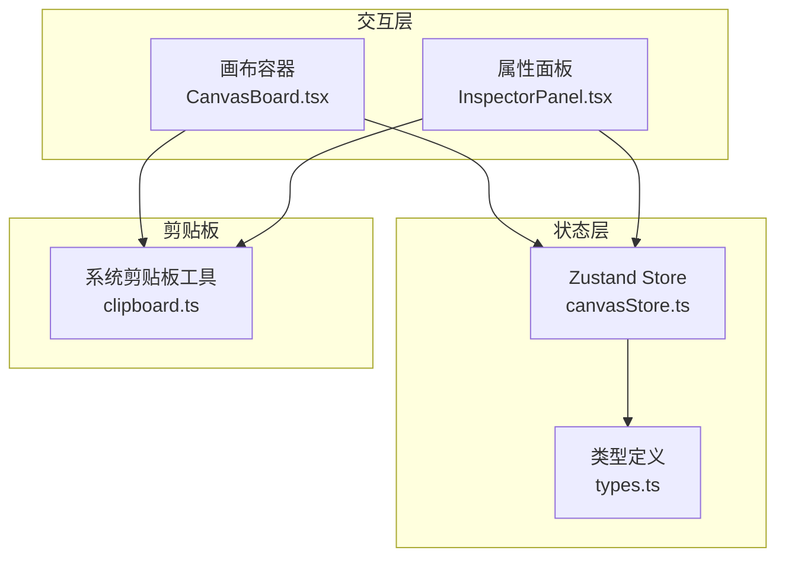
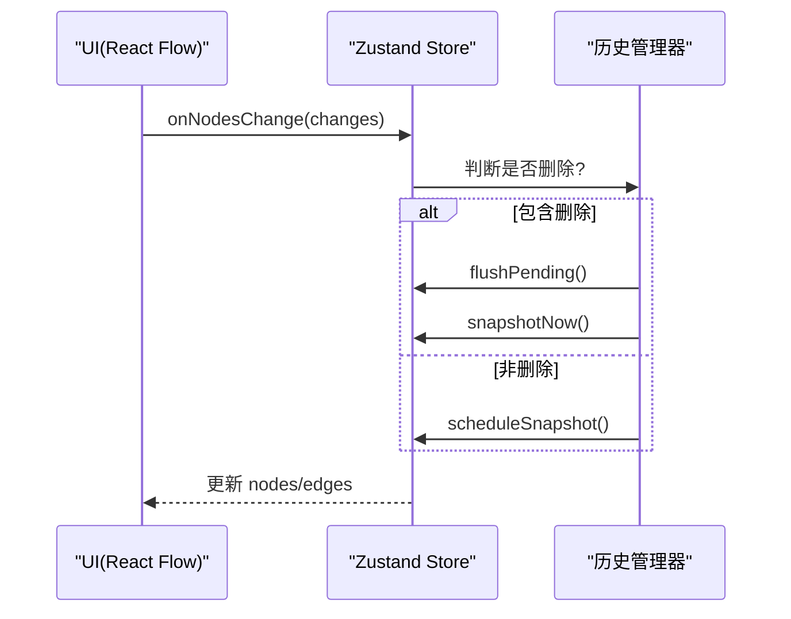
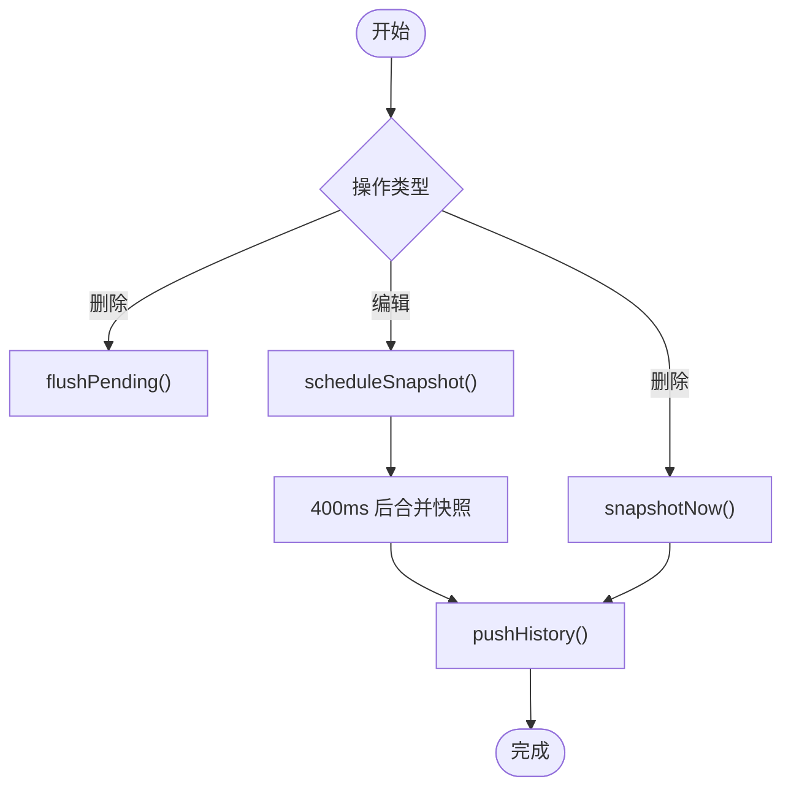
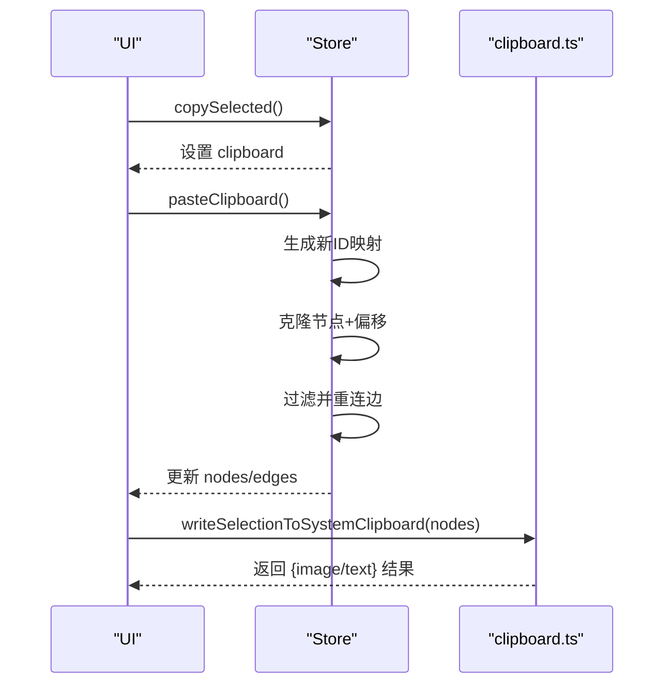
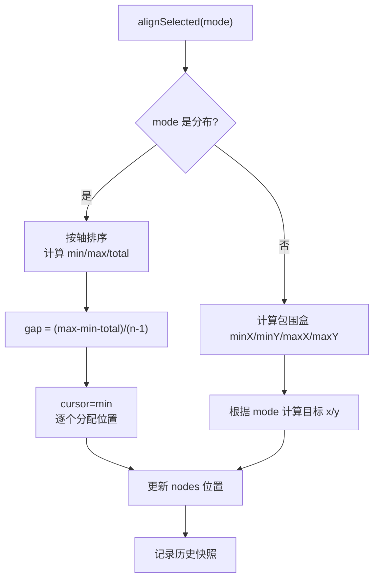
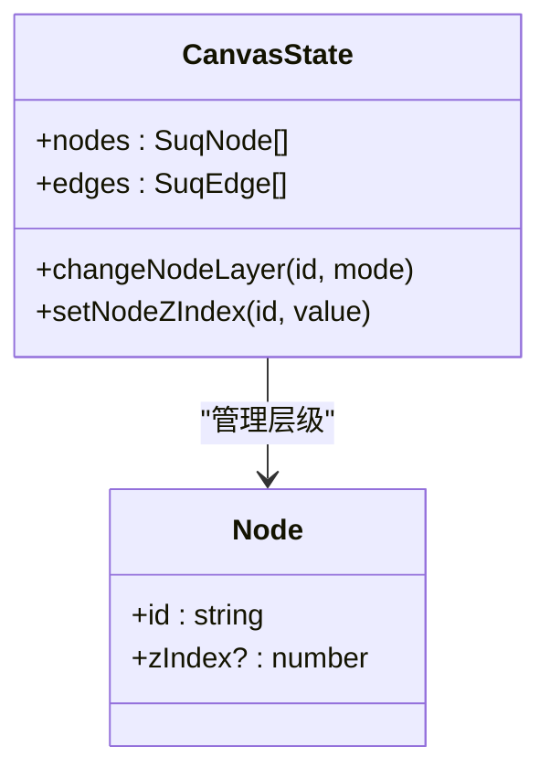
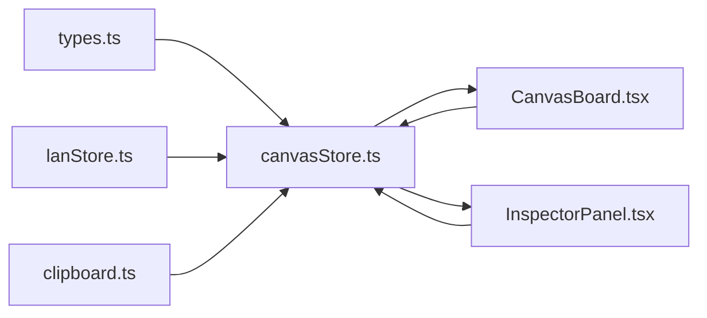
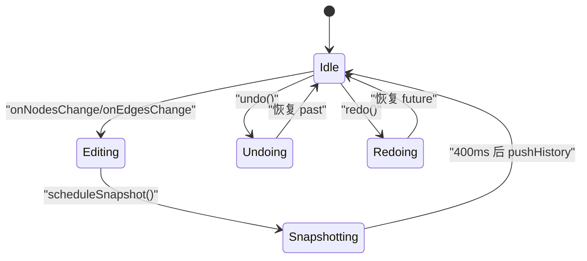
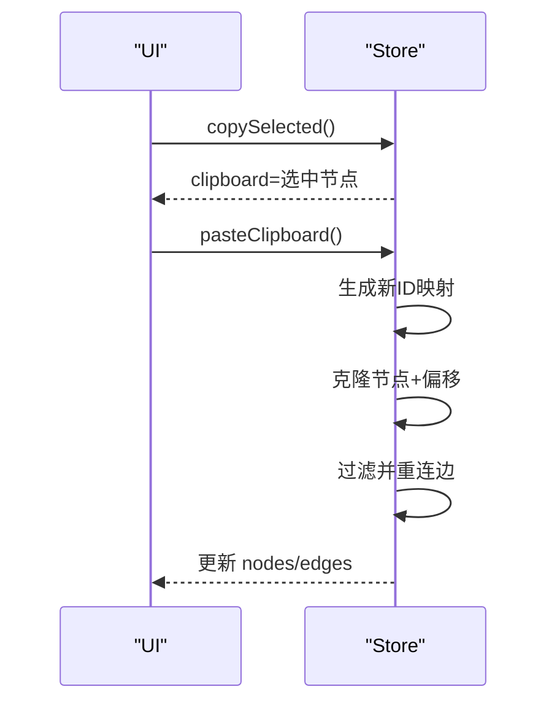

# 画布状态管理

<cite>
**本文引用的文件**
- [canvasStore.ts](file://src/store/canvasStore.ts)
- [clipboard.ts](file://src/canvas/clipboard.ts)
- [types.ts](file://src/types.ts)
- [CanvasBoard.tsx](file://src/canvas/CanvasBoard.tsx)
- [InspectorPanel.tsx](file://src/components/InspectorPanel.tsx)
- [canvasStore.test.ts](file://src/store/canvasStore.test.ts)
</cite>

## 目录
1. [简介](#简介)
2. [项目结构](#项目结构)
3. [核心组件](#核心组件)
4. [架构总览](#架构总览)
5. [详细组件分析](#详细组件分析)
6. [依赖关系分析](#依赖关系分析)
7. [性能考量](#性能考量)
8. [故障排查指南](#故障排查指南)
9. [结论](#结论)
10. [附录：API 使用示例与流程图](#附录api-使用示例与流程图)

## 简介
本文件为 SuQCanvas 的“画布状态管理”专项文档，聚焦于 canvasStore.ts 的实现，系统性说明节点与边的状态、视口控制、历史记录（撤销/重做）、剪贴板复制粘贴、对齐算法、图层管理等。文档同时提供状态流转图与 API 使用示例，帮助开发者快速理解并正确使用画布状态能力。

## 项目结构
画布状态由 Zustand store 集中管理，核心在 src/store/canvasStore.ts；类型定义集中在 src/types.ts；剪贴板系统位于 src/canvas/clipboard.ts；UI 层通过 CanvasBoard.tsx 与 React Flow 集成，并通过 InspectorPanel.tsx 暴露层级操作入口；测试用例覆盖关键行为。

图表来源
- [canvasStore.ts:1-120](file://src/store/canvasStore.ts#L1-L120)
- [CanvasBoard.tsx:41-67](file://src/canvas/CanvasBoard.tsx#L41-L67)
- [InspectorPanel.tsx:741-769](file://src/components/InspectorPanel.tsx#L741-L769)
- [clipboard.ts:1-132](file://src/canvas/clipboard.ts#L1-L132)
- [types.ts:1-112](file://src/types.ts#L1-L112)

章节来源
- [canvasStore.ts:1-120](file://src/store/canvasStore.ts#L1-L120)
- [CanvasBoard.tsx:41-67](file://src/canvas/CanvasBoard.tsx#L41-L67)
- [InspectorPanel.tsx:741-769](file://src/components/InspectorPanel.tsx#L741-L769)
- [clipboard.ts:1-132](file://src/canvas/clipboard.ts#L1-L132)
- [types.ts:1-112](file://src/types.ts#L1-L112)

## 核心组件
- 画布状态模型
  - nodes: 节点列表（受 React Flow 变更回调驱动）
  - edges: 边列表（受 React Flow 变更回调驱动）
  - viewport: 视口（平移/缩放）
  - past/future: 历史栈（撤销/重做）
  - clipboard: 内部剪贴板（用于复制/粘贴选中的节点集合）
- 关键方法
  - onNodesChange / onEdgesChange：处理 React Flow 变更，自动记录历史快照
  - addNodes / addEdge / updateNodeData / updateEdgeData：业务级写入
  - duplicateNode：节点克隆
  - copySelected / pasteClipboard：选中集复制粘贴，含 ID 映射与连线重连
  - changeNodeLayer / setNodeZIndex：图层顺序调整
  - removeAssets：删除资源时清理关联节点与边
  - alignSelected：对齐与分布算法
  - undo / redo / clearHistory：时间旅行调试
  - setViewport / reset：视口与重置

章节来源
- [canvasStore.ts:33-59](file://src/store/canvasStore.ts#L33-L59)
- [canvasStore.ts:118-398](file://src/store/canvasStore.ts#L118-L398)

## 架构总览
画布状态采用“单向数据流 + 事件驱动”的模式：
- UI 层通过 React Flow 触发 onNodesChange / onEdgesChange / onConnect
- Store 根据变更类型决定是否立即或延迟生成历史快照
- 业务方法统一通过 snapshotNow/scheduleSnapshot 保证可撤销性
- 视口变化不进入历史栈，避免频繁快照导致性能问题

图表来源
- [canvasStore.ts:126-145](file://src/store/canvasStore.ts#L126-L145)
- [canvasStore.ts:66-107](file://src/store/canvasStore.ts#L66-L107)

## 详细组件分析

### 节点与边的状态管理
- 节点变更
  - 通过 applyNodeChanges 应用移动、选择、删除等变更
  - 若变更包含删除，立即刷新待提交的历史快照并记录当前状态
  - 否则使用防抖机制合并多次编辑，减少历史栈膨胀
- 边变更
  - 通过 applyEdgeChanges 应用连接、拖拽等变更
  - 删除边同样触发即时快照
- 连接创建
  - onConnect 生成新边，附带默认样式与元数据，并记录历史

复杂度与性能
- 变更应用为 O(n) 级别（n 为节点/边数量）
- 历史快照通过引用比较去重，避免重复入栈
- 防抖间隔 400ms，限制高频编辑时的快照频率

章节来源
- [canvasStore.ts:126-158](file://src/store/canvasStore.ts#L126-L158)
- [canvasStore.ts:66-107](file://src/store/canvasStore.ts#L66-L107)

### 视口状态控制
- setViewport 直接更新视口，不进入历史栈
- 适合平移/缩放等浏览类操作，避免影响撤销语义

章节来源
- [canvasStore.ts:392-394](file://src/store/canvasStore.ts#L392-L394)

### 历史记录系统（撤销/重做）
- 数据结构
  - past: 历史栈（过去状态）
  - future: 重做栈（未来状态）
  - HistoryEntry: { nodes, edges }
- 快照策略
  - 立即快照：删除操作、显式调用 snapshotNow（如添加节点、连线、对齐、层级调整）
  - 延迟快照：普通编辑通过 scheduleSnapshot 防抖合并
  - 去重：pushHistory 比较前后引用，避免重复入栈
  - 上限：HISTORY_LIMIT = 50，超出裁剪
- 撤销/重做
  - undo：从 past 取上一个状态，将当前推入 future
  - redo：从 future 取下一个状态，将当前推入 past
  - clearHistory：清空历史与定时器

时间旅行调试
- 可通过 clearHistory 重置历史
- 结合测试用例验证撤销/重做一致性

图表来源
- [canvasStore.ts:66-107](file://src/store/canvasStore.ts#L66-L107)
- [canvasStore.ts:362-391](file://src/store/canvasStore.ts#L362-L391)

章节来源
- [canvasStore.ts:25-31](file://src/store/canvasStore.ts#L25-L31)
- [canvasStore.ts:66-107](file://src/store/canvasStore.ts#L66-L107)
- [canvasStore.ts:362-391](file://src/store/canvasStore.ts#L362-L391)

### 剪贴板功能的状态管理
- 内部剪贴板
  - copySelected：复制当前选中的节点集合（深拷贝，清除 selected/dragging）
  - pasteClipboard：粘贴到画布，生成新 ID，偏移位置，保持选中态，并重建选中节点之间的边
- 系统剪贴板
  - writeSelectionToSystemClipboard：单个图片/PSD 节点复制为 PNG 到系统剪贴板；否则复制文本内容
- ID 映射
  - 使用 Map 维护旧 ID -> 新 ID 的映射，确保边重连正确

图表来源
- [canvasStore.ts:205-246](file://src/store/canvasStore.ts#L205-L246)
- [clipboard.ts:114-132](file://src/canvas/clipboard.ts#L114-L132)

章节来源
- [canvasStore.ts:205-246](file://src/store/canvasStore.ts#L205-L246)
- [clipboard.ts:1-132](file://src/canvas/clipboard.ts#L1-L132)
- [canvasStore.test.ts:35-92](file://src/store/canvasStore.test.ts#L35-L92)

### 对齐算法的状态处理
- 支持模式
  - 左对齐、水平居中、右对齐
  - 顶对齐、垂直居中、底对齐
  - 水平分布、垂直分布
- 尺寸计算
  - 优先使用 width/height，其次 style.width/style.height，再次 measured.width/measured.height，最后回退默认值
- 分布算法
  - 按轴排序，计算最小/最大边界与总尺寸，推导间距 gap，依次分配位置
- 状态更新
  - 仅对选中节点进行位置更新，其他节点不变
  - 每次对齐都会记录历史快照

图表来源
- [canvasStore.ts:290-361](file://src/store/canvasStore.ts#L290-L361)

章节来源
- [canvasStore.ts:290-361](file://src/store/canvasStore.ts#L290-L361)

### 图层管理的状态更新
- changeNodeLayer
  - 基于 zIndex 排序，支持置顶、上移、下移、置底
  - 重新计算每个节点的 rank，并写回 zIndex
- setNodeZIndex
  - 数值校验与范围限制（0~9999），整数化
- 状态一致性
  - 所有层级变动均记录历史快照

图表来源
- [canvasStore.ts:247-274](file://src/store/canvasStore.ts#L247-L274)
- [InspectorPanel.tsx:741-769](file://src/components/InspectorPanel.tsx#L741-L769)

章节来源
- [canvasStore.ts:247-274](file://src/store/canvasStore.ts#L247-L274)
- [InspectorPanel.tsx:741-769](file://src/components/InspectorPanel.tsx#L741-L769)

### 资源删除的状态联动
- removeAssets
  - 根据 assetId 找到所有关联节点
  - 删除这些节点以及以它们为源/目标的边
  - 记录历史快照

章节来源
- [canvasStore.ts:275-289](file://src/store/canvasStore.ts#L275-L289)
- [canvasStore.test.ts:126-148](file://src/store/canvasStore.test.ts#L126-L148)

## 依赖关系分析
- 外部库
  - @xyflow/react：提供 React Flow 的变更回调与视图接口
  - zustand：状态管理
- 内部模块
  - types.ts：节点/边/视口类型定义
  - lanStore：获取当前用户信息，用于插入元数据
  - clipboard.ts：系统剪贴板写入与图片转换
  - CanvasBoard.tsx：与 React Flow 集成，转发变更到 Store
  - InspectorPanel.tsx：提供层级操作 UI

图表来源
- [canvasStore.ts:1-6](file://src/store/canvasStore.ts#L1-L6)
- [CanvasBoard.tsx:41-67](file://src/canvas/CanvasBoard.tsx#L41-L67)
- [InspectorPanel.tsx:741-769](file://src/components/InspectorPanel.tsx#L741-L769)
- [clipboard.ts:1-132](file://src/canvas/clipboard.ts#L1-L132)
- [types.ts:1-112](file://src/types.ts#L1-L112)

章节来源
- [canvasStore.ts:1-6](file://src/store/canvasStore.ts#L1-L6)
- [CanvasBoard.tsx:41-67](file://src/canvas/CanvasBoard.tsx#L41-L67)
- [InspectorPanel.tsx:741-769](file://src/components/InspectorPanel.tsx#L741-L769)
- [clipboard.ts:1-132](file://src/canvas/clipboard.ts#L1-L132)
- [types.ts:1-112](file://src/types.ts#L1-L112)

## 性能考量
- 历史快照防抖：400ms 合并连续编辑，降低历史栈压力
- 引用去重：pushHistory 比较前后引用，避免重复入栈
- 视口变更不入历史：避免频繁平移/缩放产生大量无用快照
- 对齐与分布：O(n log n) 排序 + O(n) 遍历，适用于中等规模节点集
- 层级调整：排序与索引重算 O(n)，批量更新时注意节点数量

[本节为通用性能建议，不直接分析具体文件]

## 故障排查指南
- 撤销无效
  - 检查是否触发了 flushPending（删除操作会强制提交待处理快照）
  - 确认未调用 clearHistory 清空历史
- 粘贴后连线丢失
  - 确认 pasteClipboard 中 idMap 是否正确建立，且边过滤条件匹配新旧 ID
- 对齐异常
  - 检查节点尺寸来源（width/height/style/measured），确保有有效值
  - 分布模式至少需要 3 个节点才能计算间距
- 层级错乱
  - 检查 changeNodeLayer 与 setNodeZIndex 是否被多次调用导致状态不一致
- 系统剪贴板失败
  - 浏览器不支持 ClipboardItem 或权限不足时，会回退到文本复制

章节来源
- [canvasStore.ts:94-107](file://src/store/canvasStore.ts#L94-L107)
- [canvasStore.ts:214-246](file://src/store/canvasStore.ts#L214-L246)
- [canvasStore.ts:290-361](file://src/store/canvasStore.ts#L290-L361)
- [canvasStore.ts:247-274](file://src/store/canvasStore.ts#L247-L274)
- [clipboard.ts:99-107](file://src/canvas/clipboard.ts#L99-L107)

## 结论
canvasStore.ts 提供了完整的画布状态管理能力：节点/边变更、视口控制、可撤销的历史系统、剪贴板复制粘贴、对齐与分布、图层管理与资源清理。通过合理的快照策略与类型安全设计，既保证了用户体验，又兼顾了性能与可维护性。配合测试用例与 UI 集成，形成闭环的开发与调试体验。

[本节为总结，不直接分析具体文件]

## 附录：API 使用示例与流程图

### 常用 API 与用法要点
- 添加节点
  - addNodes(nodes)：批量添加节点，自动注入创建者元数据
  - 参考路径：[addNodes:159-171](file://src/store/canvasStore.ts#L159-L171)
- 删除节点
  - 通过 React Flow 的 onNodesChange 触发删除，自动记录历史
  - 参考路径：[onNodesChange:126-135](file://src/store/canvasStore.ts#L126-L135)
- 更新节点数据
  - updateNodeData(id, data)：局部合并 data，记录历史
  - 参考路径：[updateNodeData:176-183](file://src/store/canvasStore.ts#L176-L183)
- 连线操作
  - onConnect(connection)：创建边并记录历史
  - 参考路径：[onConnect:146-158](file://src/store/canvasStore.ts#L146-L158)
- 复制粘贴
  - copySelected()：复制选中节点到内部剪贴板
  - pasteClipboard()：粘贴并重建边，记录历史
  - 参考路径：[copySelected/pasteClipboard:205-246](file://src/store/canvasStore.ts#L205-L246)
- 对齐与分布
  - alignSelected(mode)：支持 left/centerH/right/top/centerV/bottom/distributeH/distributeV
  - 参考路径：[alignSelected:290-361](file://src/store/canvasStore.ts#L290-L361)
- 图层管理
  - changeNodeLayer(id, mode)：front/forward/backward/back
  - setNodeZIndex(id, value)：设置层级数值（0~9999）
  - 参考路径：[changeNodeLayer/setNodeZIndex:247-274](file://src/store/canvasStore.ts#L247-L274)
- 撤销/重做
  - undo()/redo()：时间旅行调试
  - clearHistory()：清空历史
  - 参考路径：[undo/redo/clearHistory:362-391](file://src/store/canvasStore.ts#L362-L391)
- 视口控制
  - setViewport(viewport)：设置平移/缩放
  - 参考路径：[setViewport:392-394](file://src/store/canvasStore.ts#L392-L394)

### 状态流程图（撤销/重做）

图表来源
- [canvasStore.ts:66-107](file://src/store/canvasStore.ts#L66-L107)
- [canvasStore.ts:362-391](file://src/store/canvasStore.ts#L362-L391)

### 序列图：粘贴并重建边

图表来源
- [canvasStore.ts:205-246](file://src/store/canvasStore.ts#L205-L246)