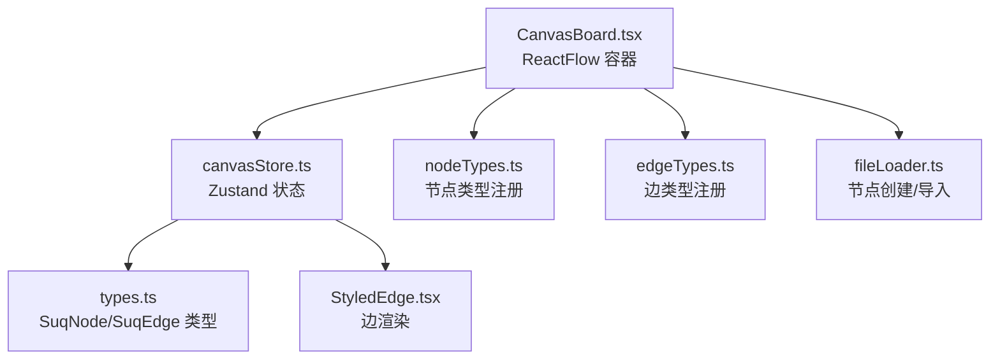
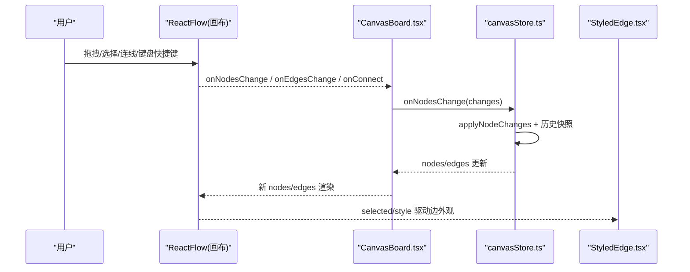
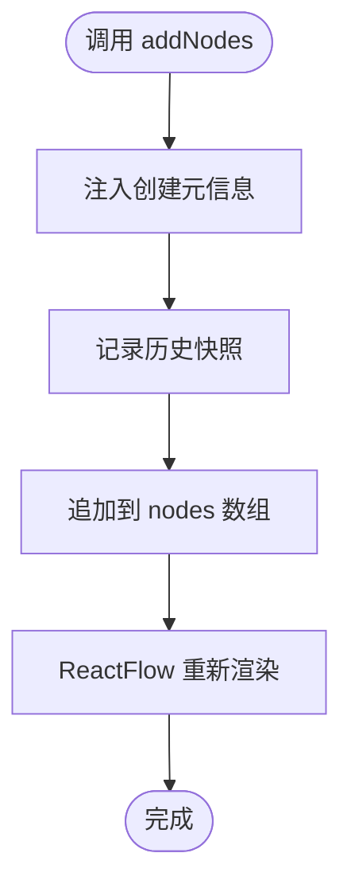
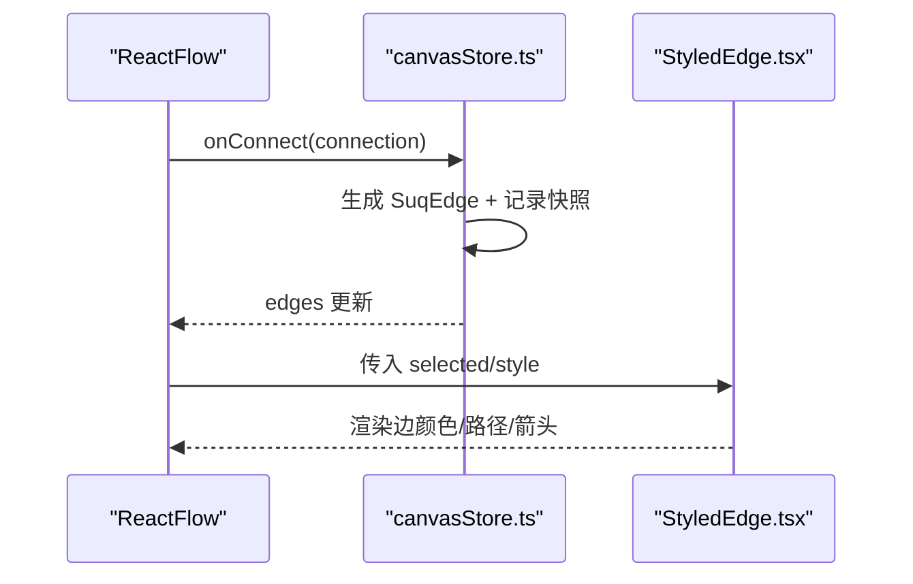
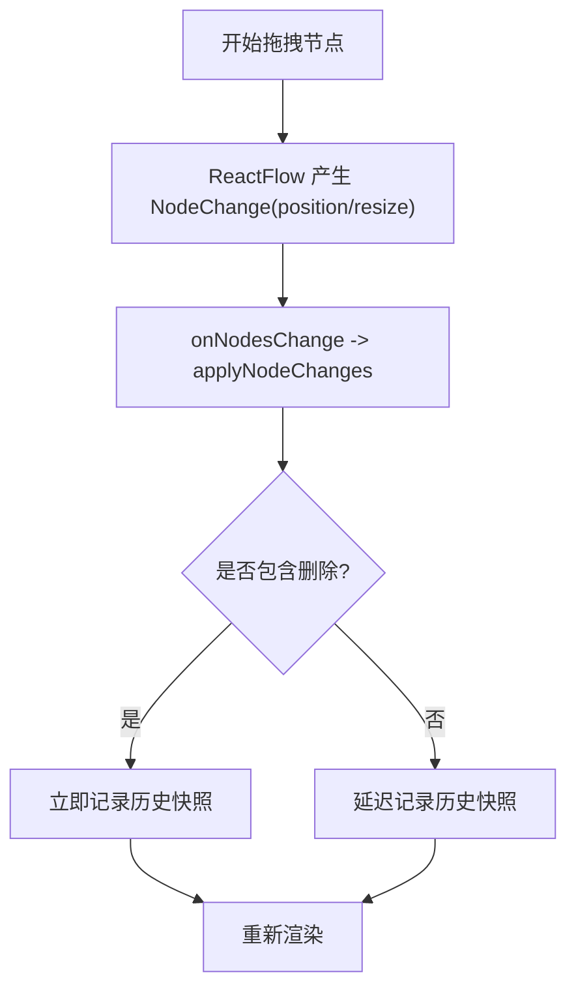
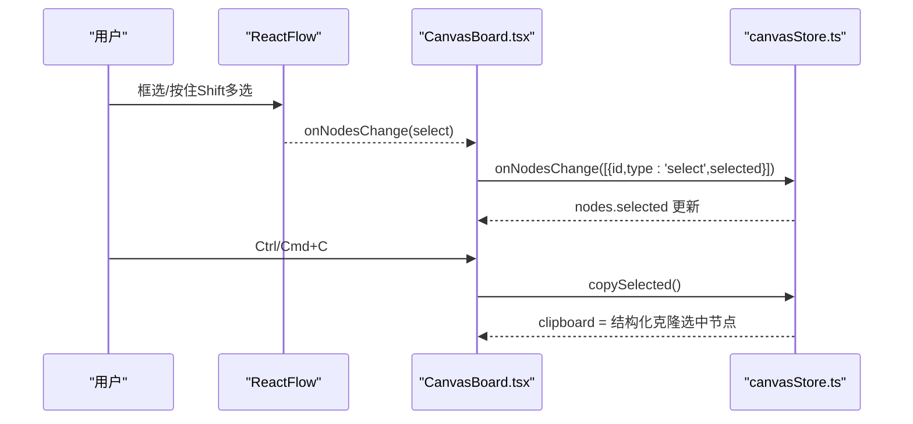
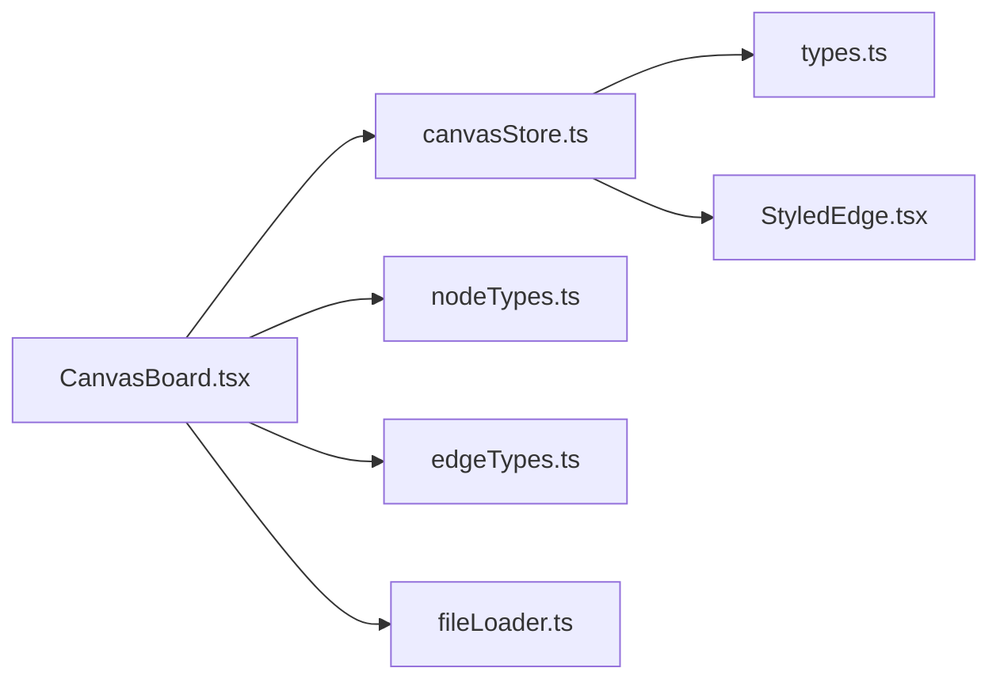

# 节点与边状态

<cite>
**本文引用的文件**
- [src/store/canvasStore.ts](file://src/store/canvasStore.ts)
- [src/canvas/CanvasBoard.tsx](file://src/canvas/CanvasBoard.tsx)
- [src/types.ts](file://src/types.ts)
- [src/canvas/edges/StyledEdge.tsx](file://src/canvas/edges/StyledEdge.tsx)
- [src/canvas/nodes/nodeTypes.ts](file://src/canvas/nodes/nodeTypes.ts)
- [src/io/fileLoader.ts](file://src/io/fileLoader.ts)
</cite>

## 目录
1. [简介](#简介)
2. [项目结构](#项目结构)
3. [核心组件](#核心组件)
4. [架构总览](#架构总览)
5. [详细组件分析](#详细组件分析)
6. [依赖关系分析](#依赖关系分析)
7. [性能考量](#性能考量)
8. [故障排查指南](#故障排查指南)
9. [结论](#结论)
10. [附录：状态变更示例与最佳实践](#附录：状态变更示例与最佳实践)

## 简介
本文件聚焦画布中“节点”和“边”的状态管理机制，系统说明以下能力：
- 节点的增删改查：addNodes、updateNodeData、duplicateNode 等方法的实现原理与副作用。
- 边的状态管理：连线的创建、更新、删除操作及其与节点的关系。
- 节点属性变更的状态同步：位置移动、尺寸调整、样式修改等如何反映到全局状态。
- 节点选择状态的管理与多选操作的处理。
- 提供具体状态变更示例与最佳实践，帮助在复杂交互中保持数据一致性与可撤销性。

## 项目结构
围绕节点与边的状态管理，关键代码分布在以下模块：
- 状态存储与历史：store/canvasStore.ts（Zustand 状态、变更处理、撤销重做）
- 画布交互与事件桥接：canvas/CanvasBoard.tsx（ReactFlow 集成、快捷键、拖拽、连线）
- 类型定义：types.ts（SuqNode、SuqEdge、默认边样式等）
- 边渲染：canvas/edges/StyledEdge.tsx（根据选中态与样式渲染）
- 节点类型注册：canvas/nodes/nodeTypes.ts（媒体节点类型映射）
- 节点创建与导入：io/fileLoader.ts（从文件或模板创建节点）

图表来源
- [src/canvas/CanvasBoard.tsx:1-459](file://src/canvas/CanvasBoard.tsx#L1-L459)
- [src/store/canvasStore.ts:1-399](file://src/store/canvasStore.ts#L1-L399)
- [src/types.ts:1-112](file://src/types.ts#L1-L112)
- [src/canvas/edges/StyledEdge.tsx:1-130](file://src/canvas/edges/StyledEdge.tsx#L1-L130)
- [src/canvas/nodes/nodeTypes.ts:1-27](file://src/canvas/nodes/nodeTypes.ts#L1-L27)
- [src/io/fileLoader.ts:1-297](file://src/io/fileLoader.ts#L1-L297)

章节来源
- [src/canvas/CanvasBoard.tsx:1-459](file://src/canvas/CanvasBoard.tsx#L1-L459)
- [src/store/canvasStore.ts:1-399](file://src/store/canvasStore.ts#L1-L399)
- [src/types.ts:1-112](file://src/types.ts#L1-L112)

## 核心组件
- Zustand 状态 store：集中维护 nodes、edges、viewport、历史记录（past/future）、剪贴板等；提供 onNodesChange/onEdgesChange/onConnect 等统一入口，封装 addNodes/addEdge/updateNodeData/updateEdgeData/duplicateNode 等操作，并自动触发快照以支持撤销/重做。
- ReactFlow 容器：负责渲染节点与边、处理用户交互（拖拽、缩放、选择、连线），将变化通过回调上报到 store。
- 类型系统：定义 SuqNode、SuqEdge、EdgeStyle 等，确保节点与边的数据结构一致。
- 边渲染器：根据选中态与样式绘制边，支持多种路径类型与箭头。
- 节点工厂：提供 createTextNode/createHeadingNode/createStickyNode/createShapeNode/importFiles 等方法，统一生成节点初始状态。

章节来源
- [src/store/canvasStore.ts:1-399](file://src/store/canvasStore.ts#L1-L399)
- [src/canvas/CanvasBoard.tsx:1-459](file://src/canvas/CanvasBoard.tsx#L1-L459)
- [src/types.ts:1-112](file://src/types.ts#L1-L112)
- [src/canvas/edges/StyledEdge.tsx:1-130](file://src/canvas/edges/StyledEdge.tsx#L1-L130)
- [src/io/fileLoader.ts:1-297](file://src/io/fileLoader.ts#L1-L297)

## 架构总览
下图展示了从用户交互到状态更新的完整链路，包括节点与边的创建、更新、删除以及选择状态的同步。

图表来源
- [src/canvas/CanvasBoard.tsx:66-150](file://src/canvas/CanvasBoard.tsx#L66-L150)
- [src/store/canvasStore.ts:126-158](file://src/store/canvasStore.ts#L126-L158)
- [src/canvas/edges/StyledEdge.tsx:11-129](file://src/canvas/edges/StyledEdge.tsx#L11-L129)

## 详细组件分析

### 节点状态管理：增删改查
- 新增节点 addNodes
  - 行为：为每个传入节点补充元信息（创建者、时间戳），追加到 nodes 数组，并立即记录历史快照。
  - 典型调用：双击空白处添加文本、拖入文件导入、工具栏添加标题/便签/形状等。
  - 副作用：nodes 更新后，ReactFlow 重新渲染；若 autoEdit 为真，节点进入编辑态。
  - 参考路径：[src/store/canvasStore.ts:159-171](file://src/store/canvasStore.ts#L159-L171)、[src/canvas/CanvasBoard.tsx:234-261](file://src/canvas/CanvasBoard.tsx#L234-L261)、[src/io/fileLoader.ts:186-205](file://src/io/fileLoader.ts#L186-L205)

- 更新节点数据 updateNodeData
  - 行为：按 id 查找节点，合并 data 字段，记录历史快照。
  - 适用场景：样式修改、文本内容更新、尺寸/对齐等属性变更。
  - 参考路径：[src/store/canvasStore.ts:176-183](file://src/store/canvasStore.ts#L176-L183)

- 复制节点 duplicateNode
  - 行为：克隆指定节点，分配新 id，偏移位置，重置 selected，注入元信息，记录历史快照。
  - 快捷键：Ctrl/Cmd+D 对多选批量复制。
  - 参考路径：[src/store/canvasStore.ts:192-204](file://src/store/canvasStore.ts#L192-L204)、[src/canvas/CanvasBoard.tsx:122-127](file://src/canvas/CanvasBoard.tsx#L122-L127)

- 删除节点
  - 行为：由 ReactFlow 的 onNodesChange 触发 remove 变更，store 中应用变更并记录历史快照。
  - 快捷键：Delete/Backspace。
  - 参考路径：[src/store/canvasStore.ts:126-135](file://src/store/canvasStore.ts#L126-L135)、[src/canvas/CanvasBoard.tsx:347-348](file://src/canvas/CanvasBoard.tsx#L347-L348)

- 查询节点
  - 行为：通过 nodes 数组直接读取或过滤；也可借助 measured/width/height 获取布局信息。
  - 参考路径：[src/types.ts:66-107](file://src/types.ts#L66-L107)

图表来源
- [src/store/canvasStore.ts:159-171](file://src/store/canvasStore.ts#L159-L171)

章节来源
- [src/store/canvasStore.ts:126-204](file://src/store/canvasStore.ts#L126-L204)
- [src/canvas/CanvasBoard.tsx:122-150](file://src/canvas/CanvasBoard.tsx#L122-L150)
- [src/io/fileLoader.ts:186-205](file://src/io/fileLoader.ts#L186-L205)
- [src/types.ts:66-107](file://src/types.ts#L66-L107)

### 边的状态管理：创建、更新、删除
- 创建边 onConnect
  - 行为：基于连接点生成 SuqEdge，设置类型为 styled，附带默认样式，记录历史快照并追加到 edges。
  - 参考路径：[src/store/canvasStore.ts:146-158](file://src/store/canvasStore.ts#L146-L158)

- 更新边数据 updateEdgeData
  - 行为：按 id 查找边，合并 data.style 等字段，记录历史快照。
  - 参考路径：[src/store/canvasStore.ts:184-191](file://src/store/canvasStore.ts#L184-L191)

- 删除边
  - 行为：ReactFlow 的 onEdgesChange 触发 remove 变更，store 应用变更并记录历史快照。
  - 参考路径：[src/store/canvasStore.ts:136-145](file://src/store/canvasStore.ts#L136-L145)

- 边渲染 StyledEdge
  - 行为：根据 selected 切换高亮色；根据 style.pathType 计算路径；根据 lineStyle 设置虚线/点线；根据 arrow 设置箭头方向；可选显示 order 标签。
  - 参考路径：[src/canvas/edges/StyledEdge.tsx:11-129](file://src/canvas/edges/StyledEdge.tsx#L11-L129)

图表来源
- [src/store/canvasStore.ts:146-158](file://src/store/canvasStore.ts#L146-L158)
- [src/canvas/edges/StyledEdge.tsx:11-129](file://src/canvas/edges/StyledEdge.tsx#L11-L129)

章节来源
- [src/store/canvasStore.ts:136-191](file://src/store/canvasStore.ts#L136-L191)
- [src/canvas/edges/StyledEdge.tsx:11-129](file://src/canvas/edges/StyledEdge.tsx#L11-L129)

### 节点属性变更的状态同步：位置、尺寸、样式
- 位置移动
  - 机制：ReactFlow 在拖拽节点时产生 NodeChange（type=position），CanvasBoard 将其转发给 store 的 onNodesChange；store 使用 applyNodeChanges 更新 nodes，并根据是否包含 remove 决定即时或延迟记录历史快照。
  - 参考路径：[src/canvas/CanvasBoard.tsx:66-75](file://src/canvas/CanvasBoard.tsx#L66-L75)、[src/store/canvasStore.ts:126-135](file://src/store/canvasStore.ts#L126-L135)

- 尺寸调整
  - 机制：节点 resize 也会产生 NodeChange（type=resize），同样经 onNodesChange 进入 store 更新。
  - 参考路径：[src/store/canvasStore.ts:126-135](file://src/store/canvasStore.ts#L126-L135)

- 样式修改
  - 机制：通过 updateNodeData 合并 data 中的样式字段（如 borderColor、backgroundColor、textAlign、fontSize 等），记录历史快照。
  - 参考路径：[src/store/canvasStore.ts:176-183](file://src/store/canvasStore.ts#L176-L183)、[src/types.ts:66-98](file://src/types.ts#L66-L98)

图表来源
- [src/canvas/CanvasBoard.tsx:66-75](file://src/canvas/CanvasBoard.tsx#L66-L75)
- [src/store/canvasStore.ts:126-145](file://src/store/canvasStore.ts#L126-L145)

章节来源
- [src/canvas/CanvasBoard.tsx:66-75](file://src/canvas/CanvasBoard.tsx#L66-L75)
- [src/store/canvasStore.ts:126-145](file://src/store/canvasStore.ts#L126-L145)
- [src/types.ts:66-98](file://src/types.ts#L66-L98)

### 节点选择状态管理与多选
- 选择与多选
  - 机制：ReactFlow 的 selectionMode=Partial 允许部分选择；CanvasBoard 监听 Ctrl/Cmd+A 全选，Ctrl/Cmd+C 复制选中，Ctrl/Cmd+V 粘贴并选中；copySelected 仅复制 selected=true 的节点。
  - 参考路径：[src/canvas/CanvasBoard.tsx:128-143](file://src/canvas/CanvasBoard.tsx#L128-L143)、[src/store/canvasStore.ts:205-246](file://src/store/canvasStore.ts#L205-L246)

- 锁定与协作编辑
  - 机制：局域网协作时，其他用户的编辑会锁定节点（draggable/selectable=false），避免冲突。
  - 参考路径：[src/canvas/CanvasBoard.tsx:62-79](file://src/canvas/CanvasBoard.tsx#L62-L79)

图表来源
- [src/canvas/CanvasBoard.tsx:128-143](file://src/canvas/CanvasBoard.tsx#L128-L143)
- [src/store/canvasStore.ts:205-213](file://src/store/canvasStore.ts#L205-L213)

章节来源
- [src/canvas/CanvasBoard.tsx:62-79](file://src/canvas/CanvasBoard.tsx#L62-L79)
- [src/canvas/CanvasBoard.tsx:128-143](file://src/canvas/CanvasBoard.tsx#L128-L143)
- [src/store/canvasStore.ts:205-246](file://src/store/canvasStore.ts#L205-L246)

## 依赖关系分析
- CanvasBoard 依赖 canvasStore 提供的状态与操作方法，并通过 ReactFlow 的事件回调进行双向同步。
- canvasStore 依赖 types 定义的 SuqNode/SuqEdge 结构，保证数据一致性。
- StyledEdge 依赖 types 的 EdgeStyle，根据 selected 与 style 渲染不同视觉效果。
- fileLoader 提供节点创建方法，被 CanvasBoard 与导入流程调用，最终通过 canvasStore.addNodes 写入状态。

图表来源
- [src/canvas/CanvasBoard.tsx:1-459](file://src/canvas/CanvasBoard.tsx#L1-L459)
- [src/store/canvasStore.ts:1-399](file://src/store/canvasStore.ts#L1-L399)
- [src/types.ts:1-112](file://src/types.ts#L1-L112)
- [src/canvas/edges/StyledEdge.tsx:1-130](file://src/canvas/edges/StyledEdge.tsx#L1-L130)
- [src/canvas/nodes/nodeTypes.ts:1-27](file://src/canvas/nodes/nodeTypes.ts#L1-L27)
- [src/io/fileLoader.ts:1-297](file://src/io/fileLoader.ts#L1-L297)

章节来源
- [src/canvas/CanvasBoard.tsx:1-459](file://src/canvas/CanvasBoard.tsx#L1-L459)
- [src/store/canvasStore.ts:1-399](file://src/store/canvasStore.ts#L1-L399)
- [src/types.ts:1-112](file://src/types.ts#L1-L112)
- [src/canvas/edges/StyledEdge.tsx:1-130](file://src/canvas/edges/StyledEdge.tsx#L1-L130)
- [src/canvas/nodes/nodeTypes.ts:1-27](file://src/canvas/nodes/nodeTypes.ts#L1-L27)
- [src/io/fileLoader.ts:1-297](file://src/io/fileLoader.ts#L1-L297)

## 性能考量
- 历史快照节流：scheduleSnapshot 使用定时器合并多次变更，减少频繁写历史；flushPending 在删除时立即提交，保证撤销正确性。
- 选择性禁用交互：协作模式下锁定节点（draggable/selectable=false），降低无效操作带来的状态抖动。
- 批量操作：copy/paste 与 alignSelected 对多个节点进行批量更新，减少多次 setState 开销。
- 渲染优化：StyledEdge 根据 selected 切换样式，避免不必要的重绘；connectionRadius 在连线模式下增大命中区域，提升体验。

[本节为通用性能建议，不直接分析具体文件]

## 故障排查指南
- 节点无法拖拽/选择
  - 检查是否被协作锁定（lockedNodeIds），确认 isNodeLockedByOther 返回。
  - 参考路径：[src/canvas/CanvasBoard.tsx:62-79](file://src/canvas/CanvasBoard.tsx#L62-L79)

- 撤销/重做无效
  - 确认 onNodesChange/onEdgesChange 是否正确触发 snapshotNow/scheduleSnapshot。
  - 参考路径：[src/store/canvasStore.ts:126-145](file://src/store/canvasStore.ts#L126-L145)

- 边未显示或样式异常
  - 检查 edge.data.style 是否包含 pathType/lineStyle/arrow/stroke；确认 StyledEdge 渲染逻辑。
  - 参考路径：[src/canvas/edges/StyledEdge.tsx:11-129](file://src/canvas/edges/StyledEdge.tsx#L11-L129)、[src/types.ts:50-64](file://src/types.ts#L50-L64)

- 导入文件失败
  - 检查文件大小限制与持久化存储请求；查看 toast 错误提示。
  - 参考路径：[src/io/fileLoader.ts:186-205](file://src/io/fileLoader.ts#L186-L205)

章节来源
- [src/canvas/CanvasBoard.tsx:62-79](file://src/canvas/CanvasBoard.tsx#L62-L79)
- [src/store/canvasStore.ts:126-145](file://src/store/canvasStore.ts#L126-L145)
- [src/canvas/edges/StyledEdge.tsx:11-129](file://src/canvas/edges/StyledEdge.tsx#L11-L129)
- [src/types.ts:50-64](file://src/types.ts#L50-L64)
- [src/io/fileLoader.ts:186-205](file://src/io/fileLoader.ts#L186-L205)

## 结论
该画布通过 Zustand 集中管理节点与边的状态，结合 ReactFlow 的变更回调与历史快照机制，实现了稳定、可撤销、可扩展的状态管理。节点与边的增删改查、属性同步、选择与多选均具备清晰的职责边界与良好的用户体验。协作锁定与批量操作进一步提升了多用户场景下的稳定性与效率。

[本节为总结性内容，不直接分析具体文件]

## 附录：状态变更示例与最佳实践

- 示例：双击空白处添加文本节点
  - 步骤：onPaneDoubleClick -> screenToFlowPosition -> addNodes(createTextNode(pos, true))
  - 结果：nodes 增加一个文本节点，自动进入编辑态，历史快照已记录。
  - 参考路径：[src/canvas/CanvasBoard.tsx:234-242](file://src/canvas/CanvasBoard.tsx#L234-L242)、[src/io/fileLoader.ts:207-221](file://src/io/fileLoader.ts#L207-L221)、[src/store/canvasStore.ts:159-171](file://src/store/canvasStore.ts#L159-L171)

- 示例：拖拽文件导入并生成节点
  - 步骤：onDrop -> importFiles(files, pos) -> putAsset -> createNodeForAsset -> addNodes
  - 结果：每个文件生成对应类型的节点，位置依次偏移，历史快照已记录。
  - 参考路径：[src/canvas/CanvasBoard.tsx:222-232](file://src/canvas/CanvasBoard.tsx#L222-L232)、[src/io/fileLoader.ts:186-205](file://src/io/fileLoader.ts#L186-L205)、[src/io/fileLoader.ts:165-182](file://src/io/fileLoader.ts#L165-L182)

- 示例：复制选中节点并粘贴
  - 步骤：Ctrl/Cmd+C -> copySelected -> structuredClone(selected nodes) -> Ctrl/Cmd+V -> pasteClipboard
  - 结果：生成新节点并选中，关联边也被复制并重映射 source/target。
  - 参考路径：[src/canvas/CanvasBoard.tsx:128-135](file://src/canvas/CanvasBoard.tsx#L128-L135)、[src/store/canvasStore.ts:205-246](file://src/store/canvasStore.ts#L205-L246)

- 最佳实践
  - 始终通过 store 的方法（addNodes/updateNodeData 等）修改状态，避免直接操作 nodes/edges 导致历史不一致。
  - 批量操作优先使用 store 的批量接口（如 pasteClipboard、alignSelected），减少多次快照开销。
  - 在协作场景中尊重锁定状态，避免覆盖他人编辑。
  - 使用 updateNodeData 合并样式，避免覆盖已有 data 字段。
  - 对边样式变更使用 updateEdgeData，确保 style 与 pathType/lineStyle/arrow 一致。

[本节为实践指导，不直接分析具体文件]