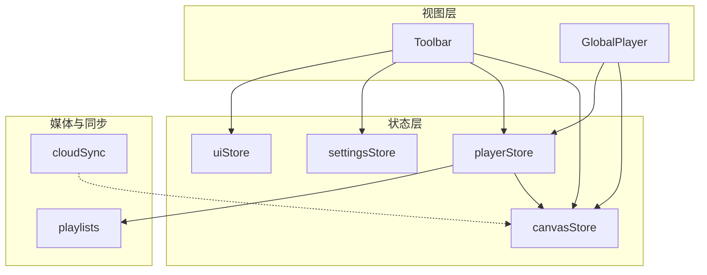
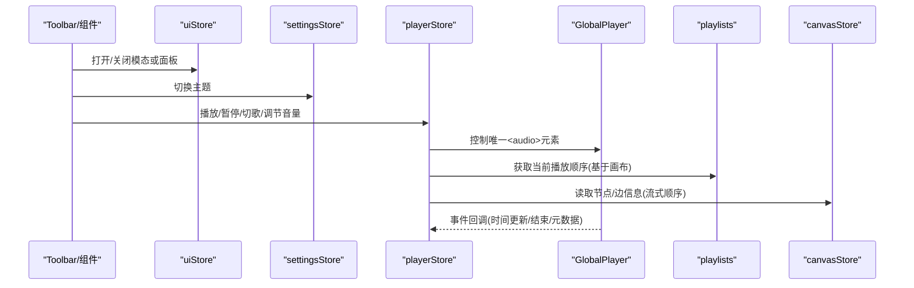
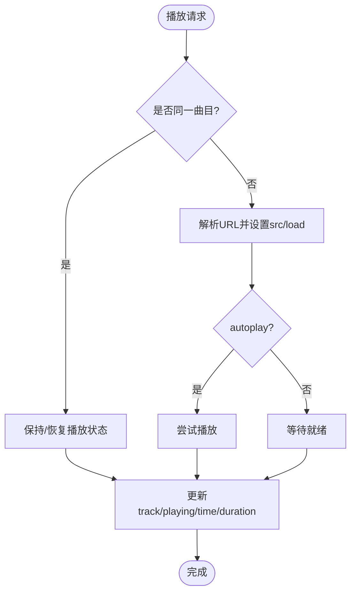
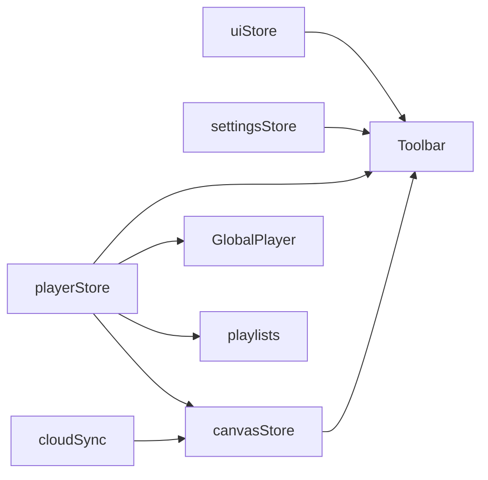

# UI与设置状态

<cite>
**本文引用的文件**
- [uiStore.ts](file://src/store/uiStore.ts)
- [settingsStore.ts](file://src/store/settingsStore.ts)
- [playerStore.ts](file://src/store/playerStore.ts)
- [canvasStore.ts](file://src/store/canvasStore.ts)
- [GlobalPlayer.tsx](file://src/components/GlobalPlayer.tsx)
- [playlists.ts](file://src/media/playlists.ts)
- [cloudSync.ts](file://src/sync/cloudSync.ts)
- [Toolbar.tsx](file://src/components/Toolbar.tsx)
</cite>

## 目录
1. [简介](#简介)
2. [项目结构](#项目结构)
3. [核心组件](#核心组件)
4. [架构总览](#架构总览)
5. [详细组件分析](#详细组件分析)
6. [依赖关系分析](#依赖关系分析)
7. [性能考虑](#性能考虑)
8. [故障排查指南](#故障排查指南)
9. [结论](#结论)
10. [附录](#附录)

## 简介
本文件聚焦于应用内 UI 界面与设置的状态管理，围绕三个核心 Store 展开：
- uiStore：负责界面状态控制，包括模态框、面板切换、工具模式、导入队列、通知等。
- settingsStore：负责用户偏好持久化，如主题配置（本地存储）。
- playerStore：负责播放器状态，包括播放控制、进度、音量、播放模式、可视化条显示等。

同时说明各 Store 之间的协作关系与数据流转机制，并给出状态同步（本地与云端）的最佳实践与性能优化建议。

## 项目结构
UI 与设置相关的状态主要分布在 store 目录下，配合组件层进行渲染与交互：
- store/uiStore.ts：集中管理 UI 相关的全局状态与动作。
- store/settingsStore.ts：管理主题等设置，并提供本地持久化能力。
- store/playerStore.ts：单一音频引擎的播放状态与行为。
- components/GlobalPlayer.tsx：全局音频元素与悬浮控制栏，绑定到 playerStore。
- components/Toolbar.tsx：顶部工具栏，订阅多个 Store 以驱动 UI。
- media/playlists.ts：从画布图结构派生歌单顺序，供播放器使用。
- sync/cloudSync.ts：云端同步能力（项目与素材元数据），用于多设备一致性。

图表来源
- [uiStore.ts:1-121](file://src/store/uiStore.ts#L1-L121)
- [settingsStore.ts:1-40](file://src/store/settingsStore.ts#L1-L40)
- [playerStore.ts:1-298](file://src/store/playerStore.ts#L1-L298)
- [canvasStore.ts:1-200](file://src/store/canvasStore.ts#L1-L200)
- [GlobalPlayer.tsx:1-234](file://src/components/GlobalPlayer.tsx#L1-L234)
- [playlists.ts:1-179](file://src/media/playlists.ts#L1-L179)
- [cloudSync.ts:1-165](file://src/sync/cloudSync.ts#L1-L165)

章节来源
- [uiStore.ts:1-121](file://src/store/uiStore.ts#L1-L121)
- [settingsStore.ts:1-40](file://src/store/settingsStore.ts#L1-L40)
- [playerStore.ts:1-298](file://src/store/playerStore.ts#L1-L298)
- [canvasStore.ts:1-200](file://src/store/canvasStore.ts#L1-L200)
- [GlobalPlayer.tsx:1-234](file://src/components/GlobalPlayer.tsx#L1-L234)
- [playlists.ts:1-179](file://src/media/playlists.ts#L1-L179)
- [cloudSync.ts:1-165](file://src/sync/cloudSync.ts#L1-L165)

## 核心组件
- uiStore：提供通知、PDF/图片/Markdown 查看器开关、音乐播放器入口、文件管理器开关、工具模式等。所有操作通过 set/get 原子更新，避免竞态。
- settingsStore：维护 theme，支持 setTheme/toggleTheme，并在变更时写入 localStorage 并立即应用到 DOM。
- playerStore：维护 track、playing、time、duration、volume、muted、mode、queue、barVisible 等；封装 play/toggle/seek/next/prev/setVolume/setMuted/setMode/setQueue/stop 等方法；与画布连线解析出的播放顺序联动。
- GlobalPlayer：挂载唯一 <audio> 元素，监听事件并回写 playerStore；提供悬浮控制栏与最小化小窗能力。
- Toolbar：订阅多个 Store，驱动按钮状态与交互，触发 UI 与播放行为。

章节来源
- [uiStore.ts:1-121](file://src/store/uiStore.ts#L1-L121)
- [settingsStore.ts:1-40](file://src/store/settingsStore.ts#L1-L40)
- [playerStore.ts:1-298](file://src/store/playerStore.ts#L1-L298)
- [GlobalPlayer.tsx:1-234](file://src/components/GlobalPlayer.tsx#L1-L234)
- [Toolbar.tsx:1-200](file://src/components/Toolbar.tsx#L1-L200)

## 架构总览
整体采用“单一真实源”的 Store 架构：
- UI 状态集中在 uiStore，由组件订阅并渲染。
- 设置状态在 settingsStore 中持久化到本地存储，页面加载时恢复。
- 播放状态在 playerStore 中统一管理，GlobalPlayer 作为唯一音频引擎的视图控制器。
- 播放顺序由 playlists 模块根据画布节点与边计算，保证一致性与可预测性。
- 云端同步通过 cloudSync 在项目与素材层面实现，登录状态下优先云端，未登录时回退本地。

图表来源
- [uiStore.ts:1-121](file://src/store/uiStore.ts#L1-L121)
- [settingsStore.ts:1-40](file://src/store/settingsStore.ts#L1-L40)
- [playerStore.ts:1-298](file://src/store/playerStore.ts#L1-L298)
- [GlobalPlayer.tsx:1-234](file://src/components/GlobalPlayer.tsx#L1-L234)
- [playlists.ts:1-179](file://src/media/playlists.ts#L1-L179)
- [canvasStore.ts:1-200](file://src/store/canvasStore.ts#L1-L200)

## 详细组件分析

### uiStore：界面状态控制
- 模态框与查看器：PDF、图片、Markdown 查看器均通过 open/close 方法控制其可见状态。
- 面板切换：文件管理器开关、首页开关、音乐播放器入口（openMusicPlayer）统一由 uiStore 管理。
- 工具模式：select/connect/drag 三种模式，影响画布交互行为。
- 通知系统：pushToast/removeToast 提供自动消失的通知队列。
- 导入队列：requestImport/consumeImport 用于异步导入流程的协调。

最佳实践
- 将互斥的弹窗/面板状态设计为单一字段，避免多重状态组合导致的不一致。
- 对高频 UI 操作（如通知）使用批量或节流策略，减少重渲染。

章节来源
- [uiStore.ts:1-121](file://src/store/uiStore.ts#L1-L121)

### settingsStore：设置持久化
- 主题：支持 dark/light，初始值可从 URL 参数或 localStorage 恢复，默认 dark。
- 持久化：setTheme 会写入 localStorage 并立即调用 applyTheme 更新 DOM class。
- 扩展点：可在该 Store 中增加语言、字体、布局偏好等设置项，遵循同样的持久化模式。

章节来源
- [settingsStore.ts:1-40](file://src/store/settingsStore.ts#L1-L40)

### playerStore：播放器状态与行为
- 播放控制：play/toggle/seekTo/seekBy/next/prev/stop 覆盖常用播放场景。
- 进度与时长：time/duration 由 GlobalPlayer 的事件回写，确保 UI 与引擎同步。
- 音量与静音：setVolume/setMuted 直接映射到 <audio> 元素属性。
- 播放模式：sequential/random/loop/single/flow，影响 next/prev 与自动续播逻辑。
- 队列：flow 模式下支持 PlaylistQueue，离开 flow 模式清空队列。
- 可视化条：barVisible 控制悬浮控制栏显示。

与画布联动的关键点
- baseOrder：优先级为“队列 > 播放器列表提供者 > 画布连线顺序”。
- graphOrderFor：通过 canvasStore 的 nodes/edges 解析出从某音频节点开始的线性顺序。
- handleEnded：歌曲结束后按模式自动选择下一首或单曲循环。

图表来源
- [playerStore.ts:174-209](file://src/store/playerStore.ts#L174-L209)
- [playerStore.ts:132-161](file://src/store/playerStore.ts#L132-L161)

章节来源
- [playerStore.ts:1-298](file://src/store/playerStore.ts#L1-L298)
- [playlists.ts:1-179](file://src/media/playlists.ts#L1-L179)
- [canvasStore.ts:1-200](file://src/store/canvasStore.ts#L1-L200)

### GlobalPlayer：唯一音频引擎的视图
- 生命周期：挂载时注册唯一 <audio> 元素，并暴露 bindPlayerAudio/getPlayerAudioElement 给其他模块访问。
- 事件绑定：onPlay/onPause/onTimeUpdate/onLoadedMetadata/onDurationChange/onEnded 将引擎状态同步回 playerStore。
- 悬浮控制栏：支持拖拽、收起/展开、最小化为桌面级小窗（PiP）。
- 与画布联动：根据当前播放曲目查找所属歌单名，便于展示上下文。

章节来源
- [GlobalPlayer.tsx:1-234](file://src/components/GlobalPlayer.tsx#L1-L234)

### 播放顺序与歌单解析
- linearizeFrom：从指定音频节点出发，沿音频→音频的边做深度优先先序遍历，去重并检测环。
- resolvePlaylists：扫描命名文本节点与指向关系，构建歌单列表。
- findPlaylistByAsset：根据 assetId 查找包含该曲目的歌单。
- 缓存：resolvePlaylistsCached 基于引用相等缓存结果，避免重复解析。

章节来源
- [playlists.ts:1-179](file://src/media/playlists.ts#L1-L179)

### 云端同步与多设备一致性
- 登录判断：isCloudAuthed 决定后续同步行为。
- 项目同步：syncProjectList 与 loadProjectBest 在未登录时仅本地，登录后仅云端。
- 素材元数据：upsertAssetMetaToCloud/deleteAssetFromCloud/fetchCloudAssets 管理素材清单。
- 项目 CRUD：fetch/upsert/update/delete 项目记录。

注意：当前 settingsStore 的主题设置仅本地持久化，未接入云端同步。若需多设备一致的主题/语言偏好，可扩展至云端。

章节来源
- [cloudSync.ts:1-165](file://src/sync/cloudSync.ts#L1-L165)

## 依赖关系分析
- GlobalPlayer 依赖 playerStore 控制音频元素，并通过 registerAudio 暴露给媒体协调器。
- playerStore 依赖 canvasStore 获取画布节点/边以解析播放顺序，依赖 playlists 模块计算线性序列。
- Toolbar 订阅 uiStore、settingsStore、playerStore、canvasStore，驱动界面交互。
- cloudSync 与 canvasStore/projectStore 协同，实现项目与素材的云端读写。

图表来源
- [uiStore.ts:1-121](file://src/store/uiStore.ts#L1-L121)
- [settingsStore.ts:1-40](file://src/store/settingsStore.ts#L1-L40)
- [playerStore.ts:1-298](file://src/store/playerStore.ts#L1-L298)
- [canvasStore.ts:1-200](file://src/store/canvasStore.ts#L1-L200)
- [GlobalPlayer.tsx:1-234](file://src/components/GlobalPlayer.tsx#L1-L234)
- [playlists.ts:1-179](file://src/media/playlists.ts#L1-L179)
- [cloudSync.ts:1-165](file://src/sync/cloudSync.ts#L1-L165)

章节来源
- [uiStore.ts:1-121](file://src/store/uiStore.ts#L1-L121)
- [settingsStore.ts:1-40](file://src/store/settingsStore.ts#L1-L40)
- [playerStore.ts:1-298](file://src/store/playerStore.ts#L1-L298)
- [canvasStore.ts:1-200](file://src/store/canvasStore.ts#L1-L200)
- [GlobalPlayer.tsx:1-234](file://src/components/GlobalPlayer.tsx#L1-L234)
- [playlists.ts:1-179](file://src/media/playlists.ts#L1-L179)
- [cloudSync.ts:1-165](file://src/sync/cloudSync.ts#L1-L165)

## 性能考虑
- 播放状态更新
  - 使用单次 set 合并多次状态变更，避免多余重渲染。
  - 对频繁更新的 time/duration 使用局部订阅（如只订阅必要字段），降低组件重绘范围。
- 歌单解析
  - 使用 resolvePlaylistsCached 基于引用缓存，避免每次渲染都重新解析整张图。
- 历史与撤销
  - 使用防抖与快照合并（HISTORY_DEBOUNCE/HISTORY_LIMIT）减少历史记录膨胀与重算。
- 云端同步
  - 仅在登录状态下启用云端同步，未登录时完全本地，避免无效网络请求。
  - 素材元数据 upsert 失败时降级处理，不影响主流程。
- UI 交互
  - 通知自动消失，避免长期占用内存。
  - 悬浮控制栏拖拽位置钳制在视口内，防止越界导致的布局抖动。

[本节为通用性能建议，不直接分析具体代码行]

## 故障排查指南
- 播放无法开始
  - 检查 audio 元素是否正确绑定到 playerStore（bindPlayerAudio）。
  - 确认 canplay/loadeddata 事件是否触发，必要时在 canplay 时重试播放。
- 切歌异常
  - 检查 baseOrder 返回值是否为空，确认队列/列表提供者/画布连线顺序是否有效。
  - 验证 linearizeFrom 是否检测到环或重复节点，关注 warnings。
- 主题未生效
  - 确认 applyTheme 已调用且 DOM class 正确切换。
  - 检查 localStorage 是否可读/可写（浏览器隐私模式可能限制）。
- 云端同步失败
  - 检查 isCloudAuthed 返回，确认登录状态。
  - 查看错误日志（console.warn）定位 Supabase 或 OSS 问题。

章节来源
- [playerStore.ts:72-88](file://src/store/playerStore.ts#L72-L88)
- [playerStore.ts:132-161](file://src/store/playerStore.ts#L132-L161)
- [settingsStore.ts:13-27](file://src/store/settingsStore.ts#L13-L27)
- [cloudSync.ts:18-27](file://src/sync/cloudSync.ts#L18-L27)
- [cloudSync.ts:121-143](file://src/sync/cloudSync.ts#L121-L143)

## 结论
- uiStore 提供了统一的界面状态入口，适合管理模态框、面板、工具模式与通知等。
- settingsStore 实现了简洁可靠的本地设置持久化，易于扩展更多偏好项。
- playerStore 作为单一播放引擎的状态中心，结合 playlists 与 canvasStore，实现了稳定一致的播放顺序与行为。
- 云端同步在项目与素材层面提供多设备一致性，但用户偏好（主题/语言）目前仅本地持久化，可按需扩展。
- 建议在复杂交互场景中继续使用“单一真实源”的 Store 模式，并结合缓存、防抖与选择性订阅提升性能。

[本节为总结性内容，不直接分析具体代码行]

## 附录
- 推荐实践
  - 将互斥 UI 状态合并为单一字段，避免组合爆炸。
  - 对耗时计算（如图结构解析）使用缓存与惰性求值。
  - 对网络请求（云端同步）做好降级与错误提示。
  - 对高频 UI 更新（如进度条）使用局部订阅与节流。
- 扩展方向
  - 在 settingsStore 中增加语言、字体、布局偏好等，并考虑云端同步。
  - 在 uiStore 中增加响应式布局状态（如侧边栏折叠、面板尺寸），结合媒体查询或窗口尺寸事件。
  - 在 playerStore 中增加可视化状态（频谱/波形）的开关与采样频率控制。

[本节为概念性内容，不直接分析具体代码行]