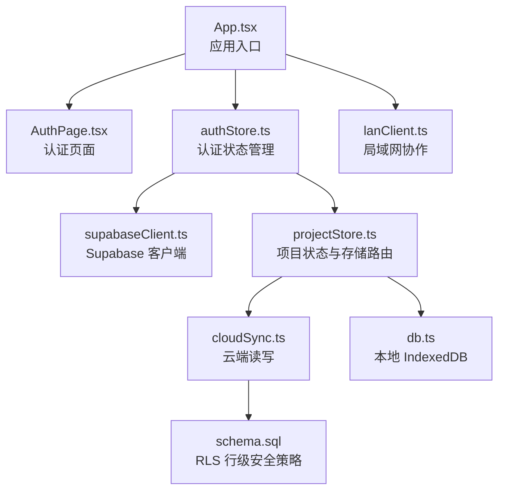
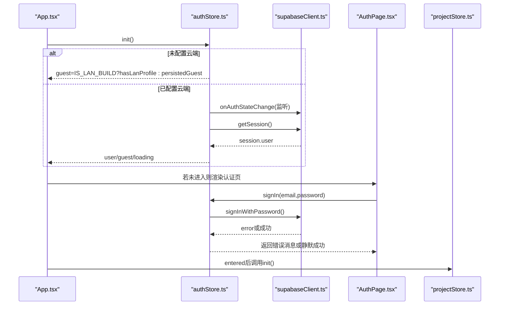
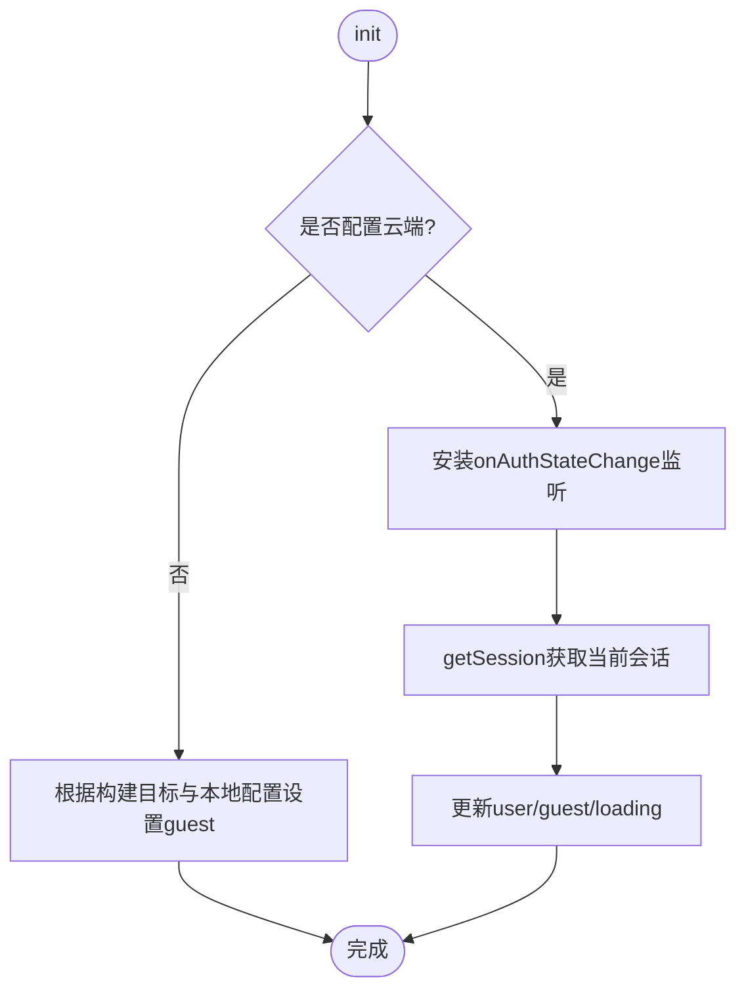
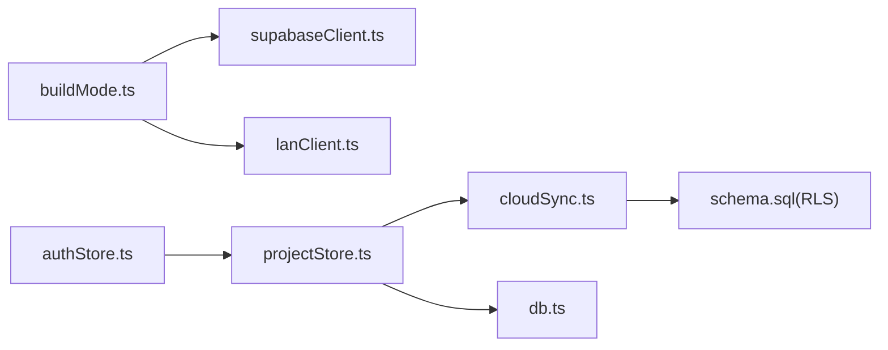

# 认证流程管理

<cite>
**本文引用的文件**
- [src/store/authStore.ts](file://src/store/authStore.ts)
- [src/components/AuthPage.tsx](file://src/components/AuthPage.tsx)
- [src/sync/supabaseClient.ts](file://src/sync/supabaseClient.ts)
- [src/App.tsx](file://src/App.tsx)
- [src/buildMode.ts](file://src/buildMode.ts)
- [src/sync/cloudSync.ts](file://src/sync/cloudSync.ts)
- [supabase/schema.sql](file://supabase/schema.sql)
- [src/sync/lanClient.ts](file://src/sync/lanClient.ts)
- [src/store/projectStore.ts](file://src/store/projectStore.ts)
</cite>

## 目录
1. [简介](#简介)
2. [项目结构](#项目结构)
3. [核心组件](#核心组件)
4. [架构总览](#架构总览)
5. [详细组件分析](#详细组件分析)
6. [依赖关系分析](#依赖关系分析)
7. [性能与可靠性](#性能与可靠性)
8. [故障排查指南](#故障排查指南)
9. [结论](#结论)
10. [附录：API 使用与集成示例](#附录api-使用与集成示例)

## 简介
本文件围绕“认证流程的状态管理”展开，系统梳理用户认证状态（登录验证、令牌管理、会话保持）、权限控制机制（角色权限、资源访问控制、操作授权）、认证状态的持久化（本地存储、自动登录、安全退出），以及认证错误处理策略（网络异常、令牌过期、权限不足）。同时给出认证相关 API 的使用方式与集成要点，并说明认证状态与项目存储的关联关系及不同认证状态下的数据存储策略。

## 项目结构
认证体系由前端状态管理、云端认证客户端、构建模式开关、云同步层、数据库行级安全策略以及局域网协作通道共同组成。关键路径如下：
- 应用入口初始化认证状态，并根据是否已登录或游客模式决定渲染页面。
- 登录页提供邮箱密码登录、游客模式、局域网协作连接入口。
- 认证状态通过 Supabase 客户端维护会话与监听状态变化。
- 项目数据根据当前认证身份选择云端或本地存储。
- 局域网模式下，认证退化为“连接中继 + 游客态”，不依赖云端账号。

图表来源
- [src/App.tsx:19-47](file://src/App.tsx#L19-L47)
- [src/components/AuthPage.tsx:11-73](file://src/components/AuthPage.tsx#L11-L73)
- [src/store/authStore.ts:44-103](file://src/store/authStore.ts#L44-L103)
- [src/sync/supabaseClient.ts:1-18](file://src/sync/supabaseClient.ts#L1-L18)
- [src/store/projectStore.ts:38-41](file://src/store/projectStore.ts#L38-L41)
- [src/sync/cloudSync.ts:148-165](file://src/sync/cloudSync.ts#L148-L165)
- [supabase/schema.sql:57-77](file://supabase/schema.sql#L57-L77)

章节来源
- [src/App.tsx:19-47](file://src/App.tsx#L19-L47)
- [src/components/AuthPage.tsx:11-73](file://src/components/AuthPage.tsx#L11-L73)
- [src/store/authStore.ts:44-103](file://src/store/authStore.ts#L44-L103)
- [src/sync/supabaseClient.ts:1-18](file://src/sync/supabaseClient.ts#L1-L18)
- [src/store/projectStore.ts:38-41](file://src/store/projectStore.ts#L38-L41)
- [src/sync/cloudSync.ts:148-165](file://src/sync/cloudSync.ts#L148-L165)
- [supabase/schema.sql:57-77](file://supabase/schema.sql#L57-L77)

## 核心组件
- 认证状态 store：集中管理用户对象、游客态、加载态，提供初始化、登录、登出、进入游客模式的接口，并监听 Supabase 会话变化以维持会话一致性。
- 认证页面：封装登录表单、注册提示、游客模式入口；在局域网构建下切换为连接中继界面。
- Supabase 客户端：根据构建目标决定是否注入 Supabase 实例，并提供配置检测函数。
- 项目存储路由：根据是否已登录云端账号，将项目列表与单项目读取分别指向云端或本地。
- 行级安全策略：数据库侧按 user_id 隔离资源，确保每个用户只能访问自己的项目和素材元数据。
- 局域网协作：独立于云端认证的协作通道，支持断线重连、自动恢复、房间级同步。

章节来源
- [src/store/authStore.ts:8-16](file://src/store/authStore.ts#L8-L16)
- [src/components/AuthPage.tsx:11-73](file://src/components/AuthPage.tsx#L11-L73)
- [src/sync/supabaseClient.ts:1-18](file://src/sync/supabaseClient.ts#L1-L18)
- [src/store/projectStore.ts:38-41](file://src/store/projectStore.ts#L38-L41)
- [supabase/schema.sql:57-77](file://supabase/schema.sql#L57-L77)
- [src/sync/lanClient.ts:119-152](file://src/sync/lanClient.ts#L119-L152)

## 架构总览
下图展示认证流程从应用启动到页面渲染的关键交互，包括会话初始化、登录校验、游客模式与局域网协作分支。

图表来源
- [src/App.tsx:25-47](file://src/App.tsx#L25-L47)
- [src/store/authStore.ts:49-82](file://src/store/authStore.ts#L49-L82)
- [src/components/AuthPage.tsx:61-73](file://src/components/AuthPage.tsx#L61-L73)
- [src/sync/supabaseClient.ts:1-18](file://src/sync/supabaseClient.ts#L1-L18)
- [src/store/projectStore.ts:81-117](file://src/store/projectStore.ts#L81-L117)

## 详细组件分析

### 认证状态管理（authStore）
- 状态字段
  - user：当前登录用户（云端）
  - guest：游客模式标志
  - loading：初始化中标志
- 生命周期
  - init：首次加载时判断是否配置云端；若未配置则在局域网构建下检查本地保存的中继配置，否则按本地游客标记设置 guest；若已配置云端，则安装会话监听并获取当前会话，更新 user/guest/loading。
  - signIn：调用云端登录，错误信息被翻译为用户友好的中文提示。
  - signOut：调用云端登出（如存在），重置项目与画布状态，清除游客标记，清空用户与游客态。
  - enterGuest：写入本地游客标记，重置项目与画布状态，进入游客模式。
- 项目状态重置
  - 切换登录态或进入游客模式时，会重置项目 ID、名称、加载状态、历史等，避免云端与本地数据串写。

图表来源
- [src/store/authStore.ts:49-82](file://src/store/authStore.ts#L49-L82)

章节来源
- [src/store/authStore.ts:18-103](file://src/store/authStore.ts#L18-L103)

### 认证页面（AuthPage）
- 功能
  - 登录表单：校验环境变量是否配置云端，提交邮箱密码进行登录。
  - 游客模式：一键进入游客模式，仅本地数据。
  - 局域网构建：显示连接中继表单，输入地址与协作名称，成功后进入游客态。
- 错误处理
  - 未配置云端：提示无法登录。
  - 连接失败：提示检查局域网地址和中继服务。
  - 表单校验：必填项为空时提示。

章节来源
- [src/components/AuthPage.tsx:11-73](file://src/components/AuthPage.tsx#L11-L73)
- [src/components/AuthPage.tsx:75-130](file://src/components/AuthPage.tsx#L75-L130)
- [src/components/AuthPage.tsx:132-238](file://src/components/AuthPage.tsx#L132-L238)

### 云端认证客户端（supabaseClient）
- 构建期裁剪：仅在在线构建且环境变量齐全时创建 Supabase 客户端，否则为 null。
- 配置检测：提供 isCloudConfigured 用于前端判断是否启用云端登录能力。

章节来源
- [src/sync/supabaseClient.ts:1-18](file://src/sync/supabaseClient.ts#L1-L18)
- [src/buildMode.ts:1-8](file://src/buildMode.ts#L1-L8)

### 项目存储路由（projectStore）
- 存储策略
  - 已登录云端：项目列表与单项目读取均走云端；保存时写入云端。
  - 游客或未登录：项目列表与单项目读取均走本地 IndexedDB；保存时写入本地。
- 自动保存
  - 订阅画布变更，防抖触发保存；保存失败时设置错误状态并提示。
- 新建/重命名/删除
  - 根据当前认证身份选择云端或本地存储路径。

章节来源
- [src/store/projectStore.ts:38-41](file://src/store/projectStore.ts#L38-L41)
- [src/store/projectStore.ts:81-117](file://src/store/projectStore.ts#L81-L117)
- [src/store/projectStore.ts:149-182](file://src/store/projectStore.ts#L149-L182)
- [src/store/projectStore.ts:184-229](file://src/store/projectStore.ts#L184-L229)

### 云端同步（cloudSync）
- 鉴权前置：所有云端操作先检查是否已登录云端账号，未登录直接返回空或忽略。
- 项目与素材
  - 项目列表与单项目读取：登录后走云端，否则走本地。
  - 素材元数据：上传/查询/删除均附带当前用户标识，受 RLS 保护。

章节来源
- [src/sync/cloudSync.ts:18-27](file://src/sync/cloudSync.ts#L18-L27)
- [src/sync/cloudSync.ts:148-165](file://src/sync/cloudSync.ts#L148-L165)

### 数据库权限控制（schema.sql）
- 行级安全（RLS）
  - projects 与 assets 表启用 RLS，策略限定 authenticated 用户只能读写 user_id 等于当前 auth.uid() 的记录。
- 影响
  - 即使前端逻辑正确，后端也会拒绝越权访问；这是资源访问控制的最终保障。

章节来源
- [supabase/schema.sql:57-77](file://supabase/schema.sql#L57-L77)

### 局域网协作（lanClient）
- 连接与会话
  - 解析并校验 WebSocket 地址，建立连接后发送 hello 消息，加入项目房间。
  - 断线自动重连，指数退避，保留上次连接配置，刷新后自动重连。
- 数据同步
  - 画布节点/连线增量合并，显式删除消息传播，墓碑机制防止晚到快照复活。
  - 视口、光标、编辑状态、活动日志等同步。
- 错误处理
  - 连接失败、错误事件、超时等待均有明确提示与状态回退。

章节来源
- [src/sync/lanClient.ts:19-57](file://src/sync/lanClient.ts#L19-L57)
- [src/sync/lanClient.ts:119-152](file://src/sync/lanClient.ts#L119-L152)
- [src/sync/lanClient.ts:254-362](file://src/sync/lanClient.ts#L254-L362)
- [src/sync/lanClient.ts:364-407](file://src/sync/lanClient.ts#L364-L407)
- [src/sync/lanClient.ts:527-598](file://src/sync/lanClient.ts#L527-L598)

## 依赖关系分析
- 构建模式决定运行时能力：在线构建启用 Supabase，局域网构建禁用并启用局域网协作。
- 认证状态驱动项目存储路由：isCloudUser 决定云端或本地读写。
- 云端数据受 RLS 约束：即使前端绕过，后端仍会拒绝越权。
- 局域网协作独立于云端认证：不依赖 Supabase，但可复用项目模型与画布状态。

图表来源
- [src/buildMode.ts:1-8](file://src/buildMode.ts#L1-L8)
- [src/sync/supabaseClient.ts:1-18](file://src/sync/supabaseClient.ts#L1-L18)
- [src/store/authStore.ts:44-103](file://src/store/authStore.ts#L44-L103)
- [src/store/projectStore.ts:38-41](file://src/store/projectStore.ts#L38-L41)
- [src/sync/cloudSync.ts:148-165](file://src/sync/cloudSync.ts#L148-L165)
- [supabase/schema.sql:57-77](file://supabase/schema.sql#L57-L77)

章节来源
- [src/buildMode.ts:1-8](file://src/buildMode.ts#L1-L8)
- [src/sync/supabaseClient.ts:1-18](file://src/sync/supabaseClient.ts#L1-L18)
- [src/store/authStore.ts:44-103](file://src/store/authStore.ts#L44-L103)
- [src/store/projectStore.ts:38-41](file://src/store/projectStore.ts#L38-L41)
- [src/sync/cloudSync.ts:148-165](file://src/sync/cloudSync.ts#L148-L165)
- [supabase/schema.sql:57-77](file://supabase/schema.sql#L57-L77)

## 性能与可靠性
- 会话监听只安装一次，避免重复订阅。
- 自动保存采用防抖，减少频繁写入。
- 局域网协作使用分片传输、空闲超时、墓碑机制与增量合并，提升大文件与多人协作稳定性。
- 云端请求前进行鉴权检查，避免无效网络开销。

[本节为通用指导，无需特定文件引用]

## 故障排查指南
- 网络异常
  - 局域网连接失败：检查地址格式、反向代理配置、HTTPS 页面需 WSS。
  - 云端请求失败：确认环境变量配置、网络连通性。
- 令牌过期
  - 使用 Supabase 会话监听自动刷新；若登出后重新登录，项目状态会被重置以避免串写。
- 权限不足
  - 云端 RLS 限制：确保 user_id 匹配当前用户；若旧数据 user_id 为空，登录后不可见，需要迁移或清理。
- 游客模式
  - 游客模式仅本地数据；切换登录态会重置项目状态，注意备份本地重要内容。

章节来源
- [src/sync/lanClient.ts:19-57](file://src/sync/lanClient.ts#L19-L57)
- [src/sync/lanClient.ts:345-362](file://src/sync/lanClient.ts#L345-L362)
- [src/store/authStore.ts:67-82](file://src/store/authStore.ts#L67-L82)
- [supabase/schema.sql:79-87](file://supabase/schema.sql#L79-L87)

## 结论
该项目的认证流程以 Zustand 状态管理为核心，结合 Supabase 会话管理与数据库行级安全策略，实现了云端与本地双轨的数据存储与访问控制。局域网协作作为独立通道，提供了离线场景下的实时协同能力。整体设计清晰、健壮，具备完善的错误处理与状态持久化机制。

[本节为总结性内容，无需特定文件引用]

## 附录：API 使用与集成示例
- 初始化认证
  - 在应用入口调用认证 store 的 init，随后根据是否进入应用决定渲染认证页或主界面。
  - 参考路径：[src/App.tsx:25-47](file://src/App.tsx#L25-L47)
- 登录
  - 在认证页提交邮箱与密码，调用 signIn；错误信息将被翻译为中文提示。
  - 参考路径：[src/components/AuthPage.tsx:61-73](file://src/components/AuthPage.tsx#L61-L73)
  - 参考路径：[src/store/authStore.ts:84-88](file://src/store/authStore.ts#L84-L88)
- 登出
  - 调用 signOut 清除云端会话与本地游客标记，并重置项目与画布状态。
  - 参考路径：[src/store/authStore.ts:90-96](file://src/store/authStore.ts#L90-L96)
- 游客模式
  - 调用 enterGuest 进入游客模式，仅本地数据。
  - 参考路径：[src/store/authStore.ts:98-102](file://src/store/authStore.ts#L98-L102)
- 项目存储路由
  - 根据是否已登录云端账号，选择云端或本地存储。
  - 参考路径：[src/store/projectStore.ts:38-41](file://src/store/projectStore.ts#L38-L41)
  - 参考路径：[src/sync/cloudSync.ts:148-165](file://src/sync/cloudSync.ts#L148-L165)
- 局域网协作
  - 在局域网构建下，输入中继地址与协作名称，连接成功后进入游客态。
  - 参考路径：[src/components/AuthPage.tsx:75-130](file://src/components/AuthPage.tsx#L75-L130)
  - 参考路径：[src/sync/lanClient.ts:254-362](file://src/sync/lanClient.ts#L254-L362)

[本节为集成指引，具体代码片段请参见上述路径]