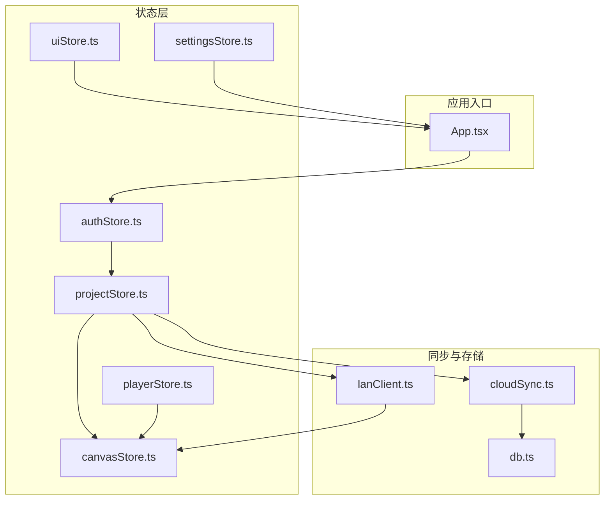
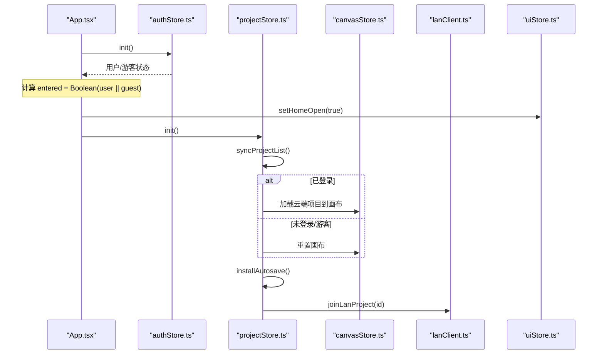
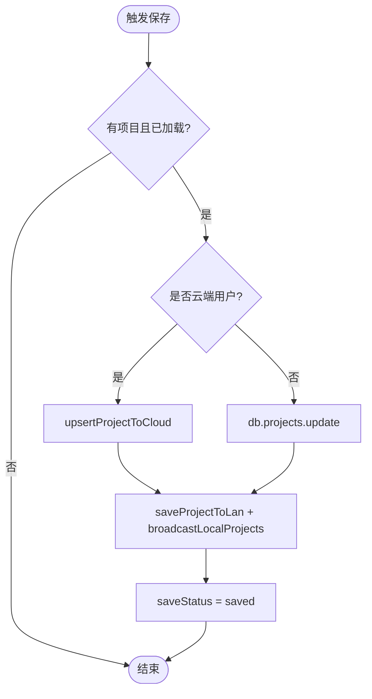
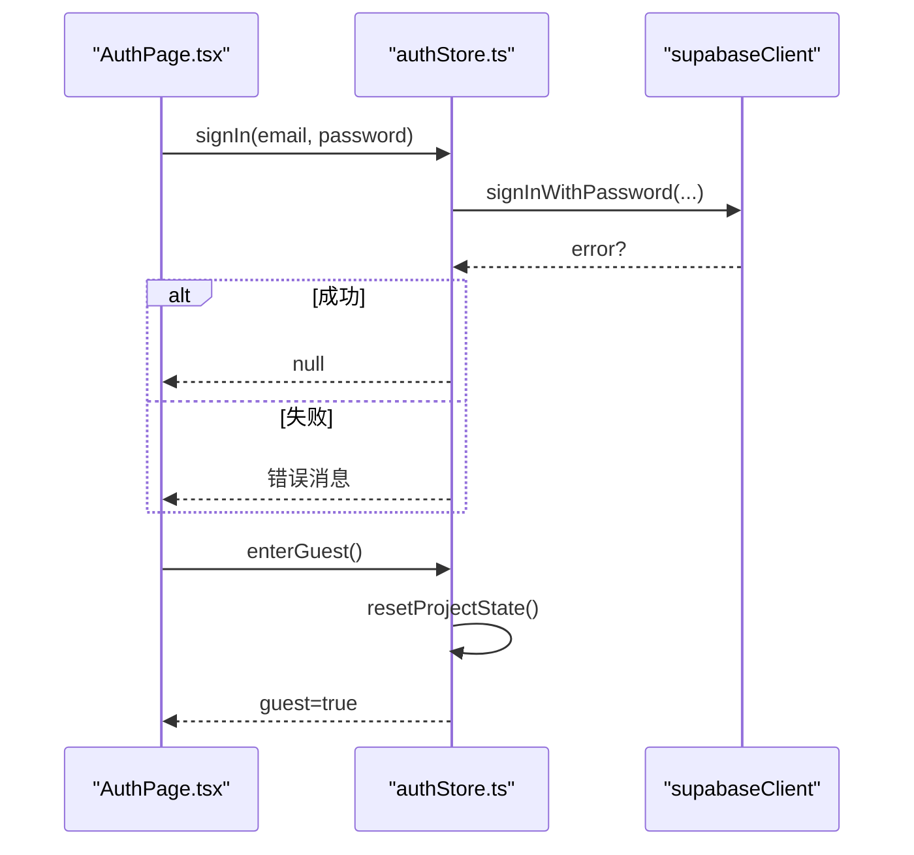
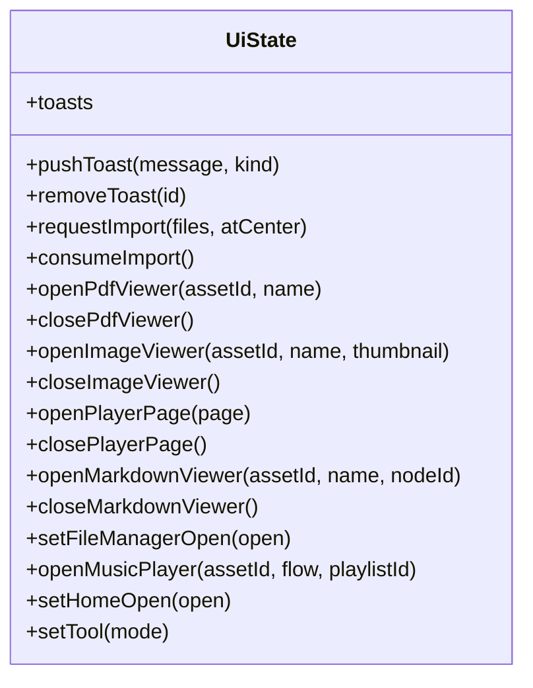
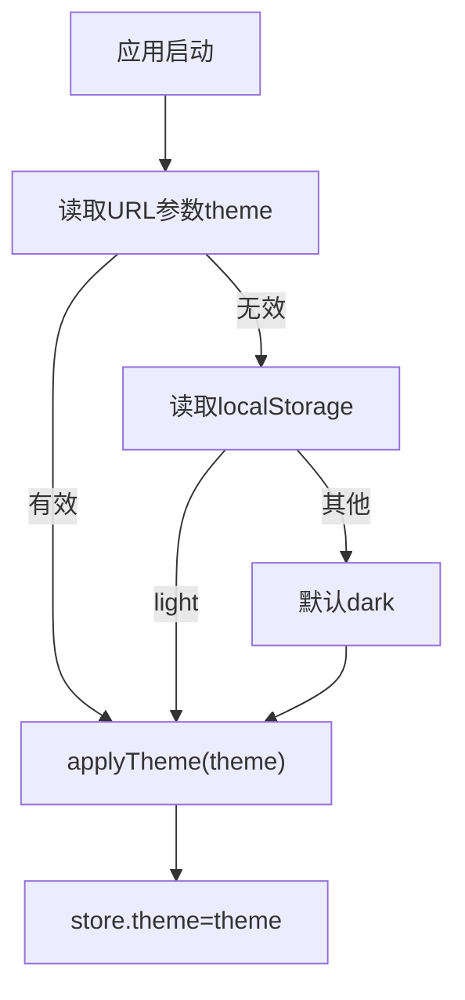
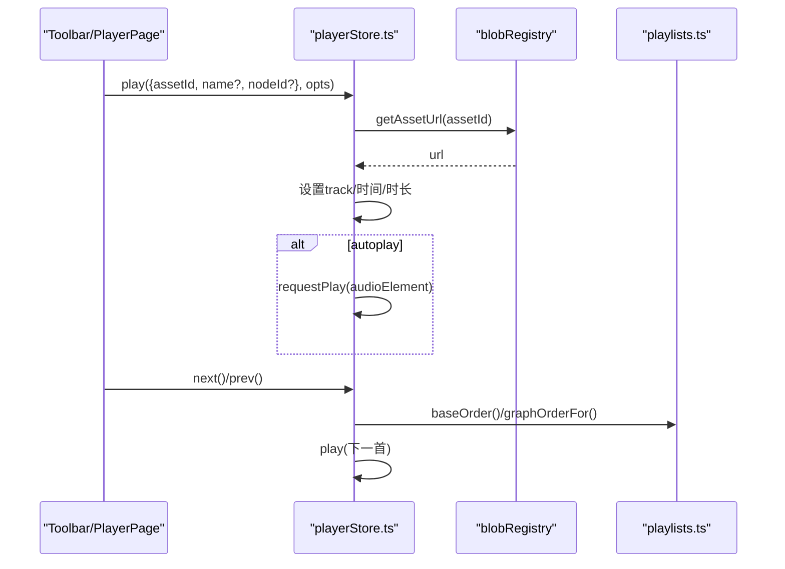
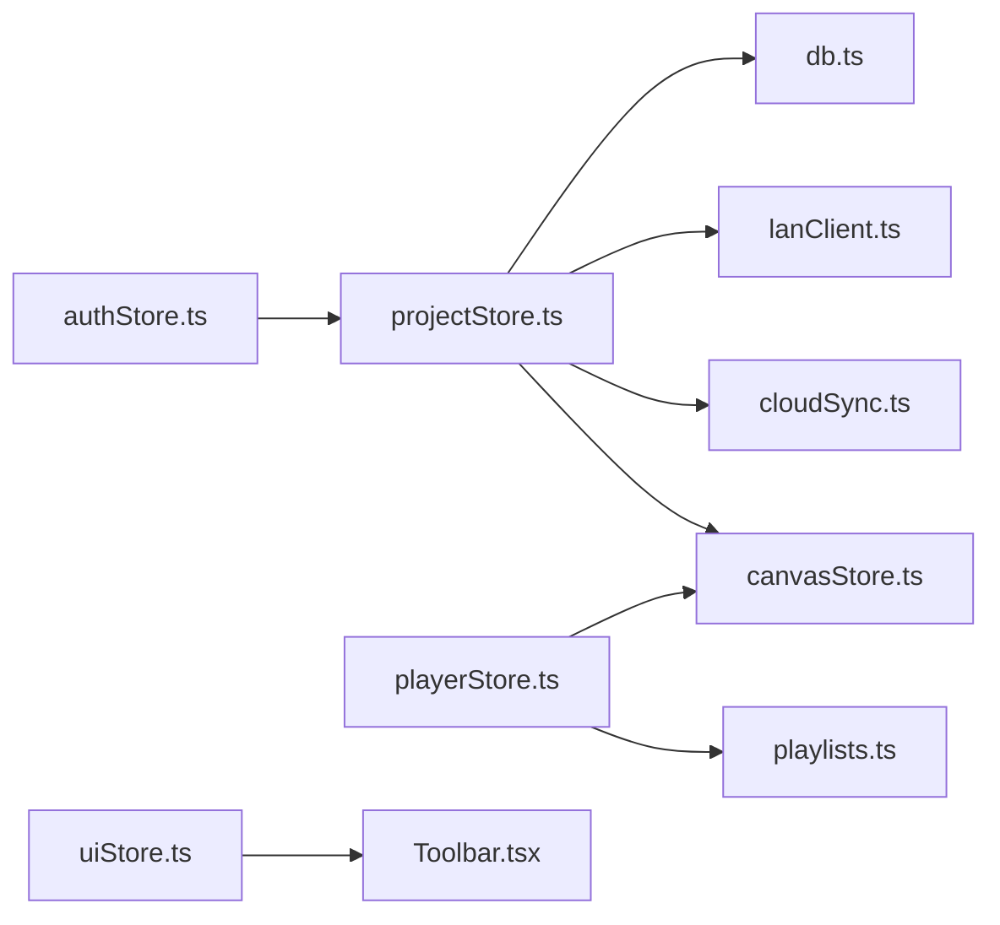

# 项目、认证与UI状态

<cite>
**本文引用的文件**
- [projectStore.ts](file://src/store/projectStore.ts)
- [authStore.ts](file://src/store/authStore.ts)
- [uiStore.ts](file://src/store/uiStore.ts)
- [settingsStore.ts](file://src/store/settingsStore.ts)
- [playerStore.ts](file://src/store/playerStore.ts)
- [canvasStore.ts](file://src/store/canvasStore.ts)
- [cloudSync.ts](file://src/sync/cloudSync.ts)
- [lanClient.ts](file://src/sync/lanClient.ts)
- [playlists.ts](file://src/media/playlists.ts)
- [db.ts](file://src/db/db.ts)
- [App.tsx](file://src/App.tsx)
- [AuthPage.tsx](file://src/components/AuthPage.tsx)
- [Toolbar.tsx](file://src/components/Toolbar.tsx)
</cite>

## 更新摘要
**变更内容**
- 更新了App组件中的entered状态判断逻辑，优化了应用启动流程
- 改进了认证状态与项目初始化的依赖关系管理
- 增强了用户登录态和游客模式的切换处理

## 目录
1. [简介](#简介)
2. [项目结构](#项目结构)
3. [核心组件](#核心组件)
4. [架构总览](#架构总览)
5. [详细组件分析](#详细组件分析)
6. [依赖关系分析](#依赖关系分析)
7. [性能考量](#性能考量)
8. [故障排查指南](#故障排查指南)
9. [结论](#结论)
10. [附录：API 参考与集成示例](#附录api-参考与集成示例)

## 简介
本文件面向 SuQCanvas 的状态管理层，围绕以下目标展开：
- projectStore：项目的创建、保存、加载、重命名与自动保存机制。
- authStore：用户登录、登出、游客模式与权限控制的状态流转。
- uiStore：界面状态控制（模态框、面板切换、工具栏状态、导入队列等）。
- settingsStore：主题等设置持久化。
- playerStore：播放器状态管理（播放控制、进度、音量、模式、队列）。

文档同时提供各 Store 的 API 参考与在组件中的集成示例路径，帮助开发者快速理解并扩展状态逻辑。

## 项目结构
SuQCanvas 使用 Zustand 作为全局状态容器，按职责拆分为多个 store：
- 项目与画布：projectStore、canvasStore
- 认证与会话：authStore
- 界面交互：uiStore
- 设置：settingsStore
- 媒体播放：playerStore
- 同步与存储：cloudSync、lanClient、db

图表来源
- [App.tsx:20-78](file://src/App.tsx#L20-L78)
- [projectStore.ts:69-229](file://src/store/projectStore.ts#L69-L229)
- [authStore.ts:44-103](file://src/store/authStore.ts#L44-L103)
- [uiStore.ts:49-116](file://src/store/uiStore.ts#L49-L116)
- [settingsStore.ts:29-39](file://src/store/settingsStore.ts#L29-L39)
- [playerStore.ts:163-291](file://src/store/playerStore.ts#L163-L291)
- [canvasStore.ts:118-398](file://src/store/canvasStore.ts#L118-L398)
- [cloudSync.ts:148-165](file://src/sync/cloudSync.ts#L148-L165)
- [lanClient.ts:718-756](file://src/sync/lanClient.ts#L718-L756)
- [db.ts:25-33](file://src/db/db.ts#L25-L33)

章节来源
- [App.tsx:20-78](file://src/App.tsx#L20-L78)

## 核心组件
- projectStore：负责项目生命周期（新建、加载、保存、重命名）、自动保存、云端/本地数据源选择、局域网协作加入。
- authStore：维护登录态、游客态、Supabase 会话监听、错误翻译、切换登录态时重置项目/画布状态。
- uiStore：集中管理 Toast、导入队列、PDF/图片/Markdown 查看器、播放器页、文件管理器、工具模式等。
- settingsStore：主题切换与持久化，支持 URL 参数覆盖。
- playerStore：单一音频引擎，统一播放控制、顺序/随机/循环/单曲/流式模式、队列、进度、音量、静音、可视化条显示。

章节来源
- [projectStore.ts:19-34](file://src/store/projectStore.ts#L19-L34)
- [authStore.ts:8-16](file://src/store/authStore.ts#L8-L16)
- [uiStore.ts:18-45](file://src/store/uiStore.ts#L18-L45)
- [settingsStore.ts:7-11](file://src/store/settingsStore.ts#L7-L11)
- [playerStore.ts:25-50](file://src/store/playerStore.ts#L25-L50)

## 架构总览
整体状态流：
- App 初始化 authStore，根据构建模式决定是否自动连接局域网；进入后打开首页并初始化项目。
- **更新**：App 组件现在使用优化的 entered 状态判断逻辑，仅依赖布尔值避免重复渲染。
- projectStore.init 读取项目列表（登录后仅云端，否则本地），加载最新或重置画布，安装自动保存订阅。
- canvasStore 维护节点、边、视口与撤销历史，并在局域网模式下广播变更。
- uiStore 驱动各类模态框与工具栏状态，供 Toolbar 等组件消费。
- settingsStore 控制主题类名与本地存储。
- playerStore 通过绑定全局 <audio> 元素实现统一播放，结合 playlists 解析画布连线顺序。

图表来源
- [App.tsx:26-42](file://src/App.tsx#L26-L42)
- [authStore.ts:49-82](file://src/store/authStore.ts#L49-L82)
- [projectStore.ts:81-117](file://src/store/projectStore.ts#L81-L117)
- [lanClient.ts:767-776](file://src/sync/lanClient.ts#L767-L776)

## 详细组件分析

### projectStore：项目生命周期管理
- 关键状态
  - projectId、projectName、loaded、initialized、saveStatus、busy
- 主要方法
  - init：同步项目列表，加载最新或重置画布，安装自动保存，加入局域网房间。
  - loadProject：加载指定项目，若当前已加载则先保存，更新画布与历史。
  - newProject：清空画布，生成新项目记录，写入云端或本地，加入局域网房间并广播项目列表。
  - renameProject：云端/本地分别更新名称，必要时广播。
  - saveNow：从 canvasStore 取图元与视口，写入云端或本地，更新局域网与本地项目列表。
- 自动保存
  - 订阅 canvasStore 变化，防抖延迟后调用 saveNow。
- 数据源策略
  - isCloudUser 判断是否登录；登录后仅云端读写，否则仅本地。

图表来源
- [projectStore.ts:196-228](file://src/store/projectStore.ts#L196-L228)
- [cloudSync.ts:121-137](file://src/sync/cloudSync.ts#L121-L137)
- [db.ts:25-33](file://src/db/db.ts#L25-L33)

章节来源
- [projectStore.ts:19-34](file://src/store/projectStore.ts#L19-L34)
- [projectStore.ts:46-67](file://src/store/projectStore.ts#L46-L67)
- [projectStore.ts:81-117](file://src/store/projectStore.ts#L81-L117)
- [projectStore.ts:119-182](file://src/store/projectStore.ts#L119-L182)
- [projectStore.ts:184-228](file://src/store/projectStore.ts#L184-L228)

### authStore：认证状态管理
- 关键状态
  - user、guest、loading
- 主要方法
  - init：检测 Supabase 可用性，监听 onAuthStateChange，恢复会话，处理游客标记。
  - signIn：调用 Supabase 登录，返回错误消息或 null。
  - signOut：退出登录，重置项目与画布状态，清除游客标记。
  - enterGuest：进入游客模式，重置项目与画布状态。
- 错误翻译
  - 将常见 Supabase 错误映射为用户可读中文提示。
- 状态隔离
  - 登录/游客切换时重置项目/画布，避免云端与本地数据串写。

图表来源
- [AuthPage.tsx:61-73](file://src/components/AuthPage.tsx#L61-L73)
- [authStore.ts:84-102](file://src/store/authStore.ts#L84-L102)

章节来源
- [authStore.ts:18-42](file://src/store/authStore.ts#L18-L42)
- [authStore.ts:49-82](file://src/store/authStore.ts#L49-L82)
- [authStore.ts:84-102](file://src/store/authStore.ts#L84-L102)

### uiStore：界面状态控制
- 关键状态
  - toasts、importQueue、pdfViewer、imageViewer、playerPage、markdownViewer、fileManagerOpen、playerTarget、homeOpen、tool
- 主要方法
  - pushToast/removeToast：消息通知，自动消失。
  - requestImport/consumeImport：文件导入队列。
  - open/close*Viewer：打开/关闭 PDF、图片、Markdown 查看器。
  - openPlayerPage/closePlayerPage：进入/离开全屏播放器页。
  - openMusicPlayer：打开音乐播放器并联动文件管理器。
  - setTool：切换工具模式（选择、连线、拖动）。
- 典型用法
  - Toolbar 中消费 tool、saveStatus、theme 等状态。
  - 其他组件通过 toast(message, kind) 快捷推送消息。

图表来源
- [uiStore.ts:18-45](file://src/store/uiStore.ts#L18-L45)
- [uiStore.ts:49-116](file://src/store/uiStore.ts#L49-L116)

章节来源
- [uiStore.ts:18-45](file://src/store/uiStore.ts#L18-L45)
- [uiStore.ts:49-116](file://src/store/uiStore.ts#L49-L116)
- [Toolbar.tsx:105-125](file://src/components/Toolbar.tsx#L105-L125)

### settingsStore：设置持久化
- 关键状态
  - theme：'dark' | 'light'
- 主要方法
  - setTheme：写入 localStorage，应用主题类名，更新状态。
  - toggleTheme：切换主题。
- 初始化策略
  - 优先读取 URL 参数 theme，其次 localStorage，默认 dark。
  - applyTheme 动态切换根节点 class。

图表来源
- [settingsStore.ts:13-27](file://src/store/settingsStore.ts#L13-L27)
- [settingsStore.ts:29-39](file://src/store/settingsStore.ts#L29-L39)

章节来源
- [settingsStore.ts:7-11](file://src/store/settingsStore.ts#L7-L11)
- [settingsStore.ts:13-27](file://src/store/settingsStore.ts#L13-L27)
- [settingsStore.ts:29-39](file://src/store/settingsStore.ts#L29-L39)

### playerStore：播放器状态管理
- 关键状态
  - track、playing、time、duration、volume、muted、barVisible、mode、queue
- 主要方法
  - play：载入并可选自动播放，去重同一歌曲不重复加载。
  - toggle：播放/暂停。
  - seekTo/seekBy：跳转/步进。
  - next/prev：下一首/上一首，依据 mode 与队列/画布连线顺序。
  - setVolume/setMuted：音量与静音。
  - setMode：切换播放模式，离开流式模式清空队列。
  - setQueue：设置歌单队列。
  - stop：停止并清理状态。
  - setBarVisible：控制底部播放条可见性。
- 顺序解析
  - baseOrder：优先级为队列 → 播放器列表 → 画布连线顺序。
  - graphOrderFor：基于画布连线线性化播放顺序。
  - handleEnded：自然结束后按模式自动续播。

图表来源
- [playerStore.ts:174-209](file://src/store/playerStore.ts#L174-L209)
- [playerStore.ts:237-259](file://src/store/playerStore.ts#L237-L259)
- [playerStore.ts:132-161](file://src/store/playerStore.ts#L132-L161)
- [playlists.ts:71-112](file://src/media/playlists.ts#L71-L112)

章节来源
- [playerStore.ts:25-50](file://src/store/playerStore.ts#L25-L50)
- [playerStore.ts:163-291](file://src/store/playerStore.ts#L163-L291)
- [playlists.ts:71-112](file://src/media/playlists.ts#L71-L112)

## 依赖关系分析
- projectStore 依赖
  - canvasStore：读写节点、边、视口，清历史。
  - authStore：判断是否云端用户。
  - cloudSync：云端项目列表、项目读写、重命名。
  - lanClient：加入项目房间、保存与广播项目。
  - db：本地项目存储。
- authStore 依赖
  - supabaseClient：会话与登录。
  - projectStore/canvasStore：切换登录态时重置状态。
- uiStore 被多处 UI 组件消费（如 Toolbar、HomePage、Modal 等）。
- playerStore 依赖
  - blobRegistry：获取资源 URL。
  - playlists：解析画布连线顺序。
  - canvasStore：查找音频节点以推断 nodeId。
- canvasStore 依赖
  - lanStore：插入元信息（创建者等）。
  - @xyflow/react：节点/边变更处理。

图表来源
- [projectStore.ts:1-17](file://src/store/projectStore.ts#L1-L17)
- [authStore.ts:1-6](file://src/store/authStore.ts#L1-L6)
- [playerStore.ts:4-7](file://src/store/playerStore.ts#L4-L7)
- [uiStore.ts:1-3](file://src/store/uiStore.ts#L1-L3)
- [Toolbar.tsx:1-12](file://src/components/Toolbar.tsx#L1-L12)

章节来源
- [projectStore.ts:1-17](file://src/store/projectStore.ts#L1-L17)
- [authStore.ts:1-6](file://src/store/authStore.ts#L1-L6)
- [playerStore.ts:4-7](file://src/store/playerStore.ts#L4-L7)
- [uiStore.ts:1-3](file://src/store/uiStore.ts#L1-L3)
- [Toolbar.tsx:1-12](file://src/components/Toolbar.tsx#L1-L12)

## 性能考量
- 自动保存防抖：projectStore 对 canvasStore 变更进行节流，减少频繁写入。
- 撤销历史合并：canvasStore 使用快照合并与定时提交，限制历史长度，降低内存占用。
- 局域网同步批量：lanClient 对删除操作与活动通知进行批处理与防抖，减少网络开销。
- 播放器竞态保护：playerStore 使用序列号避免连续 play 导致的覆盖问题。
- 歌单解析缓存：playlists 模块对整图解析结果进行引用级缓存，避免重复计算。
- **更新**：App 组件使用布尔值依赖优化渲染，避免 Supabase token 刷新导致的重复执行。

[本节为通用性能建议，不直接分析具体代码行]

## 故障排查指南
- 登录失败
  - 检查 Supabase 环境变量配置；错误消息会被翻译为中文提示。
  - 参考：[authStore.ts:18-25](file://src/store/authStore.ts#L18-L25)、[AuthPage.tsx:61-73](file://src/components/AuthPage.tsx#L61-L73)
- 项目保存失败
  - 云端写入失败会设置 saveStatus='error' 并弹出 toast；检查网络与权限。
  - 参考：[projectStore.ts:223-227](file://src/store/projectStore.ts#L223-L227)
- 局域网连接异常
  - 地址无效或 HTTPS+ws 混合内容拦截；检查代理与协议。
  - 参考：[lanClient.ts:19-45](file://src/sync/lanClient.ts#L19-L45)、[lanClient.ts:345-350](file://src/sync/lanClient.ts#L345-L350)
- 播放器无法播放
  - 资源 URL 获取失败或浏览器自动播放策略限制；可尝试手动点击播放。
  - 参考：[playerStore.ts:174-209](file://src/store/playerStore.ts#L174-L209)
- **更新**：应用启动问题
  - 检查 entered 状态计算逻辑，确保用户或游客状态正确设置。
  - 参考：[App.tsx:36-42](file://src/App.tsx#L36-L42)

章节来源
- [authStore.ts:18-25](file://src/store/authStore.ts#L18-L25)
- [projectStore.ts:223-227](file://src/store/projectStore.ts#L223-L227)
- [lanClient.ts:19-45](file://src/sync/lanClient.ts#L19-L45)
- [lanClient.ts:345-350](file://src/sync/lanClient.ts#L345-L350)
- [playerStore.ts:174-209](file://src/store/playerStore.ts#L174-L209)
- [App.tsx:36-42](file://src/App.tsx#L36-L42)

## 结论
SuQCanvas 的状态管理以 Zustand 为核心，按职责清晰拆分，形成"认证→项目→画布→同步"的链路。**更新后的 App 组件通过优化的 entered 状态判断逻辑，避免了因 Supabase token 刷新导致的重复渲染问题，提升了应用启动性能和用户体验**。projectStore 统一管理项目生命周期与自动保存；authStore 保证登录态与数据源隔离；uiStore 集中界面状态；settingsStore 提供持久化主题；playerStore 统一播放行为并与画布连线深度集成。该设计便于扩展与维护，适合团队协作与多端同步场景。

[本节为总结性内容，不直接分析具体代码行]

## 附录：API 参考与集成示例

### projectStore API
- 状态字段
  - projectId: string | null
  - projectName: string
  - loaded: boolean
  - initialized: boolean
  - saveStatus: 'idle' | 'saving' | 'saved' | 'error'
  - busy: boolean
- 方法
  - setBusy(busy: boolean): void
  - init(): Promise<void>
  - loadProject(id: string): Promise<void>
  - newProject(name?: string): Promise<void>
  - renameProject(id: string, name: string): Promise<void>
  - saveNow(): Promise<void>
- 集成示例
  - 页面初始化：在 App 中调用 useAuthStore.init 后，再调用 useProjectStore.init。
  - 新建项目：调用 newProject('我的项目')，随后自动保存到云端或本地。
  - 保存状态展示：在 Toolbar 中订阅 saveStatus 并渲染提示。

章节来源
- [projectStore.ts:19-34](file://src/store/projectStore.ts#L19-L34)
- [projectStore.ts:81-117](file://src/store/projectStore.ts#L81-L117)
- [projectStore.ts:119-182](file://src/store/projectStore.ts#L119-L182)
- [projectStore.ts:184-228](file://src/store/projectStore.ts#L184-L228)
- [App.tsx:25-38](file://src/App.tsx#L25-L38)
- [Toolbar.tsx:110-116](file://src/components/Toolbar.tsx#L110-L116)

### authStore API
- 状态字段
  - user: User | null
  - guest: boolean
  - loading: boolean
- 方法
  - init(): Promise<void>
  - signIn(email: string, password: string): Promise<string | null>
  - signOut(): Promise<void>
  - enterGuest(): void
- 集成示例
  - 登录表单：在 AuthPage 中调用 signIn，捕获错误并提示。
  - 游客模式：点击按钮调用 enterGuest，进入本地数据环境。
  - 退出登录：调用 signOut，自动重置项目与画布状态。

章节来源
- [authStore.ts:8-16](file://src/store/authStore.ts#L8-L16)
- [authStore.ts:49-102](file://src/store/authStore.ts#L49-L102)
- [AuthPage.tsx:61-73](file://src/components/AuthPage.tsx#L61-L73)

### uiStore API
- 状态字段
  - toasts、importQueue、pdfViewer、imageViewer、playerPage、markdownViewer、fileManagerOpen、playerTarget、homeOpen、tool
- 方法
  - pushToast(message: string, kind?: ToastKind): void
  - removeToast(id: number): void
  - requestImport(files: File[], atCenter?: boolean): void
  - consumeImport(): { files: File[]; atCenter: boolean } | null
  - openPdfViewer(assetId: string, name: string): void
  - closePdfViewer(): void
  - openImageViewer(assetId: string, name: string, thumbnail?: boolean): void
  - closeImageViewer(): void
  - openPlayerPage(page: PlayerPageState): void
  - closePlayerPage(): void
  - openMarkdownViewer(assetId: string, name: string, nodeId?: string): void
  - closeMarkdownViewer(): void
  - setFileManagerOpen(open: boolean): void
  - openMusicPlayer(assetId: string, flow?: boolean, playlistId?: string): void
  - setHomeOpen(open: boolean): void
  - setTool(tool: ToolMode): void
- 集成示例
  - 工具栏：订阅 tool 与 saveStatus，渲染选中态与保存状态。
  - 导入文件：在 Toolbar 中调用 requestImport，由上层消费队列。
  - 模态框：通过 open*Viewer 打开对应查看器，close*Viewer 关闭。

章节来源
- [uiStore.ts:18-45](file://src/store/uiStore.ts#L18-L45)
- [uiStore.ts:49-116](file://src/store/uiStore.ts#L49-L116)
- [Toolbar.tsx:105-125](file://src/components/Toolbar.tsx#L105-L125)

### settingsStore API
- 状态字段
  - theme: 'dark' | 'light'
- 方法
  - setTheme(theme: Theme): void
  - toggleTheme(): void
- 集成示例
  - 主题切换：在 Toolbar 中调用 toggleTheme，实时更新主题类名。

章节来源
- [settingsStore.ts:7-11](file://src/store/settingsStore.ts#L7-L11)
- [settingsStore.ts:29-39](file://src/store/settingsStore.ts#L29-L39)
- [Toolbar.tsx:373-380](file://src/components/Toolbar.tsx#L373-L380)

### playerStore API
- 状态字段
  - track、playing、time、duration、volume、muted、barVisible、mode、queue
- 方法
  - play(t: { assetId: string; name?: string; nodeId?: string }, opts?: { autoplay?: boolean }): void
  - toggle(): void
  - seekTo(time: number): void
  - seekBy(delta: number): void
  - next(opts?: { autoplay?: boolean; wrap?: boolean }): void
  - prev(): void
  - setVolume(value: number): void
  - setMuted(muted: boolean): void
  - setMode(mode: PlaybackMode): void
  - setQueue(queue: PlaylistQueue | null): void
  - stop(): void
  - setBarVisible(visible: boolean): void
- 集成示例
  - 播放控制：在 Toolbar 或 PlayerPage 中调用 play/toggle/next/prev。
  - 进度控制：使用 seekTo/seekBy 更新播放位置。
  - 模式切换：setMode 切换顺序/随机/循环/单曲/流式。

章节来源
- [playerStore.ts:25-50](file://src/store/playerStore.ts#L25-L50)
- [playerStore.ts:163-291](file://src/store/playerStore.ts#L163-L291)
- [playlists.ts:71-112](file://src/media/playlists.ts#L71-L112)

### App 组件集成示例
- **更新**：优化的状态管理流程
  - 初始化流程：useAuthStore.init() → 计算 entered 状态 → 条件初始化项目
  - 依赖优化：仅依赖布尔值避免重复渲染
  - 条件渲染：根据 loading、entered 状态显示不同界面

章节来源
- [App.tsx:20-78](file://src/App.tsx#L20-L78)