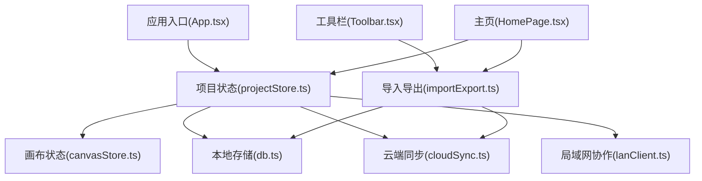
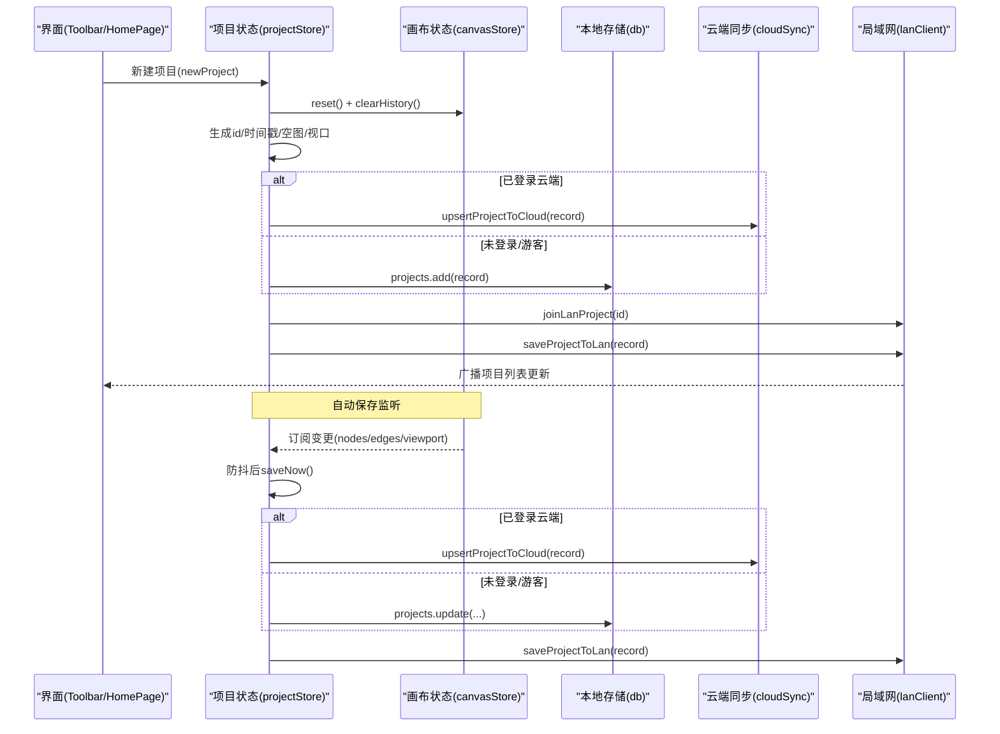
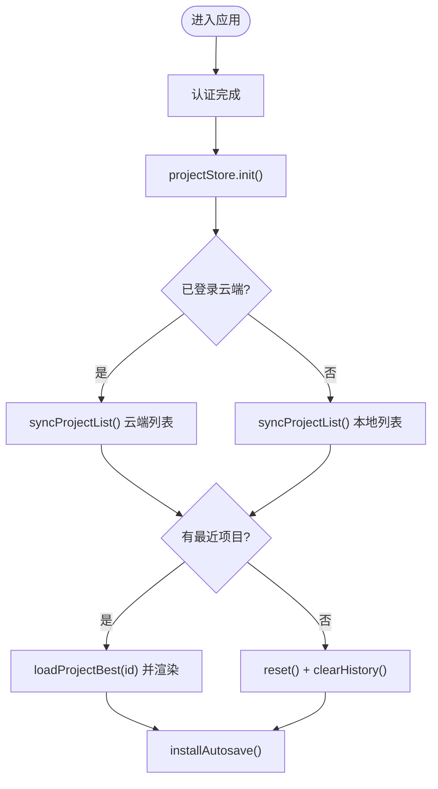
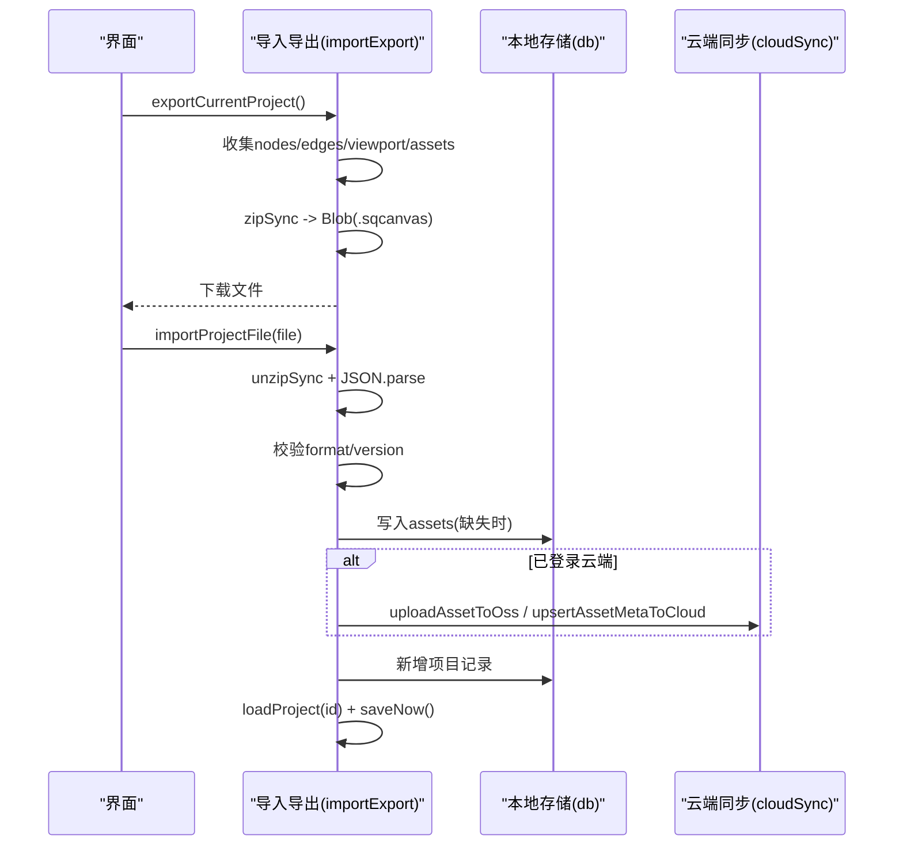
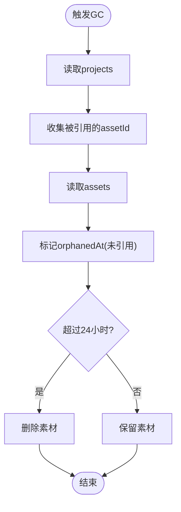
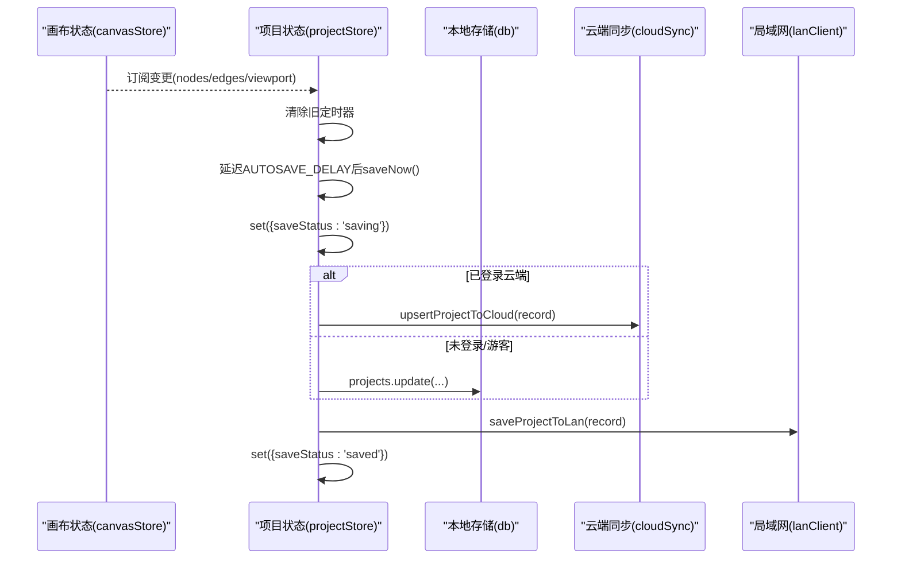
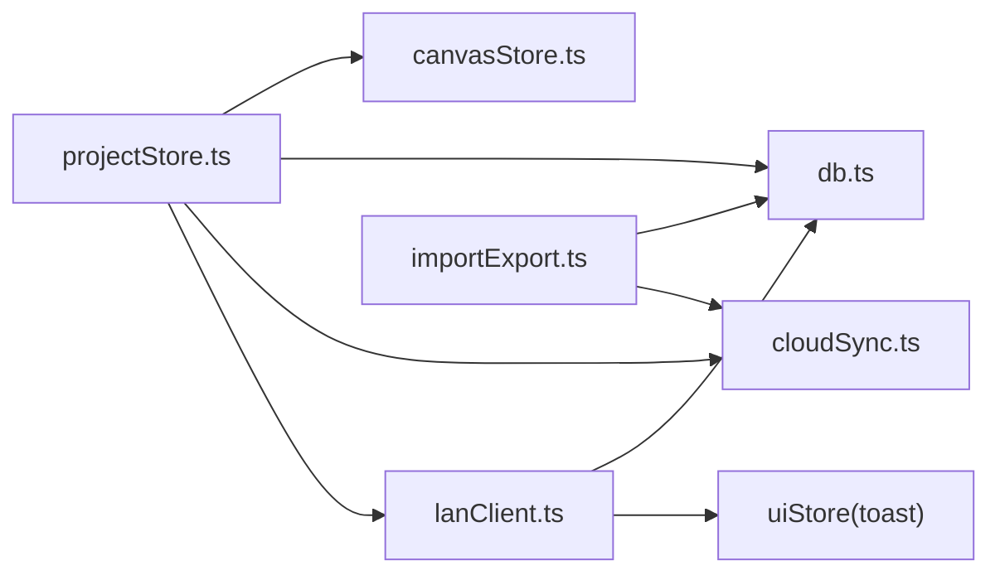

# 项目生命周期管理

<cite>
**本文引用的文件**
- [src/store/projectStore.ts](file://src/store/projectStore.ts)
- [src/store/canvasStore.ts](file://src/store/canvasStore.ts)
- [src/db/db.ts](file://src/db/db.ts)
- [src/io/importExport.ts](file://src/io/importExport.ts)
- [src/sync/cloudSync.ts](file://src/sync/cloudSync.ts)
- [src/sync/lanClient.ts](file://src/sync/lanClient.ts)
- [src/App.tsx](file://src/App.tsx)
- [src/components/Toolbar.tsx](file://src/components/Toolbar.tsx)
- [src/components/HomePage.tsx](file://src/components/HomePage.tsx)
- [src/media/managedFile.ts](file://src/media/managedFile.ts)
</cite>

## 目录
1. [简介](#简介)
2. [项目结构](#项目结构)
3. [核心组件](#核心组件)
4. [架构总览](#架构总览)
5. [详细组件分析](#详细组件分析)
6. [依赖关系分析](#依赖关系分析)
7. [性能考量](#性能考量)
8. [故障排查指南](#故障排查指南)
9. [结论](#结论)
10. [附录](#附录)

## 简介
本文件系统性说明 SuQCanvas 的项目生命周期管理，覆盖以下方面：
- 项目创建流程：新项目初始化、默认配置设置、文件结构生成
- 项目保存与加载机制：本地存储、云端同步、版本管理
- 导入导出功能：文件格式支持、数据转换、兼容性处理
- 清理与资源回收：临时文件删除、数据库优化、内存管理
- 错误处理与恢复机制
- 自动保存机制：防抖策略、状态监听、保存状态管理

## 项目结构
SuQCanvas 将“项目生命周期”的核心职责拆分到多个模块：
- 项目状态与持久化：projectStore（Zustand）负责项目元数据、加载/新建/重命名/保存等
- 画布状态与历史：canvasStore 维护节点、连线、视口、撤销/重做历史
- 本地存储：db（IndexedDB via Dexie）持久化项目与素材
- 云端同步：cloudSync 对接 Supabase/OSS，登录用户走云端，游客仅本地
- 局域网协作：lanClient 通过 WebSocket 实现房间级实时同步、备份恢复、素材传输
- 导入导出：importExport 提供 .sqcanvas 打包/解压、资产迁移、云端上传
- UI 入口：App 启动时完成认证与项目初始化；HomePage/Toolbar 暴露操作入口



图表来源
- [src/App.tsx:19-38](file://src/App.tsx#L19-L38)
- [src/store/projectStore.ts:69-117](file://src/store/projectStore.ts#L69-L117)
- [src/store/canvasStore.ts:118-124](file://src/store/canvasStore.ts#L118-L124)
- [src/db/db.ts:25-33](file://src/db/db.ts#L25-L33)
- [src/sync/cloudSync.ts:148-165](file://src/sync/cloudSync.ts#L148-L165)
- [src/sync/lanClient.ts:767-786](file://src/sync/lanClient.ts#L767-L786)
- [src/io/importExport.ts:35-78](file://src/io/importExport.ts#L35-L78)
- [src/components/Toolbar.tsx:185-202](file://src/components/Toolbar.tsx#L185-L202)
- [src/components/HomePage.tsx:438-444](file://src/components/HomePage.tsx#L438-L444)

章节来源
- [src/App.tsx:19-38](file://src/App.tsx#L19-L38)
- [src/store/projectStore.ts:69-117](file://src/store/projectStore.ts#L69-L117)
- [src/db/db.ts:25-33](file://src/db/db.ts#L25-L33)
- [src/sync/cloudSync.ts:148-165](file://src/sync/cloudSync.ts#L148-L165)
- [src/sync/lanClient.ts:767-786](file://src/sync/lanClient.ts#L767-L786)
- [src/io/importExport.ts:35-78](file://src/io/importExport.ts#L35-L78)
- [src/components/Toolbar.tsx:185-202](file://src/components/Toolbar.tsx#L185-L202)
- [src/components/HomePage.tsx:438-444](file://src/components/HomePage.tsx#L438-L444)

## 核心组件
- projectStore：项目生命周期中枢，负责新建、加载、重命名、保存、自动保存安装与触发、局域网加入、云端/本地选择写入。
- canvasStore：画布状态与历史，提供 undo/redo、对齐、复制粘贴、图层调整、视口控制等，并对外暴露订阅以驱动自动保存。
- db：IndexedDB 封装，定义 assets/projects 表结构，提供垃圾回收 gcAssets。
- cloudSync：云端项目与素材元数据同步，按登录态决定读写源。
- lanClient：局域网协作，包含连接管理、项目列表/数据同步、备份恢复、素材分片传输、断线重连、活动广播等。
- importExport：.sqcanvas 格式导出/导入，含资产收集、压缩、云端上传、版本兼容校验。
- Toolbar/HomePage：用户交互入口，触发导入/导出、新建/打开/删除/重命名等操作。

章节来源
- [src/store/projectStore.ts:19-229](file://src/store/projectStore.ts#L19-L229)
- [src/store/canvasStore.ts:25-59](file://src/store/canvasStore.ts#L25-L59)
- [src/db/db.ts:5-33](file://src/db/db.ts#L5-L33)
- [src/sync/cloudSync.ts:6-165](file://src/sync/cloudSync.ts#L6-L165)
- [src/sync/lanClient.ts:15-1254](file://src/sync/lanClient.ts#L15-L1254)
- [src/io/importExport.ts:13-203](file://src/io/importExport.ts#L13-L203)
- [src/components/Toolbar.tsx:42-47](file://src/components/Toolbar.tsx#L42-L47)
- [src/components/HomePage.tsx:415-480](file://src/components/HomePage.tsx#L415-L480)

## 架构总览
下图展示项目从创建到保存、加载、导入导出的整体流程，以及云端/本地/局域网的协同关系。



图表来源
- [src/store/projectStore.ts:149-182](file://src/store/projectStore.ts#L149-L182)
- [src/store/projectStore.ts:196-228](file://src/store/projectStore.ts#L196-L228)
- [src/store/canvasStore.ts:118-124](file://src/store/canvasStore.ts#L118-L124)
- [src/sync/cloudSync.ts:121-131](file://src/sync/cloudSync.ts#L121-L131)
- [src/sync/lanClient.ts:809-814](file://src/sync/lanClient.ts#L809-L814)

## 详细组件分析

### 项目创建流程：初始化、默认配置、文件结构
- 初始化入口：App 在认证完成后调用 projectStore.init，根据是否登录决定拉取云端或本地项目列表，并加载最新项目或重置为空白画布。
- 新建项目：newProject 会清空画布、生成唯一 id、创建空 graph 与默认 viewport，并根据登录态写入云端或本地，随后加入局域网房间并广播。
- 默认配置：项目名称默认为“未命名项目”，视口初始为 {x:0,y:0,zoom:1}，节点/边为空数组。



图表来源
- [src/App.tsx:25-38](file://src/App.tsx#L25-L38)
- [src/store/projectStore.ts:81-117](file://src/store/projectStore.ts#L81-L117)
- [src/sync/cloudSync.ts:148-165](file://src/sync/cloudSync.ts#L148-L165)

章节来源
- [src/App.tsx:25-38](file://src/App.tsx#L25-L38)
- [src/store/projectStore.ts:81-117](file://src/store/projectStore.ts#L81-L117)
- [src/sync/cloudSync.ts:148-165](file://src/sync/cloudSync.ts#L148-L165)

### 项目的保存与加载机制：本地存储、云端同步、版本管理
- 保存策略：
  - 已登录：upsertProjectToCloud 写入云端 projects 表，同时保存到局域网主机（用于离线协作与备份）。
  - 未登录/游客：直接更新本地 IndexedDB projects 表，并同步到局域网。
- 加载策略：
  - 已登录：优先从云端读取项目；未登录/游客：从本地读取。
  - 加载后清空历史栈，避免误用旧快照影响撤销/重做。
- 版本管理：
  - 云端项目记录包含 created_at/updated_at，用于比较更新顺序。
  - 导入导出使用 format/version 字段进行向后兼容检查。

```mermaid
classDiagram
class ProjectRecord {
+string id
+string name
+number createdAt
+number updatedAt
+{nodes : SuqNode[], edges : SuqEdge[]} graph
+Viewport viewport
}
class CloudProject {
+string id
+string name
+{nodes : SuqNode[], edges : SuqEdge[]} graph
+Viewport viewport
+string created_at
+string updated_at
}
ProjectRecord <.. CloudProject : "toCloud/fromCloud"
```

图表来源
- [src/db/db.ts:16-23](file://src/db/db.ts#L16-L23)
- [src/sync/cloudSync.ts:70-99](file://src/sync/cloudSync.ts#L70-L99)

章节来源
- [src/store/projectStore.ts:196-228](file://src/store/projectStore.ts#L196-L228)
- [src/sync/cloudSync.ts:121-165](file://src/sync/cloudSync.ts#L121-L165)
- [src/io/importExport.ts:25-33](file://src/io/importExport.ts#L25-L33)

### 导入导出功能：文件格式、数据转换、兼容性
- 导出：
  - 收集当前画布的 nodes/edges/viewport 与所有引用 assetId 的素材，打包为 .sqcanvas（ZIP），包含 project.json 与 assets/*.bin/.thumb。
  - 若已登录云端，还会将素材元数据与 OSS key 同步至云端。
- 导入：
  - 解压 ZIP，校验 format/version，解析 project.json。
  - 将 assets 写入本地 db.assets（若不存在），若已登录则上传到 OSS 并同步元数据。
  - 创建新项目记录并加载，最后执行一次保存以确保一致性。
- 兼容性：
  - 版本高于当前支持的版本会拒绝导入，防止不兼容数据损坏。



图表来源
- [src/io/importExport.ts:35-78](file://src/io/importExport.ts#L35-L78)
- [src/io/importExport.ts:111-203](file://src/io/importExport.ts#L111-L203)
- [src/sync/cloudSync.ts:29-50](file://src/sync/cloudSync.ts#L29-L50)

章节来源
- [src/io/importExport.ts:35-78](file://src/io/importExport.ts#L35-L78)
- [src/io/importExport.ts:111-203](file://src/io/importExport.ts#L111-L203)
- [src/sync/cloudSync.ts:29-50](file://src/sync/cloudSync.ts#L29-L50)

### 项目清理与资源回收：临时文件、数据库优化、内存管理
- 垃圾回收：gcAssets 遍历所有项目，标记被引用的 assetId；对未被引用的素材：
  - 首次发现未引用时记录 orphanedAt；
  - 超过保留期（24小时）后删除该素材，释放 IndexedDB 空间。
- 内存管理：
  - 导入导出使用 fflate 流式压缩/解压，避免一次性大对象占用过多内存。
  - 局域网素材传输采用分片 base64 解码与惰性 Blob 引用，降低峰值内存。
- 临时文件：
  - 导出生成的 Blob URL 会在短时间后释放，避免泄漏。



图表来源
- [src/db/db.ts:46-68](file://src/db/db.ts#L46-L68)

章节来源
- [src/db/db.ts:46-68](file://src/db/db.ts#L46-L68)
- [src/io/importExport.ts:86-94](file://src/io/importExport.ts#L86-L94)
- [src/sync/lanClient.ts:1023-1052](file://src/sync/lanClient.ts#L1023-L1052)

### 错误处理与恢复机制
- 项目打开失败：loadProject 捕获异常并提示“打开项目失败”。
- 自动保存失败：saveNow 捕获异常，设置 saveStatus='error' 并提示“自动保存失败”。
- 导入失败：importProjectFile 抛出明确错误信息（如“文件损坏或不是有效的 SuQCanvas 项目”、“缺少 project.json”、“版本过高”等），由 UI 层 toast 提示。
- 局域网协作：
  - 断线自动重连，指数退避；重连成功后重新请求项目数据与素材。
  - 删除传播通过 sync-del 显式广播，避免晚到快照复活已删除节点。
  - 备份恢复支持超时与权限校验，失败返回具体错误码。

章节来源
- [src/store/projectStore.ts:119-147](file://src/store/projectStore.ts#L119-L147)
- [src/store/projectStore.ts:196-228](file://src/store/projectStore.ts#L196-L228)
- [src/io/importExport.ts:111-131](file://src/io/importExport.ts#L111-L131)
- [src/sync/lanClient.ts:119-152](file://src/sync/lanClient.ts#L119-L152)
- [src/sync/lanClient.ts:578-598](file://src/sync/lanClient.ts#L578-L598)
- [src/sync/lanClient.ts:865-887](file://src/sync/lanClient.ts#L865-L887)

### 自动保存机制：防抖、状态监听、保存状态管理
- 状态监听：installAutosave 订阅 canvasStore 的 nodes/edges/viewport 变化，检测到差异即触发保存。
- 防抖策略：使用 AUTOSAVE_DELAY（500ms）定时器合并多次编辑，避免频繁写盘。
- 保存状态管理：
  - saveStatus 在 idle/saving/saved/error 之间切换，供 UI 显示“编辑中/保存中/已保存/保存失败”。
  - 保存前若已有保存进行中，先重置为 idle，确保不会重复提交。
- 云端/本地分流：isCloudUser 判断登录态，分别调用云端或本地存储。



图表来源
- [src/store/projectStore.ts:46-67](file://src/store/projectStore.ts#L46-L67)
- [src/store/projectStore.ts:196-228](file://src/store/projectStore.ts#L196-L228)

章节来源
- [src/store/projectStore.ts:46-67](file://src/store/projectStore.ts#L46-L67)
- [src/store/projectStore.ts:196-228](file://src/store/projectStore.ts#L196-L228)

## 依赖关系分析
- projectStore 依赖：
  - canvasStore：读取画布数据、重置/清空历史、订阅变更
  - db：本地持久化
  - cloudSync：云端读写
  - lanClient：局域网同步与广播
- canvasStore 依赖：
  - @xyflow/react：节点/连线变更处理
  - lanStore：插入元数据（创建者信息）
- importExport 依赖：
  - fflate：zip/unzip
  - db：素材读写
  - cloudSync/ossClient：云端元数据与OSS上传
- lanClient 依赖：
  - db：素材落库
  - useLanStore：连接状态、房间上下文
  - uiStore：toast 提示



图表来源
- [src/store/projectStore.ts:1-17](file://src/store/projectStore.ts#L1-L17)
- [src/io/importExport.ts:1-11](file://src/io/importExport.ts#L1-L11)
- [src/sync/lanClient.ts:1-8](file://src/sync/lanClient.ts#L1-L8)

章节来源
- [src/store/projectStore.ts:1-17](file://src/store/projectStore.ts#L1-L17)
- [src/io/importExport.ts:1-11](file://src/io/importExport.ts#L1-L11)
- [src/sync/lanClient.ts:1-8](file://src/sync/lanClient.ts#L1-L8)

## 性能考量
- 自动保存防抖：500ms 窗口合并多次编辑，减少写盘频率。
- 历史快照防抖：canvasStore 使用 400ms 合并快照，限制历史长度（50条），避免无限增长。
- 局域网同步：
  - 画布同步 150ms 防抖广播，减少网络负载。
  - 活动通知 350ms 合并批量操作，避免刷屏。
  - 素材传输分片（262143 字节）+ 空闲超时（60s）+ HTTP Range 流式拉取（视频），降低带宽与内存压力。
- 导入导出：ZIP 压缩级别 6，平衡体积与速度；Blob URL 及时释放。

[本节为通用性能建议，无需特定文件引用]

## 故障排查指南
- 无法打开项目：
  - 检查 loadProjectBest 是否返回 null，确认云端/本地是否存在该项目。
  - 查看 toast 提示与控制台错误日志。
- 自动保存失败：
  - 检查 saveStatus 是否为 error，确认网络（云端）或 IndexedDB 可用性。
  - 检查 isCloudUser 是否正确识别登录态。
- 导入失败：
  - 确认 .sqcanvas 文件完整且版本兼容。
  - 检查 project.json 是否存在且可解析。
- 局域网协作异常：
  - 检查 ws 连接状态与重连逻辑。
  - 确认 sync-del 消息是否到达，避免节点“复活”。
  - 素材传输失败时，检查空闲超时与重试机制。

章节来源
- [src/store/projectStore.ts:119-147](file://src/store/projectStore.ts#L119-L147)
- [src/store/projectStore.ts:196-228](file://src/store/projectStore.ts#L196-L228)
- [src/io/importExport.ts:111-131](file://src/io/importExport.ts#L111-L131)
- [src/sync/lanClient.ts:119-152](file://src/sync/lanClient.ts#L119-L152)
- [src/sync/lanClient.ts:578-598](file://src/sync/lanClient.ts#L578-L598)

## 结论
SuQCanvas 的项目生命周期管理以 projectStore 为核心，结合 canvasStore 的状态监听与防抖，实现了可靠的自动保存；通过 cloudSync 与 lanClient 分别支持云端与局域网场景，满足多环境下的数据一致性与协作需求；importExport 提供了跨设备共享能力；db.gcAssets 保障长期运行的资源健康。整体设计清晰、可扩展性强，适合复杂画布应用的工程实践。

[本节为总结性内容，无需特定文件引用]

## 附录
- 关键类型与接口：
  - ProjectRecord：项目数据结构（id/name/graph/viewport/timestamps）
  - CloudProject：云端项目结构（时间字符串化）
  - AssetRecord：素材记录（id/name/mime/size/kind/blob/thumbnail/orphanedAt）
  - SaveStatus：保存状态枚举（idle/saving/saved/error）
- 常用操作路径：
  - 新建项目：projectStore.newProject
  - 加载项目：projectStore.loadProject
  - 保存项目：projectStore.saveNow
  - 导入导出：importExport.importProjectFile/exportCurrentProject
  - 局域网协作：lanClient.joinLanProject/saveProjectToLan/fetchProjectFromLan

章节来源
- [src/db/db.ts:5-23](file://src/db/db.ts#L5-L23)
- [src/sync/cloudSync.ts:70-99](file://src/sync/cloudSync.ts#L70-L99)
- [src/store/projectStore.ts:19-34](file://src/store/projectStore.ts#L19-L34)
- [src/io/importExport.ts:35-78](file://src/io/importExport.ts#L35-L78)
- [src/sync/lanClient.ts:767-845](file://src/sync/lanClient.ts#L767-L845)