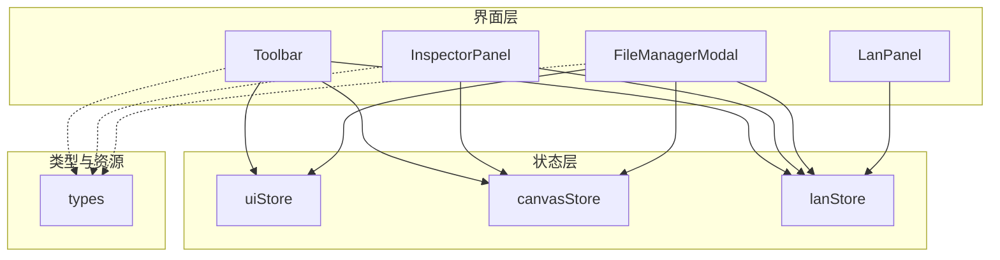
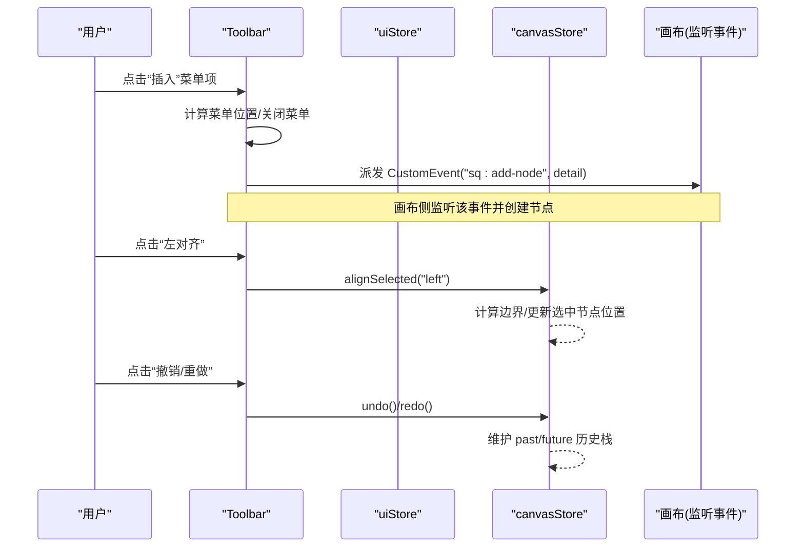
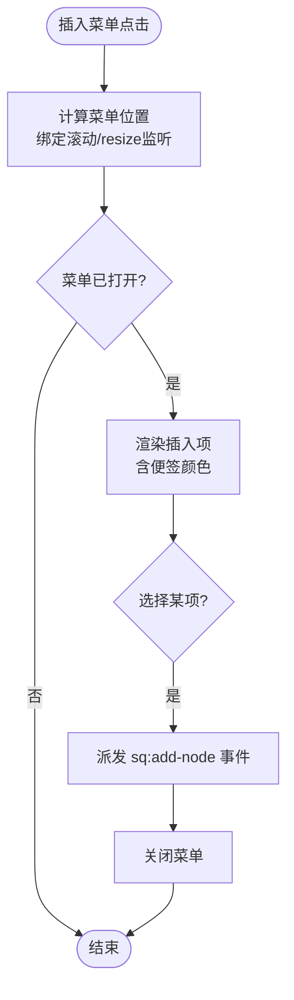
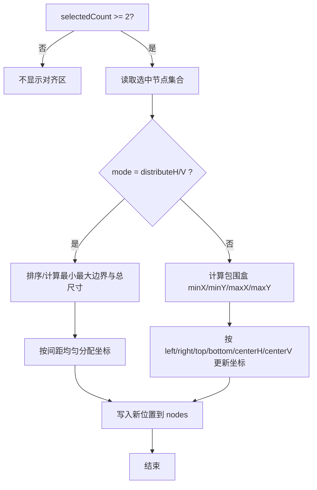
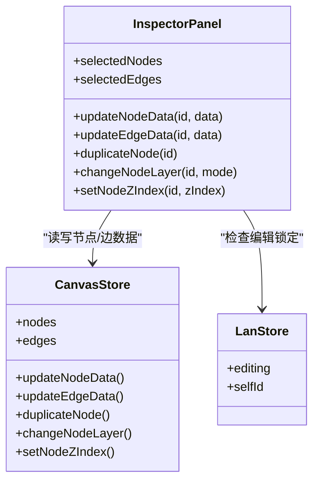
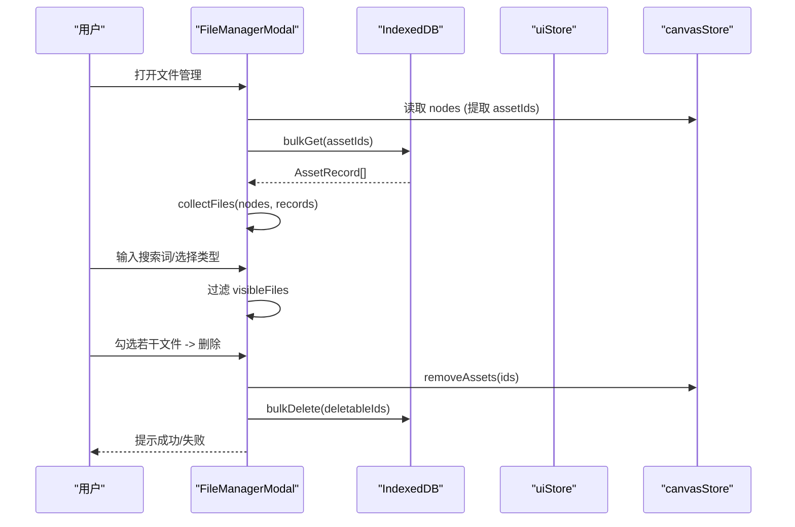
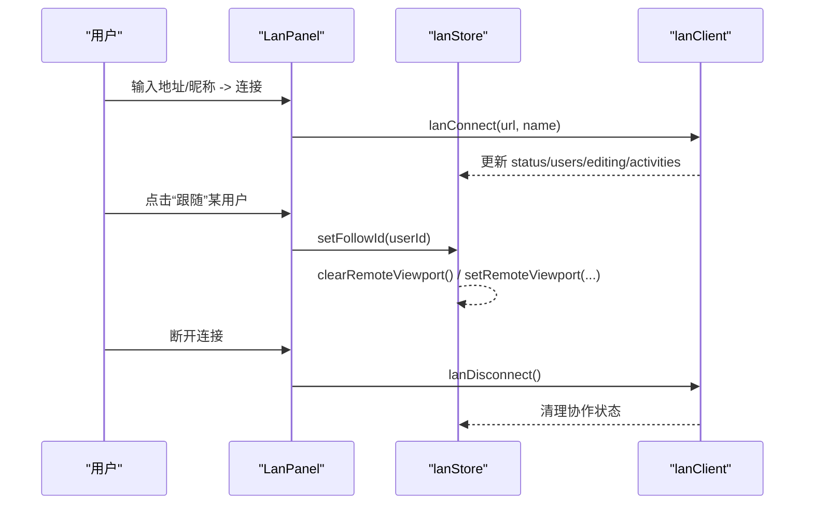
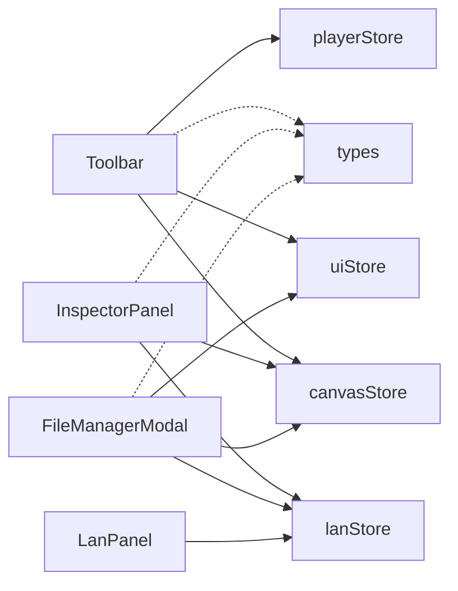

# 功能组件设计

<cite>
**本文引用的文件**
- [Toolbar.tsx](file://src/components/Toolbar.tsx)
- [InspectorPanel.tsx](file://src/components/InspectorPanel.tsx)
- [FileManagerModal.tsx](file://src/components/FileManagerModal.tsx)
- [LanPanel.tsx](file://src/components/LanPanel.tsx)
- [uiStore.ts](file://src/store/uiStore.ts)
- [canvasStore.ts](file://src/store/canvasStore.ts)
- [lanStore.ts](file://src/store/lanStore.ts)
- [types.ts](file://src/types.ts)
</cite>

## 目录
1. [简介](#简介)
2. [项目结构](#项目结构)
3. [核心组件](#核心组件)
4. [架构总览](#架构总览)
5. [详细组件分析](#详细组件分析)
6. [依赖关系分析](#依赖关系分析)
7. [性能考量](#性能考量)
8. [故障排查指南](#故障排查指南)
9. [结论](#结论)

## 简介
本文件面向 SuQCanvas 的功能组件设计与实现，聚焦以下四个关键组件：
- Toolbar 工具栏：工具模式切换、节点插入菜单、对齐操作、撤销重做等复杂交互。
- InspectorPanel 属性面板：根据选中节点类型动态渲染不同属性编辑器。
- FileManagerModal 文件管理器：文件列表展示、批量操作、搜索过滤与媒体播放入口。
- LanPanel 局域网协作面板：连接管理、房间列表、用户状态同步与编辑锁定。

文档同时覆盖这些组件的状态管理策略、事件处理模式与性能优化技巧，帮助读者快速理解并扩展系统能力。

## 项目结构
SuQCanvas 采用“组件 + Zustand Store”的解耦架构：UI 组件通过 useXxxStore 订阅全局状态，触发 store 中的方法完成数据变更；跨组件通信使用自定义事件或 store 共享状态。

图表来源
- [Toolbar.tsx:97-403](file://src/components/Toolbar.tsx#L97-L403)
- [InspectorPanel.tsx:288-800](file://src/components/InspectorPanel.tsx#L288-L800)
- [FileManagerModal.tsx:63-417](file://src/components/FileManagerModal.tsx#L63-L417)
- [LanPanel.tsx:17-199](file://src/components/LanPanel.tsx#L17-L199)
- [uiStore.ts:1-121](file://src/store/uiStore.ts#L1-L121)
- [canvasStore.ts:1-399](file://src/store/canvasStore.ts#L1-L399)
- [lanStore.ts:1-160](file://src/store/lanStore.ts#L1-L160)
- [types.ts:1-112](file://src/types.ts#L1-L112)

章节来源
- [Toolbar.tsx:97-403](file://src/components/Toolbar.tsx#L97-L403)
- [uiStore.ts:1-121](file://src/store/uiStore.ts#L1-L121)
- [canvasStore.ts:1-399](file://src/store/canvasStore.ts#L1-L399)
- [lanStore.ts:1-160](file://src/store/lanStore.ts#L1-L160)
- [types.ts:1-112](file://src/types.ts#L1-L112)

## 核心组件
- Toolbar：提供工具模式（选择/连线/拖动）、插入元素下拉菜单、对齐与分布、撤销/重做、视图缩放、主题切换、导入导出、文件管理与协作入口。
- InspectorPanel：根据选中的节点/边动态显示属性编辑器，支持文本样式、标题级别、便签颜色、形状填充、层级调整、连线样式与播放顺序等。
- FileManagerModal：集中管理项目内所有资源，支持按类型分组、模糊搜索、全选/多选、批量下载/删除、打开预览与播放器。
- LanPanel：连接/断开局域网中继，查看在线用户、跟随视角、查看正在编辑的元素与活动日志。

章节来源
- [Toolbar.tsx:97-403](file://src/components/Toolbar.tsx#L97-L403)
- [InspectorPanel.tsx:288-800](file://src/components/InspectorPanel.tsx#L288-L800)
- [FileManagerModal.tsx:63-417](file://src/components/FileManagerModal.tsx#L63-L417)
- [LanPanel.tsx:17-199](file://src/components/LanPanel.tsx#L17-L199)

## 架构总览
组件通过 Zustand store 进行状态管理，跨组件通信采用两种模式：
- 直接调用 store 方法（如 setTool、alignSelected、updateNodeData）。
- 派发自定义事件（如 sq:add-node、sq:view），由画布或其他监听者消费。

图表来源
- [Toolbar.tsx:86-92](file://src/components/Toolbar.tsx#L86-L92)
- [Toolbar.tsx:218-283](file://src/components/Toolbar.tsx#L218-L283)
- [Toolbar.tsx:306-336](file://src/components/Toolbar.tsx#L306-L336)
- [canvasStore.ts:290-361](file://src/store/canvasStore.ts#L290-L361)
- [canvasStore.ts:362-383](file://src/store/canvasStore.ts#L362-L383)

## 详细组件分析

### Toolbar 工具栏
职责与交互要点：
- 工具模式切换：通过 uiStore.tool/setTool 在“选择/连线/拖动”间切换，影响画布行为。
- 节点插入菜单：点击“插入”按钮弹出定位菜单，支持文本、标题、便签、矩形、椭圆等；便签支持颜色选择。通过 dispatchAddNode 派发自定义事件，由画布监听并创建对应节点。
- 对齐操作：当选中节点数≥2时显示对齐/分布按钮，调用 canvasStore.alignSelected 执行对齐或分布算法。
- 撤销/重做：基于 canvasStore.past/future 历史栈，支持撤销与重做。
- 视图控制：通过 dispatchView 派发“缩放/适应/重置”视图事件，由画布监听处理。
- 其他：导入/导出、主题切换、文件管理入口、协作面板入口（LAN 构建下可见）。

图表来源
- [Toolbar.tsx:127-156](file://src/components/Toolbar.tsx#L127-L156)
- [Toolbar.tsx:218-283](file://src/components/Toolbar.tsx#L218-L283)
- [Toolbar.tsx:86-92](file://src/components/Toolbar.tsx#L86-L92)

对齐流程（多节点）：

图表来源
- [canvasStore.ts:290-361](file://src/store/canvasStore.ts#L290-L361)

撤销/重做机制：
- 使用防抖快照（HISTORY_DEBOUNCE=400ms）合并频繁修改，限制历史长度（HISTORY_LIMIT=50）。
- 删除操作立即 flushPending 并记录快照；其余修改延迟记录。
- undo/redo 在 past/future 之间移动条目，恢复 nodes/edges。

章节来源
- [Toolbar.tsx:97-403](file://src/components/Toolbar.tsx#L97-L403)
- [canvasStore.ts:61-107](file://src/store/canvasStore.ts#L61-L107)
- [canvasStore.ts:362-391](file://src/store/canvasStore.ts#L362-L391)

### InspectorPanel 属性面板
动态渲染机制：
- 根据 selectedEditableNodes/selectedEdges 决定渲染内容。
- 边编辑：线型、路径、箭头、颜色、粗细；音频分叉边可设置播放顺序。
- 节点编辑：名称、边框颜色、文字对齐（水平/垂直）、字体、字号、行高、颜色、加粗/斜体/下划线；标题级别；便签颜色；形状类型与填充；层级（置于顶层/上移一层/下移一层/置于底层）；复制/删除/下载（音频）。
- 协作锁定：通过 lanStore.editing/selfId 判断当前用户是否可编辑被他人锁定的元素。

图表来源
- [InspectorPanel.tsx:288-800](file://src/components/InspectorPanel.tsx#L288-L800)
- [canvasStore.ts:118-399](file://src/store/canvasStore.ts#L118-L399)
- [lanStore.ts:53-160](file://src/store/lanStore.ts#L53-L160)

章节来源
- [InspectorPanel.tsx:288-800](file://src/components/InspectorPanel.tsx#L288-L800)
- [canvasStore.ts:118-399](file://src/store/canvasStore.ts#L118-L399)
- [lanStore.ts:53-160](file://src/store/lanStore.ts#L53-L160)

### FileManagerModal 文件管理器
功能要点：
- 文件列表展示：从 canvasStore.nodes 收集 assetId，批量查询 db.assets 得到元信息，结合 managedFile 聚合每个资源关联的节点数量与大小。
- 搜索过滤：支持文件名、MIME、类型、中文标签、插入者等多字段模糊匹配。
- 分类筛选：左侧分组（媒体/文档/其他）与右侧移动端下拉筛选。
- 批量操作：全选/多选，批量下载（间隔避免浏览器拦截）、批量删除（校验是否被他人编辑中）。
- 打开与播放：MP3 进入内置播放器；图片/PSD/PDF/视频/Markdown 分别打开对应查看器或页面；其他文件尝试在新窗口打开。
- 键盘快捷键：Ctrl+P 打开，Esc 关闭。

图表来源
- [FileManagerModal.tsx:101-135](file://src/components/FileManagerModal.tsx#L101-L135)
- [FileManagerModal.tsx:160-244](file://src/components/FileManagerModal.tsx#L160-L244)
- [FileManagerModal.tsx:248-417](file://src/components/FileManagerModal.tsx#L248-L417)

章节来源
- [FileManagerModal.tsx:63-417](file://src/components/FileManagerModal.tsx#L63-L417)
- [uiStore.ts:1-121](file://src/store/uiStore.ts#L1-L121)
- [canvasStore.ts:275-289](file://src/store/canvasStore.ts#L275-L289)

### LanPanel 局域网协作面板
特性说明：
- 连接管理：输入服务器地址与昵称，连接/断开；支持重新连接上次配置。
- 房间列表：显示当前项目协作者（包含自己与其他用户），支持“跟随”某用户视角。
- 用户状态同步：显示在线用户、IP、颜色标识；活动日志记录最近操作。
- 编辑锁定：显示谁正在编辑哪个元素，防止冲突。

图表来源
- [LanPanel.tsx:17-199](file://src/components/LanPanel.tsx#L17-L199)
- [lanStore.ts:53-160](file://src/store/lanStore.ts#L53-L160)

章节来源
- [LanPanel.tsx:17-199](file://src/components/LanPanel.tsx#L17-L199)
- [lanStore.ts:1-160](file://src/store/lanStore.ts#L1-L160)

## 依赖关系分析
- 组件对 store 的依赖：
  - Toolbar 依赖 uiStore（工具模式、导入、文件管理开关）、canvasStore（对齐、撤销重做、视口）、settingsStore（主题）、playerStore（CD 图标）。
  - InspectorPanel 依赖 canvasStore（节点/边数据、层级）、lanStore（编辑锁定）、media 模块（专辑图缩略图、资源 URL）。
  - FileManagerModal 依赖 uiStore（弹窗开关、播放器入口）、canvasStore（资源引用）、lanStore（编辑锁定）、db（资产元数据）。
  - LanPanel 依赖 lanStore（连接状态、用户列表、活动日志）与 lanClient（连接/断开）。
- 类型定义集中在 types.ts，统一 MediaKind、EdgeStyle、SuqNode/SuqEdge 等。

图表来源
- [Toolbar.tsx:97-403](file://src/components/Toolbar.tsx#L97-L403)
- [InspectorPanel.tsx:288-800](file://src/components/InspectorPanel.tsx#L288-L800)
- [FileManagerModal.tsx:63-417](file://src/components/FileManagerModal.tsx#L63-L417)
- [LanPanel.tsx:17-199](file://src/components/LanPanel.tsx#L17-L199)
- [types.ts:1-112](file://src/types.ts#L1-L112)

章节来源
- [types.ts:1-112](file://src/types.ts#L1-L112)
- [uiStore.ts:1-121](file://src/store/uiStore.ts#L1-L121)
- [canvasStore.ts:1-399](file://src/store/canvasStore.ts#L1-L399)
- [lanStore.ts:1-160](file://src/store/lanStore.ts#L1-L160)

## 性能考量
- 历史快照防抖与限长：canvasStore 使用 HISTORY_DEBOUNCE=400ms 合并连续修改，HISTORY_LIMIT=50 限制历史长度，降低内存占用与重放成本。
- 条件渲染与选择性更新：InspectorPanel 仅在存在选中节点/边时渲染；Toolbar 的对齐区域仅在 selectedCount≥2 时显示。
- 资源加载优化：InspectorPanel 的专辑图优先加载缩略图，缺失再回退原图；FileManagerModal 批量获取资产元数据，减少多次请求。
- 事件驱动解耦：Toolbar 通过自定义事件通知画布插入节点，避免强耦合与重复逻辑。
- 批量操作节流：FileManagerModal 批量下载时加入短暂延时，避免浏览器并发限制导致的失败。

[本节为通用性能建议，无需特定文件引用]

## 故障排查指南
- 无法插入节点：检查 Toolbar 是否正确派发 sq:add-node 事件，以及画布是否监听该事件。
- 对齐无效：确认至少选中两个节点，且节点具备有效尺寸（width/height/measured）。
- 撤销/重做无响应：检查 past/future 是否为空；确认修改触发了 snapshotNow/scheduleSnapshot。
- 文件管理器搜索无结果：确认 query 非空且 tokens 拆分正确；检查 matchesFile 字段是否包含必要信息（name/mime/kind/插入者）。
- 批量删除失败：检查是否有文件正被他人编辑（editing 锁定），或被其他项目引用导致不可删除。
- 协作面板无法连接：确认 ws/wss 地址格式正确；检查防火墙与服务端状态；查看 lanStore.status 变化。

章节来源
- [Toolbar.tsx:86-92](file://src/components/Toolbar.tsx#L86-L92)
- [canvasStore.ts:290-361](file://src/store/canvasStore.ts#L290-L361)
- [canvasStore.ts:61-107](file://src/store/canvasStore.ts#L61-L107)
- [FileManagerModal.tsx:41-52](file://src/components/FileManagerModal.tsx#L41-L52)
- [FileManagerModal.tsx:214-244](file://src/components/FileManagerModal.tsx#L214-L244)
- [LanPanel.tsx:34-50](file://src/components/LanPanel.tsx#L34-L50)

## 结论
SuQCanvas 的功能组件以 Zustand 为中心进行状态管理，通过事件与 store 方法实现松耦合交互。Toolbar 负责高频操作与导航，InspectorPanel 提供细粒度属性编辑，FileManagerModal 统一管理资源生命周期，LanPanel 支撑多人协作。整体设计兼顾易用性与可扩展性，并通过防抖、条件渲染、批量优化等手段保障性能。后续可在各组件中继续引入更丰富的交互与可视化反馈，进一步提升用户体验。