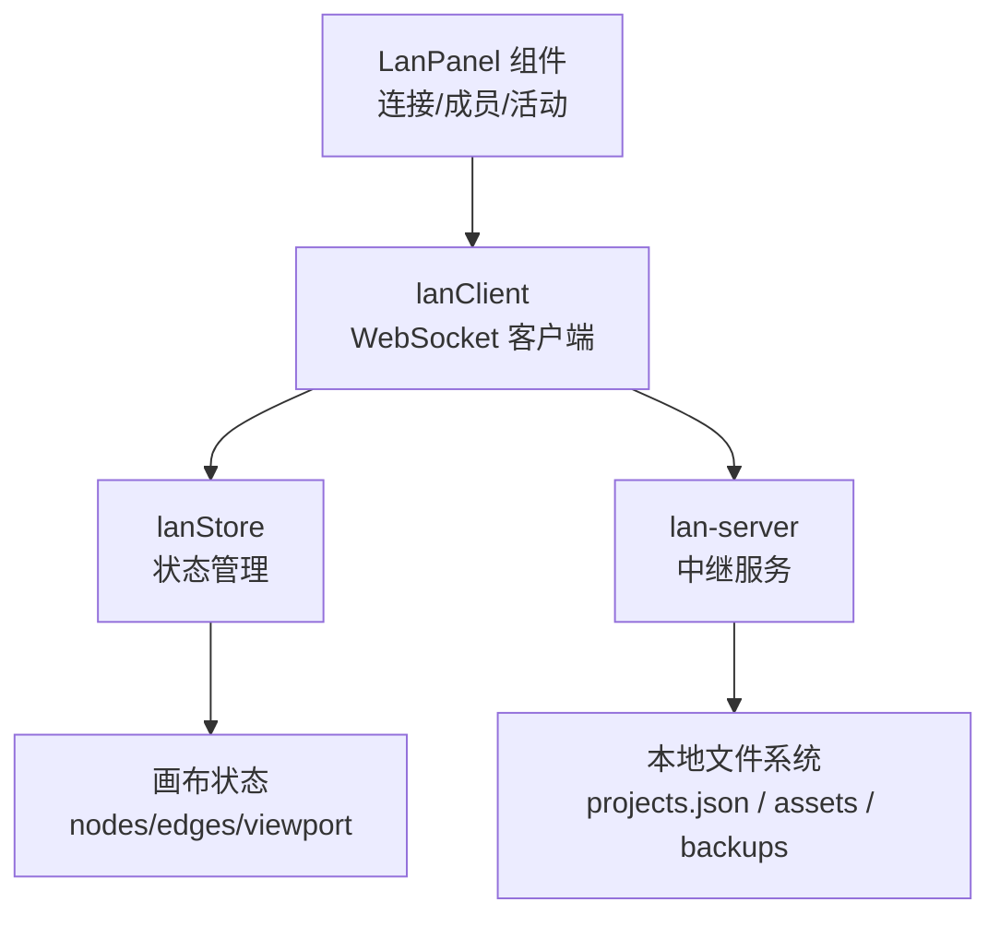
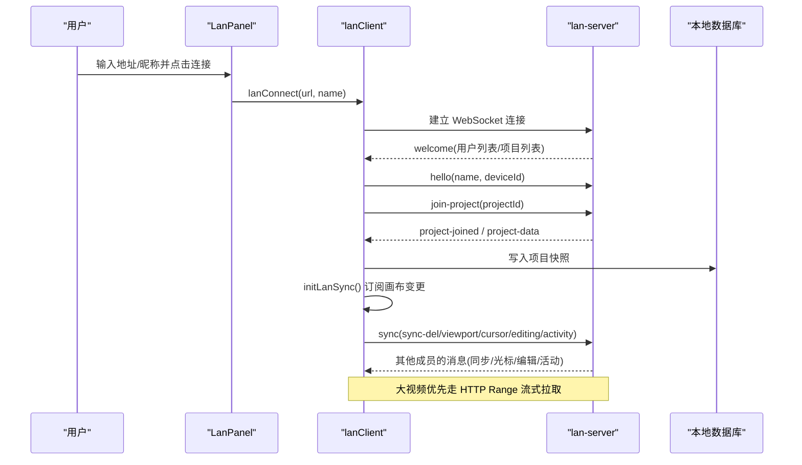
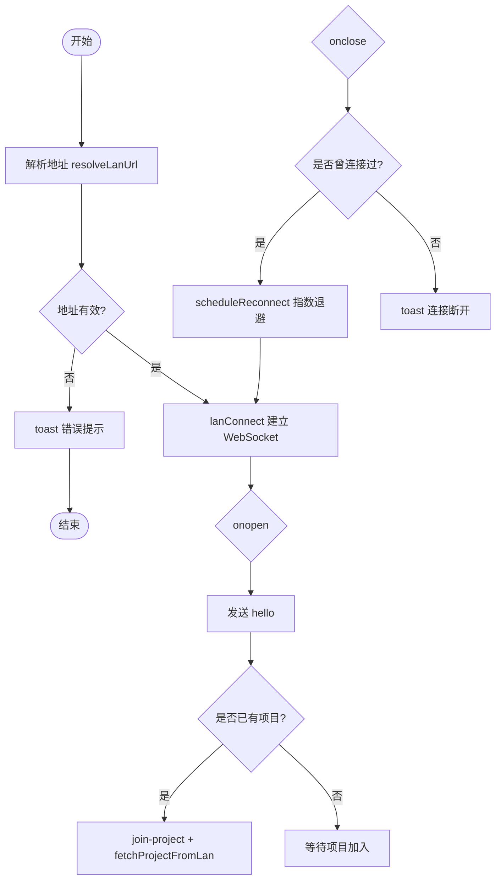
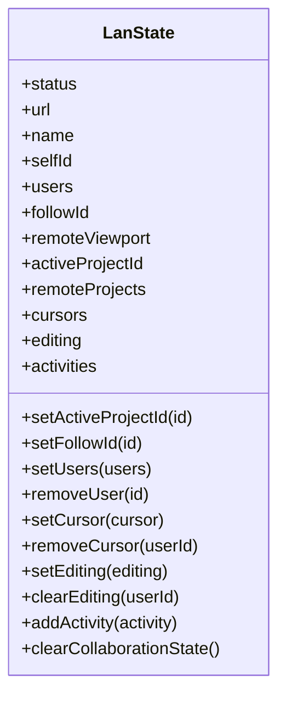
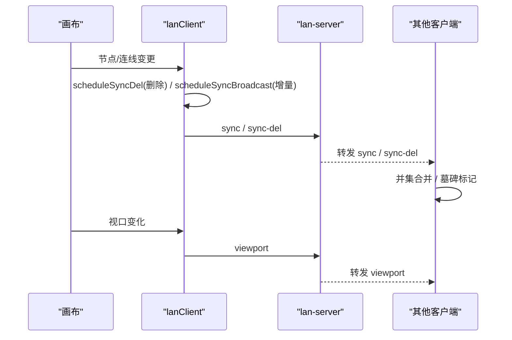
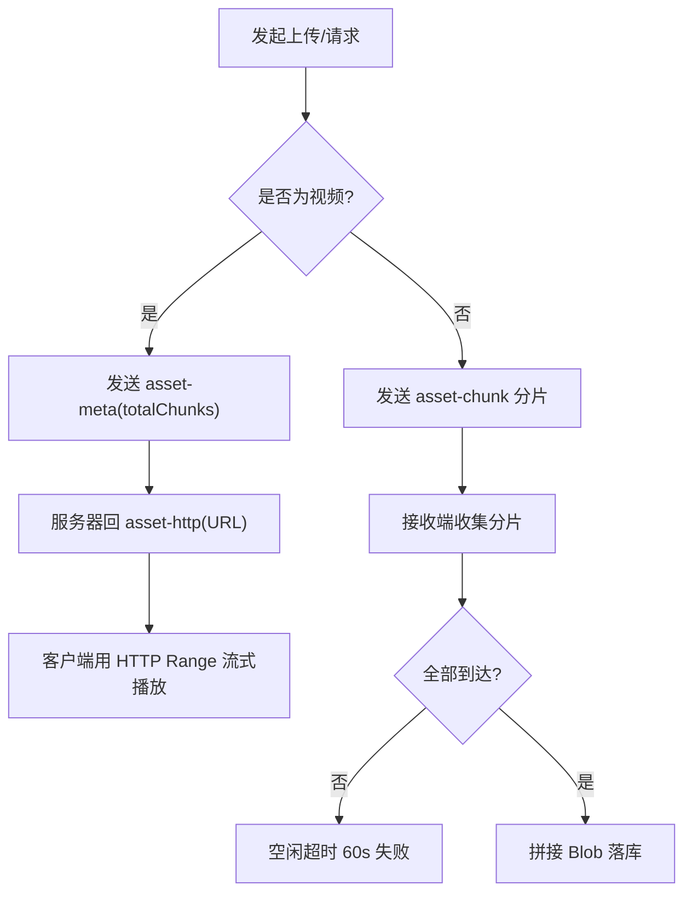
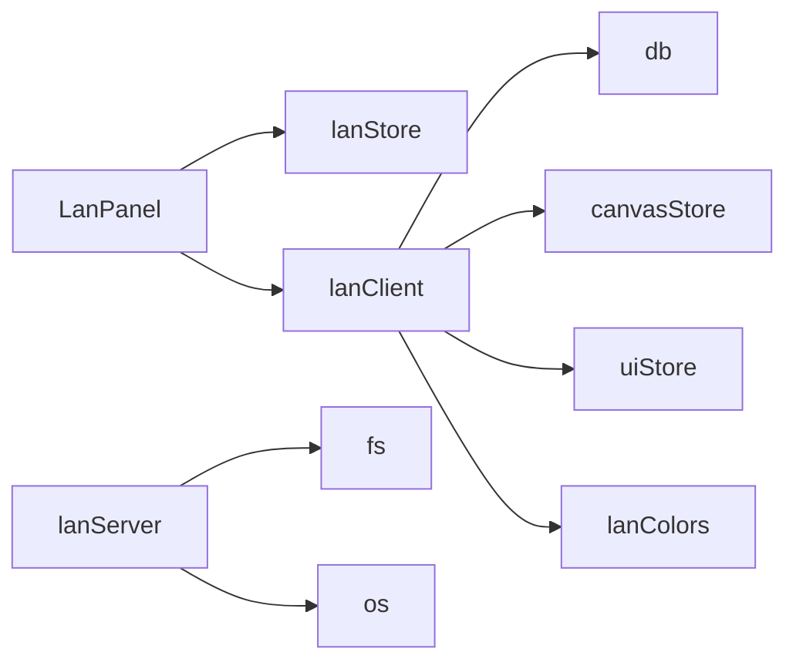

# 局域网面板组件

<cite>
**本文引用的文件**
- [src/components/LanPanel.tsx](file://src/components/LanPanel.tsx)
- [src/sync/lanClient.ts](file://src/sync/lanClient.ts)
- [src/store/lanStore.ts](file://src/store/lanStore.ts)
- [server/lan-server.mjs](file://server/lan-server.mjs)
- [src/store/uiStore.ts](file://src/store/uiStore.ts)
- [scripts/start-lan.ps1](file://scripts/start-lan.ps1)
</cite>

## 目录
1. [简介](#简介)
2. [项目结构](#项目结构)
3. [核心组件](#核心组件)
4. [架构总览](#架构总览)
5. [详细组件分析](#详细组件分析)
6. [依赖关系分析](#依赖关系分析)
7. [性能与可靠性](#性能与可靠性)
8. [故障排除指南](#故障排除指南)
9. [结论](#结论)
10. [附录：配置选项](#附录：配置选项)

## 简介
本技术文档围绕 LanPanel 局域网协作面板，系统性解析其功能实现与交互设计，涵盖：
- 服务器连接管理（连接、断开、自动重连）
- 房间列表展示与加入/离开房间
- 用户状态监控（在线成员、跟随视图、编辑中状态）
- 实时数据同步（画布节点/连线、视口、光标、活动日志）
- 素材传输（分片、断点续传、HTTP Range 流式拉取）
- 网络异常处理与用户友好提示
- 局域网服务部署与配置要点

## 项目结构
LanPanel 由前端 UI、客户端通信层、状态存储与服务端中继四部分组成：
- 前端 UI：LanPanel 组件负责连接表单、成员列表、跟随操作、活动日志等。
- 客户端通信层：lanClient 封装 WebSocket 协议、消息路由、重连策略、素材传输、项目同步等。
- 状态存储：lanStore 集中管理连接状态、成员、房间、光标、编辑态、活动记录等。
- 服务端中继：lan-server 提供 HTTP + WebSocket 服务，负责房间广播、项目持久化、资产缓存与清理、备份恢复等。

图表来源
- [src/components/LanPanel.tsx:17-199](file://src/components/LanPanel.tsx#L17-L199)
- [src/sync/lanClient.ts:254-362](file://src/sync/lanClient.ts#L254-L362)
- [src/store/lanStore.ts:53-159](file://src/store/lanStore.ts#L53-L159)
- [server/lan-server.mjs:449-451](file://server/lan-server.mjs#L449-L451)

章节来源
- [src/components/LanPanel.tsx:17-199](file://src/components/LanPanel.tsx#L17-L199)
- [src/sync/lanClient.ts:254-362](file://src/sync/lanClient.ts#L254-L362)
- [src/store/lanStore.ts:53-159](file://src/store/lanStore.ts#L53-L159)
- [server/lan-server.mjs:449-451](file://server/lan-server.mjs#L449-L451)

## 核心组件
- LanPanel 组件：提供连接输入框、昵称输入、连接/断开按钮、重新连接、成员列表、跟随切换、正在编辑与最近活动展示。
- lanClient：实现 WebSocket 生命周期管理、消息分发、自动重连、项目同步、画布同步、光标/编辑态广播、素材分片传输、HTTP Range 视频流式拉取。
- lanStore：维护连接状态、成员、活动、光标、编辑态、当前房间、远程视口等。
- lan-server：接收 WebSocket 消息，按房间广播；持久化项目；缓存资产；支持备份恢复；定期清理孤儿资产。

章节来源
- [src/components/LanPanel.tsx:17-199](file://src/components/LanPanel.tsx#L17-L199)
- [src/sync/lanClient.ts:254-362](file://src/sync/lanClient.ts#L254-L362)
- [src/store/lanStore.ts:53-159](file://src/store/lanStore.ts#L53-L159)
- [server/lan-server.mjs:661-906](file://server/lan-server.mjs#L661-L906)

## 架构总览
下图展示了从 UI 到服务端的关键交互流程，包括连接建立、加入房间、画布同步、光标与编辑态广播、素材传输与 HTTP Range 优化。

图表来源
- [src/components/LanPanel.tsx:41-50](file://src/components/LanPanel.tsx#L41-L50)
- [src/sync/lanClient.ts:254-362](file://src/sync/lanClient.ts#L254-L362)
- [src/sync/lanClient.ts:718-756](file://src/sync/lanClient.ts#L718-L756)
- [server/lan-server.mjs:661-706](file://server/lan-server.mjs#L661-L706)

## 详细组件分析

### 服务器连接管理（连接、断开、自动重连）
- 连接建立：
  - 解析地址：resolveLanUrl 支持相对路径、http(s) 转 ws/wss，HTTPS 页面强制 wss。
  - 建立连接：lanConnect 创建 WebSocket，onopen 发送 hello，若已打开项目则 join-project 并拉取项目数据。
  - 保存配置：成功连接后持久化 url/name 到 localStorage，便于下次自动重连。
- 自动重连：
  - 断线触发 onclose，若曾成功连接过则 scheduleReconnect，指数退避重试，最多间隔 15s。
  - 页面刷新后 autoReconnectLan 读取上次配置并尝试重连。
- 错误处理：
  - 地址无效或 HTTPS 下使用 ws 会抛出错误并 toast 提示。
  - 连接失败时设置状态为 error，并给出“无法连接局域网中继”的提示。
- 断开连接：
  - lanDisconnect 清除重连目标、关闭 socket、清理资产传输、重置协作状态。

图表来源
- [src/sync/lanClient.ts:19-45](file://src/sync/lanClient.ts#L19-L45)
- [src/sync/lanClient.ts:119-152](file://src/sync/lanClient.ts#L119-L152)
- [src/sync/lanClient.ts:254-362](file://src/sync/lanClient.ts#L254-L362)
- [src/sync/lanClient.ts:364-407](file://src/sync/lanClient.ts#L364-L407)

章节来源
- [src/sync/lanClient.ts:19-45](file://src/sync/lanClient.ts#L19-L45)
- [src/sync/lanClient.ts:119-152](file://src/sync/lanClient.ts#L119-L152)
- [src/sync/lanClient.ts:254-362](file://src/sync/lanClient.ts#L254-L362)
- [src/sync/lanClient.ts:364-407](file://src/sync/lanClient.ts#L364-L407)

### 房间管理与用户界面
- 加入房间：
  - 用户在 LanPanel 选择项目后调用 joinLanProject，设置 activeProjectId，清空协作状态，发送 join-project。
  - 服务端返回 project-joined/project-data，客户端写入本地数据库并更新画布。
- 离开房间：
  - leaveLanProject 清空 activeProjectId，发送 leave-project，服务端广播 leave。
- 成员列表与跟随：
  - 服务端维护 clients Map，按房间过滤用户列表；客户端收到 users 消息更新 lanStore.users。
  - 跟随他人视口：toggleFollow 设置 followId，客户端仅接收被跟随者的 viewport 消息。
- 正在编辑与活动日志：
  - setLanEditing/clearLanEditing 广播 editing 消息；服务端转发后客户端更新 lanStore.editing。
  - 画布变更通过 scheduleActivity 合并批量操作，减少刷屏，lanStore.activities 保留最近 100 条。

图表来源
- [src/store/lanStore.ts:53-159](file://src/store/lanStore.ts#L53-L159)

章节来源
- [src/sync/lanClient.ts:767-800](file://src/sync/lanClient.ts#L767-L800)
- [src/store/lanStore.ts:53-159](file://src/store/lanStore.ts#L53-L159)
- [server/lan-server.mjs:696-714](file://server/lan-server.mjs#L696-L714)

### 实时数据同步与 UI 反馈
- 画布同步：
  - initLanSync 订阅 canvasStore 变更，检测新增/删除节点/连线，立即广播 sync-del，并在 150ms 内合并发送 sync。
  - 远端同步采用 id 并集合并，避免并发导入互相覆盖；删除通过显式 sync-del 传播，配合墓碑机制防止晚到旧快照复活。
- 视口同步：
  - scheduleViewportBroadcast 每 100ms 广播一次 viewport；跟随模式下不广播自身视口。
- 光标同步：
  - sendLanCursor 广播 cursor；客户端收到后更新 lanStore.cursors，用于在画布上显示远程光标位置。
- 节点锁定（编辑中）：
  - isNodeLockedByOther 检查是否有其他用户正在编辑某节点；结合 editing 广播，可在 UI 上禁用冲突编辑。
- 活动日志：
  - scheduleActivity 将连续 create/delete 合并为一条通知，减少刷屏；lanStore.activities 滚动保留最近 100 条。

图表来源
- [src/sync/lanClient.ts:644-756](file://src/sync/lanClient.ts#L644-L756)
- [src/sync/lanClient.ts:788-800](file://src/sync/lanClient.ts#L788-L800)
- [src/sync/lanClient.ts:802-814](file://src/sync/lanClient.ts#L802-L814)

章节来源
- [src/sync/lanClient.ts:644-756](file://src/sync/lanClient.ts#L644-L756)
- [src/sync/lanClient.ts:788-800](file://src/sync/lanClient.ts#L788-L800)
- [src/sync/lanClient.ts:802-814](file://src/sync/lanClient.ts#L802-L814)

### 素材传输与视觉提示
- 分片传输：
  - pushAssetToLan 将大文件切分为 256KB-1 的分片，base64 无填充传输；每 8 块让出主线程避免阻塞。
  - receiveAssetMeta/receiveAssetChunk 收集分片，完成后拼接 Blob 落库；空闲超时 60s 判定失败。
- HTTP Range 流式拉取：
  - 视频类资产优先走 asset-http 告知 URL，客户端直接通过 HTTP Range 边下边播，不再整份下载。
  - 封面优先传输：asset-thumb 先于分片到达，提升加载体验。
- 断点续传：
  - 断线中断传输但保留已收分片；重连后继续请求，跳过已收分片。
- 视觉提示：
  - 活动日志显示“新增/删除/移动/编辑/连线”等操作；成员颜色与名称一致，便于识别。

图表来源
- [src/sync/lanClient.ts:1023-1089](file://src/sync/lanClient.ts#L1023-L1089)
- [src/sync/lanClient.ts:1091-1181](file://src/sync/lanClient.ts#L1091-L1181)
- [server/lan-server.mjs:613-659](file://server/lan-server.mjs#L613-L659)

章节来源
- [src/sync/lanClient.ts:1023-1089](file://src/sync/lanClient.ts#L1023-L1089)
- [src/sync/lanClient.ts:1091-1181](file://src/sync/lanClient.ts#L1091-L1181)
- [server/lan-server.mjs:613-659](file://server/lan-server.mjs#L613-L659)

### 网络异常处理与用户友好提示
- 地址校验：resolveLanUrl 对相对路径、协议转换、HTTPS 限制进行严格校验，错误时 toast 提示。
- 连接失败：onerror 设置状态为 error，并提示“无法连接局域网中继，请检查地址和反向代理配置”。
- 断线重连：onclose 触发指数退避重连，首次重连前 toast 提示“局域网连接断开，正在自动重连…”。
- 项目删除保护：只有创建者可删除项目，否则返回 project-delete-denied 并 toast 提示。
- 素材传输失败：空闲超时 60s 未收到分片则 failAssetTransfer，唤醒等待者返回 false。

章节来源
- [src/sync/lanClient.ts:19-45](file://src/sync/lanClient.ts#L19-L45)
- [src/sync/lanClient.ts:119-152](file://src/sync/lanClient.ts#L119-L152)
- [src/sync/lanClient.ts:345-350](file://src/sync/lanClient.ts#L345-L350)
- [server/lan-server.mjs:731-757](file://server/lan-server.mjs#L731-L757)
- [src/sync/lanClient.ts:891-945](file://src/sync/lanClient.ts#L891-L945)

## 依赖关系分析
- 组件依赖：
  - LanPanel 依赖 lanStore 获取状态，依赖 lanClient 执行连接/断开/跟随等操作。
  - lanClient 依赖 db 读写项目与素材，依赖 canvasStore 监听画布变更，依赖 uiStore 弹出 toast。
  - lan-server 依赖 fs/promises 持久化项目与资产，依赖 os 输出局域网地址。
- 耦合与内聚：
  - 通信协议集中在 lanClient，消息类型 t 作为路由键，高内聚低耦合。
  - 状态集中在 lanStore，UI 与逻辑解耦，便于扩展与维护。
- 外部依赖：
  - WebSocket 标准接口；浏览器 localStorage；Node.js ws 模块；文件系统。

图表来源
- [src/components/LanPanel.tsx:1-6](file://src/components/LanPanel.tsx#L1-L6)
- [src/sync/lanClient.ts:1-8](file://src/sync/lanClient.ts#L1-L8)
- [server/lan-server.mjs:4-11](file://server/lan-server.mjs#L4-L11)

章节来源
- [src/components/LanPanel.tsx:1-6](file://src/components/LanPanel.tsx#L1-L6)
- [src/sync/lanClient.ts:1-8](file://src/sync/lanClient.ts#L1-L8)
- [server/lan-server.mjs:4-11](file://server/lan-server.mjs#L4-L11)

## 性能与可靠性
- 防抖与批处理：
  - 画布同步 150ms 合并，活动通知 350ms 合并，视口广播 100ms 合并，降低网络压力。
- 内存优化：
  - 素材分片以 Uint8Array 收集，避免拼接整个 base64；视频优先 HTTP Range 流式拉取，减少带宽占用。
- 健壮性：
  - 墓碑机制防止晚到旧快照复活；空闲超时与断点续传保障大文件传输稳定性。
- 资源清理：
  - 服务端定时维护任务清理过期备份与孤儿资产，避免磁盘膨胀。

章节来源
- [src/sync/lanClient.ts:644-756](file://src/sync/lanClient.ts#L644-L756)
- [src/sync/lanClient.ts:891-945](file://src/sync/lanClient.ts#L891-L945)
- [server/lan-server.mjs:107-205](file://server/lan-server.mjs#L107-L205)

## 故障排除指南
- 无法连接中继：
  - 检查地址格式与协议（HTTPS 页面必须 wss）。
  - 确认宝塔/Nginx 反代已开启 WebSocket 支持，或使用直连端口 ws://IP:8790。
- 自动重连失败：
  - 查看控制台日志与 toast 提示；确认防火墙放行 8790 端口。
- 项目不同步：
  - 确认双方处于同一房间（activeProjectId 一致）；检查是否收到 project-data。
- 素材加载慢：
  - 视频优先走 HTTP Range；若仍走 WebSocket 全量传输，检查是否 forceBlob 或服务器未返回 asset-http。
- 权限问题：
  - 删除项目需为创建者；恢复备份需未被删除且未过期。

章节来源
- [src/sync/lanClient.ts:19-45](file://src/sync/lanClient.ts#L19-L45)
- [src/sync/lanClient.ts:119-152](file://src/sync/lanClient.ts#L119-L152)
- [server/lan-server.mjs:731-823](file://server/lan-server.mjs#L731-L823)
- [scripts/start-lan.ps1:16-31](file://scripts/start-lan.ps1#L16-L31)

## 结论
LanPanel 通过清晰的职责划分与稳健的通信协议，实现了局域网内的高效协作：
- 连接管理具备自动重连与友好提示，提升用户体验。
- 房间与成员管理直观易用，支持跟随与编辑态可视化。
- 实时同步采用并集合并与墓碑机制，保证一致性。
- 素材传输兼顾速度与稳定性，视频优先 HTTP Range 流式拉取。
- 服务端提供项目持久化、资产缓存与备份恢复，满足团队协作需求。

## 附录：配置选项
- 环境变量：
  - PORT：默认 8790，可自定义端口。
  - LAN_DATA_DIR：项目与资产存储目录。
  - LAN_WEB_ROOT：Web 静态资源根目录。
- 构建变量：
  - VITE_LAN_WS_URL：生产环境可覆盖默认中继地址。
- 启动脚本：
  - start-lan.ps1 自动检测 Node.js、开放防火墙规则、打印局域网访问地址。

章节来源
- [server/lan-server.mjs:13-23](file://server/lan-server.mjs#L13-L23)
- [src/sync/lanClient.ts:47-57](file://src/sync/lanClient.ts#L47-L57)
- [scripts/start-lan.ps1:1-36](file://scripts/start-lan.ps1#L1-L36)