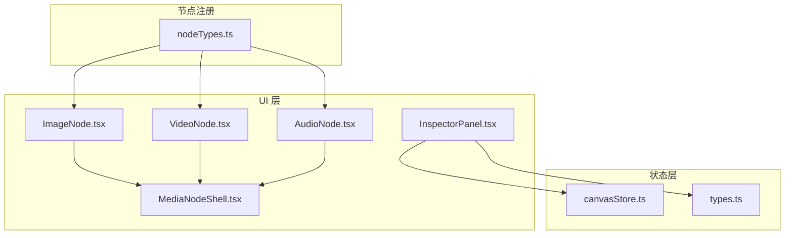
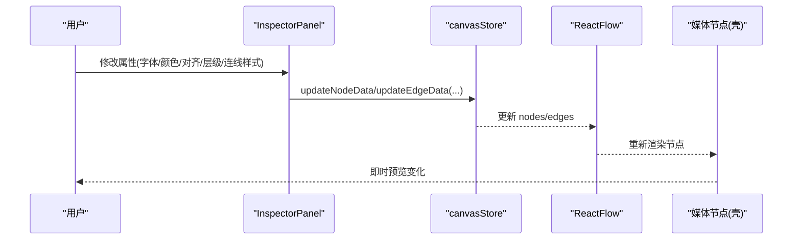
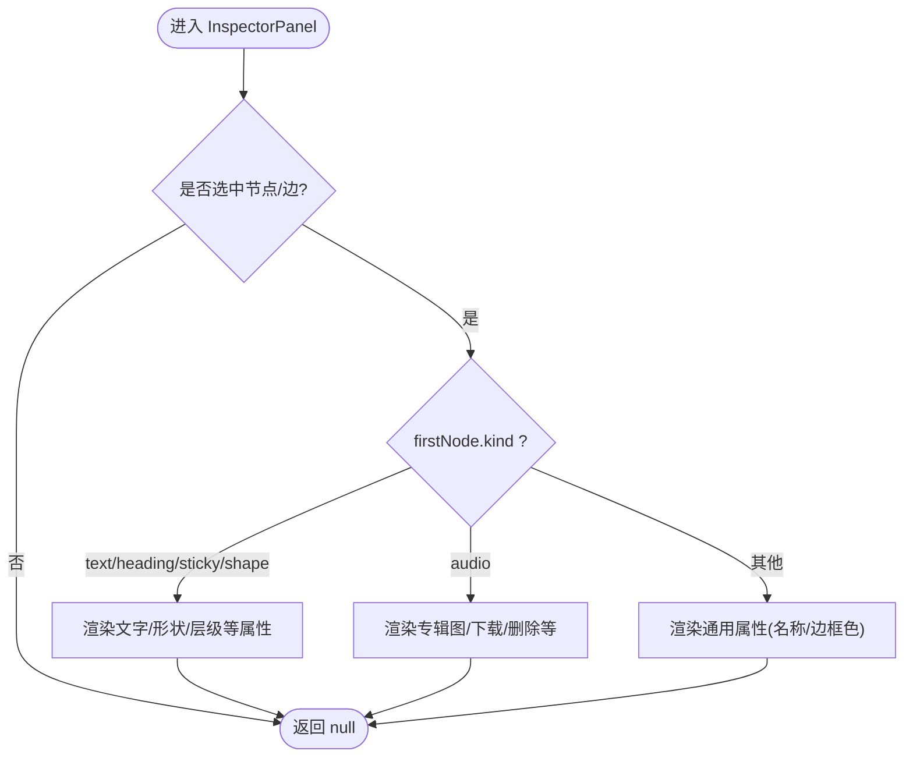
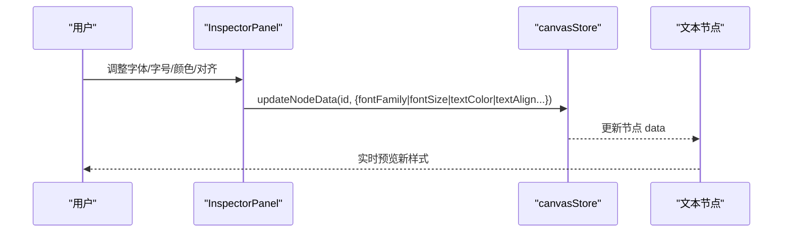
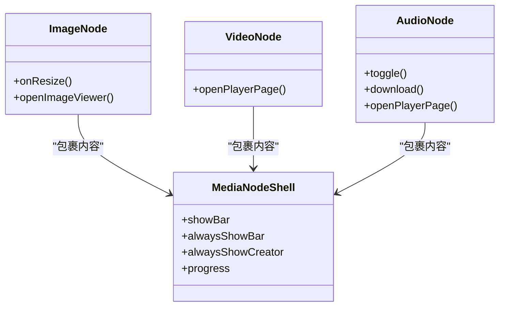
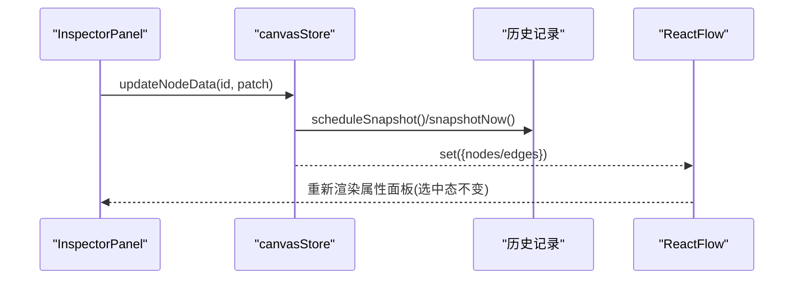
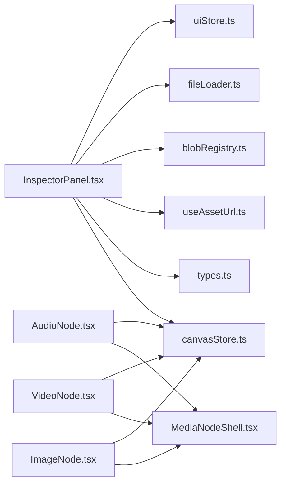

# 属性面板组件

<cite>
**本文引用的文件**
- [InspectorPanel.tsx](file://src/components/InspectorPanel.tsx)
- [canvasStore.ts](file://src/store/canvasStore.ts)
- [types.ts](file://src/types.ts)
- [nodeTypes.ts](file://src/canvas/nodes/nodeTypes.ts)
- [MediaNodeShell.tsx](file://src/canvas/nodes/MediaNodeShell.tsx)
- [ImageNode.tsx](file://src/canvas/nodes/ImageNode.tsx)
- [VideoNode.tsx](file://src/canvas/nodes/VideoNode.tsx)
- [AudioNode.tsx](file://src/canvas/nodes/AudioNode.tsx)
</cite>

## 目录
1. [简介](#简介)
2. [项目结构](#项目结构)
3. [核心组件](#核心组件)
4. [架构总览](#架构总览)
5. [详细组件分析](#详细组件分析)
6. [依赖关系分析](#依赖关系分析)
7. [性能考量](#性能考量)
8. [故障排查指南](#故障排查指南)
9. [结论](#结论)
10. [附录：自定义属性编辑器开发指南](#附录自定义属性编辑器开发指南)

## 简介
本技术文档围绕 InspectorPanel 属性面板组件，系统性阐述其动态渲染机制、文本样式编辑器的实时预览与修改、媒体节点的特殊属性处理、属性变更的实时同步策略、表单验证与错误处理、以及用户体验优化。同时提供扩展自定义属性编辑器的方法，帮助开发者快速为新的节点类型添加专属属性编辑能力。

## 项目结构
InspectorPanel 位于 UI 层，通过订阅画布状态（选中节点/边）动态渲染对应属性编辑器；数据层由 canvasStore 管理节点与边的增删改与历史撤销/重做；类型系统统一约束 SuqNode/SuqEdge 的数据结构；媒体节点通过 MediaNodeShell 统一外壳渲染，并在各自 Node 中实现具体交互。

图表来源
- [InspectorPanel.tsx:288-800](file://src/components/InspectorPanel.tsx#L288-L800)
- [canvasStore.ts:118-191](file://src/store/canvasStore.ts#L118-L191)
- [types.ts:66-107](file://src/types.ts#L66-L107)
- [nodeTypes.ts:14-26](file://src/canvas/nodes/nodeTypes.ts#L14-L26)
- [MediaNodeShell.tsx:32-151](file://src/canvas/nodes/MediaNodeShell.tsx#L32-L151)
- [ImageNode.tsx:15-126](file://src/canvas/nodes/ImageNode.tsx#L15-L126)
- [VideoNode.tsx:18-88](file://src/canvas/nodes/VideoNode.tsx#L18-L88)
- [AudioNode.tsx:18-126](file://src/canvas/nodes/AudioNode.tsx#L18-L126)

章节来源
- [InspectorPanel.tsx:288-800](file://src/components/InspectorPanel.tsx#L288-L800)
- [canvasStore.ts:118-191](file://src/store/canvasStore.ts#L118-L191)
- [types.ts:66-107](file://src/types.ts#L66-L107)
- [nodeTypes.ts:14-26](file://src/canvas/nodes/nodeTypes.ts#L14-L26)

## 核心组件
- InspectorPanel：根据当前选中的节点/边动态渲染属性编辑器，支持文本样式、形状、层级、连线样式等编辑，并调用 store 更新数据。
- canvasStore：集中管理 nodes/edges 的状态与变更，提供 updateNodeData/updateEdgeData 等方法，并维护撤销/重做历史。
- types：定义 SuqNodeData、SuqEdgeData、对齐方式、形状、颜色等类型常量，确保前后端一致。
- MediaNodeShell：媒体节点通用外壳，负责边框、名称栏、创建者信息、进度遮罩、协作锁定提示等。
- ImageNode/VideoNode/AudioNode：媒体节点的具体实现，分别处理图片尺寸自适应、视频封面与播放入口、音频播放控制与专辑图设置。

章节来源
- [InspectorPanel.tsx:288-800](file://src/components/InspectorPanel.tsx#L288-L800)
- [canvasStore.ts:118-191](file://src/store/canvasStore.ts#L118-L191)
- [types.ts:66-107](file://src/types.ts#L66-L107)
- [MediaNodeShell.tsx:32-151](file://src/canvas/nodes/MediaNodeShell.tsx#L32-L151)
- [ImageNode.tsx:15-126](file://src/canvas/nodes/ImageNode.tsx#L15-L126)
- [VideoNode.tsx:18-88](file://src/canvas/nodes/VideoNode.tsx#L18-L88)
- [AudioNode.tsx:18-126](file://src/canvas/nodes/AudioNode.tsx#L18-L126)

## 架构总览
InspectorPanel 作为“只读+写入”的属性面板：
- 读取：从 canvasStore 获取 selectedNodes/selectedEdges，决定渲染哪些属性区块。
- 写入：通过 updateNodeData/updateEdgeData 将用户输入写回 store，触发 ReactFlow 重新渲染节点/边。
- 联动：媒体节点在渲染时读取 store 或本地播放器状态，展示实时进度/封面等信息。

图表来源
- [InspectorPanel.tsx:288-800](file://src/components/InspectorPanel.tsx#L288-L800)
- [canvasStore.ts:176-191](file://src/store/canvasStore.ts#L176-L191)
- [MediaNodeShell.tsx:32-151](file://src/canvas/nodes/MediaNodeShell.tsx#L32-L151)

## 详细组件分析

### 动态渲染机制：按选中节点类型生成属性编辑器
- 选择判断：InspectorPanel 从 canvasStore 获取 selectedEditableNodes/selectedEdges，若为空则不渲染。
- 分支渲染：基于 firstNode.data.kind 进行条件渲染，如 text/heading/sticky/shape/audio 等，分别显示对应的属性区块。
- 多元素编辑：当仅选中一个可编辑节点时，才暴露该节点的专属属性（如标题级别、便签颜色、形状填充）。
- 连线编辑：当选中边时，渲染线型、路径、箭头、颜色、粗细，以及音频分叉处的播放顺序。

图表来源
- [InspectorPanel.tsx:288-800](file://src/components/InspectorPanel.tsx#L288-L800)
- [types.ts:66-107](file://src/types.ts#L66-L107)

章节来源
- [InspectorPanel.tsx:288-800](file://src/components/InspectorPanel.tsx#L288-L800)
- [types.ts:66-107](file://src/types.ts#L66-L107)

### 文本样式编辑器：字体、字号、颜色、对齐的实时预览与修改
- 对齐：水平/垂直对齐使用图标分段控件，直接调用 updateNodeData 更新 textAlign/textAlignV。
- 字体与样式：加粗/斜体/下划线切换布尔值；字体下拉框实时更新 fontFamily；字号/行距通过输入框聚焦时回填草稿值，失焦时校验范围并写回。
- 颜色：ColorField 提供原生颜色选择器与预设色板，onChange 立即写回 textColor/borderColor。
- 实时预览：store 更新后，ReactFlow 节点会立即以新样式渲染，无需刷新页面。

图表来源
- [InspectorPanel.tsx:522-655](file://src/components/InspectorPanel.tsx#L522-L655)
- [canvasStore.ts:176-191](file://src/store/canvasStore.ts#L176-L191)

章节来源
- [InspectorPanel.tsx:522-655](file://src/components/InspectorPanel.tsx#L522-L655)
- [canvasStore.ts:176-191](file://src/store/canvasStore.ts#L176-L191)

### 媒体节点的特殊属性处理
- 图片节点：
  - 尺寸自适应：首次加载时根据自然宽高计算缩放比例，设置节点 dimensions，限制最大宽高。
  - 交互：双击打开大图查看器；悬停显示打开/下载按钮；支持拖拽调整大小。
- 视频节点：
  - 封面缩略图：使用缩略图原尺寸自适应节点大小，避免在画布内嵌播放器影响交互。
  - 播放入口：点击/双击打开全屏播放器页，按需拉取完整视频资源。
- 音频节点：
  - 播放控制：节点内显示播放/暂停按钮与时间，双击进入专用播放器页。
  - 专辑图：InspectorPanel 提供专辑图设置区，可从项目图片中选择或本地上传，并支持移除。
  - 下载：支持直接从节点下载音频文件。

图表来源
- [MediaNodeShell.tsx:32-151](file://src/canvas/nodes/MediaNodeShell.tsx#L32-L151)
- [ImageNode.tsx:15-126](file://src/canvas/nodes/ImageNode.tsx#L15-L126)
- [VideoNode.tsx:18-88](file://src/canvas/nodes/VideoNode.tsx#L18-L88)
- [AudioNode.tsx:18-126](file://src/canvas/nodes/AudioNode.tsx#L18-L126)

章节来源
- [ImageNode.tsx:15-126](file://src/canvas/nodes/ImageNode.tsx#L15-L126)
- [VideoNode.tsx:18-88](file://src/canvas/nodes/VideoNode.tsx#L18-L88)
- [AudioNode.tsx:18-126](file://src/canvas/nodes/AudioNode.tsx#L18-L126)
- [MediaNodeShell.tsx:32-151](file://src/canvas/nodes/MediaNodeShell.tsx#L32-L151)

### 属性变更的实时同步机制
- 数据源：所有属性编辑最终调用 canvasStore.updateNodeData/updateEdgeData，内部对 nodes/edges 进行不可变更新，并记录历史快照。
- 视图同步：ReactFlow 监听 nodes/edges 变化，自动重新渲染节点/边，保证 UI 与数据一致。
- 协作与锁定：MediaNodeShell 检测 lanStore.editing 锁，防止他人正在编辑的元素被误操作。
- 撤销/重做：store 使用防抖快照机制，批量更新后合并历史，支持 undo/redo。

图表来源
- [canvasStore.ts:72-92](file://src/store/canvasStore.ts#L72-L92)
- [canvasStore.ts:176-191](file://src/store/canvasStore.ts#L176-L191)
- [MediaNodeShell.tsx:44-46](file://src/canvas/nodes/MediaNodeShell.tsx#L44-L46)

章节来源
- [canvasStore.ts:72-92](file://src/store/canvasStore.ts#L72-L92)
- [canvasStore.ts:176-191](file://src/store/canvasStore.ts#L176-L191)
- [MediaNodeShell.tsx:44-46](file://src/canvas/nodes/MediaNodeShell.tsx#L44-L46)

### 表单验证、错误处理与用户体验优化
- 表单验证：
  - 字号：最小/最大值限制（8~200），空值时清除。
  - 行距：范围限制（0.5~5），空值时清除。
  - 层级：数值范围限制（0~9999），非数字忽略。
  - 播放顺序：最小为 1，空值时清除。
- 错误处理：
  - 文件导入/下载失败时通过 toast 提示成功/失败。
  - 图片未加载完成时打开查看器会提示稍后重试。
- 用户体验：
  - 输入框聚焦时回填草稿值，失焦时再写回，减少频繁更新。
  - 媒体节点使用占位与淡入过渡，提升加载体验。
  - 协作锁定提示，避免多人同时编辑冲突。

章节来源
- [InspectorPanel.tsx:584-654](file://src/components/InspectorPanel.tsx#L584-L654)
- [ImageNode.tsx:31-37](file://src/canvas/nodes/ImageNode.tsx#L31-L37)
- [MediaNodeShell.tsx:141-147](file://src/canvas/nodes/MediaNodeShell.tsx#L141-L147)

## 依赖关系分析
- InspectorPanel 依赖：
  - canvasStore：读写节点/边数据、层级操作、复制粘贴、对齐等。
  - types：类型定义，确保字段一致性。
  - media/useAssetUrl、media/blobRegistry、io/fileLoader：资源 URL 解析与上传下载。
  - uiStore/toast：全局 UI 状态与消息提示。
- 媒体节点依赖：
  - MediaNodeShell：统一外壳渲染。
  - useCanvasStore：尺寸自适应与节点变更。
  - useUiStore：打开查看器/播放器页。
  - useLanStore：协作编辑锁定。

图表来源
- [InspectorPanel.tsx:1-10](file://src/components/InspectorPanel.tsx#L1-L10)
- [canvasStore.ts:118-191](file://src/store/canvasStore.ts#L118-L191)
- [types.ts:66-107](file://src/types.ts#L66-L107)
- [MediaNodeShell.tsx:32-151](file://src/canvas/nodes/MediaNodeShell.tsx#L32-L151)
- [ImageNode.tsx:15-126](file://src/canvas/nodes/ImageNode.tsx#L15-L126)
- [VideoNode.tsx:18-88](file://src/canvas/nodes/VideoNode.tsx#L18-L88)
- [AudioNode.tsx:18-126](file://src/canvas/nodes/AudioNode.tsx#L18-L126)

章节来源
- [InspectorPanel.tsx:1-10](file://src/components/InspectorPanel.tsx#L1-L10)
- [canvasStore.ts:118-191](file://src/store/canvasStore.ts#L118-L191)
- [types.ts:66-107](file://src/types.ts#L66-L107)
- [MediaNodeShell.tsx:32-151](file://src/canvas/nodes/MediaNodeShell.tsx#L32-L151)

## 性能考量
- 防抖历史：store 使用 scheduleSnapshot 合并多次更新，降低历史栈压力。
- 懒加载媒体：视频仅在打开播放器时拉取完整资源，画布上仅显示缩略图。
- 尺寸自适应：图片/视频首次加载后设置节点尺寸，避免后续重排。
- 局部更新：updateNodeData/updateEdgeData 采用不可变更新，ReactFlow 增量渲染。
- 协作锁定：MediaNodeShell 阻止被他人编辑的元素响应事件，减少无效交互。

[本节为通用性能建议，不直接分析具体文件]

## 故障排查指南
- 属性未生效：
  - 检查是否正确调用 updateNodeData/updateEdgeData，并确保传入的字段存在于 SuqNodeData/SuqEdgeData。
  - 确认节点未被协作锁定（lanStore.editing）。
- 图片无法打开：
  - 图片仍在加载时会提示稍后重试，等待加载完成后再打开。
- 下载失败：
  - 检查资源 URL 是否可用，或网络权限是否允许下载。
- 字号/行距异常：
  - 输入超出范围会被裁剪到边界，空值将被清除。

章节来源
- [ImageNode.tsx:31-37](file://src/canvas/nodes/ImageNode.tsx#L31-L37)
- [InspectorPanel.tsx:584-654](file://src/components/InspectorPanel.tsx#L584-L654)
- [MediaNodeShell.tsx:141-147](file://src/canvas/nodes/MediaNodeShell.tsx#L141-L147)

## 结论
InspectorPanel 通过“状态驱动 + 条件渲染”的方式，实现了按节点类型动态生成属性编辑器，结合 canvasStore 的不可变更新与历史管理，保证了 UI 与数据的一致性。文本样式编辑器提供直观的实时预览；媒体节点在保持画布流畅的前提下，提供了丰富的交互能力。通过合理的表单验证与错误处理，提升了整体用户体验。开发者可依据本文档的扩展指南，轻松为新增节点类型添加属性编辑能力。

[本节为总结性内容，不直接分析具体文件]

## 附录：自定义属性编辑器开发指南
- 步骤概览：
  1. 在 types.ts 中为新节点类型扩展 SuqNodeData 字段（如 kind、特有属性）。
  2. 在 nodeTypes.ts 中注册新节点类型对应的组件。
  3. 在 InspectorPanel 中添加针对新 kind 的条件渲染区块，使用 Segment/IconSegmented/ColorField 等通用控件。
  4. 通过 updateNodeData 将用户输入写回 store，确保实时预览。
  5. 如需媒体相关能力，复用 MediaNodeShell 并提供 progress/alwaysShowBar 等参数。
- 最佳实践：
  - 使用受控输入（value + onChange）确保双向绑定。
  - 对数值输入增加 min/max/step 与失焦写回，避免频繁更新。
  - 对资源操作（上传/下载）增加 try/catch 与 toast 反馈。
  - 考虑协作锁定，禁用被他人编辑的元素。
- 集成示例参考：
  - 文本样式编辑：对齐、字体、字号、颜色、行距等字段的处理流程。
  - 媒体节点：图片尺寸自适应、视频封面与播放入口、音频专辑图设置。

章节来源
- [types.ts:66-107](file://src/types.ts#L66-L107)
- [nodeTypes.ts:14-26](file://src/canvas/nodes/nodeTypes.ts#L14-L26)
- [InspectorPanel.tsx:522-796](file://src/components/InspectorPanel.tsx#L522-L796)
- [MediaNodeShell.tsx:32-151](file://src/canvas/nodes/MediaNodeShell.tsx#L32-L151)
- [ImageNode.tsx:15-126](file://src/canvas/nodes/ImageNode.tsx#L15-L126)
- [VideoNode.tsx:18-88](file://src/canvas/nodes/VideoNode.tsx#L18-L88)
- [AudioNode.tsx:18-126](file://src/canvas/nodes/AudioNode.tsx#L18-L126)