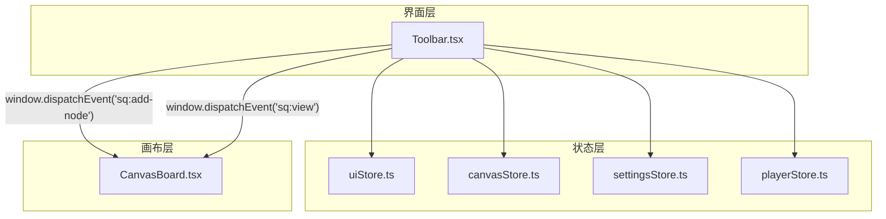
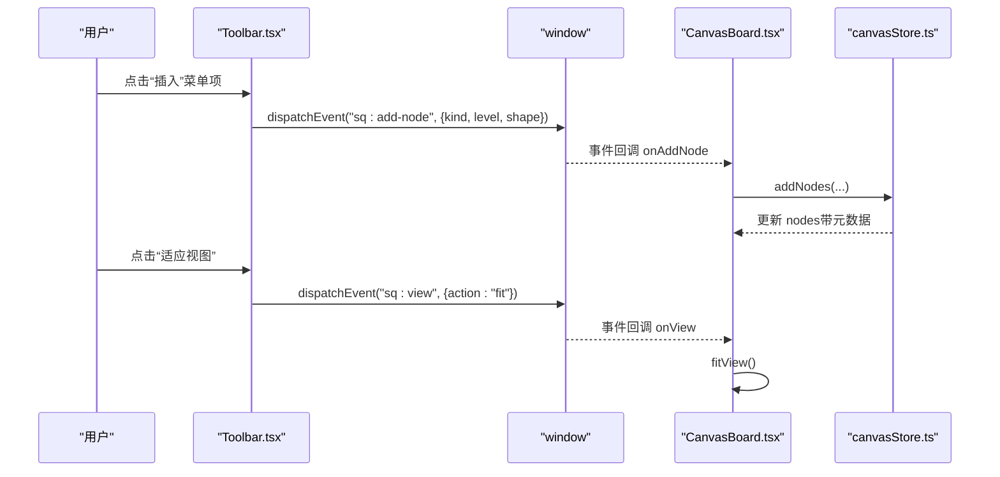
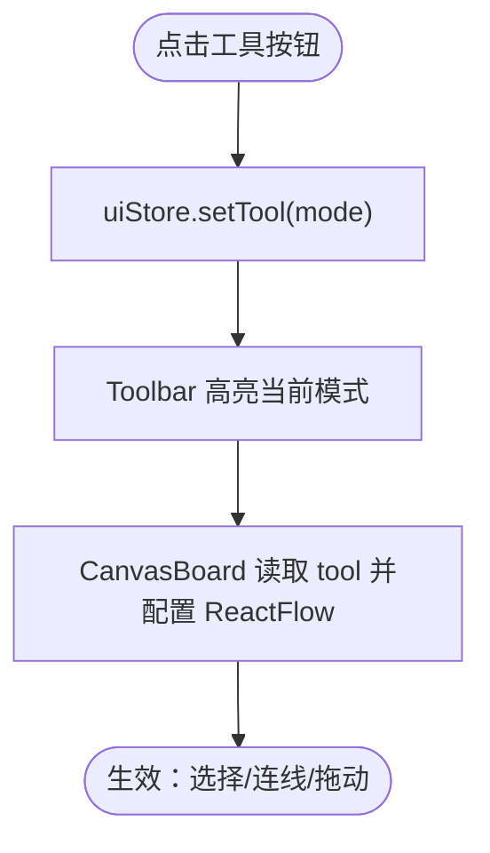
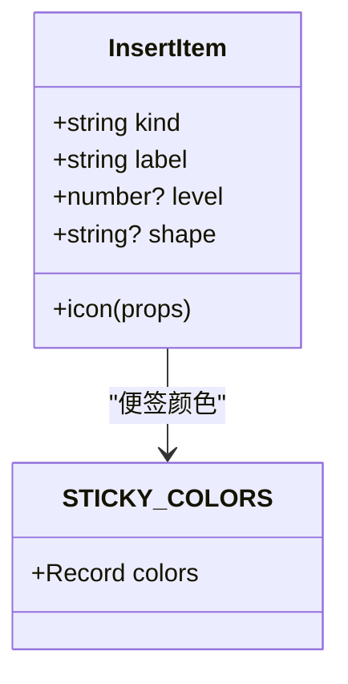
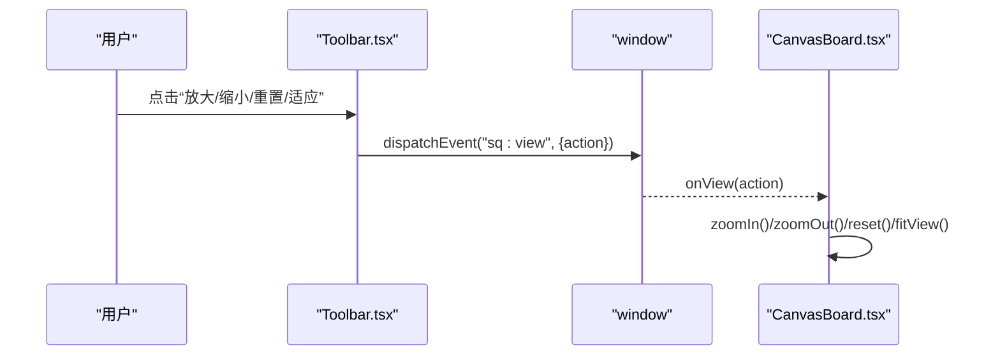
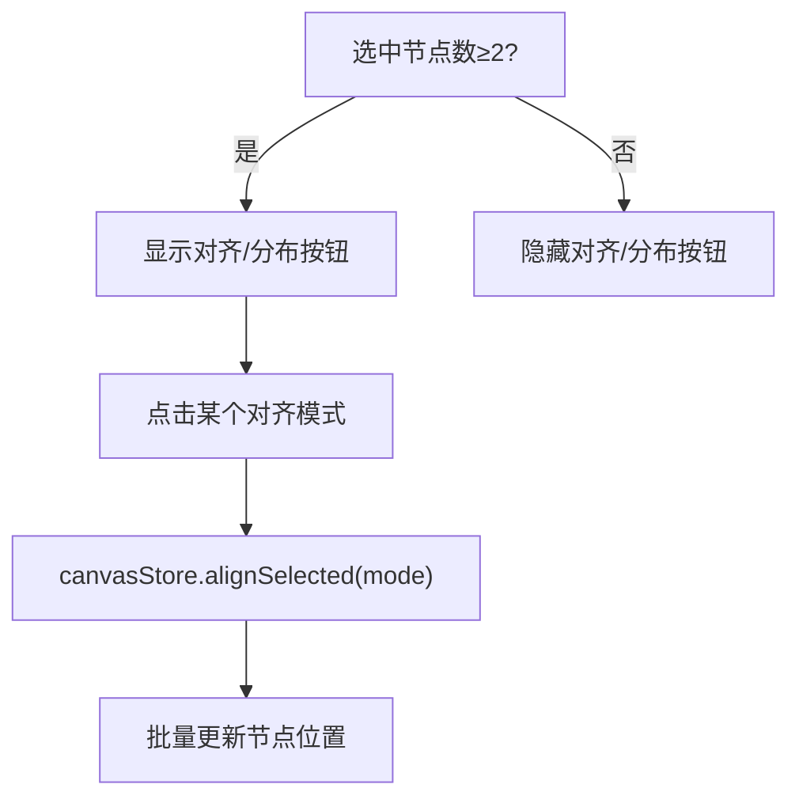
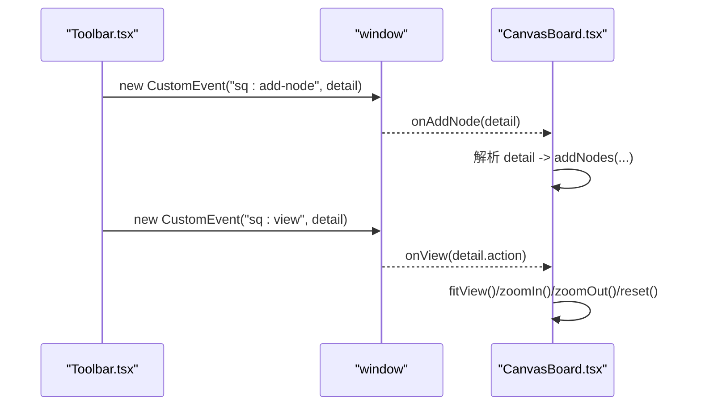
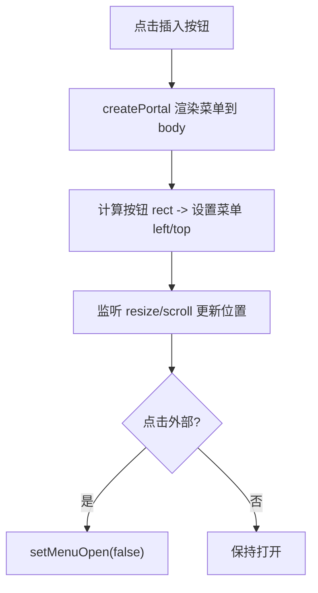
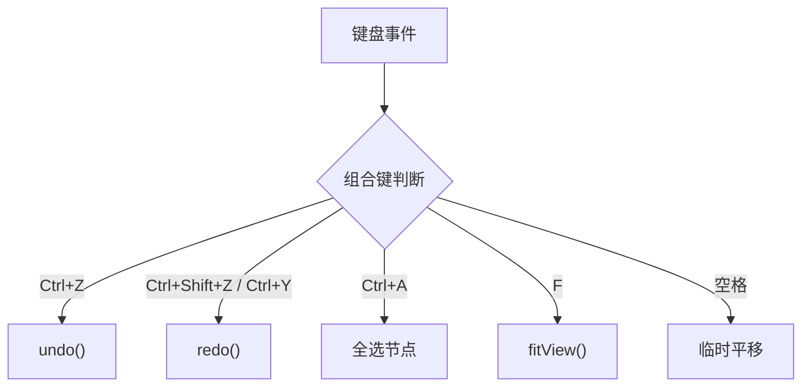
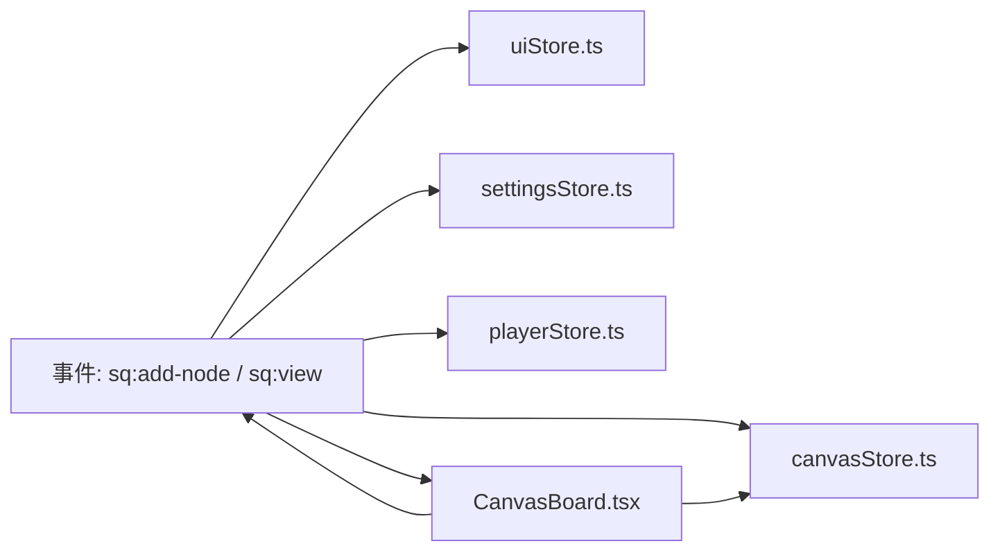

# 工具栏组件

<cite>
**本文引用的文件**
- [Toolbar.tsx](file://src/components/Toolbar.tsx)
- [CanvasBoard.tsx](file://src/canvas/CanvasBoard.tsx)
- [uiStore.ts](file://src/store/uiStore.ts)
- [canvasStore.ts](file://src/store/canvasStore.ts)
- [settingsStore.ts](file://src/store/settingsStore.ts)
- [playerStore.ts](file://src/store/playerStore.ts)
- [types.ts](file://src/types.ts)
</cite>

## 目录
1. [简介](#简介)
2. [项目结构](#项目结构)
3. [核心组件](#核心组件)
4. [架构总览](#架构总览)
5. [详细组件分析](#详细组件分析)
6. [依赖关系分析](#依赖关系分析)
7. [性能考量](#性能考量)
8. [故障排查指南](#故障排查指南)
9. [结论](#结论)
10. [附录：扩展与自定义指南](#附录：扩展与自定义指南)

## 简介
本技术文档围绕 Toolbar 工具栏组件，系统解析其功能模块与实现机制，包括：
- 工具模式选择（选择、连线、拖动）
- 节点插入系统（文本、标题、便签、形状）
- 视图控制（缩放、适应）
- 编辑操作（撤销、重做、对齐）
- 自定义事件系统（sq:add-node、sq:view）的触发与处理
- 动态菜单的实现原理（Portal 渲染、位置计算、点击外部关闭）
- 响应式设计与键盘快捷键支持
- 工具栏扩展开发与自定义工具添加方法

## 项目结构
工具栏位于 src/components/Toolbar.tsx，通过 Zustand store 管理 UI 状态与画布数据，并通过 window CustomEvent 与画布组件通信。画布在 CanvasBoard.tsx 中监听这些事件并执行具体动作。

图表来源
- [Toolbar.tsx:86-92](file://src/components/Toolbar.tsx#L86-L92)
- [CanvasBoard.tsx:297-305](file://src/canvas/CanvasBoard.tsx#L297-L305)

章节来源
- [Toolbar.tsx:1-403](file://src/components/Toolbar.tsx#L1-L403)
- [CanvasBoard.tsx:280-359](file://src/canvas/CanvasBoard.tsx#L280-L359)

## 核心组件
- 工具模式选择：提供“选择”、“连线”、“拖动”三种模式切换，影响画布的交互行为（拖拽、连接半径、选择等）。
- 节点插入系统：通过“插入”按钮弹出菜单，支持插入文本、标题（多级）、便签（含颜色）、形状（矩形、椭圆）。
- 视图控制：提供放大、缩小、重置到 100%、适应视图等操作，统一通过自定义事件驱动。
- 编辑操作：撤销/重做基于画布历史栈；对齐/分布仅在选中节点数≥2时显示。
- 主题切换：深色/浅色主题切换，持久化至本地存储。
- 导入导出：支持导出当前项目为 .sqcanvas 文件，以及从本地导入文件。

章节来源
- [Toolbar.tsx:80-84](file://src/components/Toolbar.tsx#L80-L84)
- [Toolbar.tsx:59-67](file://src/components/Toolbar.tsx#L59-L67)
- [Toolbar.tsx:306-317](file://src/components/Toolbar.tsx#L306-L317)
- [Toolbar.tsx:319-336](file://src/components/Toolbar.tsx#L319-L336)
- [Toolbar.tsx:353-371](file://src/components/Toolbar.tsx#L353-L371)
- [Toolbar.tsx:373-380](file://src/components/Toolbar.tsx#L373-L380)
- [Toolbar.tsx:185-202](file://src/components/Toolbar.tsx#L185-L202)

## 架构总览
工具栏作为“命令发起者”，通过以下两条路径与画布协作：
- 自定义事件：dispatchAddNode 触发 sq:add-node，dispatchView 触发 sq:view，由画布监听并执行插入或视图操作。
- Store 直调：直接调用 uiStore 的工具切换、设置打开/关闭等；调用 canvasStore 的撤销/重做/对齐；调用 playerStore 控制播放器悬浮窗可见性。

图表来源
- [Toolbar.tsx:86-92](file://src/components/Toolbar.tsx#L86-L92)
- [CanvasBoard.tsx:297-305](file://src/canvas/CanvasBoard.tsx#L297-L305)
- [canvasStore.ts:159-171](file://src/store/canvasStore.ts#L159-L171)

## 详细组件分析

### 工具模式选择（选择、连线、拖动）
- 工具模式定义于 uiStore，类型为 ToolMode，默认值为 select。
- Toolbar 渲染三个模式按钮，点击后调用 setTool 切换模式。
- 画布根据 tool 值配置 ReactFlow 的交互行为：是否可拖拽节点、是否可选择、连接半径、是否允许连接等。

图表来源
- [uiStore.ts:3-4](file://src/store/uiStore.ts#L3-L4)
- [uiStore.ts:112-115](file://src/store/uiStore.ts#L112-L115)
- [Toolbar.tsx:287-304](file://src/components/Toolbar.tsx#L287-L304)
- [CanvasBoard.tsx:356-363](file://src/canvas/CanvasBoard.tsx#L356-L363)

章节来源
- [uiStore.ts:3-4](file://src/store/uiStore.ts#L3-L4)
- [uiStore.ts:112-115](file://src/store/uiStore.ts#L112-L115)
- [Toolbar.tsx:80-84](file://src/components/Toolbar.tsx#L80-L84)
- [Toolbar.tsx:287-304](file://src/components/Toolbar.tsx#L287-L304)
- [CanvasBoard.tsx:356-363](file://src/canvas/CanvasBoard.tsx#L356-L363)

### 节点插入系统（文本、标题、便签、形状）
- INSERT_ITEMS 定义了可插入的节点类型及参数（如 heading 的 level、shape 的类型）。
- 点击菜单项后，调用 dispatchAddNode 发送 sq:add-node 事件，携带 kind、level、shape、color 等 payload。
- 画布监听该事件，解析 payload 并调用 addNodes 将节点加入画布，同时注入创建元信息（创建人、时间等）。

图表来源
- [Toolbar.tsx:59-67](file://src/components/Toolbar.tsx#L59-L67)
- [types.ts:28-35](file://src/types.ts#L28-L35)

章节来源
- [Toolbar.tsx:59-67](file://src/components/Toolbar.tsx#L59-L67)
- [Toolbar.tsx:233-282](file://src/components/Toolbar.tsx#L233-L282)
- [Toolbar.tsx:86-88](file://src/components/Toolbar.tsx#L86-L88)
- [CanvasBoard.tsx:297-305](file://src/canvas/CanvasBoard.tsx#L297-L305)
- [canvasStore.ts:159-171](file://src/store/canvasStore.ts#L159-L171)
- [types.ts:28-35](file://src/types.ts#L28-L35)

### 视图控制（缩放、适应）
- 工具栏提供放大、缩小、重置到 100%、适应视图四个入口，均通过 dispatchView 触发 sq:view 事件。
- 画布监听 sq:view，根据 action 调用 zoomIn/zoomOut/reset/fitView 等方法完成视图调整。

图表来源
- [Toolbar.tsx:90-92](file://src/components/Toolbar.tsx#L90-L92)
- [Toolbar.tsx:353-371](file://src/components/Toolbar.tsx#L353-L371)
- [CanvasBoard.tsx:297-305](file://src/canvas/CanvasBoard.tsx#L297-L305)

章节来源
- [Toolbar.tsx:90-92](file://src/components/Toolbar.tsx#L90-L92)
- [Toolbar.tsx:353-371](file://src/components/Toolbar.tsx#L353-L371)
- [CanvasBoard.tsx:297-305](file://src/canvas/CanvasBoard.tsx#L297-L305)

### 编辑操作（撤销、重做、对齐）
- 撤销/重做：Toolbar 直接调用 canvasStore.undo/redo，受 past/future 历史栈控制，按钮禁用态由 canUndo/canRedo 决定。
- 对齐/分布：当 selectedCount ≥ 2 时显示对齐按钮组，调用 alignSelected(mode)，内部计算边界或间距并批量更新节点位置。

图表来源
- [Toolbar.tsx:319-336](file://src/components/Toolbar.tsx#L319-L336)
- [canvasStore.ts:290-361](file://src/store/canvasStore.ts#L290-L361)

章节来源
- [Toolbar.tsx:306-317](file://src/components/Toolbar.tsx#L306-L317)
- [Toolbar.tsx:319-336](file://src/components/Toolbar.tsx#L319-L336)
- [canvasStore.ts:362-383](file://src/store/canvasStore.ts#L362-L383)
- [canvasStore.ts:290-361](file://src/store/canvasStore.ts#L290-L361)

### 自定义事件系统（sq:add-node、sq:view）
- 触发方：Toolbar.tsx 中的 dispatchAddNode 与 dispatchView。
- 处理方：CanvasBoard.tsx 在 useEffect 中注册 window.addEventListener 监听这两个事件，并在回调中执行对应逻辑（插入节点、视图控制）。
- 优势：解耦 UI 与画布逻辑，便于扩展其他触发源（如快捷键、API 调用）。

图表来源
- [Toolbar.tsx:86-92](file://src/components/Toolbar.tsx#L86-L92)
- [CanvasBoard.tsx:297-305](file://src/canvas/CanvasBoard.tsx#L297-L305)

章节来源
- [Toolbar.tsx:86-92](file://src/components/Toolbar.tsx#L86-L92)
- [CanvasBoard.tsx:297-305](file://src/canvas/CanvasBoard.tsx#L297-L305)

### 动态菜单（Portal 渲染、位置计算、点击外部关闭）
- Portal 渲染：使用 createPortal 将菜单渲染到 document.body，避免父容器 overflow 裁剪问题。
- 位置计算：通过 insertButtonRef.getBoundingClientRect() 获取按钮位置，设置 left/top，并在窗口 resize/scroll 时重新计算。
- 点击外部关闭：document mousedown 事件检测点击目标是否在菜单或 Portal 容器中，否则关闭菜单。

图表来源
- [Toolbar.tsx:127-156](file://src/components/Toolbar.tsx#L127-L156)
- [Toolbar.tsx:233-282](file://src/components/Toolbar.tsx#L233-L282)

章节来源
- [Toolbar.tsx:127-156](file://src/components/Toolbar.tsx#L127-L156)
- [Toolbar.tsx:233-282](file://src/components/Toolbar.tsx#L233-L282)

### 响应式设计适配与键盘快捷键
- 响应式：工具栏使用 flex 布局与滚动条隐藏样式，在小屏下横向滚动；部分元素按断点显示/隐藏（如百分比显示、CD 图标等）。
- 快捷键：画布内监听键盘事件，支持 Ctrl/Cmd + Z/Y 撤销重做、Ctrl/Cmd + A 全选、F 适应视图、空格临时平移等；工具模式快捷键 V/C/H 在工具按钮上以 title 提示。

图表来源
- [CanvasBoard.tsx:127-150](file://src/canvas/CanvasBoard.tsx#L127-L150)
- [CanvasBoard.tsx:152-158](file://src/canvas/CanvasBoard.tsx#L152-L158)
- [Toolbar.tsx:287-304](file://src/components/Toolbar.tsx#L287-L304)

章节来源
- [CanvasBoard.tsx:127-150](file://src/canvas/CanvasBoard.tsx#L127-L150)
- [CanvasBoard.tsx:152-158](file://src/canvas/CanvasBoard.tsx#L152-L158)
- [Toolbar.tsx:287-304](file://src/components/Toolbar.tsx#L287-L304)

## 依赖关系分析
- Toolbar 依赖 uiStore 管理工具模式与 UI 开关，依赖 canvasStore 进行撤销/重做/对齐，依赖 settingsStore 切换主题，依赖 playerStore 控制播放器悬浮窗。
- 画布依赖 ReactFlow 提供的 API（fitView、zoomIn/Out、setCenter 等），并通过 window 事件与 Toolbar 解耦通信。
- 类型定义集中在 types.ts，用于节点数据、边样式、颜色等。

图表来源
- [Toolbar.tsx:1-12](file://src/components/Toolbar.tsx#L1-L12)
- [CanvasBoard.tsx:297-305](file://src/canvas/CanvasBoard.tsx#L297-L305)
- [types.ts:1-112](file://src/types.ts#L1-L112)

章节来源
- [Toolbar.tsx:1-12](file://src/components/Toolbar.tsx#L1-L12)
- [CanvasBoard.tsx:297-305](file://src/canvas/CanvasBoard.tsx#L297-L305)
- [types.ts:1-112](file://src/types.ts#L1-L112)

## 性能考量
- 历史快照防抖：canvasStore 使用 scheduleSnapshot 与 flushPending 合并频繁修改，减少历史条目写入开销。
- 对齐算法复杂度：distributeH/V 对选中节点排序并线性扫描，整体 O(n log n) 或 O(n)。
- 菜单定位：resize/scroll 事件监听可能频繁触发，建议在实际使用中考虑节流优化（当前实现未节流）。
- 主题切换：仅切换类名与本地存储，开销极低。

[本节为通用性能讨论，不直接分析具体代码行]

## 故障排查指南
- 插入节点无效：检查 Toolbar 是否正确触发 sq:add-node 事件，且 CanvasBoard 是否已注册监听器。
- 视图控制无效：确认 sq:view 事件是否被 CanvasBoard 接收，以及 fitView/zoomIn/Out 是否可用。
- 对齐按钮不显示：确保 selectedCount ≥ 2，且节点具备 width/height/measured 尺寸信息。
- 撤销/重做不可用：检查 past/future 是否为空，或是否存在重复快照导致无变化。
- 菜单无法关闭：检查 mousedown 事件是否捕获到非菜单区域，并确保 portalMenuRef 引用正确。

章节来源
- [Toolbar.tsx:127-156](file://src/components/Toolbar.tsx#L127-L156)
- [Toolbar.tsx:233-282](file://src/components/Toolbar.tsx#L233-L282)
- [CanvasBoard.tsx:297-305](file://src/canvas/CanvasBoard.tsx#L297-L305)
- [canvasStore.ts:290-361](file://src/store/canvasStore.ts#L290-L361)
- [canvasStore.ts:362-383](file://src/store/canvasStore.ts#L362-L383)

## 结论
Toolbar 工具栏通过清晰的职责划分与事件驱动架构，实现了工具模式切换、节点插入、视图控制、编辑操作等功能。其解耦设计使得扩展与维护更加便捷，配合响应式与快捷键提升用户体验。建议在后续迭代中引入节流优化与更完善的错误提示，以提升稳定性与可维护性。

[本节为总结性内容，不直接分析具体代码行]

## 附录：扩展与自定义指南

### 新增工具模式
- 在 uiStore 中扩展 ToolMode 类型，并增加对应的 setTool 逻辑。
- 在 Toolbar 的 TOOL_ITEMS 中添加新按钮，绑定 setTool。
- 在 CanvasBoard 中根据新 tool 值配置 ReactFlow 行为（如 panOnDrag、selectionOnDrag、nodesConnectable 等）。

章节来源
- [uiStore.ts:3-4](file://src/store/uiStore.ts#L3-L4)
- [Toolbar.tsx:80-84](file://src/components/Toolbar.tsx#L80-L84)
- [CanvasBoard.tsx:356-363](file://src/canvas/CanvasBoard.tsx#L356-L363)

### 新增节点类型
- 在 types.ts 的 MediaKind 中添加新类型，并在 INSERT_ITEMS 中定义插入项。
- 在 Toolbar 的插入菜单中渲染新选项，必要时支持参数（如颜色、形状）。
- 在 CanvasBoard 的事件处理中解析 payload，并调用 addNodes 插入节点。

章节来源
- [types.ts:3-14](file://src/types.ts#L3-L14)
- [Toolbar.tsx:59-67](file://src/components/Toolbar.tsx#L59-L67)
- [Toolbar.tsx:233-282](file://src/components/Toolbar.tsx#L233-L282)
- [CanvasBoard.tsx:297-305](file://src/canvas/CanvasBoard.tsx#L297-L305)

### 扩展视图控制
- 在 Toolbar 中新增按钮，调用 dispatchView 传递新的 action。
- 在 CanvasBoard 的 onView 中处理新 action，调用相应的 ReactFlow API。

章节来源
- [Toolbar.tsx:90-92](file://src/components/Toolbar.tsx#L90-L92)
- [Toolbar.tsx:353-371](file://src/components/Toolbar.tsx#L353-L371)
- [CanvasBoard.tsx:297-305](file://src/canvas/CanvasBoard.tsx#L297-L305)

### 扩展快捷键
- 在 CanvasBoard 的 keydown 监听中新增条件分支，处理新的快捷键组合。
- 在 Toolbar 的按钮 title 中提示快捷键，提升可用性。

章节来源
- [CanvasBoard.tsx:127-150](file://src/canvas/CanvasBoard.tsx#L127-L150)
- [Toolbar.tsx:287-304](file://src/components/Toolbar.tsx#L287-L304)