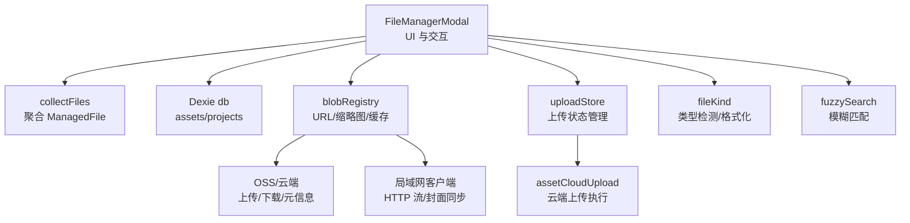
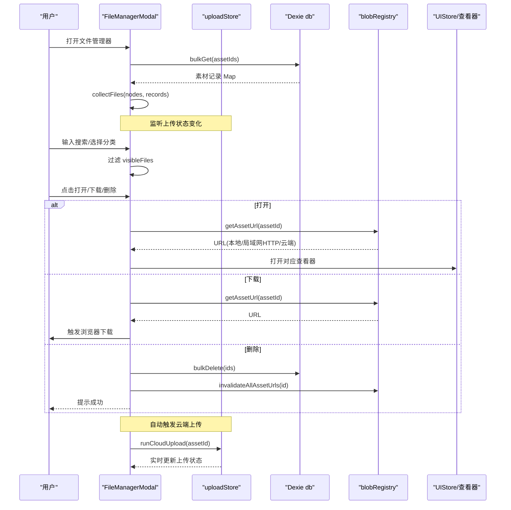
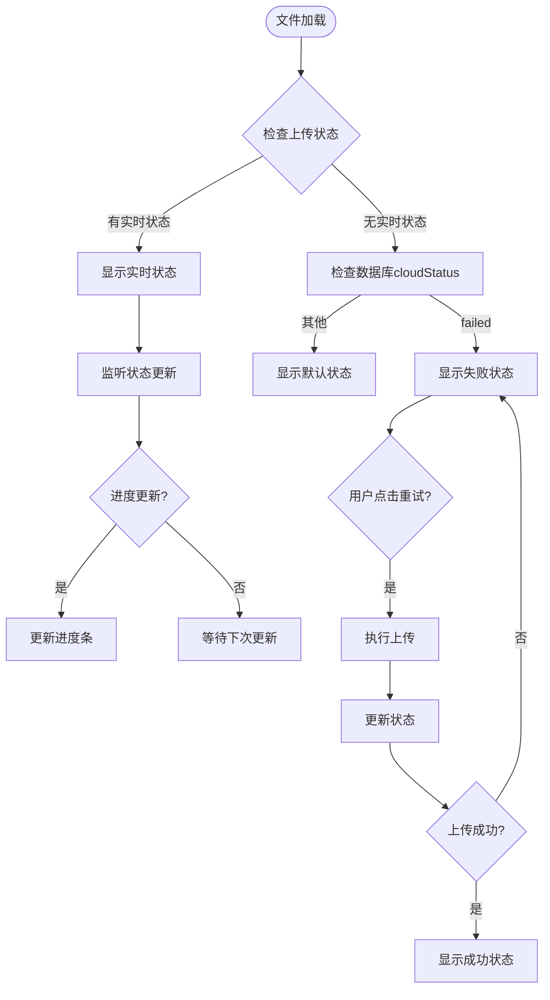
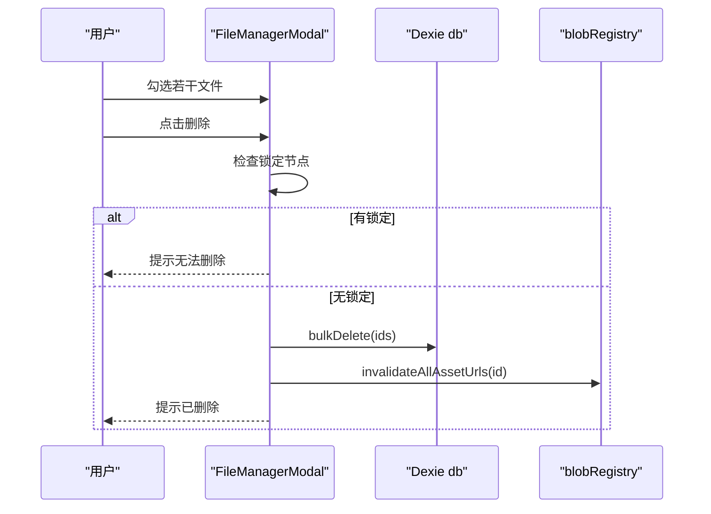
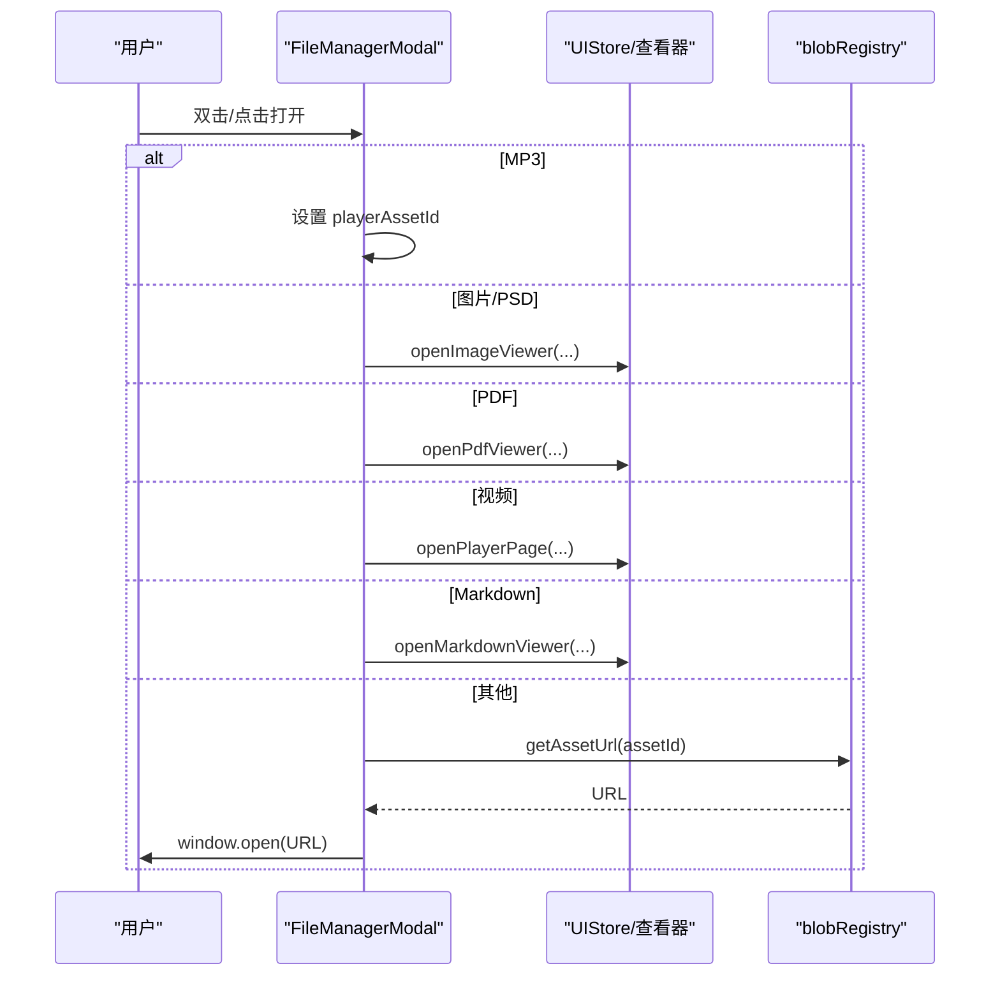
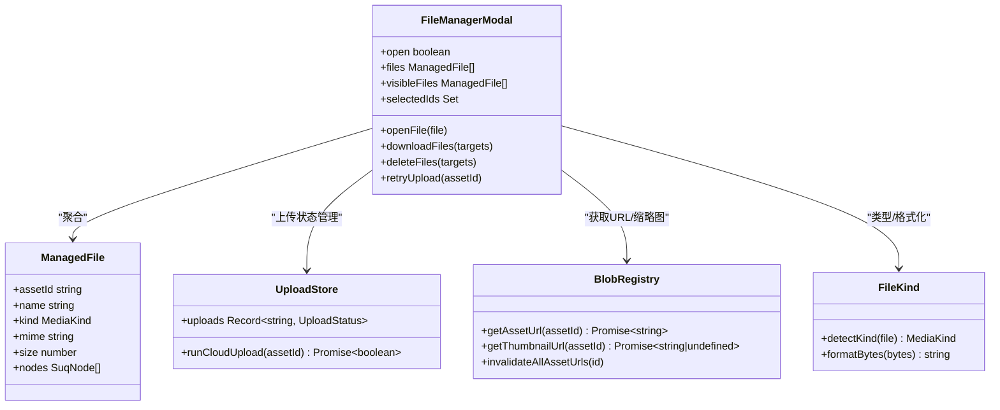

现在我已经充分了解了上传状态功能的实现。让我更新文件管理器组件的技术文档：

# 文件管理器组件

<cite>
**本文引用的文件**
- [src/components/FileManagerModal.tsx](file://src/components/FileManagerModal.tsx)
- [src/store/uploadStore.ts](file://src/store/uploadStore.ts)
- [src/media/fileKind.ts](file://src/media/fileKind.ts)
- [src/media/managedFile.ts](file://src/media/managedFile.ts)
- [src/io/fileLoader.ts](file://src/io/fileLoader.ts)
- [src/media/blobRegistry.ts](file://src/media/blobRegistry.ts)
- [src/db/db.ts](file://src/db/db.ts)
- [src/search/fuzzySearch.ts](file://src/search/fuzzySearch.ts)
- [src/types.ts](file://src/types.ts)
- [src/sync/assetCloudUpload.ts](file://src/sync/assetCloudUpload.ts)
</cite>

## 更新摘要
**变更内容**
- 新增实时上传状态显示功能，包括上传进度条、失败指示器和重试机制
- 增强文件列表界面，支持三种视觉状态：上传中（带动画进度条）、失败（带可点击重试按钮）、成功（带勾选图标）
- 集成 uploadStore 状态管理，提供实时的云端上传进度跟踪
- 完善错误处理和用户反馈机制

## 目录
1. [简介](#简介)
2. [项目结构](#项目结构)
3. [核心组件](#核心组件)
4. [架构总览](#架构总览)
5. [详细组件分析](#详细组件分析)
6. [依赖关系分析](#依赖关系分析)
7. [性能考量](#性能考量)
8. [故障排查指南](#故障排查指南)
9. [结论](#结论)
10. [附录](#附录)

## 简介
本技术文档围绕 FileManagerModal 文件管理器组件，系统性解析其核心能力：文件列表展示、分类筛选、搜索过滤、批量操作；深入说明文件元数据的获取与展示（类型图标、大小、创建者、缩略图）；阐述上传、下载、删除等操作的交互与数据流；解释文件树形分组与展开收起逻辑；总结大文件处理的性能优化策略（如本地缓存、HTTP 流式播放、并发控制、懒加载）；并提供扩展开发指南与自定义文件类型的接入方法。

**最新更新**：文件管理器现已支持实时云端上传状态显示，包括上传进度条、失败重试功能和成功确认指示器，为用户提供完整的云端同步体验。

## 项目结构
文件管理器由 UI 层、数据聚合层、资源访问层、存储与同步层共同构成：
- UI 层：FileManagerModal 负责渲染列表、侧边分类、搜索框、批量操作按钮与播放器入口。
- 数据聚合层：collectFiles 将画布节点与素材记录聚合为"可管理文件"视图。
- 资源访问层：blobRegistry 提供 URL/缩略图获取、缓存、并发控制与回退策略。
- 存储与同步层：db 使用 IndexedDB 持久化素材；OSS/局域网/云端用于上传、拉取与同步。
- **新增**：uploadStore 管理实时上传状态，提供进度跟踪和错误处理。



**图表来源**
- [src/components/FileManagerModal.tsx:63-416](file://src/components/FileManagerModal.tsx#L63-L416)
- [src/store/uploadStore.ts:25-76](file://src/store/uploadStore.ts#L25-L76)
- [src/sync/assetCloudUpload.ts:15-44](file://src/sync/assetCloudUpload.ts#L15-L44)

**章节来源**
- [src/components/FileManagerModal.tsx:63-416](file://src/components/FileManagerModal.tsx#L63-L416)
- [src/store/uploadStore.ts:25-76](file://src/store/uploadStore.ts#L25-L76)
- [src/sync/assetCloudUpload.ts:15-44](file://src/sync/assetCloudUpload.ts#L15-L44)

## 核心组件
- FileManagerModal：主界面与交互中枢，负责打开/关闭、搜索、分类筛选、全选与批量下载/删除、音频播放器入口切换，以及**实时上传状态显示**。
- collectFiles：将画布节点按 assetId 聚合，合并名称、类型、MIME、大小等信息，形成统一的文件视图。
- blobRegistry：统一管理资源 URL 与缩略图 URL，包含本地 IndexedDB、局域网 HTTP 流、云端回源、并发限制与缓存失效。
- **uploadStore**：管理云端上传的实时状态，包括进度跟踪、错误处理和重试机制。
- fileKind：文件类型检测与字节数格式化。
- fuzzySearch：多字段模糊匹配评分，支持文件名、MIME、类型、插入者等多维度检索。
- db：IndexedDB 封装，维护 assets 与 projects 表，以及资产回收机制。

**章节来源**
- [src/components/FileManagerModal.tsx:63-416](file://src/components/FileManagerModal.tsx#L63-L416)
- [src/store/uploadStore.ts:25-76](file://src/store/uploadStore.ts#L25-L76)
- [src/media/managedFile.ts:17-38](file://src/media/managedFile.ts#L17-L38)
- [src/media/blobRegistry.ts:84-126](file://src/media/blobRegistry.ts#L84-L126)
- [src/media/fileKind.ts:3-16](file://src/media/fileKind.ts#L3-L16)
- [src/search/fuzzySearch.ts:7-29](file://src/search/fuzzySearch.ts#L7-L29)
- [src/db/db.ts:25-33](file://src/db/db.ts#L25-L33)

## 架构总览
文件管理器在打开时从画布状态提取所有关联的 assetId，批量读取 IndexedDB 中的素材记录，再聚合为文件列表。用户通过搜索与分类进行过滤，选择后可执行打开、下载、删除等操作。不同媒体类型会触发不同的打开路径（图片查看器、PDF 查看器、视频播放器、Markdown 编辑器或外部浏览器）。

**新增功能**：每个文件现在显示实时云端上传状态，包括上传进度、失败重试和成功确认。



**图表来源**
- [src/components/FileManagerModal.tsx:106-135](file://src/components/FileManagerModal.tsx#L106-L135)
- [src/components/FileManagerModal.tsx:160-194](file://src/components/FileManagerModal.tsx#L160-L194)
- [src/components/FileManagerModal.tsx:196-244](file://src/components/FileManagerModal.tsx#L196-L244)
- [src/store/uploadStore.ts:25-76](file://src/store/uploadStore.ts#L25-L76)

## 详细组件分析

### 文件列表展示与元数据
- 列表项包含：复选框、类型图标、文件名、MIME、元素数量、类型标签、文件大小、操作按钮（查看、下载、删除）。
- 元数据来源：
  - 名称/类型/MIME/大小：来自 collectFiles 聚合后的 ManagedFile，优先使用 IndexedDB 中的 AssetRecord，否则回退到画布节点的 data。
  - 类型图标：根据 kind 映射显示。
  - 文件大小：formatBytes 格式化。
  - 缩略图：通过 useThumbnailUrl/blobRegistry.getThumbnailUrl 获取，支持局域网同步封面、本地缓存、视频抓帧生成与回退。
- **新增**：云端上传状态显示，包括上传进度条、失败重试按钮和成功确认图标。

**章节来源**
- [src/components/FileManagerModal.tsx:391-461](file://src/components/FileManagerModal.tsx#L391-L461)
- [src/media/managedFile.ts:17-38](file://src/media/managedFile.ts#L17-L38)
- [src/media/fileKind.ts:18-23](file://src/media/fileKind.ts#L18-L23)
- [src/media/blobRegistry.ts:310-379](file://src/media/blobRegistry.ts#L310-L379)

### 实时上传状态管理
**新增功能**：文件管理器现在集成了完整的云端上传状态管理系统。

- **状态类型**：
  - `uploading`：上传进行中，显示动画进度条
  - `failed`：上传失败，显示可点击的重试按钮
  - `done`：上传成功，显示绿色勾选图标
- **状态来源**：
  - 实时状态来自 uploadStore 的 uploads 状态
  - 页面刷新后从 IndexedDB 的 cloudStatus 恢复失败状态
- **进度更新**：
  - 进度回调节流（120ms间隔），避免频繁重渲染
  - 成功后状态保留4秒后自动清除
- **重试机制**：
  - 失败的上传可通过点击重试按钮重新上传
  - 重试后会从 IndexedDB 获取最新记录，确保状态同步



**图表来源**
- [src/components/FileManagerModal.tsx:251-261](file://src/components/FileManagerModal.tsx#L251-L261)
- [src/store/uploadStore.ts:25-76](file://src/store/uploadStore.ts#L25-L76)

**章节来源**
- [src/components/FileManagerModal.tsx:251-261](file://src/components/FileManagerModal.tsx#L251-L261)
- [src/components/FileManagerModal.tsx:391-461](file://src/components/FileManagerModal.tsx#L391-L461)
- [src/store/uploadStore.ts:25-76](file://src/store/uploadStore.ts#L25-L76)

### 分类筛选与树形分组
- 左侧分组：媒体、文档、其他，每组内列出具体类型（image/video/audio/pdf/psd/markdown/text/file 等），并显示计数。
- 展开/收起：通过 expandedGroups 状态控制，点击组头切换展开态。
- 移动端：顶部提供下拉选择当前可见的类型筛选。


**图表来源**
- [src/components/FileManagerModal.tsx:280-323](file://src/components/FileManagerModal.tsx#L280-L323)
- [src/components/FileManagerModal.tsx:326-337](file://src/components/FileManagerModal.tsx#L326-L337)

**章节来源**
- [src/components/FileManagerModal.tsx:280-323](file://src/components/FileManagerModal.tsx#L280-L323)
- [src/components/FileManagerModal.tsx:326-337](file://src/components/FileManagerModal.tsx#L326-L337)

### 搜索过滤
- 搜索字段：文件名、MIME、kind、类型中文标签、插入者名称（createdByName）。
- 匹配算法：fuzzyScore 对每个 token 进行评分，支持前缀、包含、模糊匹配，并按分数排序。
- 实时过滤：query 变化时重新计算 visibleFiles。

```mermaid
flowchart TD
Q["输入查询"] --> N["规范化/分词"]
N --> F["遍历 files"]
F --> M{"matchesFile(file, tokens)}
M --> |是| Keep["加入 visibleFiles"]
M --> |否| Drop["忽略"]
Keep --> R["渲染结果"]
Drop --> R
```

**图表来源**
- [src/components/FileManagerModal.tsx:41-52](file://src/components/FileManagerModal.tsx#L41-L52)
- [src/search/fuzzySearch.ts:7-29](file://src/search/fuzzySearch.ts#L7-L29)

**章节来源**
- [src/components/FileManagerModal.tsx:41-52](file://src/components/FileManagerModal.tsx#L41-L52)
- [src/search/fuzzySearch.ts:7-29](file://src/search/fuzzySearch.ts#L7-L29)

### 批量操作
- 全选：基于 visibleFiles 的全选开关，支持反选。
- 下载：逐个获取 URL 并触发浏览器下载，批量时增加间隔避免瞬时请求过多。
- 删除：检查锁定状态（他人编辑中不可删），确认后批量删除 IndexedDB 记录，并清理 URL 缓存。



**图表来源**
- [src/components/FileManagerModal.tsx:214-244](file://src/components/FileManagerModal.tsx#L214-L244)
- [src/media/blobRegistry.ts:41-56](file://src/media/blobRegistry.ts#L41-L56)

**章节来源**
- [src/components/FileManagerModal.tsx:214-244](file://src/components/FileManagerModal.tsx#L214-L244)
- [src/media/blobRegistry.ts:41-56](file://src/media/blobRegistry.ts#L41-L56)

### 打开与预览
- 音频 MP3：切换到内置音频播放器视图，支持从文件管理器继续播放。
- 图片/PSD：打开图片查看器（PSD 走预览流程）。
- PDF：打开 PDF 查看器。
- 视频：跳转至视频播放器页面。
- Markdown：打开 Markdown 查看器（若被他人编辑则提示暂不可用）。
- 其他：尝试获取 URL 后在新窗口打开。



**图表来源**
- [src/components/FileManagerModal.tsx:160-194](file://src/components/FileManagerModal.tsx#L160-L194)
- [src/media/blobRegistry.ts:84-105](file://src/media/blobRegistry.ts#L84-L105)

**章节来源**
- [src/components/FileManagerModal.tsx:160-194](file://src/components/FileManagerModal.tsx#L160-L194)
- [src/media/blobRegistry.ts:84-105](file://src/media/blobRegistry.ts#L84-L105)

### 缩略图生成与展示
- 视频缩略图：优先使用局域网同步的封面；若无，则通过本地 blob 或局域网 HTTP 流式地址抓取画面生成 JPEG，并进行黑帧自检与重试；必要时回退到全量拉取后再抓帧。
- PSD 预览：通过专用预览流程生成缩略图，失败不影响原文件可用性。
- 缓存与并发：缩略图 URL 缓存，抓帧并发上限限制，避免阻塞视频播放。

**章节来源**
- [src/media/blobRegistry.ts:128-268](file://src/media/blobRegistry.ts#L128-L268)
- [src/media/blobRegistry.ts:310-379](file://src/media/blobRegistry.ts#L310-L379)
- [src/io/fileLoader.ts:20-59](file://src/io/fileLoader.ts#L20-L59)
- [src/io/fileLoader.ts:77-117](file://src/io/fileLoader.ts#L77-L117)

### 文件导入与上传
- 导入流程：检测类型、生成缩略图（视频/PSD）、写入 IndexedDB、创建画布节点、推送到局域网与云端（可选）。
- 大文件保护：超过阈值跳过并提示。
- 文本资源更新：支持更新可编辑文本资源并复用同步链路。
- **新增**：自动云端上传，上传过程中显示实时进度和状态。

**章节来源**
- [src/io/fileLoader.ts:77-117](file://src/io/fileLoader.ts#L77-L117)
- [src/io/fileLoader.ts:186-205](file://src/io/fileLoader.ts#L186-L205)
- [src/io/fileLoader.ts:119-135](file://src/io/fileLoader.ts#L119-L135)

## 依赖关系分析
- FileManagerModal 依赖：
  - managedFile.collectFiles：聚合文件视图。
  - search.fuzzySearch：搜索匹配。
  - media.blobRegistry：资源 URL/缩略图获取与缓存。
  - **uploadStore**：云端上传状态管理和进度跟踪。
  - db：素材与项目数据存取。
  - store.uiStore/canvasStore/lanStore/projectStore：应用状态与跨模块通信。
- 类型系统：MediaKind 定义所有受支持的媒体与节点类型，贯穿文件识别、图标、节点创建等。



**图表来源**
- [src/components/FileManagerModal.tsx:63-416](file://src/components/FileManagerModal.tsx#L63-L416)
- [src/store/uploadStore.ts:25-76](file://src/store/uploadStore.ts#L25-L76)
- [src/media/managedFile.ts:4-38](file://src/media/managedFile.ts#L4-L38)
- [src/media/blobRegistry.ts:84-126](file://src/media/blobRegistry.ts#L84-L126)
- [src/media/fileKind.ts:3-23](file://src/media/fileKind.ts#L3-L23)

**章节来源**
- [src/components/FileManagerModal.tsx:63-416](file://src/components/FileManagerModal.tsx#L63-L416)
- [src/store/uploadStore.ts:25-76](file://src/store/uploadStore.ts#L25-L76)
- [src/media/managedFile.ts:4-38](file://src/media/managedFile.ts#L4-L38)
- [src/media/blobRegistry.ts:84-126](file://src/media/blobRegistry.ts#L84-L126)
- [src/media/fileKind.ts:3-23](file://src/media/fileKind.ts#L3-L23)

## 性能考量
- 本地优先与缓存：
  - 资源 URL 优先使用本地 IndexedDB 的 blob，减少网络开销。
  - URL 与缩略图 URL 均做内存缓存，避免重复生成与请求。
- 大文件与流式播放：
  - 视频资源优先使用局域网 HTTP 流式地址，边下边播，避免整份下载到本地造成内存/磁盘压力。
  - 缩略图抓取限制并发（默认 2），防止多 video seek 占满连接池影响播放。
- 懒加载与重试：
  - 缩略图在局域网环境下采用快速/慢速轮询策略，最长等待一定时间，提升弱网体验。
  - 资源加载失败时有限重试，避免瞬时错误导致不可用。
- 批量操作节流：
  - 批量下载间增加短暂延迟，降低瞬时请求峰值。
- 内存释放：
  - 删除或关闭时及时撤销 URL，避免内存泄漏。
- **新增**：上传状态性能优化：
  - 进度回调节流（120ms间隔），避免高频重渲染。
  - 成功后状态自动清理，防止内存泄漏。
  - 上传状态与数据库状态同步，确保一致性。

**章节来源**
- [src/media/blobRegistry.ts:12-23](file://src/media/blobRegistry.ts#L12-L23)
- [src/media/blobRegistry.ts:84-105](file://src/media/blobRegistry.ts#L84-L105)
- [src/media/blobRegistry.ts:241-268](file://src/media/blobRegistry.ts#L241-L268)
- [src/media/blobRegistry.ts:310-379](file://src/media/blobRegistry.ts#L310-L379)
- [src/components/FileManagerModal.tsx:196-212](file://src/components/FileManagerModal.tsx#L196-L212)
- [src/store/uploadStore.ts:20-23](file://src/store/uploadStore.ts#L20-L23)

## 故障排查指南
- 无法打开文件：
  - 检查是否处于他人编辑锁定状态（Markdown 等），等待解锁或提示用户。
  - 确认资源是否存在于本地/局域网/云端，必要时触发回源拉取。
- 下载失败：
  - 检查 getAssetUrl 是否返回有效 URL，关注网络与权限问题。
- 删除无效：
  - 确认目标文件未被他人锁定；确认 IndexedDB 删除成功且 URL 缓存已失效。
- 缩略图不显示：
  - 检查是否为视频且无本地 blob/HTTP 流式地址；确认局域网同步是否正常；查看抓帧并发与重试逻辑。
- 大文件导入失败：
  - 检查是否超过大小限制；确认持久化存储请求是否成功；关注云端/局域网同步错误提示。
- **新增**：云端上传问题：
  - 检查 OSS 配置和登录状态。
  - 确认本地文件存在且未损坏。
  - 查看网络状态和权限设置。
  - 使用重试功能重新上传失败的文件。

**章节来源**
- [src/components/FileManagerModal.tsx:160-194](file://src/components/FileManagerModal.tsx#L160-L194)
- [src/components/FileManagerModal.tsx:214-244](file://src/components/FileManagerModal.tsx#L214-L244)
- [src/media/blobRegistry.ts:310-379](file://src/media/blobRegistry.ts#L310-L379)
- [src/io/fileLoader.ts:186-205](file://src/io/fileLoader.ts#L186-L205)
- [src/store/uploadStore.ts:27-35](file://src/store/uploadStore.ts#L27-L35)

## 结论
FileManagerModal 以清晰的层次划分实现了文件管理的核心功能：通过 collectFiles 聚合视图、fuzzySearch 实现高效检索、blobRegistry 提供稳健的资源访问与缓存、结合 IndexedDB 与云端/局域网完成持久化与同步。**新增的实时上传状态功能**进一步增强了用户体验，提供了完整的云端同步能力。针对大文件与多媒体场景，采用了流式播放、并发控制、懒加载与回退策略，确保良好的用户体验与性能表现。扩展新类型只需在类型检测、图标映射与打开逻辑处补充即可。

## 附录

### 扩展开发指南
- 新增文件类型：
  - 在 detectKind 中增加扩展名或 MIME 判断，返回新的 MediaKind。
  - 在 KIND_LABELS 中添加中文标签与图标映射。
  - 在 createNodeForAsset 的 PLACEHOLDER_SIZE 中为新类型添加默认尺寸。
  - 在 FileManagerModal 的 openFile 分支中处理新类型的打开行为（如调用对应查看器或外部浏览器）。
- 自定义缩略图生成：
  - 在 putAsset 或 ensureVideoThumbnail 相关流程中，为新类型添加缩略图生成逻辑（如图像裁剪、文档首屏截图）。
  - 如需后台处理，可考虑 Web Worker 或离线任务队列。
- 搜索增强：
  - 在 matchesFile 中扩展 searchable fields，例如加入更多节点属性或自定义元数据。
- 批量操作扩展：
  - 在 downloadFiles/deleteFiles 基础上增加移动、复制、重命名等逻辑，注意锁定状态与跨项目引用检查。
- **新增**：上传状态扩展：
  - 在 uploadStore 中扩展上传状态类型和处理逻辑。
  - 在 FileManagerModal 中添加相应的状态显示和交互处理。
  - 确保状态持久化和同步机制正常工作。

**章节来源**
- [src/media/fileKind.ts:3-16](file://src/media/fileKind.ts#L3-L16)
- [src/components/FileManagerModal.tsx:27-39](file://src/components/FileManagerModal.tsx#L27-L39)
- [src/io/fileLoader.ts:165-182](file://src/io/fileLoader.ts#L165-L182)
- [src/components/FileManagerModal.tsx:160-194](file://src/components/FileManagerModal.tsx#L160-L194)
- [src/search/fuzzySearch.ts:31-39](file://src/search/fuzzySearch.ts#L31-L39)
- [src/store/uploadStore.ts:25-76](file://src/store/uploadStore.ts#L25-L76)