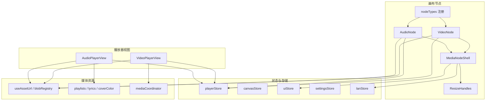
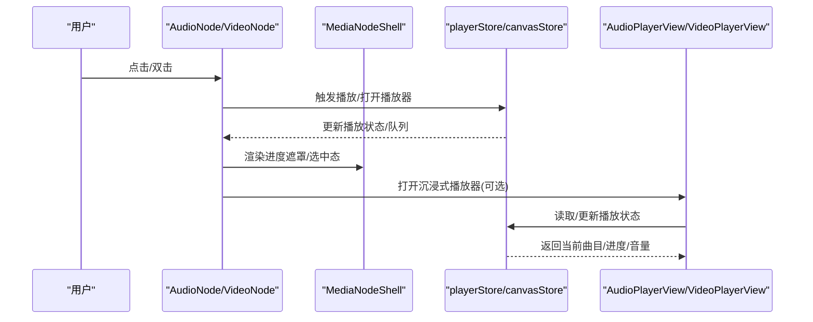
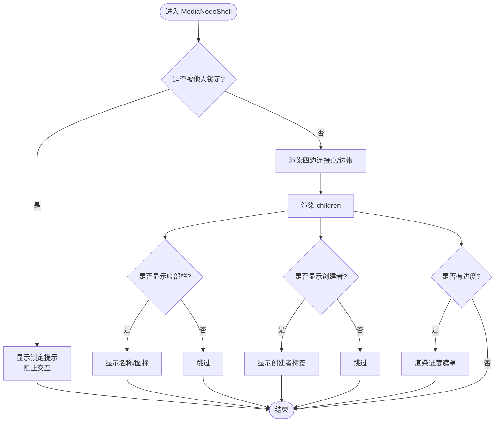
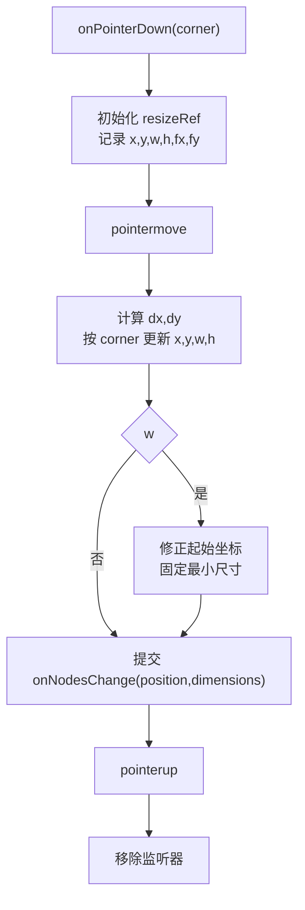
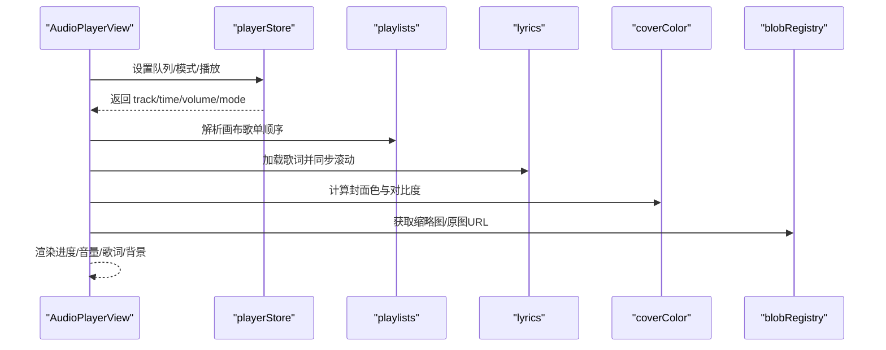
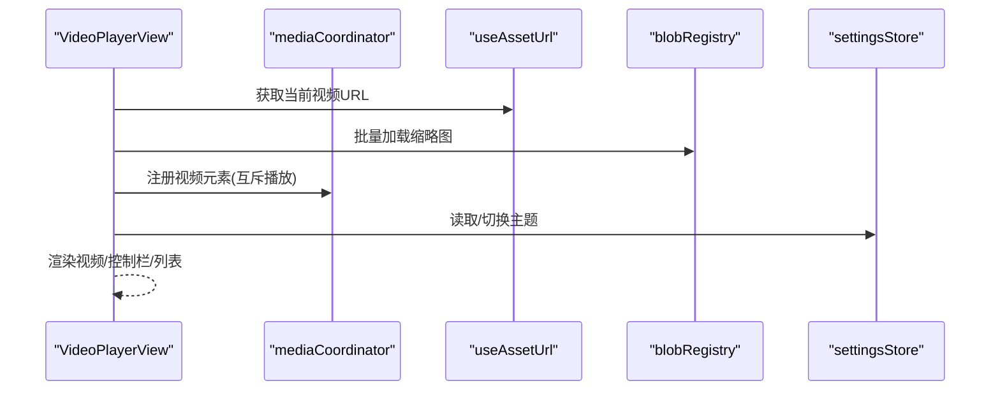
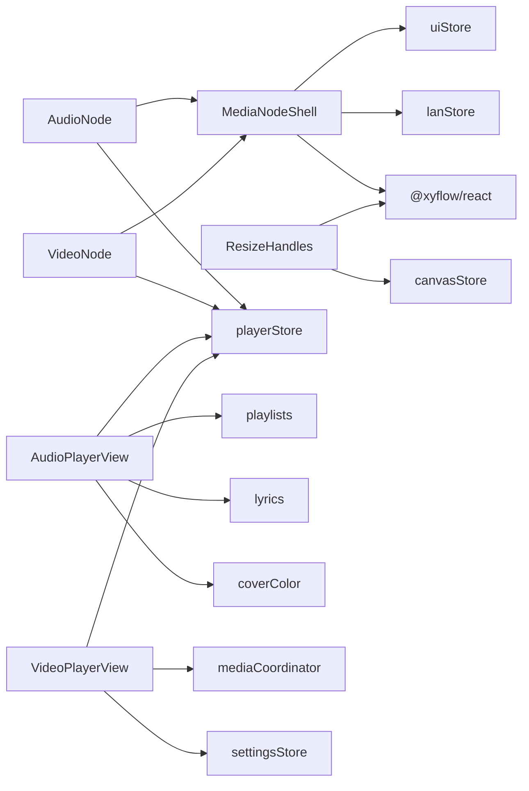

# 基础组件设计

<cite>
**本文引用的文件**
- [MediaNodeShell.tsx](file://src/canvas/nodes/MediaNodeShell.tsx)
- [ResizeHandles.tsx](file://src/canvas/nodes/ResizeHandles.tsx)
- [AudioNode.tsx](file://src/canvas/nodes/AudioNode.tsx)
- [VideoNode.tsx](file://src/canvas/nodes/VideoNode.tsx)
- [nodeTypes.ts](file://src/canvas/nodes/nodeTypes.ts)
- [types.ts](file://src/types.ts)
- [index.css](file://src/index.css)
- [settingsStore.ts](file://src/store/settingsStore.ts)
- [playerStore.ts](file://src/store/playerStore.ts)
- [canvasStore.ts](file://src/store/canvasStore.ts)
- [uiStore.ts](file://src/store/uiStore.ts)
- [lanStore.ts](file://src/store/lanStore.ts)
- [useAssetUrl.ts](file://src/media/useAssetUrl.ts)
- [blobRegistry.ts](file://src/media/blobRegistry.ts)
- [mediaCoordinator.ts](file://src/media/mediaCoordinator.ts)
- [playlists.ts](file://src/media/playlists.ts)
- [lyrics.ts](file://src/media/lyrics.ts)
- [coverColor.ts](file://src/media/coverColor.ts)
- [AudioPlayer.tsx](file://src/components/AudioPlayer.tsx)
- [VideoPlayer.tsx](file://src/components/VideoPlayer.tsx)
</cite>

## 目录
1. [简介](#简介)
2. [项目结构](#项目结构)
3. [核心组件](#核心组件)
4. [架构总览](#架构总览)
5. [详细组件分析](#详细组件分析)
6. [依赖关系分析](#依赖关系分析)
7. [性能考量](#性能考量)
8. [故障排查指南](#故障排查指南)
9. [结论](#结论)
10. [附录：扩展与最佳实践](#附录：扩展与最佳实践)

## 简介
本文件面向 SuQCanvas 的基础组件设计，聚焦以下目标：
- 解释 MediaNodeShell 基类如何为各类媒体节点提供统一的拖拽、缩放、选择、连线热区、进度遮罩等基础交互能力。
- 深入解析 ResizeHandles 通用组件的算法：四角布局、边界限制、宽高比保持策略。
- 阐述 AudioPlayer 与 VideoPlayer 播放器组件的统一接口与功能封装：播放控制、进度条、音量调节、全屏切换、画中画、列表导航等。
- 说明基础组件的样式系统与主题适配机制（CSS 变量 + Tailwind）。
- 总结组件的可复用性设计：Props 接口、事件回调规范、插槽使用模式。
- 提供扩展开发指南与自定义组件的最佳实践。

## 项目结构
SuQCanvas 将“画布节点”和“播放器视图”分层组织：
- 画布节点层：位于 src/canvas/nodes，包含媒体节点 Shell、具体节点实现、通用 ResizeHandles、节点类型注册。
- 播放器视图层：位于 src/components，包含沉浸式音频播放器与视频播放器。
- 状态与存储：store 目录集中管理画布、播放器、设置、UI、局域网协作等状态。
- 媒体资源：media 目录负责资源 URL、歌词、歌单、封面色、协调器等。
- 样式系统：index.css 定义 CSS 变量与 Tailwind 主题映射，支持明暗主题切换。

图表来源
- [MediaNodeShell.tsx:1-151](file://src/canvas/nodes/MediaNodeShell.tsx#L1-L151)
- [AudioNode.tsx:1-126](file://src/canvas/nodes/AudioNode.tsx#L1-L126)
- [VideoNode.tsx:1-88](file://src/canvas/nodes/VideoNode.tsx#L1-L88)
- [ResizeHandles.tsx:1-118](file://src/canvas/nodes/ResizeHandles.tsx#L1-L118)
- [nodeTypes.ts:1-27](file://src/canvas/nodes/nodeTypes.ts#L1-L27)
- [playerStore.ts](file://src/store/playerStore.ts)
- [canvasStore.ts](file://src/store/canvasStore.ts)
- [uiStore.ts](file://src/store/uiStore.ts)
- [settingsStore.ts:1-40](file://src/store/settingsStore.ts#L1-L40)
- [useAssetUrl.ts](file://src/media/useAssetUrl.ts)
- [blobRegistry.ts](file://src/media/blobRegistry.ts)
- [playlists.ts](file://src/media/playlists.ts)
- [lyrics.ts](file://src/media/lyrics.ts)
- [coverColor.ts](file://src/media/coverColor.ts)
- [mediaCoordinator.ts](file://src/media/mediaCoordinator.ts)

章节来源
- [nodeTypes.ts:14-26](file://src/canvas/nodes/nodeTypes.ts#L14-L26)
- [index.css:25-121](file://src/index.css#L25-L121)

## 核心组件
- MediaNodeShell：统一外壳，提供连接点、悬停/选中态、底部信息栏、创建者标识、进度遮罩、协作锁定提示。
- ResizeHandles：四角缩放手柄，含最小尺寸限制与位置修正。
- AudioNode / VideoNode：基于 Shell 的具体媒体节点，分别承载音频与视频的展示与交互。
- AudioPlayerView / VideoPlayerView：沉浸式播放器视图，提供完整播放控制与界面。

章节来源
- [MediaNodeShell.tsx:20-151](file://src/canvas/nodes/MediaNodeShell.tsx#L20-L151)
- [ResizeHandles.tsx:25-118](file://src/canvas/nodes/ResizeHandles.tsx#L25-L118)
- [AudioNode.tsx:18-126](file://src/canvas/nodes/AudioNode.tsx#L18-L126)
- [VideoNode.tsx:18-88](file://src/canvas/nodes/VideoNode.tsx#L18-L88)

## 架构总览
下图展示了从画布节点到播放器视图的数据流与控制流：

图表来源
- [AudioNode.tsx:34-70](file://src/canvas/nodes/AudioNode.tsx#L34-L70)
- [VideoNode.tsx:25-28](file://src/canvas/nodes/VideoNode.tsx#L25-L28)
- [MediaNodeShell.tsx:53-149](file://src/canvas/nodes/MediaNodeShell.tsx#L53-L149)
- [playerStore.ts]
- [AudioPlayer.tsx:142-196](file://src/components/AudioPlayer.tsx#L142-L196)
- [VideoPlayer.tsx:58-82](file://src/components/VideoPlayer.tsx#L58-L82)

## 详细组件分析

### MediaNodeShell：统一交互外壳
- 职责
  - 提供四个方向的标准连接点（source/target），并在连线模式下将四条边作为连接热区。
  - 处理选中态、悬停态、协作锁定态（显示“正在操作此元素”）。
  - 渲染底部名称栏与创建者标识，支持始终显示或仅选中时显示。
  - 根据传入 progress 渲染覆盖式进度遮罩，用于音频节点播放进度可视化。
  - 在工具切换时调用 ReactFlow 内部测量刷新，确保连接热区生效。
- 关键交互
  - 连接点：四边各一对 source/target Handle，连线模式下额外生成四条边带作为可连接区域。
  - 协作锁定：通过 lanStore 检测其他用户是否正在编辑该节点，阻止指针事件并显示提示。
  - 进度遮罩：绝对定位覆盖层，宽度由 progress 驱动，不响应交互。
- 数据与状态
  - 接收 node、children、showBar、alwaysShowBar、alwaysShowCreator、progress 等 props。
  - 内部维护 hovered 状态以控制创建者标识显示。
- 样式与主题
  - 使用 CSS 变量 --nodebg、--nodebar、--nodebarline 等，随主题切换自动适配。
  - 选中态通过 sq-selected 类名添加边框高亮。

图表来源
- [MediaNodeShell.tsx:40-149](file://src/canvas/nodes/MediaNodeShell.tsx#L40-L149)

章节来源
- [MediaNodeShell.tsx:13-151](file://src/canvas/nodes/MediaNodeShell.tsx#L13-L151)
- [index.css:173-259](file://src/index.css#L173-L259)

### ResizeHandles：四角缩放与边界限制
- 职责
  - 在节点四角渲染缩放手柄，监听指针事件进行拖拽缩放。
  - 计算新位置与尺寸，应用最小宽高限制，必要时调整起始坐标以保持视觉约束。
  - 通过 canvasStore 的 onNodesChange 提交 position 与 dimensions 变更。
- 算法要点
  - 记录初始 corner、x/y/w/h、鼠标起点 fx/fy。
  - 根据 corner 决定 dx/dy 对 w/h/x/y 的影响（如 nw 同时影响 x,y,w,h）。
  - 当 w < MIN_W 或 h < MIN_H 时，反向修正起始坐标并固定最小值。
  - 使用 screenToFlowPosition 将屏幕坐标转换为画布坐标，保证缩放精度。
- 复杂度
  - 每次移动事件 O(1) 计算，提交一次批量变更。
- 可扩展点
  - 可引入宽高比锁定逻辑（例如按原始比例约束 w/h）。
  - 可加入吸附网格或对齐辅助线。

图表来源
- [ResizeHandles.tsx:45-103](file://src/canvas/nodes/ResizeHandles.tsx#L45-L103)

章节来源
- [ResizeHandles.tsx:5-118](file://src/canvas/nodes/ResizeHandles.tsx#L5-L118)
- [canvasStore.ts]

### AudioNode：音频节点封装
- 职责
  - 基于 MediaNodeShell 展示封面图、播放按钮、时间信息。
  - 双击进入沉浸式播放器页面；单击切换播放/暂停。
  - 下载音频文件；显示当前曲目的实时进度遮罩。
- 与播放器集成
  - 通过 playerStore 获取当前曲目、播放状态、时间与时长。
  - 若当前节点即为引擎当前曲目且处于播放中，则显示进度遮罩。
- 事件与副作用
  - 打开播放器时避免弹出多余 toast；关闭播放器后恢复底部播放条可见性。

章节来源
- [AudioNode.tsx:18-126](file://src/canvas/nodes/AudioNode.tsx#L18-L126)
- [playerStore.ts]
- [uiStore.ts]

### VideoNode：视频节点封装
- 职责
  - 显示视频缩略图与播放按钮；双击打开沉浸式播放器。
  - 根据缩略图自然尺寸自适应节点宽高，限制最大尺寸。
- 与播放器集成
  - 通过 uiStore.openPlayerPage 打开视频播放器视图。
- 性能考虑
  - 画布上仅加载缩略图，不下载完整视频，减少带宽与内存占用。

章节来源
- [VideoNode.tsx:18-88](file://src/canvas/nodes/VideoNode.tsx#L18-L88)
- [useAssetUrl.ts]
- [uiStore.ts]

### AudioPlayerView：沉浸式音频播放器
- 功能
  - 播放控制：播放/暂停、上一首/下一首、快退/快进、单曲循环/列表循环/随机/顺序/流式。
  - 进度条：拖动跳转、缓冲指示、时间格式化。
  - 音量调节：滑块与静音切换。
  - 歌词：加载 .lrc、同步滚动、倒影效果、对比度自适应文字颜色。
  - 专辑背景：收集关联图片，轮播水波纹背景。
  - 歌单：从画布连线构建播放顺序，支持侧边栏管理与搜索。
  - 键盘快捷键：空格、方向键、L 喜欢等。
- 与状态集成
  - 通过 playerStore 管理队列、模式、当前曲目、进度、音量。
  - 通过 playlists/lyrics/coverColor 模块解析歌单、歌词与封面色。
  - 通过 useAssetUrl/blobRegistry 获取资源与缩略图。

图表来源
- [AudioPlayer.tsx:142-196](file://src/components/AudioPlayer.tsx#L142-L196)
- [playlists.ts]
- [lyrics.ts]
- [coverColor.ts]
- [blobRegistry.ts]
- [playerStore.ts]

章节来源
- [AudioPlayer.tsx:1-800](file://src/components/AudioPlayer.tsx#L1-L800)
- [playerStore.ts]
- [playlists.ts]
- [lyrics.ts]
- [coverColor.ts]
- [blobRegistry.ts]

### VideoPlayerView：沉浸式视频播放器
- 功能
  - 播放控制：播放/暂停、上一集/下一集、快退/快进、倍速、静音。
  - 进度条：拖动跳转、缓冲指示、时间格式化。
  - 全屏切换：全屏/退出全屏，闲置自动隐藏控制栏。
  - 画中画：进入/退出 Picture-in-Picture。
  - 列表侧栏：视频列表、搜索、当前项高亮。
  - 键盘快捷键：空格、方向键、M、F、L、Esc。
- 与状态集成
  - 通过 mediaCoordinator 注册视频元素，避免多视频冲突。
  - 通过 useAssetUrl 获取视频 URL，通过 blobRegistry 获取缩略图。
  - 通过 settingsStore 切换早晚主题。

图表来源
- [VideoPlayer.tsx:58-82](file://src/components/VideoPlayer.tsx#L58-L82)
- [mediaCoordinator.ts]
- [useAssetUrl.ts]
- [blobRegistry.ts]
- [settingsStore.ts:13-39](file://src/store/settingsStore.ts#L13-L39)

章节来源
- [VideoPlayer.tsx:1-800](file://src/components/VideoPlayer.tsx#L1-L800)
- [mediaCoordinator.ts]
- [settingsStore.ts:1-40](file://src/store/settingsStore.ts#L1-L40)

## 依赖关系分析
- 组件耦合
  - MediaNodeShell 依赖 uiStore（工具模式）、lanStore（协作锁定）、ReactFlow（Handle、useUpdateNodeInternals）。
  - ResizeHandles 依赖 canvasStore（节点变更）与 ReactFlow（screenToFlowPosition）。
  - AudioNode/VideoNode 依赖 MediaNodeShell、playerStore、uiStore、useAssetUrl。
  - AudioPlayerView/VideoPlayerView 依赖 playerStore、playlists、lyrics、coverColor、blobRegistry、mediaCoordinator、settingsStore。
- 外部依赖
  - @xyflow/react：画布节点、连接点、视口转换。
  - zustand：状态管理（playerStore、canvasStore、uiStore、settingsStore、lanStore）。
  - Tailwind CSS：原子化样式与主题变量映射。
- 潜在循环依赖
  - 组件间通过 store 解耦，未见直接循环引用；注意避免在 store 中反向导入组件。

图表来源
- [MediaNodeShell.tsx:1-151](file://src/canvas/nodes/MediaNodeShell.tsx#L1-L151)
- [ResizeHandles.tsx:1-118](file://src/canvas/nodes/ResizeHandles.tsx#L1-L118)
- [AudioNode.tsx:1-126](file://src/canvas/nodes/AudioNode.tsx#L1-L126)
- [VideoNode.tsx:1-88](file://src/canvas/nodes/VideoNode.tsx#L1-L88)
- [AudioPlayer.tsx:1-800](file://src/components/AudioPlayer.tsx#L1-L800)
- [VideoPlayer.tsx:1-800](file://src/components/VideoPlayer.tsx#L1-L800)

章节来源
- [types.ts:66-112](file://src/types.ts#L66-L112)
- [nodeTypes.ts:14-26](file://src/canvas/nodes/nodeTypes.ts#L14-L26)

## 性能考量
- 懒加载与按需拉取
  - 视频节点仅加载缩略图，完整视频在播放器打开时再拉取，降低画布负载。
  - 批量预加载缩略图与时长探测，避免重复请求。
- 渲染优化
  - MediaNodeShell 使用 memo 包裹，减少子树重渲染。
  - 进度遮罩与手柄使用绝对定位与 transform，避免回流。
- 状态更新
  - ResizeHandles 在拖拽过程中累积计算，仅在 pointerup 清理监听，减少频繁状态写入。
  - 播放器通过 store 集中管理状态，避免分散 setState 导致的抖动。
- 主题切换
  - 通过 CSS 变量与 class 切换，避免大量样式重建。

[本节为通用指导，无需特定文件引用]

## 故障排查指南
- 连接热区不生效
  - 检查是否在连线模式下启用 isConnectable，并确保 useUpdateNodeInternals 在工具切换时调用。
  - 参考：[MediaNodeShell.tsx:48-51](file://src/canvas/nodes/MediaNodeShell.tsx#L48-L51)、[MediaNodeShell.tsx:85-105](file://src/canvas/nodes/MediaNodeShell.tsx#L85-L105)
- 缩放异常或越界
  - 确认 MIN_W/MIN_H 常量与 corner 逻辑是否正确；检查 screenToFlowPosition 转换。
  - 参考：[ResizeHandles.tsx:5-103](file://src/canvas/nodes/ResizeHandles.tsx#L5-L103)
- 播放器无法播放
  - 检查 useAssetUrl 返回的 URL 是否有效；确认 mediaCoordinator 注册成功。
  - 参考：[VideoPlayer.tsx:326-330](file://src/components/VideoPlayer.tsx#L326-L330)
- 主题不生效
  - 确认 settingsStore.applyTheme 正确切换 html.light 类；检查 CSS 变量覆盖。
  - 参考：[settingsStore.ts:13-39](file://src/store/settingsStore.ts#L13-L39)、[index.css:74-121](file://src/index.css#L74-L121)

章节来源
- [MediaNodeShell.tsx:48-105](file://src/canvas/nodes/MediaNodeShell.tsx#L48-L105)
- [ResizeHandles.tsx:5-103](file://src/canvas/nodes/ResizeHandles.tsx#L5-L103)
- [VideoPlayer.tsx:326-330](file://src/components/VideoPlayer.tsx#L326-L330)
- [settingsStore.ts:13-39](file://src/store/settingsStore.ts#L13-L39)
- [index.css:74-121](file://src/index.css#L74-L121)

## 结论
SuQCanvas 的基础组件通过 MediaNodeShell 提供了统一的交互外壳，结合 ResizeHandles 实现了灵活的缩放能力；AudioNode/VideoNode 在此基础上封装了媒体展示与播放入口；AudioPlayerView/VideoPlayerView 则提供了完整的沉浸式播放体验。样式系统基于 CSS 变量与 Tailwind，配合 settingsStore 实现明暗主题切换。整体架构清晰、解耦良好，便于扩展与维护。

[本节为总结，无需特定文件引用]

## 附录：扩展与最佳实践
- Props 接口建议
  - 媒体节点：node、children、showBar、alwaysShowBar、alwaysShowCreator、progress。
  - 播放器视图：files、initialAssetId、initialPlaylistId、onBack、onClose。
- 事件回调规范
  - 播放控制：toggle、seekTo、seekBy、setVolume、setMode。
  - 列表导航：openPlaylist、openPlaylistAt、selectTrack。
  - 全屏/画中画：toggleFullscreen、togglePip。
- 插槽使用模式
  - MediaNodeShell.children 用于注入具体媒体内容；底部栏与创建者标识可按需显示。
- 扩展开发指南
  - 新增媒体类型：在 nodeTypes 中注册，实现基于 MediaNodeShell 的节点组件。
  - 自定义缩放行为：扩展 ResizeHandles，增加宽高比锁定、吸附网格等。
  - 播放器增强：在 AudioPlayerView/VideoPlayerView 中添加新功能（如字幕、分享、收藏）。
- 最佳实践
  - 使用 store 管理跨组件状态，避免 prop drilling。
  - 使用 memo 与 useMemo/useCallback 优化渲染与事件绑定。
  - 遵循无障碍标准：aria-label、role、键盘导航。
  - 主题适配：优先使用 CSS 变量，避免硬编码颜色。

章节来源
- [nodeTypes.ts:14-26](file://src/canvas/nodes/nodeTypes.ts#L14-L26)
- [MediaNodeShell.tsx:20-151](file://src/canvas/nodes/MediaNodeShell.tsx#L20-L151)
- [AudioPlayer.tsx:142-196](file://src/components/AudioPlayer.tsx#L142-L196)
- [VideoPlayer.tsx:58-82](file://src/components/VideoPlayer.tsx#L58-L82)
- [settingsStore.ts:13-39](file://src/store/settingsStore.ts#L13-L39)