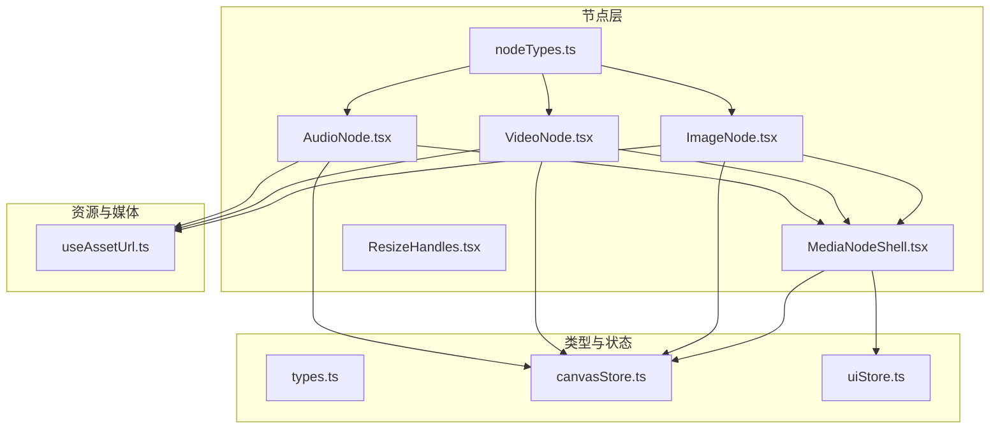
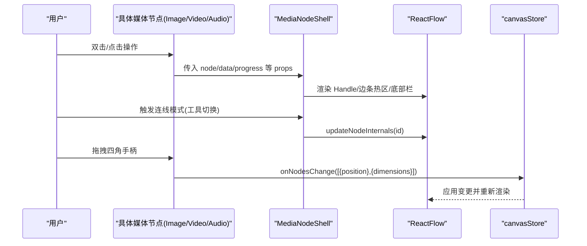
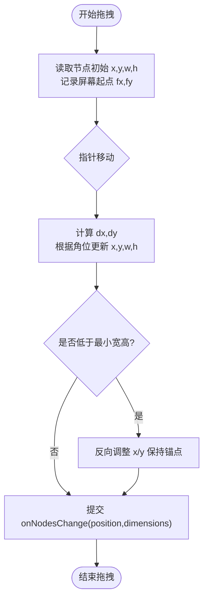
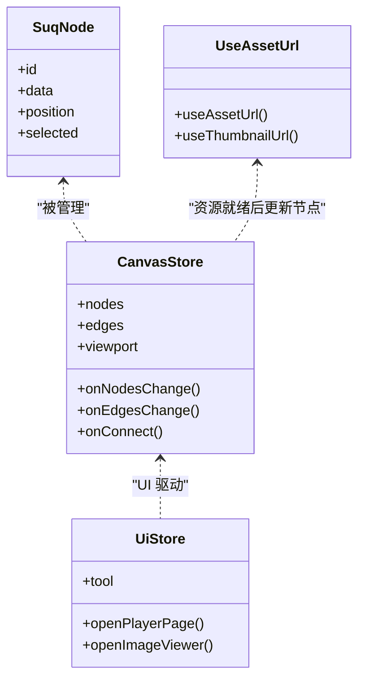

# 媒体节点壳组件

<cite>
**本文引用的文件**
- [MediaNodeShell.tsx](file://src/canvas/nodes/MediaNodeShell.tsx)
- [ResizeHandles.tsx](file://src/canvas/nodes/ResizeHandles.tsx)
- [ImageNode.tsx](file://src/canvas/nodes/ImageNode.tsx)
- [VideoNode.tsx](file://src/canvas/nodes/VideoNode.tsx)
- [AudioNode.tsx](file://src/canvas/nodes/AudioNode.tsx)
- [nodeTypes.ts](file://src/canvas/nodes/nodeTypes.ts)
- [types.ts](file://src/types.ts)
- [canvasStore.ts](file://src/store/canvasStore.ts)
- [uiStore.ts](file://src/store/uiStore.ts)
- [useAssetUrl.ts](file://src/media/useAssetUrl.ts)
</cite>

## 目录
1. [简介](#简介)
2. [项目结构](#项目结构)
3. [核心组件](#核心组件)
4. [架构总览](#架构总览)
5. [详细组件分析](#详细组件分析)
6. [依赖关系分析](#依赖关系分析)
7. [性能考量](#性能考量)
8. [故障排查指南](#故障排查指南)
9. [结论](#结论)
10. [附录：自定义媒体节点开发指南](#附录自定义媒体节点开发指南)

## 简介
本技术文档围绕 MediaNodeShell 媒体节点壳组件，系统阐述其在 ReactFlow 画布中的基础交互框架与实现细节，包括拖拽定位、尺寸调整、选择状态、边框显示等；深入解析 ResizeHandles 的算法（四角手柄定位、边界约束、宽高比锁定）；说明节点生命周期管理（挂载资源加载、卸载清理、响应式更新）；解释与 ReactFlow 画布的集成方式（坐标转换、视口变换、层级管理）；总结性能优化策略（防抖、虚拟渲染、内存管理），并提供自定义媒体节点的继承开发与最佳实践。

## 项目结构
本项目采用“按功能域组织”的结构，媒体节点相关代码集中在 src/canvas/nodes 下，其中 MediaNodeShell 作为通用外壳，ImageNode、VideoNode、AudioNode 等具体节点复用该外壳并叠加各自业务逻辑。状态与工具通过 store 与 media 模块解耦。

图表来源
- [MediaNodeShell.tsx:1-151](file://src/canvas/nodes/MediaNodeShell.tsx#L1-L151)
- [ImageNode.tsx:1-126](file://src/canvas/nodes/ImageNode.tsx#L1-L126)
- [VideoNode.tsx:1-88](file://src/canvas/nodes/VideoNode.tsx#L1-L88)
- [AudioNode.tsx:1-126](file://src/canvas/nodes/AudioNode.tsx#L1-L126)
- [ResizeHandles.tsx:1-118](file://src/canvas/nodes/ResizeHandles.tsx#L1-L118)
- [nodeTypes.ts:1-27](file://src/canvas/nodes/nodeTypes.ts#L1-L27)
- [types.ts:1-112](file://src/types.ts#L1-L112)
- [canvasStore.ts:1-200](file://src/store/canvasStore.ts#L1-L200)
- [uiStore.ts:1-121](file://src/store/uiStore.ts#L1-L121)
- [useAssetUrl.ts:1-157](file://src/media/useAssetUrl.ts#L1-L157)

章节来源
- [MediaNodeShell.tsx:1-151](file://src/canvas/nodes/MediaNodeShell.tsx#L1-L151)
- [nodeTypes.ts:1-27](file://src/canvas/nodes/nodeTypes.ts#L1-L27)

## 核心组件
- MediaNodeShell：提供统一的节点外壳，包含选中态样式、边框颜色、底部名称栏、创建者标注、播放进度遮罩、连线模式下的边条热区、以及与其他节点的 Handle 连接点。
- ResizeHandles：提供四角缩放手柄，基于屏幕坐标到画布坐标的转换计算新位置与尺寸，并写入画布状态。
- ImageNode / VideoNode / AudioNode：具体媒体节点，复用 MediaNodeShell，分别实现图片自适应、视频封面与全屏播放、音频播放控制与进度展示。

章节来源
- [MediaNodeShell.tsx:20-151](file://src/canvas/nodes/MediaNodeShell.tsx#L20-L151)
- [ResizeHandles.tsx:25-118](file://src/canvas/nodes/ResizeHandles.tsx#L25-L118)
- [ImageNode.tsx:15-126](file://src/canvas/nodes/ImageNode.tsx#L15-L126)
- [VideoNode.tsx:18-88](file://src/canvas/nodes/VideoNode.tsx#L18-L88)
- [AudioNode.tsx:18-126](file://src/canvas/nodes/AudioNode.tsx#L18-L126)

## 架构总览
MediaNodeShell 作为容器，负责：
- 渲染四个方向的标准 Handle（source/target），用于连线。
- 在连线模式下，四条边额外暴露可点击/拖拽的连接热区。
- 根据 selected 与 alwaysShowBar/alwaysShowCreator 控制底部信息栏与创建者标注的可见性。
- 支持 progress 参数以百分比宽度遮罩形式展示播放进度。
- 使用 useUpdateNodeInternals 在工具切换时刷新节点内部测量，确保连线热区生效。

ResizeHandles 通过 screenToFlowPosition 将指针事件从屏幕坐标转换为画布坐标，实时计算新的 x/y/w/h，应用最小宽高约束，并通过 onNodesChange 提交变更。

具体节点（Image/Video/Audio）通过 NodeResizer 或自定义 ResizeHandles 进行尺寸调整，并在资源加载完成后自适应初始尺寸。

图表来源
- [MediaNodeShell.tsx:48-105](file://src/canvas/nodes/MediaNodeShell.tsx#L48-L105)
- [ResizeHandles.tsx:45-103](file://src/canvas/nodes/ResizeHandles.tsx#L45-L103)
- [ImageNode.tsx:60-69](file://src/canvas/nodes/ImageNode.tsx#L60-L69)
- [canvasStore.ts:126-145](file://src/store/canvasStore.ts#L126-L145)

## 详细组件分析

### MediaNodeShell：基础交互框架
- 拖拽定位：由 ReactFlow 节点系统接管，Shell 仅负责 UI 与交互拦截（如局域网编辑锁定时阻止事件冒泡）。
- 尺寸调整：不直接处理尺寸，交由具体节点使用的 NodeResizer 或外部 ResizeHandles。
- 选择状态：selected 决定选中样式类名，影响边框高亮。
- 边框显示：通过 data.borderColor 动态设置边框色，未设置时使用默认色。
- 底部名称栏：showBar 控制是否显示，alwaysShowBar 可强制显示；显示图标与 label。
- 创建者标注：hovered/selected/alwaysShowCreator 控制显示，提示插入者信息。
- 播放进度：progress 为 0..1 的遮罩宽度，覆盖整个节点区域。
- 连线热区：在 tool === 'connect' 时启用四条边的 source/target Handle，支持从对应边拉线。
- 工具切换刷新：useEffect 监听 tool 变化，调用 updateNodeInternals 保证热区命中区域正确。

章节来源
- [MediaNodeShell.tsx:13-105](file://src/canvas/nodes/MediaNodeShell.tsx#L13-L105)
- [MediaNodeShell.tsx:109-147](file://src/canvas/nodes/MediaNodeShell.tsx#L109-L147)
- [uiStore.ts:43-44](file://src/store/uiStore.ts#L43-L44)

### ResizeHandles：四角缩放算法
- 手柄定位：四个角（nw/ne/sw/se）绝对定位在容器四角，cursor 随角变化。
- 起始状态：onPointerDown 记录当前节点原始 position.x/y、width/height 及屏幕起点 fx/fy。
- 移动计算：
  - 将当前屏幕坐标转为画布坐标，计算 dx/dy。
  - 根据所在角位组合更新 w/h/x/y：
    - 含 w：w = r.w - dx，x = r.x + dx
    - 含 e：w = r.w + dx
    - 含 n：h = r.h - dy，y = r.y + dy
    - 含 s：h = r.h + dy
- 边界约束：
  - 最小宽度 MIN_W=120，最小高度 MIN_H=40。
  - 当小于最小值时，反向调整 x/y 以保持视觉锚点不变。
- 提交变更：通过 onNodesChange 同时提交 position 与 dimensions（setAttributes=true 保留 style 属性）。
- 事件清理：pointerup 移除全局监听，避免内存泄漏。

图表来源
- [ResizeHandles.tsx:45-103](file://src/canvas/nodes/ResizeHandles.tsx#L45-L103)

章节来源
- [ResizeHandles.tsx:5-23](file://src/canvas/nodes/ResizeHandles.tsx#L5-L23)
- [ResizeHandles.tsx:45-118](file://src/canvas/nodes/ResizeHandles.tsx#L45-L118)

### ImageNode：图片节点
- 资源加载：useAssetUrl 获取图片 URL，加载完成回调中计算自然宽高并按最大宽高限制缩放，设置节点初始尺寸。
- 尺寸调整：使用 NodeResizer，仅在选中且未被他人编辑时显示；设置最小宽高与手柄样式。
- 交互：双击打开图片查看器；悬浮按钮支持打开大图与下载。
- 占位与过渡：加载中显示脉动占位，图片到达后淡入。

章节来源
- [ImageNode.tsx:15-56](file://src/canvas/nodes/ImageNode.tsx#L15-L56)
- [ImageNode.tsx:60-126](file://src/canvas/nodes/ImageNode.tsx#L60-L126)
- [useAssetUrl.ts:10-44](file://src/media/useAssetUrl.ts#L10-L44)

### VideoNode：视频节点
- 封面缩略图：useThumbnailUrl 获取封面，加载完成后按最大宽高缩放设置节点尺寸。
- 播放行为：双击或点击播放按钮进入专用播放器页面，不在画布内嵌播放器以避免指针抢占。
- 占位：无封面时显示脉动占位。

章节来源
- [VideoNode.tsx:18-49](file://src/canvas/nodes/VideoNode.tsx#L18-L49)
- [VideoNode.tsx:51-88](file://src/canvas/nodes/VideoNode.tsx#L51-L88)
- [useAssetUrl.ts:52-99](file://src/media/useAssetUrl.ts#L52-L99)

### AudioNode：音频节点
- 播放控制：根据当前播放曲目与播放状态显示播放/暂停按钮与时间信息。
- 进度展示：通过 MediaNodeShell 的 progress 参数以遮罩形式铺满节点显示播放进度。
- 打开播放器：双击进入专用播放器页，支持流式连播顺序沿用画布连线。
- 下载：获取资源 URL 并触发浏览器下载。

章节来源
- [AudioNode.tsx:18-70](file://src/canvas/nodes/AudioNode.tsx#L18-L70)
- [AudioNode.tsx:72-126](file://src/canvas/nodes/AudioNode.tsx#L72-L126)

## 依赖关系分析
- 类型定义：SuqNode/SuqNodeData 统一描述节点数据字段，包含 kind、label、尺寸、颜色、创建信息等。
- 节点注册：mediaNodeTypes 将 image/video/audio 等类型映射到具体组件，供 ReactFlow 渲染。
- 状态管理：
  - canvasStore：集中管理 nodes/edges/viewport，提供 onNodesChange/onEdgesChange/onConnect 等方法，并内置历史快照与防抖合并。
  - uiStore：管理工具模式、弹窗与播放器入口等 UI 状态。
- 资源访问：useAssetUrl/useThumbnailUrl 封装资源 URL 获取与重试机制，适配局域网传输场景。

图表来源
- [types.ts:66-112](file://src/types.ts#L66-L112)
- [canvasStore.ts:33-59](file://src/store/canvasStore.ts#L33-L59)
- [uiStore.ts:18-45](file://src/store/uiStore.ts#L18-L45)
- [useAssetUrl.ts:10-99](file://src/media/useAssetUrl.ts#L10-L99)

章节来源
- [types.ts:66-112](file://src/types.ts#L66-L112)
- [nodeTypes.ts:14-27](file://src/canvas/nodes/nodeTypes.ts#L14-L27)
- [canvasStore.ts:118-200](file://src/store/canvasStore.ts#L118-L200)
- [uiStore.ts:18-121](file://src/store/uiStore.ts#L18-L121)
- [useAssetUrl.ts:10-99](file://src/media/useAssetUrl.ts#L10-L99)

## 性能考量
- 防抖与批量更新：
  - canvasStore 对历史快照进行防抖合并（HISTORY_DEBOUNCE），减少频繁重绘与历史记录膨胀。
  - onNodesChange 使用 applyNodeChanges 高效增量更新节点数组。
- 资源加载优化：
  - useAssetUrl/useThumbnailUrl 支持重试与延迟轮询，避免局域网传输期间的失败抖动。
  - 视频节点仅加载缩略图，完整视频按需拉取，降低首屏带宽压力。
- 渲染优化：
  - 使用 memo 包裹节点组件，减少不必要的重渲染。
  - NodeResizer 仅在选中且非他人编辑时显示，降低常驻 DOM 开销。
- 内存管理：
  - ResizeHandles 在 pointerup 时移除全局监听，防止内存泄漏。
  - 资源 hook 在卸载时清理定时器与标志位，避免悬挂任务。

章节来源
- [canvasStore.ts:30-92](file://src/store/canvasStore.ts#L30-L92)
- [canvasStore.ts:126-145](file://src/store/canvasStore.ts#L126-L145)
- [useAssetUrl.ts:10-99](file://src/media/useAssetUrl.ts#L10-L99)
- [ResizeHandles.tsx:94-103](file://src/canvas/nodes/ResizeHandles.tsx#L94-L103)
- [ImageNode.tsx:15-25](file://src/canvas/nodes/ImageNode.tsx#L15-L25)

## 故障排查指南
- 连线热区无效：
  - 检查是否在连线模式下（tool === 'connect'），MediaNodeShell 会据此启用边条热区。
  - 若工具切换后热区未生效，确认 useEffect 触发了 updateNodeInternals。
- 缩放异常：
  - 确认 ResizeHandles 的 onPointerDown 已正确记录初始状态，且 screenToFlowPosition 可用。
  - 检查最小宽高约束是否导致位置回退异常。
- 资源加载失败：
  - useAssetUrl/useThumbnailUrl 支持重试与超时，关注 toast 提示与网络状态。
  - 局域网环境下封面可能延迟到达，等待轮询或检查连接状态。
- 多人协作冲突：
  - 若节点被其他用户编辑，MediaNodeShell 会阻止事件冒泡并显示锁定提示，需等待对方释放。

章节来源
- [MediaNodeShell.tsx:48-105](file://src/canvas/nodes/MediaNodeShell.tsx#L48-L105)
- [ResizeHandles.tsx:45-103](file://src/canvas/nodes/ResizeHandles.tsx#L45-L103)
- [useAssetUrl.ts:10-99](file://src/media/useAssetUrl.ts#L10-L99)

## 结论
MediaNodeShell 提供了稳定、可扩展的媒体节点外壳，结合 ResizeHandles 与具体节点实现，构建了完整的拖拽、缩放、选择、边框与进度展示能力。通过 canvasStore 与 uiStore 的状态管理与 ReactFlow 的集成，实现了高效的画布交互体验。性能方面通过防抖、懒加载与内存清理等手段保障了流畅度。遵循本文档的开发指南，可快速构建高质量的自定义媒体节点。

## 附录：自定义媒体节点开发指南
- 继承 Shell：
  - 使用 MediaNodeShell 包裹内容，传入 node、children、可选 showBar/alwaysShowBar/alwaysShowCreator/progress。
  - 如需进度遮罩，传入 progress（0..1），Shell 会自动渲染覆盖层。
- 尺寸调整：
  - 简单场景：使用 ReactFlow 的 NodeResizer，设置 minWidth/minHeight/keepAspectRatio 等属性。
  - 复杂场景：引入 ResizeHandles，自行实现四角缩放逻辑与边界约束。
- 资源加载：
  - 使用 useAssetUrl/useThumbnailUrl 获取资源 URL，注意重试与错误提示。
  - 在 onLoad 回调中根据 naturalWidth/naturalHeight 计算缩放比例，调用 onNodesChange 设置初始尺寸。
- 状态与交互：
  - 通过 useCanvasStore.onNodesChange 更新节点位置与尺寸。
  - 通过 useUiStore 打开查看器/播放器等界面。
- 协作与锁定：
  - 检测 lanStore 中是否有其他用户正在编辑该节点，必要时禁用交互或显示锁定提示。
- 最佳实践：
  - 使用 memo 包裹节点组件以减少重渲染。
  - 合理设置最小宽高，避免过小导致不可用。
  - 在卸载时清理定时器与事件监听，避免内存泄漏。
  - 对于大资源（如视频），优先加载缩略图，完整资源按需拉取。

章节来源
- [MediaNodeShell.tsx:20-151](file://src/canvas/nodes/MediaNodeShell.tsx#L20-L151)
- [ImageNode.tsx:15-126](file://src/canvas/nodes/ImageNode.tsx#L15-L126)
- [VideoNode.tsx:18-88](file://src/canvas/nodes/VideoNode.tsx#L18-L88)
- [AudioNode.tsx:18-126](file://src/canvas/nodes/AudioNode.tsx#L18-L126)
- [ResizeHandles.tsx:25-118](file://src/canvas/nodes/ResizeHandles.tsx#L25-L118)
- [useAssetUrl.ts:10-99](file://src/media/useAssetUrl.ts#L10-L99)
- [canvasStore.ts:118-200](file://src/store/canvasStore.ts#L118-L200)
- [uiStore.ts:18-121](file://src/store/uiStore.ts#L18-L121)