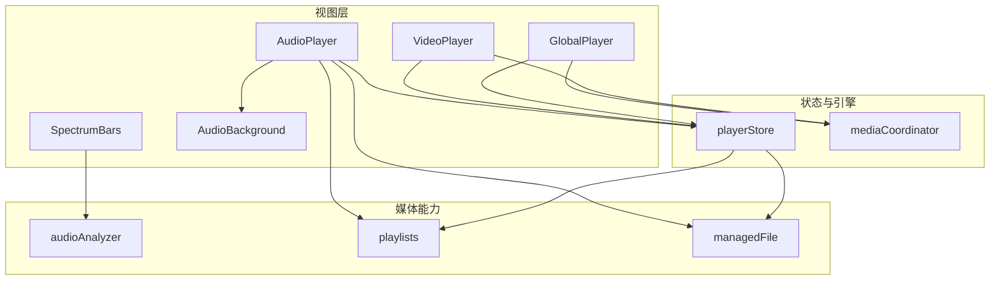
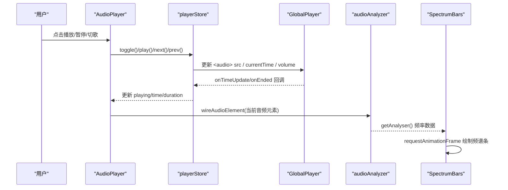
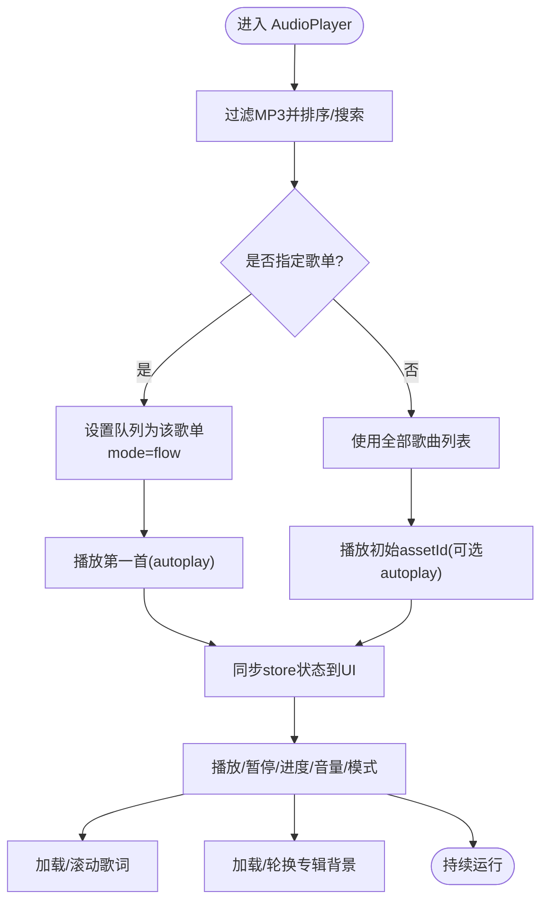
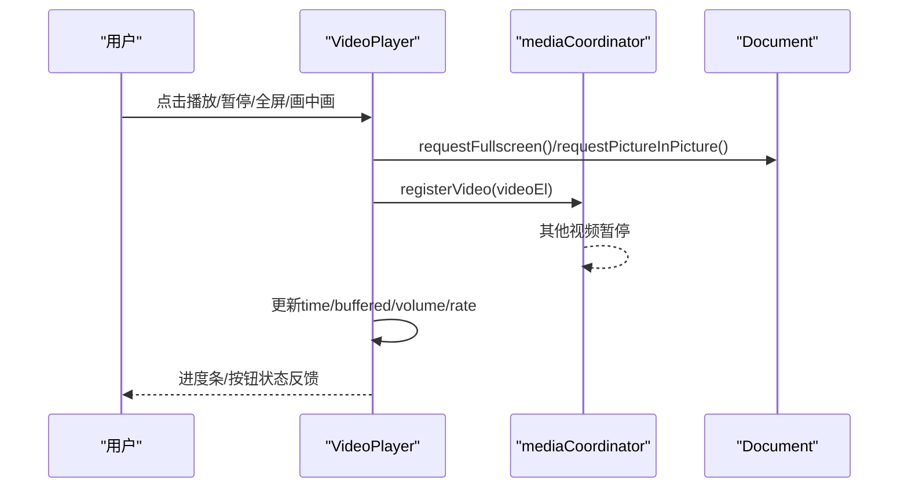
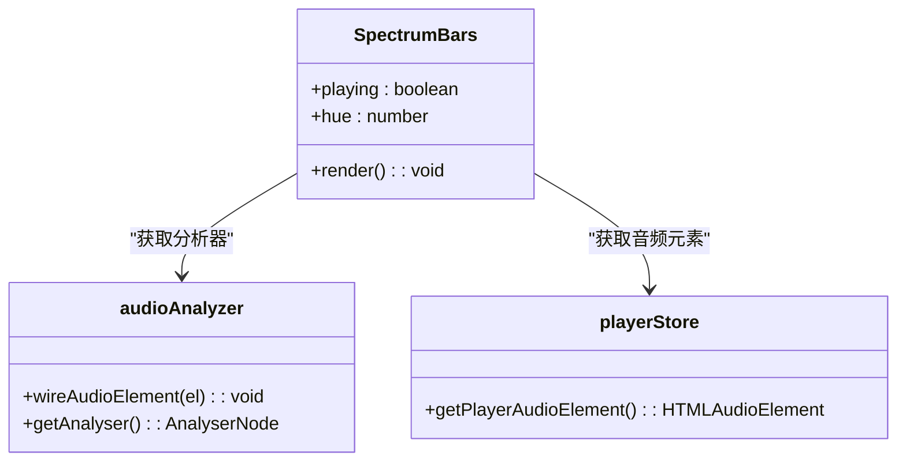
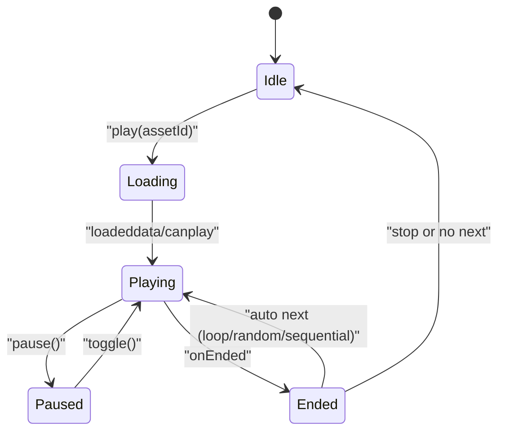
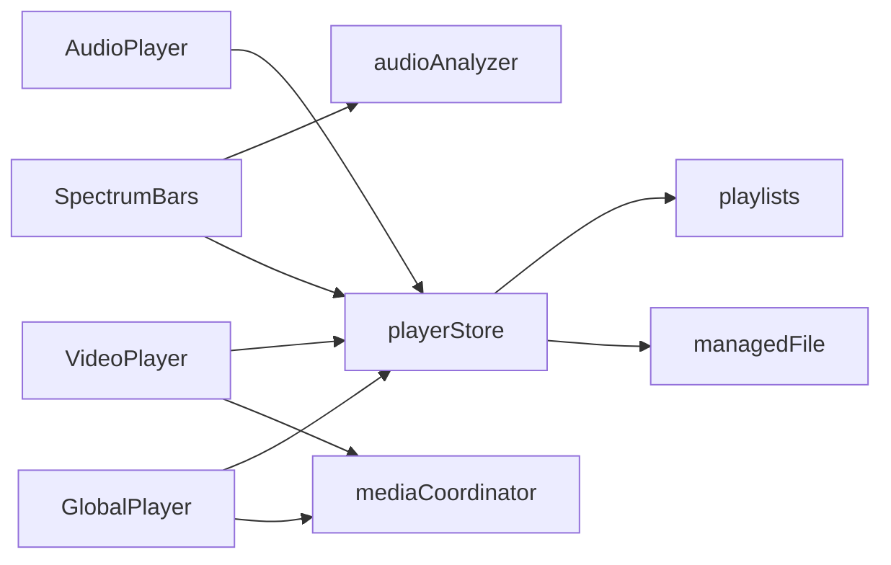

# 播放器组件

<cite>
**本文引用的文件**
- [AudioPlayer.tsx](file://src/components/AudioPlayer.tsx)
- [VideoPlayer.tsx](file://src/components/VideoPlayer.tsx)
- [SpectrumBars.tsx](file://src/components/SpectrumBars.tsx)
- [audioAnalyzer.ts](file://src/media/audioAnalyzer.ts)
- [playerStore.ts](file://src/store/playerStore.ts)
- [GlobalPlayer.tsx](file://src/components/GlobalPlayer.tsx)
- [playlists.ts](file://src/media/playlists.ts)
- [mediaCoordinator.ts](file://src/media/mediaCoordinator.ts)
- [managedFile.ts](file://src/media/managedFile.ts)
- [AudioBackground.tsx](file://src/components/AudioBackground.tsx)
</cite>

## 目录
1. [简介](#简介)
2. [项目结构](#项目结构)
3. [核心组件](#核心组件)
4. [架构总览](#架构总览)
5. [详细组件分析](#详细组件分析)
6. [依赖关系分析](#依赖关系分析)
7. [性能考量](#性能考量)
8. [故障排查指南](#故障排查指南)
9. [结论](#结论)
10. [附录：扩展与自定义指南](#附录：扩展与自定义指南)

## 简介
本技术文档围绕应用内的播放器组件集合，系统性阐述音频播放器、视频播放器与频谱可视化组件的实现原理与交互流程。重点覆盖：
- 音频播放器的文件加载、播放控制、进度跟踪、歌词与专辑背景、歌单与流式播放等能力
- 视频播放器的解码、播放控制、全屏/画中画、列表侧栏、倍速与缓冲可视化
- 频谱分析组件基于 Web Audio API 的频率分析与实时 Canvas 渲染
- 全局状态管理：播放状态同步、进度实时更新、错误处理机制
- 跨浏览器兼容性与移动端适配策略
- 扩展开发指南与自定义控制界面方法

## 项目结构
播放器相关代码主要分布在以下模块：
- 组件层：AudioPlayer、VideoPlayer、SpectrumBars、AudioBackground、GlobalPlayer
- 媒体能力：audioAnalyzer（Web Audio 分析器）、mediaCoordinator（媒体互斥）
- 数据与状态：playerStore（单一播放引擎状态）、playlists（画布连线解析歌单）、managedFile（素材聚合）
- 辅助：blobRegistry、useAssetUrl、db 等用于资源与元数据访问

图表来源
- [AudioPlayer.tsx:142-244](file://src/components/AudioPlayer.tsx#L142-L244)
- [VideoPlayer.tsx:58-184](file://src/components/VideoPlayer.tsx#L58-L184)
- [SpectrumBars.tsx:1-31](file://src/components/SpectrumBars.tsx#L1-L31)
- [audioAnalyzer.ts:1-59](file://src/media/audioAnalyzer.ts#L1-L59)
- [playerStore.ts:1-116](file://src/store/playerStore.ts#L1-L116)
- [GlobalPlayer.tsx:17-97](file://src/components/GlobalPlayer.tsx#L17-L97)
- [playlists.ts:1-179](file://src/media/playlists.ts#L1-L179)
- [mediaCoordinator.ts:1-25](file://src/media/mediaCoordinator.ts#L1-L25)
- [managedFile.ts:1-39](file://src/media/managedFile.ts#L1-L39)

章节来源
- [AudioPlayer.tsx:142-244](file://src/components/AudioPlayer.tsx#L142-L244)
- [VideoPlayer.tsx:58-184](file://src/components/VideoPlayer.tsx#L58-L184)
- [playerStore.ts:1-116](file://src/store/playerStore.ts#L1-L116)

## 核心组件
- AudioPlayer：沉浸式音频播放器，支持歌词、专辑背景、歌单与流式播放、键盘快捷键、下载等
- VideoPlayer：沉浸式视频播放器，支持全屏、画中画、倍速、缓冲条、右侧列表、主题切换
- SpectrumBars：紧凑频谱条，基于 Web Audio API 频率数据驱动 Canvas 动画
- GlobalPlayer：全局唯一 <audio> 元素与悬浮迷你控制栏，统一播放入口
- playerStore：单一播放引擎状态机，负责切歌、模式、队列、进度、音量等
- playlists：从画布节点与边解析歌单顺序，支撑“流式播放”
- mediaCoordinator：同一时刻仅一个音频/视频播放，避免冲突
- audioAnalyzer：单例 AnalyserNode，供背景与频谱条读取频率/波形

章节来源
- [AudioPlayer.tsx:142-244](file://src/components/AudioPlayer.tsx#L142-L244)
- [VideoPlayer.tsx:58-184](file://src/components/VideoPlayer.tsx#L58-L184)
- [SpectrumBars.tsx:1-31](file://src/components/SpectrumBars.tsx#L1-L31)
- [GlobalPlayer.tsx:17-97](file://src/components/GlobalPlayer.tsx#L17-L97)
- [playerStore.ts:1-116](file://src/store/playerStore.ts#L1-L116)
- [playlists.ts:1-179](file://src/media/playlists.ts#L1-L179)
- [mediaCoordinator.ts:1-25](file://src/media/mediaCoordinator.ts#L1-L25)
- [audioAnalyzer.ts:1-59](file://src/media/audioAnalyzer.ts#L1-L59)

## 架构总览
播放器采用“单一引擎 + 多视图”的架构：
- 单一引擎：GlobalPlayer 挂载唯一的 <audio> 元素，playerStore 维护播放状态与逻辑
- 多视图：AudioPlayer、VideoPlayer、悬浮迷你栏等通过订阅 store 实现 UI 同步
- 媒体互斥：mediaCoordinator 保证同类型媒体同时仅一个在播
- 可视化：audioAnalyzer 提供 AnalyserNode，SpectrumBars 与 AudioBackground 消费频率/波形数据
- 歌单与顺序：playlists 从画布图结构派生顺序，支持“流式播放”

图表来源
- [AudioPlayer.tsx:313-335](file://src/components/AudioPlayer.tsx#L313-L335)
- [playerStore.ts:174-209](file://src/store/playerStore.ts#L174-L209)
- [GlobalPlayer.tsx:160-179](file://src/components/GlobalPlayer.tsx#L160-L179)
- [audioAnalyzer.ts:26-47](file://src/media/audioAnalyzer.ts#L26-L47)
- [SpectrumBars.tsx:28-63](file://src/components/SpectrumBars.tsx#L28-L63)

## 详细组件分析

### AudioPlayer 音频播放器
- 文件加载与曲目选择
  - 过滤 MP3 并构建有序列表；支持按标题/导入人排序与搜索
  - 打开时根据 initialPlaylistId 设置队列并按歌单顺序起播；否则以初始 assetId 起播
- 播放控制与进度
  - 调用 playerStore.toggle/seekTo/seekBy/setVolume 控制全局音频元素
  - 进度计算考虑歌词偏移 totalOffset，确保 UI 与歌词对齐
- 歌词与专辑背景
  - 自动查找与当前音频节点相连的 .lrc 歌词，或从外部源加载
  - 收集画布中与当前音频关联的图片作为专辑背景，支持多张封面轮换与淡入
  - 根据封面主色动态调整歌词前景色与描边，保障可读性
- 歌单与流式播放
  - 使用 playlists 模块从画布连线解析顺序；flow 模式下沿连线深度优先遍历
  - 支持顺序、循环、随机、单曲循环、流式五种模式
- 键盘快捷键与可访问性
  - 空格播放/暂停，方向键快退快进与音量调节，L 收藏
- 错误处理与降级
  - 下载失败提示；歌词/封面加载失败回退默认样式

图表来源
- [AudioPlayer.tsx:157-183](file://src/components/AudioPlayer.tsx#L157-L183)
- [AudioPlayer.tsx:241-271](file://src/components/AudioPlayer.tsx#L241-L271)
- [AudioPlayer.tsx:313-335](file://src/components/AudioPlayer.tsx#L313-L335)
- [AudioPlayer.tsx:461-515](file://src/components/AudioPlayer.tsx#L461-L515)
- [AudioPlayer.tsx:517-598](file://src/components/AudioPlayer.tsx#L517-L598)

章节来源
- [AudioPlayer.tsx:142-244](file://src/components/AudioPlayer.tsx#L142-L244)
- [AudioPlayer.tsx:313-335](file://src/components/AudioPlayer.tsx#L313-L335)
- [AudioPlayer.tsx:461-515](file://src/components/AudioPlayer.tsx#L461-L515)
- [AudioPlayer.tsx:517-598](file://src/components/AudioPlayer.tsx#L517-L598)

### VideoPlayer 视频播放器
- 视频解码与元数据探测
  - 批量获取缩略图与时长（仅 metadata），不下载完整文件
- 播放控制与进度
  - 本地 state 管理 playing/time/duration/buffered/volume/muted/rate
  - 进度条支持拖拽 seek，显示缓冲百分比
- 全屏与画中画
  - 全屏切换监听 fullscreenchange；画中画使用 requestPictureInPicture/exitPictureInPicture
- 列表与搜索
  - 右侧常驻列表，支持搜索与筛选
- 键盘快捷键
  - 空格播放/暂停，方向键快退快进与音量，M 静音，F 全屏，L 列表，Esc 退出
- 媒体互斥
  - 注册到 mediaCoordinator，与其他视频互斥播放

图表来源
- [VideoPlayer.tsx:118-164](file://src/components/VideoPlayer.tsx#L118-L164)
- [VideoPlayer.tsx:196-293](file://src/components/VideoPlayer.tsx#L196-L293)
- [VideoPlayer.tsx:295-311](file://src/components/VideoPlayer.tsx#L295-L311)
- [mediaCoordinator.ts:1-25](file://src/media/mediaCoordinator.ts#L1-L25)

章节来源
- [VideoPlayer.tsx:58-184](file://src/components/VideoPlayer.tsx#L58-L184)
- [VideoPlayer.tsx:196-293](file://src/components/VideoPlayer.tsx#L196-L293)
- [VideoPlayer.tsx:295-311](file://src/components/VideoPlayer.tsx#L295-L311)
- [mediaCoordinator.ts:1-25](file://src/media/mediaCoordinator.ts#L1-L25)

### SpectrumBars 频谱分析组件
- 接入音频源
  - 通过 getPlayerAudioElement 获取全局音频元素，wireAudioElement 将其接入 AnalyserNode
- 频率分析
  - 使用 AnalyserNode.getByteFrequencyData 获取频域数据，按感知曲线映射高度
- 实时渲染
  - Canvas 绘制固定数量的圆头条，颜色随封面主色变化，带微光与渐变
  - 使用 ResizeObserver 自适应尺寸，requestAnimationFrame 驱动动画
- 静音/暂停基线
  - 保留低矮基线，保持视觉呼吸感

图表来源
- [SpectrumBars.tsx:1-31](file://src/components/SpectrumBars.tsx#L1-L31)
- [audioAnalyzer.ts:26-47](file://src/media/audioAnalyzer.ts#L26-L47)
- [playerStore.ts:52-65](file://src/store/playerStore.ts#L52-L65)

章节来源
- [SpectrumBars.tsx:1-120](file://src/components/SpectrumBars.tsx#L1-L120)
- [audioAnalyzer.ts:1-59](file://src/media/audioAnalyzer.ts#L1-L59)
- [playerStore.ts:52-65](file://src/store/playerStore.ts#L52-L65)

### 全局播放引擎与状态管理
- GlobalPlayer
  - 挂载唯一 <audio> 元素，绑定事件同步 time/duration/playing
  - 悬浮迷你控制栏可拖动、最小化、打开完整播放器
  - 暴露 __pipCtrl 给画中画窗口控制
- playerStore
  - play/toggle/seek/next/prev/setMode/setQueue 等方法统一管理播放逻辑
  - baseOrder 决定导航顺序：歌单队列 > 播放器列表 > 画布连线顺序
  - handleEnded 根据模式自动续播或停止
- 媒体互斥
  - mediaCoordinator 在同一类型媒体中只允许一个播放

图表来源
- [GlobalPlayer.tsx:160-179](file://src/components/GlobalPlayer.tsx#L160-L179)
- [playerStore.ts:132-161](file://src/store/playerStore.ts#L132-L161)
- [playerStore.ts:174-209](file://src/store/playerStore.ts#L174-L209)
- [mediaCoordinator.ts:1-25](file://src/media/mediaCoordinator.ts#L1-L25)

章节来源
- [GlobalPlayer.tsx:17-97](file://src/components/GlobalPlayer.tsx#L17-L97)
- [GlobalPlayer.tsx:160-179](file://src/components/GlobalPlayer.tsx#L160-L179)
- [playerStore.ts:132-161](file://src/store/playerStore.ts#L132-L161)
- [playerStore.ts:174-209](file://src/store/playerStore.ts#L174-L209)
- [mediaCoordinator.ts:1-25](file://src/media/mediaCoordinator.ts#L1-L25)

## 依赖关系分析
- 组件耦合
  - AudioPlayer/VideoPlayer 强依赖 playerStore 的状态与方法
  - SpectrumBars 依赖 audioAnalyzer 与 playerStore 提供的音频元素
  - GlobalPlayer 是唯一音频出口，被 playerStore 直接操作
- 间接依赖
  - playlists 为 AudioPlayer 与 playerStore 提供顺序依据
  - managedFile 为组件提供素材聚合与类型判断
  - mediaCoordinator 保证媒体互斥，避免多实例冲突
- 潜在循环
  - 组件通过 store 单向依赖状态，无直接循环引用
- 外部集成点
  - Web Audio API（AnalyserNode）
  - Fullscreen/Picture-in-Picture API
  - Canvas 2D 渲染

图表来源
- [AudioPlayer.tsx:142-244](file://src/components/AudioPlayer.tsx#L142-L244)
- [VideoPlayer.tsx:58-184](file://src/components/VideoPlayer.tsx#L58-L184)
- [SpectrumBars.tsx:1-31](file://src/components/SpectrumBars.tsx#L1-L31)
- [GlobalPlayer.tsx:17-97](file://src/components/GlobalPlayer.tsx#L17-L97)
- [playerStore.ts:1-116](file://src/store/playerStore.ts#L1-L116)
- [playlists.ts:1-179](file://src/media/playlists.ts#L1-L179)
- [mediaCoordinator.ts:1-25](file://src/media/mediaCoordinator.ts#L1-L25)
- [managedFile.ts:1-39](file://src/media/managedFile.ts#L1-L39)

章节来源
- [AudioPlayer.tsx:142-244](file://src/components/AudioPlayer.tsx#L142-L244)
- [VideoPlayer.tsx:58-184](file://src/components/VideoPlayer.tsx#L58-L184)
- [SpectrumBars.tsx:1-31](file://src/components/SpectrumBars.tsx#L1-L31)
- [GlobalPlayer.tsx:17-97](file://src/components/GlobalPlayer.tsx#L17-L97)
- [playerStore.ts:1-116](file://src/store/playerStore.ts#L1-L116)
- [playlists.ts:1-179](file://src/media/playlists.ts#L1-L179)
- [mediaCoordinator.ts:1-25](file://src/media/mediaCoordinator.ts#L1-L25)
- [managedFile.ts:1-39](file://src/media/managedFile.ts#L1-L39)

## 性能考量
- 频谱渲染优化
  - 使用 Float32Array 缓存每帧条形值，指数平滑提升响应速度
  - ResizeObserver 与 DPR 自适应，限制最大 DPR 为 2 避免过高开销
- 背景渲染优化
  - AudioBackground 仅在封面变化/淡入中/尺寸变化时重绘，静态零开销
- 媒体元数据探测
  - VideoPlayer 批量探测时长与缩略图，preload=metadata 避免下载完整文件
- 播放引擎节流
  - playerStore 使用序列令牌 playSeq 防止快速连续 play() 竞态
- 内存与资源释放
  - 频谱与背景动画在卸载时取消 requestAnimationFrame 与观察者
  - 视频探测完成后移除 src 并 load，释放资源

[本节为通用性能建议，不直接分析具体文件]

## 故障排查指南
- 无法播放
  - 检查浏览器是否支持 Web Audio API；audioAnalyzer 在不支持环境静默降级
  - 确认 GlobalPlayer 已挂载且 bindPlayerAudio 已执行
  - 查看 playerStore.play 是否成功解析 URL 并设置 src
- 频谱无响应
  - 确认 wireAudioElement 已调用且当前音频元素有效
  - 检查 AnalyserNode 是否可用，频率数据是否为空
- 全屏/画中画失败
  - 检查 document.fullscreenElement 与 Picture-in-Picture API 支持
  - 捕获异常并给出友好提示
- 歌词不同步
  - 检查歌词偏移 totalOffset 是否正确应用
  - 确认 activeIndex 计算与滚动定位逻辑正常
- 下载失败
  - 检查 db.assets 记录是否存在，URL 是否可访问
  - 捕获异常并提示用户

章节来源
- [audioAnalyzer.ts:26-47](file://src/media/audioAnalyzer.ts#L26-L47)
- [GlobalPlayer.tsx:86-97](file://src/components/GlobalPlayer.tsx#L86-L97)
- [playerStore.ts:174-209](file://src/store/playerStore.ts#L174-L209)
- [VideoPlayer.tsx:284-293](file://src/components/VideoPlayer.tsx#L284-L293)
- [AudioPlayer.tsx:353-368](file://src/components/AudioPlayer.tsx#L353-L368)

## 结论
本项目播放器组件采用单一引擎、多视图的清晰架构，结合 Web Audio API 与 Canvas 实现丰富的音频可视化体验。通过 playlists 模块将画布连线转化为可执行的播放顺序，支持多种播放模式与歌单管理。VideoPlayer 提供完整的视频播放能力，包括全屏、画中画、倍速与缓冲可视化。全局媒体互斥与状态集中管理确保了多组件间的协调一致。整体设计兼顾性能与可维护性，便于扩展与定制。

[本节为总结性内容，不直接分析具体文件]

## 附录：扩展与自定义指南
- 扩展播放模式
  - 在 playerStore 中新增模式并在 setMode 中处理队列与顺序逻辑
  - 在 AudioPlayer 的模式选择下拉框中添加新选项
- 自定义控制界面
  - 复用 playerStore 的方法（toggle/seekTo/next/prev/setVolume）实现自定义控件
  - 通过 usePlayerStore 订阅状态（playing/time/duration/volume）实现 UI 同步
- 添加新的可视化效果
  - 基于 audioAnalyzer.getAnalyser() 获取 AnalyserNode，使用 getByteFrequencyData/getByteTimeDomainData 读取数据
  - 在 SpectrumBars 基础上扩展 Canvas 绘制逻辑，注意性能与 DPR 适配
- 支持更多字幕格式
  - 参考歌词加载逻辑，扩展字幕解析与渲染管线
  - 与 VideoPlayer 的时间轴同步，提供切换与样式配置
- 移动端适配
  - 利用触摸事件与 Pointer Events 优化拖拽与进度条交互
  - 检查全屏/画中画在移动端的可用性，提供降级方案
- 错误处理与日志
  - 在关键路径添加 try/catch 与 toast 提示
  - 对网络请求与媒体加载失败进行兜底处理

[本节为通用扩展指导，不直接分析具体文件]