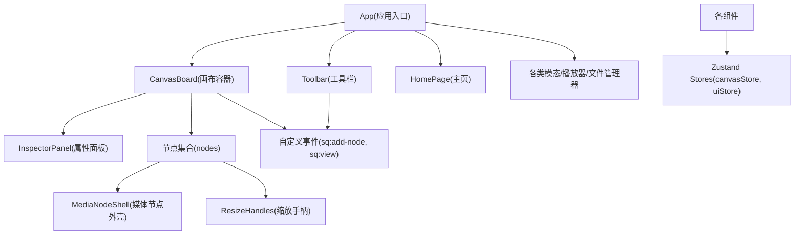
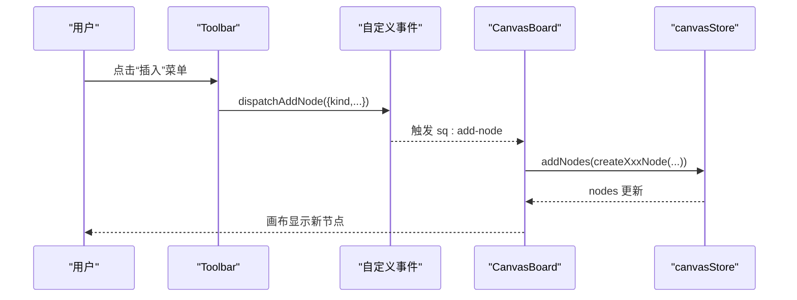
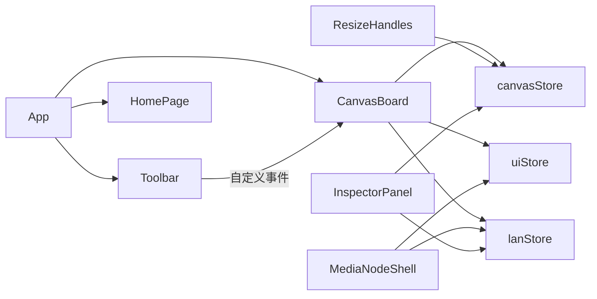

# 组件架构设计

<cite>
**本文引用的文件**
- [App.tsx](file://src/App.tsx)
- [HomePage.tsx](file://src/components/HomePage.tsx)
- [Toolbar.tsx](file://src/components/Toolbar.tsx)
- [InspectorPanel.tsx](file://src/components/InspectorPanel.tsx)
- [CanvasBoard.tsx](file://src/canvas/CanvasBoard.tsx)
- [MediaNodeShell.tsx](file://src/canvas/nodes/MediaNodeShell.tsx)
- [ResizeHandles.tsx](file://src/canvas/nodes/ResizeHandles.tsx)
- [canvasStore.ts](file://src/store/canvasStore.ts)
- [uiStore.ts](file://src/store/uiStore.ts)
- [types.ts](file://src/types.ts)
</cite>

## 目录
1. [简介](#简介)
2. [项目结构](#项目结构)
3. [核心组件与分层](#核心组件与分层)
4. [架构总览](#架构总览)
5. [详细组件分析](#详细组件分析)
6. [依赖关系分析](#依赖关系分析)
7. [性能考量](#性能考量)
8. [故障排查指南](#故障排查指南)
9. [结论](#结论)
10. [附录：最佳实践与命名规范](#附录最佳实践与命名规范)

## 简介
本设计文档面向 SuQCanvas 的 React 组件架构，聚焦以下目标：
- 明确页面级、功能级、基础级组件的分层组织与设计原则
- 说明组件间通信模式（Props、Context API、自定义事件）的使用场景
- 阐述可复用组件抽象（如 MediaNodeShell、ResizeHandles）的设计模式
- 解释状态管理策略：本地状态 vs 全局状态，useState 与 Zustand Store 的边界
- 提供组件关系图、数据流图与开发最佳实践

## 项目结构
SuQCanvas 采用“按领域分层 + 功能模块”的组织方式：
- src/App.tsx：应用根入口，装配顶层布局与全局模态/面板
- src/components：页面与功能组件（HomePage、Toolbar、InspectorPanel 等）
- src/canvas：画布与节点实现（CanvasBoard、nodes、edges）
- src/store：Zustand 状态管理（canvasStore、uiStore 等）
- src/types：类型定义（SuqNode、SuqEdge、样式等）

图表来源
- [App.tsx:19-73](file://src/App.tsx#L19-L73)
- [CanvasBoard.tsx:446-459](file://src/canvas/CanvasBoard.tsx#L446-L459)
- [Toolbar.tsx:86-92](file://src/components/Toolbar.tsx#L86-L92)
- [MediaNodeShell.tsx:32-150](file://src/canvas/nodes/MediaNodeShell.tsx#L32-L150)
- [ResizeHandles.tsx:35-117](file://src/canvas/nodes/ResizeHandles.tsx#L35-L117)

章节来源
- [App.tsx:19-73](file://src/App.tsx#L19-L73)
- [CanvasBoard.tsx:446-459](file://src/canvas/CanvasBoard.tsx#L446-L459)

## 核心组件与分层
- 页面级组件
  - App：负责认证初始化、LAN 同步初始化、全局布局与模态挂载
  - HomePage：项目列表、导入导出、主题切换、局域网协作相关操作
- 功能组件
  - Toolbar：插入元素、工具模式切换、撤销重做、对齐分布、视图缩放、主题切换
  - InspectorPanel：选中节点/连线的属性编辑（文本、颜色、层级、播放顺序等）
- 基础组件
  - MediaNodeShell：媒体节点通用外壳（连接点、名称栏、创建者角标、进度遮罩、锁定提示）
  - ResizeHandles：四角缩放手柄，统一尺寸约束与位置更新
- 画布容器
  - CanvasBoard：ReactFlow 集成、快捷键、拖拽导入、自定义事件监听、协同光标与编辑锁

章节来源
- [App.tsx:19-73](file://src/App.tsx#L19-L73)
- [HomePage.tsx:415-800](file://src/components/HomePage.tsx#L415-L800)
- [Toolbar.tsx:97-403](file://src/components/Toolbar.tsx#L97-L403)
- [InspectorPanel.tsx:288-800](file://src/components/InspectorPanel.tsx#L288-L800)
- [MediaNodeShell.tsx:32-150](file://src/canvas/nodes/MediaNodeShell.tsx#L32-L150)
- [ResizeHandles.tsx:35-117](file://src/canvas/nodes/ResizeHandles.tsx#L35-L117)
- [CanvasBoard.tsx:41-459](file://src/canvas/CanvasBoard.tsx#L41-L459)

## 架构总览
整体采用“组件驱动 + 集中式状态”的架构：
- 组件通过 Props 传递局部 UI 状态（如打开/关闭、选中项）
- 跨组件共享状态使用 Zustand Store（canvasStore、uiStore 等）
- 松耦合通信通过自定义事件（sq:add-node、sq:view、sq:focus-node）在 Toolbar 与 CanvasBoard 之间解耦
- 画布层基于 @xyflow/react，节点渲染由 MediaNodeShell 统一封装，保证一致交互体验

图表来源
- [Toolbar.tsx:86-92](file://src/components/Toolbar.tsx#L86-L92)
- [CanvasBoard.tsx:244-305](file://src/canvas/CanvasBoard.tsx#L244-L305)
- [canvasStore.ts:159-171](file://src/store/canvasStore.ts#L159-L171)

## 详细组件分析

### 页面级组件：App 与 HomePage
- App
  - 职责：初始化认证与 LAN 同步；根据登录状态路由到 AuthPage 或主界面；挂载全局模态与 Toast
  - 状态来源：useAuthStore、useProjectStore、useUiStore
  - 关键点：LAN 构建下自动重连与同步；忙态遮罩
- HomePage
  - 职责：项目列表展示、新建/打开/删除/导出/导入、主题切换、局域网备份恢复
  - 状态来源：useProjectStore、useUiStore、useSettingsStore、usePlayerStore、useLanStore
  - 关键点：合并本地与远端项目列表；权限控制（仅创建者可删除/恢复）；云/OSS 配置状态展示

章节来源
- [App.tsx:19-73](file://src/App.tsx#L19-L73)
- [HomePage.tsx:415-800](file://src/components/HomePage.tsx#L415-L800)

### 功能组件：Toolbar 与 InspectorPanel
- Toolbar
  - 职责：插入元素、工具模式切换、撤销/重做、对齐/分布、视图缩放、主题切换、文件导入
  - 通信：通过 window.dispatchEvent 发送 sq:add-node、sq:view 自定义事件
  - 状态来源：useUiStore、useProjectStore、useSettingsStore、useCanvasStore、usePlayerStore
- InspectorPanel
  - 职责：编辑选中节点/连线的属性（文本、颜色、字体、层级、连线样式、播放顺序等）
  - 状态来源：useCanvasStore、useLanStore、@xyflow/react
  - 关键点：区分可编辑节点（考虑协同编辑锁定）；多选中批量操作

章节来源
- [Toolbar.tsx:97-403](file://src/components/Toolbar.tsx#L97-L403)
- [InspectorPanel.tsx:288-800](file://src/components/InspectorPanel.tsx#L288-L800)

### 基础组件：MediaNodeShell 与 ResizeHandles
- MediaNodeShell
  - 职责：为所有媒体节点提供统一外壳（连接点 Handle、名称栏、创建者角标、进度遮罩、锁定提示）
  - 特性：根据 tool 模式动态启用连接热区；支持 alwaysShowBar/alwaysShowCreator 控制显示
  - 协同：读取 lanStore.editing 判断是否被其他用户锁定
- ResizeHandles
  - 职责：四角缩放，维护最小宽高限制，实时更新节点 position/dimensions
  - 状态：直接调用 canvasStore.onNodesChange 进行变更

章节来源
- [MediaNodeShell.tsx:32-150](file://src/canvas/nodes/MediaNodeShell.tsx#L32-L150)
- [ResizeHandles.tsx:35-117](file://src/canvas/nodes/ResizeHandles.tsx#L35-L117)

### 画布容器：CanvasBoard
- 职责：ReactFlow 容器、快捷键绑定、拖拽导入、自定义事件监听、协同光标与编辑锁、视口同步
- 关键点：
  - 快捷键：Ctrl+Z/Y 撤销重做，Ctrl+C/V/A/D 复制粘贴全选，F 适应视图
  - 工具模式：V 选择、C 连线、H 拖动，空格临时平移
  - 协同：onNodeDragStart/Stop 设置编辑锁；订阅 remoteViewport 同步视图
  - 事件：监听 sq:add-node/sq:view/sq:focus-node，响应 Toolbar 指令

章节来源
- [CanvasBoard.tsx:41-459](file://src/canvas/CanvasBoard.tsx#L41-L459)

## 依赖关系分析
- 组件依赖
  - App 依赖各功能组件与 Store
  - Toolbar 依赖 uiStore/projectStore/settingsStore/playerStore，并通过自定义事件与 CanvasBoard 通信
  - CanvasBoard 依赖 canvasStore、uiStore、lanStore，并组合节点与边类型
  - MediaNodeShell 依赖 uiStore.tool 与 lanStore.editing
  - ResizeHandles 依赖 canvasStore.onNodesChange
- Store 依赖
  - canvasStore 依赖 types 中的 SuqNode/SuqEdge 与 DEFAULT_EDGE_STYLE
  - uiStore 定义 ToolMode、Toast、Viewer 等 UI 状态

图表来源
- [App.tsx:19-73](file://src/App.tsx#L19-L73)
- [Toolbar.tsx:86-92](file://src/components/Toolbar.tsx#L86-L92)
- [CanvasBoard.tsx:41-459](file://src/canvas/CanvasBoard.tsx#L41-L459)
- [MediaNodeShell.tsx:32-150](file://src/canvas/nodes/MediaNodeShell.tsx#L32-L150)
- [ResizeHandles.tsx:35-117](file://src/canvas/nodes/ResizeHandles.tsx#L35-L117)
- [InspectorPanel.tsx:288-800](file://src/components/InspectorPanel.tsx#L288-L800)
- [canvasStore.ts:1-399](file://src/store/canvasStore.ts#L1-L399)
- [uiStore.ts:1-121](file://src/store/uiStore.ts#L1-L121)

章节来源
- [canvasStore.ts:1-399](file://src/store/canvasStore.ts#L1-L399)
- [uiStore.ts:1-121](file://src/store/uiStore.ts#L1-L121)
- [types.ts:1-112](file://src/types.ts#L1-L112)

## 性能考量
- 历史快照防抖：canvasStore 对历史快照进行节流与去重，避免频繁写入导致性能问题
- 只读选择器：组件通过 useXxxStore(s => s.xxx) 精确订阅，减少不必要重渲染
- 节点外壳复用：MediaNodeShell 统一处理连接点与 UI 装饰，降低重复代码
- 缩放与拖拽优化：ResizeHandles 使用 pointer 事件与 screenToFlowPosition 转换，确保流畅交互
- 视图同步：CanvasBoard 仅在 remoteViewport 变化时平滑过渡，避免过度刷新

[本节为通用性能建议，不直接分析具体文件]

## 故障排查指南
- 无法插入节点
  - 检查 Toolbar 是否正确派发 sq:add-node 事件
  - 确认 CanvasBoard 已监听该事件且 centerPosition 可用
- 缩放无效或卡顿
  - 检查 ResizeHandles 的 onPointerDown/onMove/onUp 是否正确注册与清理
  - 确认 canvasStore.onNodesChange 的参数格式正确
- 协同编辑冲突
  - 查看 lanStore.editing 中是否存在其他用户的 nodeId 锁定
  - 确认 onNodeDragStart/Stop 正确设置/清除编辑锁
- 视图不同步
  - 检查 CanvasBoard 对 remoteViewport 的订阅逻辑
  - 确认 setViewport 与 rfSetViewport 的调用时机

章节来源
- [Toolbar.tsx:86-92](file://src/components/Toolbar.tsx#L86-L92)
- [CanvasBoard.tsx:244-305](file://src/canvas/CanvasBoard.tsx#L244-L305)
- [ResizeHandles.tsx:45-103](file://src/canvas/nodes/ResizeHandles.tsx#L45-L103)
- [CanvasBoard.tsx:93-102](file://src/canvas/CanvasBoard.tsx#L93-L102)

## 结论
SuQCanvas 的组件架构以“分层清晰、状态集中、事件解耦”为核心：
- 页面级组件负责业务编排，功能组件专注交互，基础组件提供稳定能力
- 通过 Zustand Store 统一管理复杂状态，结合自定义事件实现跨组件松耦合通信
- MediaNodeShell 与 ResizeHandles 体现良好的抽象与复用，提升一致性
- 协同编辑与视图同步增强了多人协作体验

[本节为总结性内容，不直接分析具体文件]

## 附录：最佳实践与命名规范
- 组件分层
  - 页面级：App、HomePage（关注路由与业务编排）
  - 功能级：Toolbar、InspectorPanel（关注交互与属性编辑）
  - 基础级：MediaNodeShell、ResizeHandles（关注通用能力与复用）
- 通信模式
  - Props：父子组件间传递 UI 状态（如 open/close、selected）
  - Context API：本项目未直接使用 React Context，优先使用 Zustand Store
  - 自定义事件：Toolbar 与 CanvasBoard 之间通过 sq:add-node、sq:view、sq:focus-node 解耦
- 状态管理边界
  - 本地状态（useState）：用于组件内部短期 UI 状态（如菜单展开、输入草稿）
  - 全局状态（Zustand）：跨组件共享的业务状态（画布节点/边、工具模式、视图、Toast、播放器等）
- 命名规范
  - 组件名：PascalCase（如 MediaNodeShell、InspectorPanel）
  - Store：camelCase（如 canvasStore、uiStore），导出 useXxxStore
  - 事件名：前缀 sq:（如 sq:add-node、sq:view）
  - 类型：语义化（如 SuqNode、SuqEdge、AlignMode、ToolMode）
- 可复用设计
  - 外壳组件：MediaNodeShell 统一连接点、名称栏、创建者角标、进度遮罩
  - 通用控件：ResizeHandles 提供一致的缩放行为与约束
  - 图标与样式：集中管理（Icons、types 中的默认样式）

[本节为通用指导，不直接分析具体文件]