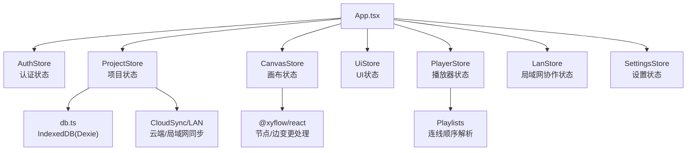
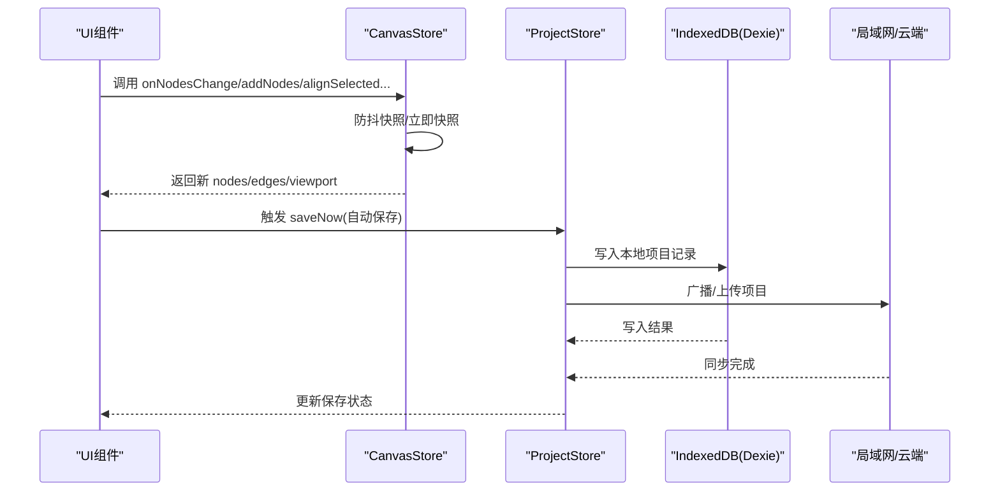
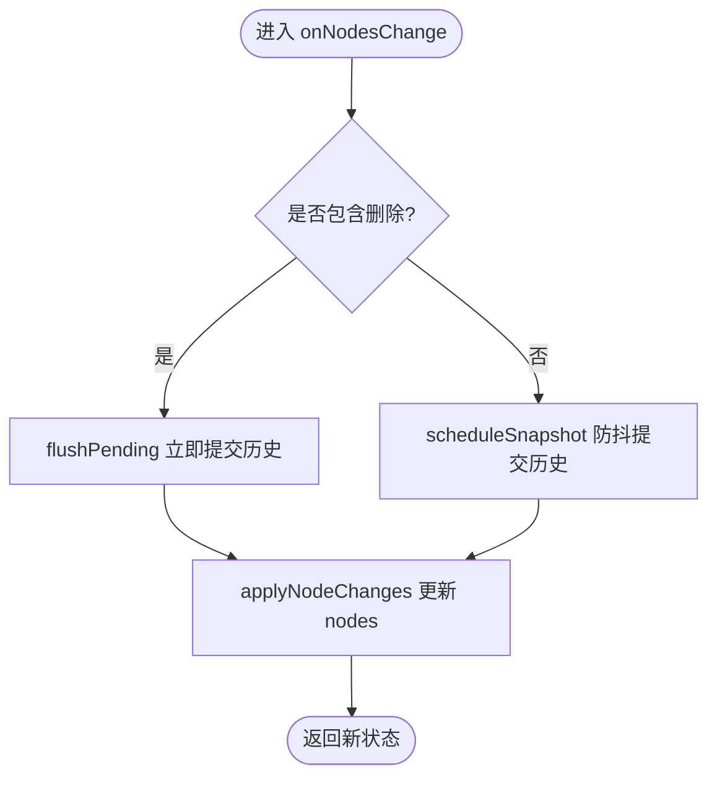
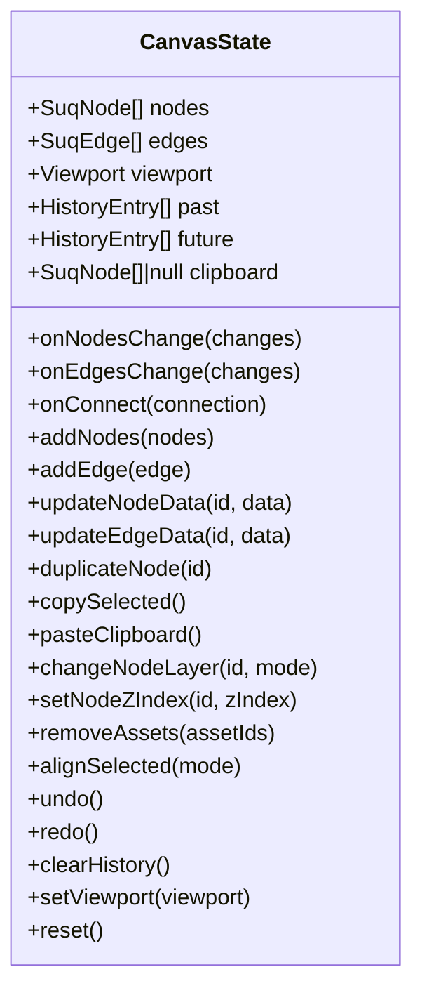
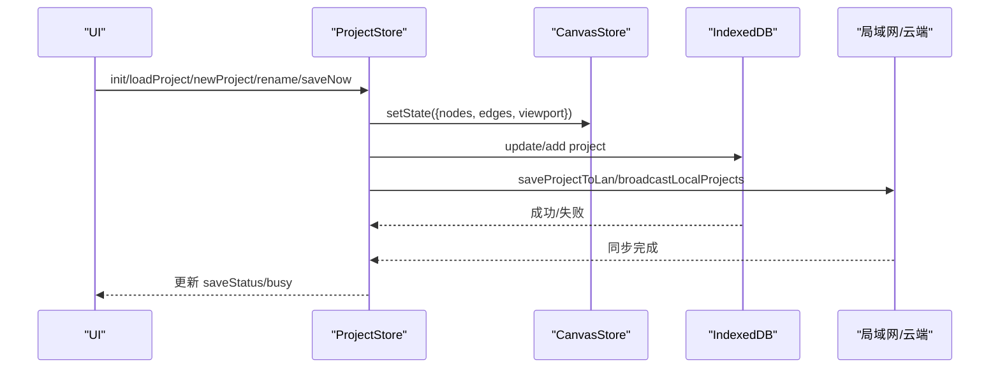
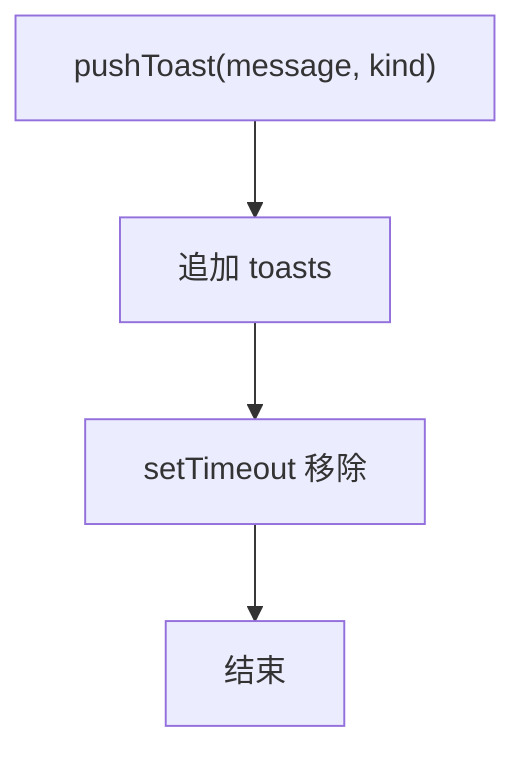
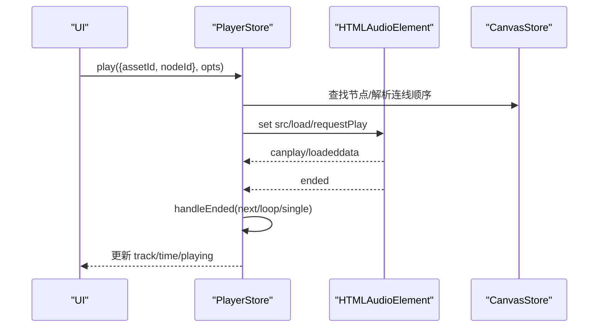
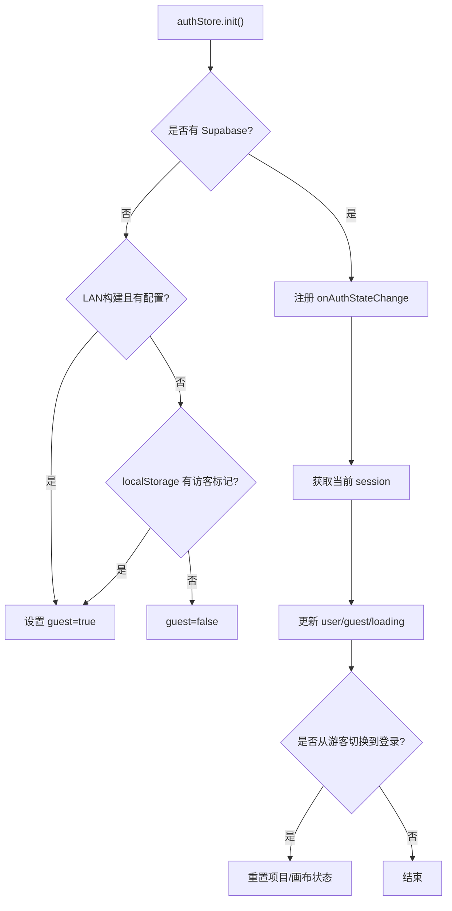
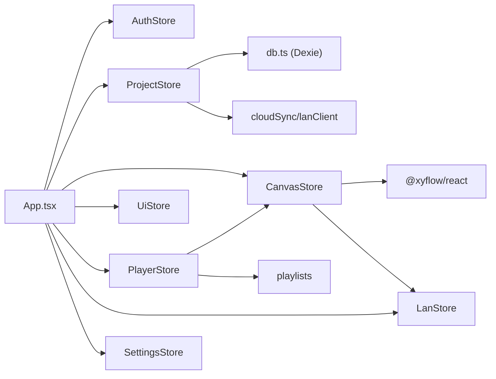

# Zustand 状态管理

<cite>
**本文引用的文件**
- [src/store/canvasStore.ts](file://src/store/canvasStore.ts)
- [src/store/projectStore.ts](file://src/store/projectStore.ts)
- [src/store/uiStore.ts](file://src/store/uiStore.ts)
- [src/store/authStore.ts](file://src/store/authStore.ts)
- [src/store/playerStore.ts](file://src/store/playerStore.ts)
- [src/store/lanStore.ts](file://src/store/lanStore.ts)
- [src/store/settingsStore.ts](file://src/store/settingsStore.ts)
- [src/db/db.ts](file://src/db/db.ts)
- [src/types.ts](file://src/types.ts)
- [src/App.tsx](file://src/App.tsx)
- [src/main.tsx](file://src/main.tsx)
- [src/store/canvasStore.test.ts](file://src/store/canvasStore.test.ts)
</cite>

## 目录
1. [简介](#简介)
2. [项目结构](#项目结构)
3. [核心组件](#核心组件)
4. [架构总览](#架构总览)
5. [详细组件分析](#详细组件分析)
6. [依赖关系分析](#依赖关系分析)
7. [性能考量](#性能考量)
8. [故障排查指南](#故障排查指南)
9. [结论](#结论)
10. [附录](#附录)

## 简介
本技术文档围绕项目中基于 Zustand 的状态管理体系展开，重点解析画布、项目、UI、播放器、局域网协作与设置等 Store 的设计模式与实现细节。内容涵盖：
- 状态组织：UI 状态、画布状态、项目状态的拆分与职责边界
- 选择器与性能优化：细粒度订阅、批量更新、防抖快照
- 不可变更新与中间件模式：通过函数式 setState 与自定义逻辑封装实现
- 持久化策略：IndexedDB（Dexie）集成、序列化与版本迁移思路
- 调试与开发工具：Redux DevTools 集成建议、状态快照与时间旅行调试方案
- 最佳实践：状态拆分、命名规范、测试策略
- 常见问题与优化技巧

## 项目结构
本项目将状态按领域拆分为多个 Store，分别负责不同职责：
- 画布状态：节点、边、视口、撤销/重做历史、剪贴板、对齐与层级等
- 项目状态：项目生命周期、自动保存、云端/本地存储切换
- UI 状态：通知、查看器开关、工具模式等
- 播放器状态：全局音频引擎、播放队列、顺序控制
- 局域网协作状态：用户、光标、活动日志、远程项目列表等
- 认证状态：登录态、游客模式、会话监听
- 设置状态：主题与持久化

图表来源
- [src/App.tsx:19-38](file://src/App.tsx#L19-L38)
- [src/store/projectStore.ts:49-66](file://src/store/projectStore.ts#L49-L66)
- [src/store/canvasStore.ts:118-158](file://src/store/canvasStore.ts#L118-L158)
- [src/db/db.ts:25-33](file://src/db/db.ts#L25-L33)

章节来源
- [src/App.tsx:19-38](file://src/App.tsx#L19-L38)
- [src/main.tsx:1-6](file://src/main.tsx#L1-L6)

## 核心组件
- CanvasStore：提供画布节点/边的增删改查、视图缩放平移、撤销/重做、复制粘贴、对齐、层级调整、资源清理等能力；内部使用防抖快照机制维护历史栈。
- ProjectStore：管理项目初始化、加载、新建、重命名、保存；根据登录态决定写入云端或本地 IndexedDB；安装自动保存监听。
- UiStore：集中管理通知、各类查看器弹窗、播放器入口、工具模式等界面相关状态。
- PlayerStore：单一音频引擎状态机，支持顺序/随机/循环/单曲/流式播放模式，结合画布连线解析播放顺序。
- LanStore：局域网协作的共享状态，包括用户、光标、编辑中信息、活动日志、远程项目列表等。
- AuthStore：Supabase 认证集成、游客模式、登录态变化监听并重置项目/画布状态。
- SettingsStore：主题切换与持久化。

章节来源
- [src/store/canvasStore.ts:33-59](file://src/store/canvasStore.ts#L33-L59)
- [src/store/projectStore.ts:21-34](file://src/store/projectStore.ts#L21-L34)
- [src/store/uiStore.ts:18-45](file://src/store/uiStore.ts#L18-L45)
- [src/store/playerStore.ts:25-50](file://src/store/playerStore.ts#L25-L50)
- [src/store/lanStore.ts:53-89](file://src/store/lanStore.ts#L53-L89)
- [src/store/authStore.ts:8-16](file://src/store/authStore.ts#L8-L16)
- [src/store/settingsStore.ts:7-11](file://src/store/settingsStore.ts#L7-L11)

## 架构总览
Zustand 以 create 创建 store，组件通过选择器订阅最小状态片段，避免不必要重渲染。各 Store 之间通过 getState() 读取其他 store 的最新状态，形成低耦合的数据流。

图表来源
- [src/store/canvasStore.ts:66-107](file://src/store/canvasStore.ts#L66-L107)
- [src/store/projectStore.ts:49-66](file://src/store/projectStore.ts#L49-L66)
- [src/store/projectStore.ts:196-228](file://src/store/projectStore.ts#L196-L228)
- [src/db/db.ts:25-33](file://src/db/db.ts#L25-L33)

## 详细组件分析

### CanvasStore 分析
职责与数据模型
- 状态字段：nodes、edges、viewport、past/future（历史）、clipboard
- 方法：onNodesChange/onEdgesChange/onConnect、addNodes/addEdge/updateNodeData/updateEdgeData、duplicateNode、copySelected/pasteClipboard、changeNodeLayer/setNodeZIndex、removeAssets、alignSelected、undo/redo/clearHistory、setViewport/reset

设计模式与算法
- 不可变更新：每次修改都生成新的数组/对象引用，确保 React 可检测变更
- 撤销/重做：通过 past/future 双栈维护历史，限制长度防止内存膨胀
- 防抖快照：高频操作合并为一次快照，减少历史栈压力
- 插入元数据：从 LanStore 获取当前用户信息，记录 createdById/createdByName/createdAt
- 对齐算法：计算选中节点的边界或间距，批量更新位置
- 层级调整：排序后移动节点并重新分配 zIndex

图表来源
- [src/store/canvasStore.ts:126-145](file://src/store/canvasStore.ts#L126-L145)
- [src/store/canvasStore.ts:66-107](file://src/store/canvasStore.ts#L66-L107)

图表来源
- [src/store/canvasStore.ts:33-59](file://src/store/canvasStore.ts#L33-L59)

章节来源
- [src/store/canvasStore.ts:66-107](file://src/store/canvasStore.ts#L66-L107)
- [src/store/canvasStore.ts:118-399](file://src/store/canvasStore.ts#L118-L399)
- [src/store/canvasStore.test.ts:21-92](file://src/store/canvasStore.test.ts#L21-L92)
- [src/store/canvasStore.test.ts:94-148](file://src/store/canvasStore.test.ts#L94-L148)

### ProjectStore 分析
职责与流程
- 初始化：拉取项目列表，加载最新项目或重置画布
- 自动保存：订阅 CanvasStore 变更，延迟触发保存
- 保存策略：已登录用户写云端，否则写本地 IndexedDB；同时广播到局域网
- 错误处理：捕获异常并提示

图表来源
- [src/store/projectStore.ts:81-117](file://src/store/projectStore.ts#L81-L117)
- [src/store/projectStore.ts:119-182](file://src/store/projectStore.ts#L119-L182)
- [src/store/projectStore.ts:196-228](file://src/store/projectStore.ts#L196-L228)

章节来源
- [src/store/projectStore.ts:49-66](file://src/store/projectStore.ts#L49-L66)
- [src/store/projectStore.ts:81-117](file://src/store/projectStore.ts#L81-L117)
- [src/store/projectStore.ts:196-228](file://src/store/projectStore.ts#L196-L228)

### UiStore 分析
职责
- 通知系统：pushToast/removeToast，自动消失
- 查看器：PDF/图片/Markdown 查看器开关
- 播放器入口：打开/关闭播放器页面
- 工具模式：select/connect/drag

图表来源
- [src/store/uiStore.ts:49-58](file://src/store/uiStore.ts#L49-L58)

章节来源
- [src/store/uiStore.ts:18-45](file://src/store/uiStore.ts#L18-L45)
- [src/store/uiStore.ts:49-121](file://src/store/uiStore.ts#L49-L121)

### PlayerStore 分析
职责
- 全局音频引擎：绑定 HTMLAudioElement，统一播放控制
- 播放模式：顺序/随机/循环/单曲/流式
- 队列与顺序：支持歌单队列或画布连线顺序解析
- 事件联动：onEnded 自动续播

图表来源
- [src/store/playerStore.ts:73-88](file://src/store/playerStore.ts#L73-L88)
- [src/store/playerStore.ts:97-116](file://src/store/playerStore.ts#L97-L116)
- [src/store/playerStore.ts:132-161](file://src/store/playerStore.ts#L132-L161)
- [src/store/playerStore.ts:174-209](file://src/store/playerStore.ts#L174-L209)

章节来源
- [src/store/playerStore.ts:25-50](file://src/store/playerStore.ts#L25-L50)
- [src/store/playerStore.ts:132-161](file://src/store/playerStore.ts#L132-L161)
- [src/store/playerStore.ts:174-209](file://src/store/playerStore.ts#L174-L209)

### LanStore 与 AuthStore 分析
- LanStore：维护局域网协作状态，包括用户、光标、编辑中信息、活动日志、远程项目列表等；提供合并、去重、清理等方法
- AuthStore：Supabase 认证集成，监听会话变化，切换登录态时重置项目/画布状态，避免云端/本地数据串写

图表来源
- [src/store/authStore.ts:49-82](file://src/store/authStore.ts#L49-L82)
- [src/store/authStore.ts:31-42](file://src/store/authStore.ts#L31-L42)

章节来源
- [src/store/lanStore.ts:53-89](file://src/store/lanStore.ts#L53-L89)
- [src/store/authStore.ts:49-82](file://src/store/authStore.ts#L49-L82)
- [src/store/authStore.ts:84-103](file://src/store/authStore.ts#L84-L103)

### SettingsStore 分析
职责
- 主题切换：dark/light，持久化到 localStorage
- 应用主题：动态切换根元素类名

章节来源
- [src/store/settingsStore.ts:7-11](file://src/store/settingsStore.ts#L7-L11)
- [src/store/settingsStore.ts:13-27](file://src/store/settingsStore.ts#L13-L27)
- [src/store/settingsStore.ts:29-39](file://src/store/settingsStore.ts#L29-L39)

## 依赖关系分析
- CanvasStore 依赖 @xyflow/react 进行节点/边变更处理，依赖 LanStore 获取当前用户元数据
- ProjectStore 依赖 db.ts（IndexedDB）与 cloudSync/lanClient 进行持久化与同步
- PlayerStore 依赖 CanvasStore 解析画布连线顺序，依赖 playlists 模块线性化播放序列
- App.tsx 作为入口协调各 Store 的初始化与生命周期

图表来源
- [src/store/canvasStore.ts:1-5](file://src/store/canvasStore.ts#L1-L5)
- [src/store/projectStore.ts:1-17](file://src/store/projectStore.ts#L1-L17)
- [src/store/playerStore.ts:5-7](file://src/store/playerStore.ts#L5-L7)
- [src/App.tsx:13-17](file://src/App.tsx#L13-L17)

章节来源
- [src/store/canvasStore.ts:1-5](file://src/store/canvasStore.ts#L1-L5)
- [src/store/projectStore.ts:1-17](file://src/store/projectStore.ts#L1-L17)
- [src/store/playerStore.ts:5-7](file://src/store/playerStore.ts#L5-L7)
- [src/App.tsx:13-17](file://src/App.tsx#L13-L17)

## 性能考量
- 选择器订阅：组件仅订阅所需字段，减少重渲染范围
- 批量更新：CanvasStore 的对齐、层级、复制粘贴等操作在单次 setState 中完成
- 防抖快照：高频操作合并为一次历史快照，降低历史栈增长与渲染压力
- 不可变更新：始终返回新引用，便于 React 精确比较
- 懒加载与竞态令牌：PlayerStore 使用 playSeq 避免快速连续 play 导致的竞态问题
- 资源清理：CanvasStore.removeAssets 与 db.gcAssets 定期清理无用资产，释放存储空间

[本节为通用性能指导，不直接分析具体文件]

## 故障排查指南
- 自动保存失败：检查 ProjectStore.saveNow 的错误分支，确认网络/权限/存储可用性
- 打开项目失败：检查 loadProjectBest 返回值与错误处理，必要时回退到本地或提示用户
- 登录态切换导致数据串写：AuthStore 在切换登录态时重置项目/画布状态，确保下次初始化正确
- 播放器无法播放：检查 bindPlayerAudio 是否正确绑定元素，requestPlay 的 canplay/loadeddata 重试逻辑
- 历史栈过大：CanvasStore 限制 HISTORY_LIMIT，必要时 clearHistory 或调整阈值

章节来源
- [src/store/projectStore.ts:196-228](file://src/store/projectStore.ts#L196-L228)
- [src/store/projectStore.ts:119-147](file://src/store/projectStore.ts#L119-L147)
- [src/store/authStore.ts:31-42](file://src/store/authStore.ts#L31-L42)
- [src/store/playerStore.ts:73-88](file://src/store/playerStore.ts#L73-L88)
- [src/store/canvasStore.ts:30-31](file://src/store/canvasStore.ts#L30-L31)

## 结论
本项目采用多 Store 拆分的方式，清晰划分了画布、项目、UI、播放器、协作与设置的职责边界。通过不可变更新、选择器订阅、防抖快照与批量更新等手段，实现了高效且可维护的状态管理。持久化方面结合 IndexedDB 与云端/局域网同步，满足多端协作需求。建议在后续迭代中引入 Redux DevTools 增强调试能力，并持续优化历史栈与资源清理策略。

[本节为总结性内容，不直接分析具体文件]

## 附录

### 状态持久化策略
- IndexedDB 集成：使用 Dexie 定义 assets/projects 表，提供基础 CRUD 与 GC 清理
- 序列化：项目 graph（nodes/edges）与 viewport 直接存入数据库
- 版本迁移：Dexie version/stores 可用于未来 schema 演进

章节来源
- [src/db/db.ts:25-33](file://src/db/db.ts#L25-L33)
- [src/db/db.ts:48-69](file://src/db/db.ts#L48-L69)

### 状态调试与开发工具建议
- Redux DevTools 集成：可通过 zustand/middleware 启用 devtools，支持时间旅行与快照
- 状态快照：CanvasStore 的 past/future 可作为内置快照机制
- 时间旅行调试：结合 undo/redo 与外部调试工具，逐步回放状态变更

[本节为概念性建议，不直接分析具体文件]

### 最佳实践
- 状态拆分：按领域划分 Store，避免单体大 Store
- 命名规范：方法名表达意图（如 addNodes、alignSelected），状态字段语义清晰
- 测试策略：针对关键行为编写单元测试（如复制粘贴、层级调整、资源删除）

章节来源
- [src/store/canvasStore.test.ts:21-92](file://src/store/canvasStore.test.ts#L21-L92)
- [src/store/canvasStore.test.ts:94-148](file://src/store/canvasStore.test.ts#L94-L148)

### 常见问题解决方案
- 频繁操作导致卡顿：利用防抖快照与批量更新减少渲染次数
- 历史栈占用过高：限制 HISTORY_LIMIT，适时 clearHistory
- 播放器竞态：使用 playSeq 令牌保证最后一次请求生效
- 登录态切换数据错乱：在 AuthStore 中重置项目/画布状态，确保下次初始化一致

章节来源
- [src/store/canvasStore.ts:30-31](file://src/store/canvasStore.ts#L30-L31)
- [src/store/playerStore.ts:55-56](file://src/store/playerStore.ts#L55-L56)
- [src/store/authStore.ts:31-42](file://src/store/authStore.ts#L31-L42)