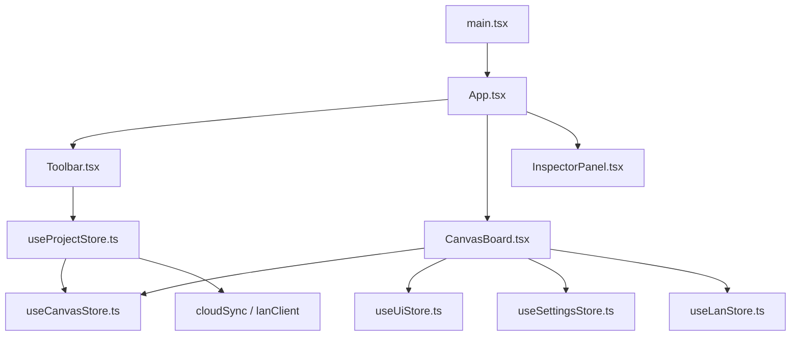
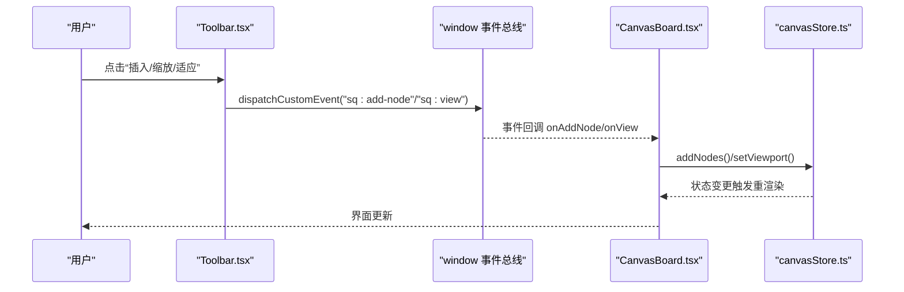
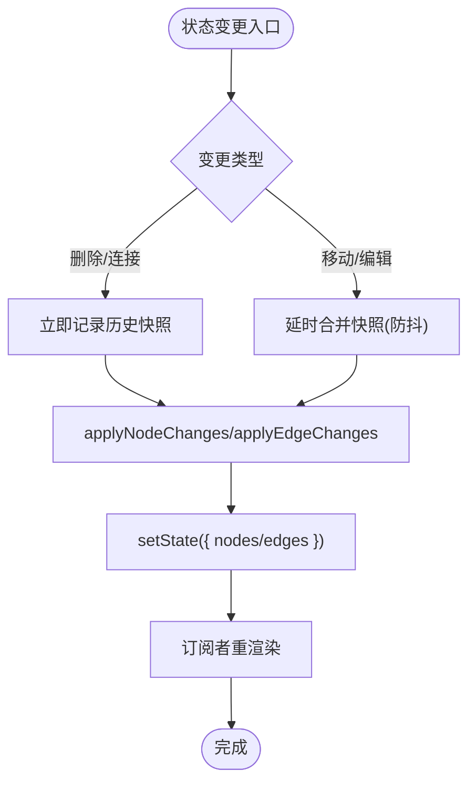
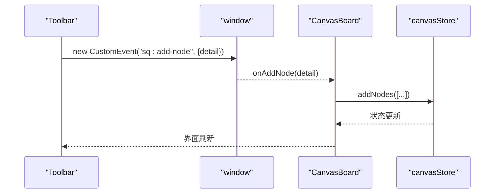
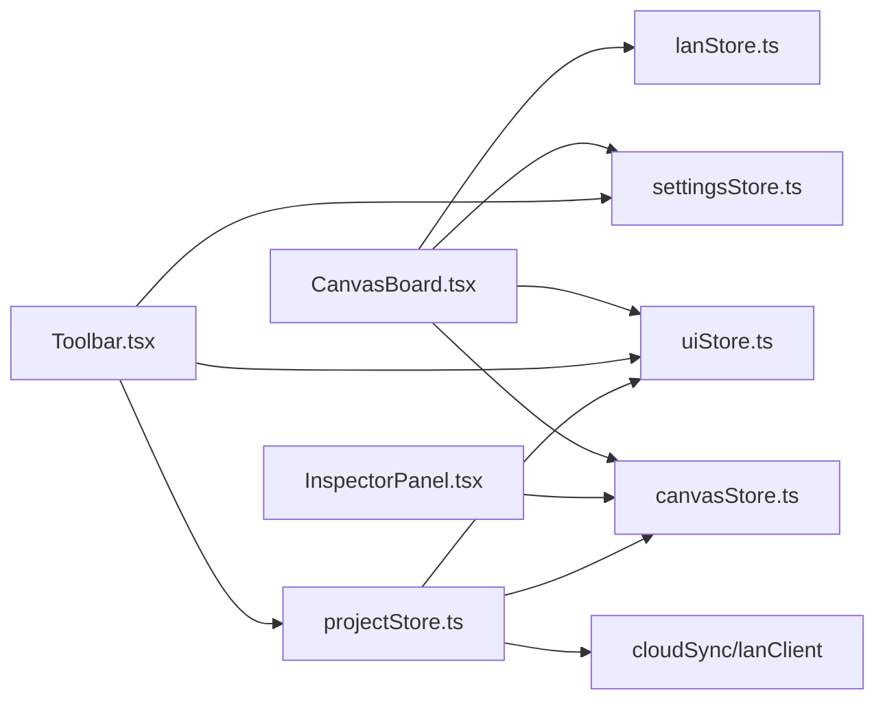

# 组件通信模式

<cite>
**本文引用的文件**
- [src/store/canvasStore.ts](file://src/store/canvasStore.ts)
- [src/store/uiStore.ts](file://src/store/uiStore.ts)
- [src/store/projectStore.ts](file://src/store/projectStore.ts)
- [src/store/settingsStore.ts](file://src/store/settingsStore.ts)
- [src/store/lanStore.ts](file://src/store/lanStore.ts)
- [src/canvas/CanvasBoard.tsx](file://src/canvas/CanvasBoard.tsx)
- [src/components/Toolbar.tsx](file://src/components/Toolbar.tsx)
- [src/components/InspectorPanel.tsx](file://src/components/InspectorPanel.tsx)
- [src/App.tsx](file://src/App.tsx)
- [src/main.tsx](file://src/main.tsx)
</cite>

## 目录
1. [简介](#简介)
2. [项目结构](#项目结构)
3. [核心组件](#核心组件)
4. [架构总览](#架构总览)
5. [详细组件分析](#详细组件分析)
6. [依赖关系分析](#依赖关系分析)
7. [性能考虑](#性能考虑)
8. [故障排查指南](#故障排查指南)
9. [结论](#结论)
10. [附录](#附录)

## 简介
本技术文档聚焦 SuQCanvas 的组件通信模式，围绕以下主题展开：
- Zustand Store 的全局状态管理：如何在组件间共享、监听与更新状态。
- 自定义事件系统：window.dispatchEvent 与 CustomEvent 的应用场景，如 sq:add-node、sq:view、sq:focus-node 等。
- Props 传递最佳实践：父子组件数据流、回调函数设计、事件冒泡处理。
- Context API 的使用场景：主题切换、全局配置传递（本项目以 Store + CSS 类名实现）。
- 组件解耦原则：避免直接依赖、事件驱动、状态提升。
- 性能优化策略与调试技巧。

## 项目结构
SuQCanvas 采用“按功能域组织”的结构：store 集中管理全局状态；canvas 负责画布交互；components 提供 UI 控件；sync 负责局域网同步；io/media/db 等提供基础设施能力。入口为 main.tsx -> App.tsx，渲染 Toolbar、CanvasBoard 及各类模态面板。

图表来源
- [src/main.tsx:1-6](file://src/main.tsx#L1-L6)
- [src/App.tsx:19-74](file://src/App.tsx#L19-L74)
- [src/canvas/CanvasBoard.tsx:17-35](file://src/canvas/CanvasBoard.tsx#L17-L35)
- [src/components/Toolbar.tsx:1-12](file://src/components/Toolbar.tsx#L1-L12)
- [src/store/projectStore.ts:1-17](file://src/store/projectStore.ts#L1-L17)

章节来源
- [src/main.tsx:1-6](file://src/main.tsx#L1-L6)
- [src/App.tsx:19-74](file://src/App.tsx#L19-L74)

## 核心组件
- 全局状态层（Zustand）
  - canvasStore：画布节点/边、视口、撤销重做、对齐、复制粘贴、层级等。
  - uiStore：UI 状态（工具模式、导入队列、查看器开关、Toast、播放器目标等）。
  - projectStore：项目生命周期（新建/加载/保存）、自动保存、云端/本地存储、局域网广播。
  - settingsStore：主题设置（dark/light），通过 DOM class 切换样式。
  - lanStore：局域网协作状态（用户、光标、编辑锁定、活动日志、远端视口等）。
- 视图层
  - CanvasBoard：ReactFlow 容器，订阅 store，处理键盘/拖拽/双击/窗口事件，响应自定义事件。
  - Toolbar：触发插入元素、缩放/适应视图、工具切换、导出/导入、主题切换等。
  - InspectorPanel：选中元素的属性编辑，调用 canvasStore 更新节点/边数据。
- 应用装配
  - App：初始化认证/局域网，挂载各模块，控制加载态。

章节来源
- [src/store/canvasStore.ts:33-59](file://src/store/canvasStore.ts#L33-L59)
- [src/store/uiStore.ts:18-45](file://src/store/uiStore.ts#L18-L45)
- [src/store/projectStore.ts:21-34](file://src/store/projectStore.ts#L21-L34)
- [src/store/settingsStore.ts:7-11](file://src/store/settingsStore.ts#L7-L11)
- [src/store/lanStore.ts:53-89](file://src/store/lanStore.ts#L53-L89)
- [src/canvas/CanvasBoard.tsx:41-102](file://src/canvas/CanvasBoard.tsx#L41-L102)
- [src/components/Toolbar.tsx:86-92](file://src/components/Toolbar.tsx#L86-L92)
- [src/components/InspectorPanel.tsx:288-315](file://src/components/InspectorPanel.tsx#L288-L315)
- [src/App.tsx:19-38](file://src/App.tsx#L19-L38)

## 架构总览
SuQCanvas 的通信由三层构成：
- 事件层：window.dispatchEvent + CustomEvent，用于跨组件/跨模块的松耦合通知（如插入节点、视图操作、聚焦节点）。
- 状态层：Zustand Store，作为单一事实源，被多个组件订阅并触发局部更新。
- 组件层：React 组件通过 hooks 读取 store，并通过 actions 修改状态；同时监听 window 事件执行副作用。

图表来源
- [src/components/Toolbar.tsx:86-92](file://src/components/Toolbar.tsx#L86-L92)
- [src/canvas/CanvasBoard.tsx:244-305](file://src/canvas/CanvasBoard.tsx#L244-L305)
- [src/store/canvasStore.ts:118-175](file://src/store/canvasStore.ts#L118-L175)

章节来源
- [src/components/Toolbar.tsx:86-92](file://src/components/Toolbar.tsx#L86-L92)
- [src/canvas/CanvasBoard.tsx:244-305](file://src/canvas/CanvasBoard.tsx#L244-L305)
- [src/store/canvasStore.ts:118-175](file://src/store/canvasStore.ts#L118-L175)

## 详细组件分析

### Zustand Store 全局状态管理
- 共享状态
  - 画布数据：nodes/edges/viewport/past/future/clipboard。
  - UI 状态：tool/importQueue/viewers/toasts/playerTarget/homeOpen。
  - 项目状态：projectId/projectName/loaded/saveStatus/busy。
  - 设置：theme。
  - 局域网：users/cursors/editing/activities/remoteViewport。
- 监听变化
  - 组件使用 selector 订阅最小化更新（如 useCanvasStore(s => s.nodes)）。
  - 项目自动保存通过 subscribe(canvasStore) 监听 nodes/edges/viewport 变化，延迟触发 saveNow。
- 触发更新
  - 通过 actions 统一修改状态（addNodes/updateNodeData/setViewport/openPlayerPage/toggleTheme 等）。
  - 复杂操作包含历史快照、去抖、批量更新与一致性保证（如 pasteClipboard 重建边映射）。

图表来源
- [src/store/canvasStore.ts:126-145](file://src/store/canvasStore.ts#L126-L145)
- [src/store/canvasStore.ts:66-92](file://src/store/canvasStore.ts#L66-L92)
- [src/store/projectStore.ts:46-67](file://src/store/projectStore.ts#L46-L67)

章节来源
- [src/store/canvasStore.ts:118-399](file://src/store/canvasStore.ts#L118-L399)
- [src/store/uiStore.ts:49-116](file://src/store/uiStore.ts#L49-L116)
- [src/store/projectStore.ts:46-67](file://src/store/projectStore.ts#L46-L67)

### 自定义事件系统：window.dispatchEvent 与 CustomEvent
- 事件定义与分发
  - Toolbar 中封装了 dispatchAddNode 与 dispatchView，分别派发 sq:add-node 与 sq:view。
  - 事件 detail 携带参数（如 kind/level/shape、action=fit/zoom-in/zoom-out/reset）。
- 事件监听与处理
  - CanvasBoard 在 useEffect 中注册 sq:add-node/sq:view/sq:focus-node 监听器。
  - 根据 detail 调用 createHeadingNode/createStickyNode/createShapeNode/createTextNode 或 fitView/zoomIn/zoomOut/setCenter。
- 适用场景
  - 跨层级/跨模块的指令型通信（如从工具栏向画布发送“插入/视图”指令）。
  - 与外部脚本/iframe 集成时，通过 window 事件桥接。

图表来源
- [src/components/Toolbar.tsx:86-92](file://src/components/Toolbar.tsx#L86-L92)
- [src/canvas/CanvasBoard.tsx:244-305](file://src/canvas/CanvasBoard.tsx#L244-L305)

章节来源
- [src/components/Toolbar.tsx:86-92](file://src/components/Toolbar.tsx#L86-L92)
- [src/canvas/CanvasBoard.tsx:244-305](file://src/canvas/CanvasBoard.tsx#L244-L305)

### Props 传递的最佳实践
- 父子组件数据流
  - 父组件通过 props 传入只读数据（如颜色预设、选项列表），子组件通过 onChange 回调将变更上报。
  - InspectorPanel 中的 Segmented/IconSegmented 即采用 value+onChange 模式，保持单向数据流。
- 回调函数设计
  - 回调职责单一：仅负责将变更提交到 store 或触发副作用（如 toast）。
  - 对频繁更新的输入（字号/行距）采用失焦或回车确认，减少中间状态抖动。
- 事件冒泡处理
  - 在需要阻止默认行为或停止冒泡时使用 preventDefault/stopPropagation（如媒体节点锁定时的捕获阶段拦截）。
  - 工具栏菜单通过 document mousedown 关闭，避免弹窗外点击穿透。

章节来源
- [src/components/InspectorPanel.tsx:50-106](file://src/components/InspectorPanel.tsx#L50-L106)
- [src/components/InspectorPanel.tsx:581-654](file://src/components/InspectorPanel.tsx#L581-L654)
- [src/canvas/nodes/MediaNodeShell.tsx:61-67](file://src/canvas/nodes/MediaNodeShell.tsx#L61-L67)
- [src/components/Toolbar.tsx:127-156](file://src/components/Toolbar.tsx#L127-L156)

### Context API 的使用场景
- 本项目未使用 React Context 进行主题/语言配置传递，而是采用：
  - settingsStore 管理 theme，并在 applyTheme 中切换 documentElement 的 light 类名。
  - 组件通过 useSettingsStore 订阅 theme，配合 CSS 变量/类名实现主题切换。
- 优势
  - 避免不必要的 Context Provider 包裹与重渲染。
  - 与第三方库（如 ReactFlow 的 colorMode）无缝对接。

章节来源
- [src/store/settingsStore.ts:13-39](file://src/store/settingsStore.ts#L13-L39)
- [src/canvas/CanvasBoard.tsx:57-59](file://src/canvas/CanvasBoard.tsx#L57-L59)
- [src/canvas/CanvasBoard.tsx:373](file://src/canvas/CanvasBoard.tsx#L373)

### 组件间解耦的设计原则
- 避免直接依赖
  - Toolbar 不直接调用 CanvasBoard 的方法，而是通过 window 事件解耦。
  - 组件仅依赖 store actions，不感知具体实现位置。
- 事件驱动
  - 指令型操作（插入/视图/聚焦）通过事件总线传递，便于扩展与测试。
- 状态提升
  - 画布相关状态集中在 canvasStore，UI 状态集中在 uiStore，项目状态集中在 projectStore，职责清晰。
- 协作与冲突避免
  - 通过 lanStore 的 editing 字段标记其他用户的编辑锁定，CanvasBoard 过滤掉被锁定的节点变更，防止并发冲突。

章节来源
- [src/canvas/CanvasBoard.tsx:62-82](file://src/canvas/CanvasBoard.tsx#L62-L82)
- [src/store/lanStore.ts:126-144](file://src/store/lanStore.ts#L126-L144)

## 依赖关系分析
- 组件到 Store 的依赖
  - CanvasBoard 依赖 canvasStore/uiStore/settingsStore/lanStore。
  - Toolbar 依赖 uiStore/projectStore/settingsStore/canvasStore/playerStore。
  - InspectorPanel 依赖 canvasStore/lanStore。
- Store 之间的依赖
  - projectStore 依赖 canvasStore（读取/写入 graph 与 viewport）与 uiStore（toast）。
  - canvasStore 依赖 lanStore（获取 selfId/name 用于插入元信息）。
- 外部集成
  - ReactFlow 提供节点/边/视口能力，CanvasBoard 通过其 API 与 store 联动。
  - 局域网客户端（lanClient）与云同步（cloudSync）由 projectStore 调度。

图表来源
- [src/canvas/CanvasBoard.tsx:17-35](file://src/canvas/CanvasBoard.tsx#L17-L35)
- [src/components/Toolbar.tsx:1-12](file://src/components/Toolbar.tsx#L1-L12)
- [src/components/InspectorPanel.tsx:1-10](file://src/components/InspectorPanel.tsx#L1-L10)
- [src/store/projectStore.ts:1-17](file://src/store/projectStore.ts#L1-L17)

章节来源
- [src/canvas/CanvasBoard.tsx:17-35](file://src/canvas/CanvasBoard.tsx#L17-L35)
- [src/components/Toolbar.tsx:1-12](file://src/components/Toolbar.tsx#L1-L12)
- [src/components/InspectorPanel.tsx:1-10](file://src/components/InspectorPanel.tsx#L1-L10)
- [src/store/projectStore.ts:1-17](file://src/store/projectStore.ts#L1-L17)

## 性能考虑
- 状态更新批处理与防抖
  - 画布变更通过 scheduleSnapshot 合并多次操作，减少历史快照写入频率。
  - 删除/连接等破坏性操作立即记录快照，确保撤销/重做正确性。
- 选择性订阅
  - 组件使用 selector 订阅最小必要字段，降低重渲染范围。
- 局域网广播节流
  - 视口广播与活动日志采用定时器节流，避免高频网络请求。
- 资源与内存
  - 剪贴板使用 structuredClone 深拷贝，避免引用污染。
  - 历史记录限制长度（HISTORY_LIMIT），防止无限增长。
- 调试建议
  - 使用浏览器 DevTools 的 Redux/Zustand 插件观察状态树。
  - 在关键 action 前后添加 console.log 或使用 store.subscribe 打印 diff。
  - 利用 React Flow 的 devtools 检查节点/边变化。

章节来源
- [src/store/canvasStore.ts:66-92](file://src/store/canvasStore.ts#L66-L92)
- [src/store/canvasStore.ts:205-246](file://src/store/canvasStore.ts#L205-L246)
- [src/sync/lanClient.ts:677-712](file://src/sync/lanClient.ts#L677-L712)

## 故障排查指南
- 无法插入节点
  - 检查 Toolbar 是否正确派发 sq:add-node 事件，且 detail.kind 是否匹配。
  - 确认 CanvasBoard 已注册对应事件监听器，且 centerPosition 计算有效。
- 视图操作无效
  - 检查 sq:view 事件的 action 值（fit/zoom-in/zoom-out/reset）是否被正确处理。
  - 确认 ReactFlow 的 zoomIn/zoomOut/setCenter 可用。
- 自动保存失败
  - 检查 projectStore.saveNow 的异常分支，确认云端/本地存储权限与网络状态。
  - 查看 toast 提示与控制台错误。
- 协作冲突
  - 若节点被他人锁定，CanvasBoard 会过滤该节点的变更；检查 lanStore.editing 与 isNodeLockedByOther。
- 主题不生效
  - 确认 settingsStore.applyTheme 已切换 documentElement 的 light 类名，且 CSS 变量/类名规则正确。

章节来源
- [src/canvas/CanvasBoard.tsx:244-305](file://src/canvas/CanvasBoard.tsx#L244-L305)
- [src/store/projectStore.ts:196-228](file://src/store/projectStore.ts#L196-L228)
- [src/store/settingsStore.ts:13-39](file://src/store/settingsStore.ts#L13-L39)
- [src/canvas/CanvasBoard.tsx:62-82](file://src/canvas/CanvasBoard.tsx#L62-L82)

## 结论
SuQCanvas 通过“事件总线 + Zustand Store + 组件订阅”的组合实现了高内聚、低耦合的组件通信：
- 事件总线负责指令型通信，适合跨层级/跨模块的场景。
- Store 作为单一事实源，保证状态一致性与可追溯性。
- 组件通过选择器订阅与 actions 更新，实现细粒度渲染与可维护性。
- 结合局域网协作与自动保存，形成完整的编辑体验闭环。

## 附录
- 常用事件清单
  - sq:add-node：插入新节点（detail.kind/level/shape/color）。
  - sq:view：视图操作（detail.action=fit/zoom-in/zoom-out/reset）。
  - sq:focus-node：聚焦并选中指定节点（detail.nodeId）。
- 关键 Store 方法
  - canvasStore：addNodes/updateNodeData/setViewport/undo/redo/alignSelected/duplicateNode/pasteClipboard/removeAssets/changeNodeLayer/setNodeZIndex。
  - uiStore：pushToast/openImageViewer/openPdfViewer/openMarkdownViewer/openPlayerPage/requestImport/setTool。
  - projectStore：init/loadProject/newProject/renameProject/saveNow。
  - settingsStore：setTheme/toggleTheme。
  - lanStore：setCursor/setEditing/addActivity/setRemoteViewport。

章节来源
- [src/canvas/CanvasBoard.tsx:244-305](file://src/canvas/CanvasBoard.tsx#L244-L305)
- [src/store/canvasStore.ts:118-399](file://src/store/canvasStore.ts#L118-L399)
- [src/store/uiStore.ts:49-116](file://src/store/uiStore.ts#L49-L116)
- [src/store/projectStore.ts:69-228](file://src/store/projectStore.ts#L69-L228)
- [src/store/settingsStore.ts:29-39](file://src/store/settingsStore.ts#L29-L39)
- [src/store/lanStore.ts:91-159](file://src/store/lanStore.ts#L91-L159)