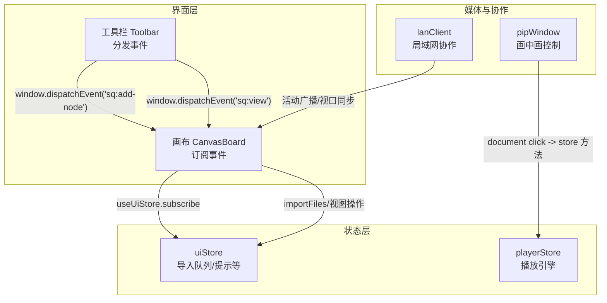
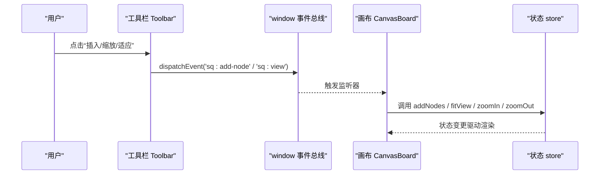
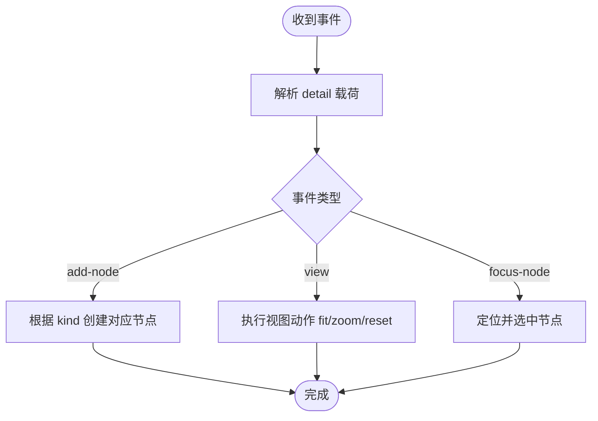
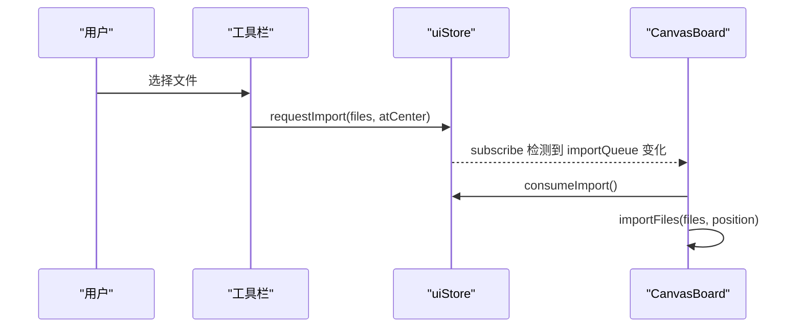
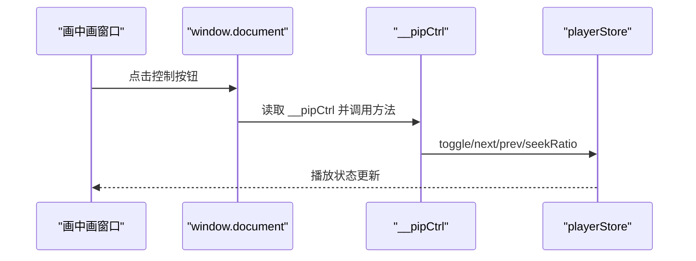
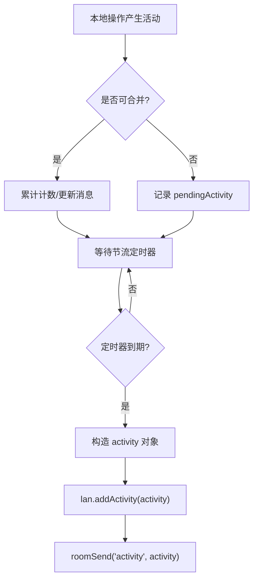
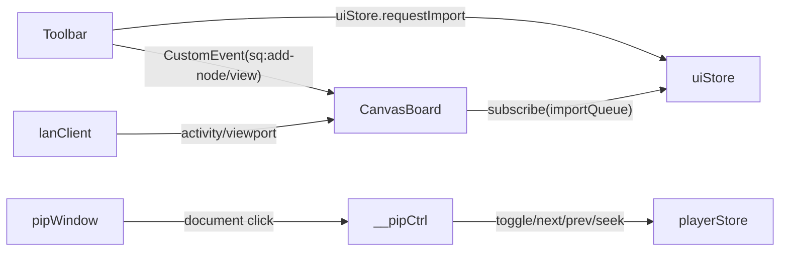

# 自定义事件系统

<cite>
**本文引用的文件**
- [src/components/Toolbar.tsx](file://src/components/Toolbar.tsx)
- [src/canvas/CanvasBoard.tsx](file://src/canvas/CanvasBoard.tsx)
- [src/store/uiStore.ts](file://src/store/uiStore.ts)
- [src/store/playerStore.ts](file://src/store/playerStore.ts)
- [src/media/pipWindow.ts](file://src/media/pipWindow.ts)
- [src/sync/lanClient.ts](file://src/sync/lanClient.ts)
</cite>

## 目录
1. [简介](#简介)
2. [项目结构](#项目结构)
3. [核心组件](#核心组件)
4. [架构总览](#架构总览)
5. [详细组件分析](#详细组件分析)
6. [依赖关系分析](#依赖关系分析)
7. [性能考量](#性能考量)
8. [故障排查指南](#故障排查指南)
9. [结论](#结论)
10. [附录：扩展与规范](#附录：扩展与规范)

## 简介
本技术文档围绕仓库中的“自定义事件系统”展开，聚焦于 window.dispatchEvent 与 CustomEvent 的使用模式、事件命名与载荷设计、监听器注册与生命周期管理；并在此基础上阐述事件驱动架构的优势（解耦、职责分离、可扩展性）、最佳实践（去重、错误处理、性能优化）、与状态管理的结合策略（何时用事件、何时用状态、两者如何协同），以及调试监控方法与扩展规范。

## 项目结构
本项目采用功能域组织方式：UI 交互集中在 components，画布与节点在 canvas，状态通过 store（Zustand）管理，媒体与协作能力在 media 与 sync。自定义事件主要发生在 UI 层（工具栏）与画布层之间，用于跨组件通信。

图表来源
- [src/components/Toolbar.tsx:86-92](file://src/components/Toolbar.tsx#L86-L92)
- [src/canvas/CanvasBoard.tsx:244-305](file://src/canvas/CanvasBoard.tsx#L244-L305)
- [src/store/uiStore.ts:49-68](file://src/store/uiStore.ts#L49-L68)
- [src/media/pipWindow.ts:66-90](file://src/media/pipWindow.ts#L66-L90)
- [src/sync/lanClient.ts:677-712](file://src/sync/lanClient.ts#L677-L712)

章节来源
- [src/components/Toolbar.tsx:86-92](file://src/components/Toolbar.tsx#L86-L92)
- [src/canvas/CanvasBoard.tsx:244-305](file://src/canvas/CanvasBoard.tsx#L244-L305)
- [src/store/uiStore.ts:49-68](file://src/store/uiStore.ts#L49-L68)
- [src/media/pipWindow.ts:66-90](file://src/media/pipWindow.ts#L66-L90)
- [src/sync/lanClient.ts:677-712](file://src/sync/lanClient.ts#L677-L712)

## 核心组件
- 事件分发器：工具栏提供两个专用函数，分别用于插入节点和视图控制，内部统一使用 window.dispatchEvent + CustomEvent 进行跨组件通信。
- 事件监听器：画布组件在挂载时注册多个 window 级别的事件监听，解析 detail 载荷并调用状态更新或视图操作。
- 状态协调：导入流程通过 uiStore 的队列机制实现“请求-消费”模式，避免重复导入与竞态。
- 媒体控制：画中画窗口通过 document 点击事件直接调用全局播放器控制接口，形成轻量事件桥。
- 协作广播：局域网客户端对高频活动进行节流合并后广播，减少网络开销。

章节来源
- [src/components/Toolbar.tsx:86-92](file://src/components/Toolbar.tsx#L86-L92)
- [src/canvas/CanvasBoard.tsx:244-305](file://src/canvas/CanvasBoard.tsx#L244-L305)
- [src/store/uiStore.ts:49-68](file://src/store/uiStore.ts#L49-L68)
- [src/media/pipWindow.ts:66-90](file://src/media/pipWindow.ts#L66-L90)
- [src/sync/lanClient.ts:677-712](file://src/sync/lanClient.ts#L677-L712)

## 架构总览
下图展示了“工具栏 → 画布”的事件流，以及“画中画 → 播放器”、“局域网 → 画布”的辅助事件通道。

图表来源
- [src/components/Toolbar.tsx:86-92](file://src/components/Toolbar.tsx#L86-L92)
- [src/canvas/CanvasBoard.tsx:244-305](file://src/canvas/CanvasBoard.tsx#L244-L305)

## 详细组件分析

### 事件分发与监听：插入节点与视图控制
- 事件命名规范
  - 前缀 sq: 表示应用内自定义事件，避免与浏览器原生事件冲突。
  - 语义化名称：sq:add-node（插入节点）、sq:view（视图操作）、sq:focus-node（聚焦节点）。
- 载荷结构设计
  - 插入节点：detail.kind 指定节点类型（文本/标题/便签/形状），可选 level、shape、color 等参数。
  - 视图控制：detail.action 指定 fit/zoom-in/zoom-out/reset。
  - 聚焦节点：detail.nodeId 指定目标节点 ID。
- 监听器注册与清理
  - 在 useEffect 中注册 window.addEventListener，并在返回函数中 removeEventListener，确保 React 卸载时不残留监听。
- 错误处理
  - 对 detail 字段做空值保护与类型回退，避免异常中断。
  - 对不存在的目标节点进行存在性检查后再操作。

图表来源
- [src/components/Toolbar.tsx:86-92](file://src/components/Toolbar.tsx#L86-L92)
- [src/canvas/CanvasBoard.tsx:244-305](file://src/canvas/CanvasBoard.tsx#L244-L305)

章节来源
- [src/components/Toolbar.tsx:86-92](file://src/components/Toolbar.tsx#L86-L92)
- [src/canvas/CanvasBoard.tsx:244-305](file://src/canvas/CanvasBoard.tsx#L244-L305)

### 导入流程：事件与状态的协同
- 事件驱动入口：工具栏触发文件选择，调用 uiStore.requestImport(files, atCenter)。
- 状态队列：uiStore 维护 importQueue，保证同一时刻仅处理一次导入任务。
- 消费与执行：CanvasBoard 通过 useUiStore.subscribe 监听变化，调用 consumeImport 获取任务并执行导入。
- 优势：避免重复导入、解耦 UI 与业务逻辑、便于测试与扩展。

图表来源
- [src/components/Toolbar.tsx:389-399](file://src/components/Toolbar.tsx#L389-L399)
- [src/store/uiStore.ts:59-68](file://src/store/uiStore.ts#L59-L68)
- [src/canvas/CanvasBoard.tsx:307-334](file://src/canvas/CanvasBoard.tsx#L307-L334)

章节来源
- [src/components/Toolbar.tsx:389-399](file://src/components/Toolbar.tsx#L389-L399)
- [src/store/uiStore.ts:59-68](file://src/store/uiStore.ts#L59-L68)
- [src/canvas/CanvasBoard.tsx:307-334](file://src/canvas/CanvasBoard.tsx#L307-L334)

### 画中画控制：轻量事件桥
- 事件源：画中画窗口内的按钮点击事件（document.addEventListener('click', ...)）。
- 控制器：通过 window.__pipCtrl 暴露的控制对象，调用 toggle/next/prev/close/seekRatio 等方法。
- 特点：跨窗口通信简单直接，适合轻量控制场景；注意生命周期清理（onunload 清除定时器）。

图表来源
- [src/media/pipWindow.ts:66-90](file://src/media/pipWindow.ts#L66-L90)

章节来源
- [src/media/pipWindow.ts:66-90](file://src/media/pipWindow.ts#L66-L90)

### 局域网协作：活动广播与视口同步
- 活动聚合：对频繁 create/delete 等操作进行计数合并，减少广播频率。
- 广播时机：setTimeout 延迟后统一发送 activity 消息，降低网络抖动影响。
- 视口广播：仅在连接且非跟随他人时定时广播当前视口，避免无效传输。

图表来源
- [src/sync/lanClient.ts:677-712](file://src/sync/lanClient.ts#L677-L712)

章节来源
- [src/sync/lanClient.ts:677-712](file://src/sync/lanClient.ts#L677-L712)

## 依赖关系分析
- 松耦合：工具栏不直接依赖画布的具体实现，仅通过事件名约定通信；画布只关心事件载荷，不关心来源。
- 单一职责：uiStore 专注状态与队列，CanvasBoard 专注视图与业务编排，pipWindow 专注跨窗口控制。
- 外部依赖：React Flow 提供画布能力；Zustand 提供状态订阅；MediaElement 提供音频播放。

图表来源
- [src/components/Toolbar.tsx:86-92](file://src/components/Toolbar.tsx#L86-L92)
- [src/canvas/CanvasBoard.tsx:244-305](file://src/canvas/CanvasBoard.tsx#L244-L305)
- [src/store/uiStore.ts:59-68](file://src/store/uiStore.ts#L59-L68)
- [src/media/pipWindow.ts:66-90](file://src/media/pipWindow.ts#L66-L90)
- [src/sync/lanClient.ts:677-712](file://src/sync/lanClient.ts#L677-L712)

章节来源
- [src/components/Toolbar.tsx:86-92](file://src/components/Toolbar.tsx#L86-L92)
- [src/canvas/CanvasBoard.tsx:244-305](file://src/canvas/CanvasBoard.tsx#L244-L305)
- [src/store/uiStore.ts:59-68](file://src/store/uiStore.ts#L59-L68)
- [src/media/pipWindow.ts:66-90](file://src/media/pipWindow.ts#L66-L90)
- [src/sync/lanClient.ts:677-712](file://src/sync/lanClient.ts#L677-L712)

## 性能考量
- 事件节流与合并：局域网活动使用 setTimeout 合并相近操作，减少广播次数。
- 订阅粒度：uiStore 使用细粒度订阅，仅当 importQueue 变化时触发导入，避免全量重渲染。
- 资源释放：所有 window/document 事件监听均在组件卸载时移除，防止内存泄漏。
- 异步安全：画中画与播放器使用一次性监听与令牌机制，避免竞态导致的状态错乱。

[本节为通用性能建议，无需特定文件引用]

## 故障排查指南
- 事件未触发
  - 检查事件名是否正确（sq:add-node、sq:view、sq:focus-node）。
  - 确认监听器已注册且在作用域内，组件卸载后需重新注册。
- 载荷缺失或类型错误
  - 对 detail 字段做空值保护与默认值回退。
  - 对 nodeId 等关键参数进行存在性校验。
- 重复导入
  - 使用 uiStore.importQueue 队列机制，确保同一时间只有一个导入任务在执行。
- 画中画控制失效
  - 确认 window.__pipCtrl 已正确注入且未被覆盖。
  - 检查 onunload 是否清除了定时器与引用。
- 协作广播过多
  - 调整节流时间与合并策略，避免频繁网络请求。

章节来源
- [src/canvas/CanvasBoard.tsx:244-305](file://src/canvas/CanvasBoard.tsx#L244-L305)
- [src/store/uiStore.ts:59-68](file://src/store/uiStore.ts#L59-L68)
- [src/media/pipWindow.ts:66-90](file://src/media/pipWindow.ts#L66-L90)
- [src/sync/lanClient.ts:677-712](file://src/sync/lanClient.ts#L677-L712)

## 结论
本项目以 window.dispatchEvent + CustomEvent 为核心，构建了轻量、解耦的自定义事件系统。通过明确的事件命名与载荷约定，实现了工具栏与画布的松耦合通信；借助 Zustand 的状态订阅与队列机制，进一步提升了导入流程的稳定性和可维护性。配合画中画与局域网协作的事件桥，整体架构具备良好的可扩展性与可观测性。

[本节为总结性内容，无需特定文件引用]

## 附录：扩展与规范
- 事件命名规范
  - 统一前缀：sq: 表示应用内自定义事件。
  - 语义化：动词+名词（如 add-node、view、focus-node），便于理解与维护。
- 载荷设计规范
  - 最小必要原则：仅包含下游所需字段。
  - 类型安全：使用联合类型或枚举约束 key（如 action、kind）。
  - 容错：对可选字段提供默认值与空值保护。
- 监听器生命周期
  - 在 useEffect 中注册，在返回函数中移除。
  - 避免在循环中动态注册/注销监听器。
- 错误处理
  - 捕获并记录异常，提供降级行为。
  - 对不存在的目标进行防御性检查。
- 性能优化
  - 高频事件使用节流/防抖。
  - 批量更新状态，减少重渲染次数。
- 与状态管理的结合
  - 事件用于跨边界通知与触发副作用；状态用于持久化与共享数据。
  - 典型模式：事件触发 → 写入 store → 订阅者响应。
- 调试与监控
  - 在分发处打印事件名与载荷（开发环境）。
  - 在监听处记录处理耗时与异常堆栈。
  - 对关键路径（导入、协作广播）埋点统计。
- 扩展指南
  - 新增事件：定义事件名与载荷类型，在分发处调用 dispatchEvent，在监听处注册处理函数。
  - 单元测试：模拟 window.dispatchEvent，验证监听器行为与状态变更。
  - 向后兼容：为新载荷字段提供默认值，避免破坏旧版本。

[本节为通用规范与建议，无需特定文件引用]