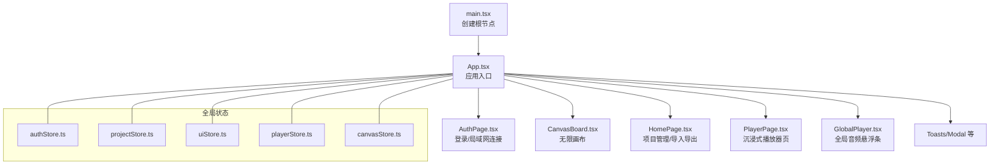
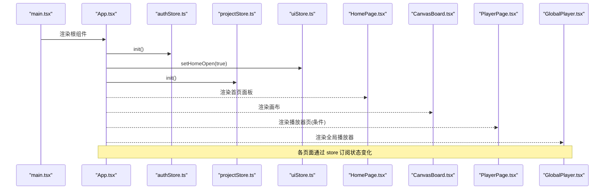
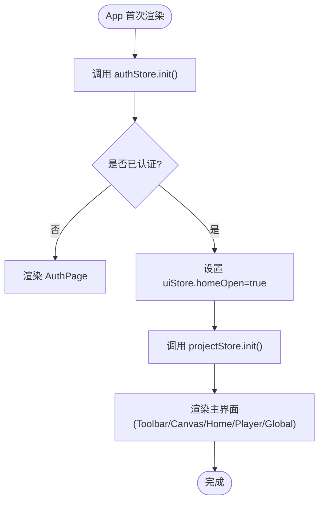
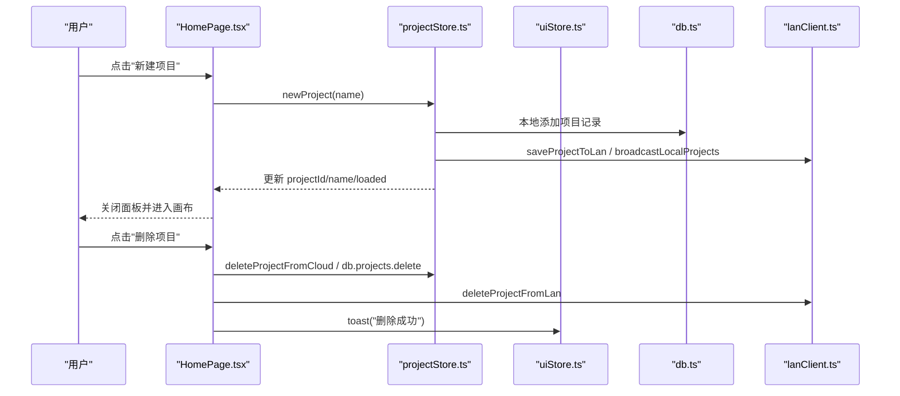
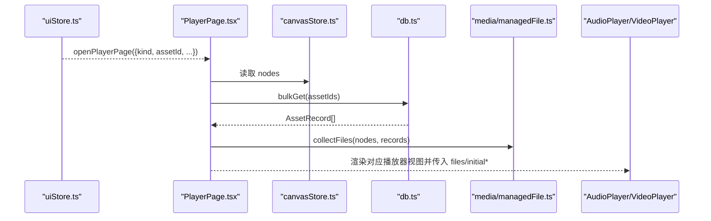
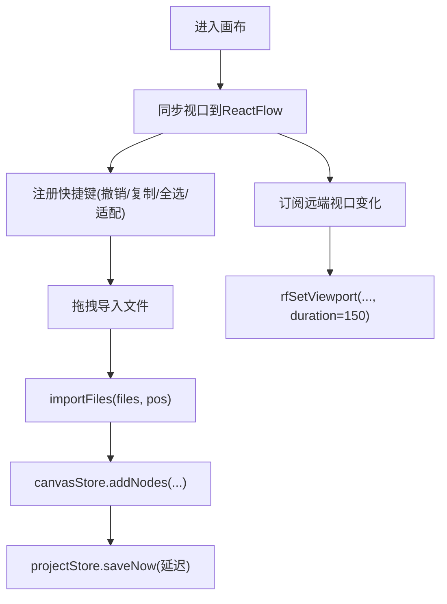
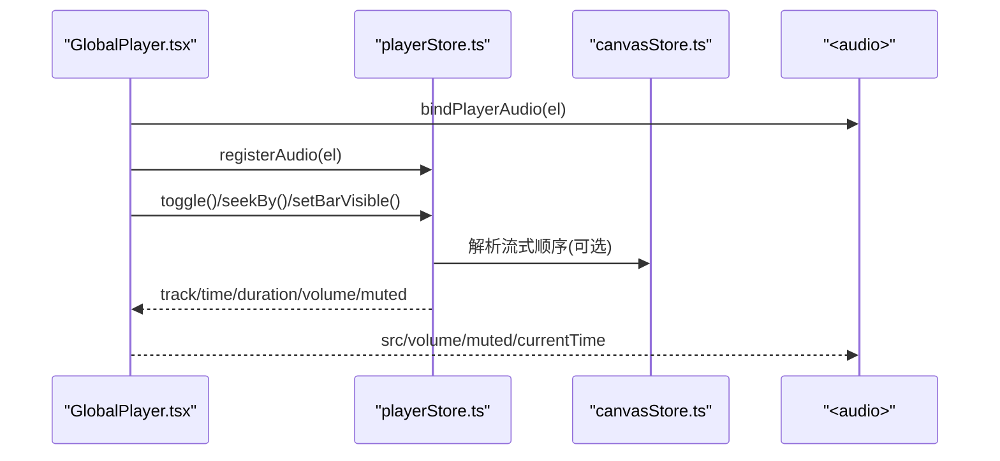
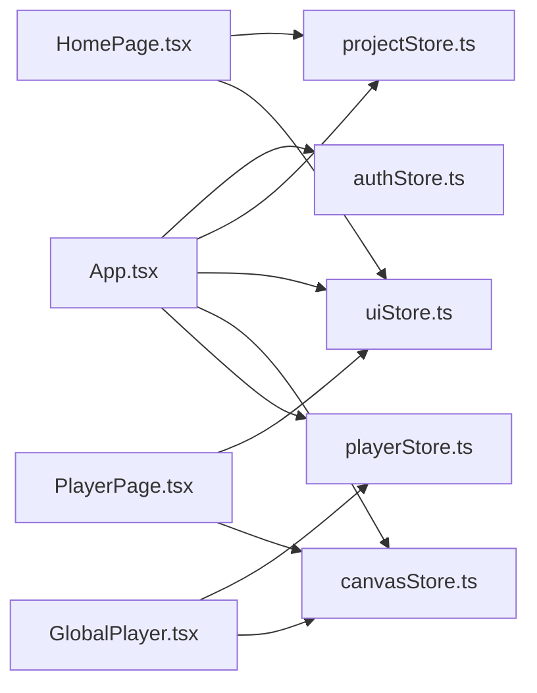

# 页面组件设计

<cite>
**本文引用的文件**
- [main.tsx](file://src/main.tsx)
- [App.tsx](file://src/App.tsx)
- [HomePage.tsx](file://src/components/HomePage.tsx)
- [PlayerPage.tsx](file://src/components/PlayerPage.tsx)
- [AuthPage.tsx](file://src/components/AuthPage.tsx)
- [CanvasBoard.tsx](file://src/canvas/CanvasBoard.tsx)
- [GlobalPlayer.tsx](file://src/components/GlobalPlayer.tsx)
- [AudioPlayer.tsx](file://src/components/AudioPlayer.tsx)
- [VideoPlayer.tsx](file://src/components/VideoPlayer.tsx)
- [authStore.ts](file://src/store/authStore.ts)
- [projectStore.ts](file://src/store/projectStore.ts)
- [uiStore.ts](file://src/store/uiStore.ts)
- [playerStore.ts](file://src/store/playerStore.ts)
- [canvasStore.ts](file://src/store/canvasStore.ts)
</cite>

## 更新摘要
**所做更改**
- 更新了应用入口组件的认证状态处理逻辑，改进了对象引用比较的稳定性
- 避免了不必要的重渲染循环，通过布尔值依赖替代对象引用依赖
- 优化了 useEffect 的执行频率，防止 Supabase token 自动刷新导致的重复执行问题

## 目录
1. [简介](#简介)
2. [项目结构](#项目结构)
3. [核心组件](#核心组件)
4. [架构总览](#架构总览)
5. [详细组件分析](#详细组件分析)
6. [依赖关系分析](#依赖关系分析)
7. [性能与渲染优化](#性能与渲染优化)
8. [故障排查指南](#故障排查指南)
9. [结论](#结论)
10. [附录：开发规范与最佳实践](#附录开发规范与最佳实践)

## 简介
本文件面向 SuQCanvas 的页面级组件设计与实现，聚焦以下目标：
- 明确 App、HomePage、PlayerPage 的职责边界与协作方式
- 说明页面生命周期管理、状态初始化流程、与全局状态的绑定方式
- 阐述页面间导航机制与数据传递模式
- 总结页面组件的渲染优化策略（懒加载、条件渲染等）
- 提供可复用的开发规范与最佳实践示例

## 项目结构
SuQCanvas 采用"应用入口 + 页面组件 + 全局状态"的分层组织：
- 应用入口 main.tsx 挂载根组件 App
- App 负责认证初始化、路由式条件渲染、以及全局模块装配（工具栏、画布、首页面板、播放器页、全局播放器、提示等）
- 页面组件 HomePage 处理项目管理与文件操作；PlayerPage 专注媒体播放
- 全局状态通过 Zustand store 管理：authStore、projectStore、uiStore、playerStore、canvasStore 等

图表来源
- [main.tsx:1-6](file://src/main.tsx#L1-L6)
- [App.tsx:19-73](file://src/App.tsx#L19-L73)

章节来源
- [main.tsx:1-6](file://src/main.tsx#L1-L6)
- [App.tsx:19-73](file://src/App.tsx#L19-L73)

## 核心组件
- App：应用入口。负责：
  - 启动认证初始化与局域网自动重连
  - 根据认证态决定渲染 AuthPage 或主界面
  - 进入主界面后打开首页面板并初始化项目
  - 组合 Toolbar、CanvasBoard、HomePage、PlayerPage、GlobalPlayer 等子模块
- HomePage：项目管理与文件操作。负责：
  - 项目列表展示、新建/打开/删除/重命名
  - 导入导出 .sqcanvas 文件
  - 局域网项目同步与恢复已删除项目
  - 主题切换、用户信息展示、云/OSS 状态指示
- PlayerPage：媒体播放专用页。负责：
  - 根据 uiStore 中的 playerPage 类型渲染 AudioPlayerView 或 VideoPlayerView
  - 从画布节点收集媒体资产并构建播放列表
  - 将初始播放参数传递给具体播放器视图

章节来源
- [App.tsx:19-73](file://src/App.tsx#L19-L73)
- [HomePage.tsx:415-800](file://src/components/HomePage.tsx#L415-L800)
- [PlayerPage.tsx:14-101](file://src/components/PlayerPage.tsx#L14-L101)

## 架构总览
页面级组件通过全局状态进行解耦通信，避免直接耦合：
- 认证与项目：authStore 管理登录态；projectStore 管理当前项目与自动保存
- UI 状态：uiStore 管理弹窗、播放器页开关、工具模式、导入队列等
- 媒体播放：playerStore 维护唯一播放引擎；GlobalPlayer 挂载真实 audio 元素
- 画布：canvasStore 维护节点、边、视口与撤销历史

图表来源
- [main.tsx:1-6](file://src/main.tsx#L1-L6)
- [App.tsx:25-38](file://src/App.tsx#L25-L38)
- [projectStore.ts:81-117](file://src/store/projectStore.ts#L81-L117)
- [uiStore.ts:108-115](file://src/store/uiStore.ts#L108-L115)

## 详细组件分析

### App：应用入口与生命周期
- 生命周期要点
  - 首次渲染时调用 authStore.init()，在局域网构建下触发 autoReconnectLan()
  - 认证成功后设置 homeOpen=true 并调用 projectStore.init()
  - 若未认证则渲染 AuthPage；否则渲染主界面（Toolbar、CanvasBoard、HomePage、PlayerPage、GlobalPlayer、Toasts 等）
- 状态绑定
  - 使用 useAuthStore/useProjectStore/useUiStore 的 selector 订阅最小化状态
  - busy 标志用于显示"项目加载中…"遮罩
- **更新** 认证状态处理优化
  - 使用 `const entered = Boolean(user || guest)` 计算布尔值作为依赖
  - 避免直接依赖 user/guest 对象引用，防止 Supabase token 自动刷新导致的新对象引用
  - 有效避免了不必要的重渲染循环和主页覆盖层被意外重新打开的问题
- 错误与边界
  - loading 状态下仅显示加载提示
  - 未进入认证态时不渲染主界面，防止无效状态下的副作用

图表来源
- [App.tsx:25-47](file://src/App.tsx#L25-L47)
- [projectStore.ts:81-117](file://src/store/projectStore.ts#L81-L117)

章节来源
- [App.tsx:19-73](file://src/App.tsx#L19-L73)
- [authStore.ts:44-103](file://src/store/authStore.ts#L44-L103)
- [projectStore.ts:81-117](file://src/store/projectStore.ts#L81-L117)

### HomePage：项目管理与文件操作
- 职责范围
  - 项目列表合并本地与局域网远端项目，支持排序与过滤
  - 新建/打开/删除/重命名项目，支持云端与本地存储路径选择
  - 导入导出 .sqcanvas 文件，支持局域网备份恢复
  - 主题切换、用户信息展示、云/OSS 连接状态指示
- 生命周期与副作用
  - 当面板打开且项目已初始化时刷新项目列表
  - 打开面板时停止播放器，避免后台播放干扰
  - 删除项目时清理本地资源并广播局域网变更
- 与全局状态交互
  - 通过 useProjectStore 执行项目操作
  - 通过 useUiStore 控制面板显隐与 toast
  - 通过 useAuthStore 获取用户信息与退出登录
  - 通过 useLanStore 获取局域网项目元数据

图表来源
- [HomePage.tsx:483-561](file://src/components/HomePage.tsx#L483-L561)
- [projectStore.ts:149-181](file://src/store/projectStore.ts#L149-L181)

章节来源
- [HomePage.tsx:415-800](file://src/components/HomePage.tsx#L415-L800)
- [projectStore.ts:149-194](file://src/store/projectStore.ts#L149-L194)
- [uiStore.ts:49-115](file://src/store/uiStore.ts#L49-L115)

### PlayerPage：媒体播放专用页
- 职责范围
  - 根据 uiStore.playerPage.kind 渲染 AudioPlayerView 或 VideoPlayerView
  - 从 canvasStore.nodes 提取 assetId 列表，批量查询 db.assets 构建播放所需文件集合
  - 将 initialAssetId、flow、playlistId 等参数传递给具体播放器视图
- 生命周期与副作用
  - 进入页面时按 kind 分支加载对应媒体资源
  - 使用 alive 标记避免组件卸载后的异步更新
- 与全局状态交互
  - 通过 useUiStore 读取/关闭播放器页
  - 通过 useCanvasStore 获取节点与媒体关联
  - 通过 media/managedFile 与 db 获取媒体元数据与 URL

图表来源
- [PlayerPage.tsx:14-101](file://src/components/PlayerPage.tsx#L14-L101)
- [canvasStore.ts:118-175](file://src/store/canvasStore.ts#L118-L175)

章节来源
- [PlayerPage.tsx:14-101](file://src/components/PlayerPage.tsx#L14-L101)
- [uiStore.ts:31-38](file://src/store/uiStore.ts#L31-L38)

### CanvasBoard：画布与协同编辑
- 职责范围
  - 基于 ReactFlow 实现节点/边编辑、缩放、平移、快捷键、拖拽导入
  - 监听键盘事件实现撤销/重做、复制粘贴、全选、适配视图等操作
  - 集成局域网协同：光标共享、编辑锁定、远程视口跟随
- 生命周期与副作用
  - 初始化时同步视口到 ReactFlow
  - 订阅局域网远端视口变化并平滑过渡
  - 监听窗口事件与自定义事件以扩展能力
- 与全局状态交互
  - 通过 canvasStore 管理节点/边/视口与历史
  - 通过 uiStore 管理工具模式与导入队列
  - 通过 lanStore 管理协同光标与编辑状态

图表来源
- [CanvasBoard.tsx:88-102](file://src/canvas/CanvasBoard.tsx#L88-L102)
- [CanvasBoard.tsx:104-150](file://src/canvas/CanvasBoard.tsx#L104-L150)
- [CanvasBoard.tsx:222-232](file://src/canvas/CanvasBoard.tsx#L222-L232)
- [projectStore.ts:46-67](file://src/store/projectStore.ts#L46-L67)

章节来源
- [CanvasBoard.tsx:41-423](file://src/canvas/CanvasBoard.tsx#L41-L423)
- [projectStore.ts:46-67](file://src/store/projectStore.ts#L46-L67)

### GlobalPlayer：全局音频悬浮条
- 职责范围
  - 挂载唯一 <audio> 元素，统一播放引擎
  - 提供可拖拽的悬浮控制条，支持播放/暂停、快退/快进、隐藏/展开、画中画
  - 计算当前曲目所属歌单名称，便于跳转至播放器页
- 生命周期与副作用
  - 组件挂载时绑定 audio 元素并注册到播放器引擎
  - 监听音量/静音变化同步到真实元素
  - 暴露 window.__pipCtrl 供外部小窗控制
- 与全局状态交互
  - 通过 playerStore 控制播放状态与模式
  - 通过 canvasStore 解析画布连线顺序（流式播放）

图表来源
- [GlobalPlayer.tsx:86-119](file://src/components/GlobalPlayer.tsx#L86-L119)
- [playerStore.ts:58-116](file://src/store/playerStore.ts#L58-L116)

章节来源
- [GlobalPlayer.tsx:19-234](file://src/components/GlobalPlayer.tsx#L19-L234)
- [playerStore.ts:163-298](file://src/store/playerStore.ts#L163-298)

## 依赖关系分析
- 页面组件与 Store 的耦合度低，主要通过 selector 订阅最小状态集，减少不必要重渲染
- 页面间通过 uiStore 的集中状态进行导航与数据传递（如 playerPage、homeOpen、toasts）
- 媒体播放由 playerStore 统一管理，避免多实例冲突
- 画布与项目持久化通过 projectStore 与 canvasStore 协作，结合云端/本地/局域网多通道存储

图表来源
- [App.tsx:19-73](file://src/App.tsx#L19-L73)
- [HomePage.tsx:415-800](file://src/components/HomePage.tsx#L415-L800)
- [PlayerPage.tsx:14-101](file://src/components/PlayerPage.tsx#L14-L101)
- [GlobalPlayer.tsx:19-234](file://src/components/GlobalPlayer.tsx#L19-L234)

章节来源
- [App.tsx:19-73](file://src/App.tsx#L19-L73)
- [HomePage.tsx:415-800](file://src/components/HomePage.tsx#L415-L800)
- [PlayerPage.tsx:14-101](file://src/components/PlayerPage.tsx#L14-L101)
- [GlobalPlayer.tsx:19-234](file://src/components/GlobalPlayer.tsx#L19-L234)

## 性能与渲染优化
- 条件渲染
  - App 根据 loading/entered 条件渲染不同界面，避免无效渲染
  - PlayerPage 仅在 playerPage 存在时渲染，并按 kind 分支渲染具体播放器
- 懒加载与按需数据
  - PlayerPage 在进入时批量查询 db.assets.bulkGet，减少重复请求
  - VideoPlayer 批量探测视频时长与缩略图，完成后释放临时 video 元素
- 防抖与节流
  - projectStore 自动保存使用延时定时器，降低频繁保存开销
  - canvasStore 历史快照使用防抖合并，减少历史记录膨胀
- 最小化重渲染
  - 使用 Zustand selector 订阅最小状态片段
  - 使用 useMemo/useCallback 缓存计算结果与回调
  - **更新** 使用布尔值依赖替代对象引用依赖，避免 Supabase token 刷新导致的重渲染循环
- 媒体资源优化
  - GlobalPlayer 单一 <audio> 元素复用，避免多实例竞争
  - 播放器通过 getAssetUrl/getThumbnailUrl 获取资源，必要时预加载 metadata

[本节为通用性能建议，不直接分析具体代码行]

## 故障排查指南
- 认证失败
  - 检查 supabase 配置与网络连通性
  - 查看 translateAuthError 映射的错误信息
- 项目加载失败
  - 确认 projectStore.init/loadProject 是否返回有效记录
  - 检查云端/本地存储权限与数据完整性
- 播放器无声音
  - 确认 GlobalPlayer 已绑定 audio 元素
  - 检查 playerStore.play 是否成功设置 src 并触发 canplay
- 画布协同异常
  - 检查 lanStore.cursors/editing 状态
  - 确认 isNodeLockedByOther/sendLanCursor/setLanEditing 调用正确
- **更新** 认证状态相关性能问题
  - 如果观察到不必要的重渲染循环，检查 useEffect 依赖是否正确使用了布尔值而非对象引用
  - 确认 Supabase token 自动刷新不会导致认证状态的不必要更新

章节来源
- [authStore.ts:18-25](file://src/store/authStore.ts#L18-L25)
- [projectStore.ts:119-147](file://src/store/projectStore.ts#L119-L147)
- [playerStore.ts:72-88](file://src/store/playerStore.ts#L72-L88)
- [CanvasBoard.tsx:76-82](file://src/canvas/CanvasBoard.tsx#L76-L82)

## 结论
SuQCanvas 的页面组件设计遵循"职责清晰、状态集中、组件解耦"的原则：
- App 作为入口负责认证与装配，HomePage 专注项目管理，PlayerPage 专注媒体播放
- 通过 Zustand store 实现跨组件通信，避免直接耦合
- 借助条件渲染、懒加载、防抖等手段提升性能
- **更新** 通过优化认证状态处理逻辑，进一步提升了应用的稳定性和性能表现
- 提供完善的错误处理与用户体验反馈

[本节为总结性内容，不直接分析具体代码行]

## 附录：开发规范与最佳实践
- 页面职责划分
  - App：认证、装配、全局状态初始化
  - HomePage：项目 CRUD、导入导出、局域网同步
  - PlayerPage：媒体播放入口与参数分发
- 生命周期管理
  - 在 useEffect 中订阅 store 变化并执行副作用
  - 使用 alive 标记避免组件卸载后更新状态
  - 在组件卸载时清理事件监听与定时器
- 状态初始化流程
  - 先认证再初始化项目，确保数据一致性
  - 项目初始化成功后开启自动保存
- 与全局状态绑定
  - 使用 selector 订阅最小状态片段
  - 通过 actions 修改状态，避免直接赋值
  - **更新** 对于可能频繁变化的对象（如 Supabase user），使用布尔值或稳定标识符作为依赖，避免对象引用变化导致的重渲染
- 页面间导航与数据传递
  - 通过 uiStore 的 playerPage/homeOpen/toasts 等字段进行导航与提示
  - 通过 canvasStore 的 nodes/edges 传递媒体关联信息
- 渲染优化策略
  - 条件渲染：仅在必要时渲染复杂组件
  - 懒加载：按需加载媒体资源与预览
  - 防抖/节流：减少高频操作带来的性能压力
  - **更新** 避免依赖易变的对象引用，优先使用稳定的布尔值或标识符
- 错误处理与用户体验
  - 统一的 toast 提示
  - 明确的 loading/busy 状态
  - 友好的错误消息与重试机制

[本节为通用规范建议，不直接分析具体代码行]