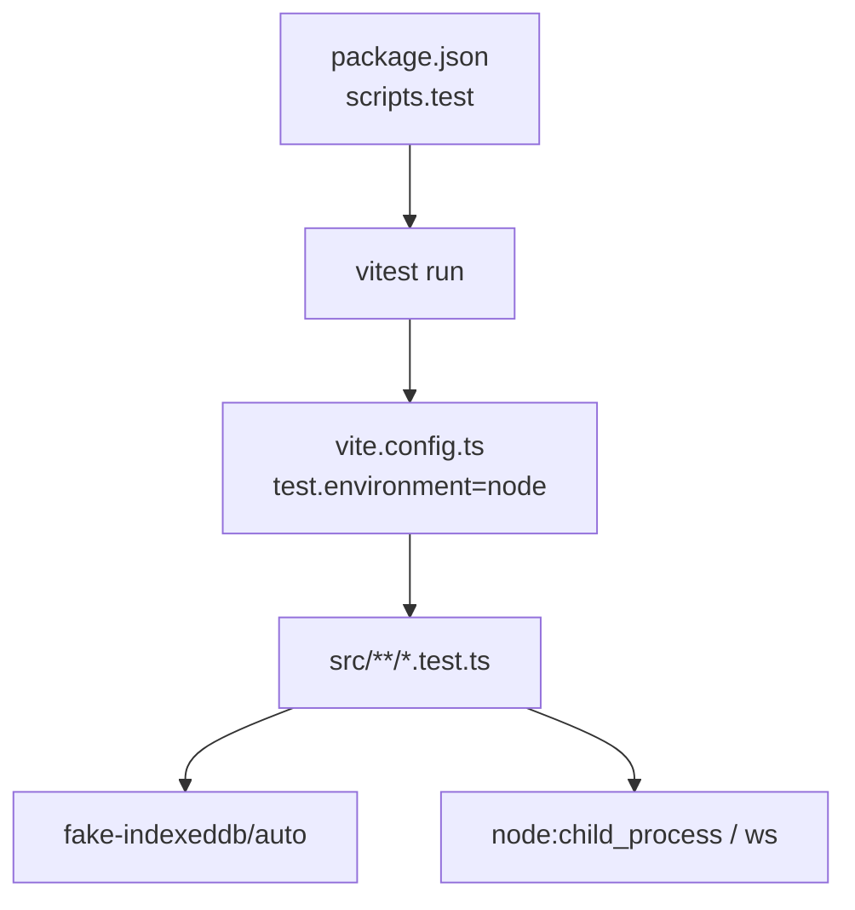
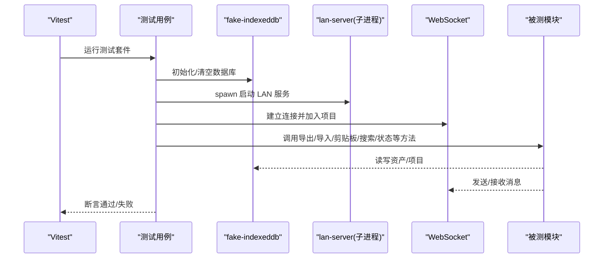
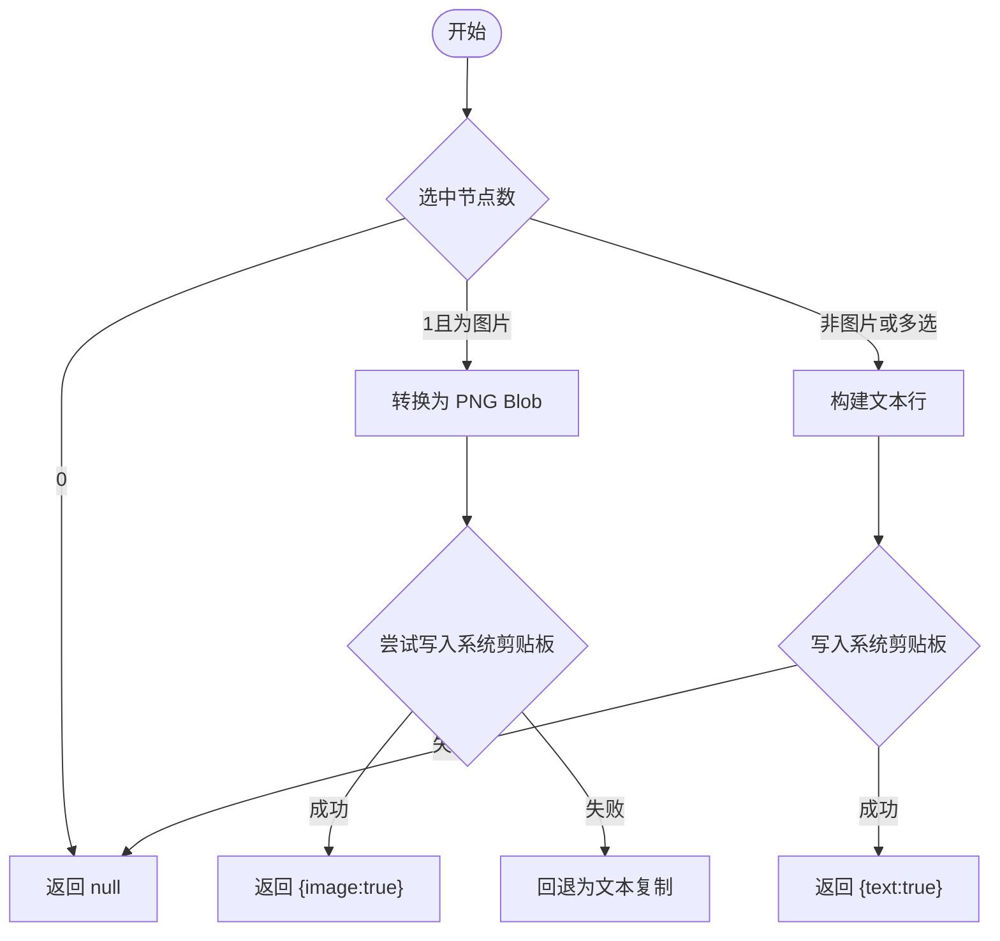
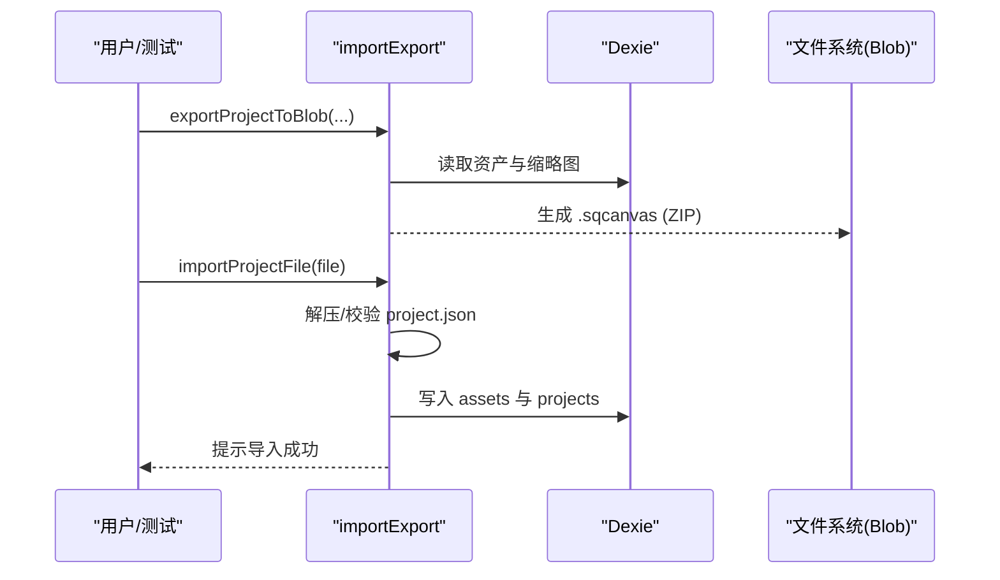
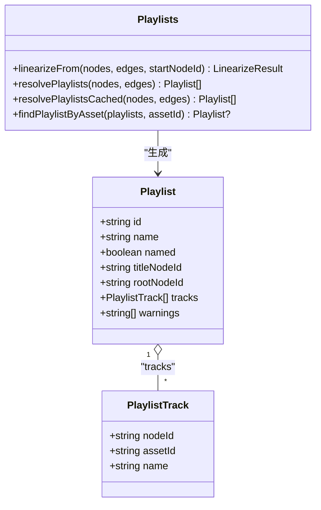
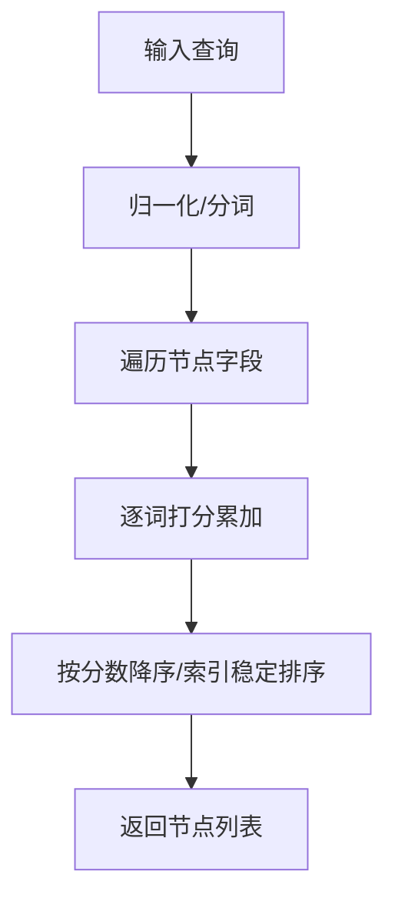
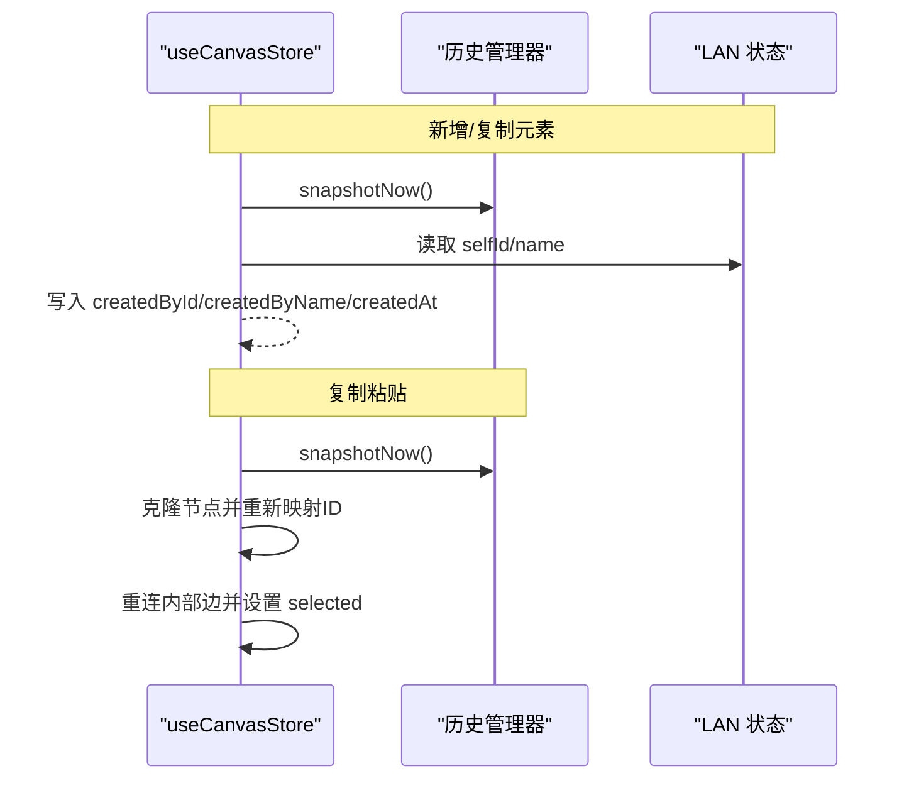
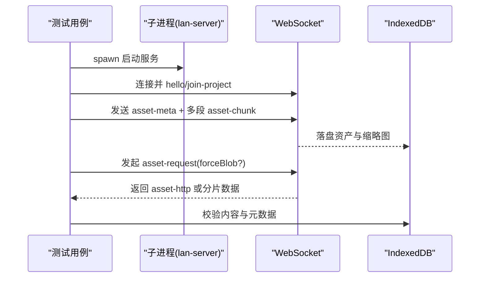
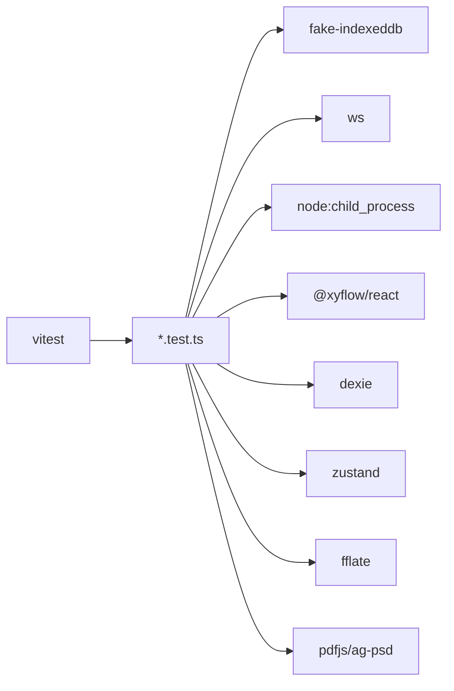

# 测试与调试

<cite>
**本文引用的文件**
- [package.json](file://package.json)
- [vite.config.ts](file://vite.config.ts)
- [clipboard.test.ts](file://src/canvas/clipboard.test.ts)
- [clipboard.ts](file://src/canvas/clipboard.ts)
- [importExport.test.ts](file://src/io/importExport.test.ts)
- [importExport.ts](file://src/io/importExport.ts)
- [coverColor.test.ts](file://src/media/coverColor.test.ts)
- [fileKind.test.ts](file://src/media/fileKind.test.ts)
- [playlists.test.ts](file://src/media/playlists.test.ts)
- [playlists.ts](file://src/media/playlists.ts)
- [fuzzySearch.test.ts](file://src/search/fuzzySearch.test.ts)
- [fuzzySearch.ts](file://src/search/fuzzySearch.ts)
- [canvasStore.test.ts](file://src/store/canvasStore.test.ts)
- [canvasStore.ts](file://src/store/canvasStore.ts)
- [lanClient.test.ts](file://src/sync/lanClient.test.ts)
</cite>

## 目录
1. [简介](#简介)
2. [项目结构](#项目结构)
3. [核心组件](#核心组件)
4. [架构总览](#架构总览)
5. [详细组件分析](#详细组件分析)
6. [依赖分析](#依赖分析)
7. [性能考虑](#性能考虑)
8. [故障排查指南](#故障排查指南)
9. [结论](#结论)
10. [附录](#附录)

## 简介
本指南面向 SuQCanvas 项目的测试与调试，系统梳理现有测试策略、框架选择与用例覆盖范围，并给出编写新测试的最佳实践与调试技巧。项目采用 Vitest + Node 环境运行单元测试，结合 fake-indexeddb 模拟 IndexedDB，并通过启动真实 LAN 服务器进行端到端网络协作测试。测试覆盖剪贴板操作、导入导出、媒体处理、搜索算法、网络客户端与状态管理等关键模块。

## 项目结构
- 测试框架与运行
  - 使用 Vitest 作为测试框架，运行环境为 Node（便于在 CI 中稳定执行）。
  - 通过 package.json 的 scripts 提供统一的测试入口命令。
  - vite.config.ts 中配置了 Vitest 的环境为 node，并包含开发代理配置。
- 测试组织方式
  - 按功能域划分：每个被测模块旁放置同名 .test.ts，便于定位与维护。
  - 针对需要持久化或网络能力的模块，使用 fake-indexeddb 与真实子进程服务组合测试。

图表来源
- [package.json:6-20](file://package.json#L6-L20)
- [vite.config.ts:16-19](file://vite.config.ts#L16-L19)

章节来源
- [package.json:6-20](file://package.json#L6-L20)
- [vite.config.ts:16-19](file://vite.config.ts#L16-L19)

## 核心组件
- 剪贴板
  - 单元测：验证从选中节点提取文本行、生成转义 HTML、图片节点判断等逻辑。
  - 实现：支持将单个图片/PSD 复制为 PNG 到系统剪贴板，否则回退为纯文本复制。
- 导入导出
  - 单元测：导出 ZIP 后再次导入，校验资产、图数据、视口还原；非法文件抛错；空项目不写入 assets。
  - 实现：基于 fflate 打包/解压，读写 Dexie 的 assets/projects，并在登录态下同步云端元数据。
- 媒体处理
  - 单元测：相对亮度与对比度计算、文件类型识别（PSD 优先于通用 image MIME）。
  - 实现：封面颜色计算、PSD 预览、播放列表解析与缓存。
- 搜索算法
  - 单元测：模糊匹配评分、多词检索、精确/前缀/宽松匹配排序。
  - 实现：对 label/text/kind/mime/createdByName 等多字段归一化后打分排序。
- 状态管理
  - 单元测：新增/复制元素记录插入者信息；复制粘贴保留选中态并重连边；层级调整与数值限制；删除资源联动清理节点与边。
  - 实现：Zustand store，含撤销历史、防抖快照、对齐与层级控制。
- 网络客户端（局域网协作）
  - 集成测：启动真实 lan-server，构造 WebSocket 连接，验证 base64 分片往返、LAN 地址解析、素材接收与续传、HTTP Range 流式拉流、封面同步、协作房间隔离、画布并集合并与显式删除、断线自动重连。

章节来源
- [clipboard.test.ts:1-40](file://src/canvas/clipboard.test.ts#L1-L40)
- [clipboard.ts:1-132](file://src/canvas/clipboard.ts#L1-L132)
- [importExport.test.ts:1-130](file://src/io/importExport.test.ts#L1-L130)
- [importExport.ts:1-203](file://src/io/importExport.ts#L1-L203)
- [coverColor.test.ts:1-44](file://src/media/coverColor.test.ts#L1-L44)
- [fileKind.test.ts:1-17](file://src/media/fileKind.test.ts#L1-L17)
- [playlists.test.ts:1-244](file://src/media/playlists.test.ts#L1-L244)
- [playlists.ts:1-179](file://src/media/playlists.ts#L1-L179)
- [fuzzySearch.test.ts:1-35](file://src/search/fuzzySearch.test.ts#L1-L35)
- [fuzzySearch.ts:1-67](file://src/search/fuzzySearch.ts#L1-L67)
- [canvasStore.test.ts:1-148](file://src/store/canvasStore.test.ts#L1-L148)
- [canvasStore.ts:1-399](file://src/store/canvasStore.ts#L1-L399)
- [lanClient.test.ts:1-593](file://src/sync/lanClient.test.ts#L1-L593)

## 架构总览
下图展示了测试驱动的关键流程：Vitest 在 Node 环境中加载测试，按需初始化 fake-indexeddb 与真实 LAN 子进程，调用被测模块完成数据与网络交互，最终通过断言验证结果。

图表来源
- [lanClient.test.ts:72-99](file://src/sync/lanClient.test.ts#L72-L99)
- [importExport.test.ts:56-67](file://src/io/importExport.test.ts#L56-L67)
- [vite.config.ts:16-19](file://vite.config.ts#L16-L19)

## 详细组件分析

### 剪贴板模块测试
- 覆盖范围
  - 文本类节点仅取 text，素材类节点取 label，忽略空内容。
  - 生成转义后的 HTML 片段。
  - 仅 image 与 psd 视为图片节点。
- 关键点
  - 单张图片/PSD 优先复制为 PNG，失败时回退为文本复制。
  - 借助浏览器 Clipboard API 与降级方案兼容旧环境。

图表来源
- [clipboard.ts:114-132](file://src/canvas/clipboard.ts#L114-L132)
- [clipboard.test.ts:15-39](file://src/canvas/clipboard.test.ts#L15-L39)

章节来源
- [clipboard.test.ts:15-39](file://src/canvas/clipboard.test.ts#L15-L39)
- [clipboard.ts:8-44](file://src/canvas/clipboard.ts#L8-L44)

### 导入导出模块测试
- 覆盖范围
  - 导出 ZIP 后再导入，图数据与媒体资产完整还原。
  - 导入非项目文件抛出错误。
  - 无资产引用时导出不包含 assets 目录。
- 关键点
  - 导出包含 project.json 与 assets 下的二进制与缩略图。
  - 导入时校验格式与版本，落库资产与项目，并在登录态下同步云端。

图表来源
- [importExport.ts:35-78](file://src/io/importExport.ts#L35-L78)
- [importExport.ts:111-203](file://src/io/importExport.ts#L111-L203)
- [importExport.test.ts:69-128](file://src/io/importExport.test.ts#L69-L128)

章节来源
- [importExport.test.ts:69-128](file://src/io/importExport.test.ts#L69-L128)
- [importExport.ts:35-78](file://src/io/importExport.ts#L35-L78)
- [importExport.ts:111-203](file://src/io/importExport.ts#L111-L203)

### 媒体处理模块测试
- 覆盖范围
  - 相对亮度与对比度计算符合 WCAG 数学边界。
  - 文件类型识别优先 PSD，常规图片保持 image 类型。
  - 播放列表线性化、命名歌单解析、缓存命中与查找。
- 关键点
  - linearizeFrom 使用 DFS 先序遍历音频节点，按边 order 排序，去重与环检测。
  - resolvePlaylists 扫描画布，过滤注释文本与多出边文本，生成命名歌单。
  - 缓存策略基于引用相等性避免重复解析。

图表来源
- [playlists.ts:19-44](file://src/media/playlists.ts#L19-L44)
- [playlists.ts:71-112](file://src/media/playlists.ts#L71-L112)
- [playlists.ts:114-179](file://src/media/playlists.ts#L114-L179)
- [playlists.test.ts:39-244](file://src/media/playlists.test.ts#L39-L244)

章节来源
- [coverColor.test.ts:1-44](file://src/media/coverColor.test.ts#L1-L44)
- [fileKind.test.ts:1-17](file://src/media/fileKind.test.ts#L1-L17)
- [playlists.test.ts:39-244](file://src/media/playlists.test.ts#L39-L244)
- [playlists.ts:71-112](file://src/media/playlists.ts#L71-L112)
- [playlists.ts:114-179](file://src/media/playlists.ts#L114-L179)

### 搜索算法模块测试
- 覆盖范围
  - 模糊匹配支持非连续字符匹配。
  - 精确匹配与前缀匹配优先于宽松匹配。
  - 多词检索跨多个元数据字段。
- 关键点
  - 对多字段进行归一化与评分，按分数降序与原始顺序稳定排序。

图表来源
- [fuzzySearch.ts:3-67](file://src/search/fuzzySearch.ts#L3-L67)
- [fuzzySearch.test.ts:14-33](file://src/search/fuzzySearch.test.ts#L14-L33)

章节来源
- [fuzzySearch.test.ts:14-33](file://src/search/fuzzySearch.test.ts#L14-L33)
- [fuzzySearch.ts:3-67](file://src/search/fuzzySearch.ts#L3-L67)

### 状态管理模块测试
- 覆盖范围
  - 新增/复制元素记录当前插入者信息与时间戳。
  - 复制粘贴保留选中态，重连被选元素之间的连线。
  - 层级操作支持置顶/上移/下移/置底，以及手动设置层级数值并限制范围。
  - 删除资源关联的所有节点和连线。
- 关键点
  - 使用防抖快照与立即快照保证撤销历史正确性。
  - 复制粘贴时对边进行 ID 映射重建。

图表来源
- [canvasStore.ts:109-116](file://src/store/canvasStore.ts#L109-L116)
- [canvasStore.ts:159-246](file://src/store/canvasStore.ts#L159-L246)
- [canvasStore.test.ts:21-148](file://src/store/canvasStore.test.ts#L21-L148)

章节来源
- [canvasStore.test.ts:21-148](file://src/store/canvasStore.test.ts#L21-L148)
- [canvasStore.ts:109-116](file://src/store/canvasStore.ts#L109-L116)
- [canvasStore.ts:159-246](file://src/store/canvasStore.ts#L159-L246)

### 网络客户端（局域网协作）测试
- 覆盖范围
  - base64 分片往返（含尾部不满分片）。
  - LAN 地址解析（HTTP/HTTPS 同源 WSS、协议省略保护）。
  - 素材接收与续传、请求-响应链路获取素材。
  - HTTP Range 流式拉流与 CORS 头。
  - 封面随资产同步与补推自愈。
  - 协作房间隔离、画布并集合并与显式删除。
  - 断线自动重连。
- 关键点
  - 通过 spawn 启动真实 lan-server，使用 ws 库建立 WebSocket。
  - 自定义 waitFor 等待异步事件完成。
  - 区分默认请求与 forceBlob 请求行为。

图表来源
- [lanClient.test.ts:72-99](file://src/sync/lanClient.test.ts#L72-L99)
- [lanClient.test.ts:115-130](file://src/sync/lanClient.test.ts#L115-L130)
- [lanClient.test.ts:153-221](file://src/sync/lanClient.test.ts#L153-L221)
- [lanClient.test.ts:223-326](file://src/sync/lanClient.test.ts#L223-L326)
- [lanClient.test.ts:328-438](file://src/sync/lanClient.test.ts#L328-L438)
- [lanClient.test.ts:440-593](file://src/sync/lanClient.test.ts#L440-L593)

章节来源
- [lanClient.test.ts:115-130](file://src/sync/lanClient.test.ts#L115-L130)
- [lanClient.test.ts:153-221](file://src/sync/lanClient.test.ts#L153-L221)
- [lanClient.test.ts:223-326](file://src/sync/lanClient.test.ts#L223-L326)
- [lanClient.test.ts:328-438](file://src/sync/lanClient.test.ts#L328-L438)
- [lanClient.test.ts:440-593](file://src/sync/lanClient.test.ts#L440-L593)

## 依赖分析
- 测试框架与工具
  - vitest：统一测试运行器与断言。
  - fake-indexeddb：在 Node 中模拟 IndexedDB，使导入导出与协作测试可离线运行。
  - ws：Node 环境下 WebSocket 客户端，用于与 lan-server 通信。
  - node:child_process：启动真实 LAN 服务器，确保网络层行为接近生产。
- 被测模块依赖
  - @xyflow/react：画布节点/边变更与视图。
  - dexie：本地持久化。
  - fflate：ZIP 压缩/解压。
  - zustand：状态管理。
  - pdfjs-dist、ag-psd：媒体处理。

图表来源
- [package.json:22-49](file://package.json#L22-L49)
- [vite.config.ts:16-19](file://vite.config.ts#L16-L19)

章节来源
- [package.json:22-49](file://package.json#L22-L49)
- [vite.config.ts:16-19](file://vite.config.ts#L16-L19)

## 性能考虑
- 播放列表解析缓存
  - 使用引用相等性缓存 resolvePlaylists 结果，避免多次全图解析。
- 历史快照防抖
  - 通过延迟提交快照减少频繁操作的撤销栈膨胀，提升交互流畅度。
- 大文件传输优化
  - LAN 视频默认走 HTTP Range 流式拉流，仅在 forceBlob 时整份下发分片，降低内存占用与带宽压力。
- 图片转换限制
  - 剪贴板复制时将图片缩放至最大边 4096，避免超大 Canvas 导致性能问题。

章节来源
- [playlists.ts:166-179](file://src/media/playlists.ts#L166-L179)
- [canvasStore.ts:61-92](file://src/store/canvasStore.ts#L61-L92)
- [lanClient.test.ts:223-326](file://src/sync/lanClient.test.ts#L223-L326)
- [clipboard.ts:46-70](file://src/canvas/clipboard.ts#L46-L70)

## 故障排查指南
- 常见问题定位
  - 导入导出失败：检查 ZIP 结构与 project.json 是否存在、版本是否受支持。
  - 剪贴板复制失败：确认浏览器权限与 ClipboardItem 可用性，必要时回退文本复制。
  - 播放列表异常：检查命名文本入边/出边约束、音频节点有效性、边 order 设置。
  - 搜索无结果：确认查询词已归一化，目标字段存在且非空。
  - LAN 协作异常：检查 WebSocket 连接状态、房间隔离、续传分片序号与总量一致性。
- 调试技巧
  - 浏览器开发者工具：Network 面板查看 HTTP Range 请求与 CORS 头；Console 捕获错误堆栈。
  - React DevTools：检查 Zustand store 状态变化与组件渲染。
  - 日志输出：在关键路径添加 console.log 或使用 toast 提示观察导入导出与协作流程。
  - 断点调试：在 vitest 中启用 --inspect 或 IDE 断点，逐步跟踪异步流程。
- 性能分析与内存泄漏检测
  - 使用浏览器 Performance 面板录制交互过程，关注长任务与内存增长。
  - 使用 Memory 面板拍摄堆快照，比较前后差异定位潜在泄漏。
  - 在 Node 测试中使用 why-is-node-running（由 vitest 生态引入）排查未释放定时器/连接。

章节来源
- [importExport.ts:111-131](file://src/io/importExport.ts#L111-L131)
- [clipboard.ts:90-107](file://src/canvas/clipboard.ts#L90-L107)
- [playlists.ts:114-153](file://src/media/playlists.ts#L114-L153)
- [fuzzySearch.ts:3-67](file://src/search/fuzzySearch.ts#L3-L67)
- [lanClient.test.ts:54-70](file://src/sync/lanClient.test.ts#L54-L70)

## 结论
本项目以 Vitest 为核心，结合 fake-indexeddb 与真实 LAN 子进程，构建了覆盖剪贴板、导入导出、媒体处理、搜索、状态管理与网络协作的完整测试体系。通过清晰的模块化测试组织、严谨的断言与完善的调试手段，能够有效保障功能正确性与稳定性。建议在新功能开发中遵循“就近测试”原则，持续补充边界场景与异常路径用例，并结合性能分析工具持续优化。

## 附录
- 运行测试
  - 使用 npm test 执行全部单元测试。
  - 如需单独运行某模块测试，可使用 npx vitest run src/xxx/xxx.test.ts。
- 扩展测试
  - 新增 .test.ts 文件置于对应模块旁，复用 fake-indexeddb 与测试辅助函数。
  - 对于网络相关用例，参考 lanClient.test.ts 的模式启动子进程与服务。
- 最佳实践
  - 测试数据准备：使用工厂函数构造最小可用节点/边，减少样板代码。
  - Mock 策略：优先使用 fake-indexeddb 与真实子进程，避免过度 Mock 导致与生产不一致。
  - 异步测试：使用 await 与 waitFor 模式，确保事件完成后再断言。
  - 可维护性：测试描述应明确业务意图，断言聚焦关键不变量。