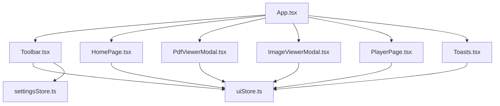
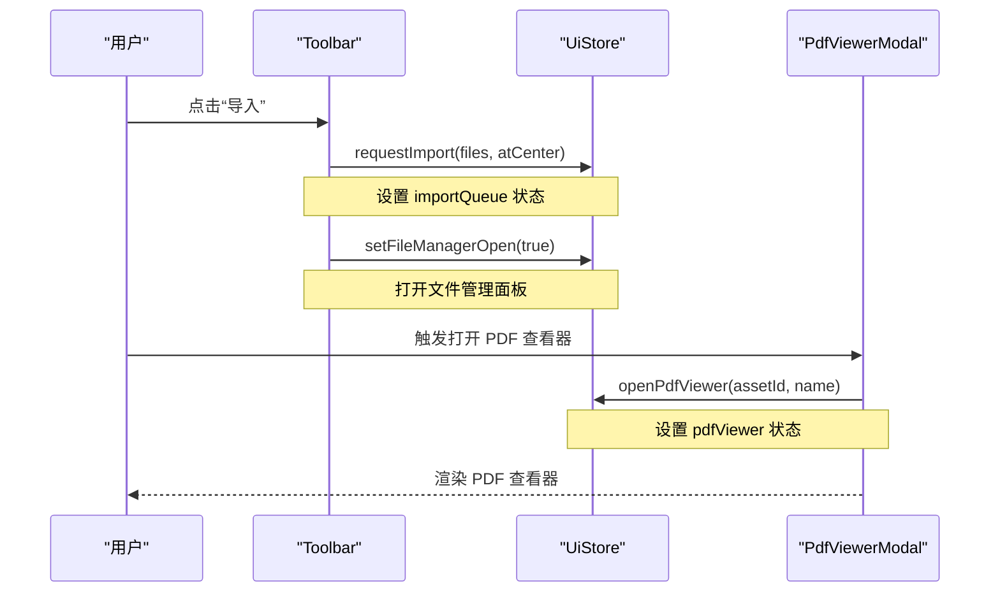
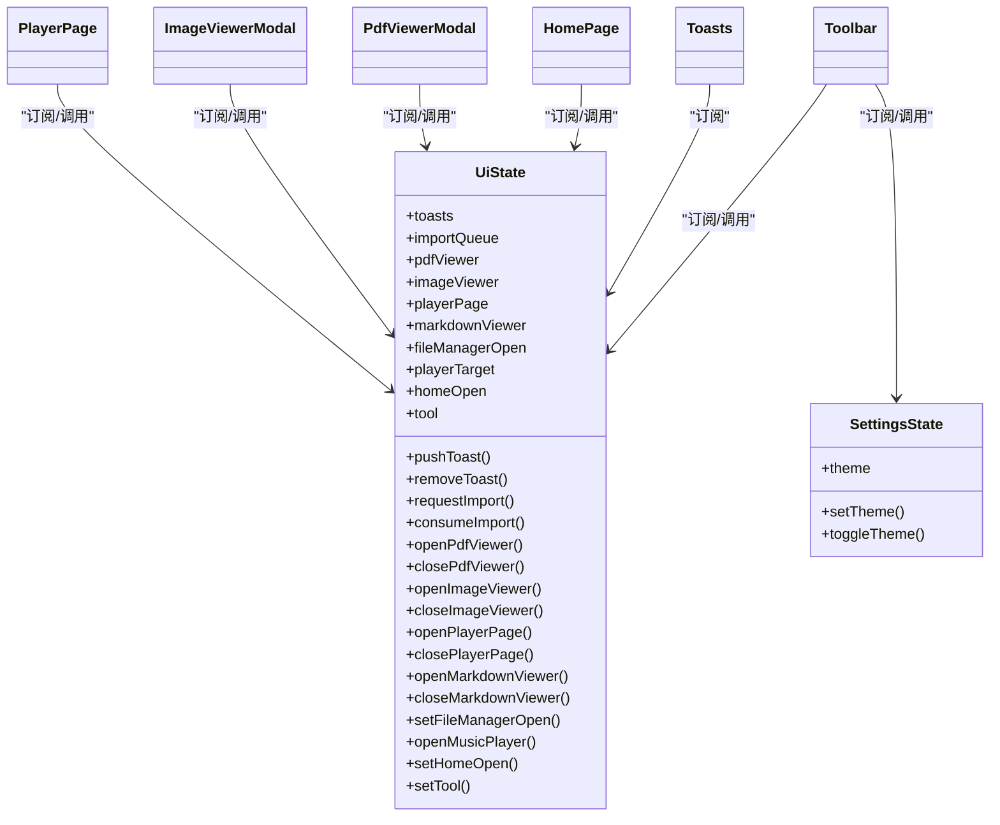

# UI 状态管理 (UiStore)

<cite>
**本文引用的文件**
- [src/store/uiStore.ts](file://src/store/uiStore.ts)
- [src/components/Toolbar.tsx](file://src/components/Toolbar.tsx)
- [src/components/Toasts.tsx](file://src/components/Toasts.tsx)
- [src/components/HomePage.tsx](file://src/components/HomePage.tsx)
- [src/components/PdfViewerModal.tsx](file://src/components/PdfViewerModal.tsx)
- [src/components/ImageViewerModal.tsx](file://src/components/ImageViewerModal.tsx)
- [src/components/PlayerPage.tsx](file://src/components/PlayerPage.tsx)
- [src/App.tsx](file://src/App.tsx)
- [src/store/settingsStore.ts](file://src/store/settingsStore.ts)
</cite>

## 目录
1. [简介](#简介)
2. [项目结构](#项目结构)
3. [核心组件](#核心组件)
4. [架构总览](#架构总览)
5. [详细组件分析](#详细组件分析)
6. [依赖关系分析](#依赖关系分析)
7. [性能考量](#性能考量)
8. [故障排查指南](#故障排查指南)
9. [结论](#结论)
10. [附录：UI 状态操作示例](#附录ui-状态操作示例)

## 简介
本文件系统性梳理并文档化应用中的 UI 状态管理，聚焦于 UiStore 负责的用户界面状态，包括模态框显示隐藏、面板开关、工具栏状态、主题设置与响应式适配等。同时说明 UI 状态与业务逻辑的解耦设计、状态持久化策略，并提供可操作的 UI 状态切换示例，帮助开发者正确管理界面组件的状态与用户交互反馈。

## 项目结构
- 状态层：使用 Zustand 集中管理 UI 状态（uiStore）与应用设置（settingsStore）。
- 视图层：各组件通过订阅 store 的切片状态进行渲染与交互，如 Toolbar、Toasts、HomePage、PdfViewerModal、ImageViewerModal、PlayerPage。
- 入口层：App 组合页面与全局组件，并在初始化时触发必要的 UI 状态变更。

图表来源
- [src/App.tsx:19-73](file://src/App.tsx#L19-L73)
- [src/components/Toolbar.tsx:97-403](file://src/components/Toolbar.tsx#L97-L403)
- [src/components/HomePage.tsx:415-800](file://src/components/HomePage.tsx#L415-L800)
- [src/components/PdfViewerModal.tsx:7-146](file://src/components/PdfViewerModal.tsx#L7-L146)
- [src/components/ImageViewerModal.tsx:14-165](file://src/components/ImageViewerModal.tsx#L14-L165)
- [src/components/PlayerPage.tsx:14-101](file://src/components/PlayerPage.tsx#L14-L101)
- [src/components/Toasts.tsx:3-24](file://src/components/Toasts.tsx#L3-L24)
- [src/store/uiStore.ts:18-116](file://src/store/uiStore.ts#L18-L116)
- [src/store/settingsStore.ts:7-39](file://src/store/settingsStore.ts#L7-L39)

章节来源
- [src/App.tsx:19-73](file://src/App.tsx#L19-L73)
- [src/store/uiStore.ts:18-116](file://src/store/uiStore.ts#L18-L116)
- [src/store/settingsStore.ts:7-39](file://src/store/settingsStore.ts#L7-L39)

## 核心组件
- UiStore（uiStore.ts）：集中管理所有 UI 相关状态，包括通知消息、导入队列、PDF/图片/Markdown 查看器、播放器页、文件管理器、首页面板、工具模式等。提供增删改查方法，并通过 toast 便捷函数对外暴露。
- SettingsStore（settingsStore.ts）：管理主题（深色/浅色），支持 URL 参数与 localStorage 持久化，并在根元素上切换 class。
- 视图组件：
  - Toolbar：工具栏，控制工具模式、导入、导出、撤销重做、缩放、主题切换、打开文件管理等。
  - Toasts：展示来自 UiStore 的通知消息，支持自动消失与手动关闭。
  - HomePage：首页面板，受 homeOpen 控制显示/隐藏，用于新建/打开/删除/导入项目。
  - PdfViewerModal / ImageViewerModal / MarkdownViewerModal：基于 UiStore 的 viewer 状态控制打开/关闭与内容加载。
  - PlayerPage：专用播放器页，根据 playerPage 状态决定音频或视频播放界面。

章节来源
- [src/store/uiStore.ts:18-116](file://src/store/uiStore.ts#L18-L116)
- [src/store/settingsStore.ts:7-39](file://src/store/settingsStore.ts#L7-L39)
- [src/components/Toolbar.tsx:97-403](file://src/components/Toolbar.tsx#L97-L403)
- [src/components/Toasts.tsx:3-24](file://src/components/Toasts.tsx#L3-L24)
- [src/components/HomePage.tsx:415-800](file://src/components/HomePage.tsx#L415-L800)
- [src/components/PdfViewerModal.tsx:7-146](file://src/components/PdfViewerModal.tsx#L7-L146)
- [src/components/ImageViewerModal.tsx:14-165](file://src/components/ImageViewerModal.tsx#L14-L165)
- [src/components/PlayerPage.tsx:14-101](file://src/components/PlayerPage.tsx#L14-L101)

## 架构总览
UiStore 作为 UI 状态的单一事实源，被多个组件订阅。组件通过调用 store 提供的 setter 方法改变状态，Zustand 自动将变更推送到订阅者，实现“单向数据流 + 细粒度更新”。主题由独立的 SettingsStore 管理，并与 UI 类名绑定，实现跨组件的主题一致性。

图表来源
- [src/components/Toolbar.tsx:194-214](file://src/components/Toolbar.tsx#L194-L214)
- [src/store/uiStore.ts:59-75](file://src/store/uiStore.ts#L59-L75)
- [src/components/PdfViewerModal.tsx:7-146](file://src/components/PdfViewerModal.tsx#L7-L146)

章节来源
- [src/store/uiStore.ts:18-116](file://src/store/uiStore.ts#L18-L116)
- [src/components/Toolbar.tsx:97-403](file://src/components/Toolbar.tsx#L97-L403)
- [src/components/PdfViewerModal.tsx:7-146](file://src/components/PdfViewerModal.tsx#L7-L146)

## 详细组件分析

### UiStore 状态模型与方法
- 通知消息 toasts：数组形式，包含 id、message、kind；pushToast 自动添加并定时移除；removeToast 按 id 移除。
- 导入队列 importQueue：记录待导入的文件及是否居中；requestImport 入队；consumeImport 消费并清空。
- 查看器状态：
  - pdfViewer：打开 PDF 查看器所需信息；openPdfViewer/closePdfViewer 控制显隐。
  - imageViewer：打开图片查看器所需信息（含缩略图标记）；openImageViewer/closeImageViewer 控制显隐。
  - markdownViewer：打开 Markdown 查看器所需信息；openMarkdownViewer/closeMarkdownViewer 控制显隐。
- 播放器页 playerPage：区分 audio/video，携带必要上下文；openPlayerPage/closePlayerPage 控制显隐。
- 文件管理器 fileManagerOpen：布尔开关；setFileManagerOpen 控制显隐。
- 音乐播放器目标 playerTarget：用于在文件管理器中定位当前播放目标；openMusicPlayer 同时打开文件管理器。
- 首页面板 homeOpen：布尔开关；setHomeOpen 控制显隐。
- 工具模式 tool：select/connect/drag；setTool 切换。

复杂度与性能
- 通知消息为轻量数组，pushToast 采用不可变更新，避免大对象拷贝。
- 查看器状态为单例对象，切换成本低。
- 导入队列使用一次性消费模式，避免重复处理。

错误处理
- pushToast 内部使用 setTimeout 自动清理，避免内存泄漏。
- consumeImport 返回 null 表示无待处理项，调用方需判空。

章节来源
- [src/store/uiStore.ts:18-116](file://src/store/uiStore.ts#L18-L116)

### 主题设置与持久化（SettingsStore）
- 主题类型 Theme：'dark' | 'light'。
- 初始值来源：URL 参数 theme > localStorage suqcanvas:theme > 默认 dark。
- applyTheme：在 documentElement 上切换 light 类名，驱动 CSS 变量与样式。
- 持久化：setTheme 写入 localStorage；toggleTheme 在两者间切换。

响应式适配
- 通过类名切换实现全局主题，无需逐组件维护状态。
- 结合 Tailwind 的语义化颜色与布局，确保明暗主题下的一致体验。

章节来源
- [src/store/settingsStore.ts:7-39](file://src/store/settingsStore.ts#L7-L39)

### 工具栏状态与交互（Toolbar）
- 工具模式：select/connect/drag，通过 setTool 切换，影响画布交互行为。
- 导入/导出：requestImport 将文件加入队列；exportCurrentProject 导出项目。
- 撤销/重做：读取 canvasStore 历史栈，调用 undo/redo。
- 对齐与分布：当选中节点数≥2 时启用对齐按钮，调用 alignSelected。
- 缩放与视图：dispatchView('zoom-in'|'zoom-out'|'reset'|'fit') 通过自定义事件通知画布。
- 主题切换：toggleTheme 切换主题并持久化。
- 文件管理：setFileManagerOpen 控制文件管理器面板。

章节来源
- [src/components/Toolbar.tsx:97-403](file://src/components/Toolbar.tsx#L97-L403)

### 通知系统（Toasts）
- 数据来源：UiStore.toasts。
- 展示位置：固定底部居中，z-index 较高，避免遮挡。
- 交互：点击任意通知可立即移除；pushToast 自动在 3.2 秒后移除。

章节来源
- [src/components/Toasts.tsx:3-24](file://src/components/Toasts.tsx#L3-L24)
- [src/store/uiStore.ts:49-58](file://src/store/uiStore.ts#L49-L58)

### 首页面板（HomePage）
- 显示控制：homeOpen 控制显隐；App 在认证通过后设置 homeOpen=true。
- 功能：新建项目、打开项目、删除项目、导入 .sqcanvas、恢复已删除项目、导出项目、切换主题。
- 与状态解耦：仅通过 useUiStore/useProjectStore/useSettingsStore 等方法读写状态，不直接操作 DOM。

章节来源
- [src/components/HomePage.tsx:415-800](file://src/components/HomePage.tsx#L415-L800)
- [src/App.tsx:25-38](file://src/App.tsx#L25-L38)

### 查看器模态框（PdfViewerModal / ImageViewerModal）
- PdfViewerModal：
  - 打开：openPdfViewer 设置 pdfViewer；关闭：closePdfViewer 清空。
  - 资源加载：useAssetUrl 获取资源地址；动态导入 pdf 模块加载与渲染。
  - 键盘导航：Esc 关闭，左右箭头翻页。
- ImageViewerModal：
  - 打开：openImageViewer 设置 imageViewer；关闭：closeImageViewer 清空。
  - 缩放：支持键盘 +/-、滚轮缩放，以及“适应窗口”计算 fitZoom。
  - 下载：生成 Blob URL 并触发下载；PSD 预览支持下载原始 PSD。

章节来源
- [src/components/PdfViewerModal.tsx:7-146](file://src/components/PdfViewerModal.tsx#L7-L146)
- [src/components/ImageViewerModal.tsx:14-165](file://src/components/ImageViewerModal.tsx#L14-L165)
- [src/store/uiStore.ts:69-82](file://src/store/uiStore.ts#L69-L82)

### 专用播放器页（PlayerPage）
- 打开：openPlayerPage 传入 { kind: 'audio'|'video', assetId, ... }；关闭：closePlayerPage 清空。
- 音频页：复用沉浸式 AudioPlayerView，支持封面背景、唱片动画、频谱、歌词、播放列表。
- 视频页：复用沉浸式 VideoPlayerView，支持氛围背景、居中视频、自定义控制栏、视频列表。
- 数据准备：从 CanvasStore.nodes 收集资产 ID，批量查询 db.assets 构建文件集合。

章节来源
- [src/components/PlayerPage.tsx:14-101](file://src/components/PlayerPage.tsx#L14-L101)
- [src/store/uiStore.ts:31-36](file://src/store/uiStore.ts#L31-L36)

## 依赖关系分析
- 组件对 store 的依赖是单向的：组件只读状态并调用 setter 方法，store 不反向依赖组件。
- 主题设置独立于 UiStore，避免耦合；但 UI 组件通过 useSettingsStore 订阅主题变化。
- 入口 App 负责初始化流程：认证完成后设置 homeOpen=true 并启动项目初始化。

图表来源
- [src/store/uiStore.ts:18-116](file://src/store/uiStore.ts#L18-L116)
- [src/store/settingsStore.ts:7-39](file://src/store/settingsStore.ts#L7-L39)
- [src/components/Toolbar.tsx:97-403](file://src/components/Toolbar.tsx#L97-L403)
- [src/components/Toasts.tsx:3-24](file://src/components/Toasts.tsx#L3-L24)
- [src/components/HomePage.tsx:415-800](file://src/components/HomePage.tsx#L415-L800)
- [src/components/PdfViewerModal.tsx:7-146](file://src/components/PdfViewerModal.tsx#L7-L146)
- [src/components/ImageViewerModal.tsx:14-165](file://src/components/ImageViewerModal.tsx#L14-L165)
- [src/components/PlayerPage.tsx:14-101](file://src/components/PlayerPage.tsx#L14-L101)

章节来源
- [src/store/uiStore.ts:18-116](file://src/store/uiStore.ts#L18-L116)
- [src/store/settingsStore.ts:7-39](file://src/store/settingsStore.ts#L7-L39)

## 性能考量
- 最小化重渲染：组件通过选择器订阅具体字段（如 s.tool、s.homeOpen），避免整棵状态树变更导致的无关组件重渲染。
- 延迟清理：通知消息使用 setTimeout 自动移除，避免长时间持有引用导致内存占用。
- 懒加载：PDF 查看器动态导入 pdf 模块，减少首屏体积。
- 批量数据：播放器页批量查询 db.assets，减少多次 IO。

[本节为通用指导，不直接分析具体文件]

## 故障排查指南
- 通知未显示：检查 pushToast 是否被调用；确认 toasts 数组非空；检查 Toasts 组件是否挂载。
- 查看器无法关闭：确认 close* 方法是否正确调用；检查键盘事件监听是否冲突。
- 主题未生效：确认 applyTheme 是否在初始化时执行；检查 documentElement 的 class 是否切换成功；确认 CSS 变量与样式覆盖正确。
- 导入失败：检查 requestImport 是否接收有效文件；确认 consumeImport 是否被消费；查看 toast 错误提示。

章节来源
- [src/store/uiStore.ts:49-58](file://src/store/uiStore.ts#L49-L58)
- [src/components/PdfViewerModal.tsx:86-94](file://src/components/PdfViewerModal.tsx#L86-L94)
- [src/store/settingsStore.ts:13-27](file://src/store/settingsStore.ts#L13-L27)

## 结论
UiStore 以集中式、不可变的方式管理 UI 状态，配合 Zustand 的细粒度订阅机制，实现了 UI 状态与业务逻辑的良好解耦。主题设置通过独立的 SettingsStore 管理并持久化到 localStorage，保证跨会话一致。各组件仅关注自身需要的状态片段，降低耦合度与维护成本。通过规范的 setter 方法与清晰的职责划分，开发者可以高效地扩展新的 UI 状态与交互。

[本节为总结性内容，不直接分析具体文件]

## 附录：UI 状态操作示例
以下示例展示如何正确使用 UiStore 管理界面组件状态与用户交互反馈。为避免泄露实现细节，仅提供路径引用。

- 打开/关闭 PDF 查看器
  - 打开：调用 openPdfViewer(assetId, name)，随后 PdfViewerModal 自动渲染。
  - 关闭：调用 closePdfViewer()，清除 pdfViewer 状态。
  - 参考路径：[src/store/uiStore.ts:69-75](file://src/store/uiStore.ts#L69-L75)、[src/components/PdfViewerModal.tsx:7-146](file://src/components/PdfViewerModal.tsx#L7-L146)

- 打开/关闭图片查看器
  - 打开：调用 openImageViewer(assetId, name, thumbnail?)，ImageViewerModal 根据 thumbnail 决定是否使用预览图。
  - 关闭：调用 closeImageViewer()。
  - 参考路径：[src/store/uiStore.ts:76-82](file://src/store/uiStore.ts#L76-L82)、[src/components/ImageViewerModal.tsx:14-165](file://src/components/ImageViewerModal.tsx#L14-L165)

- 打开/关闭专用播放器页
  - 打开：调用 openPlayerPage({ kind: 'audio'|'video', assetId, ... })，PlayerPage 根据 kind 渲染对应播放器。
  - 关闭：调用 closePlayerPage()。
  - 参考路径：[src/store/uiStore.ts:83-89](file://src/store/uiStore.ts#L83-L89)、[src/components/PlayerPage.tsx:14-101](file://src/components/PlayerPage.tsx#L14-L101)

- 打开/关闭文件管理器
  - 打开：调用 setFileManagerOpen(true)。
  - 关闭：调用 setFileManagerOpen(false)。
  - 参考路径：[src/store/uiStore.ts:97-100](file://src/store/uiStore.ts#L97-L100)、[src/components/Toolbar.tsx:206-214](file://src/components/Toolbar.tsx#L206-L214)

- 打开/关闭首页面板
  - 打开：调用 setHomeOpen(true)。
  - 关闭：调用 setHomeOpen(false)。
  - 参考路径：[src/store/uiStore.ts:108-111](file://src/store/uiStore.ts#L108-L111)、[src/components/HomePage.tsx:415-448](file://src/components/HomePage.tsx#L415-L448)

- 切换工具模式
  - 调用 setTool('select'|'connect'|'drag')，Toolbar 高亮当前工具。
  - 参考路径：[src/store/uiStore.ts:112-115](file://src/store/uiStore.ts#L112-L115)、[src/components/Toolbar.tsx:287-304](file://src/components/Toolbar.tsx#L287-L304)

- 发送通知消息
  - 调用 pushToast(message, kind) 或快捷函数 toast(message, kind)。
  - 参考路径：[src/store/uiStore.ts:49-58](file://src/store/uiStore.ts#L49-L58)、[src/store/uiStore.ts:118-121](file://src/store/uiStore.ts#L118-L121)

- 主题切换与持久化
  - 调用 toggleTheme() 或 setTheme(theme)，自动写入 localStorage 并切换类名。
  - 参考路径：[src/store/settingsStore.ts:29-39](file://src/store/settingsStore.ts#L29-L39)、[src/components/Toolbar.tsx:373-380](file://src/components/Toolbar.tsx#L373-L380)

章节来源
- [src/store/uiStore.ts:49-121](file://src/store/uiStore.ts#L49-L121)
- [src/components/Toolbar.tsx:287-380](file://src/components/Toolbar.tsx#L287-L380)
- [src/components/HomePage.tsx:415-448](file://src/components/HomePage.tsx#L415-L448)
- [src/components/PdfViewerModal.tsx:7-146](file://src/components/PdfViewerModal.tsx#L7-L146)
- [src/components/ImageViewerModal.tsx:14-165](file://src/components/ImageViewerModal.tsx#L14-L165)
- [src/components/PlayerPage.tsx:14-101](file://src/components/PlayerPage.tsx#L14-L101)
- [src/store/settingsStore.ts:29-39](file://src/store/settingsStore.ts#L29-L39)