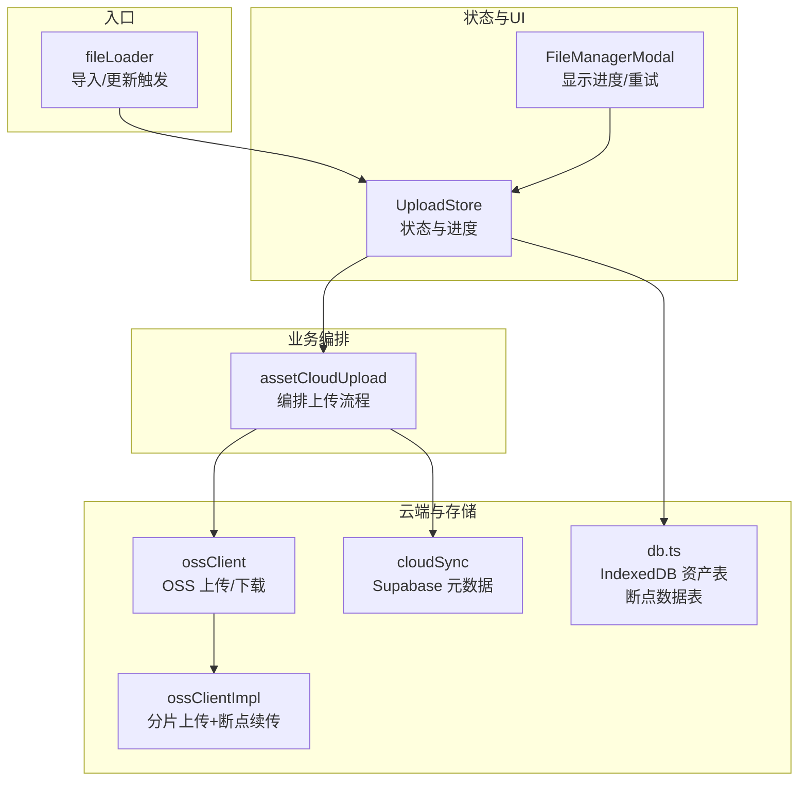
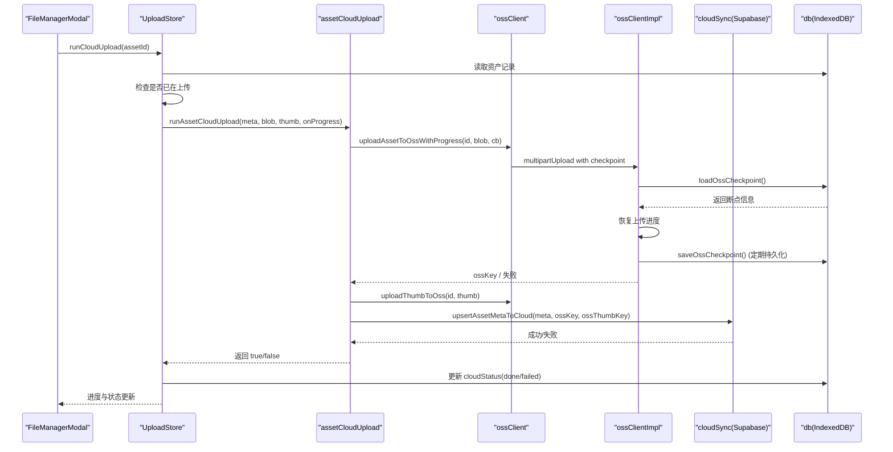
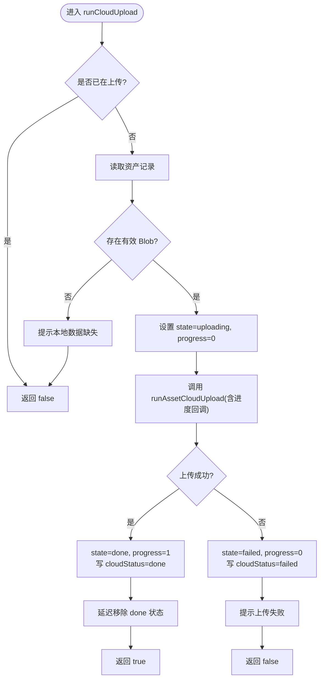
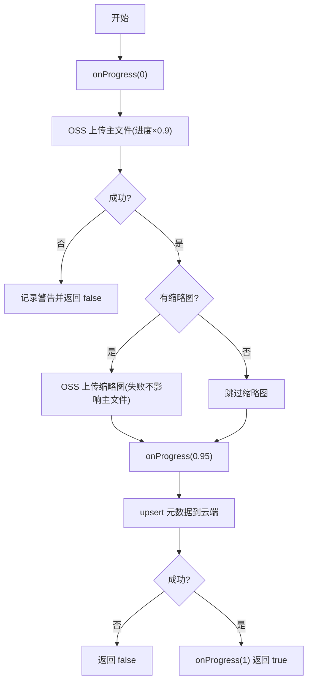
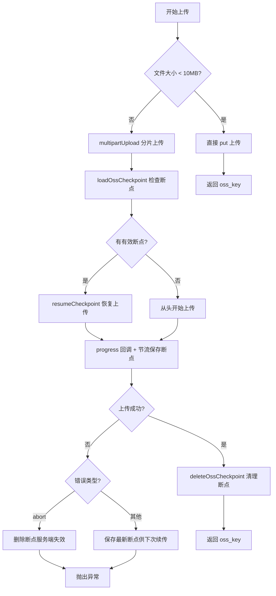
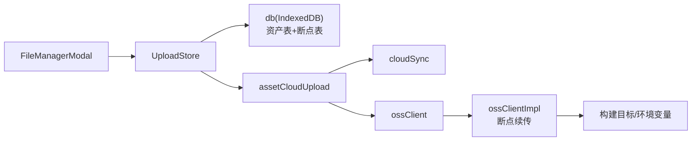

# 上传状态管理 (UploadStore)

<cite>
**本文引用的文件**
- [uploadStore.ts](file://src/store/uploadStore.ts)
- [assetCloudUpload.ts](file://src/sync/assetCloudUpload.ts)
- [cloudSync.ts](file://src/sync/cloudSync.ts)
- [ossClient.ts](file://src/sync/ossClient.ts)
- [ossClientImpl.ts](file://src/sync/ossClientImpl.ts)
- [db.ts](file://src/db/db.ts)
- [types.ts](file://src/types.ts)
- [fileLoader.ts](file://src/io/fileLoader.ts)
- [FileManagerModal.tsx](file://src/components/FileManagerModal.tsx)
</cite>

## 更新摘要
**变更内容**
- 新增断点续传功能，支持大文件上传中断后的恢复
- 增强上传进度管理和持久化机制
- 优化分片上传性能和可靠性
- 完善错误处理和异常恢复流程

## 目录
1. [简介](#简介)
2. [项目结构](#项目结构)
3. [核心组件](#核心组件)
4. [架构总览](#架构总览)
5. [详细组件分析](#详细组件分析)
6. [依赖关系分析](#依赖关系分析)
7. [性能考量](#性能考量)
8. [故障排查指南](#故障排查指南)
9. [结论](#结论)

## 简介
本文件聚焦于"上传状态管理"子系统，围绕 UploadStore 的设计与实现，说明其如何协调本地 IndexedDB、OSS 云存储与云端元数据同步，提供可观测的上传进度、失败重试与异常恢复能力。**已增强支持断点续传功能**，通过 checkpoint-based recovery 机制确保大文件上传在网络中断或页面关闭后能够自动恢复，提升用户体验和系统可靠性。该子系统在导入素材时自动触发上传，并在文件管理器中可视化展示上传状态，支持用户主动重试。

## 项目结构
上传状态管理涉及以下关键模块：
- 状态层：UploadStore（Zustand）维护实时上传状态与进度
- 业务编排：assetCloudUpload 编排 OSS 上传与元数据同步
- 云端交互：cloudSync 负责 Supabase 元数据读写；ossClient 封装 OSS 客户端
- **断点续传**：ossClientImpl 实现分片上传与 checkpoint 持久化
- 持久化：db.ts 定义资产记录、云端上传状态字段及断点数据表
- 入口与触发：fileLoader 在导入或更新文本资源后触发上传
- UI 展示：FileManagerModal 读取并渲染上传状态，支持重试

**图表来源**
- [uploadStore.ts:25-74](file://src/store/uploadStore.ts#L25-L74)
- [assetCloudUpload.ts:15-44](file://src/sync/assetCloudUpload.ts#L15-L44)
- [ossClient.ts:22-66](file://src/sync/ossClient.ts#L22-L66)
- [ossClientImpl.ts:145-196](file://src/sync/ossClientImpl.ts#L145-L196)
- [cloudSync.ts:29-54](file://src/sync/cloudSync.ts#L29-L54)
- [db.ts:30-55](file://src/db/db.ts#L30-L55)
- [fileLoader.ts:60-97](file://src/io/fileLoader.ts#L60-L97)
- [FileManagerModal.tsx:71-72](file://src/components/FileManagerModal.tsx#L71-L72)

章节来源
- [uploadStore.ts:1-85](file://src/store/uploadStore.ts#L1-L85)
- [assetCloudUpload.ts:1-45](file://src/sync/assetCloudUpload.ts#L1-L45)
- [cloudSync.ts:1-169](file://src/sync/cloudSync.ts#L1-L169)
- [ossClient.ts:1-67](file://src/sync/ossClient.ts#L1-L67)
- [ossClientImpl.ts:1-250](file://src/sync/ossClientImpl.ts#L1-L250)
- [db.ts:1-102](file://src/db/db.ts#L1-L102)
- [types.ts:37-44](file://src/types.ts#L37-L44)
- [fileLoader.ts:60-116](file://src/io/fileLoader.ts#L60-L116)
- [FileManagerModal.tsx:64-79](file://src/components/FileManagerModal.tsx#L64-L79)

## 核心组件
- UploadStore
  - 职责：维护 assetsId → {state, progress} 的映射；提供 runCloudUpload(assetId)；启动时修复卡住的 uploading 状态
  - 关键点：节流进度回调；成功后短暂保留 done 状态再移除；失败写回 cloudStatus=failed
- assetCloudUpload
  - 职责：统一编排主文件上传（带进度）、缩略图上传、元数据 upsert；以布尔值表示成败
- cloudSync
  - 职责：Supabase 元数据增删改查；登录态判断；项目列表/加载策略
- ossClient
  - 职责：在线/局域网构建分支选择；OSS 上传/下载/签名 URL；按环境动态导入真实实现
- **ossClientImpl**
  - 职责：**实现分片上传与断点续传**；管理 checkpoint 持久化；处理网络异常和恢复逻辑
- db
  - 职责：资产记录模型包含 cloudStatus；**新增 uploadCheckpoints 表存储断点信息**；提供 IndexedDB 操作；垃圾回收
- fileLoader
  - 职责：导入/更新文本资源后，调用 UploadStore.runCloudUpload 触发上传
- FileManagerModal
  - 职责：订阅 uploads 状态；展示进度条、失败重试按钮、成功徽标；重试后刷新本地记录

章节来源
- [uploadStore.ts:7-18](file://src/store/uploadStore.ts#L7-L18)
- [assetCloudUpload.ts:5-44](file://src/sync/assetCloudUpload.ts#L5-L44)
- [cloudSync.ts:18-54](file://src/sync/cloudSync.ts#L18-L54)
- [ossClient.ts:3-66](file://src/sync/ossClient.ts#L3-L66)
- [ossClientImpl.ts:145-196](file://src/sync/ossClientImpl.ts#L145-L196)
- [db.ts:30-55](file://src/db/db.ts#L30-L55)
- [fileLoader.ts:60-116](file://src/io/fileLoader.ts#L60-L116)
- [FileManagerModal.tsx:71-72](file://src/components/FileManagerModal.tsx#L71-L72)

## 架构总览
上传链路从"导入/更新"开始，经 UploadStore 编排，调用 assetCloudUpload 完成 OSS 上传与元数据同步，同时将状态落库并在 UI 中呈现。**新增断点续传机制确保大文件上传的可靠性**。

**图表来源**
- [uploadStore.ts:27-74](file://src/store/uploadStore.ts#L27-L74)
- [assetCloudUpload.ts:15-44](file://src/sync/assetCloudUpload.ts#L15-L44)
- [ossClient.ts:22-40](file://src/sync/ossClient.ts#L22-L40)
- [ossClientImpl.ts:145-196](file://src/sync/ossClientImpl.ts#L145-L196)
- [cloudSync.ts:29-54](file://src/sync/cloudSync.ts#L29-L54)
- [db.ts:30-55](file://src/db/db.ts#L30-L55)

## 详细组件分析

### UploadStore：状态机与进度
- 状态机
  - uploading：上传进行中，progress 0~1
  - failed：失败可重试，cloudStatus 写回 failed
  - done：成功，短暂保留后从内存 maps 移除
- 进度节流
  - 通过 PROGRESS_THROTTLE_MS 限制高频回调导致的重渲染
- 异常与恢复
  - 页面关闭残留 uploading：启动时 repairStuckUploads 批量改为 failed，便于重试
- 与持久化
  - 上传过程中与结束后分别写入 cloudStatus，保证刷新后可恢复失败态

**图表来源**
- [uploadStore.ts:25-74](file://src/store/uploadStore.ts#L25-L74)

章节来源
- [uploadStore.ts:20-85](file://src/store/uploadStore.ts#L20-L85)

### assetCloudUpload：上传编排
- 主文件上传占 0~0.9 进度，缩略图与元数据占剩余部分
- 缩略图失败不阻断主文件上传
- 最终 upsert 元数据到云端，成功后回调进度为 1

**图表来源**
- [assetCloudUpload.ts:15-44](file://src/sync/assetCloudUpload.ts#L15-L44)

章节来源
- [assetCloudUpload.ts:1-45](file://src/sync/assetCloudUpload.ts#L1-L45)

### cloudSync：云端元数据与鉴权
- isCloudAuthed：基于 supabase.auth.getUser 判断登录态
- upsertAssetMetaToCloud：将资产元数据与 OSS key 写入 assets 表
- fetch/delete 等辅助方法用于管理与查询

章节来源
- [cloudSync.ts:18-54](file://src/sync/cloudSync.ts#L18-L54)

### ossClient：环境适配与上传接口
- IS_ONLINE 由构建目标决定，局域网版直接返回空实现，避免打包无关依赖
- 提供 uploadAssetToOssWithProgress、uploadThumbToOss、download/getUrl 等接口
- 通过动态 import 引入真实实现，保持产物精简

章节来源
- [ossClient.ts:3-66](file://src/sync/ossClient.ts#L3-L66)

### **ossClientImpl：断点续传实现**
- **分片上传配置**：阈值 10MB 以上使用分片上传，分片大小 2MB，并行度 4
- **断点检测与恢复**：loadOssCheckpoint 从 IndexedDB 读取断点信息，验证有效性后恢复上传
- **断点持久化**：saveOssCheckpoint 定期保存上传进度到 IndexedDB，避免频繁 IO
- **异常处理**：区分 abort 错误（服务端失效）和其他错误（保留断点继续尝试）
- **进度回调**：实时更新进度并节流保存断点，确保数据一致性

**图表来源**
- [ossClientImpl.ts:145-196](file://src/sync/ossClientImpl.ts#L145-L196)
- [ossClientImpl.ts:82-143](file://src/sync/ossClientImpl.ts#L82-L143)

章节来源
- [ossClientImpl.ts:75-196](file://src/sync/ossClientImpl.ts#L75-L196)

### db：数据模型与状态字段
- AssetRecord 包含 cloudStatus 字段，用于持久化上传状态
- **新增 UploadCheckpointRecord 表**：存储断点续传所需的 checkpoint 信息
- Dexie 表结构与索引定义
- 提供 GC 清理无引用资产的能力，同时清理相关断点数据

章节来源
- [db.ts:8-19](file://src/db/db.ts#L8-L19)
- [db.ts:30-55](file://src/db/db.ts#L30-L55)
- [db.ts:80-102](file://src/db/db.ts#L80-L102)

### fileLoader：触发上传的入口
- putAsset：导入文件后生成缩略图（视频/PSD），写入 IndexedDB，若局域网连接则推送，并异步触发云端上传
- updateAssetText：更新文本资源后同样触发云端上传

章节来源
- [fileLoader.ts:60-97](file://src/io/fileLoader.ts#L60-L97)
- [fileLoader.ts:100-116](file://src/io/fileLoader.ts#L100-L116)

### FileManagerModal：UI 展示与重试
- 订阅 uploads 与 runCloudUpload
- 根据上传状态渲染进度条、失败重试按钮、成功徽标
- 重试后拉取最新记录，避免缓存导致的状态不一致

章节来源
- [FileManagerModal.tsx:71-72](file://src/components/FileManagerModal.tsx#L71-L72)
- [FileManagerModal.tsx:251-260](file://src/components/FileManagerModal.tsx#L251-L260)
- [FileManagerModal.tsx:391-448](file://src/components/FileManagerModal.tsx#L391-L448)

## 依赖关系分析
- 耦合度
  - UploadStore 依赖 db、assetCloudUpload、uiStore（toast）
  - assetCloudUpload 依赖 cloudSync 与 ossClient
  - **ossClient 依赖 ossClientImpl 实现断点续传功能**
  - ossClient 通过构建期常量与环境变量切换实现
  - FileManagerModal 仅消费 UploadStore 暴露的 API
- 内聚性
  - 上传状态与进度集中在 UploadStore
  - 上传流程编排集中在 assetCloudUpload
  - 云端交互集中在 cloudSync/ossClient
  - **断点续传逻辑集中在 ossClientImpl**
- 外部依赖
  - Supabase（云端元数据）
  - OSS（对象存储）
  - IndexedDB（本地资产、状态与断点数据）

**图表来源**
- [uploadStore.ts:25-74](file://src/store/uploadStore.ts#L25-L74)
- [assetCloudUpload.ts:15-44](file://src/sync/assetCloudUpload.ts#L15-L44)
- [ossClient.ts:3-66](file://src/sync/ossClient.ts#L3-L66)
- [ossClientImpl.ts:145-196](file://src/sync/ossClientImpl.ts#L145-L196)
- [FileManagerModal.tsx:71-72](file://src/components/FileManagerModal.tsx#L71-L72)

章节来源
- [uploadStore.ts:1-85](file://src/store/uploadStore.ts#L1-L85)
- [assetCloudUpload.ts:1-45](file://src/sync/assetCloudUpload.ts#L1-L45)
- [ossClient.ts:1-67](file://src/sync/ossClient.ts#L1-L67)
- [ossClientImpl.ts:1-250](file://src/sync/ossClientImpl.ts#L1-L250)
- [FileManagerModal.tsx:64-79](file://src/components/FileManagerModal.tsx#L64-L79)

## 性能考量
- 进度节流：PROGRESS_THROTTLE_MS 降低高频回调对渲染的影响，避免频繁 setState
- **断点续传节流**：CHECKPOINT_SAVE_INTERVAL_MS 控制断点持久化频率，避免每个分片都写 IndexedDB
- 懒加载与摇树：ossClient 使用动态 import，局域网构建不包含 OSS 依赖，减小包体
- 状态最小化：uploads 仅保存必要字段，done 状态延迟移除，减少长期驻留
- 并发控制：runCloudUpload 内部防止重复上传同一 assetId
- 网络优化：缩略图失败不阻塞主文件上传，提升整体成功率
- **分片优化**：10MB 阈值以下直接上传，避免不必要的分片开销；分片大小 2MB，并行度 4

[本节为通用指导，无需特定文件来源]

## 故障排查指南
- 上传卡在 uploading
  - 现象：页面刷新后仍显示 uploading
  - 处理：应用启动时 repairStuckUploads 会将所有 cloudStatus='uploading' 的记录重置为 failed，以便重试
  - 参考路径：[repairStuckUploads:77-84](file://src/store/uploadStore.ts#L77-L84)
- 本地数据缺失
  - 现象：提示本地数据缺失，无法上传
  - 原因：资产记录不存在或 blob 为空
  - 处理：重新导入文件或修复本地数据
  - 参考路径：[putAsset 与校验:60-97](file://src/io/fileLoader.ts#L60-L97)
- 云端元数据同步失败
  - 现象：OSS 上传成功但元数据未同步
  - 处理：检查 Supabase 配置与权限；查看控制台警告信息
  - 参考路径：[upsertAssetMetaToCloud:29-54](file://src/sync/cloudSync.ts#L29-L54)
- 缩略图上传失败
  - 现象：缩略图上传报错但不影响主文件
  - 处理：忽略或重试缩略图；主文件仍可正常播放/预览
  - 参考路径：[缩略图上传容错:31-38](file://src/sync/assetCloudUpload.ts#L31-L38)
- 局域网模式
  - 现象：上传相关功能不可用
  - 原因：IS_ONLINE=false 时 ossClient 返回空实现
  - 处理：切换到在线构建或使用局域网分发替代
  - 参考路径：[ossClient 环境分支:3-20](file://src/sync/ossClient.ts#L3-L20)
- **断点续传问题**
  - 现象：大文件上传中断后无法恢复
  - 处理：检查 IndexedDB 中 uploadCheckpoints 表是否有断点记录；确认断点验证逻辑
  - 参考路径：[loadOssCheckpoint:82-109](file://src/sync/ossClientImpl.ts#L82-L109)
- **断点数据损坏**
  - 现象：断点续传失败，需要重新开始
  - 处理：断点验证失败会自动清理；检查 key、fileSize、partSize 是否匹配
  - 参考路径：[断点验证逻辑:92-103](file://src/sync/ossClientImpl.ts#L92-L103)

章节来源
- [uploadStore.ts:77-84](file://src/store/uploadStore.ts#L77-L84)
- [fileLoader.ts:60-97](file://src/io/fileLoader.ts#L60-L97)
- [cloudSync.ts:29-54](file://src/sync/cloudSync.ts#L29-L54)
- [assetCloudUpload.ts:31-38](file://src/sync/assetCloudUpload.ts#L31-L38)
- [ossClient.ts:3-20](file://src/sync/ossClient.ts#L3-L20)
- [ossClientImpl.ts:82-109](file://src/sync/ossClientImpl.ts#L82-L109)

## 结论
UploadStore 以简洁的状态机与可靠的错误恢复机制，将本地 IndexedDB、OSS 与云端元数据串联成一致的上传体验。**新增的断点续传功能显著提升了大文件上传的可靠性**，通过 checkpoint-based recovery 机制确保在网络中断或页面关闭后能够自动恢复上传进度。配合进度节流、失败重试与异常修复，既保证了用户体验，也提升了系统的鲁棒性。配合 FileManagerModal 的可视化展示，用户可以直观地掌握上传进度并及时处理失败场景。整个上传系统现在具备了企业级的可靠性和用户体验。