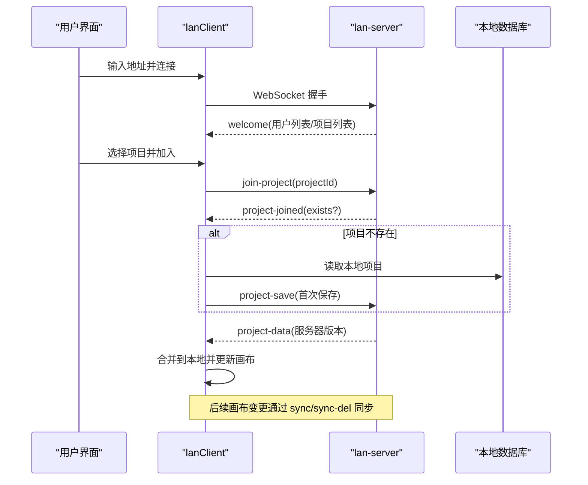
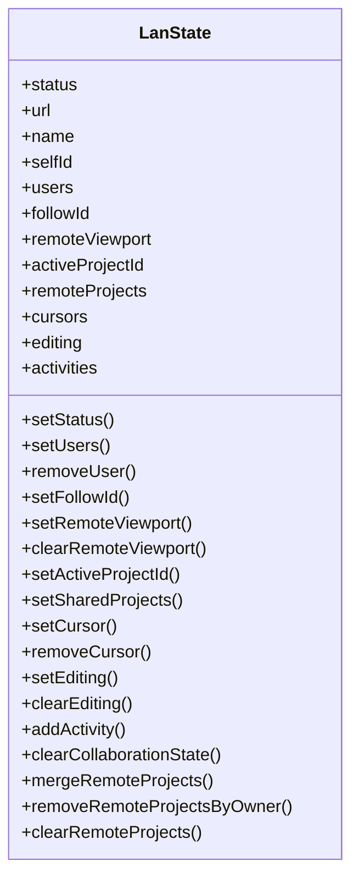
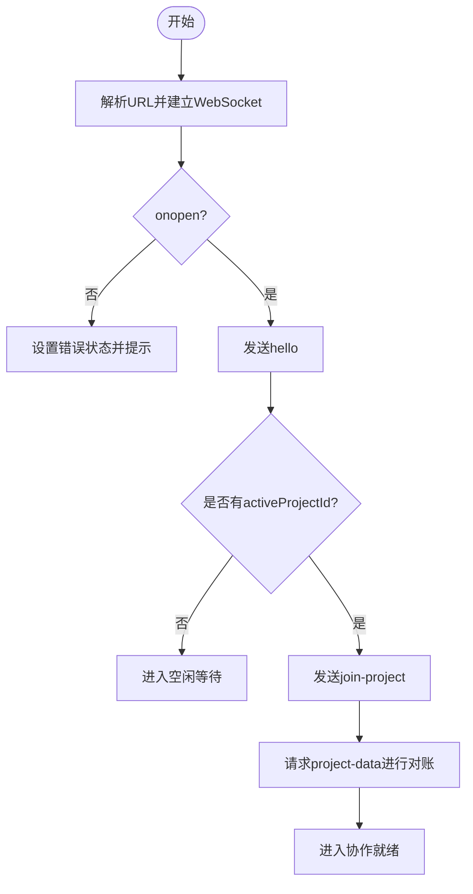
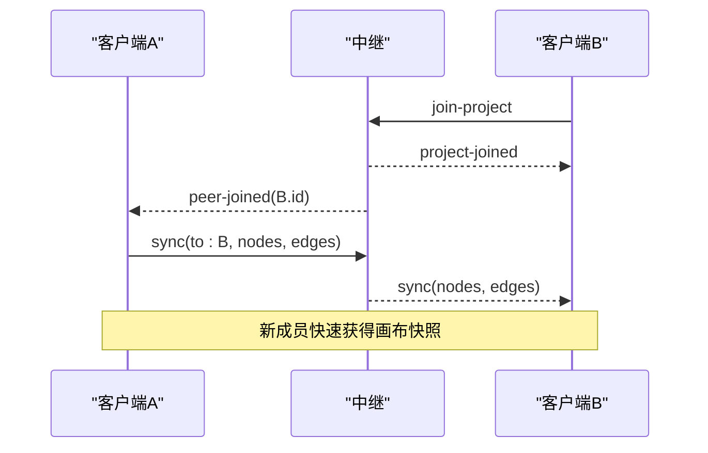
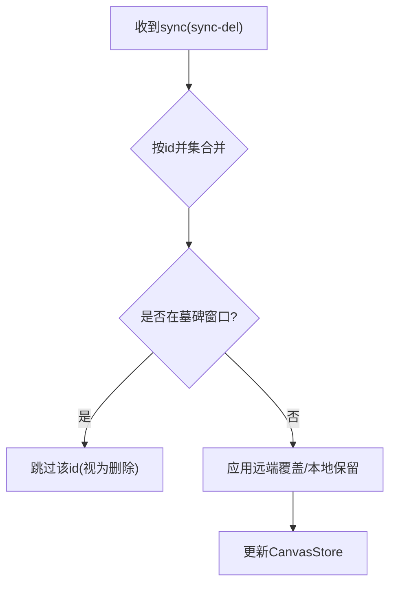
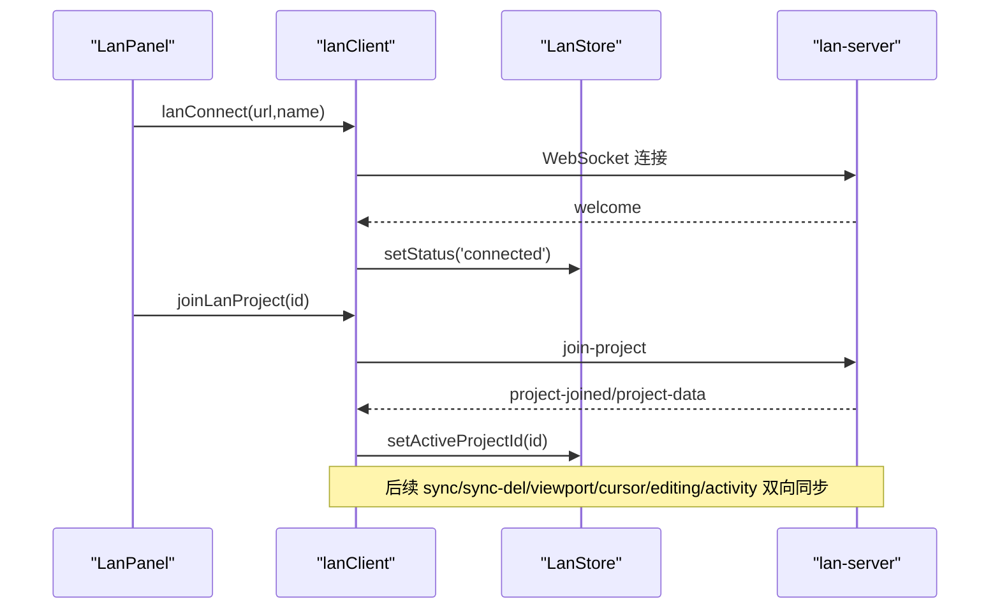
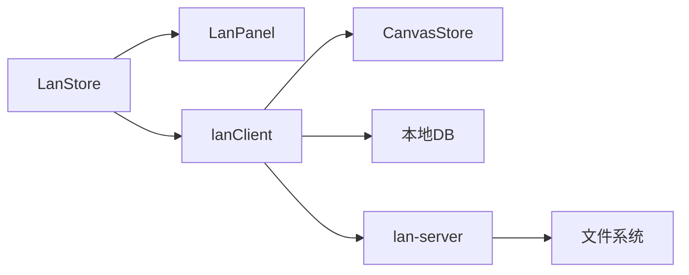

# 协作状态管理 (LanStore)

<cite>
**本文引用的文件**
- [src/store/lanStore.ts](file://src/store/lanStore.ts)
- [src/sync/lanClient.ts](file://src/sync/lanClient.ts)
- [server/lan-server.mjs](file://server/lan-server.mjs)
- [src/components/LanPanel.tsx](file://src/components/LanPanel.tsx)
</cite>

## 目录
1. [简介](#简介)
2. [项目结构](#项目结构)
3. [核心组件](#核心组件)
4. [架构总览](#架构总览)
5. [详细组件分析](#详细组件分析)
6. [依赖关系分析](#依赖关系分析)
7. [性能与可靠性](#性能与可靠性)
8. [故障排查指南](#故障排查指南)
9. [结论](#结论)
10. [附录：协作功能完整示例](#附录协作功能完整示例)

## 简介
本文件围绕局域网多人协作的状态管理与通信机制，系统性阐述 LanStore 的职责、协作会话的建立与维护、用户加入/离开事件处理、冲突解决策略，以及与 LAN 客户端和服务端的集成方式（连接状态管理、消息路由、数据同步策略）。文档同时提供端到端的使用示例，展示如何实现房间创建、用户邀请、实时状态同步等协作能力。

## 项目结构
本项目采用“前端状态 + 客户端通信 + 中继服务”的分层设计：
- 前端状态：使用 Zustand 维护协作相关的全局状态（用户列表、光标、编辑中、活动日志、远程视口、共享项目等），由 LanStore 统一管理。
- 客户端通信：lanClient 负责 WebSocket 连接、消息收发、画布与素材的同步、断线重连、自动恢复等。
- 中继服务：lan-server 提供 WebSocket 广播、项目持久化、资产缓存与 HTTP Range 流式拉取、资源清理等。
- UI 面板：LanPanel 暴露连接、跟随、查看协作者与活动等功能入口。

```mermaid
graph TB
subgraph "浏览器"
UI["LanPanel 组件"]
Store["LanStore (Zustand)"]
Client["lanClient 客户端"]
Canvas["CanvasStore (画布)"]
end
subgraph "局域网中继"
Server["lan-server 服务"]
FS["本地文件系统<br/>项目/资产/备份"]
end
UI --> Store
UI --> Client
Client --> Store
Client --> Canvas
Client < --> |WebSocket| Server
Server --> FS
```

**图表来源**
- [src/components/LanPanel.tsx:17-199](file://src/components/LanPanel.tsx#L17-L199)
- [src/store/lanStore.ts:53-159](file://src/store/lanStore.ts#L53-L159)
- [src/sync/lanClient.ts:254-362](file://src/sync/lanClient.ts#L254-L362)
- [server/lan-server.mjs:449-451](file://server/lan-server.mjs#L449-L451)

**章节来源**
- [src/store/lanStore.ts:53-159](file://src/store/lanStore.ts#L53-L159)
- [src/sync/lanClient.ts:254-362](file://src/sync/lanClient.ts#L254-L362)
- [server/lan-server.mjs:449-451](file://server/lan-server.mjs#L449-L451)
- [src/components/LanPanel.tsx:17-199](file://src/components/LanPanel.tsx#L17-L199)

## 核心组件
- LanStore：集中管理协作状态，包括连接状态、当前项目、用户列表、远端视口、光标位置、编辑中节点、活动记录、共享项目列表等，并提供增删改方法供客户端调用。
- lanClient：封装 WebSocket 生命周期、消息路由、画布同步、删除传播、视口广播、光标与编辑状态同步、素材传输（分片/封面/HTTP Range）、断线重连、自动恢复等。
- lan-server：实现房间级广播、项目持久化、资产缓存与 HTTP Range 流式拉取、孤儿资产回收、备份与恢复、权限控制（删除者校验）等。
- LanPanel：UI 入口，支持连接/断开、跟随他人、查看协作者与活动、显示当前项目协作人数等。

**章节来源**
- [src/store/lanStore.ts:53-159](file://src/store/lanStore.ts#L53-L159)
- [src/sync/lanClient.ts:254-362](file://src/sync/lanClient.ts#L254-L362)
- [server/lan-server.mjs:661-906](file://server/lan-server.mjs#L661-L906)
- [src/components/LanPanel.tsx:17-199](file://src/components/LanPanel.tsx#L17-L199)

## 架构总览
协作系统通过“房间隔离”的方式组织多人协作：每个项目即一个房间，只有加入该项目的设备才会收到该项目内的同步消息。连接建立后，客户端发送 hello 并获取欢迎信息（自身 ID、用户列表、共享项目列表）。加入项目后，服务端向房间内其他成员广播 peer-joined，并向新成员推送项目数据；画布变更通过 sync 消息按 150ms 防抖合并广播；删除操作通过 sync-del 显式传播，避免快照覆盖导致的误复活；视口变化按 100ms 防抖广播；光标与编辑状态实时更新；大文件通过分片传输或 HTTP Range 流式拉取。



**图表来源**
- [src/sync/lanClient.ts:254-362](file://src/sync/lanClient.ts#L254-L362)
- [src/sync/lanClient.ts:417-492](file://src/sync/lanClient.ts#L417-L492)
- [server/lan-server.mjs:696-728](file://server/lan-server.mjs#L696-L728)

**章节来源**
- [src/sync/lanClient.ts:417-492](file://src/sync/lanClient.ts#L417-L492)
- [server/lan-server.mjs:696-728](file://server/lan-server.mjs#L696-L728)

## 详细组件分析

### LanStore 状态模型与职责
- 连接与会话：status、url、name、selfId、activeProjectId。
- 用户与协作：users、followId、remoteViewport、cursors、editing、activities。
- 共享项目：remoteProjects（含 ownerId、updatedAt 用于合并与排序）。
- 关键方法：设置/移除用户、设置跟随目标、设置/清除远端视口、添加活动、合并/清理远程项目、清理协作状态等。



**图表来源**
- [src/store/lanStore.ts:53-159](file://src/store/lanStore.ts#L53-L159)

**章节来源**
- [src/store/lanStore.ts:53-159](file://src/store/lanStore.ts#L53-L159)

### 协作会话建立与维护
- 连接建立：lanConnect 解析 URL、创建 WebSocket、设置 onopen/onclose/onerror/onmessage，成功后发送 hello，若已有 activeProjectId 则 join-project 并请求项目数据以进行离线对账。
- 自动重连：断线后根据是否已连接过决定 idle/error 状态，并在有目标时指数退避重连；页面刷新后可自动恢复上次配置并重连。
- 房间切换：joinLanProject 设置 activeProjectId、清理协作状态与墓碑；leaveLanProject 清空状态并通知服务端。



**图表来源**
- [src/sync/lanClient.ts:254-362](file://src/sync/lanClient.ts#L254-L362)
- [src/sync/lanClient.ts:398-407](file://src/sync/lanClient.ts#L398-L407)
- [src/sync/lanClient.ts:767-786](file://src/sync/lanClient.ts#L767-L786)

**章节来源**
- [src/sync/lanClient.ts:254-362](file://src/sync/lanClient.ts#L254-L362)
- [src/sync/lanClient.ts:398-407](file://src/sync/lanClient.ts#L398-L407)
- [src/sync/lanClient.ts:767-786](file://src/sync/lanClient.ts#L767-L786)

### 用户加入/离开事件处理
- 加入：peer-joined 时，将当前画布快照（去除选中态）发送给新成员，确保其快速对齐。
- 离开：leave 时，从用户列表中移除，并清理其光标与编辑状态。
- 用户列表：users 消息直接替换为当前房间的用户集合。



**图表来源**
- [src/sync/lanClient.ts:417-433](file://src/sync/lanClient.ts#L417-L433)
- [server/lan-server.mjs:696-705](file://server/lan-server.mjs#L696-L705)

**章节来源**
- [src/sync/lanClient.ts:417-433](file://src/sync/lanClient.ts#L417-L433)
- [server/lan-server.mjs:696-705](file://server/lan-server.mjs#L696-L705)

### 冲突解决机制
- 画布合并：sync 消息到达时，按 id 并集合并节点与边，远端同 id 覆盖本地字段，本地独有保留；被删除的 id 在 TOMBSTONE_MS 内标记墓碑，晚到的旧快照不会复活。
- 删除传播：initLanSync 监听画布变更，检测新增/删除的节点与边，批量调度 sync-del 广播，确保删除语义明确。
- 项目数据对账：project-data 到达时，仅当远端 updatedAt >= 本地时整幅替换，否则保留本地离线编辑成果。
- 删除权限：只有项目创建者（creatorId）可删除项目，非创建者会收到拒绝提示。



**图表来源**
- [src/sync/lanClient.ts:527-598](file://src/sync/lanClient.ts#L527-L598)
- [src/sync/lanClient.ts:718-756](file://src/sync/lanClient.ts#L718-L756)
- [src/sync/lanClient.ts:454-492](file://src/sync/lanClient.ts#L454-L492)
- [server/lan-server.mjs:731-757](file://server/lan-server.mjs#L731-L757)

**章节来源**
- [src/sync/lanClient.ts:527-598](file://src/sync/lanClient.ts#L527-L598)
- [src/sync/lanClient.ts:718-756](file://src/sync/lanClient.ts#L718-L756)
- [src/sync/lanClient.ts:454-492](file://src/sync/lanClient.ts#L454-L492)
- [server/lan-server.mjs:731-757](file://server/lan-server.mjs#L731-L757)

### 与 LAN 客户端的集成方式
- 连接状态管理：lanStore.status 反映 idle/connecting/connected/error；lanClient 在 onopen/onclose/onerror 中更新状态并触发重连逻辑。
- 消息路由：handleMessage 根据 t 分发到不同处理分支（welcome、users、leave、project-list、project-joined、project-data、sync、sync-del、viewport、cursor、editing、activity、asset-*）。
- 数据同步策略：
  - 画布：150ms 防抖广播 sync；删除通过 sync-del 显式传播；按 id 并集合并。
  - 视口：100ms 防抖广播 viewport；跟随模式下不广播自己的视口。
  - 光标/编辑：实时更新，支持锁定检查（isNodeLockedByOther）。
  - 素材：分片 base64 传输；视频优先走 HTTP Range 流式拉取；封面先于分片下发；空闲超时与断点续传。



**图表来源**
- [src/components/LanPanel.tsx:41-50](file://src/components/LanPanel.tsx#L41-L50)
- [src/sync/lanClient.ts:254-362](file://src/sync/lanClient.ts#L254-L362)
- [src/sync/lanClient.ts:767-786](file://src/sync/lanClient.ts#L767-L786)
- [server/lan-server.mjs:696-705](file://server/lan-server.mjs#L696-L705)

**章节来源**
- [src/components/LanPanel.tsx:41-50](file://src/components/LanPanel.tsx#L41-L50)
- [src/sync/lanClient.ts:254-362](file://src/sync/lanClient.ts#L254-L362)
- [src/sync/lanClient.ts:767-786](file://src/sync/lanClient.ts#L767-L786)
- [server/lan-server.mjs:696-705](file://server/lan-server.mjs#L696-L705)

## 依赖关系分析
- LanStore 被 LanPanel 和 lanClient 共同消费，作为单一事实源。
- lanClient 依赖 LanStore 读写协作状态，并订阅 CanvasStore 变更以触发同步。
- lan-server 依赖本地文件系统持久化项目与资产，并通过 WebSocket 广播消息。
- 颜色与用户标识：getLanUserColor 用于稳定生成用户颜色；deviceId 用于 creatorId 判定。



**图表来源**
- [src/store/lanStore.ts:53-159](file://src/store/lanStore.ts#L53-L159)
- [src/sync/lanClient.ts:1-9](file://src/sync/lanClient.ts#L1-L9)
- [server/lan-server.mjs:449-451](file://server/lan-server.mjs#L449-L451)

**章节来源**
- [src/store/lanStore.ts:53-159](file://src/store/lanStore.ts#L53-L159)
- [src/sync/lanClient.ts:1-9](file://src/sync/lanClient.ts#L1-L9)
- [server/lan-server.mjs:449-451](file://server/lan-server.mjs#L449-L451)

## 性能与可靠性
- 防抖与批处理：画布同步 150ms、视口 100ms、活动合并 350ms、删除批量 80ms，降低网络与渲染压力。
- 墓碑机制：TOMBSTONE_MS 内屏蔽晚到旧快照，避免误复活，提升一致性。
- 大文件优化：视频优先走 HTTP Range 流式拉取，减少 WebSocket 带宽占用；分片大小对齐 base64 边界，避免填充问题；空闲超时与断点续传保障稳定性。
- 内存优化：接收端按分片收集字节数组，收齐后再构造 Blob，避免拼接整个 base64。
- 资源清理：服务端定期回收孤儿资产与过期备份，防止磁盘膨胀。

[本节为通用性能讨论，无需特定文件引用]

## 故障排查指南
- 无法连接：检查地址协议（HTTPS 页面需 wss）、反向代理配置（宝塔默认 /lan-ws）、端口开放情况。
- 自动重连失败：确认 hasConnectedBefore 与 reconnectTarget 是否正确设置；查看控制台错误提示。
- 项目不同步：确认 activeProjectId 一致；检查 project-data 是否到达且 updatedAt 比较正确；查看是否存在墓碑导致节点未恢复。
- 素材缺失：检查 asset-request 是否被广播；确认服务器是否返回 asset-http；查看本地是否已缓存封面；必要时强制 forceBlob 拉取。
- 删除权限：只有 creatorId 匹配的设备可删除项目；非创建者会收到拒绝提示。

**章节来源**
- [src/sync/lanClient.ts:254-362](file://src/sync/lanClient.ts#L254-L362)
- [src/sync/lanClient.ts:454-492](file://src/sync/lanClient.ts#L454-L492)
- [src/sync/lanClient.ts:1054-1089](file://src/sync/lanClient.ts#L1054-L1089)
- [server/lan-server.mjs:731-757](file://server/lan-server.mjs#L731-L757)

## 结论
LanStore 作为协作状态的唯一真实来源，配合 lanClient 的消息路由与同步策略，以及 lan-server 的房间广播与持久化能力，实现了低延迟、高可靠、可扩展的局域网多人协作体验。通过房间隔离、显式删除、墓碑机制、HTTP Range 流式拉取等手段，系统在并发编辑与大文件场景下仍保持良好的一致性与性能。

[本节为总结性内容，无需特定文件引用]

## 附录：协作功能完整示例
以下示例展示如何在应用中实现房间创建、用户邀请、实时状态同步等协作流程。步骤基于现有 API 与状态管理，可直接组合使用。

- 连接中继
  - 在 LanPanel 中输入 ws://IP:8790 或 wss://域名/lan-ws，点击连接。
  - 成功后 LanStore.status 变为 connected，并收到 welcome（用户列表与项目列表）。

- 创建/加入项目房间
  - 选择或新建项目后，调用 joinLanProject(projectId)。
  - 若项目不存在，首次保存会写入服务器并广播项目列表；其他设备可见并可选择加入。

- 用户邀请
  - 同一局域网内，其他设备打开应用并连接到相同中继地址即可看到共享项目。
  - 加入项目后，服务端向房间内其他成员广播 peer-joined，新成员立即收到画布快照。

- 实时状态同步
  - 画布变更：自动触发 sync 广播，150ms 防抖合并。
  - 删除操作：自动触发 sync-del 广播，显式删除。
  - 视口变化：每 100ms 广播一次，跟随模式下不广播自己的视口。
  - 光标与编辑：实时更新，支持锁定检查。

- 素材同步
  - 小文件：base64 分片传输，封面先于分片下发。
  - 大视频：优先走 HTTP Range 流式拉取，边下边播，减少带宽占用。

- 断线与恢复
  - 断线后自动重连，保留已收分片，重连后继续断点续传。
  - 项目数据对账：仅当远端更新时整幅替换，保护本地离线编辑。

- 权限与清理
  - 只有项目创建者可删除项目。
  - 服务端定期清理过期备份与孤儿资产。

**章节来源**
- [src/components/LanPanel.tsx:41-50](file://src/components/LanPanel.tsx#L41-L50)
- [src/sync/lanClient.ts:767-786](file://src/sync/lanClient.ts#L767-L786)
- [src/sync/lanClient.ts:417-433](file://src/sync/lanClient.ts#L417-L433)
- [src/sync/lanClient.ts:655-716](file://src/sync/lanClient.ts#L655-L716)
- [src/sync/lanClient.ts:1023-1089](file://src/sync/lanClient.ts#L1023-L1089)
- [server/lan-server.mjs:731-757](file://server/lan-server.mjs#L731-L757)