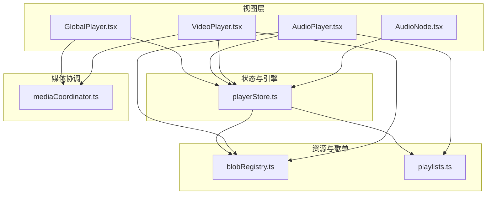
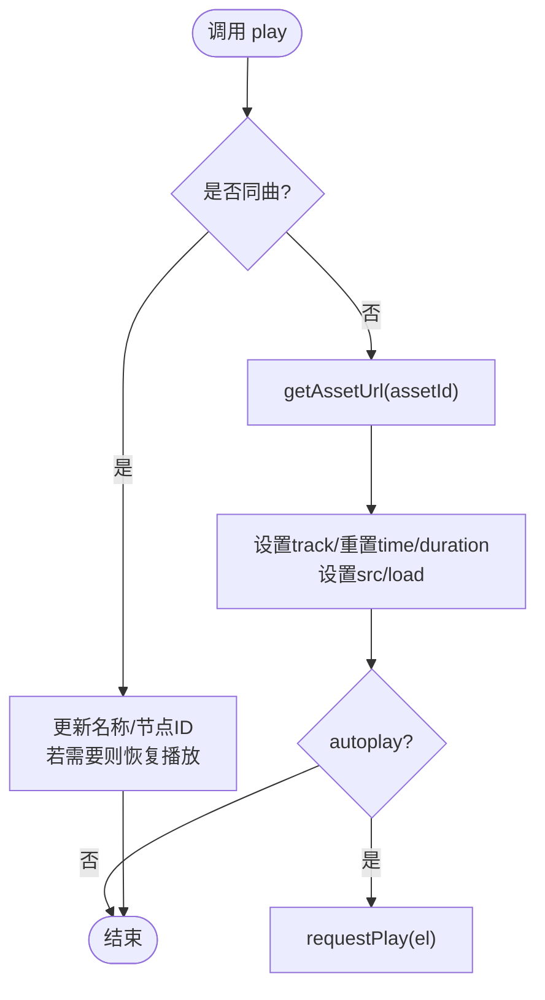
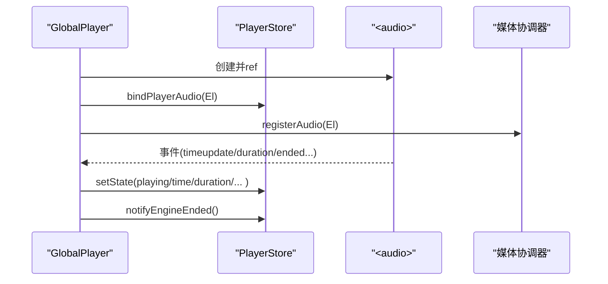
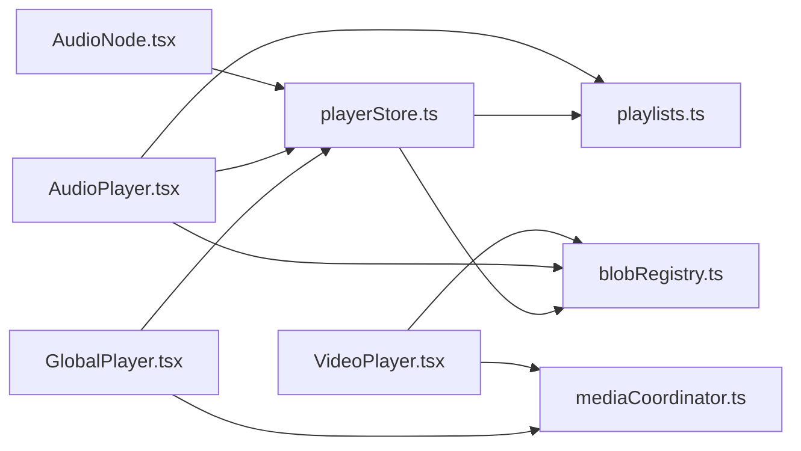

# 播放器状态管理 (PlayerStore)

<cite>
**本文引用的文件**
- [src/store/playerStore.ts](file://src/store/playerStore.ts)
- [src/media/mediaCoordinator.ts](file://src/media/mediaCoordinator.ts)
- [src/components/GlobalPlayer.tsx](file://src/components/GlobalPlayer.tsx)
- [src/components/AudioPlayer.tsx](file://src/components/AudioPlayer.tsx)
- [src/components/VideoPlayer.tsx](file://src/components/VideoPlayer.tsx)
- [src/media/playlists.ts](file://src/media/playlists.ts)
- [src/media/blobRegistry.ts](file://src/media/blobRegistry.ts)
- [src/canvas/nodes/AudioNode.tsx](file://src/canvas/nodes/AudioNode.tsx)
</cite>

## 目录
1. [简介](#简介)
2. [项目结构](#项目结构)
3. [核心组件](#核心组件)
4. [架构总览](#架构总览)
5. [详细组件分析](#详细组件分析)
6. [依赖关系分析](#依赖关系分析)
7. [性能与优化](#性能与优化)
8. [故障排查指南](#故障排查指南)
9. [结论](#结论)
10. [附录：操作示例](#附录操作示例)

## 简介
本文件系统性阐述播放器状态管理方案，围绕 PlayerStore 的媒体播放状态、多实例协调、播放列表与进度跟踪、错误处理策略，以及与媒体协调器（资源加载、缓存、性能）的集成方式。文档同时提供完整操作示例，覆盖播放控制、音量调节、播放列表管理等常见媒体功能。

## 项目结构
播放器相关代码主要分布在以下模块：
- 状态与引擎：store/playerStore.ts
- 全局音频元素与悬浮控制栏：components/GlobalPlayer.tsx
- 沉浸式音频播放器界面：components/AudioPlayer.tsx
- 视频播放器界面：components/VideoPlayer.tsx
- 媒体互斥协调：media/mediaCoordinator.ts
- 画布歌单解析：media/playlists.ts
- 资源 URL 与缩略图缓存：media/blobRegistry.ts
- 画布音频节点交互：canvas/nodes/AudioNode.tsx



图表来源
- [src/store/playerStore.ts:1-298](file://src/store/playerStore.ts#L1-L298)
- [src/components/GlobalPlayer.tsx:1-234](file://src/components/GlobalPlayer.tsx#L1-L234)
- [src/components/AudioPlayer.tsx:1-800](file://src/components/AudioPlayer.tsx#L1-L800)
- [src/components/VideoPlayer.tsx:1-800](file://src/components/VideoPlayer.tsx#L1-L800)
- [src/media/mediaCoordinator.ts:1-25](file://src/media/mediaCoordinator.ts#L1-L25)
- [src/media/playlists.ts:1-179](file://src/media/playlists.ts#L1-L179)
- [src/media/blobRegistry.ts:1-389](file://src/media/blobRegistry.ts#L1-L389)
- [src/canvas/nodes/AudioNode.tsx:1-126](file://src/canvas/nodes/AudioNode.tsx#L1-L126)

章节来源
- [src/store/playerStore.ts:1-298](file://src/store/playerStore.ts#L1-L298)
- [src/components/GlobalPlayer.tsx:1-234](file://src/components/GlobalPlayer.tsx#L1-L234)
- [src/components/AudioPlayer.tsx:1-800](file://src/components/AudioPlayer.tsx#L1-L800)
- [src/components/VideoPlayer.tsx:1-800](file://src/components/VideoPlayer.tsx#L1-L800)
- [src/media/mediaCoordinator.ts:1-25](file://src/media/mediaCoordinator.ts#L1-L25)
- [src/media/playlists.ts:1-179](file://src/media/playlists.ts#L1-L179)
- [src/media/blobRegistry.ts:1-389](file://src/media/blobRegistry.ts#L1-L389)
- [src/canvas/nodes/AudioNode.tsx:1-126](file://src/canvas/nodes/AudioNode.tsx#L1-L126)

## 核心组件
- PlayerStore：应用内唯一音频播放引擎的状态中心，维护当前曲目、播放状态、时间轴、音量、静音、播放模式、队列等；提供 play/toggle/seek/next/prev/setVolume/setMuted/setMode/setQueue/stop 等方法。
- GlobalPlayer：挂载唯一的 <audio> 元素，绑定到 PlayerStore，负责实际发声、事件同步、悬浮迷你控制栏、画中画入口。
- AudioPlayer：沉浸式音频播放器 UI，负责歌词、专辑背景、搜索、排序、歌单面板、键盘快捷键、流式顺序展示等。
- VideoPlayer：独立视频播放器 UI，拥有自己的 video 元素，通过媒体协调器与其他视频互斥。
- mediaCoordinator：全局媒体互斥器，保证同一时刻最多一个音频和一个视频在播放。
- playlists：从画布图结构派生歌单与线性顺序，供播放器与自动切歌共享。
- blobRegistry：资源 URL 与缩略图缓存、抓取、并发控制、回退策略。

章节来源
- [src/store/playerStore.ts:1-298](file://src/store/playerStore.ts#L1-L298)
- [src/components/GlobalPlayer.tsx:1-234](file://src/components/GlobalPlayer.tsx#L1-L234)
- [src/components/AudioPlayer.tsx:1-800](file://src/components/AudioPlayer.tsx#L1-L800)
- [src/components/VideoPlayer.tsx:1-800](file://src/components/VideoPlayer.tsx#L1-L800)
- [src/media/mediaCoordinator.ts:1-25](file://src/media/mediaCoordinator.ts#L1-L25)
- [src/media/playlists.ts:1-179](file://src/media/playlists.ts#L1-L179)
- [src/media/blobRegistry.ts:1-389](file://src/media/blobRegistry.ts#L1-L389)

## 架构总览
播放器采用“单一音频引擎 + 多视图”的架构：
- 单一引擎：全局 <audio> 由 GlobalPlayer 持有，所有音频播放请求统一走 PlayerStore。
- 多视图：画布中的 AudioNode、悬浮迷你条、沉浸式播放器均订阅同一份状态，保持 UI 一致。
- 媒体互斥：音频通过 mediaCoordinator 互斥；视频各自维护但同样受互斥约束。
- 歌单与顺序：基于画布连线解析，支持顺序、随机、循环、单曲、流式五种模式。
- 资源与缓存：通过 blobRegistry 获取资源 URL 与缩略图，具备本地 IndexedDB、局域网 HTTP 流式、云端下载等多路径回退。

```mermaid
sequenceDiagram
participant UI as "UI(节点/播放器)"
participant Store as "PlayerStore"
participant Engine as "全局<audio>"
participant Coord as "媒体协调器"
participant Res as "资源缓存(blobRegistry)"
participant PL as "歌单(playlists)"
UI->>Store : play({assetId, name?, nodeId?}, {autoplay?})
Store->>Res : getAssetUrl(assetId)
Res-->>Store : url
Store->>Engine : src=url; load()
Store->>Coord : 注册/监听(由GlobalPlayer完成)
Store->>PL : baseOrder()/linearizeFrom(...)
Engine-->>Store : timeupdate/durationchange/ended
Store-->>UI : 更新playing/time/duration/volume/mode/queue
```

图表来源
- [src/store/playerStore.ts:174-209](file://src/store/playerStore.ts#L174-L209)
- [src/components/GlobalPlayer.tsx:86-179](file://src/components/GlobalPlayer.tsx#L86-L179)
- [src/media/mediaCoordinator.ts:7-24](file://src/media/mediaCoordinator.ts#L7-L24)
- [src/media/playlists.ts:71-112](file://src/media/playlists.ts#L71-L112)
- [src/media/blobRegistry.ts:84-105](file://src/media/blobRegistry.ts#L84-L105)

## 详细组件分析

### PlayerStore：状态与引擎
- 状态字段
  - track：当前曲目信息（assetId、name、url、nodeId）
  - playing/time/duration：播放状态与时间轴
  - volume/muted：音量与静音
  - barVisible：悬浮条可见性
  - mode：播放模式（顺序/随机/循环/单曲/流式）
  - queue：当前歌单队列（仅流式模式有效）
- 关键方法
  - play：选择并加载曲目，同曲不重复加载，可配置是否立即起播
  - toggle：切换播放/暂停
  - seekTo/seekBy：精确跳转与相对跳转
  - next/prev：按模式与队列导航
  - setVolume/setMuted：音量与静音控制
  - setMode：切换播放模式，离开流式时清空队列
  - setQueue：设置歌单队列
  - stop：停止并重置状态
  - setBarVisible：控制悬浮条显示
- 内部机制
  - 使用 bindPlayerAudio 将真实 <audio> 元素注入引擎
  - orderProvider 提供当前视图的歌曲顺序（用于非流式模式的导航基准）
  - handleEnded 根据模式决定单曲循环或下一首
  - baseOrder 优先队列，其次 orderProvider，最后画布连线顺序
  - pickNextId/pickRandomId 实现顺序/随机导航
  - requestPlay 封装浏览器播放策略，避免未就绪导致的失败



图表来源
- [src/store/playerStore.ts:174-209](file://src/store/playerStore.ts#L174-L209)
- [src/store/playerStore.ts:72-88](file://src/store/playerStore.ts#L72-L88)

章节来源
- [src/store/playerStore.ts:1-298](file://src/store/playerStore.ts#L1-L298)

### GlobalPlayer：全局音频与悬浮控制
- 职责
  - 挂载唯一 <audio> 元素，绑定到 PlayerStore
  - 同步 volume/muted 到元素
  - 注册到媒体协调器，确保音频互斥
  - 响应 onPlay/onPause/onTimeUpdate/onLoadedMetadata/onDurationChange/onEnded
  - 暴露画中画控制接口
  - 提供可拖拽悬浮迷你控制栏
- 关键点
  - 通过 bindPlayerAudio 将元素注入引擎
  - 通过 registerAudio 加入互斥集合
  - 关闭时清理绑定与监听



图表来源
- [src/components/GlobalPlayer.tsx:86-179](file://src/components/GlobalPlayer.tsx#L86-L179)
- [src/media/mediaCoordinator.ts:7-24](file://src/media/mediaCoordinator.ts#L7-L24)
- [src/store/playerStore.ts:159-161](file://src/store/playerStore.ts#L159-L161)

章节来源
- [src/components/GlobalPlayer.tsx:1-234](file://src/components/GlobalPlayer.tsx#L1-L234)

### AudioPlayer：沉浸式音频界面
- 职责
  - 订阅 PlayerStore 状态，驱动 UI
  - 构建歌单与歌曲列表，支持搜索、排序
  - 支持歌词加载与偏移、封面轮换、频谱可视化
  - 支持键盘快捷键（空格、方向键、L 喜欢）
  - 打开歌单时设置队列并进入流式模式
- 关键点
  - setOrderProvider 向引擎注册当前列表顺序
  - openPlaylistAt 设置队列并起播
  - selectTrack 手动选曲退出队列上下文
  - 歌词与封面异步加载，防抖与生命周期清理

章节来源
- [src/components/AudioPlayer.tsx:1-800](file://src/components/AudioPlayer.tsx#L1-L800)

### VideoPlayer：视频播放器
- 职责
  - 独立 video 元素，自带播放控制、全屏、画中画、倍速、列表
  - 批量预取缩略图与时长元数据
  - 通过媒体协调器与其他视频互斥
- 关键点
  - registerVideo 加入互斥集合
  - 播放页期间隐藏音频悬浮条，关闭后恢复
  - 进度条拖拽、缓冲指示、键盘快捷键

章节来源
- [src/components/VideoPlayer.tsx:1-800](file://src/components/VideoPlayer.tsx#L1-L800)

### 媒体协调器：多实例互斥
- 设计
  - 维护 audioElements/videoElements 两个 Set
  - 任一元素触发 play 时，暂停其他同类型未暂停的元素
  - 提供 registerAudio/registerVideo 返回注销函数
- 作用
  - 避免多个音频/视频同时发声或抢占资源
  - 保证用户体验一致性

章节来源
- [src/media/mediaCoordinator.ts:1-25](file://src/media/mediaCoordinator.ts#L1-L25)

### 歌单系统：基于画布连线
- 规则
  - 命名文本节点指向首个音频节点作为歌单起点
  - 沿音频→音频边做 DFS 先序遍历，分叉处按边 order 升序稳定排序
  - 去重与环检测，生成 assetIds 与 tracks
- 用途
  - 播放器流式顺序、画布自动切歌、歌单视图共享同一套顺序
  - 支持 resolvePlaylistsCached 缓存提升性能

章节来源
- [src/media/playlists.ts:1-179](file://src/media/playlists.ts#L1-L179)

### 资源与缓存：blobRegistry
- 能力
  - getAssetUrl：优先本地 Blob，其次局域网 HTTP 流式地址，否则拉取并缓存
  - getThumbnailUrl：优先局域网同步封面，否则抓帧生成并缓存
  - 并发控制：限制抓帧并发数，避免阻塞播放
  - 回退策略：跨源/代理失败时一次性拉全量再抓帧
- 影响
  - 播放器加载速度与稳定性
  - 封面生成质量与性能

章节来源
- [src/media/blobRegistry.ts:1-389](file://src/media/blobRegistry.ts#L1-L389)

### 画布音频节点：AudioNode
- 行为
  - 点击播放/暂停当前节点对应曲目
  - 双击进入沉浸式播放器（流式模式）
  - 显示当前曲目的进度与时长
- 集成
  - 通过 usePlayerStore 控制播放
  - 打开播放器时控制悬浮条显示

章节来源
- [src/canvas/nodes/AudioNode.tsx:1-126](file://src/canvas/nodes/AudioNode.tsx#L1-L126)

## 依赖关系分析
- PlayerStore 依赖
  - blobRegistry：获取资源 URL
  - playlists：解析画布连线顺序
  - canvasStore：查找节点信息以推导 nodeId
- GlobalPlayer 依赖
  - playerStore：绑定音频元素、同步状态
  - mediaCoordinator：音频互斥
  - pipWindow：画中画能力
- AudioPlayer 依赖
  - playerStore：状态订阅与控制
  - playlists：歌单与流式顺序
  - blobRegistry：封面与资源 URL
  - lyrics：歌词加载
- VideoPlayer 依赖
  - mediaCoordinator：视频互斥
  - blobRegistry：缩略图与资源 URL
  - settingsStore：主题



图表来源
- [src/store/playerStore.ts:1-298](file://src/store/playerStore.ts#L1-L298)
- [src/components/GlobalPlayer.tsx:1-234](file://src/components/GlobalPlayer.tsx#L1-L234)
- [src/components/AudioPlayer.tsx:1-800](file://src/components/AudioPlayer.tsx#L1-L800)
- [src/components/VideoPlayer.tsx:1-800](file://src/components/VideoPlayer.tsx#L1-L800)
- [src/media/mediaCoordinator.ts:1-25](file://src/media/mediaCoordinator.ts#L1-L25)
- [src/media/playlists.ts:1-179](file://src/media/playlists.ts#L1-L179)
- [src/media/blobRegistry.ts:1-389](file://src/media/blobRegistry.ts#L1-L389)
- [src/canvas/nodes/AudioNode.tsx:1-126](file://src/canvas/nodes/AudioNode.tsx#L1-L126)

## 性能与优化
- 资源加载
  - 本地 IndexedDB 优先，减少网络开销
  - 局域网 HTTP 流式地址直接播放，避免整文件下载
  - 缩略图抓取并发上限为 2，防止连接池耗尽
  - 跨源/代理失败时一次性回退到全量 Blob 再抓帧
- 播放体验
  - requestPlay 在 canplay/loadeddata 时重试，提高起播成功率
  - 同曲多次 play 不重复加载，仅恢复状态
  - 歌单解析结果缓存，避免重复计算
- 渲染优化
  - 背景 Canvas 仅在封面变化/淡入/尺寸变化时重绘
  - 歌词滚动与镜像对齐使用 ref 与节流策略

[本节为通用性能建议，无需特定文件引用]

## 故障排查指南
- 无法播放
  - 检查 bindPlayerAudio 是否正确注入元素
  - 确认媒体协调器已注册且无其他音频正在播放
  - 查看 requestPlay 是否在 loadeddata 后重试
- 进度不同步
  - 确认 onTimeUpdate 正确写入 store
  - 检查 seekTo/seekBy 边界处理
- 歌单顺序异常
  - 检查画布连线是否为音频→音频边
  - 确认 linearizeFrom 的排序与去重逻辑
- 封面缺失或黑图
  - 检查跨域配置与抓帧流程
  - 查看并发限制与回退策略是否生效
- 画中画不可用
  - 检查 isPipSupported 与浏览器兼容性
  - 确认 __pipCtrl 接口暴露与调用

章节来源
- [src/store/playerStore.ts:72-88](file://src/store/playerStore.ts#L72-L88)
- [src/components/GlobalPlayer.tsx:106-119](file://src/components/GlobalPlayer.tsx#L106-L119)
- [src/media/blobRegistry.ts:128-239](file://src/media/blobRegistry.ts#L128-L239)
- [src/media/playlists.ts:71-112](file://src/media/playlists.ts#L71-L112)

## 结论
该播放器状态管理方案通过单一音频引擎与多视图共享状态，结合媒体协调器与歌单解析，实现了稳定一致的播放体验。资源与缓存层提供了高效可靠的加载与预览能力。整体架构清晰、扩展性强，适合复杂画布场景下的多媒体播放需求。

[本节为总结性内容，无需特定文件引用]

## 附录：操作示例
以下为常见操作的步骤说明（不涉及具体代码片段）：

- 播放指定曲目
  - 调用 play({ assetId, name?, nodeId? }, { autoplay?: boolean })
  - 若同曲则仅恢复状态；否则获取 URL 并加载
  - 参考路径：[src/store/playerStore.ts:174-209](file://src/store/playerStore.ts#L174-L209)

- 播放/暂停切换
  - 调用 toggle()
  - 若元素未就绪，将在 canplay/loadeddata 时尝试播放
  - 参考路径：[src/store/playerStore.ts:211-216](file://src/store/playerStore.ts#L211-L216), [src/store/playerStore.ts:72-88](file://src/store/playerStore.ts#L72-L88)

- 跳转到指定时间
  - 调用 seekTo(time)，自动钳制到 [0, duration]
  - 参考路径：[src/store/playerStore.ts:218-227](file://src/store/playerStore.ts#L218-L227)

- 快进/快退
  - 调用 seekBy(delta)
  - 参考路径：[src/store/playerStore.ts:229-235](file://src/store/playerStore.ts#L229-L235)

- 下一首/上一首
  - 调用 next({ wrap?: boolean }) 或 prev()
  - 依据 mode 与队列决定目标曲目
  - 参考路径：[src/store/playerStore.ts:237-259](file://src/store/playerStore.ts#L237-L259)

- 设置音量与静音
  - 调用 setVolume(value) 或 setMuted(boolean)
  - 同步到全局 <audio> 元素
  - 参考路径：[src/store/playerStore.ts:261-267](file://src/store/playerStore.ts#L261-L267), [src/components/GlobalPlayer.tsx:99-104](file://src/components/GlobalPlayer.tsx#L99-L104)

- 切换播放模式
  - 调用 setMode(mode)
  - 离开流式模式时清空队列
  - 参考路径：[src/store/playerStore.ts:269-272](file://src/store/playerStore.ts#L269-L272)

- 设置播放队列（流式模式）
  - 调用 setQueue({ id, name, assetIds })
  - 配合 mode='flow' 使用
  - 参考路径：[src/store/playerStore.ts:274-276](file://src/store/playerStore.ts#L274-L276)

- 停止播放
  - 调用 stop()
  - 清除 src 并重置状态
  - 参考路径：[src/store/playerStore.ts:278-286](file://src/store/playerStore.ts#L278-L286)

- 打开歌单并起播
  - 在 AudioPlayer 中调用 openPlaylistAt(playlist, index)
  - 设置队列并进入流式模式
  - 参考路径：[src/components/AudioPlayer.tsx:337-352](file://src/components/AudioPlayer.tsx#L337-L352)

- 画中画控制
  - 通过 window.__pipCtrl 暴露的方法控制播放、切歌、跳转
  - 参考路径：[src/components/GlobalPlayer.tsx:106-119](file://src/components/GlobalPlayer.tsx#L106-L119)

- 视频播放控制
  - 使用 VideoPlayer 的 toggle/seekBy/applyRate 等方法
  - 通过 registerVideo 参与互斥
  - 参考路径：[src/components/VideoPlayer.tsx:196-339](file://src/components/VideoPlayer.tsx#L196-L339), [src/media/mediaCoordinator.ts:7-24](file://src/media/mediaCoordinator.ts#L7-L24)