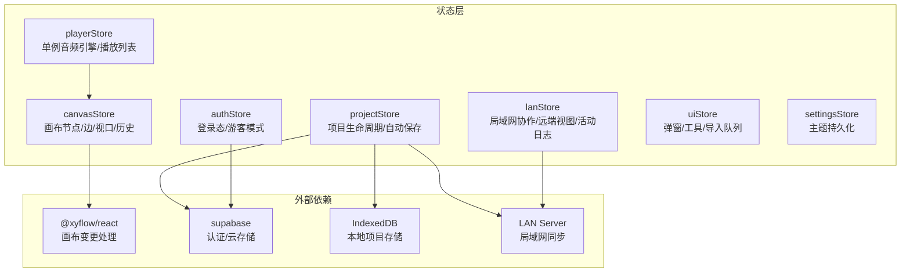
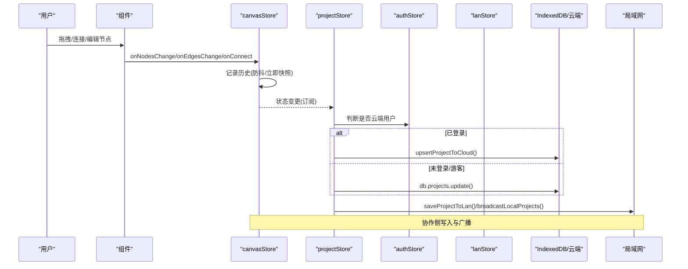
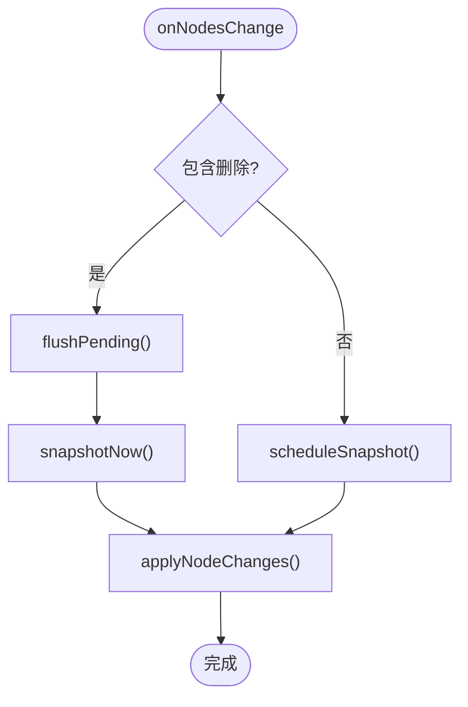
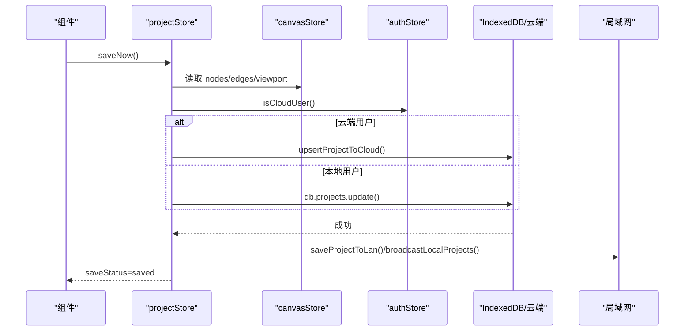
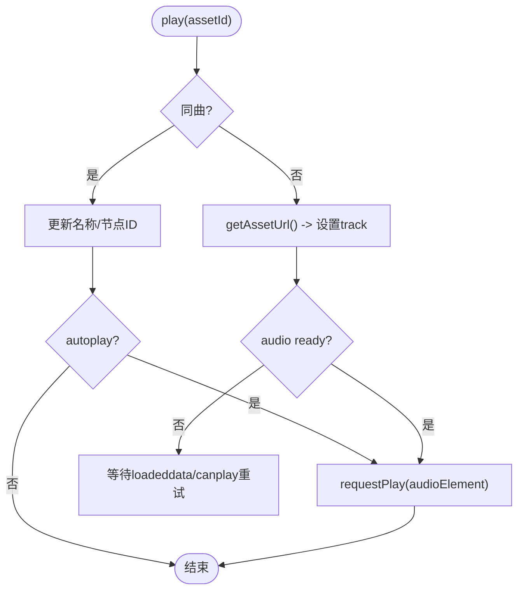
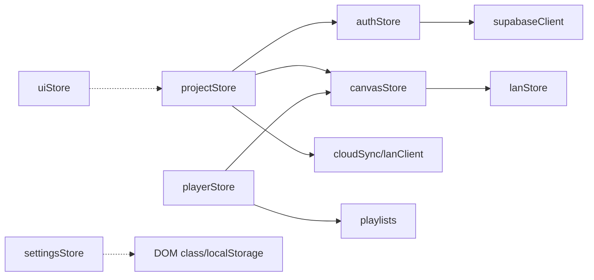

# 状态管理系统

<cite>
**本文引用的文件**
- [canvasStore.ts](file://src/store/canvasStore.ts)
- [projectStore.ts](file://src/store/projectStore.ts)
- [authStore.ts](file://src/store/authStore.ts)
- [lanStore.ts](file://src/store/lanStore.ts)
- [uiStore.ts](file://src/store/uiStore.ts)
- [settingsStore.ts](file://src/store/settingsStore.ts)
- [playerStore.ts](file://src/store/playerStore.ts)
- [types.ts](file://src/types.ts)
- [canvasStore.test.ts](file://src/store/canvasStore.test.ts)
</cite>

## 目录
1. [简介](#简介)
2. [项目结构](#项目结构)
3. [核心组件](#核心组件)
4. [架构总览](#架构总览)
5. [详细组件分析](#详细组件分析)
6. [依赖关系分析](#依赖关系分析)
7. [性能与最佳实践](#性能与最佳实践)
8. [故障排查指南](#故障排查指南)
9. [结论](#结论)
10. [附录：使用示例](#附录使用示例)

## 简介
本仓库采用 Zustand 构建全局状态管理，围绕画布、项目、认证、协作、UI、设置与播放器七大领域划分 Store。整体设计遵循“单一职责、单向数据流、可撤销/重做、自动保存、云端/本地双写、局域网协作”的原则，确保在复杂交互场景下仍具备高内聚、低耦合的可维护性。

## 项目结构
状态管理代码集中在 src/store 目录下，每个 Store 负责一个业务域；类型定义集中在 src/types.ts；测试覆盖关键行为（如 canvasStore）。

图表来源
- [canvasStore.ts:1-12](file://src/store/canvasStore.ts#L1-L12)
- [projectStore.ts:1-18](file://src/store/projectStore.ts#L1-L18)
- [authStore.ts:1-7](file://src/store/authStore.ts#L1-L7)
- [lanStore.ts:1-3](file://src/store/lanStore.ts#L1-L3)
- [playerStore.ts:1-8](file://src/store/playerStore.ts#L1-L8)

章节来源
- [canvasStore.ts:1-12](file://src/store/canvasStore.ts#L1-L12)
- [projectStore.ts:1-18](file://src/store/projectStore.ts#L1-L18)
- [authStore.ts:1-7](file://src/store/authStore.ts#L1-L7)
- [lanStore.ts:1-3](file://src/store/lanStore.ts#L1-L3)
- [playerStore.ts:1-8](file://src/store/playerStore.ts#L1-L8)

## 核心组件
- canvasStore：画布节点、边、视口、复制粘贴、对齐、层级、撤销/重做、资源删除等。
- projectStore：项目创建、加载、重命名、保存（自动/手动）、云端/本地双写、局域网广播。
- authStore：Supabase 登录态、游客模式、登录/登出时重置项目与画布状态。
- lanStore：局域网用户、光标、编辑中状态、活动日志、远端项目列表与视图跟随。
- uiStore：Toast、PDF/图片/Markdown 查看器、播放器页入口、工具模式、导入队列。
- settingsStore：主题切换并持久化到 localStorage。
- playerStore：全局唯一音频引擎，支持顺序/随机/循环/单曲/流式播放，基于画布连线解析播放顺序。

章节来源
- [canvasStore.ts:33-59](file://src/store/canvasStore.ts#L33-L59)
- [projectStore.ts:21-34](file://src/store/projectStore.ts#L21-L34)
- [authStore.ts:8-16](file://src/store/authStore.ts#L8-L16)
- [lanStore.ts:53-89](file://src/store/lanStore.ts#L53-L89)
- [uiStore.ts:18-45](file://src/store/uiStore.ts#L18-L45)
- [settingsStore.ts:7-11](file://src/store/settingsStore.ts#L7-L11)
- [playerStore.ts:25-50](file://src/store/playerStore.ts#L25-L50)

## 架构总览
Zustand Store 之间通过函数调用与订阅形成清晰的数据流：
- 用户操作触发 UI 或画布事件，更新 canvasStore。
- projectStore 订阅 canvasStore 变化，延迟自动保存到 IndexedDB 或云端，并广播到局域网。
- authStore 控制登录态，影响 projectStore 的存储策略（仅云端或仅本地）。
- playerStore 读取 canvasStore 的节点信息以解析流式播放顺序。
- lanStore 提供协作元数据（用户、光标、活动），被 canvasStore 用于插入元数据。

图表来源
- [canvasStore.ts:126-158](file://src/store/canvasStore.ts#L126-L158)
- [projectStore.ts:46-67](file://src/store/projectStore.ts#L46-L67)
- [projectStore.ts:196-228](file://src/store/projectStore.ts#L196-L228)
- [authStore.ts:31-42](file://src/store/authStore.ts#L31-L42)

## 详细组件分析

### canvasStore：画布状态管理
- 数据结构
  - nodes/edges：画布节点与边集合，类型来自 types.ts 的 SuqNode/SuqEdge。
  - viewport：当前视口位置与缩放。
  - past/future：撤销/重做栈，限制长度 HISTORY_LIMIT=50。
  - clipboard：临时剪贴板，结构化克隆选中节点。
- 核心方法
  - onNodesChange/onEdgesChange：基于 @xyflow/react 的 apply*Changes 应用变更；删除操作立即落历史，其他变更防抖合并。
  - onConnect：生成默认样式边并加入 edges。
  - addNodes/addEdge/updateNodeData/updateEdgeData：带插入元数据（创建者、时间）与历史快照。
  - duplicateNode：复制节点并偏移位置，重新注入元数据。
  - copySelected/pasteClipboard：复制选中节点及它们之间的边，粘贴时重映射 ID。
  - changeNodeLayer/setNodeZIndex：调整节点层级，计算 rank 并回写 zIndex。
  - removeAssets：按 assetId 批量移除关联节点与边。
  - alignSelected：左/右/顶/底/水平居中/垂直居中/水平分布/垂直分布。
  - undo/redo/clearHistory：撤销/重做/清空历史。
  - setViewport/reset：更新视口/重置画布。
- 历史机制
  - 防抖合并：HISTORY_DEBOUNCE=400ms，减少频繁快照。
  - 去重：相邻相同状态不重复入栈。
  - 删除操作即时落栈，保证删除可撤销。
- 复杂度
  - 对齐算法 O(n log n) 排序 + O(n) 遍历；复制粘贴 O(n)。
  - 层级调整 O(n) 排序与定位。

图表来源
- [canvasStore.ts:126-145](file://src/store/canvasStore.ts#L126-L145)
- [canvasStore.ts:66-107](file://src/store/canvasStore.ts#L66-L107)

章节来源
- [canvasStore.ts:33-59](file://src/store/canvasStore.ts#L33-L59)
- [canvasStore.ts:66-107](file://src/store/canvasStore.ts#L66-L107)
- [canvasStore.ts:126-158](file://src/store/canvasStore.ts#L126-L158)
- [canvasStore.ts:159-246](file://src/store/canvasStore.ts#L159-L246)
- [canvasStore.ts:247-399](file://src/store/canvasStore.ts#L247-L399)
- [types.ts:66-112](file://src/types.ts#L66-L112)
- [canvasStore.test.ts:21-147](file://src/store/canvasStore.test.ts#L21-L147)

### projectStore：项目管理状态
- 生命周期
  - init：同步项目列表，加载最新项目或初始化空画布，安装自动保存监听。
  - loadProject：加载指定项目，清理历史，加入局域网项目。
  - newProject：创建新项目，根据登录态选择云端或本地存储，加入局域网。
  - renameProject：更新名称，云端或本地更新，广播项目列表。
  - saveNow：收集当前画布状态，云端/本地保存，广播局域网。
- 自动保存
  - 订阅 canvasStore 变化，去重后延迟 AUTOSAVE_DELAY=500ms 触发保存。
  - 避免重复保存（saveStatus 状态机 idle/saving/saved/error）。
- 存储策略
  - isCloudUser：若已登录则仅写云端；否则仅写本地 IndexedDB。
  - 保存成功后写入局域网并广播项目列表。
- 错误处理
  - 捕获异常并 toast 提示，设置 saveStatus 为 error。

图表来源
- [projectStore.ts:46-67](file://src/store/projectStore.ts#L46-L67)
- [projectStore.ts:196-228](file://src/store/projectStore.ts#L196-L228)
- [authStore.ts:31-42](file://src/store/authStore.ts#L31-L42)

章节来源
- [projectStore.ts:21-34](file://src/store/projectStore.ts#L21-L34)
- [projectStore.ts:46-67](file://src/store/projectStore.ts#L46-L67)
- [projectStore.ts:81-182](file://src/store/projectStore.ts#L81-L182)
- [projectStore.ts:196-228](file://src/store/projectStore.ts#L196-L228)

### authStore：认证状态
- 状态字段
  - user/guest/loading：登录用户、游客模式、初始化中。
- 能力
  - init：检测 Supabase 可用性，LAN 模式下读取本地配置；注册 onAuthStateChange 监听；获取当前会话。
  - signIn/signOut：封装错误翻译与退出逻辑。
  - enterGuest：进入游客模式，重置项目与画布状态。
- 联动
  - 登录/退出/进入游客均会 resetProjectState，防止云端/本地数据串写。

章节来源
- [authStore.ts:8-16](file://src/store/authStore.ts#L8-L16)
- [authStore.ts:31-42](file://src/store/authStore.ts#L31-L42)
- [authStore.ts:49-103](file://src/store/authStore.ts#L49-L103)

### lanStore：协作状态
- 状态字段
  - status/url/name/selfId/users/followId/remoteViewport/activeProjectId/remoteProjects/cursors/editing/activities。
- 能力
  - 用户管理：setUsers/removeUser/setFollowId。
  - 远端视图：setRemoteViewport/clearRemoteViewport。
  - 项目共享：setSharedProjects/mergeRemoteProjects/removeRemoteProjectsByOwner/clearRemoteProjects。
  - 光标与编辑中：setCursor/removeCursor/setEditing/clearEditing。
  - 活动日志：addActivity（保留最近 100 条）。
  - 清理：clearCollaborationState。

章节来源
- [lanStore.ts:4-51](file://src/store/lanStore.ts#L4-L51)
- [lanStore.ts:53-89](file://src/store/lanStore.ts#L53-L89)
- [lanStore.ts:91-159](file://src/store/lanStore.ts#L91-L159)

### uiStore：UI 状态
- 能力
  - Toast：pushToast/removeToast，自动消失。
  - 导入队列：requestImport/consumeImport 原子消费。
  - 查看器：PDF/图片/Markdown 打开/关闭。
  - 播放器页：openPlayerPage/closePlayerPage。
  - 音乐播放器入口：openMusicPlayer。
  - 工具模式：tool/setTool。
- 注意
  - 提供全局 toast 便捷函数。

章节来源
- [uiStore.ts:18-45](file://src/store/uiStore.ts#L18-L45)
- [uiStore.ts:49-121](file://src/store/uiStore.ts#L49-L121)

### settingsStore：设置状态
- 能力
  - setTheme/toggleTheme：切换主题并持久化到 localStorage。
  - applyTheme：动态切换根元素 class。
- 初始化
  - 优先 URL 参数 theme，其次 localStorage，默认 dark。

章节来源
- [settingsStore.ts:7-11](file://src/store/settingsStore.ts#L7-L11)
- [settingsStore.ts:13-27](file://src/store/settingsStore.ts#L13-L27)
- [settingsStore.ts:29-39](file://src/store/settingsStore.ts#L29-L39)

### playerStore：播放器状态
- 能力
  - play/toggle/seekTo/seekBy/next/prev/setVolume/setMuted/setMode/setQueue/stop/setBarVisible。
- 播放顺序
  - baseOrder：歌单队列 > 播放器列表提供者 > 画布连线顺序（线性化）。
  - handleEnded：自动续播，支持顺序/随机/循环/单曲。
- 与画布联动
  - findNodeIdFor/graphOrderFor：从 canvasStore 节点解析播放顺序。
- 竞态保护
  - playSeq 令牌：快速连续 play 只应用最后一次。

图表来源
- [playerStore.ts:174-209](file://src/store/playerStore.ts#L174-L209)
- [playerStore.ts:97-116](file://src/store/playerStore.ts#L97-L116)
- [playerStore.ts:132-161](file://src/store/playerStore.ts#L132-L161)

章节来源
- [playerStore.ts:25-50](file://src/store/playerStore.ts#L25-L50)
- [playerStore.ts:90-116](file://src/store/playerStore.ts#L90-L116)
- [playerStore.ts:132-161](file://src/store/playerStore.ts#L132-L161)
- [playerStore.ts:174-298](file://src/store/playerStore.ts#L174-L298)

## 依赖关系分析
- canvasStore 依赖 @xyflow/react 进行变更处理，依赖 lanStore 获取插入元数据。
- projectStore 依赖 authStore 决定存储后端，依赖 canvasStore 读取画布数据，依赖 cloudSync/lanClient 实现多端同步。
- playerStore 依赖 canvasStore 解析播放顺序，依赖 media/playlists 线性化连线。
- authStore 依赖 supabaseClient 与 buildMode 判断环境。
- uiStore 独立，但被 projectStore 用于错误提示。
- settingsStore 独立，仅操作 DOM class 与 localStorage。

图表来源
- [canvasStore.ts:1-6](file://src/store/canvasStore.ts#L1-L6)
- [projectStore.ts:1-18](file://src/store/projectStore.ts#L1-L18)
- [playerStore.ts:1-8](file://src/store/playerStore.ts#L1-L8)
- [authStore.ts:1-7](file://src/store/authStore.ts#L1-L7)

章节来源
- [canvasStore.ts:1-6](file://src/store/canvasStore.ts#L1-L6)
- [projectStore.ts:1-18](file://src/store/projectStore.ts#L1-L18)
- [playerStore.ts:1-8](file://src/store/playerStore.ts#L1-L8)
- [authStore.ts:1-7](file://src/store/authStore.ts#L1-L7)

## 性能与最佳实践
- 历史快照防抖：canvasStore 将非删除变更合并到 400ms 窗口，降低频繁 setState 开销。
- 去重入栈：相邻相同状态不入栈，减少历史膨胀。
- 自动保存节流：projectStore 对画布变化延迟 500ms 保存，避免 IO 风暴。
- 结构化克隆：copySelected 使用 structuredClone 避免引用污染。
- 层级计算优化：changeNodeLayer 先排序再定位，避免多次全量扫描。
- 播放竞态保护：playerStore 使用 playSeq 令牌避免快速切歌导致的状态错乱。
- 订阅最小化：仅在必要处订阅（如 projectStore 订阅 canvasStore），避免全局重渲染。

[本节为通用指导，无需具体文件引用]

## 故障排查指南
- 自动保存失败
  - 现象：saveStatus 变为 error，toast 提示“自动保存失败”。
  - 排查：检查网络/权限/数据库连接；确认 isCloudUser 分支是否正确。
  - 参考路径：[projectStore.ts:196-228](file://src/store/projectStore.ts#L196-L228)
- 登录/退出后数据串写
  - 现象：登录后仍看到本地项目或反之。
  - 原因：未正确重置项目与画布状态。
  - 修复：确保 signOut/enterGuest 调用 resetProjectState。
  - 参考路径：[authStore.ts:31-42](file://src/store/authStore.ts#L31-L42)
- 撤销/重做无效
  - 现象：undo/redo 无效果。
  - 可能原因：历史为空或被 clearHistory；删除操作未触发立即快照。
  - 排查：确认 onNodesChange/onEdgesChange 分支逻辑。
  - 参考路径：[canvasStore.ts:126-145](file://src/store/canvasStore.ts#L126-L145), [canvasStore.ts:362-391](file://src/store/canvasStore.ts#L362-L391)
- 播放顺序不符合预期
  - 现象：next/prev 未按连线顺序播放。
  - 排查：确认 graphOrderFor 能解析到 nodeId；检查 orderProvider 是否返回有效列表。
  - 参考路径：[playerStore.ts:97-116](file://src/store/playerStore.ts#L97-L116), [playerStore.ts:132-161](file://src/store/playerStore.ts#L132-L161)

章节来源
- [projectStore.ts:196-228](file://src/store/projectStore.ts#L196-L228)
- [authStore.ts:31-42](file://src/store/authStore.ts#L31-L42)
- [canvasStore.ts:126-145](file://src/store/canvasStore.ts#L126-L145)
- [canvasStore.ts:362-391](file://src/store/canvasStore.ts#L362-L391)
- [playerStore.ts:97-116](file://src/store/playerStore.ts#L97-L116)
- [playerStore.ts:132-161](file://src/store/playerStore.ts#L132-L161)

## 结论
该状态管理系统以 Zustand 为核心，围绕画布、项目、认证、协作、UI、设置与播放器构建了清晰的职责边界与数据流。通过历史快照、自动保存、云端/本地双写与局域网协作，实现了高可用与可扩展的状态管理方案。建议在新增功能时遵循现有模式：明确 Store 职责、使用订阅而非轮询、保持不可变更新、合理节流与去重。

[本节为总结，无需具体文件引用]

## 附录：使用示例
以下示例展示如何在组件中正确使用各 Store 的 API（以描述为主，不包含代码片段）：

- 在画布组件中使用 canvasStore
  - 订阅 nodes/edges/viewport 以渲染画布。
  - 将 @xyflow/react 的 onNodesChange/onEdgesChange/onConnect 回调传入 useCanvasStore.getState().onNodesChange 等方法。
  - 使用 addNodes/addEdge/updateNodeData/updateEdgeData 进行增改。
  - 使用 copySelected/pasteClipboard/duplicateNode/changeNodeLayer/alignSelected 实现编辑能力。
  - 使用 undo/redo/clearHistory 实现撤销重做。
  - 参考路径：[canvasStore.ts:126-158](file://src/store/canvasStore.ts#L126-L158), [canvasStore.ts:159-246](file://src/store/canvasStore.ts#L159-L246), [canvasStore.ts:247-399](file://src/store/canvasStore.ts#L247-L399)

- 在项目页面中使用 projectStore
  - 调用 init 初始化项目列表与自动保存。
  - 使用 newProject/loadProject/renameProject/saveNow 管理项目生命周期。
  - 监听 saveStatus 显示保存状态。
  - 参考路径：[projectStore.ts:81-182](file://src/store/projectStore.ts#L81-L182), [projectStore.ts:196-228](file://src/store/projectStore.ts#L196-L228)

- 在认证页面中使用 authStore
  - 调用 init 初始化登录态。
  - 使用 signIn/signOut/enterGuest 处理登录流程。
  - 参考路径：[authStore.ts:49-103](file://src/store/authStore.ts#L49-L103)

- 在协作面板中使用 lanStore
  - 使用 setStatus/setUrl/setName/setSelfId 设置连接信息。
  - 使用 setUsers/setCursor/setEditing/addActivity 更新协作状态。
  - 使用 setRemoteViewport/clearRemoteViewport 跟随远端视图。
  - 参考路径：[lanStore.ts:91-159](file://src/store/lanStore.ts#L91-L159)

- 在 UI 组件中使用 uiStore
  - 使用 pushToast/removeToast 显示消息。
  - 使用 openImageViewer/openPdfViewer/openMarkdownViewer 打开查看器。
  - 使用 openPlayerPage/openMusicPlayer 打开播放器相关界面。
  - 使用 requestImport/consumeImport 处理文件导入队列。
  - 参考路径：[uiStore.ts:49-121](file://src/store/uiStore.ts#L49-L121)

- 在设置面板中使用 settingsStore
  - 使用 setTheme/toggleTheme 切换主题。
  - 参考路径：[settingsStore.ts:29-39](file://src/store/settingsStore.ts#L29-L39)

- 在播放器组件中使用 playerStore
  - 使用 play/toggle/seekTo/seekBy/next/prev 控制播放。
  - 使用 setMode/setQueue 设置播放模式与队列。
  - 参考路径：[playerStore.ts:174-298](file://src/store/playerStore.ts#L174-L298)

章节来源
- [canvasStore.ts:126-158](file://src/store/canvasStore.ts#L126-L158)
- [projectStore.ts:81-182](file://src/store/projectStore.ts#L81-L182)
- [authStore.ts:49-103](file://src/store/authStore.ts#L49-L103)
- [lanStore.ts:91-159](file://src/store/lanStore.ts#L91-L159)
- [uiStore.ts:49-121](file://src/store/uiStore.ts#L49-L121)
- [settingsStore.ts:29-39](file://src/store/settingsStore.ts#L29-L39)
- [playerStore.ts:174-298](file://src/store/playerStore.ts#L174-L298)