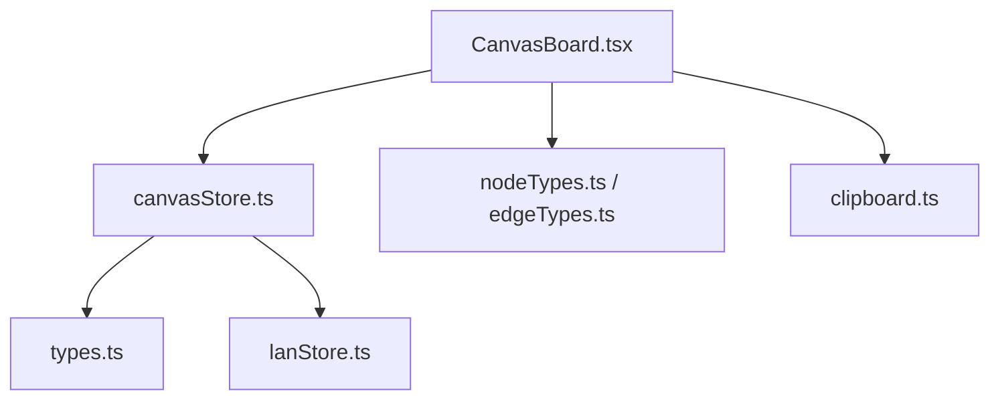
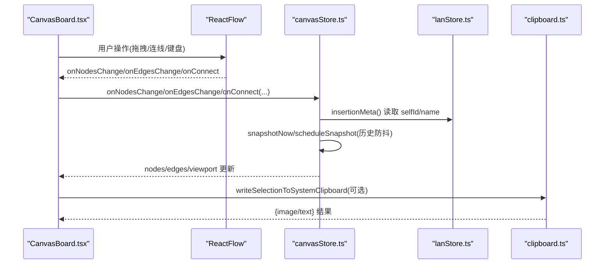
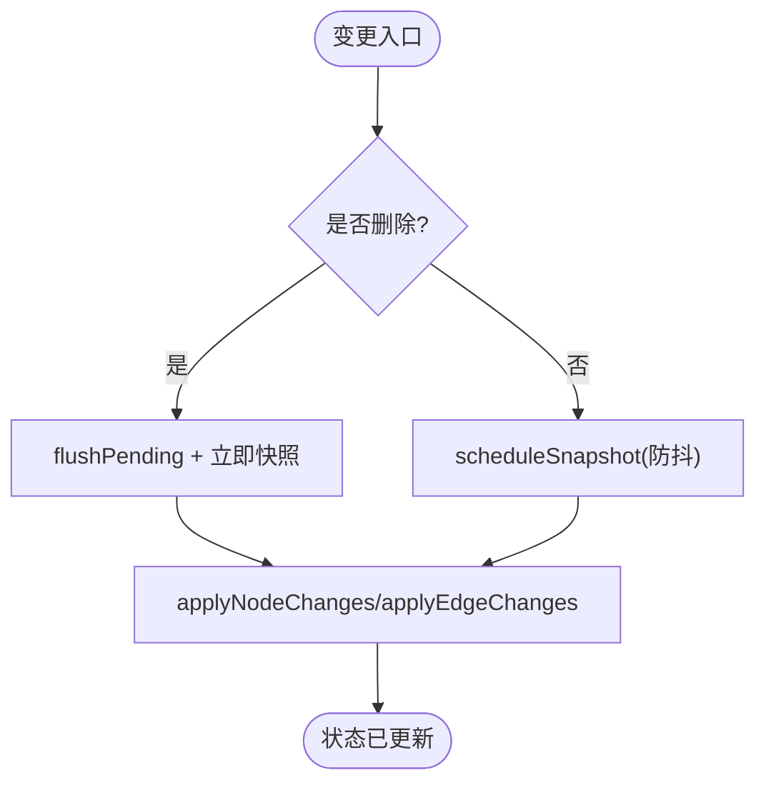
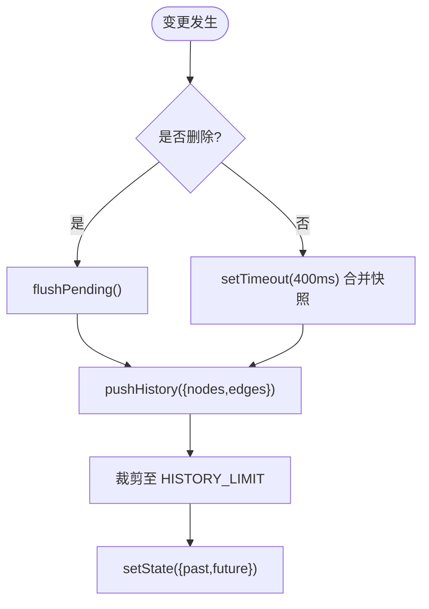
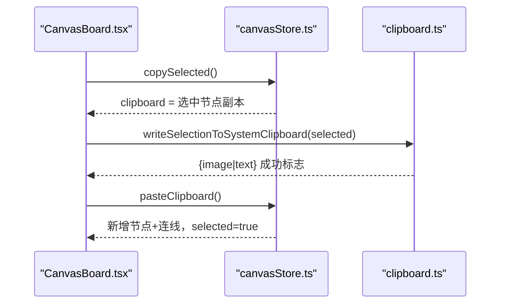
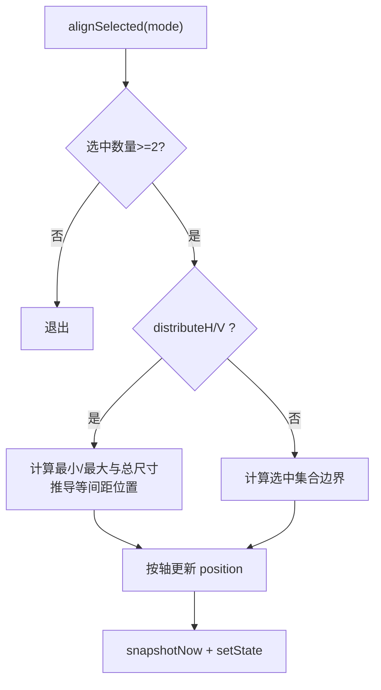
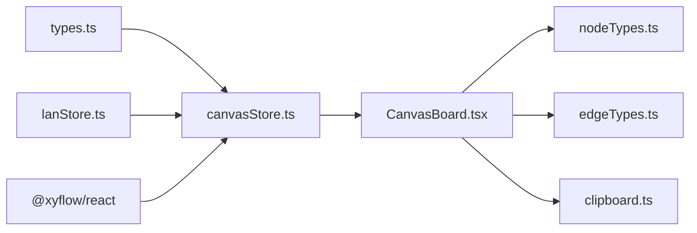

# 画布状态管理 (CanvasStore)

<cite>
**本文引用的文件**
- [canvasStore.ts](file://src/store/canvasStore.ts)
- [clipboard.ts](file://src/canvas/clipboard.ts)
- [types.ts](file://src/types.ts)
- [CanvasBoard.tsx](file://src/canvas/CanvasBoard.tsx)
- [nodeTypes.ts](file://src/canvas/nodes/nodeTypes.ts)
- [edgeTypes.ts](file://src/canvas/edges/edgeTypes.ts)
- [lanStore.ts](file://src/store/lanStore.ts)
- [canvasStore.test.ts](file://src/store/canvasStore.test.ts)
</cite>

## 目录
1. [简介](#简介)
2. [项目结构](#项目结构)
3. [核心组件](#核心组件)
4. [架构总览](#架构总览)
5. [详细组件分析](#详细组件分析)
6. [依赖关系分析](#依赖关系分析)
7. [性能考量](#性能考量)
8. [故障排查指南](#故障排查指南)
9. [结论](#结论)
10. [附录：使用示例与最佳实践](#附录使用示例与最佳实践)

## 简介
本文件围绕画布状态管理的核心实现 CanvasStore，系统性说明其节点与边的增删改查、视图口管理、撤销重做历史机制，以及节点对齐、层级调整、复制粘贴等高级能力；同时解释剪贴板机制、资产管理与批量操作的处理逻辑，并提供在组件中调用这些 API 的最佳实践。

## 项目结构
- 状态层
  - src/store/canvasStore.ts：基于 Zustand 的画布状态与行为定义（节点、边、视口、历史、剪贴板、对齐、层级、资源删除等）
  - src/store/lanStore.ts：局域网协作用户信息，用于记录新增元素的创建者元数据
- 类型层
  - src/types.ts：SuqNode、SuqEdge、EdgeStyle、MediaKind 等统一类型定义
- 渲染与交互层
  - src/canvas/CanvasBoard.tsx：ReactFlow 容器、快捷键、拖拽导入、事件桥接到 CanvasStore
  - src/canvas/nodes/nodeTypes.ts、src/canvas/edges/edgeTypes.ts：节点与边的类型注册
- 剪贴板与系统交互
  - src/canvas/clipboard.ts：将选中内容写入系统剪贴板（图片/文本），并处理 PSD 预览与 PNG 转换

图表来源
- [CanvasBoard.tsx:1-459](file://src/canvas/CanvasBoard.tsx#L1-L459)
- [canvasStore.ts:1-399](file://src/store/canvasStore.ts#L1-L399)
- [types.ts:1-112](file://src/types.ts#L1-L112)
- [nodeTypes.ts:1-27](file://src/canvas/nodes/nodeTypes.ts#L1-L27)
- [edgeTypes.ts:1-7](file://src/canvas/edges/edgeTypes.ts#L1-L7)
- [lanStore.ts:1-160](file://src/store/lanStore.ts#L1-L160)
- [clipboard.ts:1-132](file://src/canvas/clipboard.ts#L1-L132)

章节来源
- [CanvasBoard.tsx:1-459](file://src/canvas/CanvasBoard.tsx#L1-L459)
- [canvasStore.ts:1-399](file://src/store/canvasStore.ts#L1-L399)
- [types.ts:1-112](file://src/types.ts#L1-L112)
- [nodeTypes.ts:1-27](file://src/canvas/nodes/nodeTypes.ts#L1-L27)
- [edgeTypes.ts:1-7](file://src/canvas/edges/edgeTypes.ts#L1-L7)
- [lanStore.ts:1-160](file://src/store/lanStore.ts#L1-L160)
- [clipboard.ts:1-132](file://src/canvas/clipboard.ts#L1-L132)

## 核心组件
- CanvasStore（Zustand store）
  - 状态：nodes、edges、viewport、past/future（撤销重做栈）、clipboard（内部剪贴板）
  - 变更入口：onNodesChange、onEdgesChange、onConnect、addNodes、addEdge、updateNodeData、updateEdgeData
  - 高级功能：duplicateNode、copySelected、pasteClipboard、changeNodeLayer、setNodeZIndex、removeAssets、alignSelected
  - 历史控制：undo、redo、clearHistory
  - 视图控制：setViewport、reset
- 剪贴板模块
  - writeSelectionToSystemClipboard：将选中的单个图片/PSD转为PNG写入系统剪贴板，否则输出多行文本
  - selectionTextLines、selectionHtml：提取选中节点的文本内容
  - imageNodeBlob、getPsdPreviewBlob：从资产或 PSD 预览获取 Blob
- 类型与节点/边类型
  - types.ts：统一节点/边数据结构与样式默认值
  - nodeTypes.ts、edgeTypes.ts：向 ReactFlow 注册自定义节点与边类型

章节来源
- [canvasStore.ts:1-399](file://src/store/canvasStore.ts#L1-L399)
- [clipboard.ts:1-132](file://src/canvas/clipboard.ts#L1-L132)
- [types.ts:1-112](file://src/types.ts#L1-L112)
- [nodeTypes.ts:1-27](file://src/canvas/nodes/nodeTypes.ts#L1-L27)
- [edgeTypes.ts:1-7](file://src/canvas/edges/edgeTypes.ts#L1-L7)

## 架构总览
CanvasStore 作为单一事实源，集中维护画布的节点、边、视口与历史。CanvasBoard 通过 ReactFlow 的事件回调将用户操作映射到 Store 方法；剪贴板模块负责与系统剪贴板的互转；类型层保证数据结构一致性；lanStore 提供当前用户的身份信息以记录元素创建者。

图表来源
- [CanvasBoard.tsx:66-150](file://src/canvas/CanvasBoard.tsx#L66-L150)
- [canvasStore.ts:118-191](file://src/store/canvasStore.ts#L118-L191)
- [lanStore.ts:91-160](file://src/store/lanStore.ts#L91-L160)
- [clipboard.ts:114-132](file://src/canvas/clipboard.ts#L114-L132)

## 详细组件分析

### CanvasStore：节点与边的增删改查
- 节点与边变更
  - onNodesChange/onEdgesChange：基于 @xyflow/react 的 applyNodeChanges/applyEdgeChanges 应用变更；若包含删除则立即落盘快照，否则进入防抖合并的历史快照流程
- 连接建立
  - onConnect：生成 SuqEdge（含默认样式），立即入历史后追加到 edges
- 新增节点/边
  - addNodes：为每个节点补充插入元数据（createdById/createdByName/createdAt），再追加到 nodes
  - addEdge：直接追加边并记录历史
- 数据更新
  - updateNodeData/updateEdgeData：按 id 合并 data 字段并记录历史

图表来源
- [canvasStore.ts:126-145](file://src/store/canvasStore.ts#L126-L145)
- [canvasStore.ts:66-107](file://src/store/canvasStore.ts#L66-L107)

章节来源
- [canvasStore.ts:126-191](file://src/store/canvasStore.ts#L126-L191)

### 视图口管理
- setViewport：保存 viewport
- CanvasBoard 初始化时同步一次远端/本地视口；监听远程视口变化并平滑过渡；移动结束时持久化到 Store

章节来源
- [canvasStore.ts:392-394](file://src/store/canvasStore.ts#L392-L394)
- [CanvasBoard.tsx:88-102](file://src/canvas/CanvasBoard.tsx#L88-L102)
- [CanvasBoard.tsx:351-353](file://src/canvas/CanvasBoard.tsx#L351-L353)

### 撤销重做历史机制
- 历史条目：{ nodes, edges }
- 限制与防抖：HISTORY_LIMIT=50，HISTORY_DEBOUNCE=400ms；相同状态不重复入栈
- 触发时机：
  - 删除类变更：立即 flush 并快照
  - 其他变更：延迟合并后快照
- undo/redo：在 past/future 之间迁移，保持最大长度
- clearHistory：清空待提交快照与定时器，重置历史栈

图表来源
- [canvasStore.ts:66-107](file://src/store/canvasStore.ts#L66-L107)
- [canvasStore.ts:362-391](file://src/store/canvasStore.ts#L362-L391)

章节来源
- [canvasStore.ts:66-107](file://src/store/canvasStore.ts#L66-L107)
- [canvasStore.ts:362-391](file://src/store/canvasStore.ts#L362-L391)

### 复制粘贴与系统剪贴板
- 内部剪贴板
  - copySelected：收集 selected=true 的节点，深拷贝并清除 selected/dragging
  - pasteClipboard：为新节点分配新 id，偏移位置，保留选中态；同时复制被选中节点之间的连线并重连到新 id
- 系统剪贴板
  - writeSelectionToSystemClipboard：若仅选中一个图片/PSD，转换为 PNG 写入系统剪贴板；否则将多个节点的文本行写入
  - 支持回退策略：浏览器不支持 ClipboardItem 或解码失败时退回文本复制

图表来源
- [canvasStore.ts:205-246](file://src/store/canvasStore.ts#L205-L246)
- [clipboard.ts:114-132](file://src/canvas/clipboard.ts#L114-L132)
- [CanvasBoard.tsx:128-135](file://src/canvas/CanvasBoard.tsx#L128-L135)

章节来源
- [canvasStore.ts:205-246](file://src/store/canvasStore.ts#L205-L246)
- [clipboard.ts:1-132](file://src/canvas/clipboard.ts#L1-L132)
- [CanvasBoard.tsx:128-135](file://src/canvas/CanvasBoard.tsx#L128-L135)

### 节点对齐与分布
- alignSelected(mode)：
  - left/right/top/bottom：对齐到选中集合的边界
  - centerH/centerV：水平/垂直居中于选中集合
  - distributeH/distributeV：等间距分布（至少三个元素）
- 尺寸计算：优先使用 width/height/style.width/height，其次 measured，最后回退默认值

图表来源
- [canvasStore.ts:290-361](file://src/store/canvasStore.ts#L290-L361)

章节来源
- [canvasStore.ts:290-361](file://src/store/canvasStore.ts#L290-L361)

### 层级调整
- changeNodeLayer(id, mode)：front/forward/backward/back 四种模式，先排序再移动目标节点，重新计算 zIndex
- setNodeZIndex(id, value)：设置具体层级，限制为 0~9999 整数

章节来源
- [canvasStore.ts:247-274](file://src/store/canvasStore.ts#L247-L274)

### 资产管理与批量删除
- removeAssets(assetIds)：根据 assetId 找到所有关联节点，删除这些节点及其相连的边（若边两端任一节点被删除）

章节来源
- [canvasStore.ts:275-289](file://src/store/canvasStore.ts#L275-L289)

### 节点类型与边类型
- mediaNodeTypes：注册图像、视频、音频、PDF、PSD、Markdown、文本、标题、便签、形状等节点
- styledEdgeTypes：注册带样式的边类型

章节来源
- [nodeTypes.ts:1-27](file://src/canvas/nodes/nodeTypes.ts#L1-L27)
- [edgeTypes.ts:1-7](file://src/canvas/edges/edgeTypes.ts#L1-L7)

## 依赖关系分析
- CanvasStore 依赖
  - @xyflow/react：节点/边变更应用、视口类型
  - zustand：状态管理
  - lanStore：获取当前用户身份以填充插入元数据
  - types：统一的数据结构与默认样式
- CanvasBoard 依赖
  - canvasStore：读写状态与调用方法
  - clipboard：系统剪贴板写入
  - nodeTypes/edgeTypes：注册节点与边类型
  - uiStore/settingsStore/projectStore/lanStore：工具模式、主题、项目上下文、协作状态

图表来源
- [canvasStore.ts:1-118](file://src/store/canvasStore.ts#L1-L118)
- [CanvasBoard.tsx:1-459](file://src/canvas/CanvasBoard.tsx#L1-L459)
- [types.ts:1-112](file://src/types.ts#L1-L112)
- [nodeTypes.ts:1-27](file://src/canvas/nodes/nodeTypes.ts#L1-L27)
- [edgeTypes.ts:1-7](file://src/canvas/edges/edgeTypes.ts#L1-L7)
- [lanStore.ts:1-160](file://src/store/lanStore.ts#L1-L160)
- [clipboard.ts:1-132](file://src/canvas/clipboard.ts#L1-L132)

章节来源
- [canvasStore.ts:1-118](file://src/store/canvasStore.ts#L1-L118)
- [CanvasBoard.tsx:1-459](file://src/canvas/CanvasBoard.tsx#L1-L459)
- [types.ts:1-112](file://src/types.ts#L1-L112)
- [nodeTypes.ts:1-27](file://src/canvas/nodes/nodeTypes.ts#L1-L27)
- [edgeTypes.ts:1-7](file://src/canvas/edges/edgeTypes.ts#L1-L7)
- [lanStore.ts:1-160](file://src/store/lanStore.ts#L1-L160)
- [clipboard.ts:1-132](file://src/canvas/clipboard.ts#L1-L132)

## 性能考量
- 历史快照防抖：对非删除变更采用 400ms 合并，减少频繁写历史带来的状态抖动与内存压力
- 历史上限：最多保留 50 条，避免无限增长
- 删除即快照：确保删除操作可精确回滚
- 对齐算法：O(n log n) 排序 + O(n) 遍历，适合常规选中规模
- 层级调整：排序 + 数组重排，注意大量节点时的性能影响
- 系统剪贴板图片转换：限制最大边长 4096，避免超大图导致卡顿

[本节为通用性能建议，不直接分析具体代码]

## 故障排查指南
- 无法撤销/重做
  - 检查是否存在未触发的 pending 快照（如长时间无操作后执行了关键操作）
  - 确认 HISTORY_LIMIT 与 HISTORY_DEBOUNCE 是否符合预期
- 复制粘贴后连线丢失
  - 确认粘贴前存在选中节点间的边；粘贴时会按新旧 id 映射重建边
- 系统剪贴板图片复制失败
  - 检查浏览器是否支持 ClipboardItem；PSD 预览生成是否成功；图片解码是否异常
- 对齐无效
  - 确保选中节点数≥2；distributeH/V 需要≥3个节点
- 层级设置异常
  - setNodeZIndex 会强制取整并限制范围 0~9999

章节来源
- [canvasStore.ts:66-107](file://src/store/canvasStore.ts#L66-L107)
- [canvasStore.ts:290-361](file://src/store/canvasStore.ts#L290-L361)
- [canvasStore.ts:247-274](file://src/store/canvasStore.ts#L247-L274)
- [clipboard.ts:46-70](file://src/canvas/clipboard.ts#L46-L70)
- [clipboard.ts:99-107](file://src/canvas/clipboard.ts#L99-L107)

## 结论
CanvasStore 以简洁的状态模型和清晰的操作接口，实现了画布的核心能力：节点与边的 CRUD、视图口管理、撤销重做、对齐与层级、复制粘贴与系统剪贴板互通、资产管理与批量删除。配合 CanvasBoard 的交互封装与类型约束，形成稳定可扩展的画布状态管理体系。

[本节为总结性内容，不直接分析具体代码]

## 附录：使用示例与最佳实践

- 添加节点
  - 在 CanvasBoard 中双击空白处或通过工具栏事件，调用 addNodes 传入节点数组；节点会自动携带插入元数据
  - 参考路径：[CanvasBoard.tsx:234-242](file://src/canvas/CanvasBoard.tsx#L234-L242)、[canvasStore.ts:159-171](file://src/store/canvasStore.ts#L159-L171)
- 更新节点数据
  - 使用 updateNodeData(id, partialData) 合并字段，自动记录历史
  - 参考路径：[canvasStore.ts:176-183](file://src/store/canvasStore.ts#L176-L183)
- 处理连线
  - 通过 onConnect 回调由 Store 生成边；也可用 addEdge 手动添加
  - 参考路径：[canvasStore.ts:146-158](file://src/store/canvasStore.ts#L146-L158)、[canvasStore.ts:172-175](file://src/store/canvasStore.ts#L172-L175)
- 复制粘贴
  - 快捷键 Ctrl/Cmd+C 调用 copySelected，并尝试写入系统剪贴板；Ctrl/Cmd+V 调用 pasteClipboard
  - 参考路径：[CanvasBoard.tsx:128-135](file://src/canvas/CanvasBoard.tsx#L128-L135)、[canvasStore.ts:205-246](file://src/store/canvasStore.ts#L205-L246)、[clipboard.ts:114-132](file://src/canvas/clipboard.ts#L114-L132)
- 对齐与分布
  - 选中多个节点后调用 alignSelected('left'|'centerH'|'right'|'top'|'centerV'|'bottom'|'distributeH'|'distributeV')
  - 参考路径：[canvasStore.ts:290-361](file://src/store/canvasStore.ts#L290-L361)
- 层级调整
  - changeNodeLayer(id, 'front'|'forward'|'backward'|'back') 或 setNodeZIndex(id, number)
  - 参考路径：[canvasStore.ts:247-274](file://src/store/canvasStore.ts#L247-L274)
- 撤销/重做
  - 快捷键 Ctrl/Cmd+Z 撤销，Shift+Z 或 Ctrl/Cmd+Y 重做
  - 参考路径：[CanvasBoard.tsx:113-122](file://src/canvas/CanvasBoard.tsx#L113-L122)、[canvasStore.ts:362-383](file://src/store/canvasStore.ts#L362-L383)
- 资源删除
  - removeAssets(['assetId']) 会删除所有引用该资源的节点及与其相关的边
  - 参考路径：[canvasStore.ts:275-289](file://src/store/canvasStore.ts#L275-L289)

章节来源
- [CanvasBoard.tsx:113-135](file://src/canvas/CanvasBoard.tsx#L113-L135)
- [CanvasBoard.tsx:234-242](file://src/canvas/CanvasBoard.tsx#L234-L242)
- [canvasStore.ts:146-183](file://src/store/canvasStore.ts#L146-L183)
- [canvasStore.ts:205-289](file://src/store/canvasStore.ts#L205-L289)
- [canvasStore.ts:290-383](file://src/store/canvasStore.ts#L290-L383)
- [clipboard.ts:114-132](file://src/canvas/clipboard.ts#L114-L132)