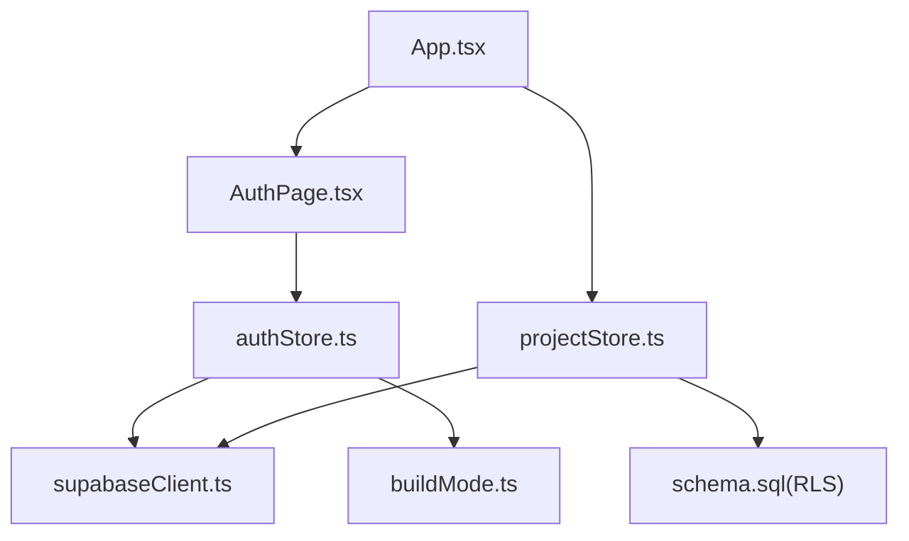
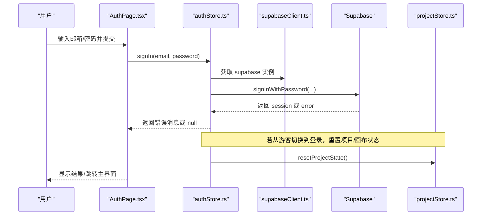
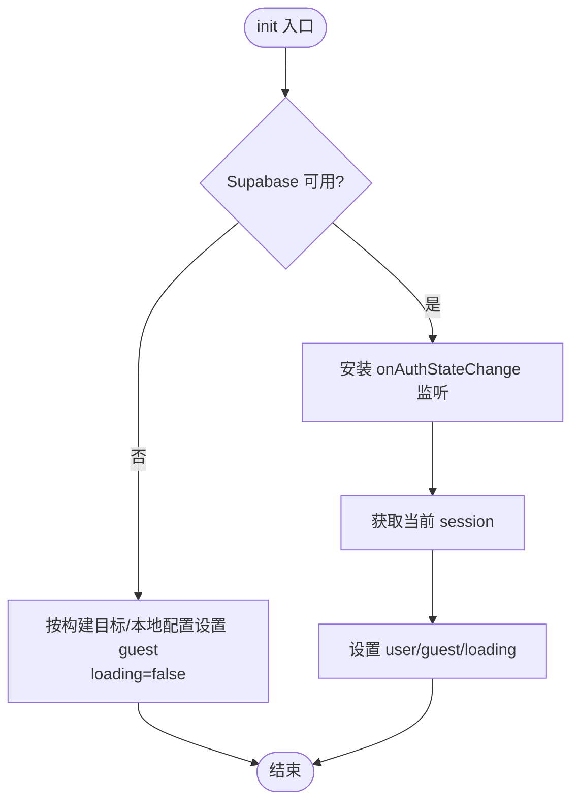
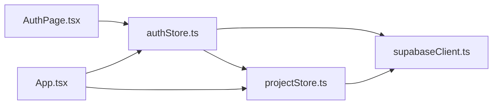

# 认证状态管理 (AuthStore)

<cite>
**本文引用的文件**
- [src/store/authStore.ts](file://src/store/authStore.ts)
- [src/sync/supabaseClient.ts](file://src/sync/supabaseClient.ts)
- [src/components/AuthPage.tsx](file://src/components/AuthPage.tsx)
- [src/App.tsx](file://src/App.tsx)
- [src/store/projectStore.ts](file://src/store/projectStore.ts)
- [src/buildMode.ts](file://src/buildMode.ts)
- [supabase/schema.sql](file://supabase/schema.sql)
</cite>

## 目录
1. [简介](#简介)
2. [项目结构](#项目结构)
3. [核心组件](#核心组件)
4. [架构总览](#架构总览)
5. [详细组件分析](#详细组件分析)
6. [依赖关系分析](#依赖关系分析)
7. [性能与并发特性](#性能与并发特性)
8. [故障排查指南](#故障排查指南)
9. [结论](#结论)
10. [附录：示例用法](#附录示例用法)

## 简介
本文件围绕 AuthStore 的认证状态管理进行系统化说明，覆盖登录、登出、会话监听与同步、游客模式、权限控制（基于 Supabase RLS）、错误处理策略，以及与项目/画布状态的联动。文档同时给出在 React 中调用认证流程的示例路径，帮助快速集成用户登录验证、权限检查与会话维护。

## 项目结构
认证相关代码主要分布在以下模块：
- 认证状态与流程：store/authStore.ts
- 认证客户端封装：sync/supabaseClient.ts
- 认证页面与交互：components/AuthPage.tsx
- 应用入口与路由切换：App.tsx
- 项目数据与存储策略：store/projectStore.ts
- 构建目标判定：buildMode.ts
- 数据库与权限策略：supabase/schema.sql

图表来源
- [src/App.tsx:19-47](file://src/App.tsx#L19-L47)
- [src/components/AuthPage.tsx:11-73](file://src/components/AuthPage.tsx#L11-L73)
- [src/store/authStore.ts:44-103](file://src/store/authStore.ts#L44-L103)
- [src/sync/supabaseClient.ts:1-18](file://src/sync/supabaseClient.ts#L1-L18)
- [src/store/projectStore.ts:38-41](file://src/store/projectStore.ts#L38-L41)
- [supabase/schema.sql:57-77](file://supabase/schema.sql#L57-L77)

章节来源
- [src/App.tsx:19-47](file://src/App.tsx#L19-L47)
- [src/components/AuthPage.tsx:11-73](file://src/components/AuthPage.tsx#L11-L73)
- [src/store/authStore.ts:44-103](file://src/store/authStore.ts#L44-L103)
- [src/sync/supabaseClient.ts:1-18](file://src/sync/supabaseClient.ts#L1-L18)
- [src/store/projectStore.ts:38-41](file://src/store/projectStore.ts#L38-L41)
- [supabase/schema.sql:57-77](file://supabase/schema.sql#L57-L77)

## 核心组件
- AuthStore：集中管理用户会话、游客态、加载态；提供 init、signIn、signOut、enterGuest；订阅 Supabase 会话变化并联动项目/画布重置。
- Supabase 客户端：根据构建目标与环境变量创建或禁用 Supabase 实例，提供 isCloudConfigured 判断云端是否可用。
- AuthPage：登录/注册表单、局域网协作入口、游客模式入口；负责将用户输入转换为认证操作并展示错误。
- App：应用启动时初始化认证，根据 user/guest/loading 决定渲染登录页或主界面，并在进入后初始化项目。
- ProjectStore：依据当前是否为云端用户选择本地或云端存储；在切换登录态时配合 AuthStore 重置项目状态，避免串写。
- buildMode：通过构建目标常量区分局域网版与在线版，影响认证与协作行为。
- schema.sql：定义项目与素材表，启用行级安全（RLS），确保每个用户仅能访问自己的数据。

章节来源
- [src/store/authStore.ts:8-16](file://src/store/authStore.ts#L8-L16)
- [src/sync/supabaseClient.ts:1-18](file://src/sync/supabaseClient.ts#L1-L18)
- [src/components/AuthPage.tsx:11-73](file://src/components/AuthPage.tsx#L11-L73)
- [src/App.tsx:19-47](file://src/App.tsx#L19-L47)
- [src/store/projectStore.ts:38-41](file://src/store/projectStore.ts#L38-L41)
- [src/buildMode.ts:1-8](file://src/buildMode.ts#L1-L8)
- [supabase/schema.sql:11-35](file://supabase/schema.sql#L11-L35)
- [supabase/schema.sql:57-77](file://supabase/schema.sql#L57-L77)

## 架构总览
认证系统以 Zustand store 为中心，结合 Supabase 认证与会话监听，实现“登录态/游客态”的统一管理；项目数据层根据登录态自动选择本地或云端存储，并通过 RLS 保证数据安全。

图表来源
- [src/components/AuthPage.tsx:61-73](file://src/components/AuthPage.tsx#L61-L73)
- [src/store/authStore.ts:84-88](file://src/store/authStore.ts#L84-L88)
- [src/sync/supabaseClient.ts:4-13](file://src/sync/supabaseClient.ts#L4-L13)
- [src/store/authStore.ts:31-42](file://src/store/authStore.ts#L31-L42)

章节来源
- [src/components/AuthPage.tsx:61-73](file://src/components/AuthPage.tsx#L61-L73)
- [src/store/authStore.ts:31-42](file://src/store/authStore.ts#L31-L42)
- [src/store/authStore.ts:84-88](file://src/store/authStore.ts#L84-L88)
- [src/sync/supabaseClient.ts:4-13](file://src/sync/supabaseClient.ts#L4-L13)

## 详细组件分析

### AuthStore：认证状态与流程
- 状态字段
  - user：当前登录用户（来自 Supabase）
  - guest：是否处于游客模式（持久化到 localStorage）
  - loading：初始化与鉴权过程中的加载态
- 关键方法
  - init：首次加载时检测 Supabase 是否可用；若不可用则按构建目标与本地配置决定是否直接进入游客模式；若可用则安装 onAuthStateChange 监听会话变化，并读取当前 session 设置 user/guest/loading
  - signIn：调用 Supabase 密码登录，错误信息被翻译为中文提示
  - signOut：调用 Supabase 登出，清理游客标记，重置项目/画布状态
  - enterGuest：写入游客标记，重置项目/画布状态，进入游客模式
- 会话同步
  - 通过 onAuthStateChange 实时响应登录/登出事件，保持 user/guest 一致
  - 当从游客切换到登录时，重置项目/画布状态，避免云端/本地数据串写
- 错误处理
  - 对常见错误进行本地化映射（如凭据错误、邮箱未验证、无权限、限流等）

图表来源
- [src/store/authStore.ts:49-82](file://src/store/authStore.ts#L49-L82)

章节来源
- [src/store/authStore.ts:8-16](file://src/store/authStore.ts#L8-L16)
- [src/store/authStore.ts:18-25](file://src/store/authStore.ts#L18-L25)
- [src/store/authStore.ts:31-42](file://src/store/authStore.ts#L31-L42)
- [src/store/authStore.ts:49-103](file://src/store/authStore.ts#L49-L103)

### Supabase 客户端：环境感知与可用性
- 通过环境变量 VITE_SUPABASE_URL 与 VITE_SUPABASE_ANON_KEY 创建客户端
- 构建目标 IS_ONLINE_BUILD 为 false 时，产物不包含 Supabase 客户端，从而支持纯局域网版本
- 提供 isCloudConfigured 供 UI 层判断是否允许登录

章节来源
- [src/sync/supabaseClient.ts:1-18](file://src/sync/supabaseClient.ts#L1-L18)
- [src/buildMode.ts:1-8](file://src/buildMode.ts#L1-L8)

### AuthPage：登录/游客/局域网协作入口
- 登录流程：校验环境变量 -> 调用 signIn -> 展示错误
- 游客模式：点击按钮进入游客模式，后续由 App 初始化项目
- 局域网协作：在局域网构建下，引导输入中继地址与协作名称，连接成功后进入游客模式
- 状态反馈：busy/error/waitingForLan 等状态用于 UI 反馈

章节来源
- [src/components/AuthPage.tsx:11-73](file://src/components/AuthPage.tsx#L11-L73)
- [src/components/AuthPage.tsx:75-130](file://src/components/AuthPage.tsx#L75-L130)
- [src/components/AuthPage.tsx:132-238](file://src/components/AuthPage.tsx#L132-L238)

### App：应用启动与路由切换
- 启动时调用 authStore.init，完成后根据 IS_LAN_BUILD 决定是否自动重连局域网
- 根据 user/guest/loading 决定渲染登录页或主界面
- 进入主界面后打开首页并初始化项目

章节来源
- [src/App.tsx:19-47](file://src/App.tsx#L19-L47)

### ProjectStore：项目数据与存储策略
- 依据 isCloudUser（即当前是否有登录用户）决定使用云端还是本地存储
- 在登录态切换时配合 AuthStore 重置项目/画布状态，防止串写
- 自动保存与增量同步逻辑与认证态解耦，但受登录态影响存储目标

章节来源
- [src/store/projectStore.ts:38-41](file://src/store/projectStore.ts#L38-L41)
- [src/store/projectStore.ts:81-117](file://src/store/projectStore.ts#L81-L117)
- [src/store/projectStore.ts:149-182](file://src/store/projectStore.ts#L149-L182)
- [src/store/projectStore.ts:196-228](file://src/store/projectStore.ts#L196-L228)

### 权限控制：Supabase RLS
- 项目与素材表均启用行级安全（RLS），策略限定 authenticated 用户只能读写 user_id 等于当前用户的记录
- 这保证了多租户隔离与数据安全性，前端无需额外鉴权逻辑

章节来源
- [supabase/schema.sql:57-77](file://supabase/schema.sql#L57-L77)
- [supabase/schema.sql:11-35](file://supabase/schema.sql#L11-L35)

## 依赖关系分析
- 组件耦合
  - AuthPage 依赖 authStore 与 supabaseClient，以及构建目标与局域网能力
  - App 依赖 authStore、projectStore、uiStore 与局域网能力
  - authStore 依赖 supabaseClient、projectStore、canvasStore（通过 useCanvasStore.getState 间接访问）
- 外部依赖
  - Supabase 认证与会话监听
  - 构建目标常量决定运行时分支
- 潜在循环依赖
  - 通过函数式访问 store（getState/useXxxStore）避免直接循环导入

图表来源
- [src/components/AuthPage.tsx:1-7](file://src/components/AuthPage.tsx#L1-L7)
- [src/store/authStore.ts:1-7](file://src/store/authStore.ts#L1-L7)
- [src/App.tsx:1-17](file://src/App.tsx#L1-L17)
- [src/store/projectStore.ts:1-17](file://src/store/projectStore.ts#L1-L17)

章节来源
- [src/components/AuthPage.tsx:1-7](file://src/components/AuthPage.tsx#L1-L7)
- [src/store/authStore.ts:1-7](file://src/store/authStore.ts#L1-L7)
- [src/App.tsx:1-17](file://src/App.tsx#L1-L17)
- [src/store/projectStore.ts:1-17](file://src/store/projectStore.ts#L1-L17)

## 性能与并发特性
- 会话监听只安装一次，避免重复订阅
- 登录/登出操作轻量，主要开销在网络请求
- 项目/画布状态在登录态切换时重置，避免不必要的计算
- 错误提示即时反馈，减少无效等待

[本节为通用指导，不直接分析具体文件]

## 故障排查指南
- 无法登录
  - 检查环境变量是否配置正确（VITE_SUPABASE_URL、VITE_SUPABASE_ANON_KEY）
  - 确认 isCloudConfigured 返回 true
  - 查看 translateAuthError 对应的错误类型（凭据错误、邮箱未验证、无权限、限流）
- 登录后仍显示登录页
  - 检查 onAuthStateChange 是否正确触发
  - 确认 App 中 loading 状态已置为 false
- 游客模式数据异常
  - 确认 GUEST_KEY 写入成功
  - 确认 resetProjectState 已执行，避免与云端数据串写
- 局域网协作问题
  - 检查局域网地址格式与协议（ws/wss）
  - 确认防火墙与反向代理配置正确

章节来源
- [src/sync/supabaseClient.ts:4-13](file://src/sync/supabaseClient.ts#L4-L13)
- [src/store/authStore.ts:18-25](file://src/store/authStore.ts#L18-L25)
- [src/store/authStore.ts:49-82](file://src/store/authStore.ts#L49-L82)
- [src/components/AuthPage.tsx:61-73](file://src/components/AuthPage.tsx#L61-L73)

## 结论
AuthStore 以简洁的状态模型统一管理认证与会话，结合 Supabase 的会话监听实现了强一致的登录态；通过构建目标与环境变量灵活支持在线与局域网两种部署；配合 RLS 策略保障数据安全；在项目数据层根据登录态自动选择存储目标，避免串写。整体设计清晰、可扩展性强，便于后续扩展更多认证方式与权限控制。

[本节为总结性内容，不直接分析具体文件]

## 附录：示例用法
以下为常见操作的示例路径（不含具体代码内容）：
- 用户登录验证
  - 表单提交与错误展示：[src/components/AuthPage.tsx:61-73](file://src/components/AuthPage.tsx#L61-L73)
  - 调用登录并处理错误：[src/store/authStore.ts:84-88](file://src/store/authStore.ts#L84-L88)
- 权限检查（基于 RLS）
  - 后端策略限制：[supabase/schema.sql:57-77](file://supabase/schema.sql#L57-L77)
- 会话维护
  - 会话监听与状态更新：[src/store/authStore.ts:67-82](file://src/store/authStore.ts#L67-L82)
  - 应用启动初始化：[src/App.tsx:25-30](file://src/App.tsx#L25-L30)
- 登出与游客模式
  - 登出与状态重置：[src/store/authStore.ts:90-96](file://src/store/authStore.ts#L90-L96)
  - 进入游客模式：[src/store/authStore.ts:98-102](file://src/store/authStore.ts#L98-L102)

章节来源
- [src/components/AuthPage.tsx:61-73](file://src/components/AuthPage.tsx#L61-L73)
- [src/store/authStore.ts:67-82](file://src/store/authStore.ts#L67-L82)
- [src/store/authStore.ts:84-102](file://src/store/authStore.ts#L84-L102)
- [src/App.tsx:25-30](file://src/App.tsx#L25-L30)
- [supabase/schema.sql:57-77](file://supabase/schema.sql#L57-L77)